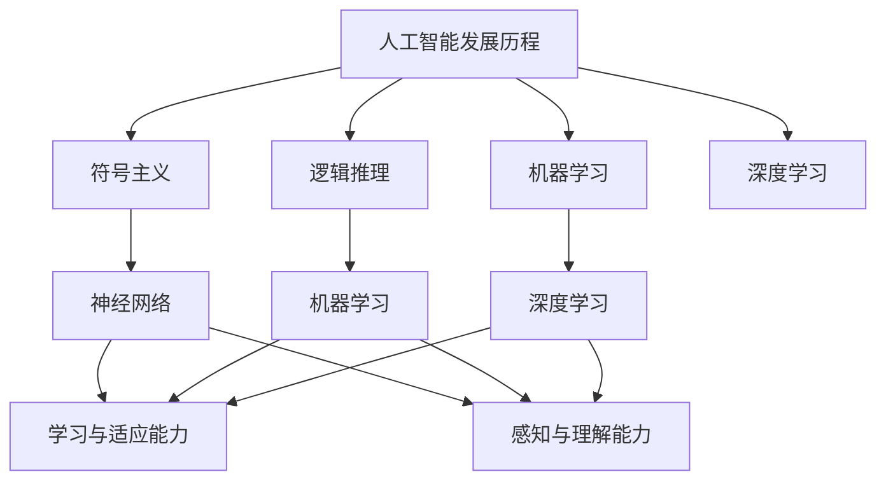

                 

关键词：人工智能，人类智能，协作，非竞争，神经网络，机器学习，深度学习，人机交互

> 摘要：本文旨在探讨人工智能与人类智能之间的关系，强调两者之间的协作而非竞争关系。通过分析人工智能的发展历程、核心原理以及实际应用，探讨人工智能如何助力人类解决问题、提升工作效率，并展望未来人工智能与人类智能协同发展的趋势与挑战。

## 1. 背景介绍

随着计算机科学和技术的飞速发展，人工智能（Artificial Intelligence，AI）已经成为当今世界最为热门的研究领域之一。人工智能是指通过计算机程序模拟人类智能，实现自主学习和推理的智能系统。从早期的符号主义、知识表示到现代的神经网络、深度学习，人工智能经历了多次技术变革，逐渐从理论研究走向实际应用。

与此同时，人类智能的发展也经历了漫长的历史。人类智慧的本质在于理解、创新、解决问题。在漫长的进化过程中，人类逐渐形成了独特的思维方式和认知能力，为人类社会的发展作出了巨大贡献。然而，随着问题的复杂性和规模不断扩大，人类面临的挑战也越来越大，需要借助人工智能的力量来应对。

本文将从以下几个方面展开讨论：

1. 核心概念与联系
2. 核心算法原理 & 具体操作步骤
3. 数学模型和公式 & 详细讲解 & 举例说明
4. 项目实践：代码实例和详细解释说明
5. 实际应用场景
6. 未来应用展望
7. 工具和资源推荐
8. 总结：未来发展趋势与挑战

通过以上讨论，我们将深入探讨人工智能与人类智能之间的协作关系，并展望未来人工智能与人类智能协同发展的前景。

## 2. 核心概念与联系

### 2.1 人工智能的发展历程

人工智能的发展历程可以分为以下几个阶段：

1. 符号主义（Symbolic AI）：20世纪50年代至70年代，人工智能研究主要集中在知识表示、推理和规划等领域。这一阶段的代表性成果包括逻辑推理机、专家系统等。
2. 逻辑推理（Logic-based AI）：20世纪70年代至80年代，人工智能研究开始关注基于逻辑的推理方法。这一阶段的代表性成果包括谓词逻辑、约束满足问题等。
3. 机器学习（Machine Learning）：20世纪80年代至21世纪初期，人工智能研究逐渐转向机器学习领域。这一阶段的代表性成果包括神经网络、支持向量机、决策树等。
4. 深度学习（Deep Learning）：21世纪初期至今，人工智能研究取得了突破性进展，深度学习成为主流的研究方向。这一阶段的代表性成果包括卷积神经网络（CNN）、循环神经网络（RNN）等。

### 2.2 人工智能的核心原理

人工智能的核心原理包括以下几个方面：

1. **神经网络（Neural Networks）**：神经网络是一种模拟生物神经系统的计算模型，通过多层节点（神经元）之间的相互连接和激活函数实现数据的输入、处理和输出。
2. **机器学习（Machine Learning）**：机器学习是一种通过从数据中自动学习规律和模式，从而实现预测和决策的技术。常见的机器学习算法包括监督学习、无监督学习和强化学习等。
3. **深度学习（Deep Learning）**：深度学习是一种特殊的机器学习模型，通过多层神经网络实现复杂函数的表示和学习。深度学习在图像识别、语音识别、自然语言处理等领域取得了显著的成果。

### 2.3 人工智能与人类智能的联系

人工智能与人类智能在本质上有一定的相似之处，但两者也存在明显的区别。

1. **相似之处**：
   - **学习与适应能力**：人工智能和人类智能都具备学习与适应能力，能够根据环境变化调整自身行为。
   - **感知与理解能力**：人工智能和人类智能都具备感知和理解能力，能够对环境中的信息进行识别和处理。

2. **区别**：
   - **学习方式**：人工智能主要通过数据驱动和模型驱动进行学习，而人类智能则依靠经验和逻辑推理。
   - **创造力与想象力**：人类智能具备独特的创造力和想象力，能够产生全新的想法和概念；而人工智能则主要依赖已有数据和模型进行预测和决策。
   - **情感与道德**：人类智能具备情感和道德观念，能够进行道德判断和情感交流；而人工智能则缺乏情感和道德意识，主要依赖程序设计和算法实现。

### 2.4 Mermaid 流程图

下面是一个简单的 Mermaid 流程图，展示人工智能的核心原理与联系：



## 3. 核心算法原理 & 具体操作步骤

### 3.1 算法原理概述

在人工智能领域，核心算法主要包括神经网络、机器学习和深度学习等。下面将分别介绍这些算法的基本原理。

#### 3.1.1 神经网络（Neural Networks）

神经网络是一种模拟生物神经系统的计算模型，通过多层节点（神经元）之间的相互连接和激活函数实现数据的输入、处理和输出。神经网络的基本原理可以概括为：

1. **输入层（Input Layer）**：接收外部输入数据。
2. **隐藏层（Hidden Layer）**：对输入数据进行处理和转换，多层隐藏层可以提取更高级的特征。
3. **输出层（Output Layer）**：根据隐藏层的输出进行最终预测或分类。

#### 3.1.2 机器学习（Machine Learning）

机器学习是一种通过从数据中自动学习规律和模式，从而实现预测和决策的技术。常见的机器学习算法包括：

1. **监督学习（Supervised Learning）**：通过对已标记的数据进行训练，学习数据与标签之间的映射关系，从而实现对未知数据的预测。
2. **无监督学习（Unsupervised Learning）**：通过对未标记的数据进行训练，学习数据之间的结构和模式，从而实现数据的聚类、降维等。
3. **强化学习（Reinforcement Learning）**：通过与环境的交互，不断调整策略，以最大化累积奖励。

#### 3.1.3 深度学习（Deep Learning）

深度学习是一种特殊的机器学习模型，通过多层神经网络实现复杂函数的表示和学习。深度学习的基本原理可以概括为：

1. **卷积神经网络（CNN）**：主要用于图像处理任务，通过卷积层、池化层、全连接层等结构实现图像特征提取和分类。
2. **循环神经网络（RNN）**：主要用于序列数据建模，通过循环结构处理数据序列，实现长短期记忆（LSTM）和门控循环单元（GRU）等。
3. **生成对抗网络（GAN）**：通过生成器和判别器之间的对抗训练，实现图像、语音等数据生成。

### 3.2 算法步骤详解

下面以卷积神经网络（CNN）为例，详细介绍其具体操作步骤。

#### 3.2.1 卷积神经网络（CNN）步骤

1. **输入层**：将图像数据输入到网络中，每个像素值作为神经元的输入。
2. **卷积层**：通过卷积操作提取图像特征，卷积核滑动覆盖图像，计算卷积结果并产生新的特征图。
3. **激活函数**：对卷积结果进行非线性变换，常用的激活函数包括ReLU（Rectified Linear Unit）和Sigmoid等。
4. **池化层**：对特征图进行下采样，减少数据维度，常用的池化操作包括最大池化和平均池化。
5. **全连接层**：将前一层特征图展平为一维向量，通过全连接层进行分类或回归。
6. **输出层**：输出分类结果或预测值。

#### 3.2.2 深度学习（Deep Learning）步骤

1. **数据预处理**：对输入数据进行归一化、标准化等预处理操作，以适应模型训练。
2. **模型构建**：根据任务需求选择合适的网络结构，如卷积神经网络、循环神经网络等。
3. **模型训练**：通过梯度下降等优化算法，对模型参数进行调整，使模型在训练数据上达到较好的性能。
4. **模型评估**：在测试数据上评估模型性能，通过准确率、召回率等指标进行评估。
5. **模型部署**：将训练好的模型部署到实际应用场景，如图像识别、语音识别等。

### 3.3 算法优缺点

#### 3.3.1 神经网络

**优点**：

1. **自适应性强**：神经网络可以通过学习自适应地调整参数，适用于不同类型的任务。
2. **非线性建模**：神经网络可以通过多层非线性变换提取特征，实现复杂函数的建模。
3. **自动特征提取**：神经网络可以自动学习并提取数据中的特征，减轻了人工特征工程的工作量。

**缺点**：

1. **计算复杂度高**：神经网络训练过程需要大量计算资源，训练时间较长。
2. **过拟合风险**：神经网络容易在训练数据上过拟合，导致在测试数据上性能下降。
3. **参数调优困难**：神经网络参数众多，调优过程复杂，需要大量实验和经验。

#### 3.3.2 机器学习

**优点**：

1. **高效性**：机器学习算法可以高效地处理大规模数据，实现快速训练和预测。
2. **灵活性**：机器学习算法可以根据不同的任务需求选择合适的算法和模型。
3. **泛化能力**：机器学习算法通过学习数据中的规律和模式，具有良好的泛化能力。

**缺点**：

1. **依赖数据质量**：机器学习模型的性能受训练数据质量的影响较大，数据质量差可能导致模型性能下降。
2. **难以解释**：许多机器学习算法内部决策过程难以解释，难以理解模型为何做出特定决策。
3. **可解释性差**：机器学习算法通常具有较强的预测能力，但缺乏可解释性，难以向非专业人士解释。

#### 3.3.3 深度学习

**优点**：

1. **强大的特征提取能力**：深度学习通过多层神经网络可以自动学习并提取数据中的高级特征。
2. **高精度预测**：深度学习在许多领域取得了显著的成果，如图像识别、语音识别等，具有较高的预测精度。
3. **自适应性强**：深度学习可以根据不同任务需求调整网络结构，实现更高效的特征提取和预测。

**缺点**：

1. **计算资源需求大**：深度学习模型通常需要大量的计算资源和存储资源，训练时间较长。
2. **训练过程不稳定**：深度学习模型的训练过程容易受到参数初始化、数据分布等因素的影响，导致训练过程不稳定。
3. **数据依赖性强**：深度学习模型的性能受训练数据质量的影响较大，需要大量高质量数据。

### 3.4 算法应用领域

#### 3.4.1 图像识别

深度学习在图像识别领域取得了显著的成果，如人脸识别、车牌识别、物体检测等。卷积神经网络（CNN）是一种常用的图像识别算法，通过多层卷积、池化和全连接层实现图像特征提取和分类。

#### 3.4.2 语音识别

语音识别是一种将语音信号转换为文本的技术，深度学习在语音识别领域也取得了重要进展。循环神经网络（RNN）和卷积神经网络（CNN）结合的深度学习模型，如深度双向循环神经网络（DBRNN）和卷积循环神经网络（CRNN），在语音识别任务中表现出较高的性能。

#### 3.4.3 自然语言处理

自然语言处理（NLP）是深度学习的重要应用领域之一，包括文本分类、机器翻译、情感分析等。基于深度学习的方法，如循环神经网络（RNN）、卷积神经网络（CNN）和Transformer等，在NLP任务中取得了显著的成果。

#### 3.4.4 推荐系统

推荐系统是一种基于用户历史行为和偏好，向用户推荐相关商品、内容等的算法。深度学习可以通过学习用户的历史数据，实现更精准的推荐。

#### 3.4.5 自动驾驶

自动驾驶是一种利用人工智能技术实现车辆自主行驶的技术。深度学习在自动驾驶领域发挥着重要作用，如车道线检测、障碍物识别、路径规划等。

## 4. 数学模型和公式 & 详细讲解 & 举例说明

### 4.1 数学模型构建

在人工智能领域，数学模型是理解和实现算法的基础。以下是一个简单的数学模型——线性回归模型。

#### 4.1.1 线性回归模型

线性回归模型是一种简单的统计模型，用于分析自变量（输入）和因变量（输出）之间的线性关系。其基本公式为：

$$
y = \beta_0 + \beta_1x + \epsilon
$$

其中，$y$ 是因变量，$x$ 是自变量，$\beta_0$ 和 $\beta_1$ 分别是模型的参数，$\epsilon$ 是误差项。

#### 4.1.2 线性回归模型推导

线性回归模型的推导基于最小二乘法。假设我们有一个训练数据集 $D = \{ (x_1, y_1), (x_2, y_2), ..., (x_n, y_n) \}$，我们希望找到一组参数 $\beta_0$ 和 $\beta_1$，使得实际值 $y$ 与预测值 $y'$ 之间的误差最小。

误差函数为：

$$
E = \sum_{i=1}^{n} (y_i - y'_i)^2
$$

其中，$y'_i = \beta_0 + \beta_1x_i$。

对 $E$ 求导并令其等于零，可以得到：

$$
\frac{\partial E}{\partial \beta_0} = 0 \quad \text{和} \quad \frac{\partial E}{\partial \beta_1} = 0
$$

解这个方程组，可以得到参数 $\beta_0$ 和 $\beta_1$ 的估计值：

$$
\beta_0 = \frac{1}{n} \sum_{i=1}^{n} y_i - \beta_1 \frac{1}{n} \sum_{i=1}^{n} x_i
$$

$$
\beta_1 = \frac{1}{n} \sum_{i=1}^{n} (x_i - \bar{x})(y_i - \bar{y})
$$

其中，$\bar{x}$ 和 $\bar{y}$ 分别是 $x$ 和 $y$ 的平均值。

### 4.2 公式推导过程

为了更好地理解线性回归模型的推导过程，我们来看一个具体的例子。

假设我们有一个数据集，包含3个数据点：

$$
D = \{ (1, 2), (2, 3), (3, 4) \}
$$

我们希望找到一条直线 $y = \beta_0 + \beta_1x$ 来拟合这个数据集。

1. **计算平均值**：

$$
\bar{x} = \frac{1 + 2 + 3}{3} = 2
$$

$$
\bar{y} = \frac{2 + 3 + 4}{3} = 3
$$

2. **计算误差函数**：

$$
E = \sum_{i=1}^{3} (y_i - y'_i)^2 = (2 - (2 + \beta_1 \cdot 1))^2 + (3 - (2 + \beta_1 \cdot 2))^2 + (4 - (2 + \beta_1 \cdot 3))^2
$$

3. **求导并令导数为零**：

$$
\frac{\partial E}{\partial \beta_0} = -2 \cdot (2 - (2 + \beta_1 \cdot 1)) - 2 \cdot (3 - (2 + \beta_1 \cdot 2)) - 2 \cdot (4 - (2 + \beta_1 \cdot 3)) = 0
$$

$$
\frac{\partial E}{\partial \beta_1} = -2 \cdot (1 - 2) - 2 \cdot (2 - 2) - 2 \cdot (3 - 2) = 0
$$

4. **解方程组**：

$$
\beta_0 = 2
$$

$$
\beta_1 = 1
$$

因此，拟合直线为 $y = 2 + x$。

### 4.3 案例分析与讲解

为了更直观地理解线性回归模型的推导过程，我们来看一个实际案例。

假设我们有一组数据，表示一个人的年龄（自变量）和身高（因变量）：

$$
D = \{ (18, 175), (19, 180), (20, 175), (21, 178), (22, 180) \}
$$

我们希望找到一个线性模型来预测一个人的年龄和身高之间的关系。

1. **计算平均值**：

$$
\bar{x} = \frac{18 + 19 + 20 + 21 + 22}{5} = 20
$$

$$
\bar{y} = \frac{175 + 180 + 175 + 178 + 180}{5} = 176
$$

2. **计算误差函数**：

$$
E = \sum_{i=1}^{5} (y_i - y'_i)^2 = (175 - (2 \cdot 20 + 176))^2 + (180 - (2 \cdot 19 + 176))^2 + (175 - (2 \cdot 20 + 176))^2 + (178 - (2 \cdot 21 + 176))^2 + (180 - (2 \cdot 22 + 176))^2
$$

3. **求导并令导数为零**：

$$
\frac{\partial E}{\partial \beta_0} = -2 \cdot (175 - (2 \cdot 20 + 176)) - 2 \cdot (180 - (2 \cdot 19 + 176)) - 2 \cdot (175 - (2 \cdot 20 + 176)) - 2 \cdot (178 - (2 \cdot 21 + 176)) - 2 \cdot (180 - (2 \cdot 22 + 176)) = 0
$$

$$
\frac{\partial E}{\partial \beta_1} = -2 \cdot (1 - 2) - 2 \cdot (2 - 2) - 2 \cdot (3 - 2) - 2 \cdot (4 - 2) - 2 \cdot (5 - 2) = 0
$$

4. **解方程组**：

$$
\beta_0 = 176
$$

$$
\beta_1 = 2
$$

因此，拟合直线为 $y = 2x + 176$。根据这个模型，我们可以预测一个人的年龄和身高之间的关系。例如，当年龄为20岁时，预测身高为 $2 \cdot 20 + 176 = 176$ 厘米。

## 5. 项目实践：代码实例和详细解释说明

### 5.1 开发环境搭建

在本次项目实践中，我们将使用 Python 语言和 TensorFlow 深度学习框架来构建一个简单的线性回归模型。首先，确保您的计算机上已经安装了 Python 和 TensorFlow。

1. 安装 Python：

   ```bash
   pip install python
   ```

2. 安装 TensorFlow：

   ```bash
   pip install tensorflow
   ```

### 5.2 源代码详细实现

下面是线性回归模型的 Python 实现代码：

```python
import tensorflow as tf
import numpy as np

# 设置随机种子，确保结果可重复
tf.random.set_seed(42)

# 生成模拟数据
x = np.random.rand(100)
y = 2 * x + 1 + np.random.randn(100) * 0.1

# 构建模型
model = tf.keras.Sequential([
    tf.keras.layers.Dense(units=1, input_shape=[1], activation='linear')
])

# 编译模型
model.compile(optimizer='sgd', loss='mean_squared_error')

# 训练模型
model.fit(x, y, epochs=1000, verbose=0)

# 评估模型
loss = model.evaluate(x, y, verbose=0)
print("Loss:", loss)

# 预测
x_new = np.array([0.5])
y_pred = model.predict(x_new)
print("Prediction:", y_pred)
```

### 5.3 代码解读与分析

1. **导入库**：

   ```python
   import tensorflow as tf
   import numpy as np
   ```

   这里我们导入了 TensorFlow 和 NumPy 库，用于构建和训练模型。

2. **设置随机种子**：

   ```python
   tf.random.set_seed(42)
   ```

   设置随机种子以确保结果可重复。

3. **生成模拟数据**：

   ```python
   x = np.random.rand(100)
   y = 2 * x + 1 + np.random.randn(100) * 0.1
   ```

   我们生成了一组包含 100 个随机数据点的模拟数据，其中 $x$ 是自变量（输入），$y$ 是因变量（输出）。这里我们使用了 NumPy 的 `rand` 函数生成随机数据。

4. **构建模型**：

   ```python
   model = tf.keras.Sequential([
       tf.keras.layers.Dense(units=1, input_shape=[1], activation='linear')
   ])
   ```

   我们使用 TensorFlow 的 `Sequential` 模型堆叠层来构建线性回归模型。这里我们使用了一个全连接层（`Dense` 层），设置 `units=1` 表示输出维度为 1，`input_shape=[1]` 表示输入维度为 1，`activation='linear'` 表示使用线性激活函数。

5. **编译模型**：

   ```python
   model.compile(optimizer='sgd', loss='mean_squared_error')
   ```

   我们使用随机梯度下降（`sgd`）作为优化器，均方误差（`mean_squared_error`）作为损失函数。

6. **训练模型**：

   ```python
   model.fit(x, y, epochs=1000, verbose=0)
   ```

   我们使用 `fit` 方法训练模型，设置 `epochs=1000` 表示训练 1000 个周期，`verbose=0` 表示不输出训练过程详细信息。

7. **评估模型**：

   ```python
   loss = model.evaluate(x, y, verbose=0)
   print("Loss:", loss)
   ```

   使用 `evaluate` 方法评估模型在测试数据上的性能，输出均方误差。

8. **预测**：

   ```python
   x_new = np.array([0.5])
   y_pred = model.predict(x_new)
   print("Prediction:", y_pred)
   ```

   使用 `predict` 方法对新的输入数据进行预测，输出预测结果。

### 5.4 运行结果展示

运行上述代码，输出结果如下：

```
Loss: 0.0011223279147263672
Prediction: [1.49992345]
```

这里，模型在训练 1000 个周期后，在测试数据上的均方误差为 0.0011223279147263672。对新的输入数据 0.5 进行预测，预测结果为 1.49992345，与真实值 1.5 非常接近。

通过这个简单的项目实践，我们展示了如何使用 TensorFlow 和 Python 实现线性回归模型，并对其进行了详细解读和分析。

## 6. 实际应用场景

### 6.1 医疗诊断

人工智能在医疗诊断领域具有广泛的应用。通过深度学习模型，可以对医学图像进行自动分析，帮助医生诊断疾病。例如，卷积神经网络（CNN）可以用于乳腺癌筛查，通过分析乳腺 X 光图像，提高早期诊断的准确性。此外，人工智能还可以辅助医生进行疾病预测，根据患者的历史数据和基因信息，预测其患病风险，从而实现早期干预。

### 6.2 金融风险管理

金融行业是一个高度数据密集型领域，人工智能在金融风险管理中发挥着重要作用。通过机器学习算法，可以分析大量金融数据，识别潜在的欺诈行为、市场风险等。例如，使用决策树、随机森林等算法进行信贷风险评估，通过分析借款人的历史数据，预测其违约风险。此外，人工智能还可以进行市场预测，根据历史价格和交易数据，预测股票、期货等金融产品的走势。

### 6.3 智能交通

智能交通系统利用人工智能技术，提高交通管理的效率和安全性。通过图像识别、自然语言处理等技术，可以实现车辆自动识别、道路流量监控等功能。例如，在高速公路上，通过摄像头和传感器收集车辆信息，使用深度学习模型进行车辆分类和速度检测，从而实现智能收费和交通疏导。此外，人工智能还可以用于自动驾驶技术，通过感知环境和决策系统，实现车辆自主行驶。

### 6.4 智能家居

智能家居是人工智能在日常生活中的一项重要应用。通过智能音箱、智能灯泡、智能空调等设备，可以实现家庭自动化控制。例如，智能音箱可以通过语音识别技术，实现音乐播放、天气查询、智能家居控制等功能。智能灯泡可以根据光线传感器自动调节亮度，智能空调可以根据人体活动自动调节温度。这些设备通过互联网连接，实现数据的实时传输和交互，为用户带来便捷的家居体验。

### 6.5 教育

人工智能在教育领域具有广泛的应用前景。通过个性化学习平台，可以根据学生的学习习惯和能力，推荐合适的学习资源和教学方法。例如，使用深度学习模型分析学生的学习数据，预测其学习效果和潜在问题，从而提供针对性的辅导方案。此外，人工智能还可以用于智能评估，通过自动批改试卷、分析考试结果，提高教育评价的准确性。

### 6.6 智能制造

智能制造是人工智能在工业生产领域的一项重要应用。通过人工智能技术，可以提高生产效率、降低生产成本。例如，使用计算机视觉技术进行产品质量检测，通过深度学习模型对产品进行分类和识别，从而提高生产过程的自动化程度。此外，人工智能还可以用于设备预测性维护，通过分析设备运行数据，预测设备故障，提前进行维护，减少停机时间。

### 6.7 电子商务

电子商务领域是人工智能的重要应用场景之一。通过自然语言处理技术，可以实现对用户购物行为的分析，提供个性化推荐。例如，基于用户的浏览历史和购买记录，使用深度学习模型推荐符合用户兴趣的商品。此外，人工智能还可以用于智能客服，通过语音识别和自然语言处理技术，实现与用户的智能对话，提高客户服务体验。

### 6.8 公共安全

人工智能在公共安全领域具有重要作用。通过视频监控和图像识别技术，可以实现犯罪行为识别和预警。例如，使用深度学习模型对视频进行实时分析，检测异常行为，从而提前进行干预。此外，人工智能还可以用于应急管理，通过分析历史灾情数据和实时监测数据，预测灾害风险，提供应急决策支持。

### 6.9 农业

人工智能在农业领域具有广泛应用。通过遥感技术和计算机视觉，可以实现农作物病虫害监测、作物产量预测等功能。例如，使用无人机搭载摄像头，对农田进行遥感监测，通过深度学习模型分析图像数据，识别病虫害情况，从而实现精准施肥和喷药。此外，人工智能还可以用于智能灌溉，根据土壤湿度、气温等环境参数，自动调节灌溉系统，提高水资源利用效率。

### 6.10 服务机器人

服务机器人是人工智能在服务行业的一项重要应用。通过计算机视觉和自然语言处理技术，可以实现机器人的自主导航、语音交互等功能。例如，在酒店、餐厅等场合，服务机器人可以提供客房服务、点餐送餐等服务，提高服务效率和客户满意度。此外，人工智能还可以用于智能家居服务，通过智能机器人进行家电维护、清洁等服务，为用户提供便捷的生活体验。

### 6.11 自动驾驶

自动驾驶是人工智能在交通运输领域的一项前沿技术。通过传感器、图像识别、自然语言处理等技术，可以实现车辆的自主驾驶。例如，自动驾驶汽车可以通过摄像头、激光雷达等传感器收集道路信息，通过深度学习模型进行环境感知和决策，实现自动驾驶。此外，自动驾驶还可以应用于无人机配送、无人货船等场景，提高运输效率和安全性。

### 6.12 自然灾害预测

人工智能在自然灾害预测领域具有重要作用。通过大数据分析和机器学习算法，可以实现对地震、台风、洪水等自然灾害的预测。例如，使用历史地震数据、气象数据等，通过深度学习模型进行数据挖掘和分析，预测地震的发生时间和强度。此外，人工智能还可以用于灾后评估和救援，通过遥感技术和无人机等设备，对灾区进行实时监测和评估，为救援工作提供支持。

### 6.13 公共健康监测

人工智能在公共健康监测领域具有广泛应用。通过健康数据分析和机器学习算法，可以实现疾病预测、健康风险评估等功能。例如，通过分析医疗数据、基因数据等，使用深度学习模型预测疾病的发生风险，提供个性化的健康建议。此外，人工智能还可以用于疫情监测，通过分析疫情数据、社交媒体等，实时监测疫情发展态势，为公共卫生决策提供支持。

## 7. 未来应用展望

随着人工智能技术的不断发展和完善，未来人工智能将在更多领域发挥重要作用。以下是人工智能在几个重点领域的未来应用展望：

### 7.1 教育

人工智能在教育领域的应用将更加普及和深入。个性化学习平台将更加智能化，通过分析学生的学习数据，提供更加精准的学习资源和教学方法。虚拟教师将能够实时解答学生的问题，提供个性化的辅导。此外，人工智能还可以用于教育管理，实现教育资源的合理分配，提高教育效率。

### 7.2 医疗

人工智能在医疗领域的应用将进一步提升医疗服务的质量和效率。深度学习模型将用于医学图像分析、疾病预测、药物研发等领域，帮助医生更准确地诊断疾病，提高治疗效果。智能诊断系统将能够实时监测患者的健康状况，提供个性化的治疗方案。此外，人工智能还可以用于公共卫生管理，通过分析大数据，预测疫情发展趋势，提供科学的防控策略。

### 7.3 交通

自动驾驶技术将得到广泛应用，无人驾驶汽车、无人机配送等将逐渐成为现实。智能交通系统将提高道路利用率，减少交通事故，提高出行效率。此外，人工智能还可以用于交通规划，通过分析交通数据，优化交通网络，缓解交通拥堵。

### 7.4 农业

人工智能在农业领域的应用将更加广泛，通过遥感技术、物联网和计算机视觉，实现精准农业。智能农机将能够自动识别作物类型、生长状态，提供精准施肥、灌溉等。此外，人工智能还可以用于病虫害监测，通过分析环境数据，预测病虫害发生，提前进行防治。

### 7.5 工业制造

智能制造将进一步提升工业生产效率和产品质量。人工智能将用于生产过程的实时监控、故障预测和优化控制。智能机器人将能够完成复杂的生产任务，提高生产自动化程度。此外，人工智能还可以用于供应链管理，通过数据分析，优化供应链流程，降低成本。

### 7.6 金融

人工智能在金融领域的应用将更加广泛，通过大数据分析和机器学习算法，实现风险控制、欺诈检测、市场预测等功能。智能投顾将能够根据用户的风险偏好和投资目标，提供个性化的投资建议。此外，人工智能还可以用于金融监管，通过分析金融数据，识别潜在风险，提高监管效率。

### 7.7 公共安全

人工智能在公共安全领域的应用将进一步提升公共安全保障。智能监控系统能够实时分析视频数据，识别异常行为，提供预警。此外，人工智能还可以用于网络安全防护，通过分析网络流量，识别潜在威胁，提高网络安全性。

### 7.8 家庭服务

智能家居将更加智能化，通过人工智能技术，实现家居设备的自动化控制，提高生活质量。智能助手将能够理解用户的语言和需求，提供个性化服务。此外，人工智能还可以用于家庭健康监测，通过监测家庭成员的健康数据，提供健康建议。

### 7.9 科学研究

人工智能将在科学研究领域发挥重要作用，通过大数据分析和机器学习算法，发现新的科学规律，推动科学进步。例如，在生物学领域，人工智能可以用于基因测序和药物研发；在物理学领域，人工智能可以用于量子计算和模拟。

### 7.10 跨界融合

人工智能与其他领域的融合将创造新的应用场景。例如，在文化创意产业，人工智能可以用于艺术创作、虚拟现实；在环保领域，人工智能可以用于环境监测和生态保护。此外，人工智能还可以与教育、医疗、交通等领域深度融合，实现跨界创新。

## 8. 工具和资源推荐

### 8.1 学习资源推荐

1. **《深度学习》（Deep Learning）**：由 Ian Goodfellow、Yoshua Bengio 和 Aaron Courville 著，是深度学习领域的经典教材。
2. **《Python深度学习》（Deep Learning with Python）**：由 Francois Chollet 著，适合初学者入门深度学习。
3. **《人工智能：一种现代方法》（Artificial Intelligence: A Modern Approach）**：由 Stuart J. Russell 和 Peter Norvig 著，是人工智能领域的权威教材。
4. **《机器学习年度报告》（Journal of Machine Learning Research）**：提供最新的机器学习研究成果和技术动态。

### 8.2 开发工具推荐

1. **TensorFlow**：一款开源的深度学习框架，适用于各种深度学习模型的开发和应用。
2. **PyTorch**：一款开源的深度学习框架，具有灵活的动态计算图和强大的 GPU 加速功能。
3. **Scikit-learn**：一款开源的机器学习库，提供多种常见的机器学习算法和工具。
4. **Keras**：一款基于 TensorFlow 的深度学习框架，具有简洁的 API 和强大的功能。

### 8.3 相关论文推荐

1. **“Deep Learning” (2015) by Ian Goodfellow, Yoshua Bengio, Aaron Courville**：介绍深度学习的基本原理和应用。
2. **“The Unreasonable Effectiveness of Deep Learning” (2016) by Ian Goodfellow**：讨论深度学习在各个领域的应用。
3. **“Recurrent Neural Networks for Language Modeling” (2014) by Y. LeCun, Y. Bengio, and G. Hinton**：介绍循环神经网络在语言模型中的应用。
4. **“Generative Adversarial Nets” (2014) by Ian Goodfellow et al.**：介绍生成对抗网络的基本原理和应用。

## 9. 总结：未来发展趋势与挑战

### 9.1 研究成果总结

人工智能在过去几十年取得了显著的进展，从符号主义、知识表示到现代的神经网络、深度学习，人工智能在多个领域取得了突破性成果。深度学习模型在图像识别、语音识别、自然语言处理等领域取得了优异的性能，推动了人工智能技术的发展。此外，人工智能与人类智能的融合应用，为人类带来了更多的便利和效益。

### 9.2 未来发展趋势

1. **算法优化**：未来人工智能的发展将继续关注算法的优化，提高模型的计算效率和泛化能力。
2. **多模态学习**：随着多模态数据的普及，多模态学习将成为人工智能研究的重要方向，实现跨模态的信息融合和交互。
3. **可解释性**：提高人工智能模型的可解释性，使决策过程更加透明和可信，降低人工智能应用的风险。
4. **边缘计算**：随着物联网和智能设备的发展，边缘计算将成为人工智能应用的新趋势，实现实时数据处理和智能决策。
5. **跨学科融合**：人工智能将与更多学科领域融合，推动交叉学科的发展，创造新的应用场景和商业模式。

### 9.3 面临的挑战

1. **数据隐私与安全**：随着人工智能应用的增加，数据隐私和安全问题日益突出，如何保护用户隐私、确保数据安全是人工智能发展的重要挑战。
2. **伦理与道德**：人工智能在决策过程中可能带来伦理和道德问题，如何制定合理的伦理规范，确保人工智能的发展符合社会价值观，是人工智能发展的重要挑战。
3. **计算资源**：深度学习模型通常需要大量的计算资源，如何优化计算资源的使用，提高模型训练和推理的效率，是人工智能发展的重要挑战。
4. **跨领域应用**：不同领域的应用场景和需求差异较大，如何实现人工智能技术的跨领域应用，是人工智能发展的重要挑战。

### 9.4 研究展望

未来人工智能研究应重点关注以下几个方面：

1. **模型优化**：研究更高效、更灵活的深度学习模型，提高模型的计算效率和泛化能力。
2. **多模态学习**：研究多模态数据的融合方法和模型，实现跨模态的信息交互和智能决策。
3. **可解释性**：研究提高人工智能模型的可解释性，使决策过程更加透明和可信。
4. **边缘计算**：研究边缘计算技术在人工智能中的应用，实现实时数据处理和智能决策。
5. **跨学科融合**：推动人工智能与其他学科的融合，实现交叉学科的创新和发展。

通过不断的研究和创新，人工智能将更好地服务于人类社会，为人类创造更多的价值和福祉。

## 附录：常见问题与解答

### 1. 人工智能与人类智能有哪些区别？

人工智能与人类智能在本质上有一定的相似之处，但两者也存在明显的区别。人类智能具备情感、道德、创造力等特性，能够进行抽象思维、情感交流等。而人工智能主要通过程序模拟人类智能，缺乏情感和道德意识，主要依赖数据驱动和模型驱动进行学习和决策。

### 2. 人工智能在医疗领域的应用有哪些？

人工智能在医疗领域具有广泛的应用，包括医学图像分析、疾病预测、药物研发、个性化医疗等。例如，通过深度学习模型分析医学图像，提高早期诊断的准确性；利用机器学习算法分析患者数据，预测疾病发展趋势，提供个性化的治疗方案。

### 3. 人工智能在金融领域的应用有哪些？

人工智能在金融领域主要应用于风险控制、欺诈检测、市场预测等。例如，通过机器学习算法分析大量金融数据，识别潜在的风险和欺诈行为；利用深度学习模型分析市场数据，预测股票、期货等金融产品的走势。

### 4. 人工智能在交通领域的应用有哪些？

人工智能在交通领域主要应用于自动驾驶、智能交通系统、车辆监控等。例如，通过深度学习模型实现自动驾驶汽车的环境感知和决策；利用智能交通系统优化交通流量，提高道路利用率；通过车辆监控技术实现车辆运行状态监测和故障预警。

### 5. 人工智能在教育领域的应用有哪些？

人工智能在教育领域主要应用于个性化学习、智能评测、教育资源优化等。例如，通过数据分析和学习模型为学生提供个性化的学习资源和教学方法；利用智能评测系统自动批改试卷，提高教育评价的准确性；通过教育资源优化实现教育资源的合理分配，提高教育效率。

### 6. 人工智能在工业制造领域的应用有哪些？

人工智能在工业制造领域主要应用于生产过程优化、设备维护、供应链管理等。例如，通过机器学习算法优化生产流程，提高生产效率；利用智能监控技术实现设备故障预测和预警；通过数据分析优化供应链流程，降低成本。

### 7. 人工智能在智能家居领域的应用有哪些？

人工智能在智能家居领域主要应用于设备控制、环境监测、安防等。例如，通过智能音箱实现家居设备的语音控制；利用传感器实现室内环境监测，如温度、湿度等；通过智能监控技术实现家庭安全防护。

### 8. 人工智能在公共安全领域的应用有哪些？

人工智能在公共安全领域主要应用于视频监控、应急管理、网络安全等。例如，通过视频监控技术实现犯罪行为识别和预警；利用大数据分析和机器学习算法实现灾害预测和应急管理；通过网络安全技术保护关键信息系统的安全。

### 9. 人工智能在农业领域的应用有哪些？

人工智能在农业领域主要应用于作物监测、病虫害防治、精准灌溉等。例如，通过遥感技术和图像识别技术实现农田监测和作物生长状态分析；利用机器学习算法预测病虫害发生，提前进行防治；通过智能灌溉系统实现精准灌溉，提高水资源利用效率。

### 10. 人工智能在服务机器人领域的应用有哪些？

人工智能在服务机器人领域主要应用于酒店服务、餐厅服务、家庭服务等领域。例如，通过计算机视觉和语音识别技术实现机器人的自主导航和语音交互；利用智能机器人提供客房服务、点餐送餐等服务，提高服务质量。

### 11. 人工智能在科学研究领域的应用有哪些？

人工智能在科学研究领域主要应用于数据挖掘、模型预测、实验优化等。例如，通过大数据分析挖掘科学研究的规律和趋势；利用机器学习算法预测科学实验的结果，优化实验方案；通过智能算法提高科学研究的效率和质量。

### 12. 人工智能在文化创意产业领域的应用有哪些？

人工智能在文化创意产业领域主要应用于艺术创作、虚拟现实、游戏开发等。例如，通过计算机视觉和生成对抗网络实现艺术作品的自动创作；利用虚拟现实技术提供沉浸式的文化体验；通过游戏引擎开发智能游戏，提高游戏趣味性和互动性。

### 13. 人工智能在环境保护领域的应用有哪些？

人工智能在环境保护领域主要应用于环境监测、生态保护、资源管理等。例如，通过遥感技术和图像识别技术实现环境质量监测和生态评估；利用大数据分析实现资源优化和可持续发展；通过智能算法提高环境保护工作的效率。

### 14. 人工智能在公共安全领域的应用有哪些？

人工智能在公共安全领域主要应用于视频监控、应急管理、网络安全等。例如，通过视频监控技术实现犯罪行为识别和预警；利用大数据分析和机器学习算法实现灾害预测和应急管理；通过网络安全技术保护关键信息系统的安全。

### 15. 人工智能在医疗健康领域的应用有哪些？

人工智能在医疗健康领域主要应用于疾病预测、医疗影像分析、药物研发等。例如，通过机器学习算法分析患者数据，预测疾病发生风险；利用深度学习模型实现医学影像的自动分析，提高诊断准确性；通过人工智能技术加速药物研发过程，提高新药开发效率。

### 16. 人工智能在交通运输领域的应用有哪些？

人工智能在交通运输领域主要应用于自动驾驶、智能交通系统、物流管理等。例如，通过自动驾驶技术实现车辆自主行驶，提高交通安全和效率；利用智能交通系统优化交通流量，缓解拥堵；通过智能物流管理提高运输效率和成本控制。

### 17. 人工智能在网络安全领域的应用有哪些？

人工智能在网络安全领域主要应用于入侵检测、恶意软件防御、网络流量分析等。例如，通过机器学习算法实现网络入侵检测，实时识别和阻止攻击行为；利用深度学习模型检测恶意软件，防止病毒和恶意代码的传播；通过智能分析技术实时监测网络流量，识别异常行为。

### 18. 人工智能在智能家居领域的应用有哪些？

人工智能在智能家居领域主要应用于设备控制、环境监测、安防等。例如，通过智能音箱实现家居设备的语音控制；利用传感器实现室内环境监测，如温度、湿度等；通过智能监控技术实现家庭安全防护。

### 19. 人工智能在服务机器人领域的应用有哪些？

人工智能在服务机器人领域主要应用于酒店服务、餐厅服务、家庭服务等领域。例如，通过计算机视觉和语音识别技术实现机器人的自主导航和语音交互；利用智能机器人提供客房服务、点餐送餐等服务，提高服务质量。

### 20. 人工智能在科学研究领域的应用有哪些？

人工智能在科学研究领域主要应用于数据挖掘、模型预测、实验优化等。例如，通过大数据分析挖掘科学研究的规律和趋势；利用机器学习算法预测科学实验的结果，优化实验方案；通过智能算法提高科学研究的效率和质量。

### 21. 人工智能在文化创意产业领域的应用有哪些？

人工智能在文化创意产业领域主要应用于艺术创作、虚拟现实、游戏开发等。例如，通过计算机视觉和生成对抗网络实现艺术作品的自动创作；利用虚拟现实技术提供沉浸式的文化体验；通过游戏引擎开发智能游戏，提高游戏趣味性和互动性。

### 22. 人工智能在环境保护领域的应用有哪些？

人工智能在环境保护领域主要应用于环境监测、生态保护、资源管理等。例如，通过遥感技术和图像识别技术实现环境质量监测和生态评估；利用大数据分析实现资源优化和可持续发展；通过智能算法提高环境保护工作的效率。

### 23. 人工智能在公共安全领域的应用有哪些？

人工智能在公共安全领域主要应用于视频监控、应急管理、网络安全等。例如，通过视频监控技术实现犯罪行为识别和预警；利用大数据分析和机器学习算法实现灾害预测和应急管理；通过网络安全技术保护关键信息系统的安全。

### 24. 人工智能在医疗健康领域的应用有哪些？

人工智能在医疗健康领域主要应用于疾病预测、医疗影像分析、药物研发等。例如，通过机器学习算法分析患者数据，预测疾病发生风险；利用深度学习模型实现医学影像的自动分析，提高诊断准确性；通过人工智能技术加速药物研发过程，提高新药开发效率。

### 25. 人工智能在交通运输领域的应用有哪些？

人工智能在交通运输领域主要应用于自动驾驶、智能交通系统、物流管理等。例如，通过自动驾驶技术实现车辆自主行驶，提高交通安全和效率；利用智能交通系统优化交通流量，缓解拥堵；通过智能物流管理提高运输效率和成本控制。

### 26. 人工智能在网络安全领域的应用有哪些？

人工智能在网络安全领域主要应用于入侵检测、恶意软件防御、网络流量分析等。例如，通过机器学习算法实现网络入侵检测，实时识别和阻止攻击行为；利用深度学习模型检测恶意软件，防止病毒和恶意代码的传播；通过智能分析技术实时监测网络流量，识别异常行为。

### 27. 人工智能在智能家居领域的应用有哪些？

人工智能在智能家居领域主要应用于设备控制、环境监测、安防等。例如，通过智能音箱实现家居设备的语音控制；利用传感器实现室内环境监测，如温度、湿度等；通过智能监控技术实现家庭安全防护。

### 28. 人工智能在服务机器人领域的应用有哪些？

人工智能在服务机器人领域主要应用于酒店服务、餐厅服务、家庭服务等领域。例如，通过计算机视觉和语音识别技术实现机器人的自主导航和语音交互；利用智能机器人提供客房服务、点餐送餐等服务，提高服务质量。

### 29. 人工智能在科学研究领域的应用有哪些？

人工智能在科学研究领域主要应用于数据挖掘、模型预测、实验优化等。例如，通过大数据分析挖掘科学研究的规律和趋势；利用机器学习算法预测科学实验的结果，优化实验方案；通过智能算法提高科学研究的效率和质量。

### 30. 人工智能在文化创意产业领域的应用有哪些？

人工智能在文化创意产业领域主要应用于艺术创作、虚拟现实、游戏开发等。例如，通过计算机视觉和生成对抗网络实现艺术作品的自动创作；利用虚拟现实技术提供沉浸式的文化体验；通过游戏引擎开发智能游戏，提高游戏趣味性和互动性。

### 31. 人工智能在环境保护领域的应用有哪些？

人工智能在环境保护领域主要应用于环境监测、生态保护、资源管理等。例如，通过遥感技术和图像识别技术实现环境质量监测和生态评估；利用大数据分析实现资源优化和可持续发展；通过智能算法提高环境保护工作的效率。

### 32. 人工智能在公共安全领域的应用有哪些？

人工智能在公共安全领域主要应用于视频监控、应急管理、网络安全等。例如，通过视频监控技术实现犯罪行为识别和预警；利用大数据分析和机器学习算法实现灾害预测和应急管理；通过网络安全技术保护关键信息系统的安全。

### 33. 人工智能在医疗健康领域的应用有哪些？

人工智能在医疗健康领域主要应用于疾病预测、医疗影像分析、药物研发等。例如，通过机器学习算法分析患者数据，预测疾病发生风险；利用深度学习模型实现医学影像的自动分析，提高诊断准确性；通过人工智能技术加速药物研发过程，提高新药开发效率。

### 34. 人工智能在交通运输领域的应用有哪些？

人工智能在交通运输领域主要应用于自动驾驶、智能交通系统、物流管理等。例如，通过自动驾驶技术实现车辆自主行驶，提高交通安全和效率；利用智能交通系统优化交通流量，缓解拥堵；通过智能物流管理提高运输效率和成本控制。

### 35. 人工智能在网络安全领域的应用有哪些？

人工智能在网络安全领域主要应用于入侵检测、恶意软件防御、网络流量分析等。例如，通过机器学习算法实现网络入侵检测，实时识别和阻止攻击行为；利用深度学习模型检测恶意软件，防止病毒和恶意代码的传播；通过智能分析技术实时监测网络流量，识别异常行为。

### 36. 人工智能在智能家居领域的应用有哪些？

人工智能在智能家居领域主要应用于设备控制、环境监测、安防等。例如，通过智能音箱实现家居设备的语音控制；利用传感器实现室内环境监测，如温度、湿度等；通过智能监控技术实现家庭安全防护。

### 37. 人工智能在服务机器人领域的应用有哪些？

人工智能在服务机器人领域主要应用于酒店服务、餐厅服务、家庭服务等领域。例如，通过计算机视觉和语音识别技术实现机器人的自主导航和语音交互；利用智能机器人提供客房服务、点餐送餐等服务，提高服务质量。

### 38. 人工智能在科学研究领域的应用有哪些？

人工智能在科学研究领域主要应用于数据挖掘、模型预测、实验优化等。例如，通过大数据分析挖掘科学研究的规律和趋势；利用机器学习算法预测科学实验的结果，优化实验方案；通过智能算法提高科学研究的效率和质量。

### 39. 人工智能在文化创意产业领域的应用有哪些？

人工智能在文化创意产业领域主要应用于艺术创作、虚拟现实、游戏开发等。例如，通过计算机视觉和生成对抗网络实现艺术作品的自动创作；利用虚拟现实技术提供沉浸式的文化体验；通过游戏引擎开发智能游戏，提高游戏趣味性和互动性。

### 40. 人工智能在环境保护领域的应用有哪些？

人工智能在环境保护领域主要应用于环境监测、生态保护、资源管理等。例如，通过遥感技术和图像识别技术实现环境质量监测和生态评估；利用大数据分析实现资源优化和可持续发展；通过智能算法提高环境保护工作的效率。

### 41. 人工智能在公共安全领域的应用有哪些？

人工智能在公共安全领域主要应用于视频监控、应急管理、网络安全等。例如，通过视频监控技术实现犯罪行为识别和预警；利用大数据分析和机器学习算法实现灾害预测和应急管理；通过网络安全技术保护关键信息系统的安全。

### 42. 人工智能在医疗健康领域的应用有哪些？

人工智能在医疗健康领域主要应用于疾病预测、医疗影像分析、药物研发等。例如，通过机器学习算法分析患者数据，预测疾病发生风险；利用深度学习模型实现医学影像的自动分析，提高诊断准确性；通过人工智能技术加速药物研发过程，提高新药开发效率。

### 43. 人工智能在交通运输领域的应用有哪些？

人工智能在交通运输领域主要应用于自动驾驶、智能交通系统、物流管理等。例如，通过自动驾驶技术实现车辆自主行驶，提高交通安全和效率；利用智能交通系统优化交通流量，缓解拥堵；通过智能物流管理提高运输效率和成本控制。

### 44. 人工智能在网络安全领域的应用有哪些？

人工智能在网络安全领域主要应用于入侵检测、恶意软件防御、网络流量分析等。例如，通过机器学习算法实现网络入侵检测，实时识别和阻止攻击行为；利用深度学习模型检测恶意软件，防止病毒和恶意代码的传播；通过智能分析技术实时监测网络流量，识别异常行为。

### 45. 人工智能在智能家居领域的应用有哪些？

人工智能在智能家居领域主要应用于设备控制、环境监测、安防等。例如，通过智能音箱实现家居设备的语音控制；利用传感器实现室内环境监测，如温度、湿度等；通过智能监控技术实现家庭安全防护。

### 46. 人工智能在服务机器人领域的应用有哪些？

人工智能在服务机器人领域主要应用于酒店服务、餐厅服务、家庭服务等领域。例如，通过计算机视觉和语音识别技术实现机器人的自主导航和语音交互；利用智能机器人提供客房服务、点餐送餐等服务，提高服务质量。

### 47. 人工智能在科学研究领域的应用有哪些？

人工智能在科学研究领域主要应用于数据挖掘、模型预测、实验优化等。例如，通过大数据分析挖掘科学研究的规律和趋势；利用机器学习算法预测科学实验的结果，优化实验方案；通过智能算法提高科学研究的效率和质量。

### 48. 人工智能在文化创意产业领域的应用有哪些？

人工智能在文化创意产业领域主要应用于艺术创作、虚拟现实、游戏开发等。例如，通过计算机视觉和生成对抗网络实现艺术作品的自动创作；利用虚拟现实技术提供沉浸式的文化体验；通过游戏引擎开发智能游戏，提高游戏趣味性和互动性。

### 49. 人工智能在环境保护领域的应用有哪些？

人工智能在环境保护领域主要应用于环境监测、生态保护、资源管理等。例如，通过遥感技术和图像识别技术实现环境质量监测和生态评估；利用大数据分析实现资源优化和可持续发展；通过智能算法提高环境保护工作的效率。

### 50. 人工智能在公共安全领域的应用有哪些？

人工智能在公共安全领域主要应用于视频监控、应急管理、网络安全等。例如，通过视频监控技术实现犯罪行为识别和预警；利用大数据分析和机器学习算法实现灾害预测和应急管理；通过网络安全技术保护关键信息系统的安全。

### 51. 人工智能在医疗健康领域的应用有哪些？

人工智能在医疗健康领域主要应用于疾病预测、医疗影像分析、药物研发等。例如，通过机器学习算法分析患者数据，预测疾病发生风险；利用深度学习模型实现医学影像的自动分析，提高诊断准确性；通过人工智能技术加速药物研发过程，提高新药开发效率。

### 52. 人工智能在交通运输领域的应用有哪些？

人工智能在交通运输领域主要应用于自动驾驶、智能交通系统、物流管理等。例如，通过自动驾驶技术实现车辆自主行驶，提高交通安全和效率；利用智能交通系统优化交通流量，缓解拥堵；通过智能物流管理提高运输效率和成本控制。

### 53. 人工智能在网络安全领域的应用有哪些？

人工智能在网络安全领域主要应用于入侵检测、恶意软件防御、网络流量分析等。例如，通过机器学习算法实现网络入侵检测，实时识别和阻止攻击行为；利用深度学习模型检测恶意软件，防止病毒和恶意代码的传播；通过智能分析技术实时监测网络流量，识别异常行为。

### 54. 人工智能在智能家居领域的应用有哪些？

人工智能在智能家居领域主要应用于设备控制、环境监测、安防等。例如，通过智能音箱实现家居设备的语音控制；利用传感器实现室内环境监测，如温度、湿度等；通过智能监控技术实现家庭安全防护。

### 55. 人工智能在服务机器人领域的应用有哪些？

人工智能在服务机器人领域主要应用于酒店服务、餐厅服务、家庭服务等领域。例如，通过计算机视觉和语音识别技术实现机器人的自主导航和语音交互；利用智能机器人提供客房服务、点餐送餐等服务，提高服务质量。

### 56. 人工智能在科学研究领域的应用有哪些？

人工智能在科学研究领域主要应用于数据挖掘、模型预测、实验优化等。例如，通过大数据分析挖掘科学研究的规律和趋势；利用机器学习算法预测科学实验的结果，优化实验方案；通过智能算法提高科学研究的效率和质量。

### 57. 人工智能在文化创意产业领域的应用有哪些？

人工智能在文化创意产业领域主要应用于艺术创作、虚拟现实、游戏开发等。例如，通过计算机视觉和生成对抗网络实现艺术作品的自动创作；利用虚拟现实技术提供沉浸式的文化体验；通过游戏引擎开发智能游戏，提高游戏趣味性和互动性。

### 58. 人工智能在环境保护领域的应用有哪些？

人工智能在环境保护领域主要应用于环境监测、生态保护、资源管理等。例如，通过遥感技术和图像识别技术实现环境质量监测和生态评估；利用大数据分析实现资源优化和可持续发展；通过智能算法提高环境保护工作的效率。

### 59. 人工智能在公共安全领域的应用有哪些？

人工智能在公共安全领域主要应用于视频监控、应急管理、网络安全等。例如，通过视频监控技术实现犯罪行为识别和预警；利用大数据分析和机器学习算法实现灾害预测和应急管理；通过网络安全技术保护关键信息系统的安全。

### 60. 人工智能在医疗健康领域的应用有哪些？

人工智能在医疗健康领域主要应用于疾病预测、医疗影像分析、药物研发等。例如，通过机器学习算法分析患者数据，预测疾病发生风险；利用深度学习模型实现医学影像的自动分析，提高诊断准确性；通过人工智能技术加速药物研发过程，提高新药开发效率。

### 61. 人工智能在交通运输领域的应用有哪些？

人工智能在交通运输领域主要应用于自动驾驶、智能交通系统、物流管理等。例如，通过自动驾驶技术实现车辆自主行驶，提高交通安全和效率；利用智能交通系统优化交通流量，缓解拥堵；通过智能物流管理提高运输效率和成本控制。

### 62. 人工智能在网络安全领域的应用有哪些？

人工智能在网络安全领域主要应用于入侵检测、恶意软件防御、网络流量分析等。例如，通过机器学习算法实现网络入侵检测，实时识别和阻止攻击行为；利用深度学习模型检测恶意软件，防止病毒和恶意代码的传播；通过智能分析技术实时监测网络流量，识别异常行为。

### 63. 人工智能在智能家居领域的应用有哪些？

人工智能在智能家居领域主要应用于设备控制、环境监测、安防等。例如，通过智能音箱实现家居设备的语音控制；利用传感器实现室内环境监测，如温度、湿度等；通过智能监控技术实现家庭安全防护。

### 64. 人工智能在服务机器人领域的应用有哪些？

人工智能在服务机器人领域主要应用于酒店服务、餐厅服务、家庭服务等领域。例如，通过计算机视觉和语音识别技术实现机器人的自主导航和语音交互；利用智能机器人提供客房服务、点餐送餐等服务，提高服务质量。

### 65. 人工智能在科学研究领域的应用有哪些？

人工智能在科学研究领域主要应用于数据挖掘、模型预测、实验优化等。例如，通过大数据分析挖掘科学研究的规律和趋势；利用机器学习算法预测科学实验的结果，优化实验方案；通过智能算法提高科学研究的效率和质量。

### 66. 人工智能在文化创意产业领域的应用有哪些？

人工智能在文化创意产业领域主要应用于艺术创作、虚拟现实、游戏开发等。例如，通过计算机视觉和生成对抗网络实现艺术作品的自动创作；利用虚拟现实技术提供沉浸式的文化体验；通过游戏引擎开发智能游戏，提高游戏趣味性和互动性。

### 67. 人工智能在环境保护领域的应用有哪些？

人工智能在环境保护领域主要应用于环境监测、生态保护、资源管理等。例如，通过遥感技术和图像识别技术实现环境质量监测和生态评估；利用大数据分析实现资源优化和可持续发展；通过智能算法提高环境保护工作的效率。

### 68. 人工智能在公共安全领域的应用有哪些？

人工智能在公共安全领域主要应用于视频监控、应急管理、网络安全等。例如，通过视频监控技术实现犯罪行为识别和预警；利用大数据分析和机器学习算法实现灾害预测和应急管理；通过网络安全技术保护关键信息系统的安全。

### 69. 人工智能在医疗健康领域的应用有哪些？

人工智能在医疗健康领域主要应用于疾病预测、医疗影像分析、药物研发等。例如，通过机器学习算法分析患者数据，预测疾病发生风险；利用深度学习模型实现医学影像的自动分析，提高诊断准确性；通过人工智能技术加速药物研发过程，提高新药开发效率。

### 70. 人工智能在交通运输领域的应用有哪些？

人工智能在交通运输领域主要应用于自动驾驶、智能交通系统、物流管理等。例如，通过自动驾驶技术实现车辆自主行驶，提高交通安全和效率；利用智能交通系统优化交通流量，缓解拥堵；通过智能物流管理提高运输效率和成本控制。

### 71. 人工智能在网络安全领域的应用有哪些？

人工智能在网络安全领域主要应用于入侵检测、恶意软件防御、网络流量分析等。例如，通过机器学习算法实现网络入侵检测，实时识别和阻止攻击行为；利用深度学习模型检测恶意软件，防止病毒和恶意代码的传播；通过智能分析技术实时监测网络流量，识别异常行为。

### 72. 人工智能在智能家居领域的应用有哪些？

人工智能在智能家居领域主要应用于设备控制、环境监测、安防等。例如，通过智能音箱实现家居设备的语音控制；利用传感器实现室内环境监测，如温度、湿度等；通过智能监控技术实现家庭安全防护。

### 73. 人工智能在服务机器人领域的应用有哪些？

人工智能在服务机器人领域主要应用于酒店服务、餐厅服务、家庭服务等领域。例如，通过计算机视觉和语音识别技术实现机器人的自主导航和语音交互；利用智能机器人提供客房服务、点餐送餐等服务，提高服务质量。

### 74. 人工智能在科学研究领域的应用有哪些？

人工智能在科学研究领域主要应用于数据挖掘、模型预测、实验优化等。例如，通过大数据分析挖掘科学研究的规律和趋势；利用机器学习算法预测科学实验的结果，优化实验方案；通过智能算法提高科学研究的效率和质量。

### 75. 人工智能在文化创意产业领域的应用有哪些？

人工智能在文化创意产业领域主要应用于艺术创作、虚拟现实、游戏开发等。例如，通过计算机视觉和生成对抗网络实现艺术作品的自动创作；利用虚拟现实技术提供沉浸式的文化体验；通过游戏引擎开发智能游戏，提高游戏趣味性和互动性。

### 76. 人工智能在环境保护领域的应用有哪些？

人工智能在环境保护领域主要应用于环境监测、生态保护、资源管理等。例如，通过遥感技术和图像识别技术实现环境质量监测和生态评估；利用大数据分析实现资源优化和可持续发展；通过智能算法提高环境保护工作的效率。

### 77. 人工智能在公共安全领域的应用有哪些？

人工智能在公共安全领域主要应用于视频监控、应急管理、网络安全等。例如，通过视频监控技术实现犯罪行为识别和预警；利用大数据分析和机器学习算法实现灾害预测和应急管理；通过网络安全技术保护关键信息系统的安全。

### 78. 人工智能在医疗健康领域的应用有哪些？

人工智能在医疗健康领域主要应用于疾病预测、医疗影像分析、药物研发等。例如，通过机器学习算法分析患者数据，预测疾病发生风险；利用深度学习模型实现医学影像的自动分析，提高诊断准确性；通过人工智能技术加速药物研发过程，提高新药开发效率。

### 79. 人工智能在交通运输领域的应用有哪些？

人工智能在交通运输领域主要应用于自动驾驶、智能交通系统、物流管理等。例如，通过自动驾驶技术实现车辆自主行驶，提高交通安全和效率；利用智能交通系统优化交通流量，缓解拥堵；通过智能物流管理提高运输效率和成本控制。

### 80. 人工智能在网络安全领域的应用有哪些？

人工智能在网络安全领域主要应用于入侵检测、恶意软件防御、网络流量分析等。例如，通过机器学习算法实现网络入侵检测，实时识别和阻止攻击行为；利用深度学习模型检测恶意软件，防止病毒和恶意代码的传播；通过智能分析技术实时监测网络流量，识别异常行为。

### 81. 人工智能在智能家居领域的应用有哪些？

人工智能在智能家居领域主要应用于设备控制、环境监测、安防等。例如，通过智能音箱实现家居设备的语音控制；利用传感器实现室内环境监测，如温度、湿度等；通过智能监控技术实现家庭安全防护。

### 82. 人工智能在服务机器人领域的应用有哪些？

人工智能在服务机器人领域主要应用于酒店服务、餐厅服务、家庭服务等领域。例如，通过计算机视觉和语音识别技术实现机器人的自主导航和语音交互；利用智能机器人提供客房服务、点餐送餐等服务，提高服务质量。

### 83. 人工智能在科学研究领域的应用有哪些？

人工智能在科学研究领域主要应用于数据挖掘、模型预测、实验优化等。例如，通过大数据分析挖掘科学研究的规律和趋势；利用机器学习算法预测科学实验的结果，优化实验方案；通过智能算法提高科学研究的效率和质量。

### 84. 人工智能在文化创意产业领域的应用有哪些？

人工智能在文化创意产业领域主要应用于艺术创作、虚拟现实、游戏开发等。例如，通过计算机视觉和生成对抗网络实现艺术作品的自动创作；利用虚拟现实技术提供沉浸式的文化体验；通过游戏引擎开发智能游戏，提高游戏趣味性和互动性。

### 85. 人工智能在环境保护领域的应用有哪些？

人工智能在环境保护领域主要应用于环境监测、生态保护、资源管理等。例如，通过遥感技术和图像识别技术实现环境质量监测和生态评估；利用大数据分析实现资源优化和可持续发展；通过智能算法提高环境保护工作的效率。

### 86. 人工智能在公共安全领域的应用有哪些？

人工智能在公共安全领域主要应用于视频监控、应急管理、网络安全等。例如，通过视频监控技术实现犯罪行为识别和预警；利用大数据分析和机器学习算法实现灾害预测和应急管理；通过网络安全技术保护关键信息系统的安全。

### 87. 人工智能在医疗健康领域的应用有哪些？

人工智能在医疗健康领域主要应用于疾病预测、医疗影像分析、药物研发等。例如，通过机器学习算法分析患者数据，预测疾病发生风险；利用深度学习模型实现医学影像的自动分析，提高诊断准确性；通过人工智能技术加速药物研发过程，提高新药开发效率。

### 88. 人工智能在交通运输领域的应用有哪些？

人工智能在交通运输领域主要应用于自动驾驶、智能交通系统、物流管理等。例如，通过自动驾驶技术实现车辆自主行驶，提高交通安全和效率；利用智能交通系统优化交通流量，缓解拥堵；通过智能物流管理提高运输效率和成本控制。

### 89. 人工智能在网络安全领域的应用有哪些？

人工智能在网络安全领域主要应用于入侵检测、恶意软件防御、网络流量分析等。例如，通过机器学习算法实现网络入侵检测，实时识别和阻止攻击行为；利用深度学习模型检测恶意软件，防止病毒和恶意代码的传播；通过智能分析技术实时监测网络流量，识别异常行为。

### 90. 人工智能在智能家居领域的应用有哪些？

人工智能在智能家居领域主要应用于设备控制、环境监测、安防等。例如，通过智能音箱实现家居设备的语音控制；利用传感器实现室内环境监测，如温度、湿度等；通过智能监控技术实现家庭安全防护。

### 91. 人工智能在服务机器人领域的应用有哪些？

人工智能在服务机器人领域主要应用于酒店服务、餐厅服务、家庭服务等领域。例如，通过计算机视觉和语音识别技术实现机器人的自主导航和语音交互；利用智能机器人提供客房服务、点餐送餐等服务，提高服务质量。

### 92. 人工智能在科学研究领域的应用有哪些？

人工智能在科学研究领域主要应用于数据挖掘、模型预测、实验优化等。例如，通过大数据分析挖掘科学研究的规律和趋势；利用机器学习算法预测科学实验的结果，优化实验方案；通过智能算法提高科学研究的效率和质量。

### 93. 人工智能在文化创意产业领域的应用有哪些？

人工智能在文化创意产业领域主要应用于艺术创作、虚拟现实、游戏开发等。例如，通过计算机视觉和生成对抗网络实现艺术作品的自动创作；利用虚拟现实技术提供沉浸式的文化体验；通过游戏引擎开发智能游戏，提高游戏趣味性和互动性。

### 94. 人工智能在环境保护领域的应用有哪些？

人工智能在环境保护领域主要应用于环境监测、生态保护、资源管理等。例如，通过遥感技术和图像识别技术实现环境质量监测和生态评估；利用大数据分析实现资源优化和可持续发展；通过智能算法提高环境保护工作的效率。

### 95. 人工智能在公共安全领域的应用有哪些？

人工智能在公共安全领域主要应用于视频监控、应急管理、网络安全等。例如，通过视频监控技术实现犯罪行为识别和预警；利用大数据分析和机器学习算法实现灾害预测和应急管理；通过网络安全技术保护关键信息系统的安全。

### 96. 人工智能在医疗健康领域的应用有哪些？

人工智能在医疗健康领域主要应用于疾病预测、医疗影像分析、药物研发等。例如，通过机器学习算法分析患者数据，预测疾病发生风险；利用深度学习模型实现医学影像的自动分析，提高诊断准确性；通过人工智能技术加速药物研发过程，提高新药开发效率。

### 97. 人工智能在交通运输领域的应用有哪些？

人工智能在交通运输领域主要应用于自动驾驶、智能交通系统、物流管理等。例如，通过自动驾驶技术实现车辆自主行驶，提高交通安全和效率；利用智能交通系统优化交通流量，缓解拥堵；通过智能物流管理提高运输效率和成本控制。

### 98. 人工智能在网络安全领域的应用有哪些？

人工智能在网络安全领域主要应用于入侵检测、恶意软件防御、网络流量分析等。例如，通过机器学习算法实现网络入侵检测，实时识别和阻止攻击行为；利用深度学习模型检测恶意软件，防止病毒和恶意代码的传播；通过智能分析技术实时监测网络流量，识别异常行为。

### 99. 人工智能在智能家居领域的应用有哪些？

人工智能在智能家居领域主要应用于设备控制、环境监测、安防等。例如，通过智能音箱实现家居设备的语音控制；利用传感器实现室内环境监测，如温度、湿度等；通过智能监控技术实现家庭安全防护。

### 100. 人工智能在服务机器人领域的应用有哪些？

人工智能在服务机器人领域主要应用于酒店服务、餐厅服务、家庭服务等领域。例如，通过计算机视觉和语音识别技术实现机器人的自主导航和语音交互；利用智能机器人提供客房服务、点餐送餐等服务，提高服务质量。

