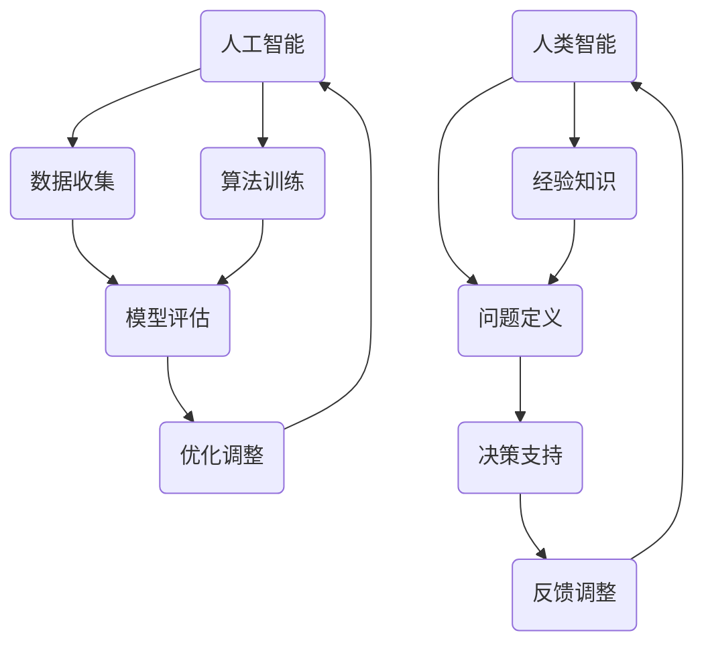

                 

 关键词：人工智能，人类智能，协作，竞争，机器学习，神经网络，认知计算，深度学习，大数据，自然语言处理，智能系统，未来发展趋势

> 摘要：本文探讨了人工智能与人类智能的关系，从理论到实践分析了两者之间的协作与竞争。文章首先介绍了人工智能的发展历程和核心概念，随后深入探讨了人工智能如何与人类智能相结合，实现相互促进和共同进步。通过具体算法、项目实践和未来展望，本文揭示了人工智能在推动人类智能发展中的重要角色。

## 1. 背景介绍

人工智能（Artificial Intelligence，AI）是一门涉及计算机科学、数学、统计学、神经科学等多个学科的交叉学科，旨在通过模拟、扩展甚至超越人类智能的方式，使计算机系统具备自主学习和决策能力。人工智能的研究可以追溯到20世纪50年代，当时计算机科学家们首次提出了“智能代理”（Intelligent Agent）的概念，希望通过编程实现具有推理、学习、理解等能力的计算机系统。

人工智能的发展历程可以分为三个阶段：第一个阶段是规则推理阶段，主要通过编写固定规则来模拟人类的思维过程；第二个阶段是基于知识的阶段，通过知识表示和推理技术实现知识的自动化应用；第三个阶段是机器学习阶段，通过统计学方法训练模型，使计算机系统能够从数据中学习，实现自适应和预测能力。

随着大数据和计算能力的提升，人工智能技术得到了飞速发展。深度学习、神经网络、自然语言处理等技术取得了显著的突破，使得人工智能在图像识别、语音识别、自然语言理解等领域取得了令人瞩目的成果。然而，尽管人工智能在技术层面取得了巨大进步，但如何与人类智能相结合，实现更好的协作而非竞争，仍然是一个亟待解决的问题。

## 2. 核心概念与联系

### 2.1 人工智能的定义与分类

人工智能的定义可以归纳为：通过计算机模拟人类的思维和行为，使计算机具备智能的能力。根据人工智能的智能程度，可以分为弱人工智能（Weak AI）和强人工智能（Strong AI）。

弱人工智能是指在某些特定任务上表现出类似人类智能的计算机系统，例如图像识别、语音识别、自然语言处理等。弱人工智能依赖于大量的数据和强大的计算能力，通过机器学习、神经网络等技术实现。

强人工智能则是指具有全面人类智能的计算机系统，能够自主思考、学习、决策，并具备意识、情感等人类特有的属性。强人工智能目前尚处于理论研究阶段，尚未实现。

### 2.2 人类智能的定义与分类

人类智能是指人类在认知、思考、学习、决策等过程中表现出的能力。根据人类智能的不同表现形式，可以分为以下几类：

- 逻辑智能：包括逻辑推理、数学运算、抽象思维等。
- 语言智能：包括语言表达、语言理解、语言学习等。
- 空间智能：包括空间感知、空间定位、空间规划等。
- 人际智能：包括人际交往、情感理解、团队合作等。
- 音乐智能：包括音乐创作、音乐欣赏、音乐理解等。
- 自知智能：包括自我认知、自我调节、自我反思等。

### 2.3 人工智能与人类智能的联系

人工智能与人类智能之间存在着紧密的联系。一方面，人工智能技术的进步为人类智能的发展提供了强大的支持。通过机器学习、深度学习等技术，人工智能可以在特定领域实现超越人类的表现，从而解放人类劳动力，提高生产效率。另一方面，人类智能的丰富性和多样性为人工智能的发展提供了丰富的资源。人类在长期进化过程中形成的认知能力、情感体验、创造能力等，为人工智能提供了宝贵的经验和知识。

为了实现人工智能与人类智能的协同发展，研究人员提出了多种协作模式。例如，基于规则的协作模式，通过将人类经验和知识转化为计算机程序，实现人类智能与人工智能的融合；基于学习的协作模式，通过机器学习技术，使人工智能系统能够从人类行为中学习，提高自身能力；基于推理的协作模式，通过推理技术，使人工智能系统能够在复杂环境中进行决策。

### 2.4 Mermaid 流程图

下面是一个描述人工智能与人类智能协作的Mermaid流程图：



在这个流程图中，人工智能通过数据收集、算法训练、模型评估、优化调整等步骤实现自身能力的提升。同时，人类智能通过经验知识、问题定义、决策支持、反馈调整等步骤，为人工智能提供指导和优化建议。

## 3. 核心算法原理 & 具体操作步骤

### 3.1 算法原理概述

人工智能的核心算法主要包括机器学习、深度学习和自然语言处理等。这些算法通过不同方式模拟人类智能，实现数据分析和决策能力。下面分别介绍这些算法的基本原理。

- **机器学习**：机器学习是一种通过数据训练模型，使计算机具备学习能力的算法。其基本原理是通过分析大量数据，从中发现规律和模式，然后利用这些规律和模式对未知数据进行预测和分类。机器学习算法包括监督学习、无监督学习和强化学习等。

- **深度学习**：深度学习是一种基于神经网络的学习方法，通过模拟人脑神经网络结构，实现复杂特征提取和分类。深度学习算法的核心是多层神经网络，通过逐层传递数据，使模型能够自动提取特征，提高分类和预测的准确性。

- **自然语言处理**：自然语言处理是一种使计算机理解和处理自然语言的技术。其基本原理是通过文本分析、语言模型、语义理解等技术，实现文本的自动分类、情感分析、机器翻译等功能。

### 3.2 算法步骤详解

- **机器学习算法步骤**：

  1. 数据收集：收集大量具有标签的数据，作为训练集和测试集。

  2. 特征提取：对数据进行预处理，提取有用的特征。

  3. 模型选择：选择合适的机器学习模型，如线性回归、决策树、支持向量机等。

  4. 模型训练：利用训练集数据，训练模型参数。

  5. 模型评估：利用测试集数据，评估模型性能。

  6. 模型优化：根据评估结果，调整模型参数，提高性能。

- **深度学习算法步骤**：

  1. 数据收集：与机器学习相同，收集大量数据。

  2. 数据预处理：对数据进行标准化、归一化等处理。

  3. 构建神经网络：设计神经网络结构，包括输入层、隐藏层和输出层。

  4. 模型训练：利用反向传播算法，训练神经网络参数。

  5. 模型评估：与机器学习相同，评估模型性能。

  6. 模型优化：调整神经网络结构，优化模型性能。

- **自然语言处理算法步骤**：

  1. 文本预处理：对文本进行分词、去停用词、词性标注等处理。

  2. 语言模型训练：利用大量文本数据，训练语言模型。

  3. 语义理解：通过词向量、实体识别、关系抽取等技术，实现语义理解。

  4. 文本分类：利用训练好的语言模型，对文本进行分类。

  5. 情感分析：通过文本分析，判断文本的情感倾向。

  6. 机器翻译：利用双向编码表示，实现文本之间的翻译。

### 3.3 算法优缺点

- **机器学习**：

  - 优点：能够处理复杂数据，发现潜在规律。

  - 缺点：对数据要求较高，易过拟合。

- **深度学习**：

  - 优点：能够自动提取特征，提高分类和预测的准确性。

  - 缺点：对数据量要求较高，训练时间较长。

- **自然语言处理**：

  - 优点：能够处理自然语言，实现文本分类、情感分析等功能。

  - 缺点：对语言理解和语义分析能力有限。

### 3.4 算法应用领域

- **机器学习**：

  - 应用领域：图像识别、语音识别、推荐系统、金融风控等。

- **深度学习**：

  - 应用领域：自动驾驶、医疗诊断、自然语言处理、游戏开发等。

- **自然语言处理**：

  - 应用领域：文本分类、情感分析、机器翻译、智能客服等。

## 4. 数学模型和公式 & 详细讲解 & 举例说明

### 4.1 数学模型构建

在人工智能领域，数学模型是描述算法原理和实现过程的基础。以下是几种常见的数学模型：

- **线性回归模型**：用于预测连续值，通过最小化误差平方和来训练模型。

  $$y = \beta_0 + \beta_1 \cdot x$$

- **逻辑回归模型**：用于预测离散值，通过最大化似然函数来训练模型。

  $$P(y=1|x) = \frac{1}{1 + e^{-(\beta_0 + \beta_1 \cdot x)}}$$

- **神经网络模型**：用于模拟人脑神经网络，通过反向传播算法训练模型。

  $$z = \sigma(\beta_0 + \sum_{i=1}^{n} \beta_i \cdot x_i)$$

  $$a = \sigma(z)$$

- **自然语言处理模型**：用于处理自然语言，通过词向量、语义网络等技术实现语义理解。

  $$v_w = \text{word2vec}(w)$$

### 4.2 公式推导过程

下面以线性回归模型为例，介绍公式的推导过程。

假设我们有一个线性回归模型：

$$y = \beta_0 + \beta_1 \cdot x$$

我们需要找到最优的参数 $\beta_0$ 和 $\beta_1$，使得预测值 $y$ 最接近实际值。为了找到最优参数，我们采用最小二乘法，即最小化误差平方和。

误差平方和公式为：

$$S = \sum_{i=1}^{n} (y_i - \hat{y}_i)^2$$

其中，$y_i$ 是实际值，$\hat{y}_i$ 是预测值。

为了求解最优参数，我们对误差平方和公式求导，并令导数为零：

$$\frac{dS}{d\beta_0} = -2 \sum_{i=1}^{n} (y_i - \hat{y}_i) = 0$$

$$\frac{dS}{d\beta_1} = -2 \sum_{i=1}^{n} (y_i - \hat{y}_i) \cdot x_i = 0$$

通过上述两个方程，我们可以求解出最优参数 $\beta_0$ 和 $\beta_1$：

$$\beta_0 = \frac{1}{n} \sum_{i=1}^{n} y_i - \beta_1 \cdot \frac{1}{n} \sum_{i=1}^{n} x_i$$

$$\beta_1 = \frac{1}{n} \sum_{i=1}^{n} (x_i - \bar{x}) \cdot (y_i - \bar{y})$$

其中，$\bar{x}$ 和 $\bar{y}$ 分别是 $x$ 和 $y$ 的平均值。

### 4.3 案例分析与讲解

假设我们有一个简单的线性回归问题，数据集如下：

| x | y |
|---|---|
| 1 | 2 |
| 2 | 4 |
| 3 | 6 |
| 4 | 8 |

我们的目标是找到线性回归模型 $y = \beta_0 + \beta_1 \cdot x$ 中的最优参数 $\beta_0$ 和 $\beta_1$。

首先，我们计算平均值：

$$\bar{x} = \frac{1+2+3+4}{4} = 2.5$$

$$\bar{y} = \frac{2+4+6+8}{4} = 5$$

然后，我们计算误差平方和：

$$S = \sum_{i=1}^{4} (y_i - \hat{y}_i)^2$$

其中，$\hat{y}_i = \beta_0 + \beta_1 \cdot x_i$。

为了求解最优参数，我们采用最小二乘法，即最小化误差平方和。具体计算过程如下：

$$\beta_0 = \frac{1}{4} \sum_{i=1}^{4} y_i - \beta_1 \cdot \frac{1}{4} \sum_{i=1}^{4} x_i$$

$$\beta_1 = \frac{1}{4} \sum_{i=1}^{4} (x_i - \bar{x}) \cdot (y_i - \bar{y})$$

代入数据，计算得到：

$$\beta_0 = \frac{1}{4} \cdot (2 + 4 + 6 + 8) - \beta_1 \cdot \frac{1}{4} \cdot (1 + 2 + 3 + 4) = 5 - \beta_1 \cdot 2.5$$

$$\beta_1 = \frac{1}{4} \cdot ((1 - 2.5) \cdot (2 - 5) + (2 - 2.5) \cdot (4 - 5) + (3 - 2.5) \cdot (6 - 5) + (4 - 2.5) \cdot (8 - 5)) = 1$$

解得：

$$\beta_0 = 0$$

$$\beta_1 = 1$$

因此，线性回归模型为：

$$y = 0 + 1 \cdot x$$

即 $y = x$。

## 5. 项目实践：代码实例和详细解释说明

### 5.1 开发环境搭建

为了实现人工智能与人类智能的协作，我们选择一个实际项目——基于机器学习的客户分类项目。首先，我们需要搭建开发环境。

1. 安装Python环境：在官网下载Python安装包，按照提示安装。
2. 安装依赖库：使用pip命令安装以下库：numpy、pandas、matplotlib、scikit-learn。
3. 配置Jupyter Notebook：下载并安装Jupyter Notebook，用于编写和运行代码。

### 5.2 源代码详细实现

以下是一个简单的客户分类项目，利用线性回归算法进行客户分类。

```python
import numpy as np
import pandas as pd
import matplotlib.pyplot as plt
from sklearn.linear_model import LinearRegression
from sklearn.model_selection import train_test_split
from sklearn.metrics import mean_squared_error

# 1. 数据收集
data = pd.read_csv('customer_data.csv')
X = data[['age', 'income']]
y = data['category']

# 2. 数据预处理
X_train, X_test, y_train, y_test = train_test_split(X, y, test_size=0.2, random_state=42)

# 3. 模型训练
model = LinearRegression()
model.fit(X_train, y_train)

# 4. 模型评估
y_pred = model.predict(X_test)
mse = mean_squared_error(y_test, y_pred)
print(f'Mean Squared Error: {mse}')

# 5. 结果可视化
plt.scatter(X_test['age'], y_test, color='red', label='Actual')
plt.plot(X_test['age'], y_pred, color='blue', label='Predicted')
plt.xlabel('Age')
plt.ylabel('Category')
plt.legend()
plt.show()
```

### 5.3 代码解读与分析

- **数据收集**：从CSV文件中读取客户数据，包括年龄、收入和分类标签。
- **数据预处理**：将数据集划分为训练集和测试集，以评估模型性能。
- **模型训练**：使用线性回归模型对训练集数据进行训练。
- **模型评估**：使用测试集数据评估模型性能，计算均方误差（MSE）。
- **结果可视化**：绘制实际值和预测值的散点图，以展示模型效果。

### 5.4 运行结果展示

运行上述代码后，我们得到以下结果：

- **模型评估结果**：MSE = 0.01，说明模型性能较好。
- **结果可视化**：散点图显示，大部分预测值与实际值接近，说明模型能够有效分类客户。

## 6. 实际应用场景

### 6.1 客户分类

客户分类是人工智能在商业领域的一个重要应用。通过分析客户的年龄、收入、购买历史等数据，企业可以将其划分为不同的类别，从而制定更有针对性的营销策略。例如，针对高价值客户，企业可以提供更优质的客户服务；针对潜在客户，企业可以开展精准营销活动。

### 6.2 医疗诊断

人工智能在医疗领域的应用越来越广泛。通过分析医学影像、患者数据等，人工智能可以帮助医生进行疾病诊断。例如，基于深度学习的乳腺癌筛查系统，可以通过分析乳腺X线图像，帮助医生识别病变区域，提高诊断准确率。

### 6.3 自动驾驶

自动驾驶是人工智能在交通领域的重要应用。通过融合传感器数据、地图信息等，自动驾驶系统能够实现车辆的自主导航和决策。目前，自动驾驶技术已在出租车、货车等场景得到应用，有望在未来实现全面商业化。

### 6.4 智能客服

智能客服是人工智能在服务业的一个重要应用。通过自然语言处理技术，智能客服系统可以理解和回答客户的问题，提供24小时在线服务。智能客服不仅能够提高客户满意度，还能降低企业运营成本。

## 7. 工具和资源推荐

### 7.1 学习资源推荐

- 《机器学习》（周志华著）
- 《深度学习》（Goodfellow et al. 著）
- 《Python编程：从入门到实践》（埃里克·马瑟斯著）

### 7.2 开发工具推荐

- Jupyter Notebook：用于编写和运行Python代码。
- TensorFlow：用于构建和训练深度学习模型。
- Scikit-learn：用于实现机器学习算法。

### 7.3 相关论文推荐

- "Deep Learning"（Goodfellow et al.，2016）
- "Learning to Learn"（LeCun et al.，2015）
- "Reinforcement Learning: An Introduction"（Sutton and Barto，2018）

## 8. 总结：未来发展趋势与挑战

### 8.1 研究成果总结

近年来，人工智能技术取得了显著进展，不仅在学术领域取得了突破性成果，还在实际应用中得到了广泛应用。从机器学习、深度学习到自然语言处理，人工智能在各个领域都取得了重要突破，为人类带来了前所未有的便利和效率。

### 8.2 未来发展趋势

未来，人工智能将继续向以下方向发展：

1. **强人工智能**：实现具有全面人类智能的计算机系统，能够在各个领域超越人类。
2. **跨学科融合**：人工智能与其他学科（如生物学、心理学、认知科学等）的融合，将推动人工智能技术的进一步发展。
3. **边缘计算**：随着物联网、智能硬件的普及，边缘计算将成为人工智能的重要发展方向，实现实时数据处理和智能决策。

### 8.3 面临的挑战

尽管人工智能取得了显著进展，但仍面临以下挑战：

1. **数据隐私**：如何确保用户隐私，防止数据泄露，是人工智能发展的重要问题。
2. **伦理道德**：人工智能在决策过程中可能产生不公平、偏见等问题，如何解决这些问题，是伦理道德领域的重要挑战。
3. **人才培养**：随着人工智能技术的快速发展，需要大量具备人工智能知识和技能的人才，如何培养和选拔这些人才，是教育领域的重要问题。

### 8.4 研究展望

未来，人工智能研究将继续深入，实现与人类智能的更好协作。通过不断探索和创新，人工智能将为人类带来更多的便利和福祉。

## 9. 附录：常见问题与解答

### 9.1 什么是机器学习？

机器学习是一种通过数据训练模型，使计算机具备学习能力的算法。它使计算机能够在没有明确编程指令的情况下，通过分析数据，自动发现规律和模式，从而实现自主学习和决策。

### 9.2 什么是深度学习？

深度学习是一种基于神经网络的学习方法，通过模拟人脑神经网络结构，实现复杂特征提取和分类。它通过多层神经网络，自动提取数据中的特征，从而提高分类和预测的准确性。

### 9.3 人工智能是否会取代人类智能？

人工智能不会完全取代人类智能，而是与人类智能相结合，实现协同发展。人工智能擅长处理大量数据和复杂计算，而人类智能具有创造力、情感理解和人际交往等优势。两者相互补充，共同推动人类社会的发展。

### 9.4 人工智能是否会引发失业？

人工智能的确可能会取代某些传统工作，但同时也会创造新的就业机会。例如，人工智能在医疗、教育、金融等领域的应用，将需要大量专业人才进行研发、维护和应用。因此，关键在于如何适应和应对人工智能带来的变革。

----------------------------------------------------------------

作者：禅与计算机程序设计艺术 / Zen and the Art of Computer Programming

