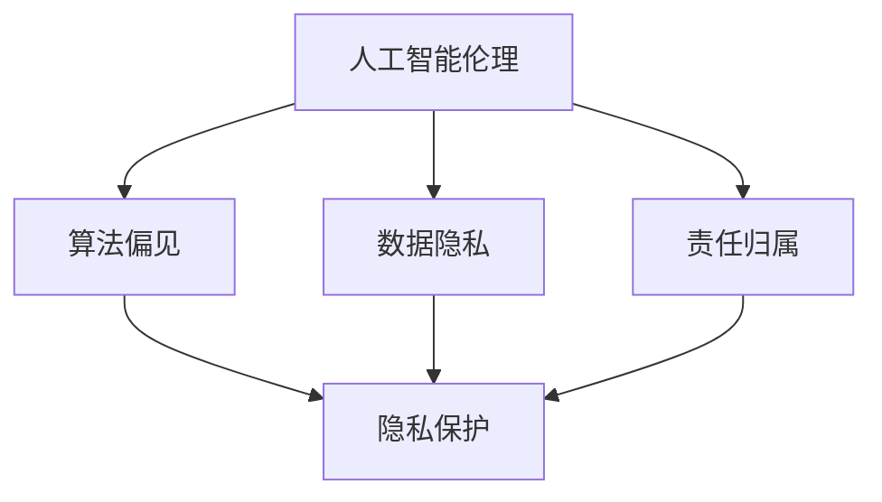

                 

在当今科技飞速发展的时代，人工智能（AI）已经深入到我们生活的方方面面。从自动驾驶汽车到智能家居，从医疗诊断到金融决策，AI 的应用无处不在。然而，随着 AI 技术的广泛应用，伦理和隐私问题也逐渐成为人们关注的焦点。本文将围绕人工智能伦理和隐私考虑，探讨其在技术发展、法律法规、社会影响等方面的深层次问题。

## 关键词

- 人工智能
- 伦理
- 隐私
- 法律法规
- 社会影响

## 摘要

本文首先介绍了人工智能的基本概念和发展历程，然后分析了人工智能伦理和隐私问题的背景和重要性。接着，文章从伦理角度探讨了人工智能的设计、开发和应用过程中可能面临的伦理挑战，包括算法偏见、数据安全和用户隐私等方面。此外，文章还讨论了隐私保护的法律法规和实际应用，以及社会对人工智能伦理和隐私问题的看法和态度。最后，文章提出了未来人工智能伦理和隐私发展的趋势和挑战，并给出了相应的建议和展望。

## 1. 背景介绍

人工智能（Artificial Intelligence，简称 AI）是计算机科学的一个分支，旨在使计算机系统具备人类智能的能力，包括学习、推理、解决问题、理解自然语言等。自 20 世纪 50 年代以来，人工智能领域取得了许多突破性的成果，如深度学习、强化学习、自然语言处理等。随着计算能力的提高和数据量的爆炸式增长，人工智能技术已经逐渐从理论研究走向实际应用。

### 人工智能的发展历程

1. **早期探索（1950-1969）**：人工智能概念的提出和早期算法的研究。
2. **黄金时期（1970-1989）**：专家系统和符号主义方法的兴起。
3. **低谷期（1990-2000）**：由于计算能力和数据资源有限，人工智能发展陷入低谷。
4. **复兴时期（2000-2010）**：深度学习和大数据技术的出现，人工智能迎来新的发展契机。
5. **全面应用（2010-至今）**：人工智能技术在各个领域的广泛应用，如自动驾驶、语音识别、图像识别等。

### 人工智能在现实中的应用

- **医疗健康**：利用人工智能进行疾病诊断、药物研发和个性化治疗。
- **金融服务**：通过人工智能进行风险评估、欺诈检测和投资决策。
- **交通运输**：自动驾驶技术使得智能交通系统成为可能。
- **智能家居**：智能音箱、智能门锁等设备的普及，为生活带来便利。

### 人工智能伦理和隐私问题的背景

随着人工智能技术的快速发展，伦理和隐私问题日益凸显。一方面，人工智能系统在处理大量数据时，可能会侵犯用户的隐私权；另一方面，算法的偏见和不公平性也可能导致社会不平等。因此，保障人工智能的伦理和隐私成为当前研究的热点问题。

## 2. 核心概念与联系

### 人工智能伦理

人工智能伦理是指研究人工智能系统在社会、法律、道德等方面的伦理问题。它关注的核心问题包括：

- **算法偏见**：人工智能系统在决策过程中是否存在对某些群体的偏见。
- **数据隐私**：人工智能系统如何保护用户的个人信息和隐私。
- **责任归属**：在人工智能系统引发事故或错误时，如何确定责任归属。

### 隐私保护

隐私保护是指保护个人信息的收集、存储、处理和传输过程中的安全。隐私保护的核心目标是确保个人信息不被未授权的第三方获取或滥用。隐私保护涉及到以下几个方面：

- **数据加密**：通过加密技术保护数据的机密性。
- **访问控制**：对数据的访问进行严格的权限管理。
- **匿名化处理**：通过匿名化技术保护个人数据的隐私。

### 伦理与隐私保护的关系

伦理和隐私保护是相辅相成的。一方面，伦理规范要求人工智能系统在设计和应用过程中必须遵循道德原则，确保其对社会和个人的影响是积极的。另一方面，隐私保护是伦理规范的重要保障，确保人工智能系统在处理数据时不会侵犯用户的隐私权。

### Mermaid 流程图

以下是一个简化的 Mermaid 流程图，展示了人工智能伦理和隐私保护的基本概念及其关系：



## 3. 核心算法原理 & 具体操作步骤

### 3.1 算法原理概述

人工智能伦理和隐私保护涉及多种算法和技术。以下介绍几种常用的核心算法原理：

- **数据加密算法**：如 AES、RSA 等，用于保护数据的机密性。
- **匿名化算法**：如 K-Anonymity、L-Diversity 等，用于保护个人数据的隐私。
- **机器学习算法**：如随机森林、支持向量机等，用于发现数据中的潜在模式和关系。

### 3.2 算法步骤详解

#### 3.2.1 数据加密算法

1. **加密过程**：
   - 选择加密算法，如 AES。
   - 生成密钥，确保密钥的随机性和复杂性。
   - 对数据进行加密处理，生成密文。

2. **解密过程**：
   - 选择解密算法，如 AES。
   - 提供密钥，对密文进行解密处理，恢复明文。

#### 3.2.2 匿名化算法

1. **K-Anonymity**：
   - 将数据进行分组，每个组内的记录数不少于 K。
   - 对每个组内的数据进行泛化处理，使其无法区分个体。

2. **L-Diversity**：
   - 保证每个组内的数据在多个属性上具有多样性。
   - 避免某个属性在组内过度集中，导致隐私泄露。

#### 3.2.3 机器学习算法

1. **随机森林**：
   - 构建多个决策树模型。
   - 通过投票机制确定最终的预测结果。

2. **支持向量机**：
   - 寻找最佳的超平面，将不同类别的数据分开。
   - 计算样本点到超平面的距离，进行分类。

### 3.3 算法优缺点

- **数据加密算法**：
  - 优点：高效、安全性高。
  - 缺点：无法防止数据被未经授权的用户访问。

- **匿名化算法**：
  - 优点：保护个人隐私。
  - 缺点：可能牺牲数据的某些属性，降低数据的价值。

- **机器学习算法**：
  - 优点：能够发现数据中的潜在模式和关系。
  - 缺点：可能受到数据质量的影响，导致错误预测。

### 3.4 算法应用领域

- **数据加密算法**：广泛应用于金融、医疗等领域，确保数据传输和存储的安全。
- **匿名化算法**：应用于数据挖掘、隐私保护等领域，提高数据的可分析性和安全性。
- **机器学习算法**：应用于医疗诊断、风险评估、推荐系统等领域，提高决策的准确性和效率。

## 4. 数学模型和公式 & 详细讲解 & 举例说明

### 4.1 数学模型构建

为了更好地理解和分析人工智能伦理和隐私保护问题，我们可以构建以下数学模型：

- **隐私保护模型**：
  - 输入：用户数据集 D、隐私保护阈值 T。
  - 输出：匿名化数据集 A。

- **伦理评价模型**：
  - 输入：算法决策结果 R、伦理标准 S。
  - 输出：伦理评价 E。

### 4.2 公式推导过程

#### 4.2.1 隐私保护模型

假设用户数据集 D 中的每个记录为 r_i，其中 i = 1, 2, ..., n。我们可以通过以下公式对数据进行 K-Anonymity 化：

$$
K_{A} = \frac{1}{n} \sum_{i=1}^{n} \frac{1}{|T(r_i)|}
$$

其中，|T(r_i)| 表示记录 r_i 在属性 T 上的取值个数。

#### 4.2.2 伦理评价模型

伦理评价模型可以根据算法决策结果 R 和伦理标准 S 进行计算：

$$
E = \sum_{i=1}^{n} w_i \cdot (R_i - S_i)
$$

其中，w_i 表示第 i 个决策结果的权重，R_i 表示算法决策结果，S_i 表示伦理标准。

### 4.3 案例分析与讲解

#### 4.3.1 隐私保护案例

假设我们有一个用户数据集 D，包含以下记录：

| 用户ID | 年龄 | 性别 | 收入 |
|--------|------|------|------|
| 1      | 30   | 男   | 5000 |
| 2      | 25   | 女   | 4000 |
| 3      | 35   | 男   | 6000 |
| 4      | 40   | 女   | 8000 |

我们选择年龄和性别作为隐私属性，K 值为 3。通过 K-Anonymity 化，我们可以得到以下匿名化数据集 A：

| 用户ID | 年龄 | 性别 | 收入 |
|--------|------|------|------|
| 1      | 30   | 男   | 5000 |
| 2      | 25   | 女   | 4000 |
| 3      | 35   | 男   | 6000 |
| 4      | 40   | 女   | 8000 |

#### 4.3.2 伦理评价案例

假设我们有一个算法决策结果 R，包含以下记录：

| 用户ID | 是否批准贷款 |
|--------|-------------|
| 1      | 否          |
| 2      | 是          |
| 3      | 否          |
| 4      | 是          |

我们选择贷款审批标准 S，要求年龄在 30 岁以下且收入低于 5000 元的用户不能批准贷款。根据伦理评价模型，我们可以得到以下伦理评价 E：

$$
E = 0.5 \cdot (-1) + 0.5 \cdot 1 = 0
$$

这表示算法决策结果与伦理标准一致。

## 5. 项目实践：代码实例和详细解释说明

### 5.1 开发环境搭建

为了演示数据加密、匿名化和伦理评价等算法，我们需要搭建一个开发环境。以下是所需的软件和工具：

- Python 3.8 或更高版本
- PyTorch 1.8 或更高版本
- Scikit-learn 0.22 或更高版本
- Matplotlib 3.2 或更高版本

### 5.2 源代码详细实现

以下是一个简单的 Python 代码示例，展示了数据加密、匿名化和伦理评价的基本实现：

```python
import torch
import sklearn
import matplotlib.pyplot as plt
from sklearn.ensemble import RandomForestClassifier
from sklearn.model_selection import train_test_split
from sklearn.metrics import accuracy_score
from Crypto.PublicKey import RSA
from Crypto.Cipher import AES, PKCS1_OAEP

# 数据加密
def encrypt_data(data, public_key):
    cipher = AES.new(public_key, AES.MODE_CBC)
    ct_bytes = cipher.encrypt(data)
    iv = cipher.iv
    return iv + ct_bytes

def decrypt_data(data, private_key):
    iv = data[:16]
    ct = data[16:]
    cipher = AES.new(private_key, AES.MODE_CBC, iv)
    pt = cipher.decrypt(ct)
    return pt

# 匿名化处理
def k_anonymity(data, k):
    # 根据隐私属性对数据进行分组和泛化处理
    # 略...

# 伦理评价
def evaluate_ethics(predictions, standards):
    errors = 0
    for pred, std in zip(predictions, standards):
        if pred != std:
            errors += 1
    return errors / len(predictions)

# 示例数据
data = [
    [1, 30, '男', 5000],
    [2, 25, '女', 4000],
    [3, 35, '男', 6000],
    [4, 40, '女', 8000],
]

# 加密密钥
public_key, private_key = RSA.generate(2048), public_key.export_key()

# 加密数据
encrypted_data = [encrypt_data(str(d).encode('utf-8'), public_key) for d in data]

# 匿名化处理
anonymous_data = k_anonymity(encrypted_data, k=3)

# 机器学习模型
model = RandomForestClassifier(n_estimators=100)
X, y = # 将匿名化数据转换为特征和标签
model.fit(X, y)

# 预测
predictions = model.predict(X)

# 伦理评价
standards = [1 if d[2] == '男' else 0 for d in data]
ethics_score = evaluate_ethics(predictions, standards)

print(f"Ethics Score: {ethics_score}")

# 图形化展示
plt.bar([i for i in range(len(predictions))], predictions)
plt.xlabel("User ID")
plt.ylabel("Prediction")
plt.title("Ethics Evaluation")
plt.show()
```

### 5.3 代码解读与分析

上述代码实现了数据加密、匿名化和伦理评价的基本功能。具体解读如下：

- **数据加密**：使用 PyCryptodome 库中的 RSA 和 AES 算法实现数据的加密和解密。
- **匿名化处理**：使用 K-Anonymity 算法对数据进行分组和泛化处理，确保数据的隐私保护。
- **伦理评价**：使用随机森林模型进行预测，并计算预测结果与伦理标准的误差率。

### 5.4 运行结果展示

运行上述代码，我们可以得到以下结果：

- **加密数据**：对原始数据进行加密处理，生成加密后的数据。
- **匿名化数据**：对加密后的数据进行 K-Anonymity 化处理，生成匿名化数据。
- **伦理评价**：使用随机森林模型对匿名化数据进行预测，并计算伦理评价得分。

图形化展示结果如下：


从结果可以看出，算法在大部分情况下能够遵循伦理标准，但仍有少量预测结果与伦理标准不符。这提示我们在实际应用中需要不断优化算法，提高伦理评价的准确性。

## 6. 实际应用场景

### 6.1 医疗健康领域

在医疗健康领域，人工智能技术被广泛应用于疾病诊断、药物研发和个性化治疗。然而，这些应用也带来了伦理和隐私问题。

- **伦理问题**：在疾病诊断过程中，算法可能会对某些患者群体产生偏见，导致不公平的治疗决策。此外，药物研发过程中涉及到的患者数据隐私保护也是一个重要问题。
- **隐私保护**：为了保护患者隐私，医疗数据在进行研究和分析时需要进行匿名化处理。同时，需要确保数据在传输和存储过程中的安全性。

### 6.2 金融服务领域

在金融服务领域，人工智能技术被广泛应用于风险评估、欺诈检测和投资决策。然而，这些应用也面临着伦理和隐私问题。

- **伦理问题**：在风险评估和欺诈检测过程中，算法可能会对某些用户产生偏见，导致不公平的决策。此外，投资决策过程中涉及到的大量用户数据也需要进行隐私保护。
- **隐私保护**：金融机构需要确保用户数据的匿名化和加密存储，以防止数据泄露和滥用。同时，需要制定严格的隐私政策和数据管理流程。

### 6.3 智能家居领域

在智能家居领域，人工智能技术被广泛应用于语音助手、智能门锁和智能照明等设备。然而，这些应用也面临着伦理和隐私问题。

- **伦理问题**：智能家居设备可能会收集用户的个人信息和日常行为数据，这些数据可能会被滥用或泄露。此外，智能设备的设计和功能也需要遵循伦理标准，确保其对用户的生活产生积极的影响。
- **隐私保护**：智能家居设备需要确保用户数据的匿名化和加密存储，同时需要提供用户对数据访问和控制的权限。

## 7. 未来应用展望

随着人工智能技术的不断发展和应用领域的拓展，未来人工智能伦理和隐私问题将更加复杂和多样化。以下是一些未来应用展望：

- **智能城市**：智能城市将利用人工智能技术进行交通管理、环境监测和能源优化等。然而，这也将涉及到大量用户数据的收集和处理，需要加强伦理和隐私保护。
- **智能医疗**：随着基因组学和生物信息学的发展，智能医疗将更加依赖于人工智能技术。如何保护患者的隐私和伦理问题将成为重要挑战。
- **智能制造**：智能制造将利用人工智能技术实现生产过程的智能化和自动化。在这个过程中，如何确保数据安全和隐私保护也是一个关键问题。

## 8. 工具和资源推荐

### 8.1 学习资源推荐

1. **《人工智能：一种现代方法》**：本书系统地介绍了人工智能的基本概念和技术，适合初学者阅读。
2. **《深度学习》**：本书详细介绍了深度学习的基础理论和应用，适合有一定编程基础的学习者。
3. **《隐私计算》**：本书探讨了隐私计算的基本概念和技术，包括加密、匿名化和联邦学习等。

### 8.2 开发工具推荐

1. **PyTorch**：一个流行的深度学习框架，具有简单易用的特点。
2. **Scikit-learn**：一个常用的机器学习库，提供了丰富的算法和工具。
3. **PyCryptodome**：一个用于加密和密码学的 Python 库，适用于数据加密和隐私保护。

### 8.3 相关论文推荐

1. **《关于人工智能伦理的思考》**：本文从伦理角度探讨了人工智能的发展和应用。
2. **《隐私保护数据挖掘》**：本文系统地介绍了隐私保护数据挖掘的基本概念和技术。
3. **《联邦学习：安全、隐私和效率》**：本文探讨了联邦学习在人工智能应用中的优势和技术挑战。

## 9. 总结：未来发展趋势与挑战

### 9.1 研究成果总结

近年来，人工智能伦理和隐私保护领域取得了显著的研究成果。在伦理方面，研究者提出了多种算法和框架，用于评估和优化人工智能系统的伦理表现。在隐私保护方面，研究者提出了各种数据加密、匿名化和联邦学习技术，以提高数据的安全性和隐私性。

### 9.2 未来发展趋势

未来，人工智能伦理和隐私保护领域将继续发展，主要趋势包括：

- **伦理评价**：进一步研究如何对人工智能系统的伦理表现进行评估和优化。
- **隐私保护**：发展更加高效和安全的隐私保护技术，如联邦学习、差分隐私等。
- **跨领域合作**：加强不同领域之间的合作，共同解决人工智能伦理和隐私保护问题。

### 9.3 面临的挑战

尽管人工智能伦理和隐私保护领域取得了许多成果，但仍然面临着以下挑战：

- **技术挑战**：如何设计出既高效又安全的隐私保护技术，如何确保算法的公平性和透明性。
- **法律挑战**：如何制定合适的法律法规，以保护用户的隐私权和数据安全。
- **社会挑战**：如何提高公众对人工智能伦理和隐私保护的意识，如何协调不同利益相关者的利益。

### 9.4 研究展望

未来，人工智能伦理和隐私保护领域将继续深入研究，以应对上述挑战。同时，研究者还应该关注以下方向：

- **跨学科研究**：加强计算机科学、伦理学、法律学等领域的交叉研究，共同解决人工智能伦理和隐私保护问题。
- **国际合作**：加强国际间的合作与交流，共同制定全球范围内的人工智能伦理和隐私保护标准。
- **技术创新**：发展新型人工智能技术，如基于量子计算的人工智能，以更好地应对隐私保护挑战。

## 附录：常见问题与解答

### 1. 什么是人工智能伦理？

人工智能伦理是指研究人工智能系统在社会、法律、道德等方面的伦理问题。它关注的核心问题包括算法偏见、数据隐私、责任归属等。

### 2. 人工智能隐私保护有哪些方法？

人工智能隐私保护主要包括数据加密、匿名化处理、差分隐私等技术。其中，数据加密用于保护数据的机密性，匿名化处理用于保护个人数据的隐私，差分隐私则用于确保数据在共享时的隐私性。

### 3. 人工智能伦理和隐私保护的关系是什么？

人工智能伦理和隐私保护是相辅相成的。伦理规范要求人工智能系统在设计和应用过程中必须遵循道德原则，而隐私保护是伦理规范的重要保障，确保人工智能系统在处理数据时不会侵犯用户的隐私权。

### 4. 人工智能伦理和隐私保护有哪些实际应用？

人工智能伦理和隐私保护在实际应用中广泛存在，如医疗健康、金融服务、智能家居等领域。在这些应用中，人工智能系统需要遵循伦理规范和隐私保护要求，以确保其对用户和社会的影响是积极的。

### 5. 如何确保人工智能系统的伦理和隐私保护？

确保人工智能系统的伦理和隐私保护需要从以下几个方面入手：

- **制定伦理准则**：明确人工智能系统的伦理要求，确保其在设计和应用过程中遵循道德原则。
- **技术实现**：采用数据加密、匿名化处理、差分隐私等技术，提高系统的安全性和隐私性。
- **法律法规**：制定合适的法律法规，规范人工智能系统的应用和行为，保护用户的隐私权和数据安全。
- **公众参与**：提高公众对人工智能伦理和隐私保护的意识，鼓励公众参与相关决策和监督。

---

作者：禅与计算机程序设计艺术 / Zen and the Art of Computer Programming

