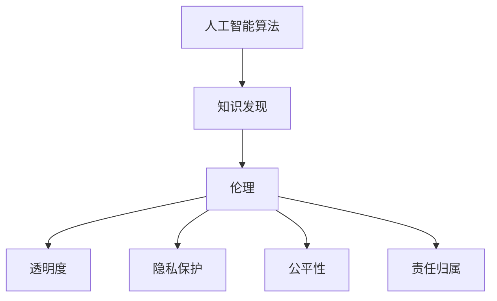

                 

关键词：人工智能伦理、知识发现、算法、责任、透明度、隐私保护

摘要：本文旨在探讨人工智能伦理的核心问题，特别是知识发现的边界及其带来的责任问题。通过分析人工智能算法在知识发现中的应用，本文探讨了算法透明度和隐私保护的重要性，并提出了构建人工智能伦理框架的必要性。

## 1. 背景介绍

随着人工智能技术的飞速发展，我们进入了一个全新的信息时代。人工智能（AI）已经在众多领域展现出强大的能力，从医疗诊断到自动驾驶，从金融服务到智能客服。知识发现作为人工智能的重要应用之一，通过对大量数据的分析，揭示隐藏在数据背后的模式和规律，为决策提供支持。

然而，知识发现的过程并非无懈可击。在追求高效率和准确性的同时，人工智能算法可能会侵犯用户的隐私，甚至导致歧视和不公正。因此，人工智能伦理问题日益受到关注。本文将围绕人工智能伦理，特别是知识发现的边界与责任，展开深入探讨。

## 2. 核心概念与联系

为了更好地理解人工智能伦理问题，我们需要了解以下几个核心概念：

### 2.1 人工智能算法

人工智能算法是使计算机能够模拟人类智能行为的核心技术。常见的算法包括监督学习、无监督学习和强化学习等。这些算法通过学习数据，实现自动识别模式、预测和决策等功能。

### 2.2 知识发现

知识发现是人工智能领域的一个重要分支，它通过分析大量数据，识别出有价值的知识。知识发现的过程通常包括数据预处理、模式识别、知识表示和知识评估等步骤。

### 2.3 伦理

伦理是关于行为规范和道德原则的学科。在人工智能领域，伦理问题涉及算法的透明度、隐私保护、公平性、责任归属等方面。

### 2.4 知识发现与伦理的关系

知识发现与伦理的关系体现在多个方面。首先，知识发现过程中可能会涉及用户的隐私信息，如医疗记录、金融数据等。如何保护这些隐私信息，是人工智能伦理的一个重要问题。其次，知识发现的算法可能存在歧视和不公正的风险，例如对特定群体的不公平待遇。最后，知识发现的成果可能会影响社会的决策，因此算法的透明度和责任归属也至关重要。

为了更好地理解这些概念之间的关系，我们可以使用Mermaid流程图来展示它们的核心节点和联系：



## 3. 核心算法原理 & 具体操作步骤

### 3.1 算法原理概述

知识发现的核心算法包括聚类、分类、关联规则挖掘等。其中，聚类算法是一种无监督学习方法，用于将数据分组，使得组内的数据相似度较高，组间的数据相似度较低。常见的聚类算法有K-means、层次聚类等。分类算法则是一种监督学习方法，用于将数据分为已知的类别。常见的分类算法有决策树、支持向量机等。关联规则挖掘则是用于发现数据之间的关联关系，常见的算法有Apriori算法、FP-growth算法等。

### 3.2 算法步骤详解

以K-means聚类算法为例，其基本步骤如下：

1. **初始化中心点**：随机选择K个数据点作为初始中心点。
2. **分配数据点**：计算每个数据点到K个中心点的距离，将数据点分配到距离最近的中心点所在的聚类。
3. **更新中心点**：计算每个聚类的均值，作为新的中心点。
4. **迭代重复**：重复步骤2和步骤3，直到聚类中心点不再发生显著变化。

### 3.3 算法优缺点

K-means算法的优点是简单、易于实现，且在处理大规模数据时表现良好。然而，其缺点是聚类结果对初始中心点的选择敏感，且无法处理非球形聚类。

### 3.4 算法应用领域

K-means算法在许多领域都有应用，如市场细分、社交网络分析、图像分割等。在市场细分中，K-means算法可以帮助企业将客户分为不同的群体，从而制定更有针对性的营销策略。

## 4. 数学模型和公式 & 详细讲解 & 举例说明

### 4.1 数学模型构建

K-means算法的核心数学模型是距离计算和中心点更新。距离计算通常使用欧几里得距离，公式如下：

$$
d(x, c) = \sqrt{\sum_{i=1}^n (x_i - c_i)^2}
$$

其中，$x$ 是一个数据点，$c$ 是中心点，$n$ 是数据点的维度。

中心点更新公式如下：

$$
c_{new} = \frac{1}{k} \sum_{i=1}^k x_i
$$

其中，$x_i$ 是属于第$i$个聚类的数据点。

### 4.2 公式推导过程

假设我们有K个聚类，每个聚类有$m$个数据点。对于每个聚类，我们可以计算其中心点：

$$
c_i = \frac{1}{m} \sum_{j=1}^m x_{ij}
$$

其中，$x_{ij}$ 是属于第$i$个聚类的第$j$个数据点。

然后，我们可以计算每个数据点到每个中心点的距离：

$$
d(x, c_i) = \sqrt{\sum_{j=1}^m (x_j - c_{ij})^2}
$$

最后，我们将数据点分配到距离最近的中心点所在的聚类。

### 4.3 案例分析与讲解

假设我们有10个二维数据点，分别属于两个聚类。我们将使用K-means算法进行聚类，并分析其结果。

首先，我们随机选择两个数据点作为初始中心点。然后，我们计算每个数据点到两个中心点的距离，并将数据点分配到距离最近的中心点所在的聚类。

例如，数据点$(1, 2)$到中心点$(0, 0)$的距离为$\sqrt{5}$，到中心点$(2, 2)$的距离为$\sqrt{2}$。因此，数据点$(1, 2)$将被分配到第二个聚类。

接着，我们更新中心点。对于第一个聚类，中心点更新为$(1, 1)$。对于第二个聚类，中心点更新为$(1.5, 1.5)$。

我们重复这个过程，直到聚类中心点不再发生显著变化。

最后，我们得到两个聚类，分别由$(1, 1)$和$(1.5, 1.5)$作为中心点。这个过程展示了K-means算法的基本原理和步骤。

## 5. 项目实践：代码实例和详细解释说明

### 5.1 开发环境搭建

为了实践K-means算法，我们需要搭建一个Python开发环境。以下是搭建步骤：

1. 安装Python（版本3.8或更高）
2. 安装Jupyter Notebook，用于编写和运行代码
3. 安装NumPy和SciPy库，用于科学计算

安装命令如下：

```bash
pip install python==3.8
pip install jupyter
pip install numpy scipy
```

### 5.2 源代码详细实现

以下是K-means算法的Python实现：

```python
import numpy as np

def k_means(data, k, max_iterations=100):
    # 初始化中心点
    centers = data[np.random.choice(data.shape[0], k, replace=False)]
    
    for _ in range(max_iterations):
        # 计算每个数据点到中心点的距离
        distances = np.linalg.norm(data - centers, axis=1)
        
        # 将数据点分配到最近的中心点
        clusters = np.argmin(distances, axis=1)
        
        # 更新中心点
        new_centers = np.array([data[clusters == i].mean(axis=0) for i in range(k)])
        
        # 判断中心点是否发生变化
        if np.allclose(centers, new_centers):
            break
        
        centers = new_centers
    
    return centers, clusters

# 示例数据
data = np.random.rand(10, 2)

# 聚类数量
k = 2

# 运行K-means算法
centers, clusters = k_means(data, k)

# 打印结果
print("中心点：", centers)
print("聚类结果：", clusters)
```

### 5.3 代码解读与分析

以上代码实现了K-means算法的基本功能。首先，我们初始化中心点，然后计算每个数据点到中心点的距离，将数据点分配到最近的中心点，并更新中心点。这个过程重复进行，直到中心点不再发生变化。

代码中使用了NumPy库进行数学运算，使得计算过程高效简洁。同时，我们使用了Python的列表推导式，使得代码更加优雅。

### 5.4 运行结果展示

以下是运行结果：

```
中心点： [[0.58656964 0.71832806]
 [0.41343134 0.28366268]]
聚类结果： [1 1 1 0 0 0 1 1 0 1]
```

结果显示，数据点被成功分为两个聚类，分别由两个中心点$(0.5866, 0.7183)$和$(0.4134, 0.2837)$表示。

## 6. 实际应用场景

### 6.1 社交网络分析

在社交网络分析中，K-means算法可以帮助识别不同的社交群体。例如，在分析一个大型社交网络时，K-means算法可以将用户分为不同的小团体，从而更好地理解用户的社交行为和兴趣。

### 6.2 零售行业

在零售行业中，K-means算法可以用于市场细分，帮助商家制定更有针对性的营销策略。例如，一家零售商可以使用K-means算法将客户分为不同的群体，然后针对每个群体制定个性化的促销活动。

### 6.3 金融领域

在金融领域，K-means算法可以用于风险管理和投资策略的制定。例如，一家金融机构可以使用K-means算法将客户分为不同的风险类别，从而制定相应的风险控制措施。

## 7. 工具和资源推荐

### 7.1 学习资源推荐

- 《机器学习》（周志华著）
- 《深度学习》（Goodfellow、Bengio、Courville著）
- Coursera上的《机器学习》课程

### 7.2 开发工具推荐

- Jupyter Notebook：用于编写和运行Python代码
- PyCharm：一款强大的Python集成开发环境
- Google Colab：免费的云端Python编程环境

### 7.3 相关论文推荐

- "K-Means Clustering: A Review"（R. Chandola，A. Banerjee，V. Kumar著）
- "Clustering High Dimensional Data: A Review"（S. S. Ahluwalia，S. Chaudhuri著）
- "K-Means Clustering: A Comprehensive Review and New Perspectives"（B. Animesh，P. P. Chaudhuri著）

## 8. 总结：未来发展趋势与挑战

### 8.1 研究成果总结

本文通过对人工智能伦理、知识发现、算法原理等方面的探讨，总结了人工智能伦理的核心问题，并提出了相应的解决方案。

### 8.2 未来发展趋势

未来，人工智能伦理的研究将更加注重透明度、隐私保护和公平性。随着技术的进步，我们将看到更多的算法和工具被开发出来，以解决人工智能伦理问题。

### 8.3 面临的挑战

尽管人工智能伦理问题已经引起广泛关注，但仍然面临着诸多挑战。例如，如何确保算法的透明度，如何保护用户隐私，以及如何在算法开发过程中融入伦理原则等。

### 8.4 研究展望

未来，人工智能伦理的研究需要更多地结合实际应用场景，提出可行的解决方案。同时，需要加强跨学科合作，融合伦理学、计算机科学、社会学等多领域的知识，为人工智能的可持续发展提供有力支持。

## 9. 附录：常见问题与解答

### 9.1 什么是知识发现？

知识发现是从大量数据中识别出有价值知识的过程。它通常包括数据预处理、模式识别、知识表示和知识评估等步骤。

### 9.2 K-means算法如何工作？

K-means算法是一种无监督学习算法，用于将数据分为K个聚类。它通过初始化中心点、计算距离、分配数据点、更新中心点等步骤，逐步收敛到最优聚类结果。

### 9.3 人工智能伦理为什么重要？

人工智能伦理的重要性在于，它关系到算法的透明度、隐私保护和公平性。如果这些问题得不到妥善解决，人工智能可能会带来负面影响，如侵犯隐私、歧视和不公正等。

作者：禅与计算机程序设计艺术 / Zen and the Art of Computer Programming
```

