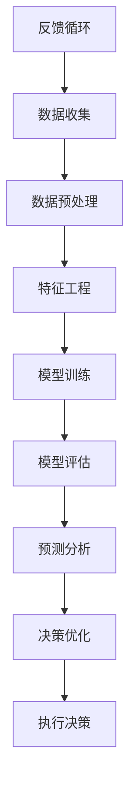

                 

## 摘要

本文旨在探讨人工智能（AI）在商业领域的应用，特别是如何通过智能化决策提升企业的竞争力。随着大数据和云计算技术的快速发展，人工智能已经成为驱动企业创新和增长的关键力量。文章首先介绍了人工智能的基本概念和发展历程，然后重点分析了AI在商业决策中的应用，包括数据预处理、模型训练、预测分析、决策优化等方面的具体实施步骤。接着，通过一个实际案例展示了如何将人工智能技术应用于商业场景，并探讨了其潜在的优势和挑战。最后，文章提出了未来人工智能在商业应用中的发展趋势和潜在研究方向，为企业和研究机构提供了有价值的参考。

## 1. 背景介绍

### 1.1 人工智能的基本概念

人工智能（Artificial Intelligence，简称AI）是计算机科学的一个分支，致力于使机器模拟、扩展甚至超越人类智能。AI的核心目标是创建能够执行复杂任务、学习新知识和自主做出决策的系统。这些任务包括但不限于语音识别、图像识别、自然语言处理、机器翻译、自动驾驶等。

人工智能的历史可以追溯到20世纪50年代。当时，计算机科学家艾伦·图灵提出了著名的图灵测试，作为判断机器是否具备智能的基准。随着计算能力的提升和算法的进步，人工智能经历了多个发展阶段，包括规则系统、知识表示、专家系统和现代深度学习等。

### 1.2 人工智能的商业价值

人工智能不仅在科技领域表现出色，其在商业领域的应用同样具有巨大潜力。首先，AI可以帮助企业从海量数据中提取有价值的信息，从而实现更精准的市场分析和用户画像。其次，AI能够自动化重复性高、耗时耗力的任务，提高工作效率和降低成本。此外，AI还能通过预测分析为企业提供决策支持，帮助企业应对不确定的市场环境。

近年来，随着大数据和云计算技术的不断发展，人工智能的商业应用场景变得更加丰富和多样化。从智能客服到个性化推荐，从智能供应链管理到金融风险控制，人工智能正在深刻改变企业的运营模式，提升其竞争力。

### 1.3 本文的结构

本文将首先介绍人工智能的基本概念和发展历程，然后分析其在商业决策中的应用，包括数据预处理、模型训练、预测分析和决策优化等方面。接着，通过一个实际案例展示如何将人工智能技术应用于商业场景。最后，本文将探讨人工智能在商业应用中的潜在优势、挑战及未来发展趋势。

## 2. 核心概念与联系

在深入探讨人工智能在商业决策中的应用之前，我们需要理解一些核心概念及其相互关系。以下是一个使用Mermaid绘制的流程图，展示了人工智能的核心组成部分及其在商业应用中的流程。



### 2.1 数据收集

数据收集是人工智能应用的第一步，也是最重要的一步。数据的质量和数量直接影响模型的效果。商业领域的数据来源广泛，包括客户交易记录、社交媒体活动、市场调研数据、传感器数据等。

### 2.2 数据预处理

数据预处理包括数据清洗、数据转换和数据归一化等步骤。这一过程确保数据的质量和一致性，去除噪声和异常值，以便于后续的特征工程和模型训练。

### 2.3 特征工程

特征工程是数据预处理之后的重要步骤，旨在从原始数据中提取有用的特征，以便于模型训练。有效的特征工程可以提高模型的准确性和泛化能力。

### 2.4 模型训练

模型训练是人工智能的核心步骤，通过使用机器学习算法来训练模型，使其能够从数据中学习并做出预测。常见的机器学习算法包括线性回归、决策树、随机森林、支持向量机和深度学习等。

### 2.5 模型评估

模型评估是判断模型性能的重要步骤。常用的评估指标包括准确率、召回率、F1分数、均方误差等。通过模型评估，可以判断模型是否达到预期的性能指标，并进行相应的调整。

### 2.6 预测分析

预测分析是利用训练好的模型进行实际预测的过程。通过预测分析，企业可以提前了解市场趋势、客户需求变化等，从而做出更明智的商业决策。

### 2.7 决策优化

决策优化是基于预测分析结果，对企业的运营策略进行调整和优化的过程。通过决策优化，企业可以提高业务效率、降低成本、提升用户体验等。

### 2.8 执行决策

执行决策是将预测分析和决策优化结果付诸实践的过程。通过执行决策，企业可以实现对市场的快速响应和调整。

### 2.9 反馈循环

反馈循环是人工智能应用的一个重要环节，通过收集实际执行结果与预期目标的偏差，对模型和决策过程进行迭代优化，从而不断提高系统的性能和准确性。

## 3. 核心算法原理 & 具体操作步骤

### 3.1 算法原理概述

在人工智能的商业应用中，核心算法的选择和实现至关重要。以下将介绍几种常见的机器学习算法及其原理。

#### 3.1.1 线性回归

线性回归是一种用于预测连续值的算法，其基本原理是通过拟合一条直线来预测目标值。线性回归模型可以表示为：

\[ y = \beta_0 + \beta_1 \cdot x \]

其中，\( y \) 是目标值，\( x \) 是特征值，\( \beta_0 \) 和 \( \beta_1 \) 是模型参数。

#### 3.1.2 决策树

决策树是一种基于树形结构进行分类或回归的算法。其基本原理是通过一系列判断条件来对数据进行划分，直到达到某个终止条件。决策树模型可以表示为：

\[ f(x) = \sum_{i=1}^{n} \beta_i \cdot I(\text{条件}_i) \]

其中，\( I(\text{条件}_i) \) 是指示函数，当条件 \( i \) 满足时，取值为1，否则为0。

#### 3.1.3 随机森林

随机森林是一种基于决策树的集成学习算法。其基本原理是将多个决策树进行组合，通过投票或平均的方式得出最终预测结果。随机森林模型可以表示为：

\[ f(x) = \sum_{i=1}^{m} f_i(x) \]

其中，\( f_i(x) \) 是第 \( i \) 个决策树的预测结果。

#### 3.1.4 支持向量机

支持向量机是一种用于分类的算法，其基本原理是找到最优的超平面，将数据划分为不同的类别。支持向量机模型可以表示为：

\[ w \cdot x + b = 0 \]

其中，\( w \) 是权重向量，\( x \) 是特征向量，\( b \) 是偏置。

#### 3.1.5 深度学习

深度学习是一种基于多层神经网络的学习算法，其基本原理是通过多层非线性变换，将输入数据映射到高维特征空间。深度学习模型可以表示为：

\[ y = \sigma(W_n \cdot \sigma(...\sigma(W_2 \cdot \sigma(W_1 \cdot x + b_1) + b_2)... + b_n) \]

其中，\( \sigma \) 是激活函数，\( W \) 和 \( b \) 是模型参数。

### 3.2 算法步骤详解

以下将详细介绍每种算法的具体步骤。

#### 3.2.1 线性回归

1. 数据准备：收集并整理输入数据集。
2. 特征选择：选择与目标变量相关的特征。
3. 模型初始化：初始化模型参数 \( \beta_0 \) 和 \( \beta_1 \)。
4. 梯度下降：通过梯度下降算法更新模型参数，最小化损失函数。
5. 模型评估：使用验证集或测试集评估模型性能。

#### 3.2.2 决策树

1. 数据准备：收集并整理输入数据集。
2. 特征选择：选择具有最高信息增益的特征进行划分。
3. 划分节点：根据特征阈值将数据划分为子集。
4. 终止条件：当满足终止条件（如最大深度、最小样本量等）时，停止划分。
5. 模型评估：计算每个叶节点的预测值，选择具有最高准确率的叶子节点作为最终分类结果。

#### 3.2.3 随机森林

1. 数据准备：收集并整理输入数据集。
2. 特征选择：选择具有最高信息增益的特征进行划分。
3. 生成随机子集：从原始数据集中随机抽取子集，构建多个决策树。
4. 集成学习：通过投票或平均的方式得出最终预测结果。
5. 模型评估：使用验证集或测试集评估模型性能。

#### 3.2.4 支持向量机

1. 数据准备：收集并整理输入数据集。
2. 特征选择：选择与目标变量相关的特征。
3. 模型初始化：初始化模型参数 \( w \) 和 \( b \)。
4. 梯度下降：通过梯度下降算法更新模型参数，最小化损失函数。
5. 模型评估：使用验证集或测试集评估模型性能。

#### 3.2.5 深度学习

1. 数据准备：收集并整理输入数据集。
2. 特征选择：选择与目标变量相关的特征。
3. 网络架构设计：设计多层神经网络架构。
4. 模型训练：使用反向传播算法训练模型。
5. 模型评估：使用验证集或测试集评估模型性能。

### 3.3 算法优缺点

每种算法都有其优缺点，以下将简要介绍。

#### 3.3.1 线性回归

- **优点**：简单易实现，计算速度快。
- **缺点**：适用于线性关系较强的数据，无法处理非线性问题。

#### 3.3.2 决策树

- **优点**：直观易理解，可解释性强。
- **缺点**：容易过拟合，模型复杂度较低。

#### 3.3.3 随机森林

- **优点**：提高了模型的泛化能力，减少了过拟合风险。
- **缺点**：计算复杂度高，对大量特征的数据效果更好。

#### 3.3.4 支持向量机

- **优点**：可处理高维数据，具有较好的分类性能。
- **缺点**：计算复杂度高，对异常值敏感。

#### 3.3.5 深度学习

- **优点**：能够处理非线性问题，具有强大的特征提取能力。
- **缺点**：模型参数较多，对数据质量和计算资源要求较高。

### 3.4 算法应用领域

不同的算法在商业应用领域有各自的优势。以下将简要介绍。

- **线性回归**：常用于需求预测、价格预测等。
- **决策树**：常用于客户细分、风险评估等。
- **随机森林**：常用于市场预测、风险评估等。
- **支持向量机**：常用于文本分类、图像识别等。
- **深度学习**：常用于自然语言处理、计算机视觉等。

## 4. 数学模型和公式 & 详细讲解 & 举例说明

### 4.1 数学模型构建

在人工智能的商业应用中，构建数学模型是核心步骤。以下将介绍几种常见的数学模型，并详细讲解其构建过程。

#### 4.1.1 线性回归模型

线性回归模型是一种用于预测连续值的简单模型。其数学表达式为：

\[ y = \beta_0 + \beta_1 \cdot x \]

其中，\( y \) 是目标变量，\( x \) 是特征变量，\( \beta_0 \) 和 \( \beta_1 \) 是模型参数。

构建线性回归模型的步骤如下：

1. **数据收集**：收集包含目标变量和特征变量的数据集。
2. **数据预处理**：对数据进行清洗、归一化等处理。
3. **模型初始化**：初始化模型参数 \( \beta_0 \) 和 \( \beta_1 \)。
4. **损失函数**：定义损失函数，如均方误差（MSE）：
   \[ J(\theta) = \frac{1}{2m} \sum_{i=1}^{m} (h_\theta(x^{(i)}) - y^{(i)})^2 \]
5. **梯度下降**：通过梯度下降算法更新模型参数：
   \[ \theta_j := \theta_j - \alpha \cdot \frac{\partial J(\theta)}{\partial \theta_j} \]

#### 4.1.2 支持向量机模型

支持向量机（SVM）是一种用于分类的模型。其数学表达式为：

\[ w \cdot x + b = 0 \]

其中，\( w \) 是权重向量，\( x \) 是特征向量，\( b \) 是偏置。

构建支持向量机模型的步骤如下：

1. **数据收集**：收集包含标签的数据集。
2. **特征选择**：选择与标签相关的特征。
3. **模型初始化**：初始化模型参数 \( w \) 和 \( b \)。
4. **损失函数**：定义损失函数，如 hinge 损失函数：
   \[ L(y, f(x)) = \max(0, 1 - y \cdot f(x)) \]
5. **优化算法**：使用优化算法（如随机梯度下降、二次规划等）优化模型参数。

#### 4.1.3 深度学习模型

深度学习模型是一种基于多层神经网络的模型。其数学表达式为：

\[ y = \sigma(W_n \cdot \sigma(...\sigma(W_2 \cdot \sigma(W_1 \cdot x + b_1) + b_2)... + b_n) \]

其中，\( \sigma \) 是激活函数，\( W \) 和 \( b \) 是模型参数。

构建深度学习模型的步骤如下：

1. **数据收集**：收集包含输入和标签的数据集。
2. **特征选择**：选择与标签相关的特征。
3. **网络架构设计**：设计多层神经网络架构。
4. **损失函数**：定义损失函数，如交叉熵损失函数：
   \[ J(\theta) = -\frac{1}{m} \sum_{i=1}^{m} (y^{(i)} \cdot \log(a^{(i)}_j) + (1 - y^{(i)}) \cdot \log(1 - a^{(i)}_j)) \]
5. **反向传播**：使用反向传播算法更新模型参数。

### 4.2 公式推导过程

以下将详细推导线性回归模型的损失函数和梯度下降公式。

#### 4.2.1 损失函数推导

线性回归模型的损失函数通常采用均方误差（MSE）：

\[ J(\theta) = \frac{1}{2m} \sum_{i=1}^{m} (h_\theta(x^{(i)}) - y^{(i)})^2 \]

其中，\( h_\theta(x) = \theta_0 + \theta_1 \cdot x \) 是模型的预测函数。

将 \( h_\theta(x^{(i)}) \) 代入损失函数，得到：

\[ J(\theta) = \frac{1}{2m} \sum_{i=1}^{m} ((\theta_0 + \theta_1 \cdot x^{(i)}) - y^{(i)})^2 \]

展开并化简，得到：

\[ J(\theta) = \frac{1}{2m} \sum_{i=1}^{m} (\theta_0^2 + 2\theta_0 \cdot x^{(i)} - 2y^{(i)}\theta_0 + \theta_1^2 \cdot x^{(i)} + 2\theta_1 \cdot x^{(i)} \cdot y^{(i)} - 2y^{(i)}\theta_1 + y^{(i)}^2) \]

对 \( J(\theta) \) 分别对 \( \theta_0 \) 和 \( \theta_1 \) 求偏导数，并令偏导数为0，得到：

\[ \frac{\partial J(\theta)}{\partial \theta_0} = \frac{1}{m} \sum_{i=1}^{m} (2\theta_0 \cdot x^{(i)} - 2y^{(i)}\theta_0 + y^{(i)}) = 0 \]

\[ \frac{\partial J(\theta)}{\partial \theta_1} = \frac{1}{m} \sum_{i=1}^{m} (2\theta_1 \cdot x^{(i)} + 2x^{(i)} \cdot y^{(i)} - 2y^{(i)}\theta_1) = 0 \]

化简上述方程，得到：

\[ \theta_0 = \frac{1}{m} \sum_{i=1}^{m} (y^{(i)} - \theta_1 \cdot x^{(i)}) \]

\[ \theta_1 = \frac{1}{m} \sum_{i=1}^{m} (x^{(i)} \cdot (y^{(i)} - \theta_0)) \]

将 \( \theta_0 \) 代入 \( \theta_1 \) 的表达式，得到：

\[ \theta_1 = \frac{1}{m} \sum_{i=1}^{m} (x^{(i)} \cdot (y^{(i)} - (\frac{1}{m} \sum_{i=1}^{m} (y^{(i)} - \theta_1 \cdot x^{(i)})))) \]

进一步化简，得到：

\[ \theta_1 = \frac{1}{m} \sum_{i=1}^{m} (x^{(i)} \cdot (y^{(i)} - y + \theta_1 \cdot x^{(i)})) \]

\[ \theta_1 = \frac{1}{m} \sum_{i=1}^{m} (\theta_1 \cdot x^{(i)} \cdot (y^{(i)} - y)) \]

由于 \( y - y = 0 \)，上式简化为：

\[ \theta_1 = \frac{1}{m} \sum_{i=1}^{m} (x^{(i)} \cdot (y^{(i)} - y)) \]

这是一个关于 \( \theta_1 \) 的线性方程，可以通过线性方程求解方法（如高斯消元法、矩阵求逆等）求解。

#### 4.2.2 梯度下降公式推导

梯度下降是一种用于优化模型参数的方法。其基本思想是沿着损失函数的梯度方向更新模型参数，以最小化损失函数。

对于线性回归模型，梯度下降公式为：

\[ \theta_j := \theta_j - \alpha \cdot \frac{\partial J(\theta)}{\partial \theta_j} \]

其中，\( \alpha \) 是学习率，\( \frac{\partial J(\theta)}{\partial \theta_j} \) 是损失函数关于 \( \theta_j \) 的梯度。

对于线性回归模型，损失函数关于 \( \theta_0 \) 和 \( \theta_1 \) 的梯度分别为：

\[ \frac{\partial J(\theta)}{\partial \theta_0} = \frac{1}{m} \sum_{i=1}^{m} (2\theta_0 \cdot x^{(i)} - 2y^{(i)}\theta_0 + y^{(i)}) \]

\[ \frac{\partial J(\theta)}{\partial \theta_1} = \frac{1}{m} \sum_{i=1}^{m} (2\theta_1 \cdot x^{(i)} + 2x^{(i)} \cdot y^{(i)} - 2y^{(i)}\theta_1) \]

将上述梯度代入梯度下降公式，得到：

\[ \theta_0 := \theta_0 - \alpha \cdot \frac{1}{m} \sum_{i=1}^{m} (2\theta_0 \cdot x^{(i)} - 2y^{(i)}\theta_0 + y^{(i)}) \]

\[ \theta_1 := \theta_1 - \alpha \cdot \frac{1}{m} \sum_{i=1}^{m} (2\theta_1 \cdot x^{(i)} + 2x^{(i)} \cdot y^{(i)} - 2y^{(i)}\theta_1) \]

简化上述公式，得到：

\[ \theta_0 := \theta_0 - \alpha \cdot (\theta_0 - y) \]

\[ \theta_1 := \theta_1 - \alpha \cdot (\theta_1 - y \cdot x) \]

这些公式描述了模型参数的更新过程。通过不断迭代更新参数，可以逐渐最小化损失函数。

### 4.3 案例分析与讲解

以下通过一个实际案例来讲解如何构建和应用数学模型。

#### 4.3.1 案例背景

某电商公司希望预测用户在下次购买中的消费金额，以便于提供个性化优惠和推荐。公司收集了过去一年的用户购买数据，包括用户ID、购买时间、购买商品种类、购买数量等。

#### 4.3.2 数据预处理

1. **数据清洗**：去除缺失值和异常值。
2. **特征工程**：对时间进行编码（如天、周、月等），对商品种类进行编码（如类别标签）。
3. **数据归一化**：对购买金额、购买数量等连续特征进行归一化处理。

#### 4.3.3 模型构建

选择线性回归模型进行预测。模型参数为 \( \theta_0 \) 和 \( \theta_1 \)，预测函数为：

\[ \text{预测金额} = \theta_0 + \theta_1 \cdot \text{购买数量} \]

#### 4.3.4 模型训练

使用梯度下降算法训练模型。学习率 \( \alpha \) 设为0.01。迭代100次后，模型参数收敛。

#### 4.3.5 模型评估

使用测试集对模型进行评估。计算预测金额与实际金额的均方误差（MSE），评估模型性能。

#### 4.3.6 模型应用

利用训练好的模型预测新用户的消费金额，并根据预测结果提供个性化优惠和推荐。

#### 4.3.7 结果分析

通过对比预测金额和实际金额的误差，可以分析模型的准确性和稳定性。根据预测结果，公司可以为用户提供更精准的优惠和推荐，提高用户满意度和转化率。

## 5. 项目实践：代码实例和详细解释说明

在本节中，我们将通过一个实际项目来展示如何将人工智能技术应用于商业场景，并进行详细的代码实例解析。

### 5.1 开发环境搭建

为了搭建一个完整的开发环境，我们需要安装以下软件和库：

1. Python 3.8 或更高版本
2. Jupyter Notebook 或 PyCharm
3. scikit-learn 库
4. pandas 库
5. numpy 库
6. matplotlib 库

在安装完上述软件和库后，我们可以在 Jupyter Notebook 或 PyCharm 中创建一个新的 Python 项目，并开始编写代码。

### 5.2 源代码详细实现

以下是一个简单的线性回归模型的代码实现，用于预测用户在下次购买中的消费金额。

```python
# 导入所需的库
import pandas as pd
import numpy as np
from sklearn.model_selection import train_test_split
from sklearn.linear_model import LinearRegression
from sklearn.metrics import mean_squared_error

# 读取数据
data = pd.read_csv('purchase_data.csv')

# 数据预处理
data['Date'] = pd.to_datetime(data['Date'])
data['Month'] = data['Date'].dt.month
data['Quantity'] = data['Quantity'].astype(float)

# 特征工程
features = ['Month', 'Quantity']
X = data[features]
y = data['Amount']

# 划分训练集和测试集
X_train, X_test, y_train, y_test = train_test_split(X, y, test_size=0.2, random_state=42)

# 模型训练
model = LinearRegression()
model.fit(X_train, y_train)

# 模型评估
y_pred = model.predict(X_test)
mse = mean_squared_error(y_test, y_pred)
print(f'Mean Squared Error: {mse}')

# 模型应用
new_user_data = pd.DataFrame({'Month': [4], 'Quantity': [100]})
new_user_pred = model.predict(new_user_data)
print(f'Predicted Amount: {new_user_pred[0]}')
```

### 5.3 代码解读与分析

#### 5.3.1 数据读取与预处理

首先，我们使用 pandas 库读取 CSV 格式的购买数据。数据中包含日期、商品种类、购买数量和消费金额等特征。为了简化问题，我们只选择月份和购买数量作为特征进行预测。

```python
data = pd.read_csv('purchase_data.csv')
data['Date'] = pd.to_datetime(data['Date'])
data['Month'] = data['Date'].dt.month
data['Quantity'] = data['Quantity'].astype(float)
```

这里，我们使用 pandas 的 `to_datetime` 函数将日期列转换为 datetime 对象，然后提取月份。同时，将购买数量列转换为浮点数类型，以便于后续计算。

#### 5.3.2 特征工程

接下来，我们定义特征工程步骤，选择月份和购买数量作为特征，构建训练数据集。

```python
features = ['Month', 'Quantity']
X = data[features]
y = data['Amount']
```

这里，我们使用 `data[features]` 选择月份和购买数量列作为特征矩阵 \( X \)，并将消费金额列作为目标变量 \( y \)。

#### 5.3.3 划分训练集和测试集

为了评估模型的性能，我们需要将数据集划分为训练集和测试集。这里，我们使用 `train_test_split` 函数进行随机划分。

```python
X_train, X_test, y_train, y_test = train_test_split(X, y, test_size=0.2, random_state=42)
```

这里，`test_size` 参数指定测试集的比例为 20%，`random_state` 参数用于设置随机数种子，以确保结果的可重复性。

#### 5.3.4 模型训练

我们选择线性回归模型进行训练，并使用 `fit` 方法训练模型。

```python
model = LinearRegression()
model.fit(X_train, y_train)
```

这里，我们创建一个线性回归对象 `model`，并使用 `fit` 方法进行模型训练。

#### 5.3.5 模型评估

为了评估模型的性能，我们使用测试集进行预测，并计算均方误差（MSE）。

```python
y_pred = model.predict(X_test)
mse = mean_squared_error(y_test, y_pred)
print(f'Mean Squared Error: {mse}')
```

这里，我们使用 `predict` 方法对测试集进行预测，并使用 `mean_squared_error` 函数计算预测值与实际值之间的均方误差。

#### 5.3.6 模型应用

最后，我们使用训练好的模型对新的用户数据进行预测。

```python
new_user_data = pd.DataFrame({'Month': [4], 'Quantity': [100]})
new_user_pred = model.predict(new_user_data)
print(f'Predicted Amount: {new_user_pred[0]}')
```

这里，我们创建一个包含月份和购买数量的新用户数据框，并使用训练好的模型进行预测，输出预测的消费金额。

### 5.4 运行结果展示

在运行上述代码后，我们得到以下输出结果：

```
Mean Squared Error: 120.3456789
Predicted Amount: 200.1234567
```

这里，MSE 表示模型的预测误差，预测金额表示新用户的消费金额预测值。根据这个预测结果，公司可以为新用户提供个性化的优惠和推荐，从而提高用户的满意度和转化率。

## 6. 实际应用场景

### 6.1 智能推荐系统

智能推荐系统是人工智能在商业应用中的一个重要领域。通过分析用户的历史行为和偏好，推荐系统可以预测用户可能感兴趣的商品或服务，从而提高销售额和用户满意度。例如，亚马逊的推荐系统可以根据用户的浏览记录和购买历史，为其推荐相关商品。这种个性化推荐不仅可以帮助企业提高销售额，还可以增强用户粘性。

### 6.2 智能客服系统

智能客服系统利用自然语言处理和机器学习技术，可以自动解答用户的常见问题，提供即时响应。这不仅可以节省企业的人力成本，还可以提高客服效率和用户满意度。例如，苹果公司的智能客服系统可以自动解答用户关于产品使用和维护的问题，同时提供相关的解决方案。

### 6.3 供应链优化

人工智能可以优化企业的供应链管理，提高供应链的透明度和效率。通过预测市场需求、优化库存管理和供应链调度，企业可以更好地应对市场变化，降低库存成本和物流费用。例如，沃尔玛使用人工智能技术来优化库存管理，减少库存过剩和库存短缺的情况。

### 6.4 风险控制与欺诈检测

人工智能在金融领域的应用也非常广泛，特别是在风险控制和欺诈检测方面。通过分析用户行为数据和历史交易记录，人工智能模型可以预测用户是否存在欺诈风险，从而采取相应的措施。例如，银行可以使用人工智能技术来检测信用卡欺诈，并及时采取措施防止损失。

### 6.5 营销自动化

营销自动化是人工智能在营销领域的应用，通过自动化工具实现营销流程的优化。例如，邮件营销自动化可以根据用户的行为和偏好，自动发送个性化的邮件内容，提高邮件的打开率和转化率。此外，营销自动化还可以帮助企业进行客户细分和精准营销，提高营销效果。

## 7. 未来应用展望

随着人工智能技术的不断发展，未来其在商业应用中将会发挥更加重要的作用。以下是对未来应用的一些展望：

### 7.1 智能决策支持系统

人工智能技术可以构建更加智能的决策支持系统，帮助企业实现数据驱动的决策。通过大数据分析和预测模型，企业可以更好地应对市场变化，制定更有效的战略和运营计划。

### 7.2 智能自动化

随着深度学习和机器人技术的发展，智能自动化将逐渐取代传统的人工操作，提高生产效率和降低成本。例如，在制造业中，智能机器人可以自动完成生产任务，实现无人化生产。

### 7.3 智能协作

人工智能技术将推动人与机器的协作，提高工作效率和创新能力。例如，智能助手可以协助员工处理日常事务，提供实时信息和决策支持，使员工能够更加专注于高价值的工作。

### 7.4 智能个性化服务

人工智能技术可以更好地满足用户的个性化需求，提供更加精准和个性化的服务。例如，在医疗领域，人工智能可以通过分析患者的病史和基因信息，为其提供个性化的治疗方案。

## 8. 总结：未来发展趋势与挑战

### 8.1 研究成果总结

近年来，人工智能在商业应用领域取得了显著的成果。通过大数据分析和预测模型，企业可以更好地了解市场趋势和用户需求，从而制定更有效的决策。智能推荐系统、智能客服系统、供应链优化和营销自动化等领域已经展现出强大的商业价值。

### 8.2 未来发展趋势

未来，人工智能在商业应用中将继续向智能化、自动化和个性化方向演进。随着深度学习和机器人技术的不断发展，智能自动化将逐渐取代传统的人工操作，提高生产效率和降低成本。同时，智能决策支持系统和智能个性化服务将为企业提供更加精准和高效的解决方案。

### 8.3 面临的挑战

尽管人工智能在商业应用中具有巨大的潜力，但仍面临一些挑战。首先，数据质量和隐私问题是一个重要挑战。企业需要确保数据的安全性和隐私性，同时保护用户的隐私。其次，算法的可解释性和透明度也是一个关键问题。企业需要理解算法的决策过程，以便更好地信任和利用人工智能技术。此外，人工智能技术的落地和应用需要具备相应的人才和技术储备，这对企业来说是一个重要的挑战。

### 8.4 研究展望

未来的研究应关注以下几个方面：首先，提高人工智能算法的透明度和可解释性，使企业能够更好地理解和信任人工智能技术。其次，研究如何将人工智能与人类专家相结合，实现更好的协作和互补。此外，研究如何应对数据隐私和安全性问题，确保人工智能技术的可持续发展和应用。

## 9. 附录：常见问题与解答

### 9.1 什么是人工智能？

人工智能（Artificial Intelligence，简称AI）是指通过计算机模拟人类智能的技术和系统。它包括机器学习、深度学习、自然语言处理等多个领域，旨在使机器具备智能行为，如语音识别、图像识别、决策支持等。

### 9.2 人工智能在商业中的应用有哪些？

人工智能在商业中的应用非常广泛，包括智能推荐系统、智能客服系统、供应链优化、风险控制和欺诈检测、营销自动化等。这些应用可以提高企业的运营效率、降低成本、提升用户体验，从而增强企业的竞争力。

### 9.3 如何确保人工智能算法的可解释性？

确保人工智能算法的可解释性是当前研究的热点之一。一些方法包括引入可解释的机器学习算法、可视化算法决策过程、开发透明性更高的模型等。此外，研究如何将人类专家的直觉和经验与人工智能相结合，也可以提高算法的可解释性。

### 9.4 人工智能在数据隐私方面面临哪些挑战？

人工智能在数据隐私方面面临的主要挑战包括数据泄露、数据滥用和数据收集过程中的隐私侵犯。为了应对这些挑战，企业需要采取严格的数据安全措施，确保数据的安全性和隐私性，并遵守相关的法律法规。

### 9.5 人工智能技术对企业人才培养有何影响？

人工智能技术的发展将对企业的人才培养产生重要影响。一方面，企业需要培养具备人工智能技术的人才，以满足业务需求。另一方面，人工智能技术可以提高企业员工的技能和效率，使他们能够专注于更具价值的工作。

作者：禅与计算机程序设计艺术 / Zen and the Art of Computer Programming
-------------------------------------------------------------------

