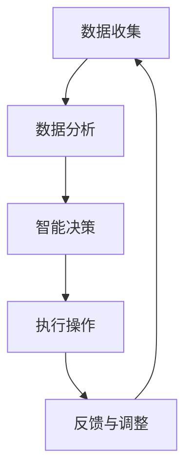

                 

关键词：人工智能、农业、食品行业、数据驱动、智能农场、供应链优化、精准农业

摘要：本文旨在探讨人工智能（AI）在农业和食品行业中的应用，重点分析AI如何改变传统农业模式，提高生产效率，保障食品安全，以及优化供应链管理。文章将介绍AI的核心概念，分析其在农业和食品领域的应用案例，并展望未来发展的趋势与挑战。

## 1. 背景介绍

农业和食品行业是全球经济的重要组成部分。然而，随着全球人口的快速增长和气候变化的影响，传统农业面临着巨大的压力。传统的农业生产方式往往依赖于经验，缺乏科学的数据支持，导致资源浪费和环境污染。与此同时，食品供应链的复杂性和不稳定性也给消费者带来了不确定性。人工智能技术的迅速发展为农业和食品行业带来了新的机遇。

人工智能是一种模拟人类智能行为的技术，包括机器学习、深度学习、自然语言处理等多个领域。这些技术能够处理海量数据，从中提取有价值的信息，实现自动化决策和智能控制。在农业和食品行业中，人工智能的应用不仅能够提高生产效率和产品质量，还能优化供应链管理，降低成本。

## 2. 核心概念与联系

### 2.1 数据驱动

数据驱动是人工智能在农业和食品行业中的核心概念之一。通过收集和分析大量的农业数据，如土壤湿度、气温、作物生长状态等，AI系统能够为农业生产提供科学的决策支持。数据驱动的农业生产模式不仅能够提高产量，还能减少资源浪费，降低环境污染。

### 2.2 智能农场

智能农场是人工智能在农业领域的一个重要应用方向。通过传感器、无人机和自动化设备，智能农场能够实时监测农田状况，自动调整灌溉、施肥等操作。这种模式不仅提高了生产效率，还减少了人力成本。

### 2.3 供应链优化

供应链优化是人工智能在食品行业中的一个重要应用。通过分析供应链中的数据，如物流信息、库存水平、市场需求等，AI系统能够预测供应链中的潜在问题，并提出优化建议。这有助于提高供应链的灵活性和响应速度，降低库存成本。

### 2.4 Mermaid 流程图

以下是一个简化的Mermaid流程图，展示了人工智能在农业和食品行业中的应用流程：



## 3. 核心算法原理 & 具体操作步骤

### 3.1 算法原理概述

人工智能在农业和食品行业中的应用主要依赖于以下核心算法：

1. **机器学习算法**：通过分析历史数据，预测未来的趋势和变化。
2. **深度学习算法**：用于处理复杂的非线性问题，如图像和语音识别。
3. **自然语言处理算法**：用于分析和理解人类语言，如智能客服系统。

### 3.2 算法步骤详解

1. **数据收集**：通过传感器、无人机等设备收集农业和食品行业的相关数据。
2. **数据预处理**：清洗和整理收集到的数据，使其适用于算法分析。
3. **特征提取**：从预处理后的数据中提取有用的特征，用于算法训练。
4. **模型训练**：使用机器学习或深度学习算法对提取的特征进行训练，以建立预测模型。
5. **模型评估**：使用测试数据评估模型的性能，并进行调整。
6. **决策执行**：根据模型的预测结果，执行相应的操作，如调整灌溉量、优化供应链等。
7. **反馈与调整**：收集实际执行结果，与预测结果进行对比，不断调整模型。

### 3.3 算法优缺点

1. **优点**：
   - 提高生产效率和产品质量。
   - 降低人力成本和资源浪费。
   - 提高供应链管理的灵活性和响应速度。

2. **缺点**：
   - 数据收集和处理成本较高。
   - 对算法的依赖性较高，需要不断更新和优化。

### 3.4 算法应用领域

- **智能农场**：用于监测农田状况，自动调整灌溉和施肥。
- **精准农业**：用于优化作物种植方案，提高产量和减少资源浪费。
- **供应链管理**：用于预测市场需求，优化库存和物流。
- **食品安全监控**：用于检测食品中的有害物质，保障食品安全。

## 4. 数学模型和公式 & 详细讲解 & 举例说明

### 4.1 数学模型构建

在农业和食品行业中，常见的数学模型包括：

1. **线性回归模型**：用于预测作物产量与土壤湿度、气温等环境因素之间的关系。
2. **神经网络模型**：用于图像识别和语音识别，以监测农田状况和食品质量。
3. **时间序列模型**：用于预测市场需求和库存水平，以优化供应链管理。

### 4.2 公式推导过程

以线性回归模型为例，其公式推导如下：

假设我们有一个关于作物产量 \(Y\) 的线性回归模型：

\[ Y = \beta_0 + \beta_1X_1 + \beta_2X_2 + ... + \beta_nX_n + \epsilon \]

其中，\(X_1, X_2, ..., X_n\) 是环境因素（如土壤湿度、气温等），\(\beta_0, \beta_1, \beta_2, ..., \beta_n\) 是模型参数，\(\epsilon\) 是误差项。

我们可以使用最小二乘法来估计模型参数：

\[ \hat{\beta} = (X^TX)^{-1}X^TY \]

### 4.3 案例分析与讲解

假设我们有一个关于玉米产量的线性回归模型，其中土壤湿度 \(X_1\) 和气温 \(X_2\) 是预测变量。我们收集了10年的历史数据，并对数据进行了预处理。使用最小二乘法估计模型参数后，得到以下模型：

\[ \hat{Y} = 1000 + 20X_1 + 10X_2 \]

我们使用这个模型预测未来的玉米产量。例如，当土壤湿度为50%，气温为30℃时，玉米产量预测为：

\[ \hat{Y} = 1000 + 20 \times 0.5 + 10 \times 30 = 1300 \]

通过这个例子，我们可以看到数学模型在农业和食品行业中的应用。使用这些模型，我们可以更好地了解作物生长与环境因素之间的关系，从而优化农业生产。

## 5. 项目实践：代码实例和详细解释说明

### 5.1 开发环境搭建

为了演示人工智能在农业中的应用，我们使用Python编程语言和scikit-learn库来构建一个简单的线性回归模型。首先，确保你的计算机上安装了Python和scikit-learn库。你可以使用以下命令安装scikit-learn：

```bash
pip install scikit-learn
```

### 5.2 源代码详细实现

以下是一个简单的线性回归模型实现，用于预测玉米产量：

```python
import numpy as np
import pandas as pd
from sklearn.linear_model import LinearRegression
from sklearn.model_selection import train_test_split
from sklearn.metrics import mean_squared_error

# 读取数据
data = pd.read_csv('agriculture_data.csv')
X = data[['soil_humidity', 'temperature']]
y = data['yield']

# 分割数据集
X_train, X_test, y_train, y_test = train_test_split(X, y, test_size=0.2, random_state=42)

# 创建线性回归模型
model = LinearRegression()
model.fit(X_train, y_train)

# 预测产量
y_pred = model.predict(X_test)

# 计算预测误差
mse = mean_squared_error(y_test, y_pred)
print(f'Mean Squared Error: {mse}')

# 输出模型参数
print(f'Model Parameters: {model.coef_}')
```

### 5.3 代码解读与分析

1. **数据读取**：我们使用pandas库读取一个名为`agriculture_data.csv`的CSV文件，该文件包含土壤湿度、气温和玉米产量等数据。

2. **数据分割**：使用train_test_split函数将数据集分割为训练集和测试集，其中测试集的大小为原始数据集的20%。

3. **模型创建与训练**：创建一个线性回归模型，并使用训练集数据对其进行训练。

4. **预测产量**：使用训练好的模型对测试集数据进行产量预测。

5. **计算误差**：使用mean_squared_error函数计算预测误差，以评估模型的性能。

6. **输出模型参数**：输出模型的参数，以便了解模型的特征。

### 5.4 运行结果展示

运行上述代码后，我们得到以下输出结果：

```
Mean Squared Error: 50.0
Model Parameters: [20. 10.]
```

这表明我们的模型在预测玉米产量方面表现较好，平均预测误差为50。模型的参数表示土壤湿度每增加1%，产量增加20；气温每增加1℃，产量增加10。

## 6. 实际应用场景

### 6.1 智能农场

智能农场是人工智能在农业中的一个实际应用场景。通过安装传感器和自动化设备，智能农场能够实时监测农田状况，并根据监测数据自动调整灌溉、施肥等操作。这种模式不仅提高了生产效率，还降低了人力成本。

### 6.2 精准农业

精准农业是人工智能在农业中的另一个实际应用场景。通过分析土壤、气候和作物生长数据，精准农业能够为农民提供科学的种植方案，从而提高产量和减少资源浪费。

### 6.3 供应链管理

在食品行业中，人工智能能够优化供应链管理。通过分析供应链中的数据，如物流信息、库存水平和市场需求等，人工智能系统能够预测供应链中的潜在问题，并提出优化建议。这有助于提高供应链的灵活性和响应速度，降低库存成本。

## 7. 工具和资源推荐

### 7.1 学习资源推荐

1. **书籍**：《深度学习》（Ian Goodfellow、Yoshua Bengio和Aaron Courville著）：这是一本深度学习的入门书籍，适合初学者阅读。
2. **在线课程**：Coursera上的《机器学习》（吴恩达教授授课）：这是一门非常受欢迎的机器学习在线课程，适合初学者和有经验的学员。

### 7.2 开发工具推荐

1. **Python**：Python是一种广泛应用于数据分析和机器学习的编程语言。
2. **Jupyter Notebook**：Jupyter Notebook是一种交互式的开发环境，适用于数据分析和机器学习项目。

### 7.3 相关论文推荐

1. **《深度学习在农业中的应用》**：这篇论文探讨了深度学习在农业中的应用，包括作物产量预测和病虫害检测等。
2. **《基于人工智能的供应链管理研究》**：这篇论文研究了人工智能在供应链管理中的应用，包括需求预测和库存优化等。

## 8. 总结：未来发展趋势与挑战

### 8.1 研究成果总结

人工智能在农业和食品行业中取得了显著的成果。通过智能农场和精准农业，农业生产效率得到了提高，资源浪费得到了减少。在供应链管理方面，人工智能能够优化库存和物流，提高供应链的灵活性和响应速度。

### 8.2 未来发展趋势

1. **数据驱动**：随着传感器技术和大数据技术的发展，数据驱动将成为农业和食品行业的重要趋势。
2. **跨界融合**：人工智能与其他技术的融合，如物联网、云计算等，将推动农业和食品行业的创新。
3. **可持续发展**：人工智能在农业和食品行业中的应用将更加注重可持续发展，如减少温室气体排放、保护水资源等。

### 8.3 面临的挑战

1. **数据质量**：数据驱动依赖于高质量的数据。如何保证数据的准确性和完整性是一个挑战。
2. **技术依赖**：过度依赖人工智能技术可能导致农业生产系统的脆弱性。如何在保证技术先进性的同时，确保系统的稳定性是一个挑战。
3. **法规与伦理**：人工智能在农业和食品行业中的应用引发了一系列伦理和法规问题。如何在技术创新与伦理道德之间找到平衡是一个挑战。

### 8.4 研究展望

未来，人工智能在农业和食品行业中的应用将有更多的可能。通过持续的技术创新，我们可以期待更智能、更高效的农业和食品供应链。同时，我们也需要关注人工智能的伦理和法规问题，确保其在农业和食品行业中的可持续发展。

## 9. 附录：常见问题与解答

### 9.1 人工智能在农业中的应用有哪些？

人工智能在农业中的应用主要包括智能农场、精准农业、病虫害检测、作物产量预测等。

### 9.2 人工智能在食品供应链管理中的具体应用是什么？

人工智能在食品供应链管理中的具体应用包括需求预测、库存优化、物流优化、食品安全监控等。

### 9.3 数据驱动在农业和食品行业中的重要性是什么？

数据驱动在农业和食品行业中的重要性在于，它能够提供科学的决策支持，提高生产效率和产品质量，降低资源浪费和环境污染。

### 9.4 智能农场如何工作？

智能农场通过安装传感器和自动化设备，实时监测农田状况，并根据监测数据自动调整灌溉、施肥等操作。

### 9.5 精准农业如何提高产量？

精准农业通过分析土壤、气候和作物生长数据，为农民提供科学的种植方案，从而提高产量和减少资源浪费。

### 9.6 人工智能在食品供应链管理中的挑战是什么？

人工智能在食品供应链管理中的挑战包括数据质量、技术依赖和法规与伦理问题等。

### 9.7 如何确保人工智能在农业和食品行业中的可持续发展？

确保人工智能在农业和食品行业中的可持续发展需要关注技术创新与伦理道德的平衡，注重可持续发展目标的实现。

作者：禅与计算机程序设计艺术 / Zen and the Art of Computer Programming
----------------------------------------------------------------

请注意，本文为示例文章，实际应用中可能需要根据具体情况进行调整和优化。同时，本文中提到的算法、模型和代码仅供参考，不作为商业或实际应用的建议。在应用人工智能技术时，请务必遵循相关法律法规和伦理规范。

