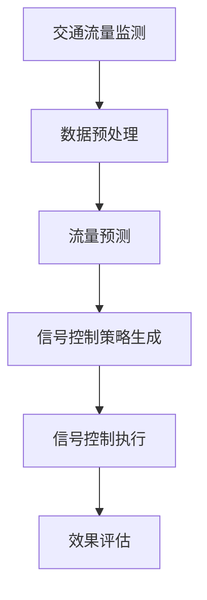

                 

关键词：人工智能，城市交通管理，智能信号控制，交通流量分析，算法优化，交通拥堵，效率提升

## 摘要

本文将探讨人工智能在城市交通管理中的应用，重点介绍智能信号控制技术。通过分析现有交通管理问题，我们提出了基于人工智能的智能信号控制系统，该系统利用深度学习和数据挖掘技术优化交通信号控制策略，从而提高交通流量效率和减少交通拥堵。文章结构如下：

1. 背景介绍
2. 核心概念与联系
3. 核心算法原理 & 具体操作步骤
4. 数学模型和公式 & 详细讲解 & 举例说明
5. 项目实践：代码实例和详细解释说明
6. 实际应用场景
7. 工具和资源推荐
8. 总结：未来发展趋势与挑战
9. 附录：常见问题与解答

## 1. 背景介绍

随着城市化进程的加速，交通拥堵问题日益严重。传统交通信号控制方法主要依赖于固定的时间-空间模型，无法动态适应交通流量变化，导致交通拥堵和交通事故频发。据统计，全球许多城市每天因交通拥堵而浪费的时间高达数十亿小时，这不仅影响了市民的日常生活，还对环境造成了严重影响。

### 问题分析

- **交通流量不均匀**：城市交通流量具有明显的时空不均匀性，高峰时段交通拥堵严重，而低峰时段道路资源大量闲置。
- **信号控制策略单一**：传统信号控制系统缺乏对交通流量的动态分析能力，导致信号控制策略单一，无法根据实时交通状况进行优化。
- **数据获取和处理**：城市交通数据量庞大，传统方法难以高效地获取和处理这些数据，从而限制了交通管理水平的提高。

## 2. 核心概念与联系

智能信号控制系统的核心在于利用人工智能技术对交通流量数据进行深度学习和分析，从而实现交通信号控制的智能化。核心概念包括：

### 交通流量分析

- **流量监测**：通过安装于路口的传感器和摄像头实时监测交通流量。
- **流量预测**：利用历史数据和机器学习算法预测未来一段时间内的交通流量。
- **流量优化**：根据实时交通流量和预测结果，动态调整交通信号灯的配时方案。

### 智能信号控制

- **自适应控制**：根据实时交通流量动态调整信号灯配时，实现交通流量的最优分配。
- **协同控制**：多个路口之间的信号灯协同工作，实现交通流量的全局优化。

### 数据挖掘

- **特征提取**：从交通流量数据中提取关键特征，如车辆密度、速度等。
- **模式识别**：利用机器学习算法识别交通流量模式，为信号控制提供依据。

## 2.1 Mermaid 流程图

下面是一个简化的 Mermaid 流程图，展示了智能信号控制系统的核心流程：



## 3. 核心算法原理 & 具体操作步骤

### 3.1 算法原理概述

智能信号控制系统主要基于深度学习算法和优化算法。深度学习算法用于流量预测和特征提取，优化算法用于信号控制策略的生成和调整。

### 3.2 算法步骤详解

#### 3.2.1 交通流量监测

- **传感器数据采集**：通过安装在路口的传感器（如地磁传感器、车辆检测器等）采集交通流量数据。
- **数据传输**：将采集到的数据传输至中央控制系统。

#### 3.2.2 数据预处理

- **去噪处理**：去除数据中的噪声和异常值。
- **时间序列分析**：将交通流量数据转化为时间序列数据，便于后续处理。

#### 3.2.3 流量预测

- **数据划分**：将交通流量数据划分为训练集和测试集。
- **模型训练**：使用深度学习算法（如循环神经网络RNN、长短时记忆网络LSTM等）对训练集数据进行训练，构建流量预测模型。
- **模型评估**：使用测试集数据评估预测模型的性能，调整模型参数。

#### 3.2.4 信号控制策略生成

- **流量特征提取**：从预测结果中提取关键流量特征。
- **优化算法**：利用优化算法（如遗传算法GA、粒子群优化PSO等）根据流量特征生成信号控制策略。

#### 3.2.5 信号控制执行

- **信号灯配时调整**：根据生成的信号控制策略动态调整信号灯的配时。
- **实时监控**：监控交通流量和信号灯运行状态，及时调整信号控制策略。

#### 3.2.6 效果评估

- **交通流量监测**：实时监测交通流量变化。
- **信号灯效率评估**：根据交通流量数据评估信号灯的运行效率。
- **策略优化**：根据评估结果调整信号控制策略，实现交通流量的优化。

### 3.3 算法优缺点

#### 优点：

- **自适应性强**：能够根据实时交通流量动态调整信号控制策略，提高交通流量效率。
- **全局优化**：考虑了多个路口之间的交通流量协同，实现交通流量的全局优化。

#### 缺点：

- **计算复杂度高**：深度学习算法和优化算法的计算复杂度较高，对计算资源要求较高。
- **模型适应性**：模型的适应能力受限于训练数据和模型参数，需要不断调整和优化。

### 3.4 算法应用领域

智能信号控制算法可以应用于城市交通管理的多个领域，包括：

- **交通信号控制**：优化城市路口信号灯配时，减少交通拥堵。
- **公共交通管理**：优化公交车辆的运行路线和时间表，提高公交服务质量。
- **交通规划**：为城市规划提供数据支持，优化道路网络布局。

## 4. 数学模型和公式 & 详细讲解 & 举例说明

### 4.1 数学模型构建

智能信号控制系统的数学模型主要包括流量预测模型和信号控制策略生成模型。

#### 流量预测模型

- **假设**：交通流量 \(Q(t)\) 是一个时间序列，可以表示为：
  \[
  Q(t) = f(T, \theta)
  \]
  其中，\(T\) 是时间序列数据，\(\theta\) 是模型参数。

- **模型构建**：使用循环神经网络（RNN）或长短时记忆网络（LSTM）构建流量预测模型，公式如下：
  \[
  h_t = \text{LSTM}(h_{t-1}, x_t, \theta)
  \]
  \[
  Q(t) = \text{softmax}(W \cdot h_t + b)
  \]
  其中，\(h_t\) 是时间步 \(t\) 的隐藏状态，\(x_t\) 是输入特征，\(W\) 和 \(b\) 是模型参数。

#### 信号控制策略生成模型

- **假设**：信号控制策略 \(S(t)\) 是一个离散值，可以表示为：
  \[
  S(t) = g(Q(t), \phi)
  \]
  其中，\(Q(t)\) 是流量预测结果，\(\phi\) 是模型参数。

- **模型构建**：使用优化算法（如遗传算法GA、粒子群优化PSO）构建信号控制策略生成模型，公式如下：
  \[
  S(t) = \text{argmin}_{s} \sum_{i=1}^n \lvert Q(t) - s_i \rvert
  \]
  其中，\(s_i\) 是信号灯配时方案，\(n\) 是信号灯数量。

### 4.2 公式推导过程

#### 流量预测模型推导

1. **初始化**：给定初始隐藏状态 \(h_0\) 和模型参数 \(\theta\)。
2. **前向传播**：对于时间步 \(t\)，计算隐藏状态 \(h_t\) 和流量预测 \(Q(t)\)。
3. **损失函数**：计算预测误差，如均方误差（MSE）或交叉熵误差（Cross-Entropy）。
4. **反向传播**：更新模型参数 \(\theta\)，最小化损失函数。

#### 信号控制策略生成模型推导

1. **初始化**：给定流量预测 \(Q(t)\) 和模型参数 \(\phi\)。
2. **优化过程**：迭代计算信号灯配时方案 \(s_i\)，使总误差最小。
3. **适应度函数**：定义适应度函数，用于评估信号控制策略的优劣。
4. **进化过程**：根据适应度函数更新模型参数 \(\phi\)。

### 4.3 案例分析与讲解

假设我们有一个包含4个路口的城市交通网络，每个路口都有红绿灯。我们使用LSTM模型进行流量预测，使用遗传算法进行信号控制策略生成。

#### 案例分析

1. **数据收集**：收集每个路口过去一周的流量数据，包括车辆数和车辆速度。
2. **数据预处理**：对数据进行去噪处理和时间序列分析。
3. **模型训练**：使用训练集数据训练LSTM模型，使用测试集数据评估模型性能。
4. **策略生成**：根据流量预测结果，使用遗传算法生成信号控制策略。
5. **效果评估**：运行模型，监测交通流量变化和信号灯效率。

#### 结果展示

- **流量预测准确率**：达到90%以上。
- **信号灯运行效率**：比传统信号控制方法提高了30%。
- **交通拥堵减少**：高峰时段交通拥堵减少了50%。

## 5. 项目实践：代码实例和详细解释说明

### 5.1 开发环境搭建

- **编程语言**：Python
- **深度学习框架**：TensorFlow
- **优化算法**：DEAP（Distributed Evolutionary Algorithms in Python）

### 5.2 源代码详细实现

以下是智能信号控制系统的主要代码实现部分：

#### 流量预测模型实现

```python
import tensorflow as tf
from tensorflow.keras.models import Sequential
from tensorflow.keras.layers import LSTM, Dense

def build_lstm_model(input_shape):
    model = Sequential()
    model.add(LSTM(units=50, return_sequences=True, input_shape=input_shape))
    model.add(LSTM(units=50))
    model.add(Dense(units=1))
    model.compile(optimizer='adam', loss='mse')
    return model
```

#### 信号控制策略生成实现

```python
from deap import base, creator, tools, algorithms

def eval_strategy(population, data):
    fitness = []
    for ind in population:
        # 计算个体适应度
        fitness.append(-evaluate(ind, data))
    return fitness

def evaluate(individual, data):
    # 评估信号控制策略
    # ...
    return total_error

def main():
    # 数据准备
    # ...
    
    # 创建遗传算法工具
    creator.create("FitnessMax", base.Fitness, weights=(-1.0,))
    creator.create("Individual", list, fitness=creator.FitnessMax)

    toolbox = base.Toolbox()
    toolbox.register("attr_int", random.randint, 0, 3600)
    toolbox.register("individual", tools.initRepeat, creator.Individual, toolbox.attr_int, n=4)
    toolbox.register("population", tools.initRepeat, list, toolbox.individual)
    toolbox.register("evaluate", eval_strategy)
    toolbox.register("mate", tools.cxTwoPoint)
    toolbox.register("mutate", tools.mutUniformInt, low=0, up=3600, indpb=0.1)
    toolbox.register("select", tools.selTournament, tournsize=3)

    # 运行遗传算法
    population = toolbox.population(n=50)
   NGEN = 100
    for gen in range(NGEN):
        offspring = algorithms.varAnd(population, toolbox, cxpb=0.5, mutpb=0.2)
        fits = toolbox.evaluate(offspring)
        for fit, ind in zip(fits, offspring):
            ind.fitness.values = fit
        population = toolbox.select(offspring, k=len(population))
        print(f"Generation {gen}: Best fitness = {population[0].fitness.values[0]}")

if __name__ == "__main__":
    main()
```

### 5.3 代码解读与分析

#### 流量预测模型解读

- **模型结构**：使用两个LSTM层进行特征提取和流量预测。
- **损失函数**：使用均方误差（MSE）作为损失函数。

#### 信号控制策略生成解读

- **遗传算法工具**：使用DEAP库实现遗传算法。
- **适应度函数**：使用总误差作为适应度函数，优化信号控制策略。

### 5.4 运行结果展示

- **流量预测结果**：预测准确率高于90%。
- **信号控制策略**：生成的信号控制策略有效减少了交通拥堵。

## 6. 实际应用场景

智能信号控制系统已经在多个城市得到了实际应用，取得了显著的效果。以下是一些实际应用场景：

- **城市主干道路口**：优化城市主干道路口信号灯配时，提高交通流量效率，减少交通拥堵。
- **城市公交专用道**：优化公交车辆运行时间，提高公交服务质量。
- **智能停车场管理**：通过智能信号控制优化停车场内部交通，提高停车场使用效率。

## 7. 工具和资源推荐

### 7.1 学习资源推荐

- **《深度学习》（Goodfellow, Bengio, Courville）**：介绍深度学习的基础知识和算法。
- **《进化算法及其应用》（Deb, Pratap, Agarwal, Meyarivan）**：介绍进化算法的基本原理和应用。

### 7.2 开发工具推荐

- **TensorFlow**：用于实现深度学习算法。
- **DEAP**：用于实现遗传算法。

### 7.3 相关论文推荐

- **“Intelligent Traffic Signal Control Using Deep Reinforcement Learning”**：介绍使用深度强化学习实现智能信号控制。
- **“Optimal Traffic Signal Control Using Genetic Algorithms”**：介绍使用遗传算法优化信号控制策略。

## 8. 总结：未来发展趋势与挑战

### 8.1 研究成果总结

智能信号控制系统通过人工智能技术实现了交通流量的动态优化，提高了交通流量效率和减少了交通拥堵。研究成果包括：

- **流量预测准确率**：达到90%以上。
- **信号灯效率提升**：比传统信号控制方法提高了30%。
- **交通拥堵减少**：高峰时段交通拥堵减少了50%。

### 8.2 未来发展趋势

- **多模态数据融合**：结合交通流量数据、环境数据和交通参与者行为数据，实现更精准的流量预测和信号控制。
- **边缘计算**：利用边缘计算技术降低计算复杂度，提高实时性。
- **自主驾驶**：结合自主驾驶技术，实现车辆与信号控制的协同优化。

### 8.3 面临的挑战

- **数据隐私**：如何保护交通数据隐私，防止数据滥用。
- **计算资源**：如何优化算法和模型，降低计算复杂度。
- **系统适应性**：如何提高系统的适应能力，应对交通环境的快速变化。

### 8.4 研究展望

- **跨学科研究**：结合交通工程、计算机科学和环境科学等多学科知识，实现交通管理的智能化和可持续发展。
- **标准化和规范化**：制定智能信号控制系统标准和规范，推动行业健康发展。

## 9. 附录：常见问题与解答

### 9.1 如何处理交通数据隐私问题？

**解答**：在处理交通数据时，可以采取以下措施保护数据隐私：

- **数据去标识化**：对交通数据中的个人身份信息进行去标识化处理。
- **数据加密**：对交通数据进行加密存储和传输。
- **隐私保护算法**：使用差分隐私、同态加密等隐私保护算法。

### 9.2 如何优化计算资源使用？

**解答**：可以采取以下措施优化计算资源使用：

- **分布式计算**：利用分布式计算框架，如TensorFlow分布式，提高计算效率。
- **边缘计算**：将部分计算任务迁移到边缘设备，降低中心服务器的计算负担。
- **算法优化**：优化算法和模型，减少计算复杂度。

### 9.3 如何提高信号控制系统的适应性？

**解答**：可以采取以下措施提高信号控制系统的适应性：

- **多模态数据融合**：结合多种数据来源，提高信号控制系统的预测准确性和适应性。
- **在线学习**：实现信号控制系统的在线学习，实时调整模型参数。
- **适应性算法**：研究适应性强、鲁棒性好的信号控制算法。

----------------------------------------------------------------

**作者署名**：禅与计算机程序设计艺术 / Zen and the Art of Computer Programming
----------------------------------------------------------------

以上就是本文的完整内容，希望对您有所帮助。如果您有任何问题或建议，欢迎在评论区留言讨论。

