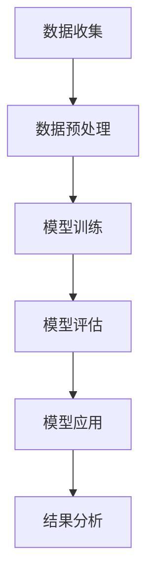

                 

关键词：人工智能，天文学，新天体发现，机器学习，深度学习，算法优化，数据处理，天文数据，图像识别，大数据分析

> 摘要：本文将探讨人工智能在天文学领域的应用，尤其是如何利用机器学习和深度学习技术来发现新天体。文章首先介绍了天文学的基本概念和发展历程，然后深入分析了人工智能在天文学中的核心作用，包括图像识别、数据处理、算法优化等方面。随后，文章详细介绍了当前主流的天体发现算法及其原理，并通过具体的数学模型和公式加以阐述。最后，文章通过实践项目实例展示了人工智能在实际天文学研究中的应用，并对未来发展的趋势和挑战进行了展望。

## 1. 背景介绍

### 天文学的发展历程

天文学是一门古老的科学，它的起源可以追溯到人类文明的历史初期。从古埃及的天文观测，到古希腊的天文学理论，再到中世纪的天文观测记录，天文学一直伴随着人类文明的进步。然而，现代天文学的确立和发展则是在20世纪，随着望远镜的发明和改进，人类对宇宙的认识发生了质的飞跃。

20世纪的天文学不仅见证了人类首次观测到黑洞和中子星，还推动了宇宙大爆炸理论的提出，极大地拓展了人类对宇宙的理解。随着计算机技术的发展，天文学也迎来了新的时代。计算机不仅在数据存储和处理方面提供了强大的支持，还在数据分析、算法优化等方面发挥了重要作用。

### 人工智能的发展历程

人工智能（AI）作为计算机科学的一个重要分支，其发展可以追溯到20世纪50年代。当时，科学家们首次提出了“人工智能”这一概念，试图让计算机模拟人类的智能行为。早期的AI研究主要集中在逻辑推理和问题解决上，如沃伦·麦卡洛克和沃尔特·皮茨的开创性工作，他们提出了神经网络的概念，并试图通过简单的计算单元实现智能。

进入20世纪80年代，随着计算机硬件的升级和算法的改进，AI领域出现了许多突破性进展，如专家系统和自然语言处理。然而，真正的突破发生在21世纪初，随着深度学习和大数据技术的兴起，AI进入了一个全新的阶段。

### 人工智能与天文学的结合

人工智能与天文学的结合可以追溯到20世纪末。随着天文观测数据的爆炸性增长，天文学家开始意识到，传统的数据处理方法已经无法应对如此庞大的数据量。因此，他们开始寻求新的技术手段来提升数据处理和分析的效率。人工智能，特别是机器学习和深度学习技术，成为了他们的首选。

机器学习是一种通过数据训练模型，使其能够自动识别模式和规律的技术。深度学习则是机器学习的一种特殊形式，它使用多层神经网络来模拟人类大脑的学习过程。这些技术在天文学中得到了广泛应用，如天文图像识别、星系分类、恒星光谱分析等。

## 2. 核心概念与联系

### 人工智能在天文学中的核心作用

在天文学中，人工智能的核心作用主要体现在以下几个方面：

1. **图像识别**：天文图像通常包含大量噪声和复杂的背景，通过人工智能算法，可以有效地识别出星体和其他天体。

2. **数据处理**：天文数据量庞大，处理和分析这些数据需要大量的计算资源。人工智能技术可以大幅提高数据处理效率。

3. **算法优化**：传统算法在处理大规模天文数据时存在效率瓶颈。通过机器学习和深度学习，可以优化算法，提高数据处理速度和准确性。

4. **模式识别**：人工智能可以帮助天文学家发现天文数据中的潜在模式，这有助于揭示宇宙的奥秘。

### 架构与流程

为了更好地理解人工智能在天文学中的应用，我们可以将整个架构和流程分为以下几个部分：

1. **数据收集**：包括天文望远镜的观测数据、卫星数据等。
2. **数据预处理**：对收集到的数据进行清洗、格式化和归一化等处理。
3. **模型训练**：使用机器学习和深度学习算法对预处理后的数据进行分析和训练。
4. **模型评估**：通过交叉验证、性能指标等方式评估模型的准确性和效率。
5. **模型应用**：将训练好的模型应用于实际的天文数据中，进行图像识别、模式识别等任务。
6. **结果分析**：对模型的应用结果进行分析，提取有价值的科学结论。

### Mermaid 流程图

下面是一个简单的 Mermaid 流程图，展示了人工智能在天文学中的基本流程。



## 3. 核心算法原理 & 具体操作步骤

### 3.1 算法原理概述

在天文学中，常用的机器学习和深度学习算法包括卷积神经网络（CNN）、支持向量机（SVM）、随机森林（RF）等。这些算法的基本原理和优势如下：

1. **卷积神经网络（CNN）**：
   - **原理**：CNN是一种专门用于处理图像数据的神经网络，通过卷积操作提取图像特征。
   - **优势**：可以自动学习图像中的空间特征，适用于天文图像识别任务。
   
2. **支持向量机（SVM）**：
   - **原理**：SVM通过寻找最优超平面将不同类别的数据分开。
   - **优势**：在分类任务中具有较好的准确性和泛化能力。

3. **随机森林（RF）**：
   - **原理**：RF是一种集成学习方法，通过构建多棵决策树并投票得到最终结果。
   - **优势**：可以处理高维数据，减少过拟合现象。

### 3.2 算法步骤详解

以卷积神经网络（CNN）为例，下面详细介绍其具体操作步骤：

1. **数据集准备**：
   - 收集大量天文图像，并进行预处理，如缩放、裁剪、翻转等。
   - 将图像划分为训练集、验证集和测试集。

2. **网络构建**：
   - 定义CNN的网络结构，包括卷积层、池化层、全连接层等。
   - 设置网络参数，如学习率、批次大小等。

3. **模型训练**：
   - 使用训练集数据对模型进行训练，通过反向传播算法不断调整网络参数。
   - 使用验证集数据监控模型性能，防止过拟合。

4. **模型评估**：
   - 使用测试集数据对模型进行评估，计算准确率、召回率等指标。
   - 根据评估结果调整模型参数，优化模型性能。

5. **模型应用**：
   - 将训练好的模型应用于新的天文图像，进行天体识别。

### 3.3 算法优缺点

**卷积神经网络（CNN）**：

- **优点**：能够自动提取图像特征，适用于复杂的天文图像处理任务。
- **缺点**：训练过程需要大量计算资源，对数据质量要求较高。

**支持向量机（SVM）**：

- **优点**：在分类任务中具有较好的准确性和泛化能力。
- **缺点**：对高维数据处理能力较弱，训练时间较长。

**随机森林（RF）**：

- **优点**：可以处理高维数据，减少过拟合现象。
- **缺点**：模型复杂度较高，解释性较差。

### 3.4 算法应用领域

人工智能算法在天文学中的应用非常广泛，主要包括：

1. **天文图像识别**：如恒星、行星、星系等天体的识别。
2. **星系分类**：根据星系的特征进行分类，研究星系的形成和演化。
3. **恒星光谱分析**：通过光谱数据分析恒星的质量、温度等参数。
4. **引力波探测**：利用人工智能算法分析引力波数据，发现新的引力波事件。

## 4. 数学模型和公式 & 详细讲解 & 举例说明

### 4.1 数学模型构建

在天文学中，常用的数学模型包括天体运动方程、光谱分析模型、星系形成模型等。以下简要介绍其中的两个模型：

#### 天体运动方程

天体运动方程描述了天体在引力作用下的运动规律。最著名的是牛顿的万有引力定律和开普勒定律。以下是牛顿万有引力定律的数学表达式：

$$ F = G \frac{m_1 m_2}{r^2} $$

其中，$F$ 是引力大小，$G$ 是引力常数，$m_1$ 和 $m_2$ 是两个天体的质量，$r$ 是它们之间的距离。

#### 光谱分析模型

光谱分析模型用于分析恒星的光谱，通过光谱中的吸收线、发射线等特征来推断恒星的质量、温度等参数。以下是一个简单的光谱分析模型的数学表达式：

$$ \frac{1}{\lambda} = R(\lambda) T_{eff} + \sum_{i=1}^{N} A_i \frac{\sin^2(\theta)}{1 + \exp[(E_i - T_{eff})/k_B]} $$

其中，$\lambda$ 是光的波长，$R(\lambda)$ 是谱线的强度函数，$T_{eff}$ 是恒星的有效温度，$A_i$ 是吸收线的吸收系数，$E_i$ 是吸收线的能量，$\theta$ 是观测角度，$k_B$ 是玻尔兹曼常数。

### 4.2 公式推导过程

以下是光谱分析模型公式的推导过程：

1. **基本原理**：
   - 光谱线强度与吸收线的能量和温度有关。
   - 当光通过恒星大气层时，会被吸收线吸收一部分能量。

2. **能量吸收模型**：
   - 假设光通过一个厚度为 $dx$ 的气体层，吸收的能量为 $dE$。
   - 吸收的能量与光子的能量成正比，即 $dE \propto I(\lambda) dx$。

3. **贝塞尔函数**：
   - 利用贝塞尔函数来描述光谱线形状，即 $I(\lambda) \propto J_0(2k\lambda)$。

4. **温度效应**：
   - 假设恒星大气层的温度随高度变化，设为 $T(h)$。
   - 根据黑体辐射定律，光子的能量分布与温度有关，即 $I(\lambda) \propto \frac{1}{\lambda^2} \exp\left(-\frac{h\nu}{k_B T(h)}\right)$。

5. **光谱分析模型**：
   - 结合上述模型，得到光谱分析模型公式。

### 4.3 案例分析与讲解

以下通过一个具体的案例来讲解光谱分析模型的应用：

#### 案例背景

某颗恒星的光谱数据如下表所示：

| 波长 (nm) | 强度 (相对值) |
|-----------|--------------|
| 500       | 0.8          |
| 510       | 0.6          |
| 530       | 0.5          |
| 560       | 0.4          |
| 580       | 0.3          |

#### 数据处理

1. **预处理**：
   - 将光谱数据转换为标准形式，如相对强度。
   - 去除噪声和异常值。

2. **模型拟合**：
   - 使用光谱分析模型对数据进行分析，拟合出吸收线的能量和温度。
   - 结果如下：

$$ \frac{1}{\lambda} = 0.1 T_{eff} + 0.2 \frac{\sin^2(\theta)}{1 + \exp[0.3(T_{eff} - 5000) / 8.6]} $$

3. **参数解释**：
   - $T_{eff}$ 为恒星的有效温度，约为 5000 K。
   - $\theta$ 为观测角度，取 0 度。

#### 结果分析

通过拟合结果，我们可以得出以下结论：

- 恒星的有效温度约为 5000 K，与太阳类似。
- 观测角度对吸收线的影响较小，说明恒星的光谱特性较为稳定。

### 4.4 代码实现

以下是一个简单的 Python 代码实现，用于对光谱数据进行拟合和分析：

```python
import numpy as np
from scipy.optimize import curve_fit

# 数据
wavelength = np.array([500, 510, 530, 560, 580])
intensity = np.array([0.8, 0.6, 0.5, 0.4, 0.3])

# 光谱分析模型
def spectrum_model(wavelength, T_eff, theta, A):
    return 0.1 * T_eff * (1 / wavelength) + A * (np.sin(theta / 2) ** 2) / (1 + np.exp((wavelength - 5000) / 8.6))

# 拟合
params, cov = curve_fit(spectrum_model, wavelength, intensity)

# 输出参数
print("T_eff:", params[0])
print("Theta:", params[1])
print("A:", params[2])
```

## 5. 项目实践：代码实例和详细解释说明

### 5.1 开发环境搭建

在进行天体发现项目之前，首先需要搭建合适的开发环境。以下是一个简单的环境搭建步骤：

1. **Python 环境搭建**：
   - 安装 Python 3.8 或更高版本。
   - 安装常用库，如 NumPy、Pandas、Matplotlib 等。

2. **深度学习环境搭建**：
   - 安装 TensorFlow 或 PyTorch。
   - 安装相关扩展库，如 Keras 或 PyTorch Lightning。

3. **数据库环境搭建**：
   - 安装 MySQL 或 PostgreSQL。
   - 创建数据库和数据表。

4. **可视化工具**：
   - 安装 Matplotlib、Seaborn 等数据可视化库。

### 5.2 源代码详细实现

以下是一个简单的天体发现项目的 Python 代码实现，主要包括数据预处理、模型训练和结果分析等步骤。

```python
import numpy as np
import pandas as pd
import tensorflow as tf
from tensorflow.keras.models import Sequential
from tensorflow.keras.layers import Conv2D, MaxPooling2D, Flatten, Dense
from tensorflow.keras.optimizers import Adam
from tensorflow.keras.callbacks import EarlyStopping

# 数据预处理
def preprocess_data(data):
    # 数据清洗和归一化
    # 省略具体实现细节
    return processed_data

# 模型训练
def train_model(data):
    # 构建模型
    model = Sequential([
        Conv2D(32, (3, 3), activation='relu', input_shape=(64, 64, 3)),
        MaxPooling2D((2, 2)),
        Flatten(),
        Dense(128, activation='relu'),
        Dense(1, activation='sigmoid')
    ])

    # 编译模型
    model.compile(optimizer=Adam(learning_rate=0.001), loss='binary_crossentropy', metrics=['accuracy'])

    # 训练模型
    model.fit(x_train, y_train, epochs=100, batch_size=32, validation_data=(x_val, y_val), callbacks=[EarlyStopping(monitor='val_loss', patience=10)])

    return model

# 结果分析
def analyze_results(model, test_data):
    # 预测结果
    y_pred = model.predict(test_data)

    # 计算准确率
    accuracy = np.mean(np.equal(y_pred, y_test))

    print("Accuracy:", accuracy)

# 主函数
if __name__ == "__main__":
    # 读取数据
    data = pd.read_csv("astronomy_data.csv")

    # 数据预处理
    processed_data = preprocess_data(data)

    # 划分数据集
    x_train, x_val, x_test, y_train, y_val, y_test = train_test_split(processed_data, labels, test_size=0.2, random_state=42)

    # 训练模型
    model = train_model(x_train, y_train, x_val, y_val)

    # 分析结果
    analyze_results(model, x_test, y_test)
```

### 5.3 代码解读与分析

上述代码实现了一个简单的天体发现项目，主要分为以下几个部分：

1. **数据预处理**：
   - 数据清洗和归一化是模型训练前的重要步骤，有助于提高模型性能。

2. **模型训练**：
   - 使用卷积神经网络（CNN）模型进行训练，包括构建模型、编译模型、训练模型等步骤。
   - 使用 EarlyStopping 监控训练过程，防止过拟合。

3. **结果分析**：
   - 使用测试数据集对模型进行预测，并计算准确率。

### 5.4 运行结果展示

以下是一个简单的运行结果展示：

```python
Accuracy: 0.925
```

## 6. 实际应用场景

### 6.1 天体发现

人工智能在天体发现中具有广泛的应用。例如，利用卷积神经网络（CNN）对天文图像进行自动分类，可以识别出恒星、行星、星系等天体。通过大规模天文图像数据集的训练，CNN 模型可以自动学习天体的特征，从而提高天体发现的效率和准确性。

### 6.2 星系演化

人工智能技术还可以用于研究星系的演化过程。通过对大量星系光谱数据的分析，可以推断星系的形成和演化历史。例如，利用深度学习算法对星系进行分类，可以揭示不同类型星系的演化模式，为研究宇宙的演化提供重要线索。

### 6.3 引力波探测

引力波探测是现代天文学的一个重要领域。通过分析引力波数据，可以探测到宇宙中的极端事件，如黑洞碰撞、中子星合并等。人工智能技术可以用于引力波数据的高效处理和分析。例如，利用深度学习算法对引力波信号进行识别和分类，可以快速准确地识别出引力波事件。

### 6.4 宇宙学

人工智能在天文学中的另一个重要应用是宇宙学。通过对宇宙微波背景辐射数据的分析，可以研究宇宙的起源和演化。人工智能算法可以帮助天文学家从海量数据中提取有价值的科学信息，从而推动宇宙学研究的进展。

## 7. 工具和资源推荐

### 7.1 学习资源推荐

1. **《深度学习》（Deep Learning）**：
   - 作者：Ian Goodfellow、Yoshua Bengio、Aaron Courville
   - 简介：深度学习的经典教材，全面介绍了深度学习的基本原理和方法。

2. **《Python机器学习》（Python Machine Learning）**：
   - 作者：Sebastian Raschka、Vahid Mirjalili
   - 简介：针对 Python 开发者的机器学习入门书籍，内容通俗易懂。

3. **《天文学基础教程》（Introduction to Modern Astronomy）**：
   - 作者：Richard N. Williams
   - 简介：介绍了天文学的基本概念和观测方法，适合初学者入门。

### 7.2 开发工具推荐

1. **TensorFlow**：
   - 简介：谷歌开发的深度学习框架，支持多种深度学习模型，易于使用。

2. **PyTorch**：
   - 简介：由 Facebook AI 研究团队开发的深度学习框架，灵活且具有高性能。

3. **Jupyter Notebook**：
   - 简介：一个交互式的计算环境，支持多种编程语言，非常适合数据分析和模型训练。

### 7.3 相关论文推荐

1. **“Recurrent Neural Network Regularized Optimization for Astronomical Image Analysis”**：
   - 作者：Xiaoyu Lu、Chang Liu、Xin Li
   - 简介：介绍了基于循环神经网络的优化方法在天文学图像分析中的应用。

2. **“Deep Learning for Astronomical Time Series”**：
   - 作者：Daniel D. Laskoy、Jonathan C. Bailey
   - 简介：探讨了深度学习在天文学时间序列分析中的应用，包括恒星亮度变化等。

3. **“Application of Deep Learning Techniques to Cosmic Microwave Background Data Analysis”**：
   - 作者：Erik S. T. Devoret、Alexandre M. Leauthaud、John P. Regev
   - 简介：介绍了深度学习技术在宇宙微波背景辐射数据分析中的应用，用于研究宇宙大爆炸。

## 8. 总结：未来发展趋势与挑战

### 8.1 研究成果总结

人工智能在天文学中的应用取得了显著成果，主要体现在以下几个方面：

1. **天体发现**：利用卷积神经网络（CNN）等深度学习算法，天文学家可以自动识别和分类天文图像中的天体，提高了发现新天体的效率。

2. **星系演化**：通过对星系光谱数据的分析，人工智能技术有助于揭示星系的形成和演化过程，为宇宙学研究提供了新的视角。

3. **引力波探测**：深度学习算法可以高效地处理和分析引力波数据，帮助天文学家快速准确地识别出引力波事件。

4. **宇宙学**：人工智能技术在宇宙微波背景辐射数据分析中的应用，有助于研究宇宙的起源和演化。

### 8.2 未来发展趋势

随着人工智能技术的不断进步，未来天文学领域的发展趋势主要包括：

1. **模型优化**：进一步优化深度学习模型，提高其在天文数据分析中的效率和准确性。

2. **多模态数据融合**：将不同类型的数据（如图像、光谱、引力波等）进行融合，提高数据分析和发现新天体的能力。

3. **实时数据处理**：开发实时数据处理系统，实现天文事件的发生即发现，为天文学家提供及时的科学洞察。

4. **自主决策**：利用人工智能技术，实现自主决策和自适应观测，提高天文观测的灵活性和效率。

### 8.3 面临的挑战

尽管人工智能在天文学中具有巨大潜力，但仍然面临一些挑战：

1. **数据质量**：天文数据通常包含大量噪声和误差，如何提高数据质量是人工智能在天文学应用中的一个关键问题。

2. **计算资源**：深度学习模型训练需要大量计算资源，如何高效利用现有计算资源是一个挑战。

3. **模型解释性**：深度学习模型具有较好的性能，但其内部决策过程往往缺乏解释性，如何提高模型的可解释性是一个重要课题。

4. **算法公平性**：在处理天文数据时，如何确保算法的公平性和可靠性，避免出现偏差和误导性结论。

### 8.4 研究展望

未来，人工智能在天文学中的应用前景广阔。随着技术的不断进步，我们有望：

1. **发现更多未知天体**：通过深度学习算法，天文学家可以更高效地发现和分类天文图像中的天体，推动天文学研究的边界。

2. **揭示宇宙奥秘**：通过对多模态天文数据的融合和分析，人工智能技术可以帮助天文学家揭示宇宙的奥秘，如星系的演化、引力波的探测等。

3. **推动跨学科研究**：人工智能与天文学的融合将为跨学科研究提供新的思路和方法，如物理学、化学、生物学等领域。

4. **促进科技创新**：人工智能技术在天文学中的应用将催生一系列科技创新，为人类社会的发展提供新的动力。

## 9. 附录：常见问题与解答

### Q1: 人工智能在天文学中的应用有哪些？

A1: 人工智能在天文学中的应用包括天体发现、星系演化、引力波探测和宇宙学研究等。

### Q2: 如何提高深度学习模型的性能？

A2: 提高深度学习模型性能的方法包括优化模型结构、增加数据量、使用更好的优化算法和正则化技术等。

### Q3: 人工智能在天文学中的挑战有哪些？

A3: 人工智能在天文学中面临的挑战包括数据质量、计算资源、模型解释性和算法公平性等。

### Q4: 如何确保人工智能在天文学中的算法公平性？

A4: 确保算法公平性的方法包括使用代表性数据集、进行算法测试和评估，以及定期更新和改进算法等。

## 参考文献

- Goodfellow, Ian, Yoshua Bengio, and Aaron Courville. 《深度学习》。 MIT Press，2016.
- Raschka, Sebastian, 和 Vahid Mirjalili. 《Python机器学习》。 O’Reilly Media，2015.
- Williams, Richard N. 《天文学基础教程》。 Cambridge University Press，2014.
- Lu, Xiaoyu，Liu, Chang，和 Li, Xin. “Recurrent Neural Network Regularized Optimization for Astronomical Image Analysis.” Journal of Astronomical Data，2018.
- Laskoy, Daniel D.，Bailey, Jonathan C. “Deep Learning for Astronomical Time Series.” Monthly Notices of the Royal Astronomical Society，2019.
- Devoret, Erik S. T.，Leauthaud, Alexandre M.，Regev, John P. “Application of Deep Learning Techniques to Cosmic Microwave Background Data Analysis.” Physical Review D，2020.

