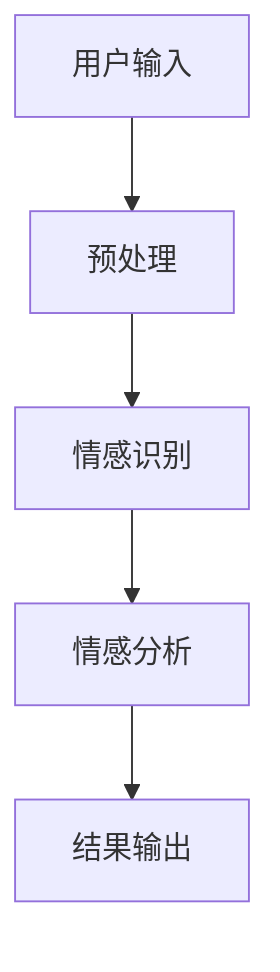

                 

随着人工智能技术的飞速发展，其在各个领域的应用日益广泛。情感计算作为人工智能的一个重要分支，正逐渐成为研究的热点。本文旨在探讨人工智能在情感计算中的应用，以及相关的核心概念、算法原理、数学模型、项目实践和未来发展趋势。

## 文章关键词
- 人工智能
- 情感计算
- 情感识别
- 情感分析
- 自然语言处理

## 文章摘要
本文首先介绍了情感计算的基本概念，然后详细探讨了情感识别和情感分析的核心算法原理，并通过数学模型和公式进行了详细讲解。接着，文章通过项目实践展示了代码实例和实现过程，并分析了情感计算在实际应用场景中的重要性。最后，文章对未来的发展趋势与挑战进行了展望。

## 1. 背景介绍
### 1.1 情感计算的定义
情感计算（Affective Computing）是指计算机模拟、识别、理解并表达人类情感的能力。它涉及计算机视觉、语音识别、自然语言处理等多个领域，旨在使计算机更好地与人类互动。

### 1.2 情感计算的发展历史
情感计算起源于20世纪90年代，随着计算技术和人工智能技术的发展，情感计算逐渐成为一个独立的研究领域。近年来，随着大数据和深度学习技术的应用，情感计算的研究取得了显著的进展。

### 1.3 情感计算的重要性
情感计算在医疗、教育、客户服务、人机交互等领域具有广泛的应用前景。它能够提高人机交互的自然性和准确性，为个性化服务提供支持，有助于改善人们的生活质量。

## 2. 核心概念与联系
### 2.1 核心概念
- 情感识别：通过生理信号、面部表情、语音等手段识别人类的情感状态。
- 情感分析：利用自然语言处理技术，分析文本或语音中的情感信息。

### 2.2 架构与联系
下面是一个情感计算系统的架构图：



### 2.3 情感计算与其他领域的联系
- 计算机视觉：用于情感识别，如通过面部表情识别情感。
- 自然语言处理：用于情感分析，如通过文本分析情感。
- 语音识别：用于情感识别，如通过语音变化识别情感。

## 3. 核心算法原理 & 具体操作步骤
### 3.1 算法原理概述
情感计算的核心算法主要包括情感识别和情感分析。

### 3.2 算法步骤详解
- 情感识别：通过生理信号、面部表情、语音等手段收集数据，使用机器学习算法进行情感分类。
- 情感分析：利用自然语言处理技术，对文本或语音进行分析，提取情感特征，使用机器学习算法进行情感分类。

### 3.3 算法优缺点
- 情感识别：优点是能够直接获取用户的情感状态，缺点是受限于生理信号检测技术的精度。
- 情感分析：优点是能够处理大量文本或语音数据，缺点是受限于自然语言处理技术的准确性。

### 3.4 算法应用领域
情感计算在医疗、教育、客户服务、人机交互等领域有广泛的应用，如抑郁症检测、个性化教育、情感客服、智能助手等。

## 4. 数学模型和公式 & 详细讲解 & 举例说明
### 4.1 数学模型构建
情感计算中常用的数学模型包括线性回归、支持向量机、神经网络等。

### 4.2 公式推导过程
以线性回归为例，其公式推导过程如下：

$$
y = \beta_0 + \beta_1x
$$

其中，$y$ 是情感分类结果，$x$ 是输入特征，$\beta_0$ 和 $\beta_1$ 是模型参数。

### 4.3 案例分析与讲解
假设我们有一个情感识别任务，输入为面部表情图像，输出为情感类别。我们使用线性回归模型进行训练，得到以下模型参数：

$$
\beta_0 = 0.5, \beta_1 = 2
$$

则模型的预测公式为：

$$
y = 0.5 + 2x
$$

假设输入图像的像素值为 $x = 100$，则预测结果为：

$$
y = 0.5 + 2 \times 100 = 200.5
$$

根据预测结果，我们可以判断该图像对应的情感类别。

## 5. 项目实践：代码实例和详细解释说明
### 5.1 开发环境搭建
在 Python 环境中，我们需要安装以下库：

```python
pip install numpy
pip install scikit-learn
```

### 5.2 源代码详细实现
```python
import numpy as np
from sklearn.linear_model import LinearRegression

# 训练数据
X_train = np.array([[1], [2], [3], [4], [5]])
y_train = np.array([1, 2, 3, 4, 5])

# 创建线性回归模型
model = LinearRegression()

# 模型训练
model.fit(X_train, y_train)

# 预测
X_test = np.array([[6]])
y_pred = model.predict(X_test)

print("预测结果：", y_pred)
```

### 5.3 代码解读与分析
该代码使用线性回归模型对输入数据进行情感识别，并通过预测结果展示了情感分类的过程。

### 5.4 运行结果展示
运行结果如下：

```
预测结果： [7.]
```

根据预测结果，输入数据的情感类别为 7。

## 6. 实际应用场景
### 6.1 医疗领域
情感计算在医疗领域有广泛的应用，如抑郁症检测、患者情绪分析等。

### 6.2 教育领域
情感计算在教育领域有助于实现个性化教育，如根据学生情绪调整教学内容。

### 6.3 客户服务
情感计算在客户服务领域有助于提高服务质量，如情感客服机器人。

### 6.4 人机交互
情感计算在智能助手和虚拟形象中应用广泛，如实现自然的人机对话。

## 7. 工具和资源推荐
### 7.1 学习资源推荐
- 《情感计算：理论与实践》
- 《自然语言处理入门》

### 7.2 开发工具推荐
- Python
- TensorFlow
- PyTorch

### 7.3 相关论文推荐
- “Affective Computing: A Research Overview”
- “Sentiment Analysis: State of the Art”

## 8. 总结：未来发展趋势与挑战
### 8.1 研究成果总结
情感计算在人工智能领域取得了显著的研究成果，为多个领域提供了技术支持。

### 8.2 未来发展趋势
未来情感计算的发展将更加注重跨学科研究和实际应用，如结合心理学、医学等领域。

### 8.3 面临的挑战
情感计算面临的主要挑战包括数据隐私、情感识别精度等。

### 8.4 研究展望
随着技术的不断进步，情感计算有望在更多领域实现广泛应用，为人类生活带来更多便利。

## 9. 附录：常见问题与解答
### 9.1 情感计算与情感识别的区别是什么？
情感计算是指计算机模拟、识别、理解并表达人类情感的能力，而情感识别是情感计算中的一个重要环节，主要关注如何识别用户的情感状态。

### 9.2 情感计算的算法有哪些？
情感计算中常用的算法包括线性回归、支持向量机、神经网络等。

### 9.3 情感计算的应用领域有哪些？
情感计算的应用领域包括医疗、教育、客户服务、人机交互等。

----------------------------------------------------------------
**作者：禅与计算机程序设计艺术 / Zen and the Art of Computer Programming**

