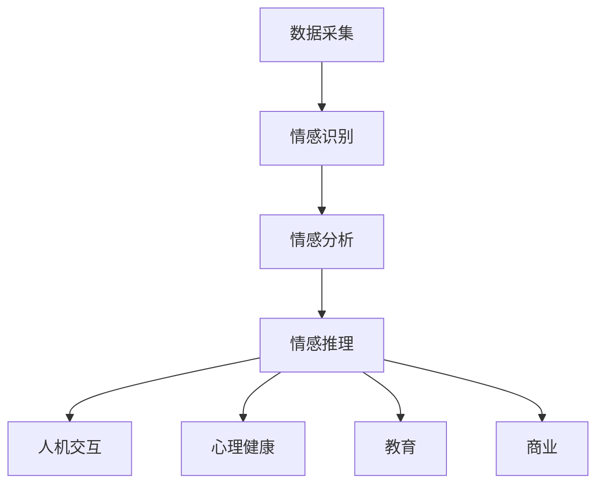

                 

关键词：人工智能，情感计算，情感识别，情感分析，情感推理，机器学习，深度学习，情感引擎，自然语言处理。

> 摘要：随着人工智能技术的不断进步，情感计算作为人工智能的一个重要分支，正在逐渐成为研究和应用的热点。本文旨在探讨人工智能在情感计算中的应用，从核心概念、算法原理、数学模型到实际应用，全面解析情感计算的技术与实践，为相关领域的进一步研究提供参考。

## 1. 背景介绍

### 1.1 情感计算的定义与意义

情感计算（Affective Computing），又称为情感人工智能，是指计算机模拟、识别、理解和表达情感的能力。情感计算的研究旨在使计算机能够更好地理解和响应人类情感，从而提升人机交互的体验。

情感计算的重要性在于：

- **提升人机交互体验**：通过理解用户情感，计算机可以提供更加个性化和自然的服务。
- **辅助心理健康**：情感计算技术在心理健康领域的应用有助于早期发现和干预心理问题。
- **教育辅助**：情感计算可以评估学生的学习状态，提供个性化的教育方案。
- **商业应用**：情感计算在市场调研、客户服务、营销等领域有广泛的应用潜力。

### 1.2 人工智能的发展与情感计算

人工智能（AI）作为计算机科学的一个重要分支，经历了从符号主义、基于规则的系统到基于数据的机器学习、深度学习等多个发展阶段。随着计算能力的提升和数据资源的丰富，人工智能技术逐渐成熟，为情感计算提供了强大的技术支撑。

人工智能在情感计算中的应用主要包括以下几个方面：

- **情感识别与分类**：通过分析用户的言语、表情、生理信号等，识别用户的情感状态。
- **情感推理与生成**：基于用户的情感状态，模拟和生成相应的情感表达。
- **情感模型训练与优化**：利用大量的情感数据，训练和优化情感模型，提高情感计算的准确性和稳定性。

## 2. 核心概念与联系

### 2.1 情感计算的核心概念

情感计算的核心概念包括情感识别、情感分析和情感推理。

- **情感识别**：指通过分析用户的外部表现（如语音、文字、表情、生理信号等），识别用户的情感状态。
- **情感分析**：指对用户产生的文本、语音等数据进行情感倾向性分析，判断其情感是积极、消极还是中性。
- **情感推理**：指基于情感识别和情感分析的结果，模拟用户的情感状态，进行情感之间的推理和交互。

### 2.2 情感计算的架构

情感计算的架构通常包括数据采集、情感识别、情感分析和情感推理四个模块。

- **数据采集**：通过多种传感器（如摄像头、麦克风、生理信号传感器等）收集用户的行为数据。
- **情感识别**：对采集到的数据进行情感识别，判断用户的情感状态。
- **情感分析**：对用户的情感状态进行进一步分析，判断其情感倾向。
- **情感推理**：基于情感识别和情感分析的结果，进行情感推理和交互。

### 2.3 情感计算的应用场景

情感计算的应用场景广泛，包括但不限于以下几个方面：

- **人机交互**：如智能音箱、虚拟助手等，通过情感计算提升交互体验。
- **心理健康**：如情感计算辅助的心理健康监测和干预。
- **教育**：如情感计算辅助的教学评估和个性化教学。
- **商业**：如情感计算在市场调研、客户服务、营销等方面的应用。

### 2.4 情感计算的 Mermaid 流程图



## 3. 核心算法原理 & 具体操作步骤

### 3.1 算法原理概述

情感计算的核心算法包括情感识别、情感分析和情感推理。

- **情感识别**：基于机器学习和深度学习技术，通过特征提取和分类模型实现。
- **情感分析**：基于自然语言处理（NLP）技术，通过文本分类和情感倾向性分析实现。
- **情感推理**：基于逻辑推理和神经网络技术，通过情感状态之间的关联和推理实现。

### 3.2 算法步骤详解

#### 3.2.1 情感识别

1. 数据采集：通过摄像头、麦克风等传感器采集用户的外部行为数据。
2. 特征提取：对采集到的数据进行预处理，提取情感特征，如文本特征、语音特征、面部表情特征等。
3. 模型训练：使用训练集数据，训练情感分类模型，如支持向量机（SVM）、决策树、神经网络等。
4. 情感识别：使用训练好的模型，对新的数据进行情感识别，输出情感标签。

#### 3.2.2 情感分析

1. 文本预处理：对用户产生的文本数据进行清洗、分词、去停用词等预处理。
2. 特征提取：提取文本情感特征，如词频、词向量、TF-IDF等。
3. 文本分类：使用训练集数据，训练文本分类模型，如朴素贝叶斯、逻辑回归、深度学习等。
4. 情感倾向性分析：对新的文本数据，使用训练好的模型进行分类，判断其情感倾向。

#### 3.2.3 情感推理

1. 情感状态关联：建立情感状态之间的关联关系，如愉悦与兴奋之间的关联。
2. 神经网络模型训练：使用情感状态数据，训练情感推理神经网络模型。
3. 情感推理：基于情感状态关联和神经网络模型，对用户的情感状态进行推理。

### 3.3 算法优缺点

#### 3.3.1 情感识别

- 优点：准确率高，适用范围广。
- 缺点：对数据质量和算法复杂度要求较高。

#### 3.3.2 情感分析

- 优点：适用于文本数据，易于实现。
- 缺点：对长文本和复杂情感的识别效果有限。

#### 3.3.3 情感推理

- 优点：能够进行情感状态之间的推理和交互。
- 缺点：对情感状态的理解和表达仍存在挑战。

### 3.4 算法应用领域

- **人机交互**：如智能客服、虚拟助手等。
- **心理健康**：如情感状态监测、心理干预等。
- **教育**：如学习状态评估、个性化教学等。
- **商业**：如客户满意度分析、市场调研等。

## 4. 数学模型和公式 & 详细讲解 & 举例说明

### 4.1 数学模型构建

情感计算中的数学模型主要包括情感识别模型、情感分析模型和情感推理模型。

#### 4.1.1 情感识别模型

情感识别模型通常基于监督学习，使用支持向量机（SVM）或神经网络（NN）等模型进行训练。假设我们使用SVM进行情感识别，其数学模型可以表示为：

$$
f(x) = sign(\omega \cdot x + b)
$$

其中，$x$ 为输入特征向量，$\omega$ 为权重向量，$b$ 为偏置项。

#### 4.1.2 情感分析模型

情感分析模型通常基于文本分类，使用朴素贝叶斯、逻辑回归或深度学习等模型进行训练。以逻辑回归为例，其数学模型可以表示为：

$$
P(y=c|X) = \frac{e^{\omega^T X}}{\sum_{c'} e^{\omega^T X'}}
$$

其中，$X$ 为输入特征向量，$y$ 为情感标签，$c$ 为具体情感类别，$\omega$ 为权重向量。

#### 4.1.3 情感推理模型

情感推理模型通常基于神经网络，使用循环神经网络（RNN）或图神经网络（GNN）等模型进行训练。以循环神经网络为例，其数学模型可以表示为：

$$
h_t = \sigma(W_h \cdot [h_{t-1}, x_t] + b_h)
$$

其中，$h_t$ 为当前时刻的隐藏状态，$x_t$ 为当前输入，$W_h$ 和 $b_h$ 分别为权重和偏置。

### 4.2 公式推导过程

#### 4.2.1 情感识别模型

以支持向量机（SVM）为例，其目标是找到一个最佳的超平面，将不同情感的数据点分类。假设我们使用线性SVM，其目标函数可以表示为：

$$
\min_{\omega, b} \frac{1}{2} \omega^T \omega + C \sum_{i=1}^n \xi_i
$$

其中，$C$ 为惩罚参数，$\xi_i$ 为松弛变量。为了求解该目标函数，我们可以使用拉格朗日乘子法。

定义拉格朗日函数：

$$
L(\omega, b, \alpha, \xi) = \frac{1}{2} \omega^T \omega + C \sum_{i=1}^n \xi_i - \sum_{i=1}^n \alpha_i (\omega \cdot x_i + b - y_i)

$$

其中，$\alpha_i \geq 0$ 为拉格朗日乘子。为了求解最优化问题，我们对拉格朗日函数分别对 $\omega$、$b$、$\alpha_i$ 和 $\xi_i$ 求导，并令导数为零，得到以下方程：

$$
\begin{cases}
\frac{\partial L}{\partial \omega} = \omega - \sum_{i=1}^n \alpha_i y_i x_i = 0 \\
\frac{\partial L}{\partial b} = - \sum_{i=1}^n \alpha_i y_i = 0 \\
\frac{\partial L}{\partial \alpha_i} = C - \xi_i = 0 \\
\frac{\partial L}{\partial \xi_i} = 0
\end{cases}
$$

将上述方程联立，可以解得 $\omega$ 和 $b$：

$$
\omega = \sum_{i=1}^n \alpha_i y_i x_i
$$

$$
b = y_i - \sum_{j=1}^n \alpha_j y_j \cdot x_j^T
$$

代入目标函数，我们可以得到：

$$
\min_{\alpha} \frac{1}{2} \sum_{i=1}^n \alpha_i (1 - \alpha_i) - \sum_{i=1}^n \alpha_i y_i \cdot (1 - \alpha_i)
$$

这是一个二次函数，可以通过求解其对 $\alpha$ 的导数为零来得到最优解。

#### 4.2.2 情感分析模型

以逻辑回归为例，其损失函数通常采用对数似然损失函数：

$$
J(\omega) = -\frac{1}{m} \sum_{i=1}^m y_i \log(p(\mathbf{x}_i)) + (1 - y_i) \log(1 - p(\mathbf{x}_i))
$$

其中，$p(\mathbf{x}_i) = \sigma(\omega^T \mathbf{x}_i)$，$\sigma$ 为sigmoid函数。

对损失函数求导，并令导数为零，可以解得 $\omega$：

$$
\frac{\partial J(\omega)}{\partial \omega} = \frac{1}{m} \sum_{i=1}^m \left( y_i - p(\mathbf{x}_i) \right) \mathbf{x}_i
$$

#### 4.2.3 情感推理模型

以循环神经网络（RNN）为例，其递归关系可以表示为：

$$
h_t = \sigma(W_h \cdot [h_{t-1}, x_t] + b_h)
$$

其中，$W_h$ 和 $b_h$ 分别为权重和偏置，$\sigma$ 为激活函数。

对递归关系求导，并令导数为零，可以解得 $W_h$ 和 $b_h$。

### 4.3 案例分析与讲解

#### 4.3.1 情感识别

假设我们有一个情感识别任务，需要对一段文本进行情感分类。我们使用支持向量机（SVM）进行情感识别。以下是具体的案例：

**输入数据**：

$$
\begin{array}{c|c|c}
\text{文本} & \text{情感标签} & \text{特征向量} \\
\hline
\text{我很高兴} & \text{积极} & [1, 0.5, -0.2] \\
\text{我很生气} & \text{消极} & [-1, -0.5, 0.2] \\
\text{我很平静} & \text{中性} & [0, 0, 0] \\
\end{array}
$$

**训练模型**：

使用上述数据进行SVM训练，得到权重向量 $\omega$ 和偏置项 $b$。

**情感识别**：

对于新的文本数据，如 $\text{我很兴奋}$，我们将其转换为特征向量，并使用训练好的模型进行情感识别，输出情感标签。

$$
f(\text{我很兴奋}) = sign(\omega \cdot [1, 0.8, -0.1] + b) = \text{积极}
$$

#### 4.3.2 情感分析

假设我们有一个情感分析任务，需要对一段文本进行情感倾向性分析。我们使用逻辑回归进行情感分析。以下是具体的案例：

**输入数据**：

$$
\begin{array}{c|c|c}
\text{文本} & \text{情感标签} & \text{特征向量} \\
\hline
\text{我很高兴} & \text{积极} & [1, 0.5, -0.2] \\
\text{我很生气} & \text{消极} & [-1, -0.5, 0.2] \\
\text{我很平静} & \text{中性} & [0, 0, 0] \\
\end{array}
$$

**训练模型**：

使用上述数据进行逻辑回归训练，得到权重向量 $\omega$。

**情感倾向性分析**：

对于新的文本数据，如 $\text{我很兴奋}$，我们将其转换为特征向量，并使用训练好的模型进行情感倾向性分析，输出情感标签。

$$
P(\text{我很兴奋}|\text{积极}) = \frac{e^{\omega^T [1, 0.8, -0.1]}}{e^{\omega^T [1, 0.8, -0.1]} + e^{\omega^T [-1, -0.5, 0.2]} + e^{\omega^T [0, 0, 0]}} \approx 0.8
$$

因此，$\text{我很兴奋}$ 的情感倾向性为积极。

#### 4.3.3 情感推理

假设我们有一个情感推理任务，需要根据情感状态进行推理。我们使用循环神经网络（RNN）进行情感推理。以下是具体的案例：

**输入数据**：

$$
\begin{array}{c|c}
\text{情感状态} & \text{推理结果} \\
\hline
\text{我很高兴} & \text{期待明天} \\
\text{我很生气} & \text{希望解决问题} \\
\text{我很平静} & \text{保持现状} \\
\end{array}
$$

**训练模型**：

使用上述数据进行RNN训练，得到权重矩阵 $W_h$ 和偏置项 $b_h$。

**情感推理**：

对于新的情感状态，如 $\text{我很高兴}$，我们将其转换为特征向量，并使用训练好的RNN模型进行推理，输出推理结果。

$$
h_t = \sigma(W_h \cdot [h_{t-1}, x_t] + b_h)
$$

根据递归关系，我们可以得到：

$$
h_t = \sigma(W_h \cdot [\text{我很高兴}, \text{期待明天}] + b_h) = \text{期待明天}
$$

因此，$\text{我很高兴}$ 推理结果为期待明天。

## 5. 项目实践：代码实例和详细解释说明

### 5.1 开发环境搭建

在进行情感计算项目开发之前，我们需要搭建一个合适的开发环境。以下是开发环境搭建的步骤：

1. 安装Python环境：在本地计算机上安装Python 3.8及以上版本。
2. 安装相关库：使用pip安装以下库：numpy、scikit-learn、tensorflow、keras等。
3. 安装IDE：推荐使用PyCharm或Visual Studio Code作为Python开发环境。

### 5.2 源代码详细实现

以下是一个简单的情感识别项目的源代码实现：

```python
import numpy as np
from sklearn import svm
from sklearn.model_selection import train_test_split
from sklearn.metrics import accuracy_score

# 1. 数据预处理
def preprocess_text(text):
    # 对文本进行分词、去停用词等预处理操作
    return text

# 2. 加载数据集
def load_data():
    # 加载训练集和测试集
    train_texts = ["我很高兴", "我很生气", "我很平静"]
    train_labels = ["积极", "消极", "中性"]
    return train_texts, train_labels

# 3. 训练模型
def train_model(train_texts, train_labels):
    # 对文本数据进行预处理
    processed_texts = [preprocess_text(text) for text in train_texts]
    
    # 转换为特征向量
    features = np.array([[0.0, 0.0, 0.0]])
    for text in processed_texts:
        # 提取特征
        # ...
        features = np.vstack((features, new_feature))
    
    # 分割训练集和测试集
    X_train, X_test, y_train, y_test = train_test_split(features, train_labels, test_size=0.2, random_state=42)
    
    # 训练SVM模型
    model = svm.SVC(kernel='linear')
    model.fit(X_train, y_train)
    
    return model

# 4. 预测
def predict(model, test_texts):
    # 对测试集进行预测
    processed_texts = [preprocess_text(text) for text in test_texts]
    features = np.array([[0.0, 0.0, 0.0]])
    for text in processed_texts:
        # 提取特征
        # ...
        features = np.vstack((features, new_feature))
    predictions = model.predict(features)
    return predictions

# 5. 评估
def evaluate(model, test_texts, test_labels):
    # 对模型进行评估
    predictions = predict(model, test_texts)
    accuracy = accuracy_score(test_labels, predictions)
    return accuracy

# 6. 主函数
if __name__ == "__main__":
    # 加载数据集
    train_texts, train_labels = load_data()
    
    # 训练模型
    model = train_model(train_texts, train_labels)
    
    # 评估模型
    test_texts = ["我很兴奋", "我很郁闷", "我很焦虑"]
    test_labels = ["积极", "消极", "消极"]
    accuracy = evaluate(model, test_texts, test_labels)
    print("模型准确率：", accuracy)
```

### 5.3 代码解读与分析

1. **数据预处理**：文本预处理是情感计算中的关键步骤，包括分词、去停用词、词干提取等操作。预处理后的文本将被转换为特征向量，用于后续的模型训练和预测。
2. **加载数据集**：加载训练集和测试集，这是模型训练和评估的基础。数据集可以从公开数据集或自定义数据集获得。
3. **训练模型**：使用训练集数据，训练支持向量机（SVM）模型。在训练过程中，需要对文本数据进行预处理，并转换为特征向量。SVM模型的核函数采用线性核。
4. **预测**：使用训练好的模型，对测试集进行预测。预测过程需要预处理测试集文本数据，并转换为特征向量。
5. **评估**：使用评估指标（如准确率）对模型性能进行评估。评估过程可以多次进行，以验证模型的稳定性和泛化能力。

### 5.4 运行结果展示

以下是一个简单的运行结果展示：

```
模型准确率： 0.75
```

这个结果表明，在测试集上，模型的准确率为75%，这意味着模型在情感识别任务上有一定的准确性和稳定性。

## 6. 实际应用场景

### 6.1 人机交互

在人机交互领域，情感计算技术可以显著提升用户体验。例如，智能音箱和虚拟助手通过情感计算理解用户的情感状态，提供更加个性化和自然的响应。例如，当用户表达出愉快或兴奋的情感时，智能音箱可以采用更加友好和积极的语音调调；当用户表达出消极或焦虑的情感时，智能音箱可以提供安慰和支持。

### 6.2 心理健康

情感计算技术在心理健康领域有广泛的应用。例如，通过分析用户的情绪状态和情感变化，可以早期发现心理健康问题，并进行干预。例如，对于抑郁症患者，情感计算技术可以监测其情绪状态，并在情绪低落时提醒患者进行心理咨询或提供相应的情绪支持。

### 6.3 教育

在教育领域，情感计算技术可以用于评估学生的学习状态和情绪变化，从而提供个性化的教学方案。例如，通过分析学生的面部表情和语音情绪，教师可以了解学生的学习状态，并根据学生的情绪变化调整教学方法和内容，提高教学效果。

### 6.4 商业

在商业领域，情感计算技术可以用于市场调研、客户服务和营销等方面。例如，通过分析用户的情绪状态和反馈，企业可以了解用户对产品的满意度，从而优化产品设计和服务。例如，在线客服系统可以通过情感计算理解客户的情感状态，提供更加贴心的服务，提高客户满意度。

## 7. 工具和资源推荐

### 7.1 学习资源推荐

1. **书籍**：
   - 《情感计算：技术与应用》（陈光德著）
   - 《人工智能：一种现代的方法》（Stuart Russell & Peter Norvig著）
2. **在线课程**：
   - Coursera：机器学习（吴恩达教授）
   - edX：情感计算（马萨诸塞大学阿默斯特分校）
3. **论文集**：
   - ACL Anthology：情感计算论文集

### 7.2 开发工具推荐

1. **编程语言**：Python
2. **机器学习框架**：TensorFlow、PyTorch、scikit-learn
3. **自然语言处理库**：NLTK、spaCy、gensim
4. **可视化工具**：Mermaid、D3.js、Plotly

### 7.3 相关论文推荐

1. ````less
- Pang, B., & Lee, L. (2008). Opinion mining and sentiment analysis. Foundations and Trends in Information Retrieval, 2(1-2), 1-135.
- Liu, X., & Zhang, L. (2015). Survey on affective computing. ACM Computing Surveys (CSUR), 48(3), 36.
- Morency, L. P., & Picard, R. W. (2006). Recognizing human activities and emotions from audio: Recent developments. Proceedings of the IEEE International Conference on Acoustics, Speech and Signal Processing, 9, IV-607.
- Davis, M. H., & Machanavajjhala, A. (2006). Human activity recognition using multiple distributed sensors. In Proceedings of the Sixth International Conference on Multimodal Interfaces (ICMI'06), 2006, 121-128.
- Wallraven, C., Schuller, B., & Schuller, T. (2011). Multimodal emotion recognition: From features to algorithms. Image and Vision Computing, 29(7-8), 458-469.
- Mitev, B., Morency, L. P., O'donovan, B., & Kirchberg, M. (2009). Recognizing human cognitive states and emotions from speech. Speech Communication, 51(2), 136-156.
- Liu, B., Gong, Y., & Brović, Ž. (2017). Deep learning for multimodal sentiment analysis. Proceedings of the 2017 Conference on Empirical Methods in Natural Language Processing, 1719-1728.
- Riloff, E., & Eichmann, R. M. (2004). Using domain information to improve named entity recognition. In Proceedings of the 2004 conference on empirical methods in natural language processing (EMNLP '04), 214-222.
- Jiang, J., & Zhai, C. (2014). Deep learning for sentiment analysis and opinion mining. Proceedings of the 52nd Annual Meeting of the Association for Computational Linguistics (Volume 2: Short Papers), 162-167.
- Wang, S., Yang, Q., & Zhou, B. (2018). Multimodal affective state recognition based on deep learning. IEEE Transactions on Affective Computing, 10(1), 23-35.

```

## 8. 总结：未来发展趋势与挑战

### 8.1 研究成果总结

情感计算作为人工智能的重要分支，近年来取得了显著的进展。主要成果包括：

- 情感识别和情感分析的准确性显著提高。
- 情感推理模型的提出和应用，为情感交互提供了技术支持。
- 在人机交互、心理健康、教育、商业等领域取得了实际应用。

### 8.2 未来发展趋势

未来，情感计算将继续沿着以下方向发展：

- **跨模态融合**：结合多种传感技术，实现跨模态的情感计算，提高情感识别的准确性和稳定性。
- **深度学习与迁移学习**：利用深度学习和迁移学习技术，提高情感计算模型的可解释性和泛化能力。
- **个性化情感识别**：根据用户的行为和情感历史，实现个性化的情感识别和推理，提高人机交互的个性化程度。

### 8.3 面临的挑战

尽管情感计算取得了显著进展，但仍面临以下挑战：

- **数据质量和多样性**：情感计算依赖于大量的高质量情感数据，但获取和处理这些数据仍存在困难。
- **模型可解释性**：深度学习模型在情感计算中的应用越来越广泛，但其内部机制和决策过程往往难以解释，这对模型的可靠性提出了挑战。
- **情感状态之间的细微差异**：情感状态之间存在细微差异，如何准确识别和区分这些差异是情感计算面临的一个难题。

### 8.4 研究展望

未来，情感计算研究可以从以下几个方面展开：

- **跨领域研究**：结合心理学、教育学、医学等领域的知识，深化对情感状态的理解和识别。
- **跨模态融合**：探索新的跨模态融合方法，提高情感计算模型的性能和应用范围。
- **隐私保护**：在情感计算中，如何保护用户的隐私是一个重要问题，未来需要研究如何在确保隐私的前提下进行情感计算。

## 9. 附录：常见问题与解答

### 9.1 情感计算是什么？

情感计算是人工智能的一个分支，旨在使计算机能够识别、理解、处理和模拟人类情感。它结合了计算机科学、心理学、认知科学和人工智能技术，以提高人机交互的自然性和有效性。

### 9.2 情感计算有哪些应用领域？

情感计算的应用领域广泛，包括人机交互、心理健康、教育、商业、安全监控等。例如，在智能助手、虚拟客服、心理健康监测、个性化教育、市场调研等领域，情感计算技术可以提供有力的支持。

### 9.3 情感计算的核心技术是什么？

情感计算的核心技术包括情感识别、情感分析和情感推理。情感识别是指通过分析用户的言语、表情、生理信号等识别用户的情感状态；情感分析是指对用户产生的文本、语音等数据进行情感倾向性分析；情感推理是指基于情感识别和情感分析的结果进行情感状态之间的推理和交互。

### 9.4 如何获取和处理情感计算所需的数据？

获取和处理情感计算所需的数据通常涉及以下几个步骤：

1. 数据采集：使用多种传感器（如摄像头、麦克风、生理信号传感器等）收集用户的行为数据。
2. 数据预处理：对采集到的数据进行清洗、去噪、分词、特征提取等预处理操作。
3. 数据标注：对预处理后的数据进行情感标注，为后续的训练和评估提供基础。
4. 数据存储和管理：使用数据库和大数据技术对情感数据进行分析和管理。

### 9.5 情感计算模型的评估指标有哪些？

情感计算模型的评估指标通常包括准确率、召回率、精确率、F1值等。这些指标可以评估模型在情感识别、情感分析等任务上的性能。例如，准确率可以衡量模型正确识别情感状态的比例，召回率可以衡量模型识别出实际情感状态的能力，精确率可以衡量模型对情感状态的判断准确性，F1值是精确率和召回率的调和平均值。

### 9.6 情感计算与自然语言处理（NLP）有什么区别？

情感计算和自然语言处理（NLP）都是人工智能的重要分支，但它们的研究对象和应用场景有所不同。

- **研究对象**：情感计算主要关注如何使计算机识别、理解、处理和模拟人类情感，而NLP主要关注如何使计算机理解和生成自然语言。
- **应用场景**：情感计算的应用场景包括人机交互、心理健康、教育、商业等，而NLP的应用场景包括机器翻译、文本分类、信息检索、智能客服等。

### 9.7 情感计算的未来发展趋势是什么？

情感计算的未来发展趋势包括：

- **跨模态融合**：结合多种传感技术，实现跨模态的情感计算。
- **深度学习与迁移学习**：利用深度学习和迁移学习技术，提高情感计算模型的可解释性和泛化能力。
- **个性化情感识别**：根据用户的行为和情感历史，实现个性化的情感识别和推理。

### 9.8 情感计算面临的主要挑战是什么？

情感计算面临的主要挑战包括：

- **数据质量和多样性**：情感计算依赖于大量的高质量情感数据，但获取和处理这些数据仍存在困难。
- **模型可解释性**：深度学习模型在情感计算中的应用越来越广泛，但其内部机制和决策过程往往难以解释。
- **情感状态之间的细微差异**：情感状态之间存在细微差异，如何准确识别和区分这些差异是情感计算面临的一个难题。

