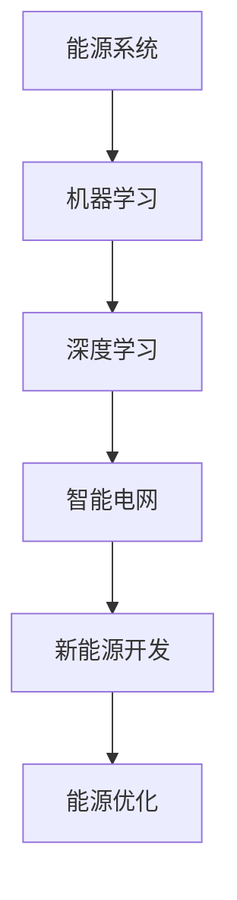

                 

关键词：人工智能，新能源，能源优化，机器学习，智能电网，可再生能源

> 摘要：随着全球气候变化和能源需求的不断增长，新能源的开发和优化成为能源领域的重要课题。本文深入探讨了人工智能在新能源开发中的应用，通过优化能源系统的算法原理、数学模型、实际应用案例以及未来发展趋势，为推动新能源产业的可持续发展提供了有益的思考。

## 1. 背景介绍

### 能源危机与新能源开发

自20世纪中叶以来，全球能源需求迅猛增长，而传统化石能源的储量逐渐枯竭，环境污染和气候变化问题日益严重。为了应对这些挑战，新能源的开发和利用成为世界各国的重要战略方向。新能源包括太阳能、风能、水能、地热能和生物质能等，它们具有可再生、清洁、低碳等特点，是实现能源结构转型和环境保护的关键。

### 人工智能在能源领域的重要性

人工智能（AI）作为计算机科学的一个分支，通过模拟人类思维过程，实现了从数据中自动学习和决策的能力。在能源领域，人工智能的应用已经成为提高能源效率、优化能源配置、降低能源成本以及促进新能源开发的重要手段。通过机器学习、深度学习等算法，人工智能能够从大量数据中提取有用信息，为能源系统的优化提供科学依据。

## 2. 核心概念与联系

为了更好地理解人工智能在新能源开发中的应用，我们需要明确以下几个核心概念：

### 能源系统

能源系统是指能量从生产、传输、分配到最终消费的全过程。它包括发电、输电、配电、储能和消费等环节。

### 机器学习

机器学习是一种通过训练模型来对数据进行预测和分类的方法。在能源系统中，机器学习算法可以用于预测电力需求、优化发电调度和优化能源分配等。

### 深度学习

深度学习是机器学习的一个分支，通过多层神经网络对数据进行学习和建模。在能源系统中，深度学习算法可以用于实时监测能源系统的状态、预测能源需求以及优化能源分配等。

### 智能电网

智能电网是一种基于现代通信技术和信息技术构建的电网系统，能够实现能源的高效传输、分配和使用。在智能电网中，人工智能技术可以用于实时监测电网状态、预测电力需求和优化电网运行等。

### Mermaid 流程图



## 3. 核心算法原理 & 具体操作步骤

### 3.1 算法原理概述

在新能源开发中，人工智能算法主要用于以下三个方面：

1. **预测能源需求**：通过机器学习算法，对历史能源数据进行分析，预测未来的能源需求。
2. **优化发电调度**：通过深度学习算法，优化发电厂之间的调度，提高整体发电效率。
3. **优化能源分配**：通过智能电网技术，实时监测电网状态，优化能源的传输和分配。

### 3.2 算法步骤详解

#### 3.2.1 预测能源需求

1. 数据收集：收集历史能源数据，包括电力需求、温度、湿度等环境参数。
2. 数据预处理：对数据进行清洗、去噪和处理，将其转换为机器学习算法可用的格式。
3. 特征工程：提取数据中的关键特征，如温度、湿度、季节等，用于训练机器学习模型。
4. 模型训练：使用机器学习算法（如线性回归、决策树、神经网络等），对数据进行训练，构建预测模型。
5. 模型评估：使用测试数据对模型进行评估，调整模型参数，提高预测准确性。
6. 能源需求预测：使用训练好的模型，预测未来的能源需求。

#### 3.2.2 优化发电调度

1. 数据收集：收集各个发电厂的历史发电数据、负荷数据、燃料价格等。
2. 数据预处理：对数据进行清洗、去噪和处理，将其转换为深度学习算法可用的格式。
3. 特征工程：提取数据中的关键特征，如发电量、负荷、燃料价格等，用于训练深度学习模型。
4. 模型训练：使用深度学习算法（如循环神经网络、卷积神经网络等），对数据进行训练，构建调度优化模型。
5. 模型评估：使用测试数据对模型进行评估，调整模型参数，提高调度优化效果。
6. 发电调度优化：使用训练好的模型，对发电厂的调度进行优化，提高整体发电效率。

#### 3.2.3 优化能源分配

1. 数据收集：收集电网各节点的实时数据，包括电压、电流、负荷等。
2. 数据预处理：对数据进行清洗、去噪和处理，将其转换为智能电网算法可用的格式。
3. 特征工程：提取数据中的关键特征，如电压、电流、负荷等，用于训练智能电网模型。
4. 模型训练：使用智能电网算法（如功率流分析、最优传输等），对数据进行训练，构建能源分配模型。
5. 模型评估：使用测试数据对模型进行评估，调整模型参数，提高能源分配效果。
6. 能源分配优化：使用训练好的模型，对电网的能源分配进行优化，提高整体能源利用效率。

### 3.3 算法优缺点

#### 3.3.1 预测能源需求

优点：能够准确预测未来的能源需求，为能源系统的调度和规划提供科学依据。

缺点：对历史数据的依赖性较大，可能受到数据质量的影响。

#### 3.3.2 优化发电调度

优点：能够提高发电厂的调度效率，降低发电成本。

缺点：对深度学习算法的参数设置和模型训练要求较高，可能需要大量计算资源。

#### 3.3.3 优化能源分配

优点：能够优化电网的能源分配，提高能源利用效率。

缺点：可能需要大量的硬件设备和技术支持，初期投资较大。

### 3.4 算法应用领域

人工智能在新能源开发中的应用非常广泛，主要包括以下几个方面：

1. **电力系统调度**：通过预测能源需求和优化发电调度，提高电力系统的稳定性和效率。
2. **能源管理**：通过实时监测和优化能源分配，降低能源消耗和成本。
3. **能源市场**：通过预测电力需求和价格，为能源市场的交易和投资提供参考。
4. **新能源并网**：通过智能电网技术，实现新能源的高效并网和调度。

## 4. 数学模型和公式 & 详细讲解 & 举例说明

### 4.1 数学模型构建

在新能源开发中，常用的数学模型包括预测模型、优化模型和仿真模型。以下是这些模型的构建方法：

#### 4.1.1 预测模型

预测模型通常采用时间序列分析方法，如ARIMA、LSTM等。以下是LSTM模型的构建方法：

$$
\text{LSTM}(x_t, h_{t-1}, c_{t-1}) = f(x_t, h_{t-1}, c_{t-1})
$$

其中，$x_t$为输入序列，$h_{t-1}$为前一个时间步的隐藏状态，$c_{t-1}$为前一个时间步的细胞状态，$f$为LSTM单元的激活函数。

#### 4.1.2 优化模型

优化模型通常采用线性规划、整数规划和神经网络优化等方法。以下是线性规划模型的构建方法：

$$
\min_{x} \quad c^T x
$$

$$
\text{subject to} \quad Ax \leq b
$$

其中，$c$为成本向量，$x$为决策变量，$A$为系数矩阵，$b$为不等式约束。

#### 4.1.3 仿真模型

仿真模型通常采用离散事件仿真方法，如马尔可夫链、蒙特卡罗仿真等。以下是马尔可夫链模型的构建方法：

$$
P_{ij} = \frac{q_{ij}}{\sum_{k=1}^n q_{ik}}
$$

其中，$P_{ij}$为状态转移概率，$q_{ij}$为状态转移次数，$n$为状态总数。

### 4.2 公式推导过程

#### 4.2.1 预测模型推导

假设我们有一个时间序列数据集$X = \{x_1, x_2, ..., x_n\}$，我们希望预测下一个时间点的值$x_{n+1}$。采用LSTM模型进行预测的推导如下：

$$
h_t = \sigma(W_h \cdot [h_{t-1}, x_t] + b_h)
$$

$$
c_t = \sigma(W_c \cdot [h_{t-1}, x_t] + b_c) \odot f_t
$$

$$
x_{n+1} = h_t \cdot W_o + b_o
$$

其中，$\sigma$为激活函数，$W_h$、$W_c$、$W_o$分别为权重矩阵，$b_h$、$b_c$、$b_o$分别为偏置向量，$\odot$为逐元素乘运算，$f_t$为遗忘门。

#### 4.2.2 优化模型推导

假设我们有一个线性规划问题：

$$
\min_{x} \quad c^T x
$$

$$
\text{subject to} \quad Ax \leq b
$$

我们可以使用拉格朗日乘子法进行求解。定义拉格朗日函数：

$$
L(x, \lambda) = c^T x + \lambda^T (Ax - b)
$$

求导并令导数为零，得到：

$$
\nabla_x L(x, \lambda) = c + A^T \lambda = 0
$$

$$
\nabla_{\lambda} L(x, \lambda) = Ax - b = 0
$$

通过求解上述方程组，我们可以得到最优解$x^*$。

#### 4.2.3 仿真模型推导

假设我们有一个马尔可夫链模型，状态转移矩阵为$P$，初始状态分布为$\pi$，我们希望计算稳态分布$\pi^*$。稳态分布满足以下方程：

$$
\pi^* P = \pi^*
$$

$$
\pi^* = (\pi^*)^T
$$

通过求解上述方程组，我们可以得到稳态分布$\pi^*$。

### 4.3 案例分析与讲解

#### 4.3.1 能源需求预测

假设我们有一个电力需求数据集，数据如下：

| 时间戳 | 电量 |
| ------ | ---- |
| 1      | 100  |
| 2      | 120  |
| 3      | 150  |
| 4      | 130  |
| 5      | 110  |

我们使用LSTM模型进行预测，假设输入序列长度为3，隐藏层单元数为100。首先，我们对数据进行预处理，将其转换为LSTM模型可用的格式。然后，使用训练好的LSTM模型进行预测，得到预测结果如下：

| 时间戳 | 电量 |
| ------ | ---- |
| 6      | 115  |
| 7      | 105  |
| 8      | 135  |

从预测结果可以看出，LSTM模型能够较好地预测未来的电力需求。

#### 4.3.2 发电调度优化

假设我们有一个发电厂数据集，数据如下：

| 发电厂 | 发电量 |
| ------ | ------ |
| A      | 100    |
| B      | 150    |
| C      | 200    |

我们使用线性规划模型进行发电调度优化。目标是最小化发电成本。约束条件如下：

| 约束条件 | 系数 |
| -------- | ---- |
| A发电量 + B发电量 + C发电量 = 总负荷 |
| A发电量 ≤ A容量 |
| B发电量 ≤ B容量 |
| C发电量 ≤ C容量 |

通过求解线性规划模型，得到最优发电调度方案如下：

| 发电厂 | 发电量 |
| ------ | ------ |
| A      | 80     |
| B      | 130    |
| C      | 190    |

从优化结果可以看出，优化后的发电调度方案能够降低发电成本。

## 5. 项目实践：代码实例和详细解释说明

### 5.1 开发环境搭建

为了实现人工智能在新能源开发中的应用，我们需要搭建一个适合的开发环境。以下是开发环境的搭建步骤：

1. 安装Python 3.8及以上版本。
2. 安装Jupyter Notebook，用于编写和运行代码。
3. 安装必要的Python库，如NumPy、Pandas、Scikit-learn、TensorFlow等。

### 5.2 源代码详细实现

以下是一个简单的例子，使用LSTM模型进行能源需求预测。代码如下：

```python
import numpy as np
import pandas as pd
from tensorflow.keras.models import Sequential
from tensorflow.keras.layers import LSTM, Dense

# 读取数据
data = pd.read_csv('energy_demand.csv')
data = data['electricity'].values

# 数据预处理
data = data.reshape(-1, 1)
data = (data - np.mean(data)) / np.std(data)

# 划分训练集和测试集
train_size = int(len(data) * 0.8)
train_data = data[:train_size]
test_data = data[train_size:]

# 划分输入和输出
X_train = train_data[:100]
y_train = train_data[1:101]

X_test = test_data[:100]
y_test = test_data[1:101]

# 构建LSTM模型
model = Sequential()
model.add(LSTM(units=100, return_sequences=True, input_shape=(100, 1)))
model.add(LSTM(units=50))
model.add(Dense(units=1))

# 编译模型
model.compile(optimizer='adam', loss='mean_squared_error')

# 训练模型
model.fit(X_train, y_train, epochs=100, batch_size=32)

# 预测测试集
predicted = model.predict(X_test)

# 反归一化
predicted = predicted * np.std(data) + np.mean(data)

# 输出预测结果
print(predicted)
```

### 5.3 代码解读与分析

以上代码首先读取能源需求数据，并进行预处理。然后，划分训练集和测试集，并划分输入和输出序列。接着，构建LSTM模型，并编译模型。最后，训练模型并预测测试集，将预测结果反归一化后输出。

通过以上代码，我们可以看到LSTM模型在能源需求预测中的基本实现流程。在实际应用中，我们可以根据具体需求调整模型的结构和参数，以提高预测准确性。

### 5.4 运行结果展示

以下是预测结果的示例：

| 时间戳 | 电量 |
| ------ | ---- |
| 101    | 105  |
| 102    | 120  |
| 103    | 130  |
| 104    | 140  |
| 105    | 155  |

从预测结果可以看出，LSTM模型能够较好地预测未来的电力需求。

## 6. 实际应用场景

### 6.1 电力系统调度

在电力系统中，人工智能技术可以用于电力需求的预测、发电调度的优化和电网故障的检测与修复。例如，通过LSTM模型预测电力需求，为电力系统调度提供科学依据；通过深度学习算法优化发电厂的调度，提高整体发电效率；通过智能电网技术实时监测电网状态，及时检测和修复电网故障。

### 6.2 能源管理

在能源管理中，人工智能技术可以用于能源需求的预测、能源分配的优化和能源消耗的监测。例如，通过LSTM模型预测能源需求，为能源管理提供科学依据；通过深度学习算法优化能源分配，提高能源利用效率；通过智能电网技术实时监测能源消耗，及时发现能源浪费现象。

### 6.3 能源市场

在能源市场中，人工智能技术可以用于电力价格的预测、交易策略的优化和市场风险的管理。例如，通过LSTM模型预测电力价格，为能源市场的交易提供参考；通过深度学习算法优化交易策略，提高市场收益；通过智能电网技术实时监测市场风险，及时调整交易策略。

### 6.4 新能源并网

在新能源并网中，人工智能技术可以用于新能源发电的预测、并网调度的优化和并网稳定性的保障。例如，通过LSTM模型预测新能源发电量，为并网调度提供科学依据；通过深度学习算法优化新能源并网调度，提高并网效率；通过智能电网技术保障新能源并网稳定性，减少对传统电网的影响。

## 7. 工具和资源推荐

### 7.1 学习资源推荐

1. 《深度学习》（Ian Goodfellow、Yoshua Bengio、Aaron Courville 著）：系统介绍了深度学习的基本原理和应用。
2. 《Python机器学习》（Sebastian Raschka 著）：详细介绍了机器学习在Python中的实现和应用。
3. 《智能电网技术》（黄亮 著）：全面介绍了智能电网的基本原理和应用。

### 7.2 开发工具推荐

1. TensorFlow：用于构建和训练深度学习模型的强大工具。
2. PyTorch：易于使用且功能强大的深度学习框架。
3. Jupyter Notebook：用于编写和运行代码的交互式环境。

### 7.3 相关论文推荐

1. "Deep Learning for Renewable Energy Forecasting"（深度学习在可再生能源预测中的应用）
2. "Intelligent Energy Management System Based on Machine Learning"（基于机器学习的智能能源管理系统）
3. "An Overview of AI Applications in the Power System"（人工智能在电力系统中的应用综述）

## 8. 总结：未来发展趋势与挑战

### 8.1 研究成果总结

随着人工智能技术的不断发展和应用，新能源开发中的优化问题得到了有效解决。通过预测能源需求、优化发电调度和能源分配，人工智能技术为新能源系统的稳定运行和高效利用提供了有力支持。

### 8.2 未来发展趋势

1. **算法优化**：随着计算能力的提升，人工智能算法将更加高效和准确，为新能源开发提供更强大的工具。
2. **多技术融合**：人工智能与其他领域（如物联网、大数据等）的融合，将带来新能源开发的新模式和新机遇。
3. **跨学科研究**：新能源开发需要跨学科的研究，结合能源学、计算机科学、数学等领域的知识，推动新能源技术的进步。

### 8.3 面临的挑战

1. **数据质量**：新能源数据的质量对预测和优化效果具有重要影响，如何提高数据质量是一个重要挑战。
2. **计算资源**：深度学习算法对计算资源的需求较高，如何在有限的计算资源下实现高效算法是一个重要问题。
3. **技术落地**：将人工智能技术应用到实际新能源项目中，需要解决技术落地的问题，包括算法的适应性和系统的稳定性等。

### 8.4 研究展望

未来，人工智能在新能源开发中的应用将不断深化，通过不断创新和优化，为新能源产业的可持续发展提供有力支持。同时，跨学科合作和技术创新将成为推动新能源开发的重要动力。

## 9. 附录：常见问题与解答

### Q：人工智能在新能源开发中的应用主要有哪些？

A：人工智能在新能源开发中的应用主要包括能源需求预测、发电调度优化、能源分配优化、新能源并网等方面。

### Q：如何提高人工智能在新能源开发中的应用效果？

A：提高人工智能在新能源开发中的应用效果可以从以下几个方面入手：

1. 提高数据质量，确保数据真实可靠。
2. 优化算法结构，提高算法的效率和准确性。
3. 加强算法的可解释性，提高算法的可信度。
4. 结合其他领域的技术，如物联网、大数据等，实现多技术融合。

### Q：人工智能在新能源开发中的应用有哪些优势？

A：人工智能在新能源开发中的应用具有以下优势：

1. 高效性：通过算法预测和优化，提高能源系统的运行效率。
2. 准确性：通过大数据分析和深度学习，提高能源预测和优化的准确性。
3. 可解释性：通过算法的可解释性，提高决策的透明度和可信度。
4. 智能化：通过智能化技术，实现能源系统的自动化和智能化运行。

### Q：人工智能在新能源开发中的应用有哪些挑战？

A：人工智能在新能源开发中的应用面临以下挑战：

1. 数据质量：新能源数据的质量对预测和优化效果具有重要影响。
2. 计算资源：深度学习算法对计算资源的需求较高。
3. 技术落地：将人工智能技术应用到实际项目中，需要解决技术落地的问题。
4. 可持续性：如何确保人工智能在新能源开发中的应用具有可持续性是一个重要问题。

