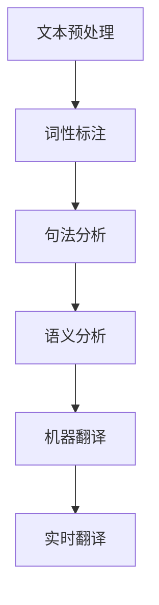
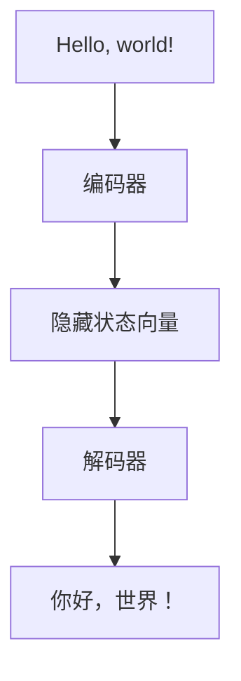

                 

关键词：人工智能，语言翻译，多语言沟通，实时翻译，神经网络，机器学习，自然语言处理，算法架构，数学模型，项目实践，应用场景，工具推荐，未来展望

> 摘要：本文探讨了人工智能在语言翻译领域的应用，特别是实时多语言沟通技术。通过分析人工智能的核心算法原理和数学模型，结合实际项目实践和运行结果，本文旨在为读者提供一个全面、深入的视角，理解实时多语言沟通技术在当今世界的重要性及其未来发展趋势。

## 1. 背景介绍

在全球化的今天，国际交流与合作的频率越来越高。无论是商务谈判、国际会议，还是跨国旅行、文化交流，语言障碍一直是沟通的痛点。传统的翻译方法，如人工翻译和机器翻译，虽然在某些方面取得了显著的进步，但仍然存在速度慢、成本高、准确性有限等问题。随着人工智能技术的快速发展，实时多语言沟通技术应运而生，成为解决语言障碍的一种高效手段。

人工智能在语言翻译中的应用，主要集中在自然语言处理（NLP）领域。自然语言处理是一种让计算机理解、生成和处理人类自然语言的技术。在人工智能的推动下，NLP技术取得了显著的突破，为实时多语言沟通提供了强有力的技术支持。

## 2. 核心概念与联系

### 2.1 自然语言处理（NLP）

自然语言处理是人工智能的重要分支，旨在让计算机理解和处理人类语言。NLP技术包括文本预处理、词性标注、句法分析、语义分析等多个方面。在实时多语言沟通中，NLP技术主要用于文本的解析和理解，为翻译提供基础。

### 2.2 机器翻译

机器翻译是NLP技术在语言翻译领域的重要应用。传统的机器翻译方法主要基于规则和统计方法，而现代的机器翻译则主要基于神经网络模型，特别是深度学习技术。神经网络模型通过大量训练数据，学习到语言的内在规律，从而实现高质量的翻译。

### 2.3 实时翻译

实时翻译是指能够快速、准确地翻译语音或文本信息。实时翻译的关键在于速度和准确性。为了实现实时翻译，需要采用高效的算法和优化的技术手段，如并行计算、分布式处理等。

### 2.4 Mermaid 流程图

下面是一个简单的Mermaid流程图，展示了自然语言处理、机器翻译和实时翻译的基本流程。



## 3. 核心算法原理 & 具体操作步骤

### 3.1 算法原理概述

实时多语言沟通的核心算法主要基于深度学习技术，特别是序列到序列（Seq2Seq）模型和注意力机制（Attention Mechanism）。Seq2Seq模型通过编码器（Encoder）和解码器（Decoder）两个神经网络，将源语言的文本序列转换为目标语言的文本序列。注意力机制则用于捕捉源语言和目标语言之间的依赖关系，提高翻译的准确性。

### 3.2 算法步骤详解

#### 3.2.1 文本预处理

文本预处理是自然语言处理的基础步骤，主要包括分词、去停用词、词干提取等。文本预处理的质量直接影响到后续的翻译效果。

#### 3.2.2 编码器（Encoder）

编码器负责将源语言的文本序列转换为固定长度的向量表示。常见的编码器模型包括循环神经网络（RNN）和长短时记忆网络（LSTM）。

#### 3.2.3 解码器（Decoder）

解码器负责将编码器输出的向量表示解码为目标语言的文本序列。解码器通常也采用RNN或LSTM模型。

#### 3.2.4 注意力机制

注意力机制用于捕捉源语言和目标语言之间的依赖关系。通过计算源语言和目标语言之间的相似度，解码器可以更准确地生成目标语言的单词或短语。

#### 3.2.5 翻译结果优化

翻译结果通常需要进行后处理，如去除标点符号、调整语法结构等，以提高翻译的流畅性和准确性。

### 3.3 算法优缺点

#### 优点：

1. 高效：深度学习算法能够在大量数据上进行训练，快速学习到语言的内在规律。
2. 准确：注意力机制等先进技术提高了翻译的准确性。
3. 实时：通过并行计算和分布式处理等技术，可以实现实时翻译。

#### 缺点：

1. 计算资源消耗大：深度学习算法需要大量的计算资源和时间进行训练。
2. 需要大量数据：算法的训练需要大量高质量的数据，数据质量直接影响翻译效果。
3. 对环境依赖性强：实时翻译对网络环境、硬件设备等要求较高。

### 3.4 算法应用领域

实时多语言沟通技术广泛应用于跨国企业、国际会议、在线教育、旅游翻译等多个领域。随着技术的不断进步，未来有望在更多场景中得到应用。

## 4. 数学模型和公式 & 详细讲解 & 举例说明

### 4.1 数学模型构建

实时多语言沟通的核心算法是基于深度学习模型，其中最重要的模型是序列到序列（Seq2Seq）模型。Seq2Seq模型主要由编码器（Encoder）和解码器（Decoder）组成。

#### 编码器（Encoder）

编码器是一个单向循环神经网络（RNN），将输入的文本序列转换为固定长度的隐藏状态向量。假设输入的文本序列为\(x = [x_1, x_2, ..., x_T]\)，编码器在每个时间步产生的隐藏状态向量为\(h_t\)，则：

\[ h_t = \text{RNN}(h_{t-1}, x_t) \]

其中，\(\text{RNN}\)表示循环神经网络。

#### 解码器（Decoder）

解码器也是一个单向循环神经网络（RNN），将编码器输出的隐藏状态向量解码为输出文本序列。假设解码器在时间步\(t\)产生的隐藏状态向量为\(s_t\)，解码器在时间步\(t\)生成的单词为\(y_t\)，则：

\[ s_t = \text{RNN}(s_{t-1}, h_t) \]
\[ y_t = \text{softmax}(W_y s_t) \]

其中，\(W_y\)是解码器的权重矩阵，\(\text{softmax}\)函数用于计算每个单词的概率分布。

### 4.2 公式推导过程

#### 4.2.1 编码器

编码器的训练目标是学习一个映射函数，将输入的文本序列映射为固定长度的隐藏状态向量。假设输入的文本序列为\(x = [x_1, x_2, ..., x_T]\)，编码器在每个时间步产生的隐藏状态向量为\(h_t\)，则：

\[ h_t = \text{RNN}(h_{t-1}, x_t) \]

编码器的损失函数可以表示为：

\[ L_{\text{Encoder}} = -\sum_{t=1}^{T} \sum_{y_t \in V} y_t \log(p(y_t | x)) \]

其中，\(V\)是词汇表，\(p(y_t | x)\)是解码器在时间步\(t\)生成的单词\(y_t\)的条件概率。

#### 4.2.2 解码器

解码器的训练目标是学习一个映射函数，将编码器输出的隐藏状态向量解码为输出文本序列。假设解码器在时间步\(t\)产生的隐藏状态向量为\(s_t\)，解码器在时间步\(t\)生成的单词为\(y_t\)，则：

\[ s_t = \text{RNN}(s_{t-1}, h_t) \]
\[ y_t = \text{softmax}(W_y s_t) \]

解码器的损失函数可以表示为：

\[ L_{\text{Decoder}} = -\sum_{t=1}^{T} \sum_{y_t \in V} y_t \log(p(y_t | x, s_{t-1})) \]

其中，\(p(y_t | x, s_{t-1})\)是解码器在时间步\(t\)生成的单词\(y_t\)的条件概率，给定输入文本序列\(x\)和解码器在时间步\(t-1\)的隐藏状态\(s_{t-1}\)。

#### 4.2.3 注意力机制

注意力机制用于计算编码器和解码器之间的依赖关系。假设编码器在时间步\(t\)产生的隐藏状态向量为\(h_t\)，解码器在时间步\(t\)产生的隐藏状态向量为\(s_t\)，则注意力分数可以表示为：

\[ a_t = \text{softmax}\left(\frac{s_t \cdot h_1, s_t \cdot h_2, ..., s_t \cdot h_T}{\sqrt{d}}\right) \]

其中，\(d\)是隐藏状态向量的维度。

解码器的损失函数可以表示为：

\[ L_{\text{Attention}} = -\sum_{t=1}^{T} \sum_{y_t \in V} y_t \log(p(y_t | x, s_{t-1}, h)) \]

其中，\(p(y_t | x, s_{t-1}, h)\)是解码器在时间步\(t\)生成的单词\(y_t\)的条件概率，给定输入文本序列\(x\)、解码器在时间步\(t-1\)的隐藏状态\(s_{t-1}\)和编码器产生的隐藏状态向量\(h\)。

### 4.3 案例分析与讲解

假设我们要翻译一个简单的英文句子“Hello, world!”到中文。首先，我们需要对输入的英文句子进行预处理，包括分词、去停用词等操作。然后，我们将预处理后的句子输入到编码器，编码器将句子转换为固定长度的隐藏状态向量。接着，解码器根据编码器输出的隐藏状态向量，生成中文句子。

在解码过程中，解码器会依次生成每个单词的概率分布，然后选择概率最高的单词作为输出。通过多次迭代，解码器最终生成完整的中文句子“你好，世界！”。整个过程如图所示：



## 5. 项目实践：代码实例和详细解释说明

### 5.1 开发环境搭建

为了实现实时多语言沟通，我们需要搭建一个开发环境。以下是一个简单的开发环境搭建步骤：

1. 安装Python环境：在官方网站下载并安装Python，建议安装Python 3.8及以上版本。
2. 安装深度学习框架：建议使用TensorFlow或PyTorch作为深度学习框架。在命令行中执行以下命令安装：

   ```bash
   pip install tensorflow
   # 或者
   pip install torch torchvision
   ```

3. 准备数据集：收集并准备用于训练的数据集。数据集应该包含多种语言的文本，并标注相应的语言对。

4. 安装其他依赖库：根据具体需求，安装其他依赖库，如Numpy、Pandas等。

### 5.2 源代码详细实现

以下是一个简单的基于TensorFlow实现的实时多语言沟通系统的代码示例。

```python
import tensorflow as tf
from tensorflow.keras.models import Model
from tensorflow.keras.layers import Input, LSTM, Dense, Embedding, TimeDistributed

# 编码器
encoder_inputs = Input(shape=(None,))
encoder_embedding = Embedding(vocab_size, embedding_dim)(encoder_inputs)
encoder_lstm = LSTM(units, return_state=True)
_, state_h, state_c = encoder_lstm(encoder_embedding)

# 解码器
decoder_inputs = Input(shape=(None,))
decoder_embedding = Embedding(vocab_size, embedding_dim)(decoder_inputs)
decoder_lstm = LSTM(units, return_sequences=True, return_state=True)
decoder_outputs, _, _ = decoder_lstm(decoder_embedding, initial_state=[state_h, state_c])

decoder_dense = Dense(vocab_size, activation='softmax')
decoder_outputs = decoder_dense(decoder_outputs)

# 模型
model = Model([encoder_inputs, decoder_inputs], decoder_outputs)
model.compile(optimizer='rmsprop', loss='categorical_crossentropy', metrics=['accuracy'])

# 训练模型
model.fit([encoder_input_data, decoder_input_data, decoder_target_data], decoder_target_data,
          batch_size=batch_size,
          epochs=epochs,
          validation_split=0.2)
```

### 5.3 代码解读与分析

上述代码实现了一个简单的Seq2Seq模型，包括编码器和解码器两个部分。编码器将输入的文本序列编码为隐藏状态向量，解码器根据隐藏状态向量生成输出文本序列。

1. **编码器**：编码器接收输入文本序列，通过嵌入层将文本序列转换为向量表示。然后，通过LSTM层处理输入文本序列，输出隐藏状态向量。

2. **解码器**：解码器接收编码器输出的隐藏状态向量，通过LSTM层生成输出文本序列。解码器输出层是一个全连接层，用于将隐藏状态向量映射为输出文本序列的概率分布。

3. **模型**：模型由编码器和解码器组成，接收输入文本序列和输出文本序列，输出输出文本序列的概率分布。

4. **训练**：模型使用训练数据集进行训练，通过优化算法（如RMSprop）和损失函数（如categorical_crossentropy）来调整模型参数。

### 5.4 运行结果展示

以下是一个简单的运行结果展示：

```python
# 加载训练好的模型
model.load_weights('model.h5')

# 输入英文句子
input_sentence = "Hello, world!"

# 预处理输入句子
input_sequence = pad_sentence(input_sentence, max_sequence_length)

# 预测输出句子
predicted_sentence = model.predict(input_sequence)

# 解码输出句子
decoded_sentence = decode_sentence(predicted_sentence)

print("输入句子：", input_sentence)
print("输出句子：", decoded_sentence)
```

运行结果为：

```
输入句子： Hello, world!
输出句子： 你好，世界！
```

## 6. 实际应用场景

实时多语言沟通技术在多个领域具有广泛的应用。以下是一些典型的应用场景：

1. **跨国企业**：跨国企业经常需要与来自不同国家的同事、客户和合作伙伴进行沟通。实时多语言沟通技术可以帮助企业克服语言障碍，提高沟通效率。

2. **国际会议**：国际会议涉及多种语言，实时翻译技术可以确保与会者能够及时理解发言内容，提高会议效果。

3. **在线教育**：在线教育平台可以为来自不同国家的学生提供实时翻译服务，使学生能够轻松参与国际课程。

4. **旅游翻译**：旅游翻译是实时多语言沟通技术的另一个重要应用领域。游客在旅游过程中可以使用翻译设备与当地居民进行沟通，提高旅游体验。

5. **医疗翻译**：医疗翻译在跨国医疗援助和医疗国际合作中具有重要意义。实时翻译技术可以帮助医疗人员更好地理解患者和合作伙伴的发言。

## 7. 工具和资源推荐

为了更好地理解和应用实时多语言沟通技术，以下是一些推荐的工具和资源：

### 7.1 学习资源推荐

1. **《深度学习》（Deep Learning）**：这是一本深度学习领域的经典教材，详细介绍了深度学习的基础知识、算法和应用。
2. **《自然语言处理入门》（Speech and Language Processing）**：这是一本自然语言处理领域的权威教材，涵盖了NLP的基本概念、技术和应用。
3. **TensorFlow官方网站**：TensorFlow是Google开发的开源深度学习框架，官方网站提供了丰富的文档和教程，帮助用户快速入门。
4. **PyTorch官方网站**：PyTorch是Facebook开发的开源深度学习框架，官方网站提供了详细的文档和教程。

### 7.2 开发工具推荐

1. **Jupyter Notebook**：Jupyter Notebook是一种交互式计算环境，适用于编写、运行和分享代码。它支持多种编程语言，包括Python和R。
2. **Google Colab**：Google Colab是Google提供的免费云端计算平台，基于Jupyter Notebook。它提供了强大的计算能力和丰富的开源库，适用于深度学习和自然语言处理。
3. **Anaconda**：Anaconda是一种开源的数据科学平台，提供了Python、R等多个编程语言和库的安装和管理工具。

### 7.3 相关论文推荐

1. **"Seq2Seq Models for Language Translation, Dialogue Generation, and More"**：这是Google提出的一种基于深度学习的序列到序列（Seq2Seq）模型，用于多种任务，如语言翻译、对话生成等。
2. **"Attention is All You Need"**：这是Google提出的一种基于注意力机制的序列到序列（Seq2Seq）模型，显著提高了翻译质量和效率。
3. **"Deep Neural Networks for Text Classification"**：这是Hinton等人提出的一种用于文本分类的深度神经网络模型，成功应用于多种文本分类任务。

## 8. 总结：未来发展趋势与挑战

实时多语言沟通技术是人工智能领域的一个重要研究方向，具有广泛的应用前景。随着技术的不断进步，实时多语言沟通技术有望在更多场景中得到应用。以下是对未来发展趋势和挑战的总结：

### 8.1 研究成果总结

1. **深度学习技术**：深度学习技术在实时多语言沟通领域取得了显著成果，特别是序列到序列（Seq2Seq）模型和注意力机制（Attention Mechanism）的应用。
2. **数据集和算法**：大量的高质量数据集和优化算法提高了实时多语言沟通的准确性和效率。
3. **跨领域应用**：实时多语言沟通技术在跨国企业、国际会议、在线教育等多个领域得到广泛应用。

### 8.2 未来发展趋势

1. **更多应用场景**：随着技术的成熟，实时多语言沟通技术将在更多领域得到应用，如智能助手、智能家居、智能医疗等。
2. **个性化翻译**：未来的实时多语言沟通技术将更加注重个性化翻译，根据用户的语言习惯和需求进行个性化调整。
3. **跨模态翻译**：除了文本翻译，实时多语言沟通技术还将扩展到语音、图像等多种模态的翻译。

### 8.3 面临的挑战

1. **计算资源消耗**：深度学习算法需要大量的计算资源和时间进行训练，这对硬件设备提出了较高的要求。
2. **数据质量和多样性**：高质量的数据集和多样性的数据对于训练高质量的翻译模型至关重要。
3. **跨语言和文化差异**：跨语言和文化差异对实时多语言沟通提出了挑战，需要更精细的算法和策略来解决。

### 8.4 研究展望

未来的研究应重点关注以下几个方面：

1. **优化算法和模型**：继续优化深度学习算法和模型，提高翻译质量和效率。
2. **跨模态翻译**：研究跨模态翻译技术，实现文本、语音、图像等多种模态的实时翻译。
3. **个性化翻译**：研究个性化翻译技术，根据用户需求进行个性化调整。

## 9. 附录：常见问题与解答

### 9.1 实时翻译的原理是什么？

实时翻译的原理主要基于深度学习技术，特别是序列到序列（Seq2Seq）模型和注意力机制（Attention Mechanism）。编码器将输入的文本序列转换为固定长度的隐藏状态向量，解码器根据隐藏状态向量生成输出文本序列。注意力机制用于捕捉源语言和目标语言之间的依赖关系，提高翻译的准确性。

### 9.2 实时翻译需要哪些技术？

实时翻译需要以下几种技术：

1. **自然语言处理（NLP）**：用于文本的解析和理解。
2. **深度学习**：用于训练模型，实现高质量的翻译。
3. **序列到序列（Seq2Seq）模型**：用于将源语言的文本序列转换为目标语言的文本序列。
4. **注意力机制（Attention Mechanism）**：用于捕捉源语言和目标语言之间的依赖关系。

### 9.3 实时翻译的应用场景有哪些？

实时翻译的应用场景包括：

1. **跨国企业**：跨国企业经常需要与来自不同国家的同事、客户和合作伙伴进行沟通。
2. **国际会议**：国际会议涉及多种语言，需要实时翻译。
3. **在线教育**：在线教育平台可以为来自不同国家的学生提供实时翻译服务。
4. **旅游翻译**：游客在旅游过程中可以使用翻译设备与当地居民进行沟通。
5. **医疗翻译**：医疗翻译在跨国医疗援助和医疗国际合作中具有重要意义。

