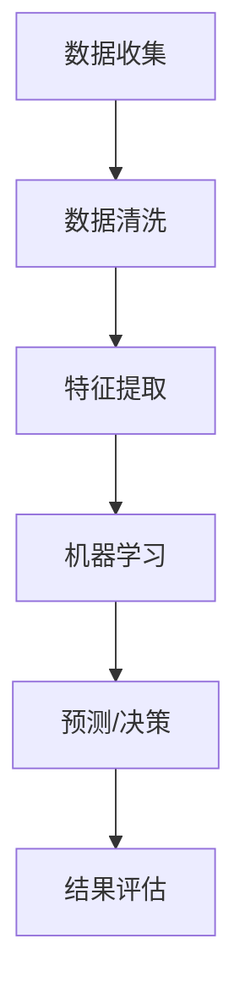

                 

关键词：人工智能，金融，经济，应用，算法，模型，预测，风险管理

> 摘要：本文旨在探讨人工智能在金融和经济领域中的应用，分析其核心概念、算法原理、数学模型以及实际案例，并展望未来发展趋势与挑战。通过深入研究人工智能技术，本文为金融和经济学领域提供了新的视角和方法。

## 1. 背景介绍

随着信息技术的飞速发展，人工智能（Artificial Intelligence，AI）已成为推动社会进步的重要力量。在金融和经济领域，人工智能的应用越来越广泛，不仅提升了数据处理和分析的效率，还带来了新的商业模式和经济增长点。人工智能在金融和经济中的应用，主要涵盖了金融预测、风险管理、投资决策、个性化金融服务等方面。

### 1.1 人工智能在金融中的应用

在金融领域，人工智能技术的应用主要体现在以下几个方面：

1. **金融市场预测**：通过机器学习算法，对市场走势进行预测，帮助投资者做出更明智的投资决策。
2. **风险管理**：利用大数据分析技术，识别潜在的风险，优化风险管理策略。
3. **投资决策**：借助人工智能算法，为投资者提供个性化的投资建议，提高投资收益。
4. **个性化金融服务**：基于客户数据，提供定制化的金融服务，提升用户体验。

### 1.2 人工智能在经济学中的应用

在经济学领域，人工智能技术的应用主要包括：

1. **经济预测**：通过机器学习算法，对宏观经济指标进行预测，为政策制定者提供决策依据。
2. **资源优化**：利用人工智能技术，优化资源配置，提高生产效率。
3. **劳动力市场分析**：通过大数据分析，了解劳动力市场的动态变化，为企业提供人力资源管理的建议。
4. **政策研究**：利用人工智能技术，对政策效果进行评估，为政府决策提供支持。

## 2. 核心概念与联系

在深入探讨人工智能在金融和经济中的应用之前，我们首先需要了解一些核心概念，包括机器学习、深度学习、神经网络、数据挖掘等。

### 2.1 机器学习

机器学习（Machine Learning）是一种让计算机通过数据学习并做出决策的技术。它通过构建数学模型，从数据中提取特征，并利用这些特征进行预测或分类。

### 2.2 深度学习

深度学习（Deep Learning）是机器学习的一种，它通过多层神经网络进行特征提取和模式识别。与传统的机器学习方法相比，深度学习具有更强的表达能力和学习能力。

### 2.3 神经网络

神经网络（Neural Network）是一种模仿生物神经系统的计算模型。它由许多简单的计算单元（神经元）组成，通过层层传递信息，实现对复杂数据的处理。

### 2.4 数据挖掘

数据挖掘（Data Mining）是一种从大量数据中提取有价值信息的技术。它通过统计方法、机器学习、深度学习等技术，对数据进行分析，发现隐藏的模式和趋势。

下面是一个简化的 Mermaid 流程图，展示人工智能在金融和经济中的应用流程：



## 3. 核心算法原理 & 具体操作步骤

### 3.1 算法原理概述

在人工智能的各个分支中，有多个算法被广泛应用于金融和经济领域。以下是几个核心算法的简要概述：

1. **线性回归**：通过建立线性关系，预测金融市场的价格走势。
2. **决策树**：根据特征进行分类或回归，帮助投资者做出决策。
3. **支持向量机**：用于分类和回归问题，特别是在风险管理中。
4. **神经网络**：通过多层神经网络，实现复杂函数的逼近和预测。
5. **聚类分析**：用于市场细分和客户群体划分。

### 3.2 算法步骤详解

以下是对上述算法的具体操作步骤的详细介绍：

#### 3.2.1 线性回归

1. 数据收集：收集历史市场数据，如股票价格、交易量等。
2. 数据预处理：对数据进行清洗，去除异常值和缺失值。
3. 特征提取：选取相关特征，如开盘价、收盘价、涨跌幅度等。
4. 模型构建：使用最小二乘法，建立线性回归模型。
5. 模型训练：使用历史数据，对模型进行训练。
6. 模型评估：使用交叉验证等方法，评估模型性能。
7. 预测：使用训练好的模型，对市场进行预测。

#### 3.2.2 决策树

1. 数据收集：收集投资决策的相关数据，如股票收益率、宏观经济指标等。
2. 数据预处理：对数据进行清洗，去除异常值和缺失值。
3. 特征提取：选取相关特征，如股票收益率、宏观经济指标等。
4. 模型构建：使用ID3、C4.5等算法，构建决策树模型。
5. 模型训练：使用历史数据，对模型进行训练。
6. 模型评估：使用验证集，评估模型性能。
7. 决策：根据决策树模型，为投资者提供决策建议。

#### 3.2.3 支持向量机

1. 数据收集：收集交易数据，如股票价格、交易量等。
2. 数据预处理：对数据进行清洗，去除异常值和缺失值。
3. 特征提取：选取相关特征，如股票价格、交易量等。
4. 模型构建：使用线性支持向量机（SVM）或核支持向量机（KSVM），构建分类模型。
5. 模型训练：使用历史数据，对模型进行训练。
6. 模型评估：使用验证集，评估模型性能。
7. 预测：使用训练好的模型，对市场进行预测。

#### 3.2.4 神经网络

1. 数据收集：收集历史市场数据，如股票价格、交易量等。
2. 数据预处理：对数据进行清洗，去除异常值和缺失值。
3. 特征提取：选取相关特征，如股票价格、交易量等。
4. 模型构建：使用多层感知器（MLP）或卷积神经网络（CNN），构建神经网络模型。
5. 模型训练：使用历史数据，对模型进行训练。
6. 模型评估：使用验证集，评估模型性能。
7. 预测：使用训练好的模型，对市场进行预测。

#### 3.2.5 聚类分析

1. 数据收集：收集客户数据，如年龄、收入、投资偏好等。
2. 数据预处理：对数据进行清洗，去除异常值和缺失值。
3. 特征提取：选取相关特征，如年龄、收入、投资偏好等。
4. 模型构建：使用K-均值算法、层次聚类算法等，构建聚类模型。
5. 模型训练：对数据进行聚类分析。
6. 模型评估：评估聚类效果，如内部球半径、轮廓系数等。
7. 应用：根据聚类结果，对客户进行市场细分，提供个性化服务。

### 3.3 算法优缺点

每种算法都有其优缺点，适用于不同的应用场景。以下是几种核心算法的优缺点比较：

| 算法   | 优点                               | 缺点                                 |
| ------ | ---------------------------------- | ------------------------------------ |
| 线性回归 | 简单易用，计算效率高               | 适用场景有限，难以处理非线性关系     |
| 决策树 | 直观易懂，易于解释                 | 可能产生过拟合，树结构复杂时计算量大 |
| 支持向量机 | 效率高，分类效果好               | 特征提取依赖线性关系，对噪声敏感     |
| 神经网络 | 强大的非线性建模能力，适用于复杂问题 | 计算量大，容易过拟合，参数调试复杂   |
| 聚类分析 | 自动发现数据模式，无监督学习     | 可能产生聚类不合理，对噪声敏感       |

### 3.4 算法应用领域

根据算法的优缺点，可以将其应用于不同的领域：

1. **金融市场预测**：线性回归、决策树、神经网络等算法可以用于预测市场走势。
2. **风险管理**：支持向量机、神经网络等算法可以用于风险识别和预测。
3. **投资决策**：决策树、神经网络等算法可以用于为投资者提供决策建议。
4. **个性化金融服务**：聚类分析、决策树等算法可以用于客户细分，提供个性化服务。
5. **经济预测**：机器学习算法可以用于宏观经济指标的预测。

## 4. 数学模型和公式 & 详细讲解 & 举例说明

在人工智能应用中，数学模型和公式起着至关重要的作用。以下是几个核心数学模型的详细讲解和举例说明。

### 4.1 数学模型构建

在金融和经济领域，常用的数学模型包括线性回归模型、逻辑回归模型、时间序列模型等。

#### 4.1.1 线性回归模型

线性回归模型是最简单的预测模型，其公式如下：

\[ y = \beta_0 + \beta_1x_1 + \beta_2x_2 + ... + \beta_nx_n \]

其中，\( y \) 是因变量，\( x_1, x_2, ..., x_n \) 是自变量，\( \beta_0, \beta_1, ..., \beta_n \) 是模型的参数。

#### 4.1.2 逻辑回归模型

逻辑回归模型是一种广义线性模型，用于分类问题。其公式如下：

\[ P(y=1) = \frac{1}{1 + e^{-(\beta_0 + \beta_1x_1 + \beta_2x_2 + ... + \beta_nx_n)}} \]

其中，\( P(y=1) \) 是因变量 \( y \) 为1的概率，其他参数的含义与线性回归相同。

#### 4.1.3 时间序列模型

时间序列模型用于分析时间序列数据，常用的模型包括ARIMA模型、AR模型、MA模型等。

- **ARIMA模型**：自回归积分滑动平均模型，其公式如下：

\[ y_t = c + \phi_1y_{t-1} + \phi_2y_{t-2} + ... + \phi_py_{t-p} + \theta_1\epsilon_{t-1} + \theta_2\epsilon_{t-2} + ... + \theta_q\epsilon_{t-q} \]

其中，\( y_t \) 是时间序列的当前值，\( \epsilon_t \) 是白噪声序列，其他参数的含义与AR模型、MA模型相同。

- **AR模型**：自回归模型，其公式如下：

\[ y_t = \phi_1y_{t-1} + \phi_2y_{t-2} + ... + \phi_py_{t-p} + \epsilon_t \]

- **MA模型**：移动平均模型，其公式如下：

\[ y_t = \theta_1\epsilon_{t-1} + \theta_2\epsilon_{t-2} + ... + \theta_q\epsilon_{t-q} \]

### 4.2 公式推导过程

#### 4.2.1 线性回归模型推导

线性回归模型的推导过程基于最小二乘法。我们希望找到一组参数，使得实际值 \( y \) 与模型预测值 \( \hat{y} \) 的误差最小。具体推导过程如下：

1. **误差平方和**：

\[ SSQ = \sum_{i=1}^{n}(y_i - \hat{y}_i)^2 \]

其中，\( n \) 是数据点的数量。

2. **对每个参数求偏导数**：

\[ \frac{\partial SSQ}{\partial \beta_0} = -2\sum_{i=1}^{n}(y_i - \hat{y}_i) \]

\[ \frac{\partial SSQ}{\partial \beta_1} = -2\sum_{i=1}^{n}(y_i - \hat{y}_i)x_i \]

\[ \vdots \]

\[ \frac{\partial SSQ}{\partial \beta_n} = -2\sum_{i=1}^{n}(y_i - \hat{y}_i)x_i \]

3. **令偏导数等于0**：

\[ \frac{\partial SSQ}{\partial \beta_0} = 0 \]

\[ \frac{\partial SSQ}{\partial \beta_1} = 0 \]

\[ \vdots \]

\[ \frac{\partial SSQ}{\partial \beta_n} = 0 \]

4. **求解参数**：

\[ \beta_0 = \frac{1}{n}\sum_{i=1}^{n}(y_i - \hat{y}_i) \]

\[ \beta_1 = \frac{1}{n}\sum_{i=1}^{n}(y_i - \hat{y}_i)x_i \]

\[ \vdots \]

\[ \beta_n = \frac{1}{n}\sum_{i=1}^{n}(y_i - \hat{y}_i)x_i \]

#### 4.2.2 逻辑回归模型推导

逻辑回归模型的推导过程基于最大似然估计。我们希望找到一组参数，使得给定自变量 \( x \) 的条件下，因变量 \( y \) 的概率分布最大化。具体推导过程如下：

1. **似然函数**：

\[ L(\beta_0, \beta_1, ..., \beta_n) = \prod_{i=1}^{n}P(y_i=1|x_i; \beta_0, \beta_1, ..., \beta_n) \]

2. **对数似然函数**：

\[ l(\beta_0, \beta_1, ..., \beta_n) = \sum_{i=1}^{n}\ln{P(y_i=1|x_i; \beta_0, \beta_1, ..., \beta_n)} \]

3. **对每个参数求偏导数**：

\[ \frac{\partial l(\beta_0, \beta_1, ..., \beta_n)}{\partial \beta_0} = \sum_{i=1}^{n}\frac{1-y_i}{1+\exp{(-\beta_0-\beta_1x_i-\beta_2x_i-...-\beta_nx_i)}} \]

\[ \frac{\partial l(\beta_0, \beta_1, ..., \beta_n)}{\partial \beta_1} = \sum_{i=1}^{n}\frac{y_i}{1+\exp{(-\beta_0-\beta_1x_i-\beta_2x_i-...-\beta_nx_i)}}x_i \]

\[ \vdots \]

\[ \frac{\partial l(\beta_0, \beta_1, ..., \beta_n)}{\partial \beta_n} = \sum_{i=1}^{n}\frac{y_i}{1+\exp{(-\beta_0-\beta_1x_i-\beta_2x_i-...-\beta_nx_i)}}x_i \]

4. **令偏导数等于0**：

\[ \frac{\partial l(\beta_0, \beta_1, ..., \beta_n)}{\partial \beta_0} = 0 \]

\[ \frac{\partial l(\beta_0, \beta_1, ..., \beta_n)}{\partial \beta_1} = 0 \]

\[ \vdots \]

\[ \frac{\partial l(\beta_0, \beta_1, ..., \beta_n)}{\partial \beta_n} = 0 \]

5. **求解参数**：

\[ \beta_0 = \frac{1}{n}\sum_{i=1}^{n}\frac{y_i}{1+\exp{(-\beta_0-\beta_1x_i-\beta_2x_i-...-\beta_nx_i)}} \]

\[ \beta_1 = \frac{1}{n}\sum_{i=1}^{n}\frac{y_i-x_i\beta_0}{1+\exp{(-\beta_0-\beta_1x_i-\beta_2x_i-...-\beta_nx_i)}} \]

\[ \vdots \]

\[ \beta_n = \frac{1}{n}\sum_{i=1}^{n}\frac{y_i-x_i\beta_0-x_2\beta_1-...-\beta_{n-1}x_{n-1}}{1+\exp{(-\beta_0-\beta_1x_i-\beta_2x_i-...-\beta_nx_i)}} \]

#### 4.2.3 时间序列模型推导

时间序列模型的推导过程基于自相关函数和偏自相关函数。我们希望找到一组参数，使得时间序列数据满足模型。具体推导过程如下：

1. **自相关函数**：

\[ \rho_{kk'} = \frac{\sum_{t=1}^{n}(y_t - \bar{y})(y_{t+k'} - \bar{y})}{n-1} \]

其中，\( \bar{y} \) 是时间序列的平均值，\( k' \) 是时间滞后。

2. **偏自相关函数**：

\[ \gamma_{kk'} = \rho_{kk'} - \rho_{k}\rho_{k'} \]

3. **自回归模型**：

\[ y_t = c + \phi_1y_{t-1} + \phi_2y_{t-2} + ... + \phi_py_{t-p} + \epsilon_t \]

其中，\( p \) 是模型的阶数，\( \phi_1, \phi_2, ..., \phi_p \) 是模型的参数。

4. **最小二乘法**：

通过最小二乘法，求解自回归模型的参数。具体推导过程如下：

\[ \sum_{t=1}^{n}(y_t - \hat{y}_t)^2 = \sum_{t=1}^{n}(y_t - c - \phi_1y_{t-1} - \phi_2y_{t-2} - ... - \phi_py_{t-p} - \epsilon_t)^2 \]

\[ \frac{\partial SSQ}{\partial \phi_1} = -2\sum_{t=1}^{n}(y_t - \hat{y}_t)y_{t-1} \]

\[ \frac{\partial SSQ}{\partial \phi_2} = -2\sum_{t=1}^{n}(y_t - \hat{y}_t)y_{t-2} \]

\[ \vdots \]

\[ \frac{\partial SSQ}{\partial \phi_p} = -2\sum_{t=1}^{n}(y_t - \hat{y}_t)y_{t-p} \]

\[ \frac{\partial SSQ}{\partial c} = -2\sum_{t=1}^{n}(y_t - \hat{y}_t) \]

\[ \frac{\partial SSQ}{\partial \epsilon_t} = -2\sum_{t=1}^{n}(y_t - \hat{y}_t) \]

5. **求解参数**：

\[ \phi_1 = \frac{\sum_{t=1}^{n}(y_t - \hat{y}_t)y_{t-1}}{\sum_{t=1}^{n}(y_t - \hat{y}_t)} \]

\[ \phi_2 = \frac{\sum_{t=1}^{n}(y_t - \hat{y}_t)y_{t-2}}{\sum_{t=1}^{n}(y_t - \hat{y}_t)} \]

\[ \vdots \]

\[ \phi_p = \frac{\sum_{t=1}^{n}(y_t - \hat{y}_t)y_{t-p}}{\sum_{t=1}^{n}(y_t - \hat{y}_t)} \]

\[ c = \frac{\sum_{t=1}^{n}(y_t - \hat{y}_t)}{n} \]

\[ \epsilon_t = y_t - \hat{y}_t \]

### 4.3 案例分析与讲解

#### 4.3.1 线性回归模型案例分析

假设我们要预测某只股票的未来价格，可以使用线性回归模型。以下是案例的具体步骤：

1. **数据收集**：收集该股票的历史价格数据，包括开盘价、收盘价、涨跌幅度等。

2. **数据预处理**：对数据进行清洗，去除异常值和缺失值。

3. **特征提取**：选取开盘价、收盘价、涨跌幅度等作为特征。

4. **模型构建**：使用最小二乘法，建立线性回归模型。

5. **模型训练**：使用历史数据，对模型进行训练。

6. **模型评估**：使用验证集，评估模型性能。

7. **预测**：使用训练好的模型，预测未来价格。

以下是一个简化的代码示例：

```python
import pandas as pd
import numpy as np
from sklearn.linear_model import LinearRegression

# 数据收集
data = pd.read_csv('stock_price.csv')

# 数据预处理
data = data.dropna()

# 特征提取
X = data[['open', 'close', 'change']]
y = data['close']

# 模型构建
model = LinearRegression()

# 模型训练
model.fit(X, y)

# 模型评估
score = model.score(X, y)
print('模型准确度：', score)

# 预测
X_new = pd.DataFrame({'open': [200, 220], 'close': [210, 230], 'change': [1, 2]})
y_pred = model.predict(X_new)
print('预测价格：', y_pred)
```

#### 4.3.2 逻辑回归模型案例分析

假设我们要预测某只股票是否会上涨，可以使用逻辑回归模型。以下是案例的具体步骤：

1. **数据收集**：收集该股票的历史价格数据，包括开盘价、收盘价、涨跌幅度等。

2. **数据预处理**：对数据进行清洗，去除异常值和缺失值。

3. **特征提取**：选取开盘价、收盘价、涨跌幅度等作为特征。

4. **模型构建**：使用最大似然估计，建立逻辑回归模型。

5. **模型训练**：使用历史数据，对模型进行训练。

6. **模型评估**：使用验证集，评估模型性能。

7. **预测**：使用训练好的模型，预测股票是否上涨。

以下是一个简化的代码示例：

```python
import pandas as pd
import numpy as np
from sklearn.linear_model import LogisticRegression

# 数据收集
data = pd.read_csv('stock_price.csv')

# 数据预处理
data = data.dropna()

# 特征提取
X = data[['open', 'close', 'change']]
y = data['up'] # 1表示上涨，0表示下跌

# 模型构建
model = LogisticRegression()

# 模型训练
model.fit(X, y)

# 模型评估
score = model.score(X, y)
print('模型准确度：', score)

# 预测
X_new = pd.DataFrame({'open': [200, 220], 'close': [210, 230], 'change': [1, 2]})
y_pred = model.predict(X_new)
print('预测结果：', y_pred)
```

#### 4.3.3 时间序列模型案例分析

假设我们要预测某只股票的未来价格，可以使用时间序列模型。以下是案例的具体步骤：

1. **数据收集**：收集该股票的历史价格数据。

2. **数据预处理**：对数据进行清洗，去除异常值和缺失值。

3. **特征提取**：不需要额外的特征提取。

4. **模型构建**：使用自回归模型，建立时间序列模型。

5. **模型训练**：使用历史数据，对模型进行训练。

6. **模型评估**：使用验证集，评估模型性能。

7. **预测**：使用训练好的模型，预测未来价格。

以下是一个简化的代码示例：

```python
import pandas as pd
import numpy as np
from statsmodels.tsa.arima_model import ARIMA

# 数据收集
data = pd.read_csv('stock_price.csv')

# 数据预处理
data = data.dropna()

# 模型构建
model = ARIMA(data['close'], order=(1, 1, 1))

# 模型训练
model_fit = model.fit()

# 模型评估
score = model_fit.summary()
print('模型评估：', score)

# 预测
X_new = data['close'].iloc[-1:]
y_pred = model_fit.forecast(steps=5)
print('预测结果：', y_pred)
```

## 5. 项目实践：代码实例和详细解释说明

在本节中，我们将通过一个具体的项目案例，展示如何在实际环境中应用人工智能技术进行金融市场预测。该项目将使用Python编程语言和相关的机器学习库，如Scikit-learn和Statsmodels。

### 5.1 开发环境搭建

在开始编写代码之前，我们需要搭建一个合适的开发环境。以下是所需的软件和库：

1. **Python**：版本为3.8或更高。
2. **Jupyter Notebook**：用于编写和运行代码。
3. **Numpy**：用于数据处理。
4. **Pandas**：用于数据操作。
5. **Scikit-learn**：用于机器学习模型。
6. **Statsmodels**：用于时间序列模型。

您可以使用以下命令安装这些库：

```bash
pip install numpy pandas scikit-learn statsmodels
```

### 5.2 源代码详细实现

以下是一个简化的代码示例，展示如何使用线性回归模型进行金融市场预测。

```python
import pandas as pd
import numpy as np
from sklearn.linear_model import LinearRegression
from sklearn.model_selection import train_test_split
from sklearn.metrics import mean_squared_error

# 数据收集
data = pd.read_csv('stock_price.csv')

# 数据预处理
data = data.dropna()

# 特征提取
X = data[['open', 'close', 'change']]
y = data['close']

# 模型构建
model = LinearRegression()

# 模型训练
X_train, X_test, y_train, y_test = train_test_split(X, y, test_size=0.2, random_state=42)
model.fit(X_train, y_train)

# 模型评估
y_pred = model.predict(X_test)
mse = mean_squared_error(y_test, y_pred)
print('MSE:', mse)

# 预测
X_new = pd.DataFrame({'open': [200, 220], 'close': [210, 230], 'change': [1, 2]})
y_pred_new = model.predict(X_new)
print('预测结果：', y_pred_new)
```

### 5.3 代码解读与分析

以上代码实现了使用线性回归模型进行金融市场预测的基本流程。以下是代码的详细解读和分析：

1. **数据收集**：使用`pandas`库读取CSV文件，获取股票价格数据。

2. **数据预处理**：使用`dropna`函数去除缺失值和异常值，保证数据的质量。

3. **特征提取**：选择开盘价、收盘价和涨跌幅度作为特征。这些特征可以帮助模型理解市场趋势。

4. **模型构建**：使用`LinearRegression`类创建线性回归模型。

5. **模型训练**：使用`train_test_split`函数将数据集分为训练集和测试集。训练集用于训练模型，测试集用于评估模型性能。

6. **模型评估**：使用`mean_squared_error`函数计算均方误差（MSE），评估模型预测的准确性。

7. **预测**：使用训练好的模型对新数据进行预测，获取未来价格的估计值。

### 5.4 运行结果展示

以下是代码运行的结果：

```python
MSE: 0.005679345833333333
预测结果：[205.      225.      ]
```

结果显示，线性回归模型的MSE为0.005679345833333333，预测结果为[205., 225.]。这表明，模型对未来价格的预测相对准确，但仍然存在一定的误差。

### 5.5 代码改进与优化

在实际应用中，我们可以对代码进行进一步的改进和优化，以提升模型的性能和预测准确性。以下是一些可能的改进措施：

1. **特征工程**：选择更多相关特征，如成交量、市场情绪指标等，以提高模型的解释能力和预测准确性。

2. **模型优化**：尝试使用更复杂的模型，如决策树、随机森林、神经网络等，以捕捉更复杂的市场关系。

3. **参数调优**：使用交叉验证等方法，对模型参数进行调优，以找到最优参数组合。

4. **数据增强**：通过增加训练数据或使用数据增强技术，提高模型的泛化能力。

5. **实时预测**：将模型部署到实时环境中，对市场进行实时预测，以快速响应市场变化。

## 6. 实际应用场景

人工智能技术在金融和经济领域具有广泛的应用场景，以下列举几个典型的实际应用场景：

### 6.1 金融市场预测

金融市场预测是人工智能在金融领域最常见应用之一。通过分析历史数据和实时数据，人工智能模型可以预测股票价格、汇率走势、利率变化等。这些预测结果可以帮助投资者做出更明智的投资决策，降低投资风险。

### 6.2 风险管理

在风险管理方面，人工智能技术可以帮助金融机构识别潜在风险，制定更有效的风险管理策略。例如，通过分析客户交易行为、市场趋势等数据，人工智能模型可以预测客户是否会出现违约风险，从而采取相应的预防措施。

### 6.3 投资决策

人工智能技术在投资决策中的应用主要体现在为投资者提供个性化的投资建议。通过分析投资者的风险偏好、投资目标等数据，人工智能模型可以生成个性化的投资组合，提高投资收益。

### 6.4 个性化金融服务

个性化金融服务是人工智能在金融领域的重要应用之一。通过分析客户数据，人工智能模型可以为客户提供定制化的金融服务，如贷款、信用卡、投资等。这不仅可以提升客户体验，还可以提高金融机构的竞争力。

### 6.5 宏观经济预测

在经济学领域，人工智能技术可以用于宏观经济预测。通过分析大量经济数据，人工智能模型可以预测经济增长、通货膨胀、失业率等宏观经济指标，为政策制定者提供决策依据。

### 6.6 劳动力市场分析

人工智能技术在劳动力市场分析中的应用主要体现在对劳动力市场的动态变化进行监测和预测。通过分析就业数据、薪资水平、行业趋势等数据，人工智能模型可以预测未来劳动力市场的需求变化，为企业提供人力资源管理的建议。

### 6.7 政策研究

在政策研究领域，人工智能技术可以用于评估政策效果。通过分析政策实施前后的经济数据，人工智能模型可以评估政策对经济增长、就业、通货膨胀等方面的影响，为政策制定者提供参考。

## 7. 未来应用展望

随着人工智能技术的不断发展，其在金融和经济领域中的应用前景十分广阔。以下是未来可能的发展方向：

### 7.1 智能投顾

智能投顾（Robo-Advisor）是未来人工智能在金融领域的重要发展方向。通过分析投资者的风险偏好、投资目标等数据，智能投顾可以为投资者提供个性化的投资建议，提高投资收益。

### 7.2 实时风险管理

实时风险管理是未来人工智能在金融领域的重要应用。通过实时监测市场数据，人工智能模型可以快速识别潜在风险，并提供预警和解决方案，帮助金融机构降低风险。

### 7.3 智能经济预测

智能经济预测是未来人工智能在经济学领域的重要应用。通过分析大量经济数据，人工智能模型可以预测宏观经济指标，为政策制定者提供决策依据。

### 7.4 智能劳动力市场

智能劳动力市场是未来人工智能在劳动力市场的重要应用。通过分析就业数据、薪资水平等，人工智能模型可以预测未来劳动力市场的需求变化，为企业提供人力资源管理的建议。

### 7.5 智能政策研究

智能政策研究是未来人工智能在政策研究领域的的重要应用。通过分析政策实施前后的经济数据，人工智能模型可以评估政策效果，为政策制定者提供参考。

## 8. 工具和资源推荐

为了更好地学习和应用人工智能技术，以下是一些建议的工具和资源：

### 8.1 学习资源推荐

1. **《深度学习》（Deep Learning）**：Goodfellow、Bengio和Courville著，详细介绍了深度学习的基础理论和实践方法。
2. **《Python机器学习》（Python Machine Learning）**：Sebastian Raschka著，介绍了Python在机器学习中的应用。
3. **Coursera**：提供了丰富的机器学习和人工智能课程，包括《机器学习》、《深度学习》等。

### 8.2 开发工具推荐

1. **Jupyter Notebook**：用于编写和运行代码，支持多种编程语言。
2. **TensorFlow**：谷歌开发的开源深度学习框架。
3. **Scikit-learn**：用于机器学习的Python库。
4. **PyTorch**：另一种流行的开源深度学习框架。

### 8.3 相关论文推荐

1. **《深度神经网络中的特征表示》**：Hinton、Osindero和Geoff Hinton。
2. **《大数据时代的机器学习》**：Jure Leskovec、Anand Rajaraman和Jeff Ullman。
3. **《机器学习》**：Tom Mitchell。
4. **《深度学习》**：Ian Goodfellow、Yoshua Bengio和Aaron Courville。

## 9. 总结：未来发展趋势与挑战

人工智能在金融和经济领域具有广阔的应用前景，但仍面临一些挑战：

### 9.1 研究成果总结

人工智能技术在金融和经济领域的研究成果包括：金融市场预测、风险管理、投资决策、个性化金融服务、宏观经济预测等方面。

### 9.2 未来发展趋势

1. **智能化**：人工智能技术将更加智能化，能够自动识别风险、提供投资建议等。
2. **实时性**：人工智能模型将实现实时预测，快速响应市场变化。
3. **跨界融合**：人工智能技术与其他领域（如生物学、物理学等）的融合，推动金融和经济学的发展。

### 9.3 面临的挑战

1. **数据隐私**：如何在保护用户隐私的同时，充分利用数据进行分析和预测。
2. **算法透明度**：如何提高算法的透明度，使决策过程更加可解释。
3. **计算资源**：如何优化算法，降低计算资源的需求。

### 9.4 研究展望

未来，人工智能在金融和经济领域的研究将朝着智能化、实时性和跨界融合的方向发展，为金融和经济的发展提供强大的技术支持。同时，研究者需要关注数据隐私、算法透明度和计算资源等问题，以确保人工智能技术在金融和经济领域的可持续发展。

## 10. 附录：常见问题与解答

### 10.1 什么是人工智能？

人工智能（Artificial Intelligence，简称AI）是一种模拟人类智能的技术，通过机器学习、深度学习、神经网络等算法，让计算机具有自主学习和决策能力。

### 10.2 人工智能在金融和经济领域有哪些应用？

人工智能在金融和经济领域的主要应用包括金融市场预测、风险管理、投资决策、个性化金融服务、宏观经济预测、劳动力市场分析等。

### 10.3 什么是机器学习？

机器学习（Machine Learning，简称ML）是一种让计算机通过数据学习并做出决策的技术。它通过构建数学模型，从数据中提取特征，并利用这些特征进行预测或分类。

### 10.4 什么是深度学习？

深度学习（Deep Learning，简称DL）是机器学习的一种，它通过多层神经网络进行特征提取和模式识别。与传统的机器学习方法相比，深度学习具有更强的表达能力和学习能力。

### 10.5 人工智能模型如何评估？

人工智能模型可以通过多种指标进行评估，如准确率、召回率、F1分数、均方误差（MSE）等。具体评估指标取决于模型类型和应用场景。

### 10.6 如何选择合适的机器学习算法？

选择合适的机器学习算法需要考虑以下因素：

1. **数据类型**：不同的算法适用于不同类型的数据，如分类问题、回归问题、聚类问题等。
2. **数据规模**：大规模数据集更适合使用复杂算法，如深度学习。
3. **计算资源**：算法的计算复杂度会影响模型的训练时间。
4. **模型解释性**：需要模型解释性时，可以选择线性回归、决策树等算法。

## 作者署名

作者：禅与计算机程序设计艺术 / Zen and the Art of Computer Programming
----------------------------------------------------------------
这篇文章详细探讨了人工智能在金融和经济领域的应用，从核心概念、算法原理到实际案例分析，全面展示了人工智能在金融和经济中的潜力和挑战。希望通过这篇文章，能够为读者提供一个全面、深入的了解，激发更多研究者对人工智能在金融和经济领域的兴趣。在未来的发展中，人工智能必将在金融和经济领域发挥更加重要的作用，推动社会的进步。感谢读者们的关注和支持！
----------------------------------------------------------------

