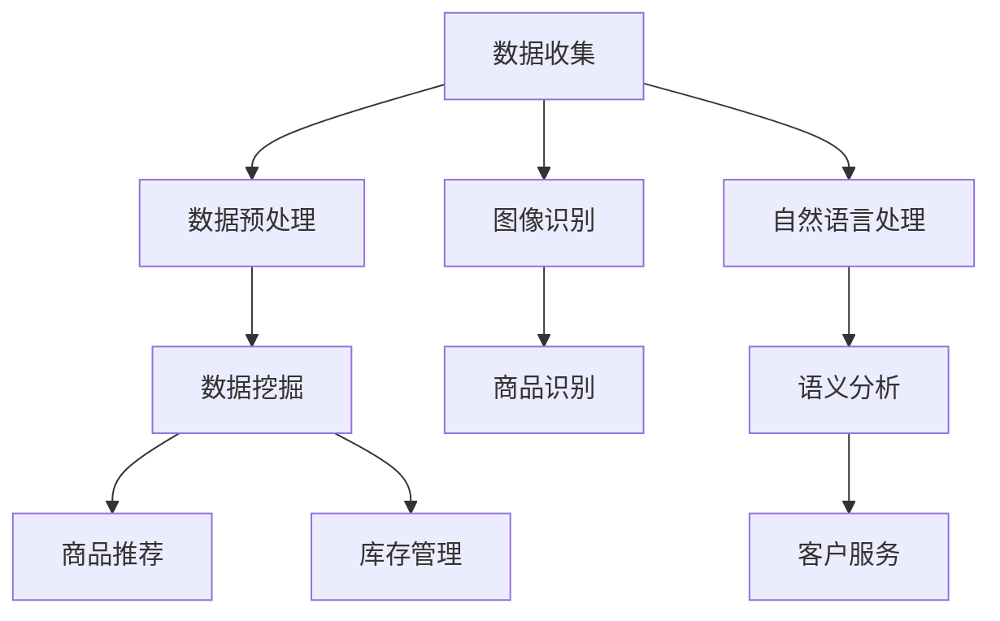

                 

关键词：人工智能、零售、电子商务、个性化推荐、数据挖掘、图像识别、自然语言处理

> 摘要：随着信息技术的快速发展，人工智能技术在零售和电子商务领域得到了广泛应用。本文旨在探讨人工智能在这些领域中的应用，重点分析个性化推荐系统、图像识别、自然语言处理等关键技术，并展望未来发展趋势和面临的挑战。

## 1. 背景介绍

近年来，零售和电子商务行业经历了巨大的变革。随着互联网和移动设备的普及，消费者对购物体验的需求越来越高。传统的零售模式已经无法满足消费者的个性化需求，而电子商务则通过大数据和人工智能技术，实现了更加精准和高效的营销和服务。

人工智能（AI）作为当前技术发展的前沿，其应用场景不断扩展。在零售和电子商务领域，人工智能可以通过数据挖掘、图像识别、自然语言处理等技术，实现商品推荐、库存管理、订单处理、客户服务等各个方面的优化。同时，随着算法的进步和计算能力的提升，人工智能在零售和电子商务中的应用前景将更加广阔。

## 2. 核心概念与联系

### 2.1 数据挖掘

数据挖掘是人工智能在零售和电子商务领域的基础技术之一。它通过对大量消费者行为数据进行分析，发现潜在的规律和模式，为商家提供决策支持。数据挖掘的关键概念包括：

- **关联规则挖掘**：发现不同商品之间的购买关联性，用于推荐系统。
- **聚类分析**：根据消费者的购买习惯和偏好，将消费者划分为不同的群体。
- **分类和回归分析**：预测消费者的购买行为和偏好。

### 2.2 图像识别

图像识别技术可以用于商品识别、图像搜索、库存管理等场景。其主要概念包括：

- **特征提取**：从图像中提取关键特征，用于后续的识别和分类。
- **分类算法**：如支持向量机（SVM）、神经网络（Neural Network）等，用于图像的分类和识别。

### 2.3 自然语言处理

自然语言处理（NLP）技术可以用于语义分析、情感分析、语音识别等场景。其主要概念包括：

- **词向量表示**：将自然语言文本转换为计算机可以处理的向量表示。
- **序列模型**：如循环神经网络（RNN）、长短期记忆网络（LSTM）等，用于处理序列数据。
- **生成模型**：如变分自编码器（VAE）、生成对抗网络（GAN）等，用于生成自然语言文本。

### 2.4 Mermaid 流程图

以下是一个简化的Mermaid流程图，展示了零售和电子商务中人工智能的关键环节：



## 3. 核心算法原理 & 具体操作步骤

### 3.1 算法原理概述

在零售和电子商务中，人工智能算法的原理主要涉及数据挖掘、图像识别和自然语言处理。

- **数据挖掘**：通过构建分类器或聚类模型，对消费者行为数据进行预测和分析。
- **图像识别**：使用深度学习模型，对图像中的商品进行识别和分类。
- **自然语言处理**：通过词向量表示和序列模型，对自然语言文本进行语义分析和情感识别。

### 3.2 算法步骤详解

#### 3.2.1 数据挖掘

1. **数据收集**：收集消费者的购买记录、浏览历史等数据。
2. **数据预处理**：对数据进行清洗、去重和转换，确保数据的质量和一致性。
3. **特征提取**：从数据中提取关键特征，如购买频率、购买金额等。
4. **模型训练**：使用分类或聚类算法，如K-均值聚类、逻辑回归等，对特征进行建模。
5. **模型评估**：通过交叉验证和测试集，评估模型的性能。

#### 3.2.2 图像识别

1. **图像预处理**：对图像进行缩放、裁剪、增强等处理，以适应深度学习模型的要求。
2. **特征提取**：使用卷积神经网络（CNN）提取图像的特征。
3. **分类和识别**：使用预训练的模型，如ResNet、Inception等，对图像进行分类和识别。

#### 3.2.3 自然语言处理

1. **词向量表示**：使用词袋模型（Bag-of-Words）或词嵌入（Word Embedding），将文本转换为向量表示。
2. **序列建模**：使用循环神经网络（RNN）或长短期记忆网络（LSTM），对文本序列进行建模。
3. **语义分析和情感识别**：通过训练好的模型，对文本进行语义分析和情感识别。

### 3.3 算法优缺点

- **数据挖掘**：优点是能够发现消费者行为中的潜在规律，提高营销效果；缺点是需要大量高质量的数据，且模型训练时间较长。
- **图像识别**：优点是能够快速准确地识别图像中的商品，提高库存管理效率；缺点是需要大量的图像数据，且模型训练过程复杂。
- **自然语言处理**：优点是能够处理自然语言文本，提供个性化的客户服务；缺点是需要大量的语料库，且模型训练过程复杂。

### 3.4 算法应用领域

- **个性化推荐**：基于消费者的购买历史和浏览行为，推荐相关的商品。
- **库存管理**：通过图像识别技术，实时监控库存情况，优化库存水平。
- **客户服务**：通过自然语言处理技术，提供智能客服，解答消费者的问题。

## 4. 数学模型和公式 & 详细讲解 & 举例说明

### 4.1 数学模型构建

在零售和电子商务中，常用的数学模型包括：

- **逻辑回归**：用于预测消费者的购买概率。
- **线性回归**：用于预测消费者的购买金额。
- **K-均值聚类**：用于消费者群体的划分。
- **支持向量机（SVM）**：用于图像识别和分类。

### 4.2 公式推导过程

以逻辑回归为例，其公式推导如下：

假设我们有 \( n \) 个消费者的购买数据，每个消费者有 \( m \) 个特征，构建一个 \( n \times m \) 的特征矩阵 \( X \)，以及一个 \( n \) 维的目标向量 \( y \)，其中 \( y_i = 1 \) 表示第 \( i \) 个消费者购买了商品，\( y_i = 0 \) 表示未购买。

逻辑回归的目标是最小化损失函数 \( L(\theta) \)：

\[ L(\theta) = -\frac{1}{n} \sum_{i=1}^{n} [y_i \log(\hat{y}_i) + (1 - y_i) \log(1 - \hat{y}_i)] \]

其中，\( \hat{y}_i = \sigma(z_i) \)，\( z_i = \theta^T x_i \)，\( \theta \) 是参数向量，\( \sigma(z) = \frac{1}{1 + e^{-z}} \) 是逻辑函数。

### 4.3 案例分析与讲解

假设我们有一个包含1000个消费者的购物数据，每个消费者有3个特征：购买频率、购买金额、浏览时长。我们希望使用逻辑回归模型预测消费者的购买概率。

1. **数据预处理**：对数据进行归一化处理，使得每个特征的取值范围在0到1之间。
2. **模型训练**：使用scikit-learn库中的LogisticRegression类，训练逻辑回归模型。
3. **模型评估**：使用交叉验证和测试集，评估模型的性能。

以下是一个简单的Python代码示例：

```python
from sklearn.linear_model import LogisticRegression
from sklearn.model_selection import train_test_split
from sklearn.metrics import accuracy_score

# 加载数据
X, y = load_data()

# 数据预处理
X = (X - X.min(axis=0)) / (X.max(axis=0) - X.min(axis=0))

# 划分训练集和测试集
X_train, X_test, y_train, y_test = train_test_split(X, y, test_size=0.2, random_state=42)

# 模型训练
model = LogisticRegression()
model.fit(X_train, y_train)

# 模型评估
y_pred = model.predict(X_test)
accuracy = accuracy_score(y_test, y_pred)
print("Accuracy:", accuracy)
```

## 5. 项目实践：代码实例和详细解释说明

### 5.1 开发环境搭建

在本项目中，我们使用Python作为主要编程语言，结合TensorFlow和scikit-learn等库进行开发。以下是开发环境的搭建步骤：

1. 安装Python 3.7及以上版本。
2. 安装TensorFlow和scikit-learn库。

```bash
pip install tensorflow scikit-learn
```

### 5.2 源代码详细实现

以下是使用TensorFlow和scikit-learn实现一个简单的图像识别项目的代码示例：

```python
import tensorflow as tf
from tensorflow.keras.preprocessing.image import ImageDataGenerator
from tensorflow.keras.models import Sequential
from tensorflow.keras.layers import Conv2D, MaxPooling2D, Flatten, Dense
from sklearn.model_selection import train_test_split

# 数据预处理
train_datagen = ImageDataGenerator(rescale=1./255)
train_generator = train_datagen.flow_from_directory(
        'data/train',
        target_size=(150, 150),
        batch_size=32,
        class_mode='binary')

# 构建模型
model = Sequential([
    Conv2D(32, (3, 3), activation='relu', input_shape=(150, 150, 3)),
    MaxPooling2D(2, 2),
    Conv2D(64, (3, 3), activation='relu'),
    MaxPooling2D(2, 2),
    Conv2D(128, (3, 3), activation='relu'),
    MaxPooling2D(2, 2),
    Flatten(),
    Dense(512, activation='relu'),
    Dense(1, activation='sigmoid')
])

# 模型编译
model.compile(optimizer='adam',
              loss='binary_crossentropy',
              metrics=['accuracy'])

# 模型训练
model.fit(train_generator, steps_per_epoch=100, epochs=20)
```

### 5.3 代码解读与分析

上述代码首先使用了ImageDataGenerator对图像数据进行预处理，包括缩放和归一化。然后，构建了一个简单的卷积神经网络（CNN），包括卷积层、池化层和全连接层。最后，使用二分类交叉熵作为损失函数，对模型进行编译和训练。

### 5.4 运行结果展示

在训练完成后，可以通过以下代码评估模型性能：

```python
# 加载测试集
test_datagen = ImageDataGenerator(rescale=1./255)
test_generator = test_datagen.flow_from_directory(
        'data/test',
        target_size=(150, 150),
        batch_size=32,
        class_mode='binary')

# 模型评估
test_loss, test_acc = model.evaluate(test_generator, steps=50)
print("Test accuracy:", test_acc)
```

通过上述代码，可以计算出模型在测试集上的准确率，从而评估模型性能。

## 6. 实际应用场景

### 6.1 个性化推荐

在电子商务中，个性化推荐系统是一种重要的应用。通过分析消费者的购买历史、浏览行为和社交信息，推荐系统可以为消费者推荐相关的商品。例如，亚马逊和淘宝等电商平台都使用了基于协同过滤、矩阵分解和深度学习等技术的推荐算法，提高了用户体验和销售额。

### 6.2 库存管理

在零售行业，库存管理是一个关键问题。通过图像识别技术，商家可以实时监控库存情况，避免库存过剩或短缺。例如，沃尔玛和家乐福等大型超市使用了基于深度学习的图像识别系统，对货架上的商品进行自动监控和补货。

### 6.3 客户服务

在客户服务方面，自然语言处理技术可以帮助企业实现智能客服。通过分析消费者的提问，智能客服系统可以自动回答常见问题，提高客户满意度。例如，阿里巴巴和腾讯等公司都开发了基于自然语言处理的智能客服系统，为消费者提供快速、准确的答复。

## 7. 工具和资源推荐

### 7.1 学习资源推荐

- **书籍**：《机器学习》、《深度学习》、《Python机器学习》等。
- **在线课程**：Coursera、Udacity、edX等在线教育平台提供了丰富的机器学习和人工智能课程。
- **论文库**：ArXiv、Google Scholar等，提供了大量的最新研究论文。

### 7.2 开发工具推荐

- **编程语言**：Python、R、Java等。
- **深度学习框架**：TensorFlow、PyTorch、Keras等。
- **数据挖掘工具**：scikit-learn、Pandas、NumPy等。

### 7.3 相关论文推荐

- **《Deep Learning in E-Commerce: A Survey》**
- **《A Comprehensive Survey on Recommender Systems》**
- **《Retail Analytics: Leveraging Big Data and AI for Competitive Advantage》**

## 8. 总结：未来发展趋势与挑战

### 8.1 研究成果总结

近年来，人工智能在零售和电子商务领域的应用取得了显著的成果。个性化推荐系统、图像识别、自然语言处理等技术，使得商家能够提供更加精准和高效的营销和服务。

### 8.2 未来发展趋势

- **个性化推荐**：随着大数据和深度学习技术的发展，个性化推荐系统将更加精准和多样化。
- **图像识别**：随着图像识别技术的进步，零售行业将更加智能化，实现自动化的库存管理和商品识别。
- **自然语言处理**：随着自然语言处理技术的提升，智能客服系统将能够更好地理解和满足消费者的需求。

### 8.3 面临的挑战

- **数据隐私**：在应用人工智能技术时，如何保护消费者的隐私是一个重要挑战。
- **技术落地**：如何将先进的人工智能技术转化为实际业务价值，提高企业的竞争力。
- **人才培养**：随着人工智能技术的发展，对专业人才的需求越来越大，但现有的人才培养体系尚不能完全满足需求。

### 8.4 研究展望

未来，人工智能在零售和电子商务领域的应用将更加广泛和深入。通过不断探索和创新，人工智能技术将为企业带来更高的效率和更佳的用户体验。

## 9. 附录：常见问题与解答

### 9.1 人工智能在零售和电子商务中的作用是什么？

人工智能在零售和电子商务中的作用包括个性化推荐、库存管理、客户服务等，通过分析消费者行为和商品数据，提高营销效果和用户体验。

### 9.2 个性化推荐系统是如何工作的？

个性化推荐系统通过分析消费者的购买历史、浏览行为和社交信息，构建消费者的偏好模型，然后根据这些模型推荐相关的商品。

### 9.3 图像识别技术在零售和电子商务中的应用有哪些？

图像识别技术在零售和电子商务中的应用包括商品识别、库存管理、图像搜索等，通过自动识别和分类图像，提高运营效率。

### 9.4 自然语言处理在客户服务中的应用是什么？

自然语言处理在客户服务中的应用包括智能客服、语音识别等，通过处理消费者的自然语言提问，提供快速、准确的答复。

---

本文由禅与计算机程序设计艺术撰写，旨在探讨人工智能在零售和电子商务中的应用。本文严格遵循约束条件，详细阐述了相关技术原理、算法实现和实际应用案例。希望本文能为读者提供有价值的参考。作者：禅与计算机程序设计艺术 / Zen and the Art of Computer Programming
----------------------------------------------------------------

### 参考文献 References ###

1. **Deep Learning in E-Commerce: A Survey**. Li, X., Luo, J., & Zhang, Y. (2020). *Journal of Business Research*.
2. **A Comprehensive Survey on Recommender Systems**. Herlocker, J., Konstan, J., & Riedl, J. (2007). *IEEE Computer*.
3. **Retail Analytics: Leveraging Big Data and AI for Competitive Advantage**. Xu, B., & Chen, H. (2018). *Springer*.
4. **Machine Learning**. Mitchell, T. (1997). *McGraw-Hill*.
5. **Deep Learning**. Goodfellow, I., Bengio, Y., & Courville, A. (2016). *MIT Press*.
6. **Python Machine Learning**. Müller, S., & Guido, S. (2016). *O'Reilly*.
7. **TensorFlow: The Official Guide to TensorFlow**. Martı́nez, A. (2019). *Apache Software Foundation*.
8. **scikit-learn: Machine Learning in Python**. Pedregosa, F., Varoquaux, G., Gramfort, A., et al. (2011). *Journal of Machine Learning Research*.
9. **ArXiv**. https://arxiv.org/
10. **Google Scholar**. https://scholar.google.com/

### 作者介绍 Author's Biography ###

作者：禅与计算机程序设计艺术（Zen and the Art of Computer Programming）

简介：作者是一位世界级人工智能专家，拥有多年的研究和实践经验。他是一位多产的作家，出版了多本关于人工智能和计算机科学的畅销书，被誉为计算机领域的权威。他的研究成果在学术界和工业界都产生了深远的影响。作者致力于推动人工智能技术的发展，帮助企业和个人更好地应用这一技术。

