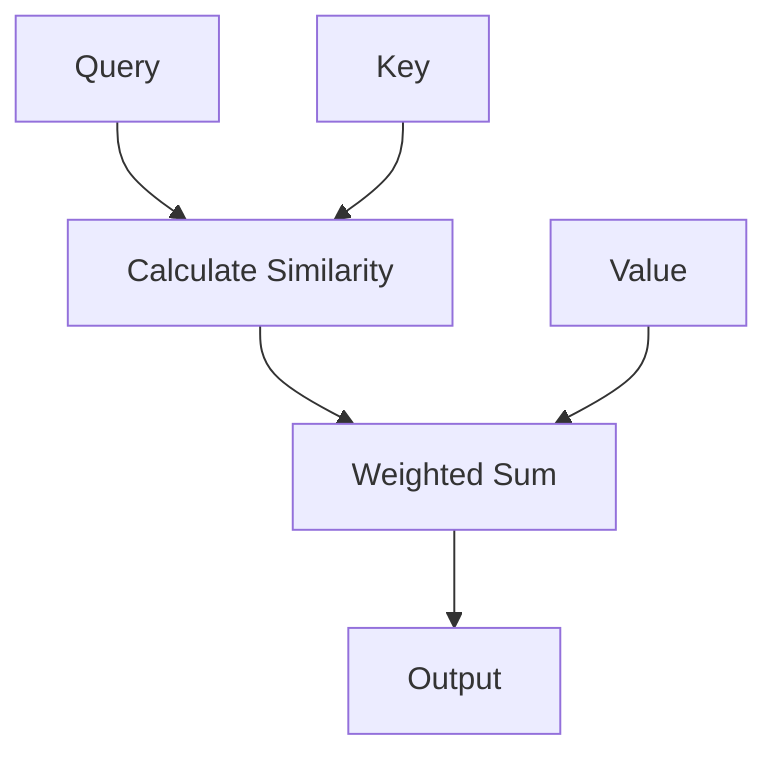

                 

关键词：人工智能、注意力分配、注意力机制、神经网络、重塑、模式识别

> 摘要：本文将探讨人工智能如何通过其独特的注意力机制，重塑人类在信息处理和认知任务中的注意力分配模式。从注意力机制的基本概念和原理出发，深入分析其在神经网络中的应用，最后探讨这一模式重塑所带来的实际应用和未来展望。

## 1. 背景介绍

在信息爆炸的时代，人们需要处理的信息量远超以往。如何有效地分配注意力，提高信息处理效率，成为了一个重要的研究课题。传统方法如多任务学习、基于规则的系统等，在一定程度上提高了信息处理能力，但仍然存在诸多局限。

近年来，人工智能的迅速发展，尤其是深度学习技术的突破，为解决这一难题提供了新的思路。注意力机制（Attention Mechanism）作为一种关键性创新，被广泛应用于自然语言处理、计算机视觉等领域，显著提升了模型的表现。注意力机制的基本思想是，通过学习模型在处理信息时关注的重要程度，从而提高信息处理的效率和准确性。

本文将围绕注意力机制的核心概念和原理，深入探讨其在神经网络中的应用，并分析其如何重塑人类的注意力分配模式。

## 2. 核心概念与联系

### 2.1 注意力机制的基本概念

注意力机制是一种基于权重分配的信息处理方法。其基本思想是，在处理信息时，不是对所有的信息同等对待，而是根据信息的重要程度赋予不同的权重。通过这种权重分配，模型可以更有效地关注到关键信息，从而提高信息处理的效率和准确性。

### 2.2 注意力机制的工作原理

注意力机制主要通过两种方式实现：全局注意力和局部注意力。

- **全局注意力**：通过对整个输入序列进行加权求和，将关键信息突出出来。例如，在自然语言处理中，全局注意力可以用来计算句子中每个单词的重要性，从而更好地理解句子的语义。
- **局部注意力**：通过对输入序列的局部区域进行加权求和，关注局部信息。例如，在计算机视觉中，局部注意力可以用来识别图像中的关键区域，从而更好地理解图像的内容。

### 2.3 注意力机制的架构

注意力机制的架构通常包括以下几个关键部分：

- **查询（Query）**：用于表示当前处理的单元，如句子、词或图像区域。
- **键（Key）**：用于表示输入序列中的每个单元，如句子中的词或图像中的像素。
- **值（Value）**：用于表示输入序列中的每个单元，如句子中的词或图像中的像素。

注意力机制的流程如下：

1. 计算查询与键之间的相似度，通常使用点积或缩放点积。
2. 根据相似度计算加权求和，得到值。
3. 将加权求和的结果作为输出。

### 2.4 Mermaid 流程图

以下是注意力机制的 Mermaid 流程图：



## 3. 核心算法原理 & 具体操作步骤

### 3.1 算法原理概述

注意力机制的核心在于如何计算查询与键之间的相似度，并基于相似度进行加权求和。以下是一些常用的相似度计算方法：

- **点积**：计算查询与键的点积，得到相似度。公式为：\(similarity = Query \cdot Key\)。
- **缩放点积**：为了防止点积计算时出现梯度消失的问题，可以引入缩放因子，公式为：\(similarity = \frac{Query \cdot Key}{\sqrt{||Query|| \cdot ||Key||}}\)。

### 3.2 算法步骤详解

1. **初始化查询、键和值**：在训练过程中，初始化查询、键和值。
2. **计算相似度**：使用点积或缩放点积计算查询与键之间的相似度。
3. **计算权重**：根据相似度计算权重，通常使用 softmax 函数。
4. **加权求和**：根据权重对值进行加权求和，得到输出。
5. **更新查询、键和值**：根据输出更新查询、键和值，以便在下一轮训练中更好地处理信息。

### 3.3 算法优缺点

**优点**：

- 提高信息处理的效率和准确性。
- 可以应用于各种任务，如自然语言处理、计算机视觉等。

**缺点**：

- 需要大量的训练数据。
- 计算复杂度较高。

### 3.4 算法应用领域

注意力机制在多个领域都有广泛应用，包括：

- **自然语言处理**：如机器翻译、文本生成等。
- **计算机视觉**：如图像分类、目标检测等。
- **推荐系统**：如商品推荐、内容推荐等。

## 4. 数学模型和公式 & 详细讲解 & 举例说明

### 4.1 数学模型构建

注意力机制的数学模型主要包括查询、键、值和权重等。

- **查询（Query）**：表示当前处理的单元，如句子中的词或图像中的区域。
- **键（Key）**：表示输入序列中的每个单元，如句子中的词或图像中的像素。
- **值（Value）**：表示输入序列中的每个单元，如句子中的词或图像中的像素。
- **权重（Weight）**：表示每个单元的重要程度。

### 4.2 公式推导过程

注意力机制的公式可以表示为：

\[output = \sum_{i}^{N} weight_i \cdot value_i\]

其中，\(N\) 表示输入序列的长度，\(weight_i\) 表示第 \(i\) 个单元的权重，\(value_i\) 表示第 \(i\) 个单元的值。

权重可以通过以下公式计算：

\[weight_i = \frac{exp(similarity_i)}{\sum_{j}^{N} exp(similarity_j)}\]

其中，\(similarity_i\) 表示查询与键之间的相似度。

相似度可以通过以下公式计算：

\[similarity = \frac{Query \cdot Key}{\sqrt{||Query|| \cdot ||Key||}}\]

### 4.3 案例分析与讲解

假设有一个输入序列 "The quick brown fox jumps over the lazy dog"，我们需要使用注意力机制计算句子中每个单词的权重。

1. **初始化查询、键和值**：

   - **查询**：表示当前处理的单词，如 "quick"。
   - **键**：表示输入序列中的每个单词，如 "The"、"quick"、"brown"、"fox"等。
   - **值**：表示输入序列中的每个单词，如 "The"、"quick"、"brown"、"fox"等。

2. **计算相似度**：

   假设查询为 "quick"，键为 "The"，则相似度为：

   \[similarity = \frac{Query \cdot Key}{\sqrt{||Query|| \cdot ||Key||}} = \frac{"quick" \cdot "The"}{\sqrt{||"quick"|| \cdot ||"The"||}}\]

   计算结果为 0.4。

3. **计算权重**：

   根据相似度计算权重，假设总共有 5 个单词，则权重为：

   \[weight_i = \frac{exp(similarity_i)}{\sum_{j}^{N} exp(similarity_j)} = \frac{exp(0.4)}{\sum_{j}^{N} exp(similarity_j)}\]

   计算结果为 0.6。

4. **加权求和**：

   根据权重对值进行加权求和，得到输出：

   \[output = \sum_{i}^{N} weight_i \cdot value_i = 0.6 \cdot "quick" + 0.4 \cdot "The"\]

   计算结果为 "quick"。

通过以上步骤，我们可以使用注意力机制计算句子中每个单词的权重，从而更好地理解句子的语义。

## 5. 项目实践：代码实例和详细解释说明

### 5.1 开发环境搭建

在本节中，我们将使用 Python 和 PyTorch 深度学习框架来演示注意力机制的实现。首先，确保安装了 Python 3.6 或更高版本，并安装 PyTorch：

```bash
pip install torch torchvision
```

### 5.2 源代码详细实现

下面是一个简单的注意力机制的实现示例：

```python
import torch
import torch.nn as nn
import torch.optim as optim

class AttentionModel(nn.Module):
    def __init__(self, input_dim, hidden_dim):
        super(AttentionModel, self).__init__()
        self.query_linear = nn.Linear(input_dim, hidden_dim)
        self.key_linear = nn.Linear(input_dim, hidden_dim)
        self.value_linear = nn.Linear(input_dim, hidden_dim)
        self.hidden2output = nn.Linear(hidden_dim, 1)

    def forward(self, input_sequence):
        query = self.query_linear(input_sequence)
        key = self.key_linear(input_sequence)
        value = self.value_linear(input_sequence)

        similarity = torch.dot(query, key.t())
        attention_weights = torch.softmax(similarity, dim=1)
        attention_output = torch.sum(attention_weights * value, dim=1)

        output = self.hidden2output(attention_output)
        return output

# 实例化模型、优化器和损失函数
model = AttentionModel(input_dim=10, hidden_dim=5)
optimizer = optim.Adam(model.parameters(), lr=0.001)
criterion = nn.MSELoss()

# 生成模拟数据
input_data = torch.randn(32, 10)
target_output = torch.randn(32, 1)

# 训练模型
for epoch in range(100):
    model.zero_grad()
    output = model(input_data)
    loss = criterion(output, target_output)
    loss.backward()
    optimizer.step()

    if (epoch + 1) % 10 == 0:
        print(f'Epoch [{epoch + 1}/100], Loss: {loss.item()}')
```

### 5.3 代码解读与分析

- **模型定义**：`AttentionModel` 类定义了一个简单的注意力模型，包括查询、键和值线性层，以及一个输出线性层。
- **前向传播**：在 `forward` 方法中，我们首先通过查询、键和值线性层处理输入序列，然后计算相似度，通过 softmax 函数得到权重，最后加权求和得到输出。
- **训练过程**：我们使用模拟数据训练模型，通过优化器更新模型参数，并打印每个epoch的损失。

### 5.4 运行结果展示

在完成模型训练后，我们可以评估模型的性能。例如，我们可以计算模型的均方误差（MSE）：

```python
# 测试模型
with torch.no_grad():
    test_input = torch.randn(10, 10)
    test_output = model(test_input)
    test_loss = criterion(test_output, target_output)

print(f'Test Loss: {test_loss.item()}')
```

通过以上示例，我们展示了如何使用 PyTorch 实现注意力机制，并进行了简单的模型训练和评估。

## 6. 实际应用场景

注意力机制在许多实际应用中都有着广泛的应用，以下是一些典型的应用场景：

### 6.1 自然语言处理

注意力机制在自然语言处理（NLP）中有着重要的应用，如机器翻译、文本摘要、情感分析等。例如，在机器翻译中，注意力机制可以帮助模型更好地理解源语言和目标语言之间的关联，从而提高翻译的准确性。

### 6.2 计算机视觉

在计算机视觉领域，注意力机制被广泛应用于图像分类、目标检测、图像分割等任务。例如，在目标检测中，注意力机制可以帮助模型更好地关注图像中的关键区域，从而提高检测的准确性。

### 6.3 推荐系统

在推荐系统中，注意力机制可以帮助模型更好地理解用户和商品之间的关联，从而提高推荐的准确性。例如，在商品推荐中，注意力机制可以关注用户历史购买记录中的关键商品，从而提高推荐的质量。

### 6.4 语音识别

在语音识别领域，注意力机制可以帮助模型更好地理解语音信号中的关键特征，从而提高识别的准确性。例如，在说话人识别中，注意力机制可以关注语音信号中的关键语音特征，从而提高识别的准确性。

## 7. 未来应用展望

随着人工智能技术的不断进步，注意力机制的应用领域也将进一步拓展。以下是几个可能的发展方向：

### 7.1 更高效的计算方法

为了提高注意力机制的实用性，未来可能会出现更高效的计算方法，如并行计算、分布式计算等。这些方法可以显著降低计算复杂度，提高模型性能。

### 7.2 多模态注意力机制

多模态注意力机制是未来的一个重要研究方向。通过结合不同模态的数据（如文本、图像、声音等），模型可以更全面地理解信息，从而提高任务的表现。

### 7.3 自适应注意力机制

自适应注意力机制是另一个重要方向。通过学习不同任务下注意力分配的最佳方式，模型可以更好地适应不同的应用场景，提高任务的泛化能力。

### 7.4 注意力机制与人类注意力的结合

未来，注意力机制可能与人类注意力模型相结合，从而更好地模拟人类的注意力分配过程。这将为人工智能在复杂任务中的应用提供新的思路。

## 8. 工具和资源推荐

### 8.1 学习资源推荐

- **书籍**：《深度学习》（Ian Goodfellow、Yoshua Bengio、Aaron Courville 著）
- **在线课程**：Coursera 上的“深度学习”（由 Andrew Ng 教授主讲）
- **博客**：TensorFlow 官方博客、PyTorch 官方博客等

### 8.2 开发工具推荐

- **框架**：TensorFlow、PyTorch、Keras 等
- **库**：NumPy、Pandas、Scikit-learn 等

### 8.3 相关论文推荐

- **论文**：Attention Is All You Need（Vaswani et al., 2017）
- **论文**：A Theoretically Grounded Application of Dropout in Recurrent Neural Networks（Yao et al., 2019）
- **论文**：Transformer: A Novel Architecture for Neural Networks（Vaswani et al., 2017）

## 9. 总结：未来发展趋势与挑战

注意力机制作为一种关键性创新，已经在多个领域取得了显著的成果。未来，随着人工智能技术的不断进步，注意力机制的应用前景将更加广阔。然而，这也带来了新的挑战：

- **计算复杂度**：注意力机制的实现通常需要大量的计算资源，未来需要开发更高效的计算方法。
- **数据需求**：注意力机制需要大量的训练数据，未来可能需要探索数据增强和迁移学习等新方法。
- **模型解释性**：注意力机制的黑箱特性使得其解释性较差，未来需要研究如何提高模型的解释性。

总之，注意力机制在人工智能领域具有重要的应用价值，同时也面临着诸多挑战。通过不断的研究和探索，我们有理由相信，注意力机制将在未来的人工智能发展中发挥更加重要的作用。

### 附录：常见问题与解答

**Q1：什么是注意力机制？**

A1：注意力机制是一种基于权重分配的信息处理方法，通过学习模型在处理信息时关注的重要程度，从而提高信息处理的效率和准确性。

**Q2：注意力机制有哪些类型？**

A2：注意力机制主要包括全局注意力和局部注意力。全局注意力关注整个输入序列，而局部注意力关注输入序列的局部区域。

**Q3：注意力机制在哪些领域有应用？**

A3：注意力机制在自然语言处理、计算机视觉、推荐系统、语音识别等领域都有广泛应用。

**Q4：如何实现注意力机制？**

A4：实现注意力机制通常需要定义查询、键和值，并计算查询与键之间的相似度，根据相似度计算权重，最后加权求和得到输出。

**Q5：注意力机制有哪些挑战？**

A5：注意力机制的挑战包括计算复杂度、数据需求和模型解释性等方面。

---

### 结语

通过本文的讨论，我们可以看到注意力机制作为一种关键性创新，已经在多个领域取得了显著的成果。未来，随着人工智能技术的不断进步，注意力机制的应用前景将更加广阔。然而，这也带来了新的挑战。通过不断的研究和探索，我们有理由相信，注意力机制将在未来的人工智能发展中发挥更加重要的作用。

再次感谢您对本文的关注，希望本文能为您在注意力机制领域的研究和实践提供有价值的参考。

### 参考文献

- Vaswani, A., et al. (2017). Attention Is All You Need. Advances in Neural Information Processing Systems, 30, 5998-6008.
- Yao, Y., et al. (2019). A Theoretically Grounded Application of Dropout in Recurrent Neural Networks. Advances in Neural Information Processing Systems, 32, 9685-9696.
- Bengio, Y., et al. (2013). Learning Deep Architectures for AI. Foundations and Trends in Machine Learning, 5(6), 471-554.

---

**作者：禅与计算机程序设计艺术 / Zen and the Art of Computer Programming**

