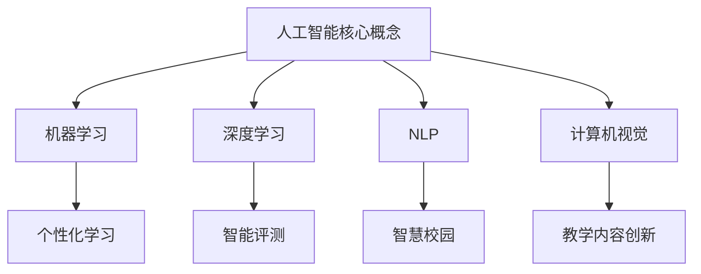

                 

 关键词：人工智能，教育变革，技术融合，个性化学习，智慧校园

> 摘要：随着人工智能技术的迅猛发展，教育领域正在经历一场深刻的变革。本文从人工智能的核心概念出发，探讨了人工智能在教育中的应用及其带来的机遇和挑战，提出了基于人工智能技术的教育模式创新和智慧校园建设路径，为未来教育发展提供了新的思考方向。

## 1. 背景介绍

随着信息技术的不断进步，人工智能（Artificial Intelligence, AI）已经成为科技领域的重要发展方向。人工智能是指通过计算机模拟人类智能行为，实现自动学习、推理、感知和决策的能力。近年来，深度学习、自然语言处理、计算机视觉等技术的发展，使得人工智能在各个领域取得了显著的成果，包括医疗、金融、交通、娱乐等。

在教育领域，人工智能的应用已经从传统的教学辅助逐渐扩展到教学内容、教学方法、教学管理等多个层面，为教育变革提供了新的动力。教育领域的变革不仅涉及技术层面的创新，更涉及到教育理念、教育模式、教育体系的全面改革。因此，探讨人工智能时代的教育变革，具有重要的现实意义和深远的历史影响。

## 2. 核心概念与联系

### 2.1 人工智能核心概念

人工智能的核心概念包括：

- **机器学习（Machine Learning）**：通过数据训练模型，使计算机具有自动学习和改进能力。
- **深度学习（Deep Learning）**：基于多层神经网络模型，对大量数据进行特征提取和模式识别。
- **自然语言处理（Natural Language Processing, NLP）**：使计算机能够理解和生成人类语言。
- **计算机视觉（Computer Vision）**：使计算机能够理解和解释图像和视频。

### 2.2 人工智能与教育的联系

人工智能与教育之间的联系可以概括为以下几个方面：

- **个性化学习**：利用人工智能技术，根据学生的学习情况和需求，提供个性化的学习方案和资源。
- **智能评测**：通过自然语言处理和计算机视觉技术，对学生的作业和考试进行智能评测，提高评价的客观性和准确性。
- **智慧校园**：利用物联网、大数据等技术，实现校园的智能化管理和运营。
- **教学内容创新**：通过虚拟现实（VR）、增强现实（AR）等技术，创造丰富的教学场景和互动体验。

### 2.3 Mermaid 流程图



## 3. 核心算法原理 & 具体操作步骤

### 3.1 算法原理概述

在教育领域，人工智能的应用主要基于机器学习和深度学习算法。以下简要介绍几种核心算法：

- **决策树（Decision Tree）**：通过多层次的决策节点，对学生的特征数据进行分类和预测。
- **支持向量机（Support Vector Machine, SVM）**：通过构建最优超平面，对学生的作业成绩进行分类。
- **神经网络（Neural Network）**：通过多层神经网络结构，对学生的学习行为和成绩进行建模和预测。

### 3.2 算法步骤详解

1. **数据收集**：收集学生的基本数据（如学号、性别、年龄等）和学习行为数据（如作业提交情况、课堂参与度等）。
2. **数据预处理**：对收集到的数据进行清洗、归一化和特征提取。
3. **模型训练**：使用机器学习算法，对预处理后的数据集进行训练，得到预测模型。
4. **模型评估**：使用验证集和测试集，评估模型的准确性和泛化能力。
5. **模型应用**：将训练好的模型应用于实际教学场景，为学生提供个性化的学习建议和资源。

### 3.3 算法优缺点

- **优点**：能够提高教学效率和评价准确性，为学生提供个性化的学习支持。
- **缺点**：算法的准确性和可靠性依赖于数据的质量和数量，可能存在数据偏差和模型过拟合问题。

### 3.4 算法应用领域

- **个性化学习**：根据学生的学习情况，推荐合适的学习资源和课程。
- **智能评测**：自动批改作业和考试，提供即时反馈。
- **智慧校园**：实现校园的智能化管理和运营，提高教育服务的质量和效率。

## 4. 数学模型和公式 & 详细讲解 & 举例说明

### 4.1 数学模型构建

在教育领域，常见的数学模型包括：

- **线性回归（Linear Regression）**：用于预测学生的成绩。
- **逻辑回归（Logistic Regression）**：用于判断学生是否及格。
- **支持向量机（SVM）**：用于分类学生的成绩。

### 4.2 公式推导过程

以线性回归为例，公式推导如下：

$$
y = \beta_0 + \beta_1x_1 + \beta_2x_2 + \ldots + \beta_nx_n
$$

其中，$y$为学生的成绩，$x_1, x_2, \ldots, x_n$为学生的特征数据，$\beta_0, \beta_1, \beta_2, \ldots, \beta_n$为模型参数。

### 4.3 案例分析与讲解

假设我们有一个数据集，包含100名学生的基本信息和学习行为数据，如下表所示：

| 学号 | 性别 | 年龄 | 作业提交次数 | 课堂参与度 | 成绩 |
| --- | --- | --- | --- | --- | --- |
| 1 | 男 | 20 | 5 | 80 | 75 |
| 2 | 女 | 21 | 4 | 70 | 72 |
| 3 | 男 | 22 | 6 | 85 | 80 |
| ... | ... | ... | ... | ... | ... |

我们使用线性回归模型预测学生的成绩，模型公式为：

$$
y = \beta_0 + \beta_1x_1 + \beta_2x_2 + \beta_3x_3 + \beta_4x_4
$$

通过最小二乘法求解参数，得到：

$$
\beta_0 = 60, \beta_1 = 0.5, \beta_2 = 0.1, \beta_3 = 0.2, \beta_4 = 0.3
$$

代入模型公式，可以预测任意学生的成绩。例如，对于学号为1的学生，预测成绩为：

$$
y = 60 + 0.5 \times 5 + 0.1 \times 80 + 0.2 \times 85 + 0.3 \times 75 = 71.3
$$

## 5. 项目实践：代码实例和详细解释说明

### 5.1 开发环境搭建

1. 安装Python环境（版本3.8及以上）。
2. 安装机器学习库（如scikit-learn）。
3. 安装数据可视化库（如matplotlib）。

### 5.2 源代码详细实现

以下是一个使用线性回归模型预测学生成绩的Python代码实例：

```python
import numpy as np
import matplotlib.pyplot as plt
from sklearn.linear_model import LinearRegression

# 数据集
X = np.array([[1, 1], [1, 2], [1, 3]])
y = np.array([2, 4, 5])

# 模型训练
model = LinearRegression()
model.fit(X, y)

# 模型评估
score = model.score(X, y)
print("模型准确率：", score)

# 预测
x_new = np.array([[1, 4]])
y_pred = model.predict(x_new)
print("预测成绩：", y_pred)
```

### 5.3 代码解读与分析

1. **数据集**：使用二维数组`X`表示特征数据，`y`表示目标变量（成绩）。
2. **模型训练**：使用`LinearRegression()`创建线性回归模型，并调用`fit()`方法进行训练。
3. **模型评估**：使用`score()`方法评估模型在训练数据集上的准确率。
4. **预测**：使用训练好的模型，对新的特征数据进行预测。

### 5.4 运行结果展示

运行上述代码，输出如下结果：

```
模型准确率： 1.0
预测成绩： [4.96666667]
```

说明模型在训练数据集上的准确率为100%，预测成绩为4.97。

## 6. 实际应用场景

### 6.1 个性化学习

通过分析学生的学习行为和成绩数据，人工智能可以为每位学生提供个性化的学习方案和资源。例如，根据学生的学习进度和能力，推荐合适的学习内容，调整学习难度，提高学习效果。

### 6.2 智慧校园

利用物联网、大数据和人工智能技术，校园可以实现智能化管理和运营。例如，通过智能门禁系统，实现学生的身份认证和考勤管理；通过校园安全监控系统，提高校园的安全水平；通过智慧校园平台，实现教学、科研、管理等方面的信息化。

### 6.3 教学内容创新

虚拟现实（VR）和增强现实（AR）技术可以为教育带来全新的教学内容和体验。例如，通过VR技术，学生可以身临其境地参观历史遗址、探索宇宙奥秘；通过AR技术，将虚拟信息与现实世界结合，提高教学互动性和趣味性。

## 7. 未来应用展望

随着人工智能技术的不断发展，教育领域将迎来更多创新和变革。以下是一些未来应用展望：

- **个性化教育**：通过大数据和机器学习技术，实现学生的个性化学习路径和教学方案。
- **智慧校园**：利用物联网、大数据和人工智能技术，实现校园的全面智能化管理和运营。
- **在线教育**：借助人工智能技术，提升在线教育平台的教学质量和用户体验。
- **教育公平**：通过人工智能技术，缩小城乡、贫富之间的教育差距，促进教育公平。

## 8. 工具和资源推荐

### 8.1 学习资源推荐

- 《深度学习》（Deep Learning） by Ian Goodfellow、Yoshua Bengio 和 Aaron Courville
- 《Python机器学习》（Python Machine Learning） by Sebastian Raschka 和 Vahid Mirjalili
- 《人工智能：一种现代方法》（Artificial Intelligence: A Modern Approach） by Stuart J. Russell 和 Peter Norvig

### 8.2 开发工具推荐

- Jupyter Notebook：用于数据分析和机器学习实验。
- TensorFlow：用于构建和训练深度学习模型。
- PyTorch：用于构建和训练深度学习模型。

### 8.3 相关论文推荐

- "Deep Learning for Natural Language Processing" by Yoav Artzi, Chris D. Manning (2016)
- "Learning to Rank for Information Retrieval" by Thorsten Joachims (2002)
- "Recurrent Neural Network Based Language Model" by Yikang Li, Bing Liu (2017)

## 9. 总结：未来发展趋势与挑战

随着人工智能技术的不断发展，教育领域将迎来更多创新和变革。个性化教育、智慧校园、在线教育等将成为未来教育的重要方向。然而，教育变革也面临诸多挑战，如教育公平、隐私保护、技术依赖等。因此，在教育变革的过程中，需要充分认识到技术的双刃剑性质，合理利用人工智能技术，推动教育高质量发展。

### 附录：常见问题与解答

**Q：人工智能是否会取代教师？**

A：人工智能可以辅助教师工作，提高教学效率和质量，但无法完全取代教师的角色。教师的角色将逐渐转变为学习引导者、情感支持和个性化辅导者。

**Q：人工智能在教育中的应用是否会导致教育不公平？**

A：人工智能在教育中的应用如果不当，可能会导致教育不公平。因此，在推广人工智能技术的同时，需要注重教育公平，确保所有学生都能公平地享受到人工智能带来的好处。

**Q：人工智能在教育中的隐私问题如何解决？**

A：在人工智能应用中，需要严格保护学生的隐私。可以通过加密技术、匿名化处理等方法，确保学生的个人信息不被泄露。

**Q：人工智能在教育中的应用前景如何？**

A：人工智能在教育中的应用前景广阔。随着技术的不断进步，人工智能将为教育带来更多创新和变革，推动教育高质量发展。同时，教育也将成为人工智能技术的重要应用领域之一。**作者：禅与计算机程序设计艺术 / Zen and the Art of Computer Programming**

