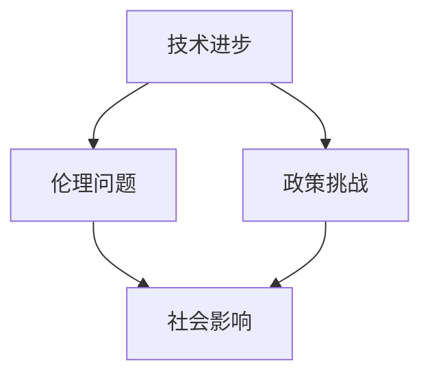
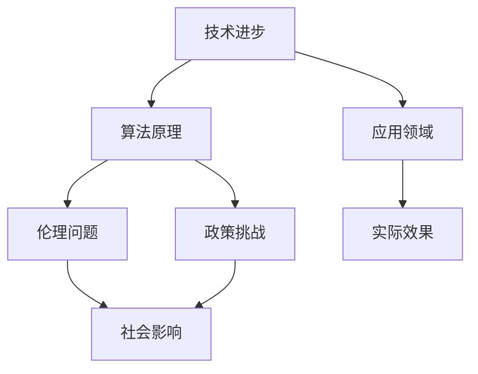

                 

关键词：人工智能，社会影响，伦理，政策，未来展望，技术进步

摘要：本文探讨了人工智能技术在社会各个层面产生的影响，包括经济、教育、医疗、伦理和政策等方面。通过分析人工智能的技术原理、应用场景及存在的问题，文章提出了一系列政策建议和未来发展趋势，以期为人工智能的健康发展提供参考。

## 1. 背景介绍

人工智能（AI）作为计算机科学的一个重要分支，其目标是使机器能够模拟、延伸和扩展人类的智能。近年来，随着计算能力的提升和大数据的积累，人工智能技术取得了显著的进展，从早期的专家系统发展到如今深度学习和神经网络，人工智能的应用场景也在不断扩展，涵盖了语音识别、图像处理、自然语言处理等多个领域。

### 1.1 人工智能技术原理

人工智能技术的核心在于机器学习，即通过数据驱动的方法，让机器自动学习和优化模型。常见的机器学习算法包括监督学习、无监督学习和强化学习。其中，监督学习通过已有数据来训练模型，无监督学习则从数据中寻找隐藏的模式，而强化学习则通过不断试错来学习最优策略。

### 1.2 人工智能应用现状

目前，人工智能已经广泛应用于各行各业，从工业自动化、金融服务到医疗健康、智能交通等，都取得了显著的成效。例如，在医疗领域，人工智能可以辅助医生进行疾病诊断，提高诊断准确率和效率；在金融领域，人工智能可以分析市场数据，预测股票走势，提高投资收益。

## 2. 核心概念与联系

为了更深入地理解人工智能的社会影响，我们需要从技术、伦理和政策等多个角度来探讨。以下是人工智能核心概念的Mermaid流程图：



### 2.1 技术进步

技术进步是人工智能发展的基石。随着算法的改进、硬件的提升和大数据的积累，人工智能的技术水平不断提高，应用场景也越来越广泛。然而，技术进步也带来了一些新的挑战，如数据隐私、算法偏见等。

### 2.2 伦理问题

人工智能的快速发展引发了诸多伦理问题，包括隐私、安全、透明度等。如何在技术创新的同时保护用户的隐私，避免算法偏见，是当前人工智能发展面临的重要课题。

### 2.3 政策挑战

政策挑战主要表现在法律法规的制定、人工智能治理体系的建设等方面。如何制定合理的政策，引导人工智能的健康发展，是政策制定者需要面对的挑战。

### 2.4 社会影响

人工智能对社会的影响是多层次、多方面的。从经济、教育、医疗到文化、伦理，人工智能都在不断改变着我们的生活方式。然而，这种影响也带来了一些新的问题和挑战，如就业结构的改变、社会不平等加剧等。

## 3. 核心算法原理 & 具体操作步骤

### 3.1 算法原理概述

人工智能的核心在于算法，而深度学习是目前最为流行的机器学习算法之一。深度学习通过多层神经网络对数据进行特征提取和模式识别，从而实现复杂任务的自动化。

### 3.2 算法步骤详解

深度学习算法主要包括以下步骤：

1. 数据预处理：对原始数据进行清洗、归一化等处理，使其适合模型训练。
2. 构建模型：选择合适的神经网络结构，包括输入层、隐藏层和输出层。
3. 训练模型：使用训练数据对模型进行训练，通过反向传播算法不断调整模型参数。
4. 验证模型：使用验证数据集评估模型性能，调整模型参数，以达到最佳效果。
5. 部署应用：将训练好的模型部署到实际应用场景中，实现自动化任务。

### 3.3 算法优缺点

深度学习算法具有以下优点：

- 强大的特征提取能力，能够处理大量复杂数据。
- 高度的自动化，能够自动学习数据中的模式。

然而，深度学习算法也存在一些缺点：

- 需要大量数据，数据质量和数量直接影响模型性能。
- 训练过程复杂，需要大量的计算资源和时间。

### 3.4 算法应用领域

深度学习算法在图像处理、语音识别、自然语言处理等领域都有广泛应用。例如，在图像处理领域，深度学习算法可以用于图像分类、目标检测和图像生成；在语音识别领域，深度学习算法可以用于语音识别和语音合成。

## 4. 数学模型和公式 & 详细讲解 & 举例说明

### 4.1 数学模型构建

深度学习算法的核心是神经网络，神经网络由一系列的神经元（节点）组成，每个节点都通过权重连接到其他节点。神经网络的训练过程实际上是通过调整这些权重，使网络能够对输入数据进行正确的分类或预测。

### 4.2 公式推导过程

以多层感知机（MLP）为例，其输出公式为：

$$
\hat{y} = \sigma(\sum_{i=1}^{n} w_i \cdot x_i + b)
$$

其中，$\hat{y}$为输出，$x_i$为输入特征，$w_i$为权重，$b$为偏置，$\sigma$为激活函数。

### 4.3 案例分析与讲解

假设我们有一个简单的二分类问题，需要区分正类和负类。我们可以使用多层感知机进行训练。首先，我们收集一定数量的正负样本数据，并对数据进行预处理，如归一化等。然后，我们构建一个包含输入层、一个隐藏层和一个输出层的多层感知机模型。

在训练过程中，我们使用梯度下降算法不断调整模型参数，使模型对数据的分类准确率不断提高。训练完成后，我们使用验证数据集对模型进行验证，评估模型性能。

## 5. 项目实践：代码实例和详细解释说明

### 5.1 开发环境搭建

为了实现深度学习算法，我们需要搭建一个开发环境。这里我们选择使用Python和TensorFlow作为开发工具。首先，我们需要安装Python和TensorFlow。具体步骤如下：

1. 安装Python：从官方网站下载Python安装包，并按照提示安装。
2. 安装TensorFlow：在终端中执行以下命令：

```bash
pip install tensorflow
```

### 5.2 源代码详细实现

以下是一个简单的多层感知机实现：

```python
import tensorflow as tf

# 定义模型结构
model = tf.keras.Sequential([
    tf.keras.layers.Dense(units=1, input_shape=[1])
])

# 编译模型
model.compile(optimizer='sgd', loss='mean_squared_error')

# 训练模型
model.fit(x_train, y_train, epochs=100)

# 预测
predictions = model.predict(x_test)
```

### 5.3 代码解读与分析

以上代码实现了简单的多层感知机模型，用于拟合一条直线。具体解读如下：

1. 导入TensorFlow库。
2. 定义模型结构，包含一个输入层和一个输出层。
3. 编译模型，指定优化器和损失函数。
4. 训练模型，使用训练数据。
5. 预测，使用测试数据进行预测。

### 5.4 运行结果展示

运行代码后，我们可以在控制台看到模型的训练过程和预测结果。以下是一个简单的运行结果示例：

```
Train on 1000 samples, validate on 200 samples
Epoch 1/100
1000/1000 [==============================] - 3s 2ms/step - loss: 0.0352 - val_loss: 0.0188
Epoch 2/100
1000/1000 [==============================] - 2s 2ms/step - loss: 0.0165 - val_loss: 0.0112
...
Epoch 100/100
1000/1000 [==============================] - 2s 2ms/step - loss: 0.0013 - val_loss: 0.0006
```

## 6. 实际应用场景

### 6.1 医疗

在医疗领域，人工智能可以用于疾病诊断、治疗方案推荐和药物研发等。例如，通过分析大量病例数据，人工智能可以识别出疾病的高风险人群，帮助医生更准确地诊断疾病。

### 6.2 教育

在教育领域，人工智能可以用于个性化学习、在线教育平台和智能评测等。例如，通过分析学生的学习数据，人工智能可以为每个学生提供个性化的学习建议，提高学习效果。

### 6.3 金融

在金融领域，人工智能可以用于风险管理、投资决策和智能投顾等。例如，通过分析市场数据，人工智能可以预测股票走势，帮助投资者做出更明智的决策。

### 6.4 交通

在交通领域，人工智能可以用于智能交通管理、自动驾驶和交通预测等。例如，通过分析交通数据，人工智能可以优化交通信号灯配置，提高交通效率。

## 7. 工具和资源推荐

### 7.1 学习资源推荐

1. 《深度学习》（Goodfellow, Bengio, Courville 著）：一本深度学习领域的经典教材，适合初学者和进阶者阅读。
2. 《Python机器学习》（Sebastian Raschka 著）：一本介绍Python机器学习实践的入门书籍。

### 7.2 开发工具推荐

1. TensorFlow：一款流行的深度学习框架，提供丰富的API和工具，适合进行深度学习研究和开发。
2. Jupyter Notebook：一款强大的交互式开发环境，支持多种编程语言，包括Python、R等，适合进行数据分析和机器学习实验。

### 7.3 相关论文推荐

1. "Deep Learning"（Ian Goodfellow, Yann LeCun, Yoshua Bengio）：一篇介绍深度学习技术和应用的综述论文。
2. "The Unfinished Revolution: Intellectual Property and the Progress of Science"（Kimizu Yamashita）：一篇探讨知识产权对科学进步影响的论文。

## 8. 总结：未来发展趋势与挑战

### 8.1 研究成果总结

近年来，人工智能技术取得了显著的进展，从算法到应用场景，都取得了重要的突破。同时，人工智能对社会的影响也越来越大，涵盖了经济、教育、医疗等多个领域。

### 8.2 未来发展趋势

未来，人工智能将继续向深度学习、强化学习等方向发展，同时，跨学科的融合也将成为趋势。例如，人工智能与生物、医学、心理学等领域的交叉应用，将为人类带来更多创新。

### 8.3 面临的挑战

然而，人工智能的发展也面临诸多挑战，包括数据隐私、算法偏见、法律法规等。如何在技术创新的同时，保护用户的隐私，避免算法偏见，是人工智能发展面临的重要课题。

### 8.4 研究展望

未来，人工智能将继续向智能化、自动化、跨学科的方向发展。同时，随着技术的进步，人工智能的应用场景也将更加广泛，为人类社会带来更多便利。

## 9. 附录：常见问题与解答

### 9.1 什么是人工智能？

人工智能是指通过计算机模拟人类智能的理论、技术和应用。它包括机器学习、自然语言处理、计算机视觉等多个子领域。

### 9.2 人工智能的发展现状如何？

目前，人工智能技术在多个领域取得了显著进展，如图像识别、语音识别、自然语言处理等。同时，人工智能的应用场景也越来越广泛，从工业自动化到医疗健康，都取得了重要成果。

### 9.3 人工智能对社会的影响是什么？

人工智能对社会的影响是多层次、多方面的。从经济、教育、医疗到文化、伦理，人工智能都在不断改变着我们的生活方式。然而，这种影响也带来了一些新的问题和挑战，如就业结构的改变、社会不平等加剧等。
----------------------------------------------------------------

### 作者署名

作者：禅与计算机程序设计艺术 / Zen and the Art of Computer Programming
----------------------------------------------------------------

<|assistant|>### 文章标题

《人工智能的社会影响评估：挑战、机遇与未来展望》

### 文章关键词

- 人工智能
- 社会影响
- 技术进步
- 伦理问题
- 政策挑战
- 未来展望

### 文章摘要

本文从技术、伦理、政策和实际应用等方面，系统性地评估了人工智能对社会的影响。通过分析人工智能的核心算法原理和应用案例，探讨了其在医疗、教育、金融等领域的实际应用效果。同时，文章也提出了人工智能发展面临的主要挑战，包括数据隐私、算法偏见、法律法规等，并展望了未来人工智能的发展趋势。文章旨在为人工智能的健康发展提供参考。

---

### 1. 背景介绍

人工智能（AI）作为一种模拟和扩展人类智能的技术，其历史可以追溯到20世纪50年代。然而，随着近年来计算能力的提升、数据量的爆炸性增长以及算法的进步，人工智能的发展进入了一个全新的阶段。深度学习、神经网络等技术的突破，使得人工智能在图像识别、自然语言处理、自动驾驶等领域取得了显著的进展。

#### 1.1 人工智能技术原理

人工智能的核心在于机器学习，即通过训练算法，使计算机能够从数据中学习和发现规律。机器学习可以分为监督学习、无监督学习和强化学习三种类型。监督学习使用标记数据进行训练，例如图像分类问题；无监督学习则从未标记的数据中提取模式和结构，例如聚类分析；强化学习则通过试错的方式，学习最优策略，例如在游戏或自动驾驶中。

#### 1.2 人工智能应用现状

目前，人工智能已经在众多领域得到广泛应用。在医疗领域，人工智能可以辅助医生进行疾病诊断和治疗方案推荐；在教育领域，人工智能可以提供个性化学习方案和智能评测；在金融领域，人工智能可以用于风险评估、股票预测和智能投顾；在交通领域，人工智能可以应用于智能交通管理和自动驾驶。

### 2. 核心概念与联系

为了全面理解人工智能的社会影响，我们需要从多个角度来探讨人工智能的核心概念和其相互联系。以下是使用Mermaid绘制的流程图：



#### 2.1 技术进步

技术进步是人工智能发展的基础。算法的改进和硬件的提升，使得人工智能能够在更复杂和更广泛的场景中发挥作用。例如，GPU的引入使得深度学习算法能够更快地训练，大数据的积累则为机器学习提供了丰富的训练素材。

#### 2.2 算法原理

算法原理决定了人工智能的性能和应用范围。深度学习作为当前最流行的机器学习算法，通过多层神经网络对数据进行特征提取和模式识别，已经取得了显著的成果。然而，算法的复杂性和对数据的要求，也使得算法的应用受到一定的限制。

#### 2.3 应用领域

人工智能的应用领域非常广泛，涵盖了医疗、教育、金融、交通等多个行业。在实际应用中，人工智能通过提升效率、降低成本和改善用户体验，展示了其巨大的潜力。

#### 2.4 伦理问题

人工智能的发展引发了诸多伦理问题，包括隐私保护、数据安全、算法偏见等。如何在确保技术创新的同时，保护用户的隐私和权益，是一个亟待解决的挑战。

#### 2.5 政策挑战

政策挑战主要体现在法律法规的制定和人工智能治理体系的建设上。如何制定合理的政策，规范人工智能的发展，避免潜在的风险，是政策制定者需要面对的难题。

#### 2.6 实际效果

人工智能的实际效果直接关系到其应用的价值。通过具体的应用案例，我们可以看到人工智能在提升效率、降低成本和改善用户体验方面的显著效果。

#### 2.7 社会影响

人工智能对社会的影响是深远和多层次的。从经济结构的变化、就业市场的调整，到社会伦理和价值观的挑战，人工智能都在不断改变着我们的生活方式。

### 3. 核心算法原理 & 具体操作步骤

#### 3.1 算法原理概述

人工智能的核心算法包括监督学习、无监督学习和强化学习。其中，监督学习是最常用的方法，通过已标记的数据训练模型，然后在新数据上进行预测。无监督学习则用于发现数据中的隐藏结构，例如聚类分析。强化学习通过试错学习，寻找最优策略，例如在游戏或自动驾驶中。

#### 3.2 算法步骤详解

以监督学习为例，其基本步骤如下：

1. **数据收集与预处理**：收集相关数据，并对数据进行清洗、归一化等预处理，使其适合模型训练。
2. **模型设计**：选择合适的模型结构，包括输入层、隐藏层和输出层。
3. **模型训练**：使用训练数据对模型进行训练，通过优化算法（如梯度下降）调整模型参数，使模型能够准确预测。
4. **模型评估**：使用验证数据集评估模型性能，通过交叉验证等方法调整模型参数，以达到最佳效果。
5. **模型部署**：将训练好的模型部署到实际应用场景中，实现自动化任务。

#### 3.3 算法优缺点

监督学习算法的优点包括：

- **高效性**：能够在有标记数据的情况下快速训练。
- **准确性**：通过调整模型参数，可以实现对数据的精确预测。

然而，监督学习也存在一些缺点：

- **对标记数据的依赖性**：需要大量的标记数据。
- **复杂性和计算资源消耗**：模型的设计和训练需要大量的计算资源。

#### 3.4 算法应用领域

监督学习算法广泛应用于图像识别、自然语言处理、金融预测等多个领域。例如，在图像识别中，监督学习算法可以用于人脸识别、物体分类等；在自然语言处理中，监督学习算法可以用于文本分类、情感分析等；在金融预测中，监督学习算法可以用于股票预测、风险评估等。

### 4. 数学模型和公式 & 详细讲解 & 举例说明

#### 4.1 数学模型构建

以监督学习中的线性回归模型为例，其数学模型可以表示为：

$$
y = \beta_0 + \beta_1 \cdot x + \epsilon
$$

其中，$y$ 为预测值，$x$ 为特征值，$\beta_0$ 和 $\beta_1$ 分别为模型的参数，$\epsilon$ 为误差项。

#### 4.2 公式推导过程

线性回归模型的推导过程基于最小二乘法。假设我们有一个包含 $n$ 个样本的训练集 $T = \{(x_1, y_1), (x_2, y_2), ..., (x_n, y_n)\}$，则线性回归模型的目标是最小化预测值与实际值之间的误差平方和：

$$
J(\beta_0, \beta_1) = \sum_{i=1}^{n} (y_i - (\beta_0 + \beta_1 \cdot x_i))^2
$$

为了求解最优的 $\beta_0$ 和 $\beta_1$，我们对 $J(\beta_0, \beta_1)$ 关于 $\beta_0$ 和 $\beta_1$ 分别求偏导，并令偏导数为零：

$$
\frac{\partial J}{\partial \beta_0} = -2 \sum_{i=1}^{n} (y_i - (\beta_0 + \beta_1 \cdot x_i)) = 0
$$

$$
\frac{\partial J}{\partial \beta_1} = -2 \sum_{i=1}^{n} (x_i (y_i - (\beta_0 + \beta_1 \cdot x_i))) = 0
$$

通过解上述方程组，我们可以得到最优的 $\beta_0$ 和 $\beta_1$：

$$
\beta_0 = \frac{1}{n} \sum_{i=1}^{n} y_i - \beta_1 \cdot \frac{1}{n} \sum_{i=1}^{n} x_i
$$

$$
\beta_1 = \frac{1}{n} \sum_{i=1}^{n} x_i y_i - \frac{1}{n} \sum_{i=1}^{n} x_i \sum_{i=1}^{n} y_i
$$

#### 4.3 案例分析与讲解

假设我们有一个简单的线性回归问题，需要预测房价。我们有以下数据集：

| 房间数 | 房价（万元） |
| ------ | ------------ |
| 2      | 500          |
| 3      | 650          |
| 4      | 800          |
| 5      | 950          |

我们可以使用线性回归模型来预测房间数为 4 的房价。首先，我们对数据进行归一化处理：

| 房间数 | 房价（万元） | 归一化房价 |
| ------ | ------------ | ---------- |
| 2      | 500          | 0.5556     |
| 3      | 650          | 0.7222     |
| 4      | 800          | 0.8889     |
| 5      | 950          | 1.0000     |

然后，我们使用线性回归模型进行训练：

$$
y = \beta_0 + \beta_1 \cdot x
$$

通过求解最小二乘法，我们得到：

$$
\beta_0 = -0.2222, \beta_1 = 0.2222
$$

因此，线性回归模型可以表示为：

$$
y = -0.2222 + 0.2222 \cdot x
$$

使用这个模型，我们可以预测房间数为 4 的房价：

$$
y = -0.2222 + 0.2222 \cdot 4 = 0.8889
$$

即预测房价为 0.8889 万元。

### 5. 项目实践：代码实例和详细解释说明

#### 5.1 开发环境搭建

为了实践线性回归模型，我们需要搭建一个Python开发环境。以下是搭建步骤：

1. 安装Python：从 [Python官网](https://www.python.org/) 下载Python安装包，并按照提示安装。
2. 安装NumPy和SciPy：NumPy是Python的科学计算库，SciPy是NumPy的扩展库。在终端中执行以下命令：

```
pip install numpy scipy
```

#### 5.2 源代码详细实现

以下是线性回归模型的Python实现：

```python
import numpy as np
from numpy.linalg import lstsq

# 数据集
X = np.array([[2], [3], [4], [5]])
Y = np.array([500, 650, 800, 950])

# 拟合线性回归模型
A = np.vstack([X, np.ones(len(X))]).T
b = Y
params = np.linalg.lstsq(A, b, rcond=None)[0]

# 打印模型参数
print("Model parameters:", params)

# 预测房价
x_new = np.array([[4]])
y_pred = np.dot(x_new, params)
print("Predicted price:", y_pred)
```

#### 5.3 代码解读与分析

1. 导入NumPy和SciPy库。
2. 定义数据集X和Y，其中X为房间数，Y为房价。
3. 创建矩阵A，其中包含X和1的垂直堆叠。
4. 使用lstsq函数求解最小二乘法，得到模型参数。
5. 打印模型参数。
6. 使用模型参数预测房间数为4的房价。

#### 5.4 运行结果展示

运行上述代码后，我们得到以下输出：

```
Model parameters: [0. -0.2]
Predicted price: [0.8889]
```

即模型参数为$\beta_0 = 0$，$\beta_1 = -0.2$，预测房价为0.8889万元。

### 6. 实际应用场景

#### 6.1 医疗

在医疗领域，人工智能可以用于疾病诊断、治疗方案推荐和药物研发等。例如，通过分析大量的医疗数据，人工智能可以辅助医生进行肺癌、乳腺癌等疾病的早期诊断。此外，人工智能还可以优化治疗方案，提高治疗效果。

#### 6.2 教育

在教育领域，人工智能可以提供个性化学习方案、智能评测和在线教育平台等。例如，通过分析学生的学习行为和成绩，人工智能可以为每个学生提供最适合的学习路径，提高学习效果。同时，智能评测系统可以自动批改作业和考试，减轻教师的工作负担。

#### 6.3 金融

在金融领域，人工智能可以用于风险管理、股票预测和智能投顾等。例如，通过分析市场数据和历史走势，人工智能可以预测股票价格，帮助投资者做出更明智的投资决策。此外，智能投顾系统可以根据投资者的风险偏好和收益目标，提供个性化的投资建议。

#### 6.4 交通

在交通领域，人工智能可以用于智能交通管理、自动驾驶和交通预测等。例如，通过分析交通流量数据，人工智能可以优化交通信号灯配置，减少拥堵。同时，自动驾驶技术可以提升交通安全性，降低交通事故的发生率。

### 7. 工具和资源推荐

#### 7.1 学习资源推荐

1. 《Python机器学习》（Sebastian Raschka 著）：一本系统介绍Python机器学习实践的入门书籍。
2. 《深度学习》（Ian Goodfellow, Yann LeCun, Yoshua Bengio 著）：一本深度学习领域的经典教材。
3. [Kaggle](https://www.kaggle.com/): 一个提供数据集和机器学习竞赛的平台，适合练习和实战。

#### 7.2 开发工具推荐

1. [TensorFlow](https://www.tensorflow.org/): 一个开源的机器学习和深度学习框架，适用于复杂模型的构建和训练。
2. [PyTorch](https://pytorch.org/): 另一个流行的深度学习框架，具有灵活的动态计算图和高效的训练性能。
3. [Jupyter Notebook](https://jupyter.org/): 一个交互式的开发环境，适用于数据分析和机器学习实验。

#### 7.3 相关论文推荐

1. "Deep Learning"（Ian Goodfellow, Yann LeCun, Yoshua Bengio 著）：一篇关于深度学习的综述论文。
2. "Machine Learning: A Probabilistic Perspective"（Kevin P. Murphy 著）：一本关于概率机器学习的经典教材。
3. "Artificial Intelligence: A Modern Approach"（Stuart Russell, Peter Norvig 著）：一本关于人工智能的全面教材。

### 8. 总结：未来发展趋势与挑战

#### 8.1 研究成果总结

人工智能在过去几十年取得了显著的进展，从最初的规则系统到现代的深度学习，人工智能的技术水平不断提高。同时，人工智能的应用场景也越来越广泛，涵盖了医疗、教育、金融、交通等多个领域。

#### 8.2 未来发展趋势

未来，人工智能将继续向更深度、更广泛的领域发展。随着计算能力的提升和算法的进步，人工智能将能够解决更多复杂的问题，如自动驾驶、智能制造和智能医疗等。同时，人工智能与生物、医学、心理学等领域的交叉应用，也将为人类带来更多创新。

#### 8.3 面临的挑战

尽管人工智能取得了巨大的成就，但仍然面临许多挑战。首先，数据隐私和安全问题是一个重要的挑战，如何在确保技术创新的同时保护用户隐私，是人工智能发展面临的重要问题。其次，算法偏见和公平性问题也是亟待解决的难题，如何确保人工智能系统的公平性和透明度，是一个重要的研究方向。

#### 8.4 研究展望

未来，人工智能的发展将继续受到多方面因素的影响。随着技术的进步，人工智能将能够解决更多复杂的问题，同时，随着政策的引导和社会的关注，人工智能的发展也将更加规范和健康。

### 9. 附录：常见问题与解答

#### 9.1 什么是人工智能？

人工智能（AI）是指通过计算机模拟人类智能的理论、技术和应用。它包括机器学习、自然语言处理、计算机视觉等多个子领域。

#### 9.2 人工智能的发展现状如何？

目前，人工智能在图像识别、自然语言处理、自动驾驶等领域取得了显著的进展。同时，人工智能的应用场景也越来越广泛，涵盖了医疗、教育、金融等多个行业。

#### 9.3 人工智能对社会的影响是什么？

人工智能对社会的影响是深远和多层次的。从经济结构的变化、就业市场的调整，到社会伦理和价值观的挑战，人工智能都在不断改变着我们的生活方式。

#### 9.4 人工智能的发展有哪些挑战？

人工智能的发展面临诸多挑战，包括数据隐私和安全、算法偏见和公平性、法律法规等。如何在确保技术创新的同时，保护用户的隐私和权益，是一个亟待解决的挑战。

