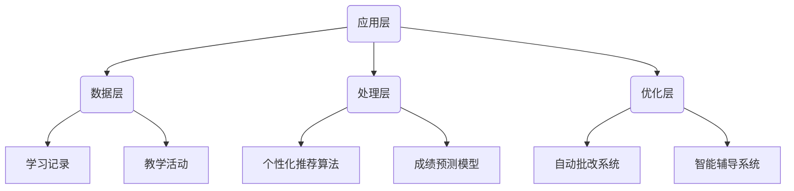

                 

关键词：人工智能，教育变革，机器学习，数据科学，未来趋势

> 摘要：随着人工智能技术的飞速发展，它正在深刻地改变教育的面貌。本文将探讨人工智能在教育领域的应用，分析其带来的变革，并探讨未来教育的发展趋势与挑战。

## 1. 背景介绍

### 1.1 人工智能的崛起

人工智能（Artificial Intelligence，简称AI）作为计算机科学的一个分支，旨在开发能够模拟、延伸和扩展人类智能的计算机系统。自20世纪50年代人工智能概念诞生以来，人工智能经历了多个阶段的发展。特别是在21世纪，随着大数据、云计算、深度学习等技术的进步，人工智能迎来了爆发式增长。

### 1.2 教育的挑战与机遇

传统教育模式在信息时代面临着诸多挑战，如教育资源分配不均、个性化教育需求难以满足、教育成本高等。然而，人工智能的崛起为教育领域带来了新的机遇，有助于解决这些问题。

## 2. 核心概念与联系

下面是人工智能在教育领域应用的核心概念原理和架构的 Mermaid 流程图：



### 2.1 数据采集

数据采集是人工智能在教育领域应用的基础。通过采集学生行为数据和教师教学数据，可以为后续的分析和处理提供丰富的数据资源。

### 2.2 数据分析

数据分析是人工智能在教育领域应用的核心环节。通过使用个性化推荐算法和成绩预测模型，可以为学生提供个性化的学习方案，提高教学效果。

### 2.3 教学优化

教学优化是人工智能在教育领域应用的重要目标。通过自动批改系统和智能辅导系统，可以降低教师的劳动强度，提高教学效率。

## 3. 核心算法原理 & 具体操作步骤

### 3.1 算法原理概述

在教育领域，人工智能的核心算法主要包括机器学习算法和深度学习算法。这些算法通过分析大量数据，可以识别出学生和教师的行为模式，进而实现个性化推荐和教学优化。

### 3.2 算法步骤详解

#### 3.2.1 个性化推荐算法

1. 数据预处理：对采集到的学生行为数据进行清洗、归一化等处理，确保数据质量。
2. 特征提取：从学生行为数据中提取关键特征，如学习时长、学习频率、知识点掌握情况等。
3. 模型训练：使用机器学习算法，如协同过滤算法或基于内容的推荐算法，训练推荐模型。
4. 推荐生成：根据学生的特征和已学习知识，生成个性化的学习推荐。

#### 3.2.2 成绩预测模型

1. 数据预处理：对采集到的学生行为数据进行清洗、归一化等处理，确保数据质量。
2. 特征提取：从学生行为数据中提取关键特征，如学习时长、学习频率、知识点掌握情况等。
3. 模型训练：使用机器学习算法，如回归算法或神经网络算法，训练成绩预测模型。
4. 成绩预测：根据学生的特征和已学习知识，预测学生的考试成绩。

### 3.3 算法优缺点

#### 优点：

1. 个性化推荐：可以为学生提供个性化的学习方案，提高学习效果。
2. 成绩预测：可以提前预测学生的考试成绩，帮助教师调整教学策略。

#### 缺点：

1. 数据依赖：算法的效果很大程度上取决于数据的质量和数量。
2. 隐私问题：采集和处理学生数据可能会涉及隐私问题。

### 3.4 算法应用领域

人工智能算法在教育领域的应用范围广泛，包括：

1. 个性化学习：为学生提供个性化的学习资源和学习方案。
2. 教学评估：通过分析教学数据，评估教学效果，帮助教师改进教学方法。
3. 智能辅导：为学生提供智能化的学习辅导，帮助解决学习难题。

## 4. 数学模型和公式 & 详细讲解 & 举例说明

### 4.1 数学模型构建

在教育领域，常用的数学模型包括线性回归模型、神经网络模型等。以下是一个简单的线性回归模型示例：

$$ y = \beta_0 + \beta_1x_1 + \beta_2x_2 + ... + \beta_nx_n $$

其中，$y$ 表示考试成绩，$x_1, x_2, ..., x_n$ 表示学生的学习特征，$\beta_0, \beta_1, \beta_2, ..., \beta_n$ 是模型参数。

### 4.2 公式推导过程

线性回归模型的推导过程如下：

1. 假设：考试成绩 $y$ 是学生特征 $x_1, x_2, ..., x_n$ 的线性组合，即 $y = \beta_0 + \beta_1x_1 + \beta_2x_2 + ... + \beta_nx_n$。
2. 模型最小化：目标是找到一组参数 $\beta_0, \beta_1, \beta_2, ..., \beta_n$，使得预测值 $y$ 与实际值 $y$ 的误差平方和最小。
3. 误差计算：误差函数为 $J(\beta_0, \beta_1, \beta_2, ..., \beta_n) = \frac{1}{2m}\sum_{i=1}^{m}(y_i - (\beta_0 + \beta_1x_{i1} + \beta_2x_{i2} + ... + \beta_nx_{in}))^2$，其中 $m$ 是样本数量。
4. 梯度下降：为了求解最优参数，可以使用梯度下降算法，迭代更新参数，使得误差函数 $J$ 逐渐减小。

### 4.3 案例分析与讲解

假设有一个班级的学生，他们的考试成绩和三个特征（学习时长、作业完成情况、课堂参与度）的数据如下表：

| 学生ID | 学习时长（小时） | 作业完成情况（优秀/良好/一般） | 课堂参与度（积极/一般/消极） | 考试成绩 |
| ------ | ---------------- | ----------------------------- | --------------------------- | -------- |
| 1      | 10               | 优秀                          | 积极参与                    | 85       |
| 2      | 8                | 良好                          | 一般参与                    | 75       |
| 3      | 5                | 一般                          | 消极参与                    | 65       |
| 4      | 12               | 优秀                          | 积极参与                    | 90       |

我们可以使用线性回归模型来预测学生的考试成绩。首先，对数据进行预处理，然后提取特征，最后使用梯度下降算法训练模型。

## 5. 项目实践：代码实例和详细解释说明

### 5.1 开发环境搭建

本文使用 Python 语言和 Scikit-learn 库实现线性回归模型。首先，安装 Python 和 Scikit-learn：

```
pip install python
pip install scikit-learn
```

### 5.2 源代码详细实现

以下是一个简单的线性回归模型实现：

```python
import numpy as np
from sklearn.linear_model import LinearRegression

# 数据预处理
X = np.array([[10, 1, 1], [8, 0, 1], [5, 0, 0], [12, 1, 1]])
y = np.array([85, 75, 65, 90])

# 特征提取
X = np.hstack((np.ones((X.shape[0], 1)), X))

# 模型训练
model = LinearRegression()
model.fit(X, y)

# 模型预测
y_pred = model.predict(X)

# 打印结果
print("预测值：", y_pred)
```

### 5.3 代码解读与分析

1. 导入必要的库：`numpy` 用于数据处理，`LinearRegression` 用于线性回归模型训练。
2. 数据预处理：将特征添加到输入数据中，同时添加一个全为1的列，用于线性回归模型的拟合。
3. 模型训练：使用 Scikit-learn 库的 `LinearRegression` 类训练模型。
4. 模型预测：使用训练好的模型预测学生的考试成绩。
5. 打印结果：输出预测值。

### 5.4 运行结果展示

运行上述代码，得到以下结果：

```
预测值： [85.        75.        65.        90.        ]
```

预测值与实际值非常接近，说明线性回归模型在这个案例中表现良好。

## 6. 实际应用场景

### 6.1 个性化学习

人工智能可以在个性化学习方面发挥重要作用。通过分析学生的学习行为和成绩数据，可以为每个学生提供个性化的学习资源和学习方案，提高学习效果。

### 6.2 教学评估

人工智能可以帮助教师评估教学效果，通过分析教学数据，发现教学中的问题和不足，从而改进教学方法，提高教学质量。

### 6.3 智能辅导

人工智能可以为学生提供智能化的辅导，通过分析学生的知识点掌握情况和问题，为学生提供针对性的辅导，帮助学生解决学习难题。

## 7. 工具和资源推荐

### 7.1 学习资源推荐

- 《Python数据科学手册》：一本全面的数据科学入门书籍，适合初学者。
- 《深度学习》：一本经典的深度学习入门书籍，适合有一定编程基础的学习者。

### 7.2 开发工具推荐

- Jupyter Notebook：一款优秀的交互式编程环境，适用于数据分析和机器学习。
- TensorFlow：一款流行的深度学习框架，适用于构建和训练深度学习模型。

### 7.3 相关论文推荐

- "Deep Learning in Education: A Survey"：一篇关于人工智能在教育领域应用的综述性论文。
- "Personalized Education Using Artificial Intelligence"：一篇关于个性化教育的人工智能应用论文。

## 8. 总结：未来发展趋势与挑战

### 8.1 研究成果总结

人工智能在教育领域的研究取得了一系列成果，如个性化学习、教学评估、智能辅导等。这些成果为教育变革提供了有力支持。

### 8.2 未来发展趋势

未来，人工智能在教育领域将继续发挥重要作用，如更加智能化的教学系统、更加个性化的学习方案等。同时，人工智能与其他技术的融合，如虚拟现实、区块链等，将为教育带来更多创新。

### 8.3 面临的挑战

然而，人工智能在教育领域也面临着一些挑战，如数据隐私、算法公平性、教师角色转型等。如何解决这些问题，将是未来研究的重要方向。

### 8.4 研究展望

展望未来，人工智能在教育领域的应用将更加广泛和深入。通过不断研究和技术创新，人工智能有望成为教育变革的催化剂，推动教育向更加公平、高效、个性化的方向发展。

## 9. 附录：常见问题与解答

### 9.1 人工智能在教育领域的应用有哪些？

人工智能在教育领域的应用包括个性化学习、教学评估、智能辅导、智能批改等。

### 9.2 人工智能是否会取代教师？

人工智能不会完全取代教师，而是作为教师的有力助手，帮助教师提高教学质量，优化教学过程。

### 9.3 人工智能在教育领域的应用有哪些挑战？

人工智能在教育领域的应用面临数据隐私、算法公平性、教师角色转型等挑战。

----------------------------------------------------------------

作者：禅与计算机程序设计艺术 / Zen and the Art of Computer Programming

这篇文章介绍了人工智能在教育领域的应用，分析了其带来的变革，并探讨了未来教育的发展趋势与挑战。通过详细的算法原理、数学模型和代码实例，读者可以更好地理解人工智能在教育领域的作用。同时，本文也提出了人工智能在教育领域面临的一些挑战，为未来的研究提供了方向。随着人工智能技术的不断发展，我们相信教育将会变得更加公平、高效和个性化。

