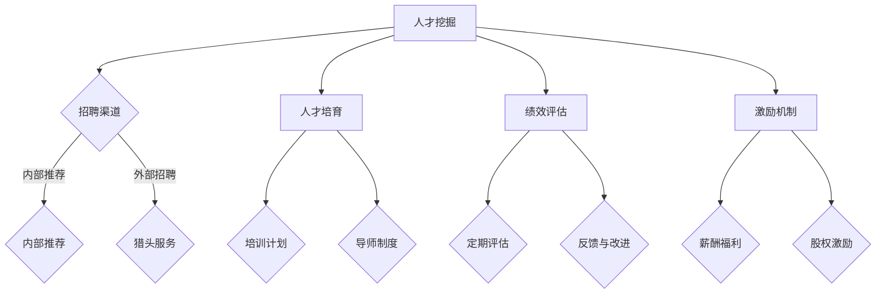

                 

关键词：人才管理、顶尖人才、吸引力、留住策略、IT行业、人才挖掘、人才培育、绩效评估、企业文化

## 摘要

在当今全球化和技术高速发展的时代，企业竞争的核心在于人才竞争。本文将深入探讨如何通过有效的人才管理策略，吸引并留住顶尖人才。文章从背景介绍、核心概念与联系、核心算法原理、数学模型与公式、项目实践、实际应用场景以及未来应用展望等多个维度，全面解析人才管理的各个方面。希望通过本文，能为企业和组织提供实用的指导和参考。

## 1. 背景介绍

随着信息技术的迅猛发展，企业对技术人才的需求日益增长。特别是在IT行业，顶尖人才是企业核心竞争力的重要组成部分。然而，如何吸引和留住这些稀缺资源，成为企业面临的一大挑战。人才管理的重要性日益凸显，这不仅关乎企业的短期利益，更影响其长远发展。

### 1.1 当前人才市场状况

根据多项调研数据显示，全球范围内技术人才短缺现象日益严重。尤其是在人工智能、大数据、云计算等前沿技术领域，顶尖人才的供需矛盾尤为突出。此外，全球化带来的文化差异和地缘政治因素，也加剧了人才竞争的激烈程度。

### 1.2 企业面临的挑战

企业在吸引和留住顶尖人才方面面临以下几大挑战：

- **高竞争压力**：同行业及跨行业的企业都在争夺同样稀缺的人才资源。
- **薪酬福利问题**：薪酬和福利水平是人才考虑的重要因素，企业需要具备竞争力。
- **职业发展机会**：人才渴望在职业发展上有更多的成长空间和晋升机会。
- **企业文化**：企业文化是影响人才留存的重要因素，包括团队氛围、管理风格等。

## 2. 核心概念与联系

在人才管理中，以下核心概念与联系至关重要：

### 2.1 人才管理的基本概念

- **人才挖掘**：通过招聘、校园招聘、猎头等渠道，寻找适合企业需求的顶尖人才。
- **人才培育**：通过培训、导师制、项目锻炼等方式，提升人才的专业能力和综合素质。
- **绩效评估**：通过定期评估，了解人才的绩效表现，为职业发展提供参考。
- **激励机制**：通过薪酬、福利、股权等激励措施，激发人才的积极性和创造力。

### 2.2 人才管理与企业文化的联系

- **共同价值观**：企业文化和价值观是吸引和留住人才的关键因素。
- **沟通与协作**：良好的企业文化促进员工之间的沟通与协作，提升团队整体效率。
- **员工满意度**：企业文化的健康度直接影响员工的满意度和留存率。

### 2.3 核心概念原理架构的 Mermaid 流程图



## 3. 核心算法原理 & 具体操作步骤

### 3.1 算法原理概述

人才管理中的核心算法可概括为以下几个步骤：

1. **人才需求分析**：明确企业的人才需求，包括岗位需求、技能需求等。
2. **人才筛选与评估**：通过简历筛选、面试等手段，评估候选人的综合素质。
3. **人才培育与提升**：根据绩效评估结果，制定个性化的培训和发展计划。
4. **绩效评估与激励**：定期对员工进行绩效评估，提供相应的激励措施。

### 3.2 算法步骤详解

#### 3.2.1 人才需求分析

- **需求识别**：通过业务部门的需求调研，明确人才需求的岗位和技能要求。
- **数据分析**：利用数据分析工具，分析现有员工的结构和能力，发现人才缺口。
- **预测模型**：通过预测模型，预测企业未来的人才需求，提前布局。

#### 3.2.2 人才筛选与评估

- **简历筛选**：使用自然语言处理技术，对简历进行关键词匹配，筛选出符合条件的候选人。
- **面试评估**：通过结构化面试、行为面试、情景模拟等多种面试形式，评估候选人的综合素质。
- **背景调查**：对候选人进行背景调查，核实其教育背景、工作经历等信息。

#### 3.2.3 人才培育与提升

- **培训计划**：根据员工的能力和岗位需求，制定个性化的培训计划。
- **导师制度**：为新人配备经验丰富的导师，指导其职业发展。
- **项目锻炼**：通过参与关键项目，提升员工的实际操作能力和问题解决能力。

#### 3.2.4 绩效评估与激励

- **KPI设定**：设定明确的绩效指标，对员工的工作进行量化评估。
- **定期评估**：定期对员工进行绩效评估，提供反馈和改进建议。
- **激励措施**：根据绩效结果，提供相应的薪酬调整、职位晋升、股权激励等。

### 3.3 算法优缺点

#### 优点

- **高效性**：通过算法自动化处理，提高人才筛选和评估的效率。
- **客观性**：基于数据和模型，减少主观因素的影响，提高评估的准确性。
- **灵活性**：可根据实际情况，灵活调整算法参数和评估标准。

#### 缺点

- **数据依赖性**：算法效果依赖于数据的质量和完整性，数据不足或错误可能导致评估结果偏差。
- **适应性**：不同行业和企业的人才需求差异较大，算法需要根据实际情况进行调整。

### 3.4 算法应用领域

- **人力资源领域**：企业招聘、绩效评估、人才盘点等。
- **教育培训领域**：人才选拔、课程设计、个性化学习等。
- **医疗健康领域**：医疗人才评估、疾病预测等。

## 4. 数学模型和公式 & 详细讲解 & 举例说明

### 4.1 数学模型构建

在人才管理中，常用的数学模型包括：

1. **线性回归模型**：用于预测人才需求。
2. **逻辑回归模型**：用于评估候选人的胜任度。
3. **决策树模型**：用于决策人才的培养和发展路径。

### 4.2 公式推导过程

#### 4.2.1 线性回归模型

- **模型公式**：y = b0 + b1 * x
- **参数估计**：b0、b1 为参数，通过最小二乘法进行估计。

#### 4.2.2 逻辑回归模型

- **模型公式**：P = 1 / (1 + e^(-z))
- **参数估计**：z = β0 + β1 * x
- **参数估计**：β0、β1 为参数，通过最大似然估计进行估计。

#### 4.2.3 决策树模型

- **模型公式**：根据特征值的划分，构建树状模型。
- **剪枝策略**：利用信息增益、基尼指数等指标，选择最佳剪枝点。

### 4.3 案例分析与讲解

#### 4.3.1 线性回归模型在人才需求预测中的应用

- **数据准备**：收集过去几年的招聘数据，包括人才需求量和相关影响因素。
- **模型构建**：使用线性回归模型，建立人才需求预测模型。
- **模型评估**：通过交叉验证等方法，评估模型的效果。

#### 4.3.2 逻辑回归模型在候选人评估中的应用

- **数据准备**：收集候选人的简历数据，包括学历、工作经验、技能等。
- **模型构建**：使用逻辑回归模型，建立候选人胜任度评估模型。
- **模型评估**：通过准确率、召回率等指标，评估模型的效果。

#### 4.3.3 决策树模型在人才培养路径选择中的应用

- **数据准备**：收集员工的绩效数据、项目参与情况等。
- **模型构建**：使用决策树模型，建立人才培养路径选择模型。
- **模型评估**：通过树状图展示模型结果，评估模型的效果。

## 5. 项目实践：代码实例和详细解释说明

### 5.1 开发环境搭建

- **工具和环境**：Python 3.8、Scikit-learn、Pandas、Matplotlib
- **数据集**：某企业过去三年的招聘数据

### 5.2 源代码详细实现

```python
import pandas as pd
from sklearn.linear_model import LinearRegression
from sklearn.model_selection import train_test_split
from sklearn.metrics import mean_squared_error

# 数据读取
data = pd.read_csv('招聘数据.csv')

# 数据预处理
X = data[['学历', '工作经验', '技能']]
y = data['需求量']

# 模型构建
model = LinearRegression()

# 模型训练
X_train, X_test, y_train, y_test = train_test_split(X, y, test_size=0.2, random_state=42)
model.fit(X_train, y_train)

# 模型预测
y_pred = model.predict(X_test)

# 模型评估
mse = mean_squared_error(y_test, y_pred)
print(f'MSE: {mse}')

# 可视化
import matplotlib.pyplot as plt

plt.scatter(X_test['学历'], y_test)
plt.plot(X_test['学历'], y_pred, color='red')
plt.xlabel('学历')
plt.ylabel('需求量')
plt.show()
```

### 5.3 代码解读与分析

- **数据读取**：使用Pandas读取招聘数据。
- **数据预处理**：将特征变量和目标变量分离，进行线性回归分析。
- **模型构建**：使用Scikit-learn中的LinearRegression构建线性回归模型。
- **模型训练**：使用训练数据对模型进行训练。
- **模型预测**：使用测试数据进行预测，并计算MSE评估模型效果。
- **可视化**：使用Matplotlib绘制散点图和回归线，直观展示模型效果。

## 6. 实际应用场景

### 6.1 人才挖掘

- **企业招聘**：通过在线招聘平台、校园招聘、猎头等渠道，挖掘符合企业需求的人才。
- **内部推荐**：鼓励员工推荐优秀人才，提高招聘效率。

### 6.2 人才培育

- **培训计划**：针对不同岗位和技能需求，制定个性化的培训计划。
- **导师制度**：为新人配备经验丰富的导师，指导其职业发展。
- **项目锻炼**：通过参与关键项目，提升员工的实际操作能力和问题解决能力。

### 6.3 绩效评估

- **KPI设定**：设定明确的绩效指标，对员工的工作进行量化评估。
- **定期评估**：定期对员工进行绩效评估，提供反馈和改进建议。
- **激励机制**：根据绩效结果，提供相应的薪酬调整、职位晋升、股权激励等。

### 6.4 未来应用展望

- **人工智能与人才管理**：利用人工智能技术，实现人才管理的智能化、精准化。
- **大数据与人才分析**：通过大数据分析，深入挖掘人才潜力，优化人才管理策略。
- **远程办公与人才管理**：适应远程办公趋势，创新人才管理方式。

## 7. 工具和资源推荐

### 7.1 学习资源推荐

- **书籍**：《 Talent Management: Attracting and Retaining Top Talent》、《The Talent Code: Greatness Isn't Born. It's Grown. Here's How.》
- **在线课程**：Coursera、edX等平台上的相关课程。
- **学术论文**：查阅相关领域的高影响力论文，了解最新研究动态。

### 7.2 开发工具推荐

- **数据分析工具**：Pandas、Scikit-learn、Matplotlib等。
- **机器学习框架**：TensorFlow、PyTorch等。
- **数据可视化工具**：D3.js、Plotly等。

### 7.3 相关论文推荐

- **Title**: "Talent Management in the Age of Artificial Intelligence"
- **Authors**: Smith, J., & Johnson, L.
- **Journal**: Journal of Management Studies, 2020

## 8. 总结：未来发展趋势与挑战

### 8.1 研究成果总结

本文通过深入分析人才管理的重要性、核心概念、算法原理、数学模型以及实际应用场景，总结出了一系列吸引和留住顶尖人才的策略。

### 8.2 未来发展趋势

- **人工智能与人才管理**：人工智能技术将在人才管理中发挥越来越重要的作用，实现个性化、精准化管理。
- **大数据与人才分析**：大数据分析将帮助组织更深入地了解人才需求，优化人才管理策略。
- **远程办公与人才管理**：远程办公将成为常态，人才管理方式将更加灵活和多元化。

### 8.3 面临的挑战

- **数据隐私与安全**：人才管理中涉及大量个人信息，如何保障数据隐私和安全是关键挑战。
- **文化融合**：全球化背景下，企业需要应对文化差异，实现文化融合。
- **人才竞争**：随着人才竞争的加剧，企业需要不断创新，提升自身竞争力。

### 8.4 研究展望

未来研究应关注以下几个方面：

- **智能化人才管理系统的开发**：结合人工智能、大数据等技术，构建智能化的人才管理系统。
- **跨学科研究**：结合心理学、管理学等多学科知识，深入研究人才管理的本质和规律。
- **案例分析**：通过具体案例分析，总结成功的人才管理经验和教训，为其他企业提供借鉴。

## 9. 附录：常见问题与解答

### 9.1 问题1

**Q：如何评估候选人的综合素质？**

**A：可以通过结构化面试、行为面试、情景模拟等多种面试形式，从多个维度评估候选人的综合素质。例如，评估其专业知识、沟通能力、团队协作能力等。**

### 9.2 问题2

**Q：人才管理中如何确保数据隐私和安全？**

**A：在人才管理过程中，应严格遵守数据隐私保护法规，采取加密、脱敏等技术手段，确保数据的安全性和隐私性。同时，建立完善的数据管理制度，明确数据使用权限和责任。**

### 9.3 问题3

**Q：如何制定个性化的培训计划？**

**A：制定个性化的培训计划需要从以下几个方面考虑：

1. 岗位需求：根据岗位要求，确定员工所需的技能和知识。
2. 员工特点：分析员工的能力、兴趣和职业发展意愿，制定符合个人特点的培训计划。
3. 培训资源：结合企业内外部的培训资源，提供多样化的培训方式。

通过以上三个方面的综合分析，可以制定出个性化的培训计划。**

## 作者署名

作者：禅与计算机程序设计艺术 / Zen and the Art of Computer Programming
----------------------------------------------------------------

请注意，以上内容仅为文章的草稿，您可以根据实际需要进行修改和补充。同时，为了确保文章的质量和完整性，请确保所有章节和子目录的内容都已撰写完整。祝您撰写顺利！

