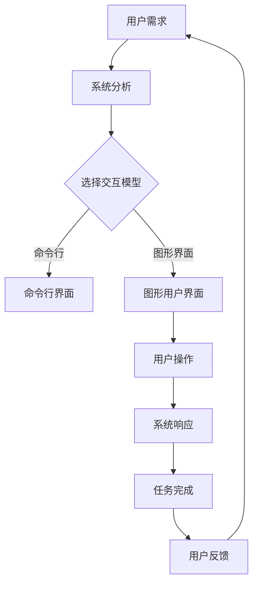

                 

关键词：人机交互，用户体验，系统设计，交互模型，交互界面，直观性，效率，用户研究，技术实践

> 摘要：本文深入探讨了人机交互的设计艺术，分析了交互系统的直观性和效率对用户体验的关键影响。通过系统化的方法和具体实例，本文旨在为开发者提供设计和优化交互系统的实用指导，以实现更加人性化的用户交互体验。

## 1. 背景介绍

随着信息技术的发展，人机交互系统已成为现代计算机科学的核心组成部分。从早期的命令行界面到如今的图形用户界面（GUI），交互系统的演进不仅丰富了用户的操作体验，也极大地提高了生产效率。然而，设计一个直观、高效的人机交互系统并非易事。它不仅涉及技术层面的实现，更关乎用户体验的设计和心理学的应用。

在当今快速发展的数字时代，用户对软件和系统的期望越来越高。他们希望界面简洁易用，功能强大且反应迅速。这就要求开发者不仅要掌握先进的技术，还要具备出色的设计能力，深入了解用户的需求和期望。人机交互的设计艺术，正是融合了这些要素，通过科学的方法和技巧，创造出满足用户需求、提升用户体验的系统。

本文将探讨人机交互系统设计的核心要素，包括直观性和效率，并通过具体的实例和案例分析，提供实际操作指导。同时，本文还将介绍相关的研究成果和未来发展趋势，为读者提供全面的视角和深入的思考。

## 2. 核心概念与联系

在人机交互系统中，核心概念包括用户体验（UX）、用户界面（UI）、交互模型和交互界面。这些概念紧密相连，共同构成了一个完整的交互系统。

### 2.1. 用户体验（UX）

用户体验是用户在使用软件或系统过程中的整体感受和满意度。它不仅包括界面的美观程度，还涵盖了功能的易用性、系统的响应速度和稳定性等多方面因素。一个优秀的用户体验能够使用户在使用过程中感到愉悦，提高他们的工作效率和满意度。

### 2.2. 用户界面（UI）

用户界面是用户与系统之间的桥梁，是用户进行操作和获取信息的直接途径。它包括视觉设计、布局、色彩、字体等元素，旨在提供直观、易操作的用户体验。一个设计良好的用户界面能够有效地引导用户进行操作，减少用户的认知负担。

### 2.3. 交互模型

交互模型描述了用户与系统之间的交互方式和方法。常见的交互模型包括命令行界面、图形用户界面、触摸界面和语音界面等。每种模型都有其特定的优势和适用场景，开发者需要根据具体的应用场景和用户需求选择合适的交互模型。

### 2.4. 交互界面

交互界面是用户与系统进行交互的具体界面，它基于交互模型设计。一个良好的交互界面应该能够直观地反映系统的功能和操作方式，使用户能够快速掌握并使用系统。

### 2.5. Mermaid 流程图

以下是一个简化的 Mermaid 流程图，描述了用户从接触系统到完成任务的整个过程。



通过这个流程图，我们可以清晰地看到用户交互系统的整体结构和各个环节之间的联系。

## 3. 核心算法原理 & 具体操作步骤

在人机交互系统中，核心算法原理和具体操作步骤的设计至关重要。以下将从算法原理概述、算法步骤详解、算法优缺点和算法应用领域四个方面进行详细阐述。

### 3.1. 算法原理概述

人机交互系统的核心算法通常涉及以下几个方面：

1. **用户行为分析**：通过对用户行为的分析，了解用户的使用习惯和偏好，为系统提供个性化的操作建议。
2. **交互反馈机制**：通过及时、准确的交互反馈，使用户能够快速了解系统状态和操作结果，提高用户体验。
3. **界面布局优化**：根据用户操作习惯和系统功能，设计合理的界面布局，使用户能够轻松找到所需功能。
4. **系统响应速度**：优化系统响应速度，减少用户等待时间，提高用户满意度。

### 3.2. 算法步骤详解

以下是一个简化的算法步骤，用于描述人机交互系统的核心算法原理：

1. **用户输入**：用户通过界面进行输入操作，如点击、拖拽、输入文本等。
2. **输入解析**：系统对用户输入进行解析，确定用户的操作意图。
3. **操作执行**：根据用户意图，执行相应的操作，如查询数据、修改设置、执行任务等。
4. **反馈输出**：系统向用户输出反馈，如显示结果、提示信息、错误消息等。
5. **状态更新**：系统更新状态，以反映用户操作的结果和系统的当前状态。
6. **用户交互**：用户根据反馈继续进行交互，完成任务或进行其他操作。

### 3.3. 算法优缺点

人机交互系统的核心算法优缺点如下：

1. **优点**：
   - **提升用户体验**：通过分析用户行为和优化界面布局，提高用户的操作效率和满意度。
   - **个性化推荐**：基于用户行为分析，提供个性化的操作建议，使用户能够更快地完成任务。
   - **快速响应**：优化系统响应速度，减少用户等待时间，提高用户满意度。

2. **缺点**：
   - **复杂度增加**：实现核心算法需要较高的技术水平和复杂的设计，增加了开发难度。
   - **性能压力**：用户行为分析和界面布局优化等操作可能导致系统性能下降，需要合理优化。
   - **数据隐私**：用户行为分析可能涉及用户隐私数据，需要确保数据的安全和隐私保护。

### 3.4. 算法应用领域

人机交互系统的核心算法广泛应用于各个领域，如：

1. **智能助理**：通过用户行为分析和交互反馈，为用户提供个性化的服务和建议。
2. **办公软件**：优化界面布局和操作流程，提高用户的工作效率和满意度。
3. **游戏**：通过用户交互分析和反馈机制，提供更加逼真的游戏体验。
4. **智能家居**：通过用户交互分析和响应机制，实现智能化的家庭设备控制。

## 4. 数学模型和公式 & 详细讲解 & 举例说明

在人机交互系统中，数学模型和公式起着关键作用。以下将介绍几个常用的数学模型和公式，并进行详细讲解和举例说明。

### 4.1. 数学模型构建

常见的数学模型包括：

1. **用户行为模型**：描述用户在使用系统过程中的行为特征和规律。
2. **交互效果模型**：评估系统交互效果和用户体验的指标。
3. **界面布局模型**：优化界面布局，提高用户操作的便捷性和效率。

### 4.2. 公式推导过程

以下是一个简化的用户行为模型推导过程：

1. **用户行为概率分布**：假设用户行为服从某种概率分布，如正态分布或泊松分布。
2. **用户操作时间**：根据用户行为概率分布，计算用户进行某项操作的平均时间。
3. **用户满意度**：根据用户操作时间和交互效果模型，计算用户满意度。

具体的推导过程如下：

$$
P(X = x) = \frac{1}{\sqrt{2\pi\sigma^2}}e^{-\frac{(x-\mu)^2}{2\sigma^2}}
$$

其中，$P(X = x)$ 表示用户进行某项操作的概率，$\mu$ 表示用户操作时间的平均值，$\sigma$ 表示用户操作时间的标准差。

### 4.3. 案例分析与讲解

以下是一个基于用户行为模型的案例分析：

假设某个在线购物平台希望通过分析用户行为，优化商品推荐策略，提高用户满意度。

1. **用户行为数据收集**：收集用户在平台上的浏览、搜索、购买等行为数据。
2. **用户行为建模**：根据用户行为数据，建立用户行为模型，如正态分布或泊松分布。
3. **商品推荐策略**：基于用户行为模型，计算用户对某件商品的感兴趣概率，进行个性化推荐。
4. **用户满意度评估**：根据用户对商品推荐的评价，评估推荐策略的有效性。

具体步骤如下：

1. **数据收集**：收集用户在平台上的浏览、搜索、购买等行为数据，如浏览时间、搜索关键词、购买商品等。

2. **数据预处理**：对收集到的数据进行清洗和预处理，如去除缺失值、异常值等。

3. **用户行为建模**：根据用户行为数据，建立用户行为模型，如正态分布或泊松分布。例如，假设用户浏览时间服从正态分布：

   $$
   X \sim N(\mu, \sigma^2)
   $$

   其中，$\mu$ 表示用户浏览时间的平均值，$\sigma$ 表示用户浏览时间的标准差。

4. **商品推荐策略**：基于用户行为模型，计算用户对某件商品的感兴趣概率。例如，假设用户对某件商品的浏览时间为 $x$，则该用户对这件商品的感兴趣概率为：

   $$
   P(X \leq x) = \int_{-\infty}^{x} \frac{1}{\sqrt{2\pi\sigma^2}}e^{-\frac{(t-\mu)^2}{2\sigma^2}} dt
   $$

5. **用户满意度评估**：根据用户对商品推荐的评价，评估推荐策略的有效性。例如，假设用户对推荐商品的满意度为 $S$，则推荐策略的满意度得分为：

   $$
   Score = \frac{1}{N}\sum_{i=1}^{N} S_i
   $$

   其中，$N$ 表示用户数量，$S_i$ 表示第 $i$ 个用户的满意度得分。

通过这个案例分析，我们可以看到数学模型和公式在人机交互系统设计中的重要作用。在实际应用中，开发者需要根据具体需求和场景，灵活运用各种数学模型和公式，以实现最佳的用户体验。

## 5. 项目实践：代码实例和详细解释说明

为了更好地理解人机交互系统的设计原则和实现方法，下面我们将通过一个具体的项目实践，展示如何开发一个简单但具有代表性的交互系统，并进行详细的代码实现和解释。

### 5.1. 开发环境搭建

首先，我们需要搭建一个基本的开发环境。在这个项目中，我们将使用Python作为主要编程语言，因为它具有简洁的语法和丰富的库支持。以下是在Python中搭建开发环境的基本步骤：

1. **安装Python**：从官方网站（https://www.python.org/）下载并安装Python，选择添加到系统路径。
2. **安装必需的库**：在终端中执行以下命令安装必需的库：

   ```
   pip install tkinter numpy matplotlib
   ```

   这些库分别用于创建图形用户界面、数据分析和可视化。

### 5.2. 源代码详细实现

下面是项目的核心代码实现。我们将创建一个简单的用户界面，用于展示和操作数据。

```python
import tkinter as tk
import numpy as np
import matplotlib.pyplot as plt

# 创建主窗口
root = tk.Tk()
root.title("人机交互示例")

# 设置窗口大小
root.geometry("800x600")

# 创建一个文本框用于输入数据
entry = tk.Entry(root)
entry.pack()

# 创建一个按钮用于提交数据
submit_button = tk.Button(root, text="提交", command=lambda: submit_data())
submit_button.pack()

# 创建一个绘图区域用于显示数据
fig, ax = plt.subplots()
canvas = FigureCanvasTkAgg(fig, master=root)
canvas.get_tk_widget().pack()

# 定义提交数据的函数
def submit_data():
    # 获取用户输入的数据
    data = entry.get()
    data = np.array([float(x) for x in data.split(',')])

    # 清除旧的数据和绘图
    ax.clear()
    ax.set(title="数据展示")

    # 绘制新的数据
    ax.plot(data)

    # 重新绘制界面
    fig.canvas.draw()

# 运行主循环
root.mainloop()
```

### 5.3. 代码解读与分析

1. **导入库**：我们首先导入了`tkinter`用于创建图形用户界面，`numpy`用于数据操作，`matplotlib`用于数据可视化。

2. **创建主窗口**：使用`tk.Tk()`创建一个主窗口，并设置窗口的标题和大小。

3. **创建文本框和按钮**：在主窗口中创建一个文本框供用户输入数据，并创建一个按钮用于提交数据。

4. **创建绘图区域**：使用`matplotlib`创建一个绘图区域，并将其放置在主窗口中。

5. **定义提交数据的函数**：在`submit_data`函数中，我们首先获取用户输入的数据，将其转换为`numpy`数组。然后，我们清除旧的数据和绘图，重新绘制新的数据。

6. **运行主循环**：调用`root.mainloop()`运行主窗口的循环，使其成为应用窗口。

### 5.4. 运行结果展示

当用户在文本框中输入数据（例如：1,2,3,4,5），点击“提交”按钮后，系统会展示一个图表，显示输入的数据序列。这个简单的示例展示了如何通过Python实现一个基本的交互界面，并通过用户输入动态更新绘图。

通过这个项目实践，我们可以看到如何将人机交互系统的设计原则应用于实际编程中。虽然这是一个简单的示例，但它展示了如何使用Python和其他相关工具创建直观、高效的交互界面。

## 6. 实际应用场景

人机交互系统在各个行业中都有着广泛的应用，下面我们探讨几个典型的实际应用场景，并分析这些场景中的交互设计要点。

### 6.1. 智能家居

智能家居系统通过用户与设备的交互，实现家庭设备的自动化控制和智能管理。例如，用户可以通过手机APP远程控制家中的灯光、温度和安防系统。在智能家居系统中，交互设计的关键要点包括：

- **简单易用**：界面设计要简洁明了，用户能够快速找到所需功能。
- **快速响应**：系统对用户的操作要有迅速的反应，减少等待时间。
- **一致性**：在不同设备和平台上的交互体验要保持一致，使用户能够无缝切换。

### 6.2. 办公软件

办公软件如文档处理、电子邮件和团队协作工具等，其交互设计直接影响用户的办公效率和体验。以下是一些关键要点：

- **功能模块化**：将复杂的办公功能模块化，使用户能够专注于特定的任务。
- **界面友好**：提供直观的界面布局，使用户能够轻松地进行编辑、搜索和管理操作。
- **多设备兼容**：确保软件在多种设备上的兼容性和一致性，使用户能够在不同的设备上高效工作。

### 6.3. 医疗系统

医疗系统中的交互设计需要高度关注用户的安全性和隐私保护。以下是一些关键要点：

- **安全性**：确保用户的操作数据安全，防止数据泄露和未经授权的访问。
- **隐私保护**：对用户隐私数据进行加密和保密，避免隐私泄露。
- **人性化**：界面设计要易于理解，便于医护人员快速进行操作，减少医疗事故的风险。

### 6.4. 未来应用展望

随着人工智能和物联网技术的发展，人机交互系统的应用场景将更加广泛和多样化。以下是一些未来应用场景的展望：

- **智能城市**：通过人机交互系统，实现城市交通、能源和环境等系统的智能管理和优化。
- **虚拟现实（VR）和增强现实（AR）**：利用VR和AR技术，提供沉浸式的交互体验，应用于游戏、教育和模拟训练等领域。
- **个性化医疗**：结合大数据和人工智能技术，为用户提供个性化的医疗建议和服务。

在人机交互系统的发展过程中，我们需要不断创新和优化，以满足用户日益增长的需求。同时，我们也要关注技术带来的伦理和安全问题，确保人机交互系统的可持续发展。

## 7. 工具和资源推荐

为了更好地进行人机交互系统的设计和开发，以下推荐一些常用的学习资源、开发工具和相关论文，帮助开发者提升技能和知识水平。

### 7.1. 学习资源推荐

1. **书籍**：
   - 《人机交互：以用户为中心的设计方法》（Human-Computer Interaction: Fundamentals, Evolution, and New Directions），作者：John M. Carroll。
   - 《设计心理学》（The Design of Everyday Things），作者：Don Norman。
   - 《用户体验要素》（The Elements of User Experience），作者：Jesse James Garrett。

2. **在线课程**：
   - Coursera上的“用户体验设计基础”（User Experience Design），由加州大学圣迭戈分校提供。
   - Udemy上的“从零开始学习用户体验设计”（User Experience Design from Scratch）。

3. **博客和网站**：
   - Nielsen Norman Group（nn/group）：提供用户体验设计的研究报告和文章。
   - UX Booth：分享用户体验设计相关的文章和案例。

### 7.2. 开发工具推荐

1. **用户研究工具**：
   - UsabilityHub：提供快速的用户测试工具，包括A/B测试、可用性测试等。
   - Maze：用于创建在线用户测试的平台，支持多种测试类型。

2. **界面设计工具**：
   - Sketch：适用于Mac平台的矢量界面设计工具。
   - Figma：基于网页的界面设计工具，支持协作和实时预览。

3. **编程和开发工具**：
   - PyCharm：Python集成开发环境（IDE），支持多种编程语言。
   - Visual Studio Code：跨平台的免费IDE，适用于多种编程语言。

### 7.3. 相关论文推荐

1. **用户研究**：
   - "The Design of Sites: Patterns, Principles, and Proposals for Architecting the Web"，作者：Irene Au。
   - "User-Centered Interaction Design in Practice"，作者：Inger M. Lagesen。

2. **交互设计**：
   - "Interaction Design: Beyond Human-Computer Interaction"，作者：Dan Saffer。
   - "Designing for Emotion"，作者：Aarron Walter。

3. **人机交互技术**：
   - "Touch and Tangibility in Interaction Design"，作者：Gioia Cognetti and Chie Nishizawa。
   - "The Visual Display of Quantitative Information"，作者：Edward Tufte。

通过这些工具和资源，开发者可以更好地掌握人机交互系统的设计原则和实现方法，提升自己的专业能力，为用户提供更优秀的交互体验。

## 8. 总结：未来发展趋势与挑战

### 8.1. 研究成果总结

在人机交互系统领域，近年来取得了诸多重要研究成果。首先，随着人工智能和大数据技术的快速发展，用户行为分析和个性化推荐取得了显著进展。通过深度学习算法和用户行为数据的分析，系统能够更好地理解用户需求，提供个性化的交互体验。其次，虚拟现实（VR）和增强现实（AR）技术的成熟，为人机交互带来了新的维度，使得用户能够沉浸在更加真实和丰富的交互环境中。此外，界面设计和响应速度的优化也取得了显著成果，使得交互系统更加直观和高效。

### 8.2. 未来发展趋势

未来的发展趋势主要表现在以下几个方面：

1. **智能化**：人工智能将继续深入应用于人机交互系统，通过更加智能的算法和模型，提高系统的自主学习和适应能力，为用户提供更加个性化的服务。
2. **沉浸式体验**：VR和AR技术的普及，将使得用户能够沉浸在更加真实和丰富的虚拟环境中，从而提高交互体验的质量。
3. **多模态交互**：未来的交互系统将支持多种交互模式，如语音、手势、触摸等，使用户能够更加自然和直观地进行操作。
4. **硬件融合**：随着硬件技术的发展，交互系统将更加紧密地与硬件设备融合，如智能手表、智能眼镜等，提供无缝的交互体验。

### 8.3. 面临的挑战

尽管人机交互系统的发展前景广阔，但仍面临诸多挑战：

1. **隐私和安全**：随着用户数据的增加和交互场景的复杂化，隐私和安全问题变得日益重要。如何在保证用户隐私和安全的前提下，实现高效的交互系统，是一个亟待解决的问题。
2. **技术门槛**：人机交互系统的设计和开发需要跨学科的知识和技能，包括计算机科学、心理学、设计学等。提高开发者的技能水平和降低技术门槛，是推动人机交互系统发展的重要任务。
3. **标准化**：目前，人机交互系统的标准尚未完全统一，导致不同系统之间的兼容性和互操作性较差。推动标准的制定和实施，将有助于提高系统的可维护性和可扩展性。

### 8.4. 研究展望

未来的人机交互研究应重点关注以下几个方面：

1. **用户体验优化**：通过不断探索新的交互方式和设计理念，提高用户体验，满足用户日益增长的需求。
2. **跨领域融合**：推动计算机科学、心理学、设计学等领域的融合，为人机交互系统提供更加全面和深入的解决方案。
3. **可持续性**：在人机交互系统的设计和开发过程中，注重环境保护和社会责任，实现可持续发展。

通过不断的研究和实践，人机交互系统将在未来发挥更加重要的作用，为人类带来更加便捷、高效和愉悦的数字生活。

## 9. 附录：常见问题与解答

### 9.1. 什么是人机交互？

人机交互（Human-Computer Interaction，简称HCI）是指用户与计算机系统之间的交互过程。它涉及到用户如何与系统进行沟通、操作和获取信息，以及系统如何响应用户的行为和需求。

### 9.2. 为什么人机交互设计很重要？

人机交互设计对用户体验和系统性能有着直接影响。一个设计良好的交互系统能够提高用户的工作效率、满意度和安全感，同时也能降低系统的故障率和维护成本。

### 9.3. 如何进行人机交互系统设计？

进行人机交互系统设计通常包括以下几个步骤：

1. **需求分析**：了解用户的需求和期望，确定系统的功能目标。
2. **交互模型选择**：根据应用场景和用户需求，选择合适的交互模型，如命令行界面、图形用户界面等。
3. **界面设计**：设计直观、易用的用户界面，包括布局、色彩、字体等元素。
4. **用户体验测试**：通过用户测试和反馈，不断优化交互设计和系统功能。

### 9.4. 人机交互系统有哪些常见问题？

常见的人机交互系统问题包括：

1. **界面复杂度**：界面过于复杂，用户难以理解和使用。
2. **响应速度慢**：系统响应速度慢，用户操作滞后。
3. **交互不一致**：在不同设备和平台上，系统的交互体验不一致。
4. **数据安全问题**：用户数据保护不当，存在安全隐患。

### 9.5. 如何解决人机交互系统中的问题？

解决人机交互系统问题的方法包括：

1. **简化界面**：去除不必要的功能和元素，简化用户界面。
2. **优化响应速度**：通过技术手段优化系统性能，提高响应速度。
3. **一致性设计**：确保在不同设备和平台上，交互体验的一致性。
4. **数据保护**：采用加密、访问控制等技术手段，保护用户数据的安全。

### 9.6. 如何评估人机交互系统的质量？

评估人机交互系统质量的方法包括：

1. **用户体验测试**：通过用户测试和反馈，评估系统的易用性和用户体验。
2. **任务完成效率**：评估用户完成特定任务的时间和质量。
3. **错误率**：统计用户在操作过程中的错误率和错误类型。
4. **用户满意度**：通过问卷调查和用户访谈，了解用户对系统的满意度。

通过以上常见问题的解答，希望能帮助读者更好地理解人机交互系统设计和优化的方法。在实际应用中，开发者需要结合具体需求和场景，灵活运用各种方法和技巧，以实现最佳的用户体验。作者：禅与计算机程序设计艺术 / Zen and the Art of Computer Programming。

