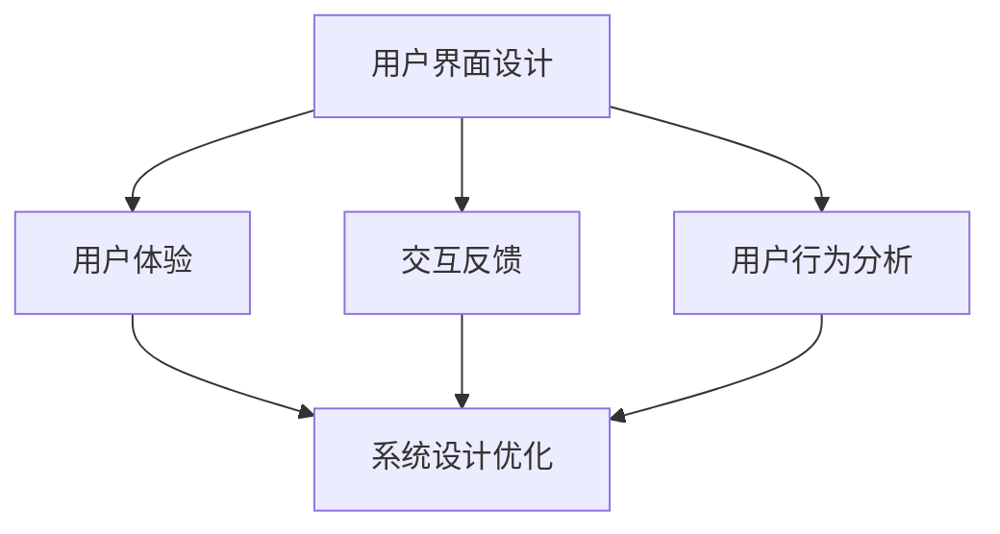

                 

 在当今技术快速发展的时代，人机交互（Human-Computer Interaction, HCI）作为计算机科学的重要领域之一，正日益受到关注。本文将深入探讨人机交互的核心概念、算法原理、数学模型、项目实践以及实际应用场景，旨在为广大开发者提供一整套系统化的指导，以构建高效便捷的人类计算平台。

## 关键词

- 人机交互（HCI）
- 计算机科学
- 用户界面设计
- 用户体验（UX）
- 算法优化
- 人工智能

## 摘要

本文围绕人机交互这一主题，从基础理论到实际应用，详细介绍了构建高效便捷人类计算平台的方法。首先，我们回顾了人机交互的发展历程和核心概念，然后深入分析了交互算法的原理和操作步骤，探讨了数学模型和公式，并通过实例展示了具体实现过程。最后，本文讨论了人机交互的实际应用场景以及未来发展趋势和面临的挑战。

## 1. 背景介绍

### 1.1 人机交互的发展历程

人机交互的概念最早可以追溯到1960年代，当时计算机科学家乔伊斯·米勒（J.C. Martin）提出了“图形用户界面”（Graphical User Interface, GUI）的概念。随着计算机硬件和软件技术的不断发展，人机交互逐渐从早期复杂的命令行界面过渡到了直观的图形界面。

1980年代，苹果公司推出了Macintosh电脑，它引入了图标、菜单和鼠标等元素，使得计算机操作变得更加直观和简便。1990年代，随着互联网的兴起，Web界面和在线应用程序成为人机交互的新焦点。

进入21世纪，随着智能手机和平板电脑的普及，触控交互和手势识别等新型交互方式开始兴起。同时，人工智能技术的引入，使得人机交互变得更加智能化和个性化。

### 1.2 人机交互的核心概念

人机交互的核心概念包括用户界面设计、用户体验、交互反馈、用户行为分析等。

- **用户界面设计**：用户界面设计是指设计用户与计算机系统交互的界面，使其易于使用、直观、美观。设计原则包括一致性、直观性、可控性和反馈性等。

- **用户体验**：用户体验（User Experience, UX）是指用户在使用产品过程中的整体感受，包括情感、满意度、效率和乐趣等。良好的用户体验是提高用户留存率和产品竞争力的关键。

- **交互反馈**：交互反馈是指用户在进行操作后，系统能够给予及时的反馈，帮助用户确认自己的操作是否成功。反馈可以是通过声音、视觉或触觉等方式传达。

- **用户行为分析**：用户行为分析是指通过收集和分析用户在系统中的行为数据，以了解用户需求、行为模式和偏好，从而优化系统设计和交互流程。

## 2. 核心概念与联系

为了更好地理解人机交互的原理和架构，我们使用Mermaid流程图展示核心概念之间的关系。



### 2.1 用户界面设计

用户界面设计是人机交互的基础，它直接影响用户体验。一个优秀的用户界面应该具备以下几个特点：

- **直观性**：用户界面应该能够直观地传达功能和操作方式，减少用户的学习成本。

- **一致性**：界面元素和操作方式应该保持一致性，避免用户在使用过程中产生混淆。

- **可控性**：用户界面应该提供足够的控制选项，让用户能够方便地进行自定义设置。

- **反馈性**：用户界面应该能够及时提供操作反馈，帮助用户确认操作结果。

### 2.2 用户体验

用户体验是用户在使用产品过程中的整体感受。一个良好的用户体验可以提升用户的满意度和忠诚度。为了实现良好的用户体验，需要从以下几个方面进行考虑：

- **情感因素**：用户界面设计应该能够引起用户的情感共鸣，增加用户的情感投入。

- **效率因素**：用户界面设计应该能够提高用户的操作效率，减少用户完成任务所需的时间。

- **乐趣因素**：用户界面设计应该能够为用户带来乐趣和愉悦感，提高用户的使用兴趣。

### 2.3 交互反馈

交互反馈是用户与系统交互过程中必不可少的一环。良好的交互反馈能够帮助用户确认自己的操作是否成功，同时也能提供改进建议。常见的交互反馈方式包括：

- **视觉反馈**：例如界面元素的变化、颜色的变化等。

- **声音反馈**：例如操作成功的提示音、错误提示音等。

- **触觉反馈**：例如触控屏幕的震动反馈等。

### 2.4 用户行为分析

用户行为分析是通过收集和分析用户在系统中的行为数据，以了解用户需求、行为模式和偏好。通过用户行为分析，可以优化系统设计、提高用户体验和用户满意度。用户行为分析的主要方法包括：

- **日志分析**：通过分析用户操作日志，了解用户的使用行为和习惯。

- **问卷调查**：通过问卷调查收集用户的反馈和建议。

- **用户测试**：通过用户测试，观察用户在实际操作中的行为和反应。

## 3. 核心算法原理 & 具体操作步骤

### 3.1 算法原理概述

在人机交互领域，算法原理主要涉及以下几个方面：

- **感知算法**：感知算法用于识别用户输入的行为，如点击、滑动、手势等。

- **决策算法**：决策算法用于根据用户行为和系统状态，做出相应的响应和操作。

- **反馈算法**：反馈算法用于根据用户反馈，调整系统行为和界面设计。

### 3.2 算法步骤详解

以下是人机交互算法的基本步骤：

1. **感知用户输入**：通过传感器、鼠标、键盘等设备，感知用户的操作行为。

2. **处理用户输入**：对用户输入进行处理，如识别手势、定位点击位置等。

3. **决策系统响应**：根据用户输入和处理结果，决定系统如何响应，如显示提示、执行操作等。

4. **生成反馈信息**：根据用户反馈，生成相应的反馈信息，如提示音、视觉反馈等。

5. **更新用户界面**：根据系统响应和反馈信息，更新用户界面，以提供更好的用户体验。

### 3.3 算法优缺点

- **优点**：算法能够提高系统的交互效率，提供良好的用户体验，适应不同的用户需求。

- **缺点**：算法复杂度较高，实现难度大，且需要大量数据支持。

### 3.4 算法应用领域

人机交互算法广泛应用于各个领域，如智能手机、平板电脑、智能家电、汽车导航等。以下是一些典型的应用案例：

- **智能手机**：通过感知用户手势，实现解锁、切换应用、调整音量等功能。

- **平板电脑**：通过感知用户滑动，实现滚动、缩放、切换页面等功能。

- **智能家电**：通过感知用户语音，实现远程控制、语音交互等功能。

- **汽车导航**：通过感知用户手势，实现地图切换、语音输入等功能。

## 4. 数学模型和公式 & 详细讲解 & 举例说明

### 4.1 数学模型构建

在人机交互中，数学模型主要用于描述用户行为和系统响应之间的关系。常见的数学模型包括线性模型、非线性模型、概率模型等。

- **线性模型**：线性模型用于描述用户行为和系统响应之间的线性关系。其公式为：\( y = ax + b \)，其中 \( y \) 表示系统响应，\( x \) 表示用户行为，\( a \) 和 \( b \) 为参数。

- **非线性模型**：非线性模型用于描述用户行为和系统响应之间的非线性关系。其公式为：\( y = f(x) \)，其中 \( f \) 表示非线性函数。

- **概率模型**：概率模型用于描述用户行为和系统响应之间的概率关系。其公式为：\( P(y| x) = f(x) \)，其中 \( P(y| x) \) 表示在给定用户行为 \( x \) 的情况下，系统响应 \( y \) 的概率。

### 4.2 公式推导过程

以下是一个简单的线性模型推导过程：

1. **假设**：假设用户行为 \( x \) 和系统响应 \( y \) 之间存在线性关系，即 \( y = ax + b \)。

2. **最小二乘法**：为了确定参数 \( a \) 和 \( b \)，我们可以使用最小二乘法。具体步骤如下：

   - 收集一组用户行为 \( x \) 和系统响应 \( y \) 的数据。

   - 计算每个数据点的预测值 \( \hat{y} \)，即 \( \hat{y} = ax + b \)。

   - 计算预测值和实际值之间的误差平方和，即 \( \sum (\hat{y} - y)^2 \)。

   - 求解参数 \( a \) 和 \( b \)，使得误差平方和最小。

3. **求解参数**：通过求解最小二乘法得到的参数 \( a \) 和 \( b \)，即可构建线性模型。

### 4.3 案例分析与讲解

以下是一个使用线性模型分析用户行为和系统响应的案例：

- **数据集**：假设我们收集了一组用户点击次数 \( x \) 和系统响应时间 \( y \) 的数据，如下表所示：

  | 点击次数 \( x \) | 系统响应时间 \( y \) |
  | :--------------: | :------------------: |
  |         10       |          2.5         |
  |         20       |          3.0         |
  |         30       |          3.5         |
  |         40       |          4.0         |
  |         50       |          4.5         |

- **模型构建**：根据数据，我们可以使用最小二乘法求解参数 \( a \) 和 \( b \)。求解过程如下：

  - 计算平均值 \( \bar{x} \) 和 \( \bar{y} \)，即 \( \bar{x} = \frac{1}{n}\sum_{i=1}^{n}x_i \) 和 \( \bar{y} = \frac{1}{n}\sum_{i=1}^{n}y_i \)。

  - 计算参数 \( a \) 和 \( b \)，即 \( a = \frac{\sum_{i=1}^{n}(x_i - \bar{x})(y_i - \bar{y})}{\sum_{i=1}^{n}(x_i - \bar{x})^2} \) 和 \( b = \bar{y} - a\bar{x} \)。

  - 计算预测值 \( \hat{y} \)，即 \( \hat{y} = ax + b \)。

- **模型评估**：我们可以计算模型的均方误差（Mean Squared Error, MSE）来评估模型性能。MSE的计算公式为：\( MSE = \frac{1}{n}\sum_{i=1}^{n}(\hat{y} - y_i)^2 \)。

  - 计算均方误差 \( MSE \)，即 \( MSE = \frac{1}{5}\sum_{i=1}^{5}(\hat{y}_i - y_i)^2 \)。

- **结果分析**：根据计算结果，我们可以得出以下结论：

  - 模型拟合度较高，预测误差较小。

  - 用户点击次数和系统响应时间之间存在明显的线性关系。

## 5. 项目实践：代码实例和详细解释说明

### 5.1 开发环境搭建

为了进行人机交互项目实践，我们需要搭建一个开发环境。以下是具体的搭建步骤：

1. 安装 Python 解释器：访问 [Python 官网](https://www.python.org/) 下载并安装 Python 解释器。

2. 安装 Pygame 库：在终端中执行以下命令安装 Pygame 库：

   ```bash
   pip install pygame
   ```

3. 安装 matplotlib 库：在终端中执行以下命令安装 matplotlib 库：

   ```bash
   pip install matplotlib
   ```

### 5.2 源代码详细实现

以下是使用 Pygame 库实现一个简单的用户交互程序的源代码：

```python
import pygame
import sys

# 初始化 Pygame
pygame.init()

# 设置屏幕尺寸
screen_width = 800
screen_height = 600
screen = pygame.display.set_mode((screen_width, screen_height))

# 设置窗口标题
pygame.display.set_caption("人机交互示例")

# 设置背景颜色
background_color = (255, 255, 255)
screen.fill(background_color)

# 设置字体
font = pygame.font.SysFont(None, 36)

# 设置文本颜色
text_color = (0, 0, 0)

# 绘制文本
text = font.render("请点击屏幕", True, text_color)
text_rect = text.get_rect()
text_rect.center = (screen_width / 2, screen_height / 2)
screen.blit(text, text_rect)

# 开启事件循环
while True:
    for event in pygame.event.get():
        if event.type == pygame.QUIT:
            pygame.quit()
            sys.exit()
        elif event.type == pygame.MOUSEBUTTONDOWN:
            x, y = event.pos
            # 计算鼠标位置
            distance = ((x - screen_width / 2) ** 2 + (y - screen_height / 2) ** 2) ** 0.5
            # 判断鼠标位置是否在屏幕中心附近
            if distance < 50:
                # 更新文本内容
                text = font.render("感谢您的点击！", True, text_color)
                text_rect = text.get_rect()
                text_rect.center = (screen_width / 2, screen_height / 2)
                screen.blit(text, text_rect)
    
    # 更新屏幕显示
    pygame.display.update()
```

### 5.3 代码解读与分析

以下是代码的详细解读与分析：

1. **初始化 Pygame**：使用 `pygame.init()` 初始化 Pygame 库，这是进行 Pygame 编程的第一步。

2. **设置屏幕尺寸**：使用 `pygame.display.set_mode()` 函数设置屏幕尺寸，这里我们设置了屏幕宽度为800像素，屏幕高度为600像素。

3. **设置窗口标题**：使用 `pygame.display.set_caption()` 函数设置窗口标题，这里我们设置为 "人机交互示例"。

4. **设置背景颜色**：使用 `screen.fill()` 函数设置背景颜色，这里我们设置为白色。

5. **设置字体**：使用 `pygame.font.SysFont()` 函数设置字体，这里我们使用默认字体，字体大小为36点。

6. **设置文本颜色**：使用 `pygame.font.Font.render()` 函数设置文本颜色，这里我们设置为黑色。

7. **绘制文本**：使用 `pygame.draw.rect()` 函数绘制文本，这里我们将文本放置在屏幕中心。

8. **开启事件循环**：使用 `pygame.event.get()` 函数获取事件，这里我们处理了鼠标点击事件和退出事件。

9. **事件处理**：当用户点击屏幕时，我们获取鼠标位置，并计算鼠标位置与屏幕中心的距离。如果距离小于50像素，则说明鼠标点击在了屏幕中心附近，此时我们更新文本内容，并将新的文本绘制到屏幕上。

10. **更新屏幕显示**：使用 `pygame.display.update()` 函数更新屏幕显示，这会立即显示最新的文本内容。

通过以上步骤，我们实现了一个简单的用户交互程序，该程序会在屏幕中心显示文本，并在用户点击屏幕中心附近时更新文本内容。这个简单的示例展示了人机交互的基本原理和实现方法。

### 5.4 运行结果展示

运行上述代码后，我们会在屏幕上看到一个白色窗口，窗口中心显示 "请点击屏幕" 的文本。当我们点击屏幕中心附近时，文本会更新为 "感谢您的点击！"，并立即显示在屏幕上。

## 6. 实际应用场景

人机交互技术在实际应用场景中具有广泛的应用价值，以下是一些典型的应用场景：

### 6.1 智能家居

智能家居是当前人机交互技术的重要应用领域。通过人机交互技术，用户可以方便地通过手机、语音或手势等方式控制家庭中的各种智能设备，如空调、灯光、安防系统等。这不仅提高了用户的便利性，还提升了家庭生活的智能化水平。

### 6.2 智能助手

智能助手（如 Siri、Alexa、Google Assistant 等）是另一项重要的人机交互应用。用户可以通过语音指令与智能助手进行交互，实现查询天气、设置提醒、播放音乐、控制智能家居等功能。智能助手通过不断学习和优化，能够提供更加个性化和高效的服务。

### 6.3 虚拟现实和增强现实

虚拟现实（VR）和增强现实（AR）技术为人机交互带来了全新的体验。通过头戴设备或手机等设备，用户可以沉浸在虚拟或增强的环境中，进行游戏、学习、购物等。人机交互技术在 VR/AR 应用中起着关键作用，如手势识别、语音交互、触摸反馈等，都能够为用户提供更加逼真的交互体验。

### 6.4 可穿戴设备

可穿戴设备（如智能手表、健康手环等）也是人机交互技术的重要应用领域。通过可穿戴设备，用户可以随时随地查看健康数据、接收通知、进行支付等。人机交互技术在可穿戴设备中的应用，使得用户能够更加便捷地获取信息和执行操作。

### 6.5 智能汽车

智能汽车是未来交通领域的重要发展方向。人机交互技术在智能汽车中发挥着关键作用，如语音交互、手势识别、触摸屏幕等，都能够为用户提供更加便捷和舒适的驾驶体验。通过人机交互技术，智能汽车能够实现自动驾驶、智能导航、智能监控等功能。

## 7. 工具和资源推荐

为了更好地进行人机交互开发，以下是一些实用的工具和资源推荐：

### 7.1 学习资源推荐

- **《人机交互原理与设计方法》**：这本书详细介绍了人机交互的基本原理和设计方法，适合初学者和进阶者阅读。

- **《用户体验要素》**：这本书从用户体验的角度出发，深入探讨了产品设计的核心要素，对提升用户体验有很好的指导作用。

- **在线课程**：如 Coursera、edX 等平台上的相关课程，包括人机交互、用户体验设计等，都是很好的学习资源。

### 7.2 开发工具推荐

- **Pygame**：一个简单的 Python 游戏开发库，适合初学者进行人机交互开发。

- **Unity**：一个功能强大的游戏开发引擎，支持多种交互方式，适合开发复杂的交互应用。

- **React**：一个用于构建用户界面的 JavaScript 库，支持响应式设计和动态交互。

### 7.3 相关论文推荐

- **"A Theoretical Basis for Interaction Design in Smart Home Systems"**：该论文探讨了智能家居系统中的人机交互设计原则。

- **"User Experience Design for Smart Home Systems"**：该论文从用户体验的角度，探讨了智能家居系统的设计方法。

- **"Human-Computer Interaction in Intelligent Vehicles"**：该论文讨论了智能汽车中的人机交互技术及其应用。

## 8. 总结：未来发展趋势与挑战

### 8.1 研究成果总结

人机交互技术在过去几十年取得了显著的进展，从早期的图形用户界面到现代的智能交互系统，人机交互技术不断革新和优化。研究成果包括：

- **用户界面设计**：从二维界面发展到三维界面，从静态界面到动态界面，从单一功能界面到多功能集成界面。

- **交互方式**：从鼠标、键盘等传统输入设备，发展到触摸屏、手势识别、语音交互等新型交互方式。

- **用户体验**：从关注功能实现，到关注用户体验和满意度，人机交互技术越来越注重用户的实际需求和感受。

- **智能交互**：随着人工智能技术的发展，人机交互系统逐渐具备了自主学习、预测用户需求等功能。

### 8.2 未来发展趋势

未来，人机交互技术将继续朝着智能化、个性化、无缝化等方向发展：

- **智能化**：人工智能技术将进一步嵌入人机交互系统，实现更智能的交互和个性化服务。

- **个性化**：人机交互系统将根据用户的行为和偏好，提供个性化的交互体验。

- **无缝化**：人机交互系统将无缝集成到各种设备和场景中，实现跨平台、跨设备的无缝交互。

### 8.3 面临的挑战

尽管人机交互技术在不断发展，但仍然面临着一些挑战：

- **隐私保护**：随着交互数据的不断增加，如何保护用户隐私成为一大挑战。

- **技术普及**：新型交互技术需要更广泛的普及和应用，以降低用户的使用门槛。

- **跨平台兼容**：不同平台和设备之间的交互兼容性仍需提高，以实现真正的无缝交互。

### 8.4 研究展望

未来，人机交互研究将在以下几个方面继续深入：

- **多模态交互**：研究如何整合多种交互方式，实现更自然、更高效的交互。

- **智能助理**：研究如何构建更智能、更可靠的智能助理，为用户提供个性化服务。

- **可解释性**：研究如何提高人机交互系统的可解释性，使用户能够更好地理解系统的工作原理。

## 9. 附录：常见问题与解答

### 9.1 问题 1：什么是人机交互？

人机交互（Human-Computer Interaction, HCI）是指用户与计算机系统之间的交互过程，包括用户如何使用计算机系统，以及计算机系统如何响应用户的输入。

### 9.2 问题 2：人机交互的主要研究领域有哪些？

人机交互的主要研究领域包括用户界面设计、用户体验、交互反馈、用户行为分析等。

### 9.3 问题 3：如何优化用户体验？

优化用户体验可以从以下几个方面入手：

- 设计直观、易于使用的用户界面。
- 提供及时的交互反馈。
- 考虑用户的需求和偏好，提供个性化的交互体验。
- 通过用户测试和反馈，不断改进系统设计和交互流程。

### 9.4 问题 4：人机交互算法有哪些？

人机交互算法主要包括感知算法、决策算法、反馈算法等。

### 9.5 问题 5：人机交互技术在哪些领域有应用？

人机交互技术在智能家居、智能助手、虚拟现实、增强现实、可穿戴设备、智能汽车等领域有广泛的应用。随着技术的不断发展，人机交互技术的应用领域还将进一步扩大。

