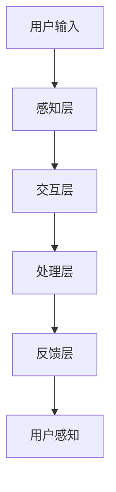

                 

关键词：人机交互，人工智能，自然语言处理，虚拟现实，交互设计，用户体验，界面技术，情感计算，多模态交互。

> 摘要：随着人工智能技术的快速发展，人机交互正经历着前所未有的变革。本文将探讨人机交互领域的关键趋势和未来展望，包括自然语言处理、虚拟现实、情感计算、多模态交互等前沿技术，并分析其在用户体验、设计模式和工具资源等方面的应用和影响。

## 1. 背景介绍

人机交互（Human-Computer Interaction，简称HCI）是研究人与计算机之间交互的学科。自从计算机问世以来，人机交互一直是一个重要的研究领域。早期的计算机界面主要是基于命令行和图形用户界面（GUI），用户需要通过键盘或鼠标进行操作。随着技术的发展，人机交互逐渐变得更加智能化和自然化。

近年来，人工智能（Artificial Intelligence，简称AI）的兴起为人机交互带来了新的机遇和挑战。人工智能技术，特别是自然语言处理（Natural Language Processing，简称NLP）、机器学习（Machine Learning，简称ML）和深度学习（Deep Learning，简称DL），正在极大地改变人机交互的方式。例如，智能语音助手、聊天机器人、手势控制和情感计算等技术，正在使人与计算机的交互变得更加直观和高效。

## 2. 核心概念与联系

### 2.1 人机交互的核心概念

人机交互的核心概念包括用户体验（User Experience，简称UX）、交互设计（User Interface Design，简称UID）和界面技术（User Interface，简称UI）。用户体验关注的是用户在使用计算机过程中的感受和满意度，交互设计则侧重于设计用户与计算机之间的交互流程和界面，而界面技术则是实现交互设计的技术手段。

### 2.2 人机交互的架构

人机交互的架构通常包括以下几个层次：

- **感知层**：用户通过视觉、听觉、触觉等感官与计算机进行交互。
- **交互层**：用户通过输入设备（如键盘、鼠标、触摸屏等）与计算机进行交互。
- **处理层**：计算机处理用户的输入，并执行相应的操作。
- **反馈层**：计算机向用户反馈操作结果，如显示信息、声音提示等。

### 2.3 Mermaid 流程图

以下是一个简单的Mermaid流程图，展示了人机交互的基本架构：



## 3. 核心算法原理 & 具体操作步骤

### 3.1 算法原理概述

在人机交互领域，核心算法通常涉及自然语言处理、机器学习和深度学习。以下是一些常见的算法原理：

- **自然语言处理**：NLP算法能够使计算机理解和处理人类语言，包括文本分类、命名实体识别、情感分析等。
- **机器学习**：ML算法使计算机能够从数据中学习并做出预测，包括线性回归、决策树、支持向量机等。
- **深度学习**：DL算法通过构建复杂的神经网络模型，使计算机能够在大量数据上实现高精度的预测和分类。

### 3.2 算法步骤详解

#### 3.2.1 自然语言处理

1. **文本预处理**：包括去除停用词、标点符号，进行词干提取等。
2. **特征提取**：将文本转换为向量表示，如词袋模型、TF-IDF等。
3. **模型训练**：使用机器学习或深度学习算法对特征向量进行训练。
4. **预测与评估**：使用训练好的模型对新的文本数据进行预测，并评估预测的准确性。

#### 3.2.2 机器学习

1. **数据收集**：收集用于训练的数据集。
2. **数据预处理**：对数据集进行清洗和格式化。
3. **特征提取**：将原始数据转换为机器学习算法能够处理的特征向量。
4. **模型选择**：选择合适的机器学习算法。
5. **模型训练**：使用训练数据集对模型进行训练。
6. **模型评估**：使用测试数据集评估模型的性能。

#### 3.2.3 深度学习

1. **数据收集**：收集用于训练的数据集。
2. **数据预处理**：对数据集进行清洗和格式化。
3. **网络构建**：设计深度学习网络的架构。
4. **模型训练**：使用训练数据集对模型进行训练。
5. **模型优化**：调整网络参数以优化模型性能。
6. **模型评估**：使用测试数据集评估模型的性能。

### 3.3 算法优缺点

- **自然语言处理**：优点在于能够理解和处理人类语言，缺点是处理非结构化数据时效率较低。
- **机器学习**：优点在于能够从数据中学习，缺点是模型的可解释性较低。
- **深度学习**：优点在于能够处理大量复杂数据，缺点是训练过程需要大量计算资源。

### 3.4 算法应用领域

- **自然语言处理**：广泛应用于文本分类、命名实体识别、情感分析等领域。
- **机器学习**：广泛应用于分类、回归、聚类等领域。
- **深度学习**：广泛应用于图像识别、语音识别、自然语言处理等领域。

## 4. 数学模型和公式 & 详细讲解 & 举例说明

### 4.1 数学模型构建

在人机交互领域，常用的数学模型包括：

- **线性回归模型**：用于预测连续值。
- **逻辑回归模型**：用于预测二分类问题。
- **神经网络模型**：用于处理复杂数据。

### 4.2 公式推导过程

以线性回归模型为例，其公式推导过程如下：

$$
y = \beta_0 + \beta_1 \cdot x + \epsilon
$$

其中，$y$ 是预测值，$x$ 是输入特征，$\beta_0$ 和 $\beta_1$ 是模型参数，$\epsilon$ 是误差项。

### 4.3 案例分析与讲解

假设我们有一个简单的数据集，其中包含身高（$x$）和体重（$y$）的数据。我们希望使用线性回归模型来预测一个人的体重。

1. **数据预处理**：将数据标准化，使其具有相似的尺度。
2. **模型训练**：使用训练数据集训练线性回归模型。
3. **模型评估**：使用测试数据集评估模型性能。
4. **预测与解释**：使用训练好的模型对新的数据进行预测，并解释模型结果。

例如，如果一个人的身高是180厘米，我们希望预测他的体重。根据线性回归模型：

$$
y = \beta_0 + \beta_1 \cdot x
$$

我们可以将身高代入公式，计算出预测体重。

## 5. 项目实践：代码实例和详细解释说明

### 5.1 开发环境搭建

为了演示一个简单的自然语言处理项目，我们将在Python中搭建开发环境。需要安装的库包括：

- **Numpy**：用于数学计算。
- **Pandas**：用于数据处理。
- **Scikit-learn**：用于机器学习。
- **TensorFlow**：用于深度学习。

安装方法：

```bash
pip install numpy pandas scikit-learn tensorflow
```

### 5.2 源代码详细实现

以下是一个简单的文本分类项目，用于判断一段文本是正面评论还是负面评论。

```python
import numpy as np
import pandas as pd
from sklearn.model_selection import train_test_split
from sklearn.feature_extraction.text import TfidfVectorizer
from sklearn.linear_model import LogisticRegression

# 读取数据
data = pd.read_csv('reviews.csv')
X = data['text']
y = data['label']

# 数据预处理
X_train, X_test, y_train, y_test = train_test_split(X, y, test_size=0.2, random_state=42)

# 特征提取
vectorizer = TfidfVectorizer()
X_train_vectorized = vectorizer.fit_transform(X_train)
X_test_vectorized = vectorizer.transform(X_test)

# 模型训练
model = LogisticRegression()
model.fit(X_train_vectorized, y_train)

# 模型评估
accuracy = model.score(X_test_vectorized, y_test)
print(f'Accuracy: {accuracy:.2f}')

# 预测与解释
example_text = "This product is amazing!"
example_vectorized = vectorizer.transform([example_text])
prediction = model.predict(example_vectorized)
print(f'Prediction: {"Positive" if prediction[0] == 1 else "Negative"}')
```

### 5.3 代码解读与分析

1. **数据读取**：使用Pandas读取CSV文件，提取文本数据和标签。
2. **数据预处理**：使用Scikit-learn的train_test_split函数将数据集分为训练集和测试集。
3. **特征提取**：使用TfidfVectorizer将文本数据转换为向量表示。
4. **模型训练**：使用LogisticRegression模型进行训练。
5. **模型评估**：计算模型在测试集上的准确率。
6. **预测与解释**：使用训练好的模型对新的文本数据进行预测，并输出结果。

## 6. 实际应用场景

人机交互技术正在广泛应用于各个领域，如智能客服、智能家居、医疗健康、教育等。以下是一些具体的应用场景：

- **智能客服**：使用自然语言处理和机器学习技术，实现自动化的客户服务系统，提高客户满意度和降低企业成本。
- **智能家居**：通过语音识别和智能控制系统，实现家庭设备的智能控制，提高生活便利性和舒适度。
- **医疗健康**：通过健康数据分析和智能诊断系统，帮助医生提高诊断准确性和效率。
- **教育**：通过虚拟现实和智能教学系统，提高学生的学习兴趣和学习效果。

### 6.4 未来应用展望

随着人工智能技术的不断进步，人机交互技术将更加智能化和个性化。未来的发展趋势包括：

- **情感计算**：通过分析用户的情感状态，实现更加智能和人性化的交互。
- **多模态交互**：结合多种感知方式（如视觉、听觉、触觉等），实现更加自然和高效的交互。
- **增强现实与虚拟现实**：通过虚拟现实技术，创造更加沉浸式的交互体验。
- **智能助理**：通过智能助理系统，实现更加智能和高效的日常任务处理。

## 7. 工具和资源推荐

### 7.1 学习资源推荐

- **书籍**：《人工智能：一种现代方法》（Peter Norvig & Stuart Russell）、《深度学习》（Ian Goodfellow、Yoshua Bengio & Aaron Courville）。
- **在线课程**：Coursera上的《机器学习》（吴恩达）、《深度学习专项课程》（Andrew Ng）。

### 7.2 开发工具推荐

- **编程语言**：Python、Java、C++。
- **开发环境**：Jupyter Notebook、PyCharm、Visual Studio Code。
- **机器学习库**：Scikit-learn、TensorFlow、PyTorch。

### 7.3 相关论文推荐

- **自然语言处理**：BERT（Bidirectional Encoder Representations from Transformers）、GPT-3（Generative Pre-trained Transformer 3）。
- **深度学习**：ResNet（Residual Networks）、Transformer（Attention Mechanism）。
- **情感计算**：Emotion Recognition Using Deep Learning Techniques。

## 8. 总结：未来发展趋势与挑战

### 8.1 研究成果总结

近年来，人机交互领域取得了显著的成果，包括自然语言处理、机器学习、深度学习等核心技术的突破。这些技术极大地提升了人机交互的智能化和自然化水平。

### 8.2 未来发展趋势

未来，人机交互技术将继续向智能化、个性化、多模态化的方向发展。情感计算、多模态交互、增强现实与虚拟现实等技术将成为研究热点。

### 8.3 面临的挑战

尽管人机交互技术取得了显著进展，但仍面临一系列挑战，包括数据隐私、安全性、技术可解释性等。如何解决这些问题，将决定人机交互技术的未来发展。

### 8.4 研究展望

随着技术的不断进步，人机交互将变得更加智能和自然。未来，我们将看到更加个性化、高效的人机交互方式，为人们的生活和工作带来更多便利。

## 9. 附录：常见问题与解答

### 9.1 什么是自然语言处理？

自然语言处理（NLP）是人工智能领域的一个分支，旨在使计算机理解和处理人类语言。

### 9.2 什么是深度学习？

深度学习是一种人工智能技术，通过构建复杂的神经网络模型，实现对复杂数据的自动学习和预测。

### 9.3 人机交互有哪些核心概念？

人机交互的核心概念包括用户体验（UX）、交互设计（UID）和界面技术（UI）。

### 9.4 人机交互有哪些发展趋势？

人机交互的发展趋势包括情感计算、多模态交互、增强现实与虚拟现实等。

---

作者：禅与计算机程序设计艺术 / Zen and the Art of Computer Programming


