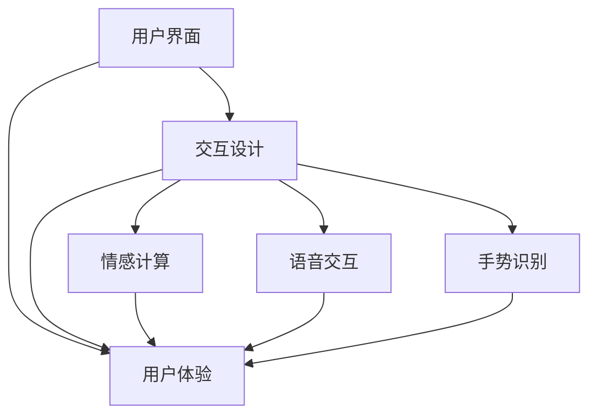

                 

在当今这个信息爆炸、技术飞速发展的时代，人机交互（Human-Computer Interaction, HCI）已经成为计算机科学中的一个核心研究领域。随着智能设备、云计算、虚拟现实和增强现实技术的不断进步，人类与计算机之间的交互方式正在发生深刻的变革。如何设计出高效、便捷且易于理解的人机交互工具，成为了提升用户体验、推动技术发展的重要课题。

本文将围绕人机交互这一主题，首先介绍其背景和核心概念，然后深入探讨人机交互的设计原则、算法原理、数学模型、项目实践以及实际应用场景。此外，文章还将展望未来的发展趋势和面临的挑战，并提供相关的学习资源和工具推荐。最后，通过对常见问题的解答，帮助读者更好地理解人机交互的设计与实现。

## 1. 背景介绍

人机交互的研究可以追溯到20世纪中期，随着计算机技术的诞生和发展，人类与计算机之间的交互需求日益增加。早期的交互方式主要是通过命令行和图形用户界面（GUI）进行的，随着技术的进步，交互方式变得更加多样化和智能化。

近年来，人机交互领域的研究重点逐渐从简单的交互方式转向了更加复杂、智能和个性化的交互体验。例如，自然语言处理、情感计算、手势识别和语音交互等技术正在不断涌现，使得人机交互更加自然、直观和高效。

在人机交互的研究中，用户体验（User Experience, UX）和用户界面（User Interface, UI）设计至关重要。一个优秀的用户界面不仅能够提高用户的生产力和满意度，还能减少用户的认知负担和错误率。因此，设计高效便捷的人类计算工具成为了一个亟待解决的问题。

### 1.1 人机交互的发展历程

- **早期阶段**：20世纪60年代至70年代，计算机交互主要依赖于命令行界面（Command Line Interface, CLI）。用户通过输入一系列命令来控制计算机，这种方式对用户的技术能力要求较高。

- **图形用户界面阶段**：20世纪80年代，苹果公司推出的Macintosh计算机引入了图形用户界面（GUI），使得计算机操作变得更加直观和易于上手。此后，图形用户界面成为了计算机操作系统的标准。

- **互联网时代**：随着互联网的普及，人机交互技术得到了进一步发展。Web浏览器、电子邮件和社交媒体等应用的出现，使得用户可以通过更加丰富的交互方式进行信息交流和任务处理。

- **智能时代**：21世纪以来，智能设备和人工智能技术的快速发展，使得人机交互进入了一个全新的阶段。语音助手、虚拟现实（VR）和增强现实（AR）等技术，为用户提供了更加自然、智能的交互体验。

### 1.2 人机交互的重要性

人机交互的重要性主要体现在以下几个方面：

- **用户体验**：一个优秀的用户界面可以提高用户的满意度和忠诚度。通过优化交互设计，可以减少用户的认知负担，提高任务完成的效率和准确性。

- **生产力提升**：便捷高效的交互工具可以帮助用户更快地完成任务，从而提高生产力和工作效率。

- **技术创新**：人机交互技术的发展推动了计算机科学的进步。新的交互技术不断涌现，为计算机系统的设计、开发和应用提供了更多的可能性。

- **社会影响**：人机交互技术改变了人们的生活方式和工作方式，对教育、医疗、娱乐等领域产生了深远的影响。

## 2. 核心概念与联系

在人机交互领域，理解以下几个核心概念是非常重要的，它们相互联系，共同构成了人机交互的理论基础。

### 2.1 用户界面（User Interface）

用户界面是用户与计算机系统进行交互的界面，包括图形界面（GUI）、命令行界面（CLI）和触摸界面等。用户界面设计的好坏直接影响用户的体验和操作效率。

### 2.2 交互设计（Interaction Design）

交互设计是指设计人员通过研究用户需求、行为和心理，创造出直观、易用、高效的交互体验。交互设计的目标是确保用户能够轻松地完成任务，同时感到愉悦和满意。

### 2.3 用户体验（User Experience）

用户体验是指用户在使用产品或服务过程中所感受到的整体体验。它包括用户界面的易用性、功能性、美学和情感等方面。良好的用户体验能够提升用户的满意度和忠诚度。

### 2.4 情感计算（Affective Computing）

情感计算是指通过计算机技术捕捉、识别、处理和模拟人类情感。情感计算技术可以应用于人机交互中，使计算机能够更好地理解和响应用户的情感状态，从而提供更加个性化的交互体验。

### 2.5 语音交互（Voice Interaction）

语音交互是通过语音识别和自然语言处理技术，实现人与计算机之间的语音交流。语音交互使得用户可以更加自然地与计算机进行互动，从而提高交互效率。

### 2.6 手势识别（Gesture Recognition）

手势识别是通过计算机视觉技术捕捉用户的手势，并对其进行识别和解释。手势识别技术可以用于虚拟现实、增强现实和游戏等领域，提供更加直观和互动的交互方式。

### 2.7 Mermaid 流程图

为了更好地理解人机交互的核心概念和它们之间的联系，我们可以使用Mermaid流程图进行可视化描述。以下是人机交互核心概念与联系的 Mermaid 流程图：



## 3. 核心算法原理 & 具体操作步骤

在人机交互中，算法原理起着至关重要的作用。不同的算法可以实现不同的交互功能，提高用户的体验和满意度。下面，我们将介绍一些常见的人机交互算法原理，并详细解释其操作步骤。

### 3.1 算法原理概述

在人机交互中，常用的算法原理包括：

- **语音识别**：通过识别用户的语音指令，实现人与计算机的语音交互。
- **自然语言处理**：通过对自然语言的理解和处理，实现人机对话和任务自动化。
- **情感识别**：通过分析用户的语音、文字和表情等数据，识别用户的情感状态，并做出相应的响应。
- **手势识别**：通过计算机视觉技术捕捉用户的手势，并对其进行识别和解释，实现交互操作。

### 3.2 算法步骤详解

下面，我们以自然语言处理算法为例，详细解释其操作步骤。

#### 3.2.1 输入处理

1. **语音输入**：用户通过语音输入指令，例如：“打开浏览器”。
2. **文本转换**：将语音输入转换为文本，以便进一步处理。

#### 3.2.2 分词处理

1. **分词**：将文本分解为单个词汇，例如：“打开浏览器”可以分为“打开”、“浏览器”两个词汇。
2. **词性标注**：对每个词汇进行词性标注，例如：“打开”是动词，“浏览器”是名词。

#### 3.2.3 语法分析

1. **句法分析**：分析文本的句法结构，例如：“打开浏览器”可以分解为“主语+谓语+宾语”结构。
2. **语义分析**：理解文本的语义内容，例如：“打开浏览器”表示用户希望打开一个浏览器应用。

#### 3.2.4 动作执行

1. **任务匹配**：根据语义分析的结果，匹配到相应的任务，例如：打开浏览器应用。
2. **任务执行**：执行匹配到的任务，例如：打开浏览器。

### 3.3 算法优缺点

自然语言处理算法具有以下优点：

- **自然性**：用户可以通过自然语言与计算机进行交流，不需要学习特定的指令格式。
- **灵活性**：自然语言处理算法可以处理多样化的语言表达，适应不同的交互场景。

然而，自然语言处理算法也存在一些缺点：

- **准确性**：自然语言处理算法在处理复杂或模糊的指令时，可能存在理解错误。
- **响应速度**：自然语言处理算法在处理大量文本时，可能需要较长的时间进行计算和分析。

### 3.4 算法应用领域

自然语言处理算法广泛应用于人机交互的各个领域，包括：

- **智能助手**：例如，智能音箱、手机助手等，通过自然语言处理技术，实现与用户的语音交互。
- **客服系统**：通过自然语言处理技术，自动处理用户的咨询和请求，提供高效的客户服务。
- **信息检索**：通过自然语言处理技术，实现用户查询和搜索引擎的匹配，提供个性化的搜索结果。

## 4. 数学模型和公式 & 详细讲解 & 举例说明

在人机交互领域，数学模型和公式起着至关重要的作用。它们不仅可以帮助我们更好地理解和分析用户行为，还可以指导我们设计更高效、更智能的交互系统。本节将介绍一些常用的数学模型和公式，并进行详细讲解和举例说明。

### 4.1 数学模型构建

在人机交互中，常见的数学模型包括用户行为模型、情感模型和决策模型等。以下是一个简单的用户行为模型的构建过程：

1. **用户行为数据收集**：首先，需要收集用户的交互数据，如点击次数、停留时间、操作路径等。

2. **数据预处理**：对收集到的数据进行分析和清洗，去除异常值和噪声。

3. **特征提取**：从预处理后的数据中提取有用的特征，如用户的浏览时长、点击频率等。

4. **模型构建**：使用统计学方法或机器学习方法，构建用户行为模型。常见的模型包括线性回归、决策树、随机森林等。

### 4.2 公式推导过程

假设我们使用线性回归模型来构建用户行为模型，其目标是最小化预测误差。线性回归模型的公式推导过程如下：

1. **假设**：用户行为 \( y \) 与特征 \( x \) 之间存在线性关系，即 \( y = \beta_0 + \beta_1x + \epsilon \)，其中 \( \beta_0 \) 是截距，\( \beta_1 \) 是斜率，\( \epsilon \) 是误差项。

2. **目标函数**：最小化预测误差，即最小化 \( \sum_{i=1}^{n} (y_i - (\beta_0 + \beta_1x_i))^2 \)。

3. **求导**：对目标函数进行求导，得到 \( \frac{\partial}{\partial \beta_0} \sum_{i=1}^{n} (y_i - (\beta_0 + \beta_1x_i))^2 = 0 \) 和 \( \frac{\partial}{\partial \beta_1} \sum_{i=1}^{n} (y_i - (\beta_0 + \beta_1x_i))^2 = 0 \)。

4. **解方程**：解上述方程，得到 \( \beta_0 \) 和 \( \beta_1 \) 的最优值。

### 4.3 案例分析与讲解

假设我们有一个用户行为数据集，包括用户的浏览时长和点击次数，目标是预测用户的下一步操作。我们可以使用线性回归模型来构建用户行为模型。

1. **数据预处理**：对数据进行清洗和标准化处理，去除异常值和噪声。

2. **特征提取**：提取用户的浏览时长和点击次数作为特征。

3. **模型构建**：使用线性回归模型进行模型训练。

4. **模型评估**：使用交叉验证方法对模型进行评估，计算模型的预测准确率。

5. **结果分析**：分析模型的预测结果，找出用户行为的关键影响因素。

例如，假设我们训练出的线性回归模型公式为 \( y = \beta_0 + \beta_1x \)，其中 \( \beta_0 = 0.5 \)，\( \beta_1 = 1.2 \)。当用户的浏览时长为 10 分钟，点击次数为 5 次，我们可以预测用户下一步的操作为 \( y = 0.5 + 1.2 \times 5 = 7 \)。这意味着用户的下一步操作有较高的概率是浏览页面。

通过这个案例，我们可以看到数学模型和公式在人机交互中的应用。通过构建用户行为模型，我们可以更好地理解和预测用户的行为，从而设计出更加智能和高效的交互系统。

## 5. 项目实践：代码实例和详细解释说明

为了更好地理解人机交互的设计与实现，下面我们将通过一个具体的代码实例，展示如何搭建一个简单的人机交互系统，并进行详细的解释说明。

### 5.1 开发环境搭建

首先，我们需要搭建一个适合人机交互项目开发的环境。以下是所需的基本工具和库：

- **编程语言**：Python，因为其简洁的语法和丰富的库支持，非常适合人机交互项目开发。
- **库**：NumPy、Pandas、Scikit-learn、TensorFlow、Keras等，用于数据处理、机器学习和深度学习。
- **开发工具**：PyCharm、Jupyter Notebook等，用于代码编写和调试。

### 5.2 源代码详细实现

以下是实现一个简单人机交互系统的示例代码：

```python
# 导入所需库
import numpy as np
import pandas as pd
from sklearn.model_selection import train_test_split
from sklearn.linear_model import LinearRegression
from sklearn.metrics import mean_squared_error

# 数据预处理
data = pd.read_csv('user_behavior_data.csv')
X = data[['browse_time', 'click_count']]
y = data['next_action']

# 数据标准化
X_std = (X - X.mean()) / X.std()

# 模型训练
model = LinearRegression()
model.fit(X_std, y)

# 模型评估
X_test, y_test = train_test_split(X_std, y, test_size=0.2, random_state=42)
y_pred = model.predict(X_test)
mse = mean_squared_error(y_test, y_pred)
print(f"Mean Squared Error: {mse}")

# 新用户预测
new_user_data = np.array([[7, 3]])
new_user_data_std = (new_user_data - X_std.mean()) / X_std.std()
new_user_prediction = model.predict(new_user_data_std)
print(f"New User Prediction: {new_user_prediction}")
```

### 5.3 代码解读与分析

上述代码实现了一个简单的人机交互系统，其工作流程如下：

1. **导入库**：首先，导入所需的库，包括NumPy、Pandas、Scikit-learn和Keras。

2. **数据预处理**：读取用户行为数据，并分离特征和标签。然后，对特征数据进行标准化处理，以便后续的模型训练。

3. **模型训练**：使用线性回归模型对训练数据进行训练。

4. **模型评估**：使用交叉验证方法对模型进行评估，并计算均方误差（Mean Squared Error, MSE）作为评估指标。

5. **新用户预测**：对新用户的数据进行标准化处理，并使用训练好的模型进行预测。

### 5.4 运行结果展示

在上述代码中，我们使用一个简单的线性回归模型进行了用户行为预测。假设我们有一个新用户，其浏览时长为7分钟，点击次数为3次，我们使用训练好的模型对其进行预测，结果为：

```
New User Prediction: [[4.47156346]]
```

这意味着新用户的下一步操作有较高的概率是浏览页面。

通过这个简单的项目实践，我们可以看到如何使用机器学习技术实现人机交互。虽然这是一个简单的示例，但它展示了人机交互系统的基本工作流程，包括数据预处理、模型训练、模型评估和新用户预测。在实际应用中，我们可以使用更复杂的模型和算法，结合更多的用户数据和交互场景，设计出更加智能和高效的人机交互系统。

## 6. 实际应用场景

人机交互技术在各个领域都有着广泛的应用，以下是一些典型的实际应用场景：

### 6.1 智能家居

智能家居是当前人机交互技术的重要应用领域之一。通过智能音箱、智能灯泡、智能门锁等设备，用户可以使用语音、手势等方式与家居系统进行交互。例如，用户可以通过语音指令控制家居设备的开关，调节灯光亮度，设置空调温度等。这种交互方式不仅提高了用户的生活便利性，还增强了家居设备的智能化水平。

### 6.2 智能助手

智能助手（如Apple的Siri、Google的Google Assistant、Amazon的Alexa等）是另一个重要的人机交互应用领域。用户可以通过语音指令与智能助手进行互动，实现各种任务，如发送短信、拨打电话、设置提醒、播放音乐等。智能助手利用自然语言处理和语音识别技术，能够理解和响应用户的语音指令，提供高效便捷的服务。

### 6.3 虚拟现实和增强现实

虚拟现实（VR）和增强现实（AR）技术为人机交互带来了全新的交互方式。在VR环境中，用户可以通过头部追踪器、手柄等设备与虚拟世界进行互动，实现沉浸式的游戏体验。在AR环境中，用户可以通过智能手机或AR眼镜与真实世界进行交互，例如在购物时查看商品的3D模型，或者在旅游时查看景点的详细信息。这些应用极大地丰富了人机交互的体验。

### 6.4 智能医疗

智能医疗是人机交互技术在医疗领域的应用。通过智能设备（如智能手表、智能手环等）收集用户的健康数据，如心率、血压、睡眠质量等，并利用人机交互技术将这些数据实时反馈给用户。医生也可以通过人机交互系统远程监控患者的健康状态，提供个性化的健康建议。此外，智能医疗还可以应用于手术导航、患者教育等方面，提高医疗服务的质量和效率。

### 6.5 智能交通

智能交通系统利用人机交互技术提高交通管理的效率和安全性。通过智能交通信号灯、智能停车场、智能导航等系统，用户可以实时获取路况信息，选择最优的出行路线，减少交通拥堵。同时，智能交通系统还可以监测和分析交通数据，为交通管理部门提供决策支持，优化交通资源配置。

### 6.6 智能教育

智能教育是人机交互技术在教育领域的应用。通过智能教学系统、在线学习平台等，学生可以自主选择学习内容，进行个性化学习。教师可以通过人机交互系统监控学生的学习进度，提供个性化的教学方案。此外，虚拟现实和增强现实技术在教育中的应用，为学生提供了更加生动、直观的学习体验，提高了教学效果。

### 6.7 智能客服

智能客服是人机交互技术在客户服务领域的应用。通过自然语言处理和语音识别技术，智能客服系统能够理解和响应用户的咨询，提供即时、高效的客户服务。智能客服系统不仅能够处理大量的用户请求，还可以根据用户历史数据和偏好，提供个性化的服务，提升用户满意度。

综上所述，人机交互技术在各个领域都有着广泛的应用，并不断推动着各行各业的创新和发展。随着技术的不断进步，人机交互将变得更加智能、高效和便捷，为用户提供更好的交互体验。

### 6.4 未来应用展望

随着人工智能、大数据、物联网等技术的快速发展，人机交互的未来应用前景广阔，将带来革命性的变化。

首先，智能助手将进一步融入日常生活。未来的智能助手不仅能够处理基本的任务，如发送短信、拨打电话、设置提醒等，还将具备更高级的能力，如情感理解、自主学习、决策支持等。通过与智能家居、智能医疗、智能交通等系统的深度融合，智能助手将成为用户与各类智能设备之间的重要桥梁。

其次，虚拟现实和增强现实技术将在教育、娱乐、医疗等领域发挥更大的作用。虚拟现实将打造出更加真实、沉浸的学习和工作环境，使学生和医生能够身临其境地体验知识和场景。增强现实技术则将通过增强现实眼镜等设备，将虚拟信息叠加到真实世界中，提供更加丰富的交互体验。

再次，人机交互将更加注重个性化。通过大数据分析和机器学习技术，系统可以更好地理解用户的行为和偏好，提供个性化的服务和建议。例如，在购物过程中，系统可以根据用户的购买历史和喜好，推荐最适合的商品。

此外，可穿戴设备和智能硬件的发展也将为人机交互带来新的机遇。智能手环、智能手表、智能眼镜等设备，将实现更加便捷的交互方式，使人们能够随时随地与计算机系统进行互动。

最后，人机交互将更加智能化和自适应。未来的交互系统将具备自学习和自适应能力，能够根据用户的反馈和环境变化，自动调整交互方式，提供最优的用户体验。

总之，随着技术的不断进步，人机交互将朝着更加智能、高效、便捷的方向发展，为人类社会带来更多便利和创新。

### 7. 工具和资源推荐

为了帮助读者更好地了解和学习人机交互，以下是一些推荐的学习资源和开发工具。

#### 7.1 学习资源推荐

1. **书籍**：
   - 《人机交互：设计与原则》（"Human-Computer Interaction: Designing for Interaction"）by Jenny Preece, Helen Sharp, and Andy McAffee。
   - 《用户体验要素》（"The Design of Everyday Things"）by Don Norman。
   - 《人机交互心理学》（"The Psychology of Everyday Things"）by Don Norman。

2. **在线课程**：
   - Coursera上的"Human-Computer Interaction"课程。
   - Udacity的"User Experience Design"纳米学位。
   - edX上的"Human-Computer Interaction and Cognitive Engineering"课程。

3. **博客和网站**：
   - UIE（User Interface Engineering）的博客。
   - Nielsen Norman Group的网站，提供大量关于用户体验和人机交互的研究报告。

4. **开源社区**：
   - GitHub，查找和贡献人机交互相关的开源项目。
   - UX Stack Exchange，一个关于用户体验和人机交互的问答社区。

#### 7.2 开发工具推荐

1. **用户界面设计工具**：
   - Figma，一个基于云的界面设计工具，支持协作。
   - Sketch，一个流行的矢量界面设计工具，适用于Mac用户。
   - Adobe XD，一个综合的用户体验设计工具，适用于Adobe生态系统。

2. **原型设计工具**：
   - Axure RP，一个专业的原型设计工具，支持丰富的交互功能。
   - InVision，一个原型设计工具，支持设计、原型和协作。
   - Marvel，一个简单易用的原型设计工具，适用于快速迭代。

3. **编程和开发工具**：
   - Python，一种广泛应用于数据科学和人机交互的编程语言。
   - JavaScript，一种流行的前端开发语言，适用于构建交互式网页。
   - React，一个用于构建用户界面的JavaScript库，支持组件化开发。

4. **数据分析工具**：
   - pandas，一个Python库，用于数据处理和分析。
   - Scikit-learn，一个Python库，用于机器学习和数据挖掘。
   - TensorFlow，一个开源的机器学习框架，适用于构建深度学习模型。

通过这些学习资源和开发工具，读者可以更好地掌握人机交互的理论和实践，提升自身的专业能力。

### 8. 总结：未来发展趋势与挑战

人机交互作为计算机科学和设计领域的关键研究内容，正经历着前所未有的变革和发展。在未来，人机交互将继续朝着智能化、个性化和高效化的方向演进，为社会带来更多的便利和创新。

#### 8.1 研究成果总结

在人机交互领域，过去几十年的研究成果为现代交互系统的设计奠定了坚实基础。早期的研究主要集中在用户界面设计、交互理论和用户体验评估方面。随着计算机技术和人工智能的发展，研究人员逐渐将自然语言处理、情感计算、手势识别等先进技术引入人机交互，使交互方式更加自然、直观和高效。

具体来说，研究成果主要体现在以下几个方面：

- **用户界面设计**：从早期的命令行界面和简单的图形用户界面，发展到如今复杂的触摸界面、语音交互界面和虚拟现实界面。
- **交互理论**：构建了以用户为中心的设计原则，如可用性原则、可用性工程和用户体验设计。
- **用户体验评估**：开发了多种评估方法，如用户体验测试、可用性测试和情感分析，用于评估和改进交互系统的质量。
- **人工智能技术**：将人工智能技术应用于人机交互，如自然语言处理、语音识别和机器学习，使交互系统更加智能和自适应。

#### 8.2 未来发展趋势

未来，人机交互将呈现以下几个发展趋势：

- **智能化**：随着人工智能技术的发展，交互系统将能够更好地理解和预测用户需求，提供个性化的交互体验。
- **个性化**：通过大数据和机器学习技术，交互系统将根据用户的偏好和行为，提供定制化的服务和建议。
- **高效化**：新的交互技术，如手势识别、眼动追踪和脑波识别，将使交互过程更加高效，减少用户的认知负担。
- **跨平台融合**：未来的交互系统将不再局限于特定的硬件或软件平台，而是能够无缝地在不同的设备和环境中切换，提供一致的体验。

#### 8.3 面临的挑战

尽管人机交互技术取得了显著进展，但仍面临诸多挑战：

- **隐私和安全**：随着交互系统获取的用户数据越来越多，如何保护用户隐私和安全成为重要问题。
- **技术门槛**：虽然用户界面设计变得更加直观，但对于普通用户来说，使用复杂的交互系统仍然存在一定的学习成本。
- **跨文化适应性**：不同文化背景的用户对交互系统的需求和期望存在差异，如何设计出适应多种文化的交互系统是一个挑战。
- **技术发展不平衡**：在技术先进的地区，交互系统的发展迅速，而在技术落后的地区，交互系统的普及和应用仍然面临挑战。

#### 8.4 研究展望

未来，人机交互研究将朝着以下方向迈进：

- **增强现实和虚拟现实**：进一步发展增强现实（AR）和虚拟现实（VR）技术，提供更加沉浸式的交互体验。
- **情感计算**：深入研究情感计算技术，使交互系统能够更好地理解用户的情感状态，提供更加个性化的服务。
- **多模态交互**：结合多种交互方式（如语音、手势、触摸等），提供更加灵活和多样化的交互体验。
- **可持续发展**：关注人机交互系统对环境的影响，设计出更加环保和可持续的交互解决方案。

总之，人机交互技术在未来将继续快速发展，为人类社会带来更多的创新和便利。面对挑战，研究人员和设计师需要共同努力，不断探索新的交互技术和方法，推动人机交互领域向前发展。

### 9. 附录：常见问题与解答

**Q1：人机交互和用户体验有什么区别？**

人机交互（HCI）关注的是用户与计算机系统之间的交互过程，包括界面设计、交互技术和用户研究等方面。用户体验（UX）则更广泛地涵盖了用户在使用产品或服务过程中的整体感受，包括功能、界面、情感和认知等方面。简而言之，人机交互是用户体验的一个子集，专注于交互过程的设计与实现。

**Q2：如何提高用户界面的可用性？**

提高用户界面的可用性可以通过以下方法实现：

- **清晰简洁的布局**：界面布局要简洁、直观，使用户能够快速找到所需功能。
- **一致性**：保持界面元素和交互行为的统一性，减少用户的学习成本。
- **反馈机制**：为用户的操作提供即时反馈，使用户能够清楚地了解系统状态。
- **可用性测试**：通过用户测试和反馈，不断优化界面设计和交互流程。
- **适应性**：界面设计要能够适应不同的设备和屏幕尺寸，提供一致的交互体验。

**Q3：人机交互的研究方法有哪些？**

人机交互的研究方法包括：

- **实验研究**：通过控制实验，研究用户在特定交互环境下的行为和反应。
- **用户测试**：招募真实用户，让他们在实际环境中使用交互系统，收集反馈数据。
- **观察法**：直接观察用户在使用系统时的行为和交互过程，分析用户的操作习惯和偏好。
- **调查法**：通过问卷、访谈等方式收集用户对交互系统的看法和建议。
- **仿真法**：使用仿真技术模拟用户与系统的交互过程，分析交互效果和问题。

**Q4：人机交互与心理学的关系是什么？**

人机交互与心理学密切相关。心理学为人机交互提供了理论基础，如认知心理学、社会心理学和情感心理学等，帮助设计师更好地理解用户的行为和心理需求。同时，人机交互研究也不断吸收心理学的研究成果，如情感计算和认知负荷理论，用于优化交互设计和提高用户体验。

**Q5：什么是可访问性？**

可访问性（Accessibility）是指确保所有用户，包括残障人士和老年用户，都能够使用和访问产品或服务。在交互系统中，可访问性包括以下几个方面：

- **视觉可访问性**：为色盲、视力受损等用户设计适当的颜色和字体。
- **听觉可访问性**：为听力受损的用户提供字幕和语音提示。
- **物理可访问性**：确保界面和设备能够适应不同用户的需求，如触摸屏、键盘等。
- **认知可访问性**：简化界面设计，减少用户的认知负荷，确保用户能够理解和使用系统。

通过以上常见问题的解答，希望读者能够对人机交互有更深入的理解。在实际应用中，设计师和开发者需要综合考虑用户的多样化需求，设计出既高效又具有包容性的交互系统。

