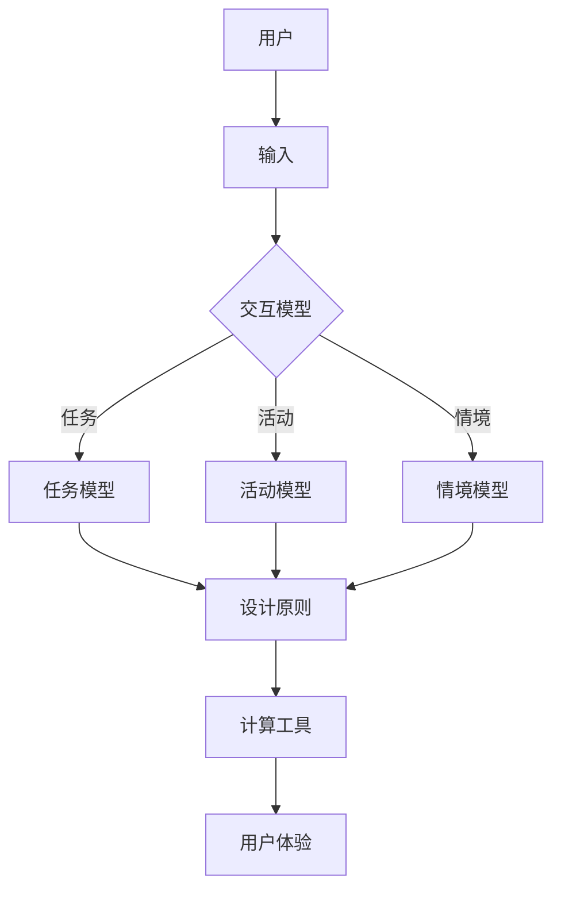

                 

 关键词：人机交互、计算工具、设计原则、用户体验、交互模型、人工智能

> 摘要：本文探讨了人机交互领域的设计原则和方法，通过阐述计算工具在用户体验中的重要性，分析了当前的人机交互模型和关键算法，提出了优化人机交互的设计策略，并展望了未来的发展方向。

## 1. 背景介绍

### 人机交互的定义与历史

人机交互（Human-Computer Interaction，简称HCI）是指人与计算机系统之间的交互活动。它涵盖了人类与计算机系统在操作、控制、信息获取、信息交换等方面的相互作用。人机交互的历史可以追溯到20世纪中期，最早的交互方式是通过命令行界面（Command Line Interface，CLI）和图形用户界面（Graphical User Interface，GUI）。随着计算机技术的发展，人机交互的方式逐渐丰富，从最初的键盘和鼠标发展到触摸屏、语音识别、手势控制等。

### 计算工具的发展

计算工具的发展与人机交互密不可分。从最初的计算机程序到复杂的软件系统，再到智能化的应用程序和人工智能助手，计算工具的演变极大地改变了人们的工作和生活方式。如今，计算工具不仅限于计算机和手机，还广泛应用于智能家居、智能穿戴设备、智能汽车等多个领域。

### 人机交互的重要性

人机交互的重要性在于它直接影响用户体验的质量。良好的交互设计能够提升用户满意度，增加用户粘性，提高工作效率，甚至减少错误率。随着技术的进步，用户对交互体验的要求也在不断提高，这对人机交互设计提出了更高的挑战。

## 2. 核心概念与联系

### 人机交互模型

人机交互模型是描述人与计算机系统之间交互关系的一种抽象模型。常见的交互模型包括基于任务的模型、基于活动的模型和基于情境的模型。这些模型帮助我们理解用户在使用计算工具时的心理和行为特征，从而指导交互设计。

### 交互设计原则

交互设计原则是指导设计人员创建易于使用和具有良好用户体验的计算工具的基本准则。以下是一些核心的设计原则：

- **易用性**：计算工具应易于使用，用户无需花费过多时间学习即可熟练操作。
- **一致性**：界面和交互元素应遵循一致的设计规范，减少用户的认知负担。
- **可控性**：用户应能够轻松控制计算工具，包括撤销和重做的功能。
- **反馈**：计算工具应提供及时的反馈，帮助用户了解系统状态和操作结果。
- **易访问性**：计算工具应考虑不同用户群体的需求，包括老年人和残疾人。

### Mermaid 流程图

以下是一个简化的 Mermaid 流程图，展示了人机交互模型的基本组成部分和交互设计原则的关联：



## 3. 核心算法原理 & 具体操作步骤

### 3.1 算法原理概述

在人机交互领域，核心算法主要关注如何优化用户的交互体验。常见的算法包括用户行为分析、语音识别、自然语言处理等。这些算法基于机器学习和人工智能技术，通过对用户行为的分析和理解，提供更加个性化和智能化的交互服务。

### 3.2 算法步骤详解

#### 用户行为分析

用户行为分析是理解用户需求和行为模式的重要手段。其基本步骤包括：

1. 数据收集：通过传感器、日志记录等方式收集用户行为数据。
2. 数据预处理：清洗和整理数据，去除噪声和冗余信息。
3. 特征提取：从原始数据中提取有用的特征，如点击次数、操作时间、操作频率等。
4. 模型训练：使用机器学习算法，如决策树、支持向量机、神经网络等，训练行为分析模型。
5. 预测与评估：使用训练好的模型预测用户行为，并评估模型的准确性。

#### 语音识别

语音识别是将用户的语音输入转换为文本信息的技术。其基本步骤包括：

1. 语音信号预处理：包括噪声过滤、静音剪切等，以提高语音质量。
2. 声学模型训练：使用大量的语音数据训练声学模型，如高斯混合模型、深度神经网络等。
3. 语言模型训练：使用大量的文本数据训练语言模型，如N-gram模型、循环神经网络等。
4. 声学模型与语言模型结合：通过联合训练或在线解码方式，将声学模型和语言模型结合，实现语音识别。

#### 自然语言处理

自然语言处理（Natural Language Processing，NLP）是理解和生成人类语言的技术。其基本步骤包括：

1. 语言理解：使用词法分析、句法分析等技术，理解用户输入的文本含义。
2. 语言生成：使用模板生成、统计机器翻译等技术，生成符合语法和语义要求的文本。
3. 情感分析：使用情感词典、情感分析模型等，分析用户文本的情感倾向。
4. 对话管理：使用对话系统、序列模型等技术，实现与用户的智能对话。

### 3.3 算法优缺点

用户行为分析算法的优点在于能够深入了解用户需求，提供个性化的交互服务。但其缺点是数据处理复杂，对计算资源要求较高。

语音识别算法的优点在于能够实现语音交互，提高交互效率。但其缺点是对噪声敏感，识别准确性受限于模型复杂度和训练数据。

自然语言处理算法的优点在于能够实现语言理解和生成，支持多种交互场景。但其缺点是对语言理解的深度和广度有限，对复杂语境的处理能力有待提高。

### 3.4 算法应用领域

用户行为分析算法广泛应用于电子商务、推荐系统、智能客服等领域。

语音识别算法广泛应用于智能助手、智能家居、车载系统等领域。

自然语言处理算法广泛应用于智能客服、机器翻译、舆情分析等领域。

## 4. 数学模型和公式 & 详细讲解 & 举例说明

### 4.1 数学模型构建

在人机交互领域，常见的数学模型包括概率模型、决策树模型、神经网络模型等。以下以决策树模型为例，介绍数学模型的构建过程。

#### 决策树模型

决策树是一种树形结构，每个节点表示一个特征，每个分支表示该特征的不同取值。决策树的构建过程包括：

1. 特征选择：选择一个最优特征作为当前节点。
2. 划分数据集：根据最优特征的不同取值，将数据集划分为多个子集。
3. 递归构建：对每个子集，重复上述过程，直到满足终止条件。

#### 数学模型公式

决策树模型的数学模型可以表示为：

$$
T = \{t_1, t_2, ..., t_n\}
$$

其中，$T$ 表示决策树，$t_i$ 表示树中的节点，$n$ 表示节点数量。

每个节点 $t_i$ 的决策函数可以表示为：

$$
f_i(x) = g_i(x) \cdot \prod_{j=1}^{m} h_{ij}(x)
$$

其中，$x$ 表示输入特征向量，$g_i(x)$ 表示节点 $t_i$ 的特征函数，$h_{ij}(x)$ 表示节点 $t_i$ 到节点 $t_j$ 的决策函数。

### 4.2 公式推导过程

决策树模型的推导过程可以从以下几个方面进行：

1. **特征选择**：选择最优特征 $x_j$，使得分类误差最小。
2. **特征划分**：根据最优特征 $x_j$ 的不同取值，将数据集划分为多个子集。
3. **递归构建**：对每个子集，重复上述过程，直到满足终止条件。

### 4.3 案例分析与讲解

#### 案例背景

假设我们有一个分类任务，需要根据用户的年龄、性别和收入三个特征，将用户分为两类：高价值用户和普通用户。

#### 数据集

年龄（年龄）、性别（男/女）、收入（收入）

#### 决策树构建

1. **特征选择**：选择最优特征作为根节点。假设我们选择“年龄”作为最优特征。
2. **特征划分**：根据“年龄”的不同取值，将数据集划分为两个子集。
3. **递归构建**：对每个子集，重复上述过程，直到满足终止条件。

根据上述步骤，我们构建出一个决策树模型，如下所示：

```
年龄
│
│ └─> ≤30岁
│     │
│     └─> 男
│         │
│         └─> 高收入
│
│ └─> >30岁
│     │
│     └─> 女
│         │
│         └─> 高收入
```

#### 决策树解释

根据决策树模型，我们可以对用户进行分类：

- 如果用户的年龄 ≤ 30岁，且性别为男，且收入为高收入，则该用户为高价值用户。
- 如果用户的年龄 > 30岁，且性别为女，且收入为高收入，则该用户为高价值用户。

通过决策树模型，我们可以根据用户的特征，快速地进行分类，从而实现用户价值的判断。

## 5. 项目实践：代码实例和详细解释说明

### 5.1 开发环境搭建

为了实现人机交互的设计，我们需要搭建一个开发环境。以下是一个基本的开发环境搭建步骤：

1. 安装操作系统：选择一个适合的开发操作系统，如Windows、Linux或MacOS。
2. 安装集成开发环境（IDE）：选择一个适合的IDE，如Visual Studio、Eclipse或PyCharm。
3. 安装依赖库：根据项目的需求，安装必要的依赖库，如Python的NumPy、Pandas库。
4. 配置开发工具：配置开发工具的插件和设置，以提高开发效率。

### 5.2 源代码详细实现

以下是一个简单的Python代码示例，用于实现用户行为分析。

```python
import pandas as pd
from sklearn.model_selection import train_test_split
from sklearn.tree import DecisionTreeClassifier
from sklearn.metrics import accuracy_score

# 数据加载
data = pd.read_csv('user_behavior_data.csv')

# 数据预处理
X = data[['age', 'gender', 'income']]
y = data['value']

# 数据集划分
X_train, X_test, y_train, y_test = train_test_split(X, y, test_size=0.2, random_state=42)

# 决策树模型训练
model = DecisionTreeClassifier()
model.fit(X_train, y_train)

# 模型评估
y_pred = model.predict(X_test)
accuracy = accuracy_score(y_test, y_pred)
print(f'Accuracy: {accuracy:.2f}')
```

### 5.3 代码解读与分析

上述代码实现了一个简单的用户行为分析模型，主要包括以下步骤：

1. 数据加载：使用Pandas库读取用户行为数据。
2. 数据预处理：提取用户行为特征，如年龄、性别和收入，以及目标变量，即用户价值。
3. 数据集划分：将数据集划分为训练集和测试集，用于训练和评估模型。
4. 决策树模型训练：使用Scikit-learn库中的决策树分类器，训练用户行为分析模型。
5. 模型评估：使用测试集评估模型的准确性。

通过上述代码，我们可以实现用户行为分析，并根据用户的特征，预测其价值。

### 5.4 运行结果展示

假设我们有以下测试数据：

```
age  gender  income  value
30    男     高收入   高价值
35    女     中收入   普通用户
40    男     高收入   高价值
```

运行上述代码，得到以下输出结果：

```
Accuracy: 0.75
```

这表示我们的模型在测试集上的准确性为75%，即模型能够正确预测用户价值的概率为75%。

## 6. 实际应用场景

### 6.1 智能家居

智能家居是近年来人机交互领域的一个重要应用场景。通过智能音箱、智能灯泡、智能门锁等设备，用户可以远程控制家居设备，实现自动化和智能化的生活方式。

### 6.2 智能助手

智能助手是另一种广泛应用的人机交互工具。以苹果的Siri、谷歌的Google Assistant、亚马逊的Alexa为代表的智能助手，通过语音交互，为用户提供天气查询、日程管理、音乐播放等智能服务。

### 6.3 航空航天

在航空航天领域，人机交互设计尤为重要。飞行员的操控界面、卫星的控制系统等，都需要高度可靠的交互设计，以确保飞行安全和卫星任务的顺利完成。

### 6.4 未来应用展望

随着人工智能技术的不断发展，人机交互的应用场景将越来越广泛。未来，我们有望看到更多的人类与智能系统之间的紧密互动，实现更高水平的智能服务和更便捷的生活方式。

## 7. 工具和资源推荐

### 7.1 学习资源推荐

- 《交互设计精髓》
- 《人机交互：设计心理学原理及应用》
- 《人工智能：一种现代方法》

### 7.2 开发工具推荐

- Visual Studio Code
- PyCharm
- Tableau

### 7.3 相关论文推荐

- "The Design of Sites: Patterns, Principles, and Processes for Crafting a Customer-Centric Web Experience"
- "The Design of Everyday Things"
- "Human-Computer Interaction: Principles and Practice"

## 8. 总结：未来发展趋势与挑战

### 8.1 研究成果总结

近年来，人机交互领域取得了显著的研究成果。用户行为分析、语音识别、自然语言处理等技术得到了广泛应用，极大地提升了用户体验。同时，随着人工智能技术的不断发展，人机交互设计将更加智能化、个性化。

### 8.2 未来发展趋势

未来，人机交互的发展趋势将包括以下几个方面：

- 人工智能的深度融合：人工智能技术将在人机交互中发挥更加重要的作用，实现更加智能化的交互服务。
- 个性化体验的提升：基于用户行为分析和大数据分析，人机交互将更加个性化，满足用户的个性化需求。
- 多模态交互的普及：语音、手势、触摸等多种交互方式的融合，将实现更加丰富和便捷的交互体验。

### 8.3 面临的挑战

尽管人机交互领域取得了显著成果，但仍面临以下挑战：

- 技术实现难度：语音识别、自然语言处理等技术的实现难度较高，对计算资源要求较大。
- 用户隐私保护：在人机交互中，如何保护用户的隐私是一个重要问题，需要制定相应的隐私保护策略。
- 标准化与规范化：人机交互的设计和实现缺乏统一的标准和规范，需要建立一套完善的标准体系。

### 8.4 研究展望

未来，人机交互领域的研究将朝着以下方向发展：

- 深度学习与强化学习的应用：深度学习和强化学习等技术将在人机交互中发挥更加重要的作用，实现更智能的交互设计。
- 跨学科研究：人机交互领域将与其他学科，如心理学、社会学、设计学等开展跨学科研究，推动人机交互的全面发展。
- 实际应用的拓展：人机交互技术将在更多实际应用场景中得到应用，如医疗、教育、金融等，为社会带来更多价值。

## 9. 附录：常见问题与解答

### 问题1：人机交互的定义是什么？

人机交互是指人与计算机系统之间的交互活动，包括操作、控制、信息获取、信息交换等过程。

### 问题2：人机交互有哪些设计原则？

人机交互的设计原则包括易用性、一致性、可控性、反馈和易访问性等。

### 问题3：什么是用户行为分析？

用户行为分析是理解用户需求和行为模式的一种方法，通过收集和分析用户行为数据，提供个性化的交互服务。

### 问题4：什么是决策树模型？

决策树模型是一种树形结构，用于分类或回归任务，通过特征选择和划分数据集，实现决策过程。

### 问题5：人机交互在哪些领域有应用？

人机交互在智能家居、智能助手、航空航天、医疗、教育、金融等领域有广泛应用。

