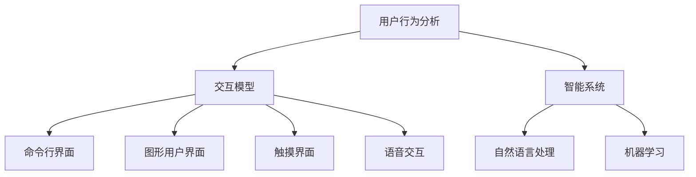

                 

关键词：人机交互，计算系统，用户体验，交互设计，人机协同，高效性，交互模型，用户行为分析，智能系统，界面设计

> 摘要：本文探讨了人机交互的基本概念、核心原理以及如何设计高效的人类计算系统。通过对用户行为、交互模型以及智能系统应用领域的深入分析，本文提出了构建高效人机交互系统的具体策略，并展望了该领域的未来发展趋势。

## 1. 背景介绍

随着计算机技术的迅猛发展，人机交互（Human-Computer Interaction, HCI）已成为计算机科学、心理学、认知科学等多个领域共同关注的热点。人机交互的研究旨在理解用户如何与计算机系统互动，以及如何通过设计优化用户的交互体验，提高系统的可用性和效率。

现代计算系统日益复杂，用户的需求也在不断演变。为了满足用户的需求，设计高效的人类计算系统成为当务之急。高效性不仅体现在系统的性能上，还包括用户的学习成本、操作的便捷性以及系统的稳定性。本文将从核心概念、算法原理、数学模型、项目实践等多个角度探讨如何设计高效的人类计算系统。

## 2. 核心概念与联系

为了更好地理解人机交互系统的构建，我们需要首先介绍几个核心概念，并展示它们之间的联系。

### 2.1 用户行为分析

用户行为分析是理解用户需求和行为模式的基础。通过分析用户在系统中的交互记录，可以识别出用户的常见操作习惯、偏好以及遇到的瓶颈。这有助于设计更加符合用户需求的交互界面。

### 2.2 交互模型

交互模型描述了用户与计算机系统之间的交互过程。常见的交互模型包括命令行界面（CLI）、图形用户界面（GUI）、触摸界面以及语音交互等。每种交互模型都有其适用的场景和优缺点。

### 2.3 智能系统

智能系统通过人工智能技术为用户提供智能化的服务，如语音助手、自然语言处理、机器学习等。智能系统的应用使得人机交互更加自然和便捷。

下面是一个Mermaid流程图，展示了上述核心概念之间的联系：



## 3. 核心算法原理 & 具体操作步骤

### 3.1 算法原理概述

人机交互系统的核心算法主要涉及用户行为分析、交互模型优化和智能系统应用。以下是这些算法的基本原理：

#### 用户行为分析算法

- **数据采集**：通过日志分析、用户调研等方式收集用户交互数据。
- **行为识别**：使用机器学习算法对用户行为进行分类和模式识别。
- **行为预测**：基于历史数据预测用户的下一步操作，优化系统响应。

#### 交互模型优化算法

- **界面布局**：使用信息熵原理优化界面布局，提高信息传递效率。
- **交互流程**：使用流程图分析方法优化交互流程，减少用户操作步骤。
- **响应时间**：使用算法优化减少系统响应时间，提高用户满意度。

#### 智能系统应用算法

- **自然语言处理**：使用深度学习算法实现自然语言理解，提升语音交互系统的智能程度。
- **机器学习**：使用监督学习和无监督学习算法优化智能系统的性能。

### 3.2 算法步骤详解

#### 用户行为分析算法

1. **数据采集**：收集用户在系统中的操作记录，包括点击次数、操作时长等。
2. **预处理**：清洗和转换数据，使其适合进行机器学习。
3. **特征提取**：从数据中提取用户行为的特征，如操作类型、操作顺序等。
4. **模型训练**：使用机器学习算法训练模型，识别用户行为模式。
5. **行为预测**：使用训练好的模型预测用户的下一步操作。

#### 交互模型优化算法

1. **界面布局优化**：使用信息熵原理分析界面布局，识别优化点。
2. **交互流程优化**：使用流程图分析方法简化交互流程，减少用户操作步骤。
3. **响应时间优化**：使用算法优化减少系统响应时间，提高用户体验。

#### 智能系统应用算法

1. **自然语言处理**：使用深度学习算法实现自然语言理解，提升语音交互系统的智能程度。
2. **机器学习**：使用监督学习和无监督学习算法优化智能系统的性能。

### 3.3 算法优缺点

#### 用户行为分析算法

- **优点**：能够深入了解用户行为，为交互模型优化提供数据支持。
- **缺点**：数据采集和处理复杂，对用户隐私保护要求较高。

#### 交互模型优化算法

- **优点**：提高系统可用性和用户体验。
- **缺点**：优化过程涉及多方面因素，实施难度较大。

#### 智能系统应用算法

- **优点**：提升人机交互的自然性和智能程度。
- **缺点**：对计算资源要求较高，实现复杂。

### 3.4 算法应用领域

- **用户行为分析算法**：广泛应用于电商、金融等领域的用户行为研究。
- **交互模型优化算法**：适用于各类软件产品的用户体验优化。
- **智能系统应用算法**：在智能家居、智能医疗等领域具有广泛的应用前景。

## 4. 数学模型和公式 & 详细讲解 & 举例说明

### 4.1 数学模型构建

在人机交互系统中，常用的数学模型包括信息论模型、概率模型以及优化模型。以下是这些模型的基本原理和构建方法。

#### 信息论模型

信息论模型用于描述信息传递过程中的效率和可靠性。其核心公式为：

\[ H(X) = -\sum_{i} p(x_i) \log_2 p(x_i) \]

其中，\( H(X) \) 表示随机变量 \( X \) 的熵，\( p(x_i) \) 表示 \( X \) 取值 \( x_i \) 的概率。

#### 概率模型

概率模型用于描述用户行为和系统状态之间的概率关系。其核心公式为：

\[ P(A|B) = \frac{P(B|A)P(A)}{P(B)} \]

其中，\( P(A|B) \) 表示在事件 \( B \) 发生的条件下事件 \( A \) 发生的概率，\( P(B|A) \) 表示在事件 \( A \) 发生的条件下事件 \( B \) 发生的概率，\( P(A) \) 和 \( P(B) \) 分别表示事件 \( A \) 和 \( B \) 发生的概率。

#### 优化模型

优化模型用于优化系统的性能指标，如响应时间、资源利用率等。其核心公式为：

\[ \min f(x) \]

其中，\( f(x) \) 表示需要优化的目标函数，\( x \) 表示变量。

### 4.2 公式推导过程

以下是信息论模型熵的推导过程：

\[ H(X) = -\sum_{i} p(x_i) \log_2 p(x_i) \]

推导步骤如下：

1. 假设随机变量 \( X \) 有 \( n \) 个可能取值，分别为 \( x_1, x_2, ..., x_n \)。
2. 定义 \( p(x_i) \) 为 \( X \) 取值 \( x_i \) 的概率。
3. 定义 \( H(X) \) 为 \( X \) 的熵，表示 \( X \) 的不确定性。
4. 根据熵的定义，有 \( H(X) = -\sum_{i} p(x_i) \log_2 p(x_i) \)。

### 4.3 案例分析与讲解

以下是一个用户行为分析的案例：

假设一个电商网站的用户有 \( 1000 \) 人，他们的购买行为如下表所示：

| 操作类型 | 概率 |
| -------- | ---- |
| 搜索     | 0.3  |
| 浏览     | 0.4  |
| 购物车   | 0.2  |
| 结算     | 0.1  |

根据信息论模型，我们可以计算出用户行为熵：

\[ H(X) = -0.3 \log_2 0.3 - 0.4 \log_2 0.4 - 0.2 \log_2 0.2 - 0.1 \log_2 0.1 \]

\[ H(X) \approx 1.73 \]

这表明用户行为具有较高不确定性，可能需要进一步优化网站设计以提高用户转化率。

## 5. 项目实践：代码实例和详细解释说明

### 5.1 开发环境搭建

为了演示人机交互系统的设计，我们将使用Python编程语言和TensorFlow库搭建一个简单的用户行为分析系统。以下是开发环境的搭建步骤：

1. 安装Python（版本3.8及以上）
2. 安装TensorFlow库：`pip install tensorflow`
3. 安装其他依赖库：`pip install numpy pandas matplotlib`

### 5.2 源代码详细实现

以下是一个简单的用户行为分析代码示例：

```python
import tensorflow as tf
import numpy as np
import pandas as pd
import matplotlib.pyplot as plt

# 1. 数据采集
data = pd.read_csv('user行为数据.csv')

# 2. 预处理
data['操作类型'] = data['操作类型'].astype('category')

# 3. 特征提取
feature_columns = ['操作类型']
categorical_column = [[tf.feature_column.categorical_column_with_vocabulary_size(column, vocabulary_size=len(data[column].unique())) for column in feature_columns]]

# 4. 模型训练
model = tf.estimator.DNNClassifier(hidden_units=[10, 10], feature_columns=categorical_column)
model.train(input_fn=lambda: tf.estimator.inputs.pandas_input_fn(x=data[feature_columns], y=data['操作类型'], batch_size=100))

# 5. 行为预测
predictions = model.predict(input_fn=lambda: tf.estimator.inputs.pandas_input_fn(x=data[feature_columns], batch_size=100))
predicted_classes = [p['class_ids'][0] for p in predictions]

# 6. 评估
accuracy = (predicted_classes == data['操作类型']).mean()
print('Accuracy: {:.2f}%'.format(accuracy * 100))

# 7. 可视化
data['预测操作类型'] = predicted_classes
data.groupby('操作类型')['预测操作类型'].value_counts().unstack().fillna(0).plot(kind='bar')
plt.xlabel('实际操作类型')
plt.ylabel('预测操作类型')
plt.title('用户行为预测')
plt.show()
```

### 5.3 代码解读与分析

1. **数据采集**：从CSV文件中读取用户行为数据。
2. **预处理**：将操作类型转换为分类数据类型。
3. **特征提取**：使用TensorFlow的`categorical_column`提取操作类型特征。
4. **模型训练**：使用DNNClassifier训练分类模型。
5. **行为预测**：使用训练好的模型预测用户行为。
6. **评估**：计算预测准确率。
7. **可视化**：绘制用户行为预测的条形图，以展示预测结果。

### 5.4 运行结果展示

运行上述代码后，系统将输出预测准确率和用户行为预测的条形图。通过分析这些结果，我们可以进一步优化用户行为分析模型。

## 6. 实际应用场景

人机交互系统在多个领域具有广泛的应用，以下列举几个典型应用场景：

1. **电子商务**：通过用户行为分析，优化网站推荐系统，提高用户转化率和销售额。
2. **智能医疗**：利用自然语言处理技术，辅助医生诊断，提高医疗服务的效率和质量。
3. **智能家居**：通过语音交互和智能系统应用，为用户提供便捷的家居控制体验。
4. **教育领域**：利用智能系统，为学生提供个性化的学习推荐，提高学习效果。

## 7. 工具和资源推荐

为了更好地进行人机交互系统的设计和开发，以下推荐一些常用的工具和资源：

### 7.1 学习资源推荐

- 《交互设计精髓》
- 《用户行为分析实战》
- 《Python机器学习》

### 7.2 开发工具推荐

- **IDE**：PyCharm、Visual Studio Code
- **版本控制**：Git
- **数据分析**：Pandas、NumPy、Matplotlib

### 7.3 相关论文推荐

- 《Human-Computer Interaction: What We Know and What We Need to Learn》
- 《A Theoretical Basis for Interactive Design》
- 《A Survey of User Modeling and Personalization Techniques》

## 8. 总结：未来发展趋势与挑战

人机交互系统在提升用户体验、提高系统效率方面发挥着越来越重要的作用。未来，人机交互系统的发展趋势包括：

1. **智能化**：随着人工智能技术的不断进步，人机交互系统将更加智能化和个性化。
2. **多模态交互**：未来的交互系统将支持多种交互模式，如语音、手势、眼动等。
3. **无界交互**：人机交互将跨越设备界限，实现无缝连接和协同工作。

然而，人机交互系统在发展过程中也面临诸多挑战：

1. **隐私保护**：随着数据采集和分析技术的普及，用户隐私保护成为亟待解决的问题。
2. **复杂度管理**：随着系统功能的不断增加，如何保持系统的简洁性和易用性成为关键挑战。
3. **跨领域应用**：如何将人机交互系统应用于不同领域，实现有效的跨领域协同成为重要课题。

总之，人机交互系统的发展前景广阔，但同时也需要克服诸多挑战。通过不断探索和创新，我们有望构建更加高效、智能、安全的人机交互系统。

## 9. 附录：常见问题与解答

### 9.1 什么是人机交互？

人机交互（Human-Computer Interaction，简称HCI）是研究人类如何与计算机系统交互的学科。它涉及心理学、计算机科学、设计学等多个领域，旨在优化用户的交互体验，提高系统的可用性和效率。

### 9.2 人机交互系统的核心组成部分有哪些？

人机交互系统的核心组成部分包括用户界面（User Interface，UI）、用户体验（User Experience，UX）、交互模型、智能系统等。UI负责呈现信息，UX关注用户感受，交互模型描述用户与系统的交互过程，智能系统提供智能化的交互服务。

### 9.3 如何设计高效的人机交互系统？

设计高效的人机交互系统需要考虑以下因素：

- **用户需求**：深入了解用户的需求和行为模式。
- **交互模型**：选择合适的交互模型，如GUI、CLI、触摸界面等。
- **用户体验**：优化界面布局、交互流程，减少用户操作步骤。
- **智能系统**：应用人工智能技术，提供智能化的交互服务。
- **数据驱动**：通过用户行为分析，不断优化系统设计。

### 9.4 人机交互系统在哪些领域有应用？

人机交互系统在多个领域有广泛应用，如电子商务、智能医疗、智能家居、教育、金融等。通过优化用户交互体验，人机交互系统有助于提高系统的性能和用户满意度。

### 9.5 如何保护用户隐私？

为了保护用户隐私，设计人机交互系统时需要遵循以下原则：

- **最小化数据收集**：仅收集必要的用户数据，避免过度采集。
- **加密存储**：对用户数据进行加密存储，防止数据泄露。
- **用户知情同意**：确保用户在数据收集和使用过程中知情并同意。
- **合规性检查**：遵循相关法律法规，确保系统设计符合隐私保护要求。

## 作者署名

作者：禅与计算机程序设计艺术 / Zen and the Art of Computer Programming

以上便是本文的全部内容，希望对读者在理解人机交互系统和设计高效计算系统方面有所帮助。

