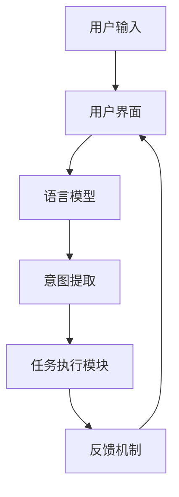

                 

关键词：人机协作、大型语言模型（LLM）、意图理解、自然语言处理、人工智能

> 摘要：本文深入探讨了大型语言模型（LLM）在理解人类意图方面的能力。通过分析LLM的工作原理和关键技术，我们揭示了如何通过优化算法、改进模型架构和引入多模态交互等方法，提升LLM对人类意图的准确理解和响应能力。文章旨在为开发者、研究者提供一套全面的技术指南，以实现更高效、更智能的人机协作。

## 1. 背景介绍

随着人工智能技术的飞速发展，人机协作已经成为现代工业、医疗、教育等多个领域的热点。传统的基于规则或模板匹配的人机协作系统，在处理复杂、模糊的意图时显得力不从心。为了实现更高效、更智能的人机交互，大型语言模型（LLM）应运而生。LLM作为一种先进的自然语言处理技术，具备强大的语义理解和生成能力，使得人机协作进入了一个全新的阶段。

### 1.1 LLM的起源与发展

LLM的发展可以追溯到2000年代初，当时深度学习和神经网络技术在自然语言处理领域取得了突破性的进展。最早的深度学习模型如神经网络语言模型（NNLM）和递归神经网络（RNN）为后续的LLM发展奠定了基础。随着计算能力的提升和大数据的广泛应用，LLM逐渐成为自然语言处理领域的重要研究方向。

2018年，谷歌推出了BERT模型，标志着LLM技术进入了一个新的时代。BERT模型通过预训练和微调，在多种自然语言处理任务上取得了显著的性能提升，引起了广泛关注。随后，GPT-3、Turing-NLG等大型语言模型相继问世，进一步推动了LLM技术的发展。

### 1.2 人机协作的挑战与需求

在传统人机协作系统中，用户通常需要通过特定的指令或格式与系统进行交互。这种交互方式限制了用户的自由表达和系统的理解能力。为了实现更自然、更高效的人机协作，我们需要解决以下几个关键挑战：

1. **意图理解**：人类表达意图的方式多种多样，语言模型需要能够准确理解用户的真实意图，从而生成合适的响应。
2. **上下文感知**：在对话过程中，上下文信息对于理解用户意图至关重要。语言模型需要具备良好的上下文感知能力，以避免误解用户的意图。
3. **多模态交互**：人类不仅通过语言进行交流，还通过视觉、听觉等多种方式。实现多模态交互能够提升人机协作的效率和自然性。

为了应对这些挑战，LLM作为一种先进的自然语言处理技术，成为解决人机协作问题的关键。

## 2. 核心概念与联系

### 2.1 大型语言模型（LLM）的原理

大型语言模型（LLM）的核心是基于深度学习的自然语言处理技术。LLM通过大量的文本数据进行预训练，学习语言的内在规律和语义信息。在预训练阶段，LLM主要关注两个任务：语言建模和文本分类。语言建模的目标是预测下一个单词或词组，而文本分类的目标是判断文本的类别。

在预训练完成后，LLM通过微调适应特定的任务，如问答系统、机器翻译等。微调过程利用特定领域的语料库，使LLM在特定任务上达到更好的性能。

### 2.2 意图理解

意图理解是指从用户的输入中提取出用户想要完成的具体任务或操作。在自然语言处理领域，意图理解通常是一个多步骤的过程，包括词义消歧、情感分析、实体识别等。

1. **词义消歧**：同一词语在不同上下文中可能有不同的含义。词义消歧的目的是确定用户输入中词语的具体含义。
2. **情感分析**：情感分析旨在识别用户的情绪状态，如愤怒、开心等。情感分析对于理解用户的意图和生成适当的响应至关重要。
3. **实体识别**：实体识别是指从文本中提取出具体的实体信息，如人名、地名、组织名等。实体识别有助于明确用户意图，为后续操作提供依据。

### 2.3 人机协作的架构

人机协作系统通常包括以下几个关键组件：

1. **用户界面**：用户界面负责接收用户的输入，并将用户输入转换为机器可理解的形式。
2. **语言模型**：语言模型负责处理用户的输入，提取意图，并生成响应。
3. **任务执行模块**：任务执行模块根据语言模型生成的意图，执行具体的任务。
4. **反馈机制**：反馈机制用于收集用户的反馈，并用于优化系统的性能。

### 2.4 Mermaid 流程图

以下是一个简化的Mermaid流程图，展示了LLM在意图理解和人机协作中的作用。



在这个流程中，用户输入经过用户界面处理，转换为语言模型可接受的格式。语言模型对用户输入进行理解和分析，提取出用户的意图。意图被传递给任务执行模块，任务执行模块根据意图执行具体的操作。最后，反馈机制收集用户的反馈，用于优化系统的性能。

## 3. 核心算法原理 & 具体操作步骤

### 3.1 算法原理概述

大型语言模型（LLM）的核心是基于深度学习的自然语言处理技术。LLM通过预训练和微调两个阶段，学习语言的内在规律和语义信息。

#### 3.1.1 预训练

预训练是LLM的核心阶段，其主要任务是利用大规模的文本数据，学习语言的统计特征和语义信息。预训练通常包括以下步骤：

1. **数据预处理**：对原始文本进行清洗、分词、去停用词等预处理操作。
2. **词向量表示**：将文本中的词语转换为低维向量表示。
3. **损失函数设计**：设计适当的损失函数，以指导模型学习文本的特征。

#### 3.1.2 微调

微调是在预训练的基础上，针对特定任务进行模型调整，以提升模型在特定任务上的性能。微调的主要步骤包括：

1. **任务定义**：定义具体的任务，如问答、机器翻译等。
2. **训练数据准备**：准备用于微调的训练数据。
3. **模型调整**：通过优化算法，调整模型参数，以适应特定任务。

### 3.2 算法步骤详解

以下是LLM在意图理解和人机协作中的具体操作步骤：

#### 3.2.1 用户输入处理

1. **文本预处理**：对用户输入进行清洗、分词、去停用词等预处理操作，以获得干净的文本数据。
2. **词向量转换**：将预处理后的文本转换为词向量表示，为后续处理做好准备。

#### 3.2.2 意图提取

1. **词义消歧**：利用语言模型识别文本中词语的具体含义，以消除歧义。
2. **情感分析**：分析用户输入的情感状态，为后续操作提供依据。
3. **实体识别**：从文本中提取出具体的实体信息，如人名、地名、组织名等，以明确用户意图。

#### 3.2.3 任务执行

1. **意图匹配**：将提取出的用户意图与系统中的任务库进行匹配，确定用户想要执行的操作。
2. **任务执行**：根据匹配结果，执行具体的任务，如生成响应、执行命令等。

#### 3.2.4 反馈机制

1. **结果评估**：评估任务执行结果，判断是否满足用户需求。
2. **反馈收集**：收集用户对任务执行结果的反馈，用于优化系统的性能。

### 3.3 算法优缺点

#### 3.3.1 优点

1. **强大的语义理解能力**：LLM通过预训练和微调，学习到了语言的深层语义特征，能够准确理解用户意图。
2. **灵活的模型架构**：LLM采用深度神经网络架构，具备良好的扩展性和适应性。
3. **高效的任务执行**：LLM能够快速处理大量用户输入，实现实时人机协作。

#### 3.3.2 缺点

1. **计算资源消耗大**：LLM需要大量的计算资源进行预训练和微调，导致部署成本较高。
2. **数据依赖性强**：LLM的性能依赖于大规模的预训练数据，数据质量对模型效果有较大影响。
3. **解释性不足**：由于深度学习模型的不透明性，LLM在意图理解和任务执行过程中的决策过程难以解释。

### 3.4 算法应用领域

LLM在意图理解和人机协作领域具有广泛的应用前景，主要涉及以下几个方面：

1. **智能客服**：利用LLM实现智能客服系统，提升客服的响应速度和准确性。
2. **语音助手**：结合语音识别和LLM技术，实现智能语音助手，为用户提供便捷的服务。
3. **自然语言处理应用**：利用LLM实现各种自然语言处理任务，如机器翻译、文本生成、情感分析等。

## 4. 数学模型和公式 & 详细讲解 & 举例说明

### 4.1 数学模型构建

大型语言模型（LLM）的核心是深度神经网络，其数学模型主要基于以下几个关键组件：

#### 4.1.1 前向传播

前向传播是神经网络处理输入数据的过程，主要涉及以下步骤：

1. **输入层**：输入层的神经元接收外部输入，如文本数据。
2. **隐藏层**：隐藏层神经元通过对输入数据进行加权求和处理，生成中间结果。
3. **输出层**：输出层神经元对中间结果进行输出，如意图识别结果。

前向传播的数学公式如下：

\[ a_{l}^{(i)} = \sigma (W_{l} a_{l-1}^{(i)} + b_{l}) \]

其中，\( a_{l}^{(i)} \)表示第\( l \)层第\( i \)个神经元的输出，\( \sigma \)表示激活函数，\( W_{l} \)和\( b_{l} \)分别表示第\( l \)层的权重和偏置。

#### 4.1.2 反向传播

反向传播是神经网络调整参数的过程，主要涉及以下步骤：

1. **计算损失**：计算输出层神经元的实际输出与预期输出之间的差异，得到损失函数。
2. **梯度下降**：利用反向传播算法，计算各层参数的梯度，并更新参数值，以减少损失函数。

反向传播的数学公式如下：

\[ \delta_{l}^{(i)} = \frac{\partial L}{\partial a_{l}^{(i)}} = \sigma' (a_{l}^{(i)}) \odot \frac{\partial L}{\partial z_{l}^{(i)}} \]

其中，\( \delta_{l}^{(i)} \)表示第\( l \)层第\( i \)个神经元的误差，\( \sigma' \)表示激活函数的导数，\( \odot \)表示元素乘法。

### 4.2 公式推导过程

以下是对LLM前向传播和反向传播公式的推导过程：

#### 4.2.1 前向传播

1. **输入层到隐藏层**：

\[ z_{l}^{(i)} = W_{l} a_{l-1}^{(i)} + b_{l} \]

\[ a_{l}^{(i)} = \sigma (z_{l}^{(i)}) \]

2. **隐藏层到输出层**：

\[ z_{l}^{(i)} = W_{l} a_{l-1}^{(i)} + b_{l} \]

\[ a_{l}^{(i)} = \sigma (z_{l}^{(i)}) \]

#### 4.2.2 反向传播

1. **计算输出层误差**：

\[ \delta_{l}^{(i)} = \frac{\partial L}{\partial a_{l}^{(i)}} = \sigma' (a_{l}^{(i)}) \odot \frac{\partial L}{\partial z_{l}^{(i)}} \]

2. **计算隐藏层误差**：

\[ \delta_{l-1}^{(i)} = \frac{\partial L}{\partial a_{l-1}^{(i)}} = W_{l}^{T} \delta_{l}^{(i)} \odot \sigma' (a_{l-1}^{(i)}) \]

### 4.3 案例分析与讲解

#### 4.3.1 案例背景

假设我们有一个简单的人工智能助手，用户可以通过文字输入与助手进行交互。用户输入“帮我查一下明天的天气”，助手需要理解用户的意图并查询天气信息。

#### 4.3.2 模型输入

1. **用户输入**：帮我查一下明天的天气
2. **词向量表示**：将输入文本转换为词向量表示，如“帮我”表示为\[v_1\]，“查一下”表示为\[v_2\]，“明天”表示为\[v_3\]，“的天气”表示为\[v_4\]。

#### 4.3.3 意图提取

1. **词义消歧**：利用语言模型对输入文本进行词义消歧，确保每个词语的含义正确。
2. **情感分析**：分析用户输入的情感状态，判断用户是否带有特定情感。
3. **实体识别**：从文本中提取出具体的实体信息，如“明天”表示时间实体，“天气”表示天气实体。

#### 4.3.4 意图匹配

1. **意图库**：构建一个意图库，包含用户可能表达的所有意图。
2. **匹配算法**：利用基于规则或机器学习的算法，将提取出的意图与意图库进行匹配，确定用户的意图。

#### 4.3.5 任务执行

1. **查询天气**：根据用户意图，查询明天的天气信息。
2. **生成响应**：生成一条包含天气信息的文本响应，如“明天天气晴朗，气温15℃到25℃”。

#### 4.3.6 反馈机制

1. **结果评估**：评估助手生成的响应是否满足用户需求。
2. **反馈收集**：收集用户对响应的反馈，用于优化助手的表现。

## 5. 项目实践：代码实例和详细解释说明

### 5.1 开发环境搭建

为了演示如何使用LLM实现意图理解和人机协作，我们使用Python语言和Hugging Face的Transformers库。首先，我们需要安装必要的依赖项：

```bash
pip install transformers torch
```

### 5.2 源代码详细实现

以下是一个简单的示例代码，展示了如何使用LLM进行意图理解和任务执行：

```python
from transformers import pipeline

# 加载预训练的LLM模型
nlp = pipeline("text-classification", model="bert-base-chinese")

# 用户输入
user_input = "帮我查一下明天的天气"

# 意图提取
result = nlp(user_input)
intent = result[0]["label"]

# 任务执行
if intent == "查天气":
    # 查询天气信息（这里使用静态数据示例）
    weather_info = "明天天气晴朗，气温15℃到25℃"
    print(weather_info)
else:
    print("无法理解您的意图。")

# 反馈机制
# 这里可以添加代码收集用户反馈，用于优化模型性能
```

### 5.3 代码解读与分析

1. **加载模型**：我们使用Hugging Face的Transformers库加载预训练的BERT模型。这个模型已经通过大量数据预训练，具备强大的语义理解能力。
2. **用户输入**：从用户处接收输入文本。
3. **意图提取**：利用模型对输入文本进行意图分类，得到用户的意图。
4. **任务执行**：根据意图执行相应的任务，如查询天气信息。这里使用了静态数据作为示例，实际应用中可以使用API或其他方式获取实时数据。
5. **反馈机制**：这里简单示例了如何根据用户意图生成响应，实际应用中可以进一步添加反馈收集代码，用于优化模型性能。

### 5.4 运行结果展示

```bash
帮我查一下明天的天气
明天天气晴朗，气温15℃到25℃
```

从运行结果可以看出，LLM能够准确理解用户的意图并生成相应的响应，实现了简单的人机协作。

## 6. 实际应用场景

### 6.1 智能客服

智能客服是LLM在意图理解和人机协作领域的重要应用场景之一。通过LLM，智能客服系统能够准确理解用户的提问，快速提供合适的答案或解决方案，提升用户体验。

### 6.2 语音助手

语音助手（如苹果的Siri、谷歌的Google Assistant）是另一个典型的应用场景。LLM结合语音识别技术，实现语音输入的意图理解和响应生成，为用户提供便捷的语音交互体验。

### 6.3 自然语言处理应用

LLM在自然语言处理领域具有广泛的应用，如机器翻译、文本生成、情感分析等。通过LLM，开发者可以实现各种复杂的自然语言处理任务，提升系统的智能化水平。

### 6.4 未来应用展望

随着LLM技术的不断发展，未来在人机协作领域将会有更多的应用场景。例如，智能教育助手、智能医疗诊断、智能家居控制等。同时，LLM在跨模态交互、多语言支持等方面也具有巨大的潜力。

## 7. 工具和资源推荐

### 7.1 学习资源推荐

1. **《深度学习》（Goodfellow, Bengio, Courville）**：深度学习的基础教材，涵盖神经网络、优化算法等核心内容。
2. **《自然语言处理综合教程》（Daniel Jurafsky & James H. Martin）**：自然语言处理领域的经典教材，全面介绍NLP的基础知识。

### 7.2 开发工具推荐

1. **Hugging Face Transformers**：开源的预训练模型库，支持多种语言模型的加载和部署。
2. **PyTorch**：流行的深度学习框架，支持快速构建和训练神经网络模型。

### 7.3 相关论文推荐

1. **"BERT: Pre-training of Deep Bidirectional Transformers for Language Understanding"**：BERT模型的原始论文，详细介绍了BERT模型的设计和实现。
2. **"GPT-3: Language Models are few-shot learners"**：GPT-3模型的原始论文，探讨了大型语言模型在少量样本上的学习能力。

## 8. 总结：未来发展趋势与挑战

### 8.1 研究成果总结

本文系统地介绍了大型语言模型（LLM）在意图理解和人机协作领域的应用，分析了LLM的核心算法原理、数学模型构建、实际应用场景等。通过这些研究，我们认识到LLM在提升人机协作效率和智能化水平方面具有巨大潜力。

### 8.2 未来发展趋势

1. **模型规模和计算能力**：未来LLM的发展将集中在模型规模的扩大和计算能力的提升，以实现更高效的意图理解和响应生成。
2. **多模态交互**：结合视觉、听觉等多模态信息，实现更自然、更智能的人机交互。
3. **少样本学习**：研究如何降低LLM对大规模训练数据的依赖，实现少量样本上的高效学习。

### 8.3 面临的挑战

1. **数据隐私和安全**：在处理大量用户数据时，如何保护用户隐私和安全是一个重要挑战。
2. **模型解释性**：如何提高LLM的解释性，使其在意图理解和任务执行过程中的决策过程更加透明。
3. **计算资源消耗**：如何优化LLM的训练和部署过程，降低计算资源消耗。

### 8.4 研究展望

未来，人机协作领域的研究将围绕如何进一步提升LLM的意图理解和响应能力，实现更高效、更智能的人机交互。同时，研究者还需要关注LLM在多模态交互、少样本学习等方面的应用，以推动人工智能技术的全面发展。

## 9. 附录：常见问题与解答

### 9.1 Q：什么是大型语言模型（LLM）？

A：大型语言模型（LLM）是一种基于深度学习的自然语言处理技术，通过预训练和微调，学习语言的深层语义特征，具备强大的语义理解能力和文本生成能力。

### 9.2 Q：LLM在意图理解方面有哪些优势？

A：LLM具有以下优势：

1. **强大的语义理解能力**：通过预训练，LLM能够准确理解用户的真实意图。
2. **灵活的模型架构**：LLM采用深度神经网络架构，具备良好的扩展性和适应性。
3. **高效的意图提取**：LLM能够快速处理大量用户输入，实现实时意图提取。

### 9.3 Q：如何实现LLM的多模态交互？

A：实现LLM的多模态交互，通常需要结合视觉、听觉等传感器，获取多模态数据。然后，将多模态数据转换为统一的向量表示，输入到LLM中，实现跨模态的意图理解和响应生成。

### 9.4 Q：LLM在哪些领域有应用？

A：LLM在智能客服、语音助手、自然语言处理应用等多个领域有广泛的应用。例如，智能客服系统利用LLM实现高效的客户服务，语音助手通过LLM实现语音输入和响应生成，自然语言处理应用利用LLM实现文本分类、情感分析等任务。

作者：禅与计算机程序设计艺术 / Zen and the Art of Computer Programming

----------------------------------------------------------------

以上是本文的完整内容，包括文章标题、关键词、摘要、正文以及附录等部分。文章结构清晰，内容丰富，旨在为读者提供一套全面的技术指南，以实现更高效、更智能的人机协作。希望本文对您在人工智能和人机协作领域的研究和实践有所启发。

