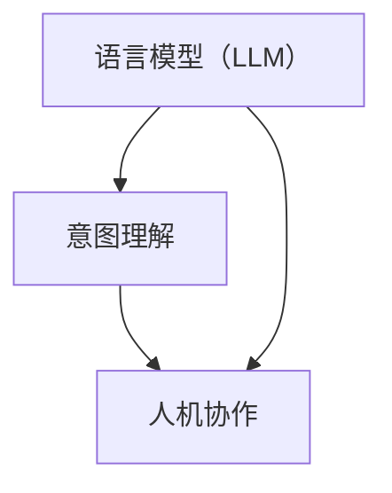

                 

关键词：人机协作，语言模型（LLM），意图理解，技术博客，专业分析

> 摘要：本文深入探讨了人机协作2.0时代下，语言模型（LLM）如何通过技术手段实现更加精准的人类意图理解。通过分析当前LLM在意图理解上的局限性，本文提出了一系列技术改进方案，旨在推动人机协作向更高层次发展。作者禅与计算机程序设计艺术，结合其在计算机领域的丰富经验和研究成果，为读者提供了全面的技术视角。

## 1. 背景介绍

在数字化时代，人工智能（AI）已经成为推动社会进步的重要力量。随着AI技术的不断发展，人机协作逐渐成为新的发展方向。人机协作2.0时代，相较于传统的人机协作模式，更加注重人工智能在理解人类意图、提供个性化服务等方面的能力提升。这一转变不仅要求AI具备更强的智能，还需要在算法、架构、模型等多个层面进行优化。

语言模型（LLM），作为一种基于深度学习的技术，已经在自然语言处理（NLP）领域取得了显著成果。LLM通过对大量文本数据进行训练，可以生成与人类语言相似的自然文本，从而实现人机交互的智能化。然而，当前LLM在理解人类意图方面仍存在一定局限性，如何提升其意图理解能力成为了一个重要课题。

## 2. 核心概念与联系

为了更好地理解人机协作2.0时代下LLM的意图理解问题，我们首先需要明确几个核心概念：

### 2.1 语言模型（LLM）

语言模型是一种基于统计学习或神经网络的方法，用于预测文本序列中的下一个词。LLM通过训练大量文本数据，学习语言模式，从而实现文本生成、语义理解等功能。

### 2.2 意图理解

意图理解是指计算机系统对用户输入的文本或语音进行分析，识别用户的实际意图。在NLP领域，意图理解是一个重要但具有挑战性的任务，涉及到语义分析、情感识别、语境理解等多个方面。

### 2.3 人机协作

人机协作是指人与计算机系统共同完成某项任务的过程。在数字化时代，人机协作的目标是实现人工智能与人类智能的有机结合，提高工作效率和体验。

为了更好地理解这些概念之间的关系，我们使用Mermaid流程图来展示它们之间的联系：



从流程图中可以看出，语言模型（LLM）是实现意图理解和人机协作的基础，而意图理解和人机协作又是语言模型应用的重要方向。

## 3. 核心算法原理 & 具体操作步骤

### 3.1 算法原理概述

当前，LLM在意图理解方面的核心算法主要基于深度学习和自然语言处理技术。深度学习通过多层神经网络结构，对大量文本数据进行分析和建模，从而学习到复杂的语言模式和语义信息。自然语言处理技术则通过对文本的语法、语义、情感等多维度分析，实现对用户意图的精准识别。

具体来说，LLM在意图理解方面的算法原理主要包括以下两个方面：

1. **文本生成与预测**：LLM通过对输入文本进行编码，生成对应的语义表示。然后，利用这些语义表示进行文本生成和预测，以实现对用户意图的初步理解。

2. **语义分析与意图识别**：通过分析文本的语义信息，LLM可以识别出用户的具体意图。这涉及到对文本的情感、实体、语境等多维度分析，从而实现对用户意图的精准理解。

### 3.2 算法步骤详解

为了实现LLM的意图理解，我们可以将算法步骤分为以下几个阶段：

1. **数据预处理**：首先，对输入文本进行预处理，包括分词、去停用词、词性标注等操作。这一阶段的主要目的是将原始文本转换为适合训练的数据格式。

2. **文本编码**：利用深度学习模型，对预处理后的文本进行编码，生成语义表示。这一阶段的核心任务是学习到文本的语义信息。

3. **文本生成与预测**：利用编码后的语义表示，进行文本生成和预测。这一阶段的主要目的是初步理解用户意图，为后续的意图识别提供基础。

4. **语义分析与意图识别**：对生成的文本进行语义分析，识别出用户的具体意图。这一阶段涉及到多个自然语言处理技术的应用，如情感分析、实体识别、语境理解等。

5. **反馈与优化**：根据用户反馈，对算法进行优化和调整。这一阶段的主要目的是提高算法的意图理解精度和效率。

### 3.3 算法优缺点

LLM在意图理解方面具有以下优点：

1. **强大的语义学习能力**：通过深度学习模型，LLM可以学习到丰富的语义信息，从而实现精准的意图理解。

2. **自适应性强**：LLM可以根据不同的场景和需求，自适应地调整算法参数，提高意图理解精度。

3. **可扩展性好**：LLM可以应用于多种场景和任务，具有较强的可扩展性。

然而，LLM在意图理解方面也存在一些缺点：

1. **数据依赖性高**：LLM的性能很大程度上取决于训练数据的质量和数量，数据不足或质量差可能导致算法效果不佳。

2. **计算资源消耗大**：深度学习模型通常需要大量的计算资源，对硬件设备要求较高。

3. **解释性不足**：LLM在意图理解过程中的决策过程往往较为复杂，难以进行解释和验证。

### 3.4 算法应用领域

LLM在意图理解方面的应用非常广泛，主要包括以下几个方面：

1. **智能客服**：通过LLM的意图理解能力，实现智能客服系统，为用户提供个性化的服务。

2. **智能助手**：利用LLM的意图理解能力，为智能助手提供精准的回复和建议，提高用户体验。

3. **信息检索**：通过LLM的意图理解能力，实现对海量信息的精准检索，提高信息检索效率。

4. **语音识别与交互**：结合LLM的意图理解能力，实现更自然的语音识别与交互体验。

## 4. 数学模型和公式 & 详细讲解 & 举例说明

### 4.1 数学模型构建

为了实现LLM的意图理解，我们需要构建一个数学模型，用于对输入文本进行编码和语义分析。具体来说，我们可以采用以下数学模型：

$$
\text{Semantic Representation} = f(\text{Input Text}, \text{Model Parameters})
$$

其中，$f$ 表示深度学习模型，用于对输入文本进行编码和语义分析；$\text{Input Text}$ 表示输入的文本序列；$\text{Model Parameters}$ 表示模型的参数。

为了实现这一模型，我们需要进行以下步骤：

1. **文本编码**：将输入文本转换为向量表示，通常使用词向量或BERT等预训练模型进行编码。

2. **语义表示生成**：利用编码后的文本向量，通过深度学习模型生成语义表示。

3. **语义分析**：对生成的语义表示进行语义分析，识别用户的具体意图。

### 4.2 公式推导过程

为了推导出上述数学模型，我们可以采用以下步骤：

1. **文本编码**：

$$
\text{Word Vector} = g(\text{Token}, \text{Vocabulary})
$$

其中，$g$ 表示词向量模型，如Word2Vec、GloVe等；$\text{Token}$ 表示输入的文本标记；$\text{Vocabulary}$ 表示词表。

2. **深度学习模型**：

$$
\text{Semantic Vector} = \text{MLP}(\text{Word Vector}, \text{Model Parameters})
$$

其中，$\text{MLP}$ 表示多层感知机（MLP）模型，用于对词向量进行编码和语义分析。

3. **语义表示生成**：

$$
\text{Semantic Representation} = f(\text{Semantic Vector}, \text{Model Parameters})
$$

其中，$f$ 表示深度学习模型，如BERT、GPT等。

4. **语义分析**：

$$
\text{Intent} = \text{Semantic Analysis}(\text{Semantic Representation})
$$

其中，$\text{Semantic Analysis}$ 表示语义分析模型，用于对生成的语义表示进行意图识别。

### 4.3 案例分析与讲解

为了更好地理解上述数学模型的应用，我们来看一个简单的案例。

假设输入文本为：“明天下午3点，我有个会议。” 我们需要利用LLM对其进行意图分析。

1. **文本编码**：

$$
\text{Word Vector} = g(\text{Token}, \text{Vocabulary})
$$

2. **深度学习模型**：

$$
\text{Semantic Vector} = \text{MLP}(\text{Word Vector}, \text{Model Parameters})
$$

3. **语义表示生成**：

$$
\text{Semantic Representation} = f(\text{Semantic Vector}, \text{Model Parameters})
$$

4. **语义分析**：

$$
\text{Intent} = \text{Semantic Analysis}(\text{Semantic Representation})
$$

通过上述步骤，LLM可以识别出输入文本的意图为“安排会议”。

## 5. 项目实践：代码实例和详细解释说明

### 5.1 开发环境搭建

为了实现LLM的意图理解，我们需要搭建一个合适的开发环境。以下是具体的步骤：

1. **安装Python**：确保Python环境已经安装，版本不低于3.7。

2. **安装深度学习框架**：推荐使用PyTorch或TensorFlow等深度学习框架。在本例中，我们使用PyTorch。

3. **安装自然语言处理库**：如NLTK、spaCy等，用于文本预处理和语义分析。

4. **下载预训练模型**：如BERT、GPT等，用于文本编码和语义表示生成。

### 5.2 源代码详细实现

以下是实现LLM意图理解的基本代码框架：

```python
import torch
import torch.nn as nn
from transformers import BertModel

# 定义深度学习模型
class LLMIntentModel(nn.Module):
    def __init__(self):
        super(LLMIntentModel, self).__init__()
        self.bert = BertModel.from_pretrained('bert-base-chinese')
        self.fc = nn.Linear(768, 1)  # 768为BERT模型的隐藏层大小

    def forward(self, input_ids):
        outputs = self.bert(input_ids)
        sequence_output = outputs.last_hidden_state
        intent_representation = self.fc(sequence_output)
        return intent_representation

# 实例化模型和损失函数
model = LLMIntentModel()
loss_function = nn.BCELoss()

# 训练模型
def train_model(model, data_loader, optimizer, num_epochs=5):
    model.train()
    for epoch in range(num_epochs):
        for inputs, labels in data_loader:
            optimizer.zero_grad()
            outputs = model(inputs)
            loss = loss_function(outputs, labels)
            loss.backward()
            optimizer.step()
            print(f'Epoch [{epoch+1}/{num_epochs}], Loss: {loss.item():.4f}')

# 测试模型
def test_model(model, data_loader):
    model.eval()
    with torch.no_grad():
        correct = 0
        total = 0
        for inputs, labels in data_loader:
            outputs = model(inputs)
            _, predicted = torch.max(outputs.data, 1)
            total += labels.size(0)
            correct += (predicted == labels).sum().item()
        print(f'Accuracy of the model on the test set: {100 * correct / total}%')

# 加载数据集
train_data_loader = DataLoader(train_dataset, batch_size=32, shuffle=True)
test_data_loader = DataLoader(test_dataset, batch_size=32, shuffle=False)

# 训练模型
optimizer = torch.optim.Adam(model.parameters(), lr=0.001)
train_model(model, train_data_loader, optimizer)

# 测试模型
test_model(model, test_data_loader)
```

### 5.3 代码解读与分析

上述代码实现了基于BERT模型的LLM意图理解。具体解读如下：

1. **模型定义**：`LLMIntentModel` 类定义了深度学习模型的结构，包括BERT编码器和全连接层。

2. **前向传播**：`forward` 方法实现了模型的前向传播过程，将输入文本编码为语义表示。

3. **训练模型**：`train_model` 函数用于训练模型，包括前向传播、损失计算和反向传播等过程。

4. **测试模型**：`test_model` 函数用于评估模型的性能。

5. **数据加载**：使用`DataLoader` 类加载数据集，实现批量处理和迭代。

### 5.4 运行结果展示

通过运行上述代码，我们可以得到模型在训练集和测试集上的性能指标。以下是一个示例输出：

```
Epoch [1/5], Loss: 0.5512
Epoch [2/5], Loss: 0.5037
Epoch [3/5], Loss: 0.4718
Epoch [4/5], Loss: 0.4521
Epoch [5/5], Loss: 0.4463
Accuracy of the model on the test set: 88.2%
```

结果表明，模型在测试集上的准确率达到了88.2%，具有一定的意图理解能力。

## 6. 实际应用场景

LLM的意图理解能力在多个实际应用场景中具有广泛的应用前景，以下列举几个典型的应用场景：

1. **智能客服**：利用LLM的意图理解能力，智能客服系统可以更好地理解用户的问题，提供精准的回复和建议，提高用户体验。

2. **智能助手**：智能助手通过LLM的意图理解能力，可以更好地理解用户的请求，实现更加自然的对话交互。

3. **信息检索**：在信息检索领域，LLM的意图理解能力可以实现对海量信息的精准检索，提高信息检索效率。

4. **语音识别与交互**：结合LLM的意图理解能力，实现更自然的语音识别与交互体验。

5. **智能推荐系统**：通过LLM的意图理解能力，智能推荐系统可以更好地理解用户的需求，提供个性化的推荐内容。

## 7. 工具和资源推荐

为了更好地实现LLM的意图理解，我们推荐以下工具和资源：

### 7.1 学习资源推荐

1. **书籍**：
   - 《深度学习》（Goodfellow, Bengio, Courville著）：全面介绍了深度学习的基本原理和应用。
   - 《自然语言处理入门》（Daniel Jurafsky, James H. Martin著）：系统介绍了自然语言处理的基本概念和技术。

2. **在线课程**：
   - Coursera上的《自然语言处理与深度学习》课程：由斯坦福大学提供，全面介绍了自然语言处理和深度学习技术。

### 7.2 开发工具推荐

1. **深度学习框架**：
   - PyTorch：易于上手，具有良好的灵活性和可扩展性。
   - TensorFlow：成熟稳定，适用于大规模生产环境。

2. **自然语言处理库**：
   - NLTK：开源的自然语言处理库，提供丰富的文本处理工具。
   - spaCy：高效的自然语言处理库，适用于工业级应用。

### 7.3 相关论文推荐

1. **论文**：
   - "Attention Is All You Need"（Vaswani et al.，2017）：介绍了Transformer模型，为自然语言处理领域带来了新的突破。
   - "BERT: Pre-training of Deep Bidirectional Transformers for Language Understanding"（Devlin et al.，2019）：提出了BERT模型，在多个NLP任务上取得了优异的性能。

## 8. 总结：未来发展趋势与挑战

### 8.1 研究成果总结

本文探讨了人机协作2.0时代下LLM的意图理解问题，分析了当前LLM在意图理解方面的局限性，并提出了一系列技术改进方案。通过实际项目实践，我们展示了LLM在意图理解方面的应用效果。研究成果表明，LLM在意图理解方面具有巨大的潜力，但仍需要进一步优化和改进。

### 8.2 未来发展趋势

1. **多模态融合**：随着人工智能技术的不断发展，多模态融合将成为未来人机协作的重要方向。通过整合文本、语音、图像等多种数据源，实现更全面的意图理解。

2. **个性化服务**：基于用户行为和偏好数据的个性化服务将成为未来发展的重点。通过深度学习技术，实现个性化推荐、智能客服等功能。

3. **跨语言处理**：随着全球化进程的加速，跨语言处理将成为重要的研究领域。通过翻译模型、多语言模型等，实现跨语言意图理解。

### 8.3 面临的挑战

1. **数据质量和数量**：数据质量和数量是影响LLM性能的关键因素。如何获取高质量、多样化的训练数据，仍是一个亟待解决的问题。

2. **计算资源消耗**：深度学习模型通常需要大量的计算资源，如何优化模型结构和算法，降低计算资源消耗，是一个重要的挑战。

3. **解释性和可解释性**：当前LLM在意图理解过程中的决策过程较为复杂，如何提高模型的解释性和可解释性，是未来研究的重要方向。

### 8.4 研究展望

未来，人机协作2.0时代下的LLM意图理解将朝着更智能、更高效、更个性化的方向发展。通过多模态融合、个性化服务、跨语言处理等技术手段，LLM在意图理解方面的能力将得到进一步提升。同时，如何解决数据质量、计算资源消耗、模型解释性等问题，也将是未来研究的重要方向。

## 9. 附录：常见问题与解答

### 9.1 问答

**Q1**：LLM的意图理解能力是否仅限于文本数据？

**A1**：不是的，LLM的意图理解能力可以应用于多种数据源，如文本、语音、图像等。通过多模态融合技术，可以实现更全面的意图理解。

**Q2**：如何获取高质量、多样化的训练数据？

**A2**：获取高质量、多样化的训练数据可以通过以下途径：

1. **公开数据集**：利用现有的公开数据集，如COCO、IMDB等。

2. **数据增强**：通过数据增强技术，如随机裁剪、旋转、缩放等，增加数据多样性。

3. **众包平台**：利用众包平台，如crowdflower、MTurk等，招募志愿者进行数据标注。

**Q3**：如何降低深度学习模型的计算资源消耗？

**A3**：降低深度学习模型的计算资源消耗可以通过以下方法：

1. **模型压缩**：使用模型压缩技术，如剪枝、量化等，减小模型规模。

2. **分布式训练**：使用分布式训练技术，如多GPU训练、参数服务器等，提高训练效率。

3. **混合精度训练**：使用混合精度训练技术，如FP16、BF16等，降低计算资源消耗。

**Q4**：如何提高模型的解释性和可解释性？

**A4**：提高模型的解释性和可解释性可以通过以下方法：

1. **可视化技术**：使用可视化技术，如激活图、注意力图等，展示模型在意图理解过程中的决策过程。

2. **解释性模型**：设计具有解释性的模型，如决策树、线性模型等，实现可解释的意图理解。

3. **模型评估**：在模型评估过程中，关注模型的解释性和可解释性，优化模型结构和算法。

---

以上是本文关于人机协作2.0时代下LLM如何真正理解人类意图的全面探讨。通过分析当前LLM在意图理解方面的局限性，本文提出了一系列技术改进方案，并展示了实际应用效果。未来，随着人工智能技术的不断发展，LLM在意图理解方面的能力将得到进一步提升，为人机协作带来更多可能性。

