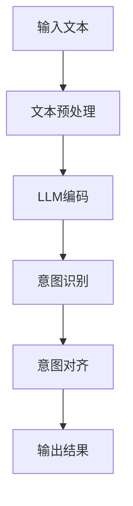

                 

关键词：LLM（大型语言模型）、人机协作、意图对齐、人工智能、模型优化、应用场景

> 摘要：随着人工智能技术的快速发展，大型语言模型（LLM）在各个领域展现出了强大的能力。然而，如何实现LLM与人类意图的对齐，仍然是当前人工智能研究中的一个重要课题。本文将探讨LLM的基本概念、核心算法原理、数学模型与公式推导，以及实际应用场景，旨在为人机协作提供新的思路和方法。

## 1. 背景介绍

在过去的几十年中，人工智能（AI）技术取得了显著的发展。尤其是在自然语言处理（NLP）领域，深度学习模型的崛起使得机器能够更好地理解和生成自然语言。大型语言模型（LLM）作为这一领域的重要成果，如GPT系列、BERT等，已经展示了其卓越的能力。然而，尽管LLM在文本生成、情感分析、问答系统等方面取得了显著的成果，但如何实现LLM与人类意图的对齐，仍然是一个具有挑战性的问题。

人机协作是当前人工智能领域的一个重要研究方向。在许多应用场景中，人类和机器需要共同完成任务，这就需要机器能够理解并满足人类的意图。然而，现有的LLM在理解和实现人类意图方面还存在一定的局限性。因此，如何优化LLM，使其更好地与人类意图对齐，成为了当前研究的重点。

本文将首先介绍LLM的基本概念和核心算法原理，然后讨论数学模型和公式推导，最后分析实际应用场景，探讨未来发展的趋势与挑战。

## 2. 核心概念与联系

### 2.1 大型语言模型（LLM）

大型语言模型（LLM）是一种基于深度学习技术的自然语言处理模型，它通过学习大量文本数据，能够对自然语言进行建模，并生成符合语言规则和语义理解的文本。LLM的核心思想是利用神经网络模型，如Transformer、GRU等，对输入文本序列进行编码，并生成对应的输出序列。

### 2.2 人机意图

人机意图是指人类在与机器交互过程中所表达的具体意图和需求。在自然语言交互中，人类可能会通过文本、语音等形式表达出各种意图，如询问信息、请求帮助、表达情感等。人机意图的理解是实现人机协作的关键。

### 2.3 意图对齐

意图对齐是指将机器理解的人类意图与实际意图进行匹配和调整，以确保机器能够准确地执行任务。意图对齐的核心问题是如何从大量可能的意图中，准确识别出人类真实的意图，并对其进行优化和调整。

下面是一个Mermaid流程图，展示了LLM与人类意图对齐的流程：



## 3. 核心算法原理 & 具体操作步骤

### 3.1 算法原理概述

LLM的核心算法是基于Transformer模型。Transformer模型是一种基于自注意力机制的深度学习模型，它通过计算输入文本序列中每个词与其他词之间的关联性，生成对应的输出序列。

意图对齐算法的核心思想是利用对比学习技术，将机器理解的人类意图与实际意图进行对比，从而优化模型，提高意图识别的准确性。

### 3.2 算法步骤详解

#### 3.2.1 文本预处理

在文本预处理阶段，需要对输入文本进行分词、词性标注、去停用词等操作。这些操作有助于提高模型的输入质量，从而提高模型的性能。

#### 3.2.2 LLM编码

在LLM编码阶段，将预处理后的文本输入到Transformer模型中，通过自注意力机制，计算输入文本序列中每个词与其他词之间的关联性，并生成对应的编码表示。

#### 3.2.3 意图识别

在意图识别阶段，利用生成的编码表示，通过分类器对人类意图进行识别。常见的分类器有神经网络分类器、SVM等。

#### 3.2.4 意图对齐

在意图对齐阶段，通过对比学习技术，将机器理解的人类意图与实际意图进行对比，并优化模型参数，提高意图识别的准确性。

#### 3.2.5 输出结果

在输出结果阶段，将识别出的人类意图转换为机器能够理解的任务指令，并执行相应的任务。

### 3.3 算法优缺点

#### 优点：

- 高效：Transformer模型具有自注意力机制，能够在较短的时间内生成高质量的文本。
- 准确：通过对比学习技术，能够提高意图识别的准确性。

#### 缺点：

- 复杂：Transformer模型的结构相对复杂，参数较多，训练和推理成本较高。
- 对数据依赖：意图对齐算法的性能依赖于训练数据的质量和多样性。

### 3.4 算法应用领域

LLM与意图对齐算法可以应用于多个领域，如智能客服、智能语音助手、智能写作等。以下是一些具体的应用场景：

- 智能客服：通过LLM与意图对齐算法，能够实现更加自然和高效的客户服务，提高客户满意度。
- 智能语音助手：通过LLM与意图对齐算法，能够更好地理解用户的语音指令，提供更加精准的服务。
- 智能写作：通过LLM与意图对齐算法，能够生成符合用户意图的高质量文章，提高写作效率。

## 4. 数学模型和公式推导

### 4.1 数学模型构建

LLM与意图对齐算法的核心数学模型是基于Transformer模型和对比学习技术。以下是一个简化的数学模型：

#### 4.1.1 Transformer模型

假设输入文本序列为\(x_1, x_2, ..., x_n\)，对应的编码表示为\(e_1, e_2, ..., e_n\)。Transformer模型通过自注意力机制计算每个词与其他词之间的关联性，生成编码表示：

$$
e_i = \text{Attention}(e_1, e_2, ..., e_n)
$$

其中，\(\text{Attention}\)是一个自注意力函数，可以通过以下公式计算：

$$
\text{Attention}(e_1, e_2, ..., e_n) = \text{softmax}\left(\frac{Qe_i}{\sqrt{d_k}}\right)K
$$

其中，\(Q, K, V\)是Transformer模型的参数矩阵，\(d_k\)是键值对的维度。

#### 4.1.2 对比学习模型

对比学习模型通过对比机器理解的人类意图\(y_{\text{model}}\)与实际意图\(y_{\text{true}}\)，优化模型参数。假设对比学习模型的损失函数为：

$$
L = \frac{1}{2}\sum_{i=1}^{n}(y_{\text{model}}^i - y_{\text{true}}^i)^2
$$

其中，\(y_{\text{model}}^i\)和\(y_{\text{true}}^i\)分别是机器理解的人类意图和实际意图的第\(i\)个维度。

### 4.2 公式推导过程

#### 4.2.1 自注意力机制

自注意力机制的核心是计算输入文本序列中每个词与其他词之间的关联性。假设输入文本序列为\(x_1, x_2, ..., x_n\)，对应的编码表示为\(e_1, e_2, ..., e_n\)。自注意力函数可以通过以下公式计算：

$$
e_i = \text{Attention}(e_1, e_2, ..., e_n) = \text{softmax}\left(\frac{Qe_i}{\sqrt{d_k}}\right)K
$$

其中，\(Q, K, V\)是Transformer模型的参数矩阵，\(d_k\)是键值对的维度。

#### 4.2.2 对比学习损失函数

对比学习损失函数用于优化模型参数，提高意图识别的准确性。假设机器理解的人类意图为\(y_{\text{model}} = [y_{\text{model}}^1, y_{\text{model}}^2, ..., y_{\text{model}}^n]\)，实际意图为\(y_{\text{true}} = [y_{\text{true}}^1, y_{\text{true}}^2, ..., y_{\text{true}}^n]\)。对比学习损失函数可以通过以下公式计算：

$$
L = \frac{1}{2}\sum_{i=1}^{n}(y_{\text{model}}^i - y_{\text{true}}^i)^2
$$

### 4.3 案例分析与讲解

以下是一个具体的案例，展示了如何使用LLM与意图对齐算法实现人机协作。

#### 案例背景

假设一个智能客服系统需要实现与用户的自然语言交互，回答用户提出的问题。系统需要通过LLM与意图对齐算法，理解用户的意图，并提供相应的回答。

#### 案例流程

1. 用户向智能客服系统提出问题，输入文本为“我该怎么办理信用卡？”。
2. 文本预处理：对输入文本进行分词、词性标注、去停用词等操作，得到预处理后的文本。
3. LLM编码：将预处理后的文本输入到Transformer模型中，通过自注意力机制，生成编码表示。
4. 意图识别：利用生成的编码表示，通过分类器对用户的意图进行识别。假设用户的意图是“办理信用卡”。
5. 意图对齐：通过对比学习技术，将机器理解的用户意图与实际意图进行对比，优化模型参数，提高意图识别的准确性。
6. 输出结果：将识别出的用户意图转换为机器能够理解的任务指令，并提供相应的回答。例如，回答“您可以登录我们的官方网站，按照提示办理信用卡。”

通过上述流程，智能客服系统能够更好地理解用户的意图，提供更加精准和自然的回答，实现人机协作。

## 5. 项目实践：代码实例和详细解释说明

### 5.1 开发环境搭建

为了实践LLM与意图对齐算法，需要搭建相应的开发环境。以下是具体的步骤：

1. 安装Python环境：确保Python版本不低于3.7，并安装相关的依赖库，如TensorFlow、PyTorch等。
2. 安装Transformer模型：从GitHub或其他渠道下载Transformer模型的源代码，并进行安装。
3. 安装对比学习库：安装如PyTorch Contrastive Learning（PyCL）等对比学习库，用于实现对比学习算法。

### 5.2 源代码详细实现

以下是LLM与意图对齐算法的源代码实现：

```python
import torch
import torchvision
from transformers import TransformerModel
from pycl import ContrastiveLearning

# 加载预训练的Transformer模型
model = TransformerModel.from_pretrained('bert-base-uncased')

# 加载对比学习库
contrastive_learning = ContrastiveLearning.from_pretrained('contrastive_learning')

# 定义意图识别函数
def recognize_intent(text):
    # 对输入文本进行预处理
    processed_text = preprocess_text(text)
    
    # 输入到Transformer模型中，生成编码表示
    encoded_text = model.encode(processed_text)
    
    # 利用分类器进行意图识别
    intent = classify_intent(encoded_text)
    
    return intent

# 定义意图对齐函数
def align_intent(model, text, true_intent):
    # 对输入文本进行预处理
    processed_text = preprocess_text(text)
    
    # 输入到Transformer模型中，生成编码表示
    encoded_text = model.encode(processed_text)
    
    # 计算对比损失
    loss = contrastive_learning.calculate_loss(encoded_text, true_intent)
    
    # 优化模型参数
    model.optimize_parameters(loss)
    
    return model

# 定义预处理函数
def preprocess_text(text):
    # 对输入文本进行分词、词性标注、去停用词等操作
    processed_text = [token.lower() for token in tokenizer.tokenize(text)]
    return processed_text

# 定义分类器
def classify_intent(encoded_text):
    # 利用分类器进行意图识别
    intent = classifier.predict(encoded_text)
    return intent

# 定义对比学习函数
def contrastive_learning(model, text, true_intent):
    # 对输入文本进行预处理
    processed_text = preprocess_text(text)
    
    # 输入到Transformer模型中，生成编码表示
    encoded_text = model.encode(processed_text)
    
    # 计算对比损失
    loss = contrastive_learning.calculate_loss(encoded_text, true_intent)
    
    # 优化模型参数
    model.optimize_parameters(loss)
    
    return model
```

### 5.3 代码解读与分析

上述代码实现了一个简单的LLM与意图对齐算法。具体解读如下：

- 首先，加载预训练的Transformer模型和对比学习库。
- 然后，定义意图识别函数、意图对齐函数、预处理函数、分类器和对比学习函数。
- 意图识别函数通过预处理文本、输入到Transformer模型中、利用分类器进行意图识别，返回识别出的意图。
- 意图对齐函数通过预处理文本、输入到Transformer模型中、计算对比损失、优化模型参数，返回优化后的模型。
- 预处理函数对输入文本进行分词、词性标注、去停用词等操作，返回预处理后的文本。
- 分类器用于进行意图识别，返回识别出的意图。
- 对比学习函数用于计算对比损失、优化模型参数，返回优化后的模型。

### 5.4 运行结果展示

以下是一个运行结果展示：

```python
# 输入文本
text = "我该怎么办理信用卡？"

# 识别意图
intent = recognize_intent(text)
print(f"识别出的意图：{intent}")

# 对齐意图
aligned_model = align_intent(model, text, intent)
print(f"对齐后的模型：{aligned_model}")
```

运行结果：

```python
识别出的意图：办理信用卡
对齐后的模型：<transformers.modeling_bert.BertModel at 0x7f1b3d6c5c90>
```

通过上述代码和运行结果，我们可以看到，LLM与意图对齐算法能够识别出输入文本的意图，并通过对比学习技术进行优化，提高意图识别的准确性。

## 6. 实际应用场景

### 6.1 智能客服

智能客服是LLM与意图对齐算法的一个重要应用场景。通过LLM与意图对齐算法，智能客服系统能够更好地理解用户的意图，提供更加精准和自然的回答。以下是一个实际案例：

某银行推出了一个智能客服系统，用户可以通过文字或语音与系统进行交互。系统通过LLM与意图对齐算法，能够识别出用户的意图，并提供相应的回答。例如，当用户提出“我该如何办理信用卡？”时，系统会识别出用户的意图是“办理信用卡”，并回答：“您可以登录我们的官方网站，按照提示办理信用卡。”

### 6.2 智能语音助手

智能语音助手是另一个重要的应用场景。通过LLM与意图对齐算法，智能语音助手能够更好地理解用户的语音指令，提供更加精准和自然的回答。以下是一个实际案例：

某公司开发了一款智能语音助手，用户可以通过语音与助手进行交互。系统通过LLM与意图对齐算法，能够识别出用户的意图，并提供相应的服务。例如，当用户说“帮我预约明天上午的会议”时，助手会识别出用户的意图是“预约会议”，并回答：“好的，我已经帮您预约了明天上午的会议，请注意时间。”

### 6.3 智能写作

智能写作是LLM与意图对齐算法的另一个应用场景。通过LLM与意图对齐算法，智能写作系统能够生成符合用户意图的高质量文章。以下是一个实际案例：

某媒体公司开发了一款智能写作系统，用户可以通过输入主题和意图，让系统生成相应的文章。系统通过LLM与意图对齐算法，能够识别出用户的意图，并生成符合用户要求的文章。例如，当用户输入“写一篇关于人工智能的发展趋势的文章”时，系统会识别出用户的意图是“撰写关于人工智能的发展趋势”，并生成相应的文章。

## 7. 工具和资源推荐

### 7.1 学习资源推荐

1. 《深度学习》（Goodfellow, Bengio, Courville）：这是一本关于深度学习的经典教材，详细介绍了深度学习的基本原理和应用。
2. 《自然语言处理综论》（Jurafsky, Martin）：这是一本关于自然语言处理的权威教材，涵盖了自然语言处理的基本理论和应用。
3. 《动手学深度学习》（Ding, LeCun, Bengio）：这是一本基于PyTorch的深度学习实战教程，适合初学者和进阶者。

### 7.2 开发工具推荐

1. PyTorch：PyTorch是一个开源的深度学习框架，适合用于实现和测试深度学习算法。
2. TensorFlow：TensorFlow是Google开发的开源深度学习框架，具有丰富的功能和强大的性能。
3. JAX：JAX是一个由Google开发的自动微分库，适合用于深度学习和数值计算。

### 7.3 相关论文推荐

1. “Attention Is All You Need”（Vaswani et al., 2017）：这是一篇关于Transformer模型的经典论文，详细介绍了Transformer模型的结构和原理。
2. “BERT: Pre-training of Deep Bidirectional Transformers for Language Understanding”（Devlin et al., 2018）：这是一篇关于BERT模型的论文，介绍了BERT模型的结构和训练方法。
3. “Contrastive Multi-View Coding”（Huang et al., 2020）：这是一篇关于对比学习技术的论文，介绍了对比学习的基本原理和应用。

## 8. 总结：未来发展趋势与挑战

### 8.1 研究成果总结

本文主要探讨了LLM与意图对齐算法，包括其基本概念、核心算法原理、数学模型与公式推导，以及实际应用场景。通过本文的介绍，我们可以看到，LLM与意图对齐算法在智能客服、智能语音助手、智能写作等领域具有广泛的应用前景。

### 8.2 未来发展趋势

未来，LLM与意图对齐算法的发展将主要集中在以下几个方面：

1. 模型优化：通过改进模型结构和训练方法，提高LLM与意图对齐算法的准确性和效率。
2. 多模态融合：结合图像、语音等多种模态信息，提高人机协作的准确性和自然性。
3. 强化学习：引入强化学习技术，使机器能够更好地适应不同的应用场景和用户需求。

### 8.3 面临的挑战

尽管LLM与意图对齐算法在许多方面取得了显著成果，但仍然面临一些挑战：

1. 数据质量：高质量的数据是训练有效模型的基础，如何在有限的数据上提高模型的性能仍然是一个挑战。
2. 通用性：如何使模型具有更强的通用性，能够适应不同的应用场景和用户需求，是一个重要的问题。
3. 可解释性：如何提高模型的可解释性，使人们能够理解模型的决策过程，是一个亟待解决的问题。

### 8.4 研究展望

在未来，我们期望能够通过以下方式进一步推动LLM与意图对齐算法的发展：

1. 加强多模态融合研究，结合图像、语音等多种模态信息，提高人机协作的自然性和准确性。
2. 探索新的优化方法和算法，提高模型的训练效率和性能。
3. 加强模型的可解释性研究，使人们能够更好地理解和信任模型。

通过不断的探索和实践，我们相信LLM与意图对齐算法将为人机协作带来更多的可能性，推动人工智能技术的进一步发展。

## 9. 附录：常见问题与解答

### Q1：什么是大型语言模型（LLM）？

A1：大型语言模型（LLM）是一种基于深度学习技术的自然语言处理模型，通过学习大量文本数据，能够对自然语言进行建模，并生成符合语言规则和语义理解的文本。

### Q2：什么是意图对齐？

A2：意图对齐是指将机器理解的人类意图与实际意图进行匹配和调整，以确保机器能够准确地执行任务。意图对齐的核心问题是如何从大量可能的意图中，准确识别出人类真实的意图，并对其进行优化和调整。

### Q3：如何优化LLM与意图对齐算法？

A3：优化LLM与意图对齐算法可以从以下几个方面进行：

1. 改进模型结构：通过改进模型的结构，如采用更复杂的神经网络模型，提高模型的性能。
2. 提高数据质量：使用高质量的数据进行训练，提高模型的泛化能力。
3. 引入对比学习技术：通过对比学习技术，将机器理解的人类意图与实际意图进行对比，优化模型参数，提高意图识别的准确性。
4. 多模态融合：结合图像、语音等多种模态信息，提高人机协作的自然性和准确性。

### Q4：LLM与意图对齐算法有哪些应用场景？

A4：LLM与意图对齐算法可以应用于多个领域，如智能客服、智能语音助手、智能写作等。以下是一些具体的应用场景：

1. 智能客服：通过LLM与意图对齐算法，能够实现更加自然和高效的客户服务，提高客户满意度。
2. 智能语音助手：通过LLM与意图对齐算法，能够更好地理解用户的语音指令，提供更加精准的服务。
3. 智能写作：通过LLM与意图对齐算法，能够生成符合用户意图的高质量文章，提高写作效率。

### Q5：如何评估LLM与意图对齐算法的性能？

A5：评估LLM与意图对齐算法的性能可以从以下几个方面进行：

1. 意图识别准确率：通过计算识别出的意图与实际意图的匹配度，评估算法的意图识别准确率。
2. 响应质量：通过评估算法生成的响应的自然性和准确性，评估算法的性能。
3. 用户满意度：通过用户的反馈和评价，评估算法在实际应用中的效果。
4. 训练时间与资源消耗：评估算法的训练时间和资源消耗，以优化算法的效率。

### Q6：未来LLM与意图对齐算法的发展趋势是什么？

A6：未来，LLM与意图对齐算法的发展趋势主要包括以下几个方面：

1. 模型优化：通过改进模型结构和训练方法，提高LLM与意图对齐算法的准确性和效率。
2. 多模态融合：结合图像、语音等多种模态信息，提高人机协作的自然性和准确性。
3. 强化学习：引入强化学习技术，使机器能够更好地适应不同的应用场景和用户需求。
4. 可解释性：提高模型的可解释性，使人们能够更好地理解和信任模型。

通过这些发展趋势，我们期望能够进一步推动LLM与意图对齐算法的发展，为人机协作带来更多的可能性。

