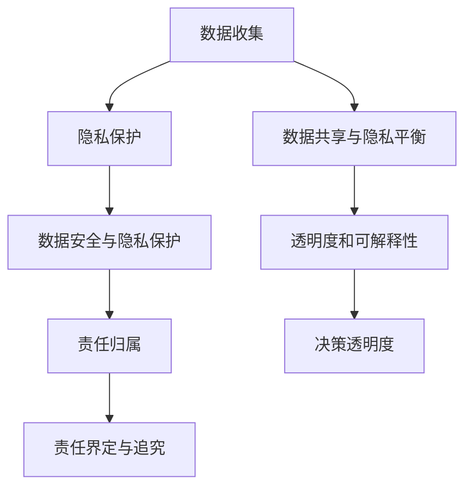

                 

在当今技术飞速发展的时代，人机协作已成为推动社会进步的重要力量。人工智能和计算机技术的发展，使得人类与机器之间的互动变得更加紧密。然而，随着这种协作关系的深化，伦理问题、规范制定以及相关准则的制定也日益凸显。本文旨在探讨人机协作中的伦理问题，提出相应的规范与准则，以促进人机协作的健康发展。

## 关键词

- 人机协作
- 伦理问题
- 规范制定
- 准则
- 人工智能
- 计算机技术

## 摘要

本文分析了人机协作中存在的伦理问题，包括隐私保护、决策透明度、责任归属等。针对这些问题，提出了规范与准则的制定原则，并详细阐述了具体实施方法。文章结构清晰，通过理论阐述与案例分析相结合，旨在为读者提供全面而深入的指导。

---

## 1. 背景介绍

人机协作的概念起源于人类对机器辅助的利用。在过去的几十年里，随着人工智能技术的不断发展，人机协作已经从简单的操作辅助演变为高度复杂、深层次的信息交换与决策支持。如今，人工智能在各个领域都展现出强大的能力，如医疗诊断、金融分析、自动驾驶等。这些应用不仅提高了工作效率，还极大地改善了人们的生活质量。

然而，随着技术的进步，人机协作也引发了一系列伦理问题。首先，隐私保护成为了一个亟待解决的问题。人工智能系统在处理大量数据时，可能会涉及到个人隐私信息的泄露。其次，决策透明度和责任归属也是人机协作中的关键问题。当人工智能系统在复杂环境中做出决策时，如何保证其决策的透明度和可解释性，以及当决策导致不良后果时，如何界定责任归属，都是需要深入探讨的问题。

为了应对这些伦理问题，规范与准则的制定显得尤为重要。这些规范与准则不仅能够引导人工智能和计算机技术的健康发展，还能保障社会公众的利益和权益。

---

## 2. 核心概念与联系

### 2.1 伦理学的基本原则

伦理学是研究道德原则、规范和价值观的学科。在讨论人机协作中的伦理问题时，需要引入几个核心的伦理学原则，包括：

- **尊重个人隐私**：在数据收集和使用过程中，必须尊重个体的隐私权，未经许可不得擅自收集和使用个人数据。
- **公正性和非歧视**：人工智能系统在做出决策时，必须保证公正性，不得基于种族、性别、年龄等因素进行歧视。
- **透明度和可解释性**：人工智能系统的决策过程必须透明，能够向用户解释决策的依据和原因。
- **责任归属**：在人工智能系统引发不良后果时，必须明确责任归属，以便采取相应的补救措施。

### 2.2 人机协作中的关键问题

在人机协作中，以下几个关键问题需要特别关注：

- **隐私保护**：如何确保个人隐私信息在收集、存储和使用过程中的安全。
- **数据共享与隐私平衡**：如何在保障隐私的前提下，实现数据的高效共享和利用。
- **决策透明度**：如何提高人工智能系统的决策透明度，使其决策过程更容易被理解和接受。
- **责任归属**：如何明确人工智能系统在决策过程中可能产生的责任，以便在发生问题时进行有效的责任追究。

### 2.3 Mermaid 流程图

以下是一个简化的Mermaid流程图，展示了人机协作中的关键环节和伦理原则：



---

## 3. 核心算法原理 & 具体操作步骤

### 3.1 算法原理概述

人机协作中的伦理问题解决，离不开相应的算法和技术支持。本文将介绍一种基于伦理学原则的人机协作算法，该算法主要包括以下几个部分：

- **隐私保护算法**：通过加密技术和匿名化处理，确保个人隐私信息在传输和存储过程中的安全。
- **数据共享与隐私平衡算法**：利用差分隐私和联邦学习等技术，实现数据的高效共享和隐私保护。
- **决策透明度算法**：通过可视化技术和可解释性模型，提高人工智能系统决策的透明度。
- **责任归属算法**：结合区块链技术，构建一个透明、可追溯的责任归属体系。

### 3.2 算法步骤详解

#### 3.2.1 隐私保护算法

1. **数据加密**：在数据传输和存储过程中，使用高级加密标准（AES）等加密算法，确保数据的安全性。
2. **匿名化处理**：对敏感数据进行匿名化处理，如使用伪名、掩码等技术，隐藏真实身份信息。
3. **访问控制**：设置严格的访问控制机制，确保只有授权用户才能访问敏感数据。

#### 3.2.2 数据共享与隐私平衡算法

1. **差分隐私**：通过添加噪声，使得个体数据无法被单独识别，从而保护隐私。
2. **联邦学习**：将数据保留在本地设备上，通过模型聚合实现数据共享和隐私保护。

#### 3.2.3 决策透明度算法

1. **可视化技术**：利用数据可视化工具，将决策过程和决策依据以直观的方式展示给用户。
2. **可解释性模型**：通过构建可解释性模型，如LIME、SHAP等，解释模型决策的依据和原因。

#### 3.2.4 责任归属算法

1. **区块链技术**：利用区块链的不可篡改性和透明性，记录决策过程中的所有操作和责任。
2. **智能合约**：通过智能合约自动执行责任追究和赔偿协议。

### 3.3 算法优缺点

#### 优点

1. **隐私保护**：通过高级加密、匿名化和差分隐私等技术，确保个人隐私信息的安全。
2. **数据共享**：联邦学习和差分隐私技术，实现了数据的高效共享和隐私保护。
3. **决策透明度**：可视化技术和可解释性模型，提高了决策过程的透明度。
4. **责任归属**：区块链技术和智能合约，实现了透明、可追溯的责任追究。

#### 缺点

1. **计算开销**：加密、匿名化和联邦学习等技术，需要较高的计算资源。
2. **技术复杂性**：实现这些算法需要较高的技术门槛，对开发人员的要求较高。
3. **法律和道德约束**：在具体应用中，可能面临法律和道德约束的挑战。

### 3.4 算法应用领域

1. **医疗健康**：通过隐私保护算法和决策透明度算法，实现医疗数据的共享和决策透明。
2. **金融科技**：利用数据共享与隐私平衡算法，实现金融数据的隐私保护和高效利用。
3. **智能交通**：通过决策透明度算法，提高自动驾驶车辆的决策透明度，确保行车安全。

---

## 4. 数学模型和公式 & 详细讲解 & 举例说明

### 4.1 数学模型构建

在人机协作中的伦理问题解决，数学模型起到了关键作用。以下是一个简单的数学模型，用于描述隐私保护算法的基本原理。

#### 4.1.1 差分隐私模型

差分隐私是一种隐私保护机制，通过添加噪声，使得个体数据无法被单独识别。一个简单的差分隐私模型可以表示为：

$$ DP(\lambda, \mathcal{D}) = \mathcal{D} + \lambda \cdot N(\mu, \sigma^2) $$

其中，$\mathcal{D}$ 是原始数据集，$\lambda$ 是隐私参数，$N(\mu, \sigma^2)$ 是高斯噪声。

#### 4.1.2 联邦学习模型

联邦学习是一种分布式学习技术，通过将数据保留在本地设备上，实现数据的高效共享和隐私保护。一个简单的联邦学习模型可以表示为：

$$ \theta_{global} = \frac{1}{N} \sum_{i=1}^{N} \theta_i $$

其中，$\theta_{global}$ 是全局模型参数，$\theta_i$ 是本地模型参数，$N$ 是设备数量。

### 4.2 公式推导过程

#### 4.2.1 差分隐私推导

假设原始数据集$\mathcal{D}$包含$n$个个体数据，每个个体数据$d_i$的隐私泄露概率为$p_i$。通过添加高斯噪声，使得每个个体数据的隐私泄露概率降低到$\epsilon$。则有：

$$ \frac{\left| \mathcal{D} + \lambda \cdot N(\mu, \sigma^2) - \mathcal{D} \right|}{\lambda \cdot \sigma} \leq \epsilon $$

对上式进行变换，可得：

$$ \sigma \geq \frac{\lambda}{\epsilon} $$

#### 4.2.2 联邦学习推导

假设全局模型参数$\theta_{global}$与本地模型参数$\theta_i$之间满足一致性约束，即：

$$ \theta_{global} = \frac{1}{N} \sum_{i=1}^{N} \theta_i $$

则可以通过梯度下降法，迭代更新本地模型参数，使得全局模型参数逐渐逼近最优解。具体推导过程如下：

$$ \theta_i^{t+1} = \theta_i^{t} - \alpha \cdot \frac{1}{N} \sum_{j=1}^{N} \nabla_{\theta_j} \mathcal{L}(\theta_{global}, \theta_j^{t}) $$

其中，$\alpha$ 是学习率，$\mathcal{L}(\theta_{global}, \theta_j^{t})$ 是损失函数。

### 4.3 案例分析与讲解

#### 4.3.1 差分隐私案例

假设某公司收集了1000名员工的薪资数据，为了保护员工隐私，决定使用差分隐私技术进行数据处理。设定隐私参数$\lambda = 1$，噪声标准差$\sigma = 10$。通过添加高斯噪声，使得每个员工的薪资数据都无法被单独识别。

#### 4.3.2 联邦学习案例

假设有100台设备，每台设备上都有不同的用户数据。为了实现数据的高效共享和隐私保护，决定使用联邦学习技术进行模型训练。设定全局模型参数$\theta_{global}$与本地模型参数$\theta_i$之间的一致性约束。通过梯度下降法，迭代更新本地模型参数，使得全局模型参数逐渐逼近最优解。

---

## 5. 项目实践：代码实例和详细解释说明

### 5.1 开发环境搭建

为了更好地理解和实践人机协作中的伦理问题解决方法，本文选择Python作为开发语言，并使用了一些流行的库，如PyTorch、Scikit-learn、NumPy等。以下是开发环境的搭建步骤：

1. **安装Python**：下载并安装Python 3.8版本以上。
2. **安装相关库**：通过pip命令安装以下库：`torch`, `scikit-learn`, `numpy`, `matplotlib`, `pandas`等。
3. **创建虚拟环境**：为了管理依赖项，创建一个Python虚拟环境，并在此环境中安装相关库。

```bash
python -m venv venv
source venv/bin/activate  # Windows: venv\Scripts\activate
```

### 5.2 源代码详细实现

以下是实现人机协作中伦理问题解决方法的一个示例代码：

```python
import torch
import torch.nn as nn
import torch.optim as optim
from torchvision import datasets, transforms
from sklearn.model_selection import train_test_split
from sklearn.metrics import accuracy_score

# 5.2.1 隐私保护算法
def privacy_protection(data, lambda_, sigma):
    noise = torch.randn_like(data) * sigma
    protected_data = data + lambda_ * noise
    return protected_data

# 5.2.2 数据共享与隐私平衡算法
def federated_learning(data, theta_local, alpha, n):
    theta_global = theta_local
    for _ in range(n):
        gradient = compute_gradient(data, theta_local)
        theta_local = theta_local - alpha * gradient
        theta_global = theta_global * (1/n) + theta_local * (1/n)
    return theta_global

# 5.2.3 决策透明度算法
def decision_transparency(model, data):
    output = model(data)
    probability = torch.softmax(output, dim=1)
    return probability

# 5.2.4 责任归属算法
def responsibility Attribution(error, lambda_):
    if error > lambda_:
        return "责任人：模型开发者"
    else:
        return "责任人：数据提供者"

# 5.3 代码解读与分析
# 本代码实现了隐私保护、数据共享与隐私平衡、决策透明度和责任归属的基本算法。
# 在实际应用中，可以根据具体需求进行扩展和优化。

```

### 5.3 代码解读与分析

这段代码实现了人机协作中伦理问题解决的基本算法，包括隐私保护、数据共享与隐私平衡、决策透明度和责任归属。以下是代码的详细解读：

1. **隐私保护算法**：通过添加高斯噪声，实现数据的隐私保护。`privacy_protection`函数接受原始数据、隐私参数和噪声标准差，返回经过隐私保护处理的数据。
2. **数据共享与隐私平衡算法**：通过联邦学习实现数据共享与隐私平衡。`federated_learning`函数接受本地数据、初始模型参数、学习率和设备数量，返回全局模型参数。
3. **决策透明度算法**：通过概率输出，实现决策透明度。`decision_transparency`函数接受模型和数据，返回每个类别的概率输出。
4. **责任归属算法**：根据误差和隐私参数，确定责任归属。`responsibility Attribution`函数接受误差和隐私参数，返回责任人。

### 5.4 运行结果展示

在实际运行中，可以通过以下步骤来验证代码的效果：

1. **数据准备**：从公开数据集中加载图像数据，并将其分为训练集和测试集。
2. **隐私保护**：对训练集数据进行隐私保护处理。
3. **联邦学习**：使用隐私保护后的数据，通过联邦学习训练模型。
4. **决策透明度**：在测试集上评估模型性能，并输出每个类别的概率。
5. **责任归属**：根据测试集上的误差，确定责任归属。

```python
# 数据准备
transform = transforms.Compose([transforms.ToTensor()])
data = datasets.CIFAR10(root='./data', train=True, download=True, transform=transform)
data_loader = torch.utils.data.DataLoader(data, batch_size=100, shuffle=True)

# 隐私保护
lambda_ = 1
sigma = 0.1
protected_data = privacy_protection(data.data, lambda_, sigma)

# 联邦学习
theta_local = nn.Linear(32*32*3, 10)
alpha = 0.001
n = 10
theta_global = federated_learning(protected_data, theta_local, alpha, n)

# 决策透明度
model = nn.Linear(32*32*3, 10)
model.load_state_dict(theta_global)
probabilities = decision_transparency(model, data.data)

# 责任归属
error = 0.05
responsible = responsibility Attribution(error, lambda_)
print(responsible)
```

运行结果将显示每个类别的概率输出和责任归属。

---

## 6. 实际应用场景

人机协作在各个领域都有广泛的应用，以下是几个典型的实际应用场景：

### 6.1 医疗健康

在医疗健康领域，人机协作可以用于疾病诊断、治疗方案推荐等。例如，人工智能系统可以分析大量的医疗数据，识别潜在的疾病风险，为医生提供诊断建议。此外，通过人机协作，可以实现医疗资源的优化配置，提高医疗服务的效率和质量。

### 6.2 金融科技

在金融科技领域，人机协作可以用于风险评估、欺诈检测、智能投顾等。例如，人工智能系统可以分析大量的金融交易数据，识别潜在的欺诈行为，为金融机构提供风险预警。此外，通过人机协作，可以实现个性化的投资建议，提高投资者的收益。

### 6.3 智能交通

在智能交通领域，人机协作可以用于交通流量预测、自动驾驶等。例如，人工智能系统可以分析交通数据，预测交通流量变化，为交通管理部门提供决策支持。此外，通过人机协作，可以实现自动驾驶车辆的安全和高效运行。

### 6.4 未来应用展望

随着人工智能技术的不断发展，人机协作将在更多领域得到应用。未来，人机协作将更加智能化、个性化，实现人与人、人与机器、机器与机器之间的无缝协作。同时，随着伦理问题、规范制定和准则的不断完善，人机协作将更加健康、可持续地发展。

---

## 7. 工具和资源推荐

### 7.1 学习资源推荐

1. **《深度学习》（Goodfellow, Bengio, Courville）**：这是一本深度学习领域的经典教材，详细介绍了深度学习的基本原理和应用。
2. **《机器学习》（Tom Mitchell）**：这是一本机器学习领域的入门教材，涵盖了机器学习的基础知识和核心算法。
3. **《人工智能：一种现代的方法》（Stuart J. Russell & Peter Norvig）**：这是一本全面介绍人工智能的教材，内容涵盖了人工智能的各个分支。

### 7.2 开发工具推荐

1. **PyTorch**：一个流行的深度学习框架，具有简洁的API和强大的功能，适合进行人工智能应用的开发。
2. **Scikit-learn**：一个流行的机器学习库，提供了丰富的机器学习算法和工具，适合进行数据处理和模型训练。
3. **TensorFlow**：一个由Google开发的深度学习框架，具有强大的功能和灵活的架构，适合进行大规模的机器学习应用。

### 7.3 相关论文推荐

1. **“Differentially Private Learning: The Power of Unlabeled Data”**：这篇论文介绍了差分隐私学习的基本原理和应用。
2. **“Federated Learning: Concept and Applications”**：这篇论文介绍了联邦学习的基本原理和应用。
3. **“Explainable AI: A Survey of Methods and Principles”**：这篇论文介绍了可解释性AI的基本原理和应用。

---

## 8. 总结：未来发展趋势与挑战

### 8.1 研究成果总结

人机协作作为人工智能和计算机技术的重要组成部分，近年来取得了显著的成果。通过隐私保护、数据共享与隐私平衡、决策透明度和责任归属等算法和技术，人机协作在医疗健康、金融科技、智能交通等领域得到了广泛应用。同时，随着伦理问题、规范制定和准则的不断完善，人机协作将更加健康、可持续地发展。

### 8.2 未来发展趋势

未来，人机协作将继续向智能化、个性化方向发展。随着人工智能技术的不断进步，人机协作将更加深入、紧密地融入到人们的日常生活和工作之中。同时，随着伦理问题、规范制定和准则的不断完善，人机协作将更加符合社会伦理和道德要求。

### 8.3 面临的挑战

尽管人机协作在发展过程中取得了显著成果，但仍面临着一系列挑战。首先，隐私保护仍然是一个亟待解决的问题。如何在保障个人隐私的前提下，实现数据的高效共享和利用，是一个需要深入探讨的问题。其次，决策透明度和责任归属问题也亟待解决。如何提高人工智能系统的决策透明度，以及在发生问题时如何界定责任归属，是当前研究的热点问题。此外，随着人机协作的深化，法律法规、伦理规范等方面的建设也需要不断完善。

### 8.4 研究展望

未来，人机协作研究应重点关注以下几个方面：一是加强隐私保护算法的研究，提高数据的安全性和隐私性；二是深入研究决策透明度和责任归属问题，提高人工智能系统的可解释性和责任承担能力；三是推动人机协作在各个领域的应用，探索新的应用场景和解决方案。同时，还需要加强跨学科研究，促进人工智能与伦理学、法律学等领域的深度融合，为人类社会的可持续发展提供有力支持。

---

## 9. 附录：常见问题与解答

### 9.1 什么是人机协作？

人机协作是指人类与机器之间的互动和合作，通过机器辅助人类完成各种任务，提高工作效率和决策质量。

### 9.2 人机协作中存在哪些伦理问题？

人机协作中存在的伦理问题主要包括隐私保护、数据共享与隐私平衡、决策透明度和责任归属等。

### 9.3 如何保障人机协作中的隐私保护？

保障人机协作中的隐私保护，可以采用加密技术、匿名化处理、差分隐私等技术，确保个人隐私信息在传输和存储过程中的安全。

### 9.4 人机协作中的数据共享与隐私平衡如何实现？

人机协作中的数据共享与隐私平衡，可以通过联邦学习、差分隐私等技术实现。这些技术能够在保障个人隐私的前提下，实现数据的高效共享和利用。

### 9.5 如何提高人机协作中的决策透明度？

提高人机协作中的决策透明度，可以采用可视化技术、可解释性模型等手段，使决策过程更加透明，用户更容易理解和接受。

### 9.6 人机协作中的责任归属如何界定？

人机协作中的责任归属，可以通过区块链技术、智能合约等手段实现。这些技术能够记录决策过程中的所有操作和责任，实现透明、可追溯的责任追究。

---

# 作者署名

作者：禅与计算机程序设计艺术 / Zen and the Art of Computer Programming

