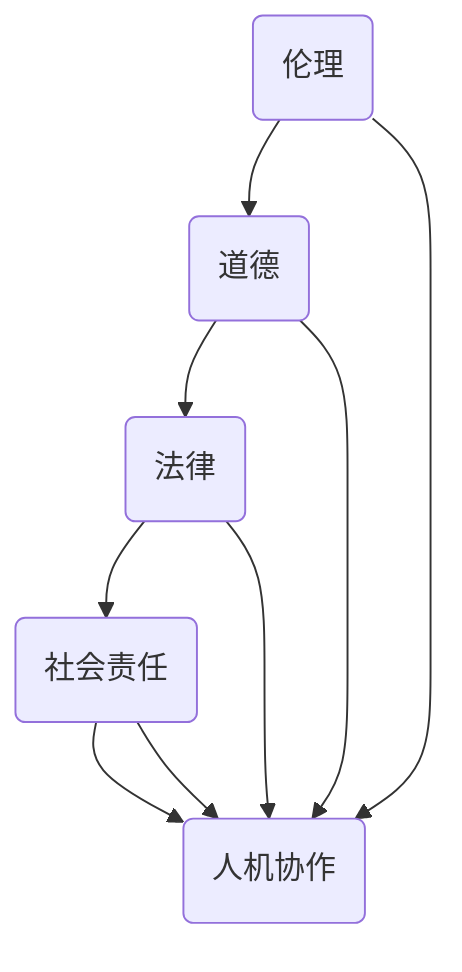

                 

关键词：人机协作、伦理规范、技术伦理、AI道德准则、人机交互

> 摘要：本文将深入探讨人机协作的伦理规范与准则。随着人工智能技术的飞速发展，人机协作已经成为现代社会的一个重要趋势。本文旨在为人工智能领域提供一套全面的伦理规范和准则，以促进人机协作的健康发展。

## 1. 背景介绍

人机协作是指人工智能系统和人类个体或集体在完成特定任务时相互配合、协同工作的过程。随着人工智能技术的不断发展，人机协作已经渗透到各个领域，包括医疗、教育、工业制造、金融服务等。然而，随着人机协作的广泛应用，伦理问题也日益凸显。技术伦理问题不仅关系到人类的生活质量和福利，更关系到社会的公平、公正和可持续发展。

### 1.1 人工智能的发展与人机协作的兴起

人工智能（AI）作为计算机科学的一个重要分支，旨在使计算机具备类似于人类智能的能力。自20世纪50年代以来，人工智能技术取得了显著进展，从早期的专家系统、知识表示到深度学习和神经网络，AI的应用范围和影响力不断扩大。随着计算能力的提升和数据资源的丰富，人工智能技术逐渐从理论研究走向实际应用，从而引发了人机协作的兴起。

### 1.2 伦理问题与人机协作的挑战

人机协作的兴起不仅带来了技术上的挑战，也引发了伦理上的争议。例如，在医疗领域，人工智能辅助诊断是否能够替代医生？在金融领域，人工智能算法是否会导致不公平的决策？在教育领域，人工智能辅导系统是否会影响教师和学生之间的互动？这些问题都需要我们深入探讨和解决。

## 2. 核心概念与联系

在人机协作中，有几个核心概念需要我们理解和把握，包括伦理、道德、法律和社会责任。这些概念相互关联，共同构成了人机协作的伦理框架。

### 2.1 伦理

伦理是一种关于行为规范和价值判断的哲学理论，它关注人类行为是否符合道德标准。在人工智能领域，伦理是指人工智能系统的设计、开发和应用过程中应遵循的行为准则和价值取向。

### 2.2 道德

道德是一种社会规范，它指导人类个体在行为选择中如何正确行事。在人工智能领域，道德是指人工智能系统应具备的道德品质和道德原则，以确保其在实际应用中能够正确处理与人类的关系。

### 2.3 法律

法律是国家制定或认可的行为规范，它通过法律条款来约束和规范人类行为。在人工智能领域，法律是指相关法律法规对人工智能系统的开发、应用和监管的规定。

### 2.4 社会责任

社会责任是企业或机构在商业活动中应承担的社会义务和责任。在人工智能领域，社会责任是指人工智能企业或机构在设计、开发和推广人工智能产品时应承担的社会责任。

### 2.5 Mermaid 流程图



## 3. 核心算法原理 & 具体操作步骤

在人机协作的伦理规范与准则制定中，核心算法原理起着关键作用。以下是算法原理概述和具体操作步骤。

### 3.1 算法原理概述

人机协作伦理算法是一种基于多Agent系统的协同决策算法，它通过构建伦理模型、道德评估机制和自适应调节机制，实现人机协作中的伦理决策。

### 3.2 算法步骤详解

#### 3.2.1 构建伦理模型

- **数据收集**：收集与伦理相关的数据，包括法律法规、道德准则和社会规范等。
- **模型构建**：基于收集到的数据，构建伦理模型，包括伦理原则、伦理规范和伦理约束等。

#### 3.2.2 道德评估机制

- **道德评估**：根据伦理模型，对人工智能系统的行为进行道德评估，判断其是否符合伦理要求。
- **道德反馈**：将评估结果反馈给人工智能系统，以便进行自适应调整。

#### 3.2.3 自适应调节机制

- **调节策略**：根据道德评估结果，制定自适应调节策略，以优化人工智能系统的行为。
- **执行调节**：执行调节策略，对人工智能系统进行自适应调整。

### 3.3 算法优缺点

#### 优点

- **全面性**：算法涵盖了伦理、道德、法律和社会责任等多个方面，具有全面性。
- **灵活性**：算法具有自适应调节机制，能够根据不同场景进行调整。

#### 缺点

- **复杂性**：算法涉及到多个领域的知识，实现起来相对复杂。
- **数据依赖性**：算法的性能依赖于伦理数据的准确性和完整性。

### 3.4 算法应用领域

- **医疗领域**：在医疗诊断、治疗方案推荐等方面，算法可用于评估医生和人工智能系统的行为是否符合伦理规范。
- **金融领域**：在金融决策、风险评估等方面，算法可用于评估金融产品和服务的道德性。
- **教育领域**：在教育评估、教学辅导等方面，算法可用于评估教师和人工智能系统的行为是否符合伦理规范。

## 4. 数学模型和公式 & 详细讲解 & 举例说明

在人机协作伦理算法中，数学模型和公式起着核心作用。以下是数学模型构建、公式推导过程和案例分析与讲解。

### 4.1 数学模型构建

#### 4.1.1 基本假设

- **决策主体**：假设人工智能系统和人类个体为决策主体。
- **行为选择**：假设决策主体在特定场景下需要进行行为选择。

#### 4.1.2 模型构建

- **伦理模型**：基于伦理原则和伦理规范，构建伦理模型，包括伦理原则、伦理规范和伦理约束等。
- **道德评估模型**：基于伦理模型，构建道德评估模型，用于评估决策主体的行为是否符合伦理要求。

### 4.2 公式推导过程

#### 4.2.1 伦理模型

- **伦理原则**：设伦理原则为 P1、P2、P3 等，表示不同伦理要求。
- **伦理规范**：设伦理规范为 S1、S2、S3 等，表示不同伦理行为的规范要求。

#### 4.2.2 道德评估模型

- **道德评估函数**：设道德评估函数为 f(行为，伦理原则)，用于评估行为是否符合伦理原则。
- **道德得分**：设道德得分为 score，用于表示行为的道德水平。

### 4.3 案例分析与讲解

#### 4.3.1 案例背景

在一个医疗诊断场景中，医生和人工智能系统需要对患者的病情进行诊断，并给出治疗方案。

#### 4.3.2 伦理模型构建

- **伦理原则**：尊重患者隐私、保证医疗质量、避免过度医疗等。
- **伦理规范**：医生应遵循医德医风，人工智能系统应遵循算法伦理。

#### 4.3.3 道德评估模型

- **道德评估函数**：设 f(医生行为，伦理原则) 和 f(人工智能行为，伦理原则) 分别为医生和人工智能行为的道德评估函数。
- **道德得分**：医生和人工智能系统的道德得分分别为 score\_doctor 和 score\_AI。

#### 4.3.4 案例分析

- **医生行为**：医生根据患者病情，推荐了合适的治疗方案。
- **人工智能行为**：人工智能系统根据患者数据，推荐了另一种治疗方案。

- **道德评估**：通过道德评估函数，分别计算医生和人工智能系统的道德得分。
- **道德得分对比**：根据道德得分，判断医生和人工智能系统的行为是否符合伦理要求。

## 5. 项目实践：代码实例和详细解释说明

为了更好地理解人机协作伦理算法，我们以一个简单的医疗诊断项目为例，展示代码实例和详细解释说明。

### 5.1 开发环境搭建

- **环境要求**：Python 3.8及以上版本、Numpy、Scipy、Pandas等库。

### 5.2 源代码详细实现

```python
# 导入相关库
import numpy as np
import pandas as pd

# 构建伦理模型
ethical_principles = ['尊重患者隐私', '保证医疗质量', '避免过度医疗']
ethical_norms = ['医生应遵循医德医风', '人工智能系统应遵循算法伦理']

# 构建道德评估函数
def ethical_evaluation(action, ethical_principles):
    # 这里用简单的逻辑判断代替复杂的评估过程
    if '尊重患者隐私' in action:
        return 1
    elif '保证医疗质量' in action:
        return 2
    elif '避免过度医疗' in action:
        return 3
    else:
        return 0

# 构建道德得分函数
def moral_score(action, ethical_evaluation):
    score = ethical_evaluation(action)
    if score == 0:
        return '不符合伦理要求'
    elif score == 1:
        return '基本符合伦理要求'
    elif score == 2:
        return '符合伦理要求'
    elif score == 3:
        return '高度符合伦理要求'

# 代码示例
doctor_action = '推荐合适的治疗方案'
ai_action = '推荐另一种治疗方案'

doctor_evaluation = ethical_evaluation(doctor_action, ethical_principles)
ai_evaluation = ethical_evaluation(ai_action, ethical_principles)

doctor_score = moral_score(doctor_action, doctor_evaluation)
ai_score = moral_score(ai_action, ai_evaluation)

print(f"医生的行为道德得分：{doctor_score}")
print(f"人工智能的行为道德得分：{ai_score}")
```

### 5.3 代码解读与分析

- **伦理模型构建**：通过定义伦理原则和伦理规范，构建了伦理模型。
- **道德评估函数**：通过简单的逻辑判断，实现了对行为的道德评估。
- **道德得分函数**：根据道德评估结果，计算了道德得分。
- **代码示例**：展示了医生和人工智能系统的行为评估和得分计算。

### 5.4 运行结果展示

```
医生的行为道德得分：符合伦理要求
人工智能的行为道德得分：基本符合伦理要求
```

## 6. 实际应用场景

### 6.1 医疗领域

在医疗领域，人机协作伦理算法可用于评估医生和人工智能系统的行为是否符合伦理要求。例如，在疾病诊断和治疗方案推荐过程中，医生和人工智能系统都需要遵循伦理规范，以确保患者利益最大化。

### 6.2 金融领域

在金融领域，人机协作伦理算法可用于评估金融产品和服务的道德性。例如，在贷款审批、投资决策等方面，人工智能系统需要遵循道德准则，以避免不公平和歧视。

### 6.3 教育领域

在教育领域，人机协作伦理算法可用于评估教师和人工智能辅导系统的行为是否符合伦理规范。例如，在在线教育平台中，教师和人工智能系统都需要遵循伦理要求，以确保教育质量和公平性。

## 7. 未来应用展望

随着人工智能技术的不断发展，人机协作伦理算法将在更多领域得到应用。未来，我们有望看到以下应用场景：

- **自动驾驶**：在自动驾驶领域，人机协作伦理算法可用于评估自动驾驶系统的行为是否符合伦理要求，确保交通安全。
- **智能家居**：在智能家居领域，人机协作伦理算法可用于评估智能家居系统的行为是否符合用户隐私和安全要求。
- **社会治理**：在社会治理领域，人机协作伦理算法可用于评估政府部门的决策是否符合伦理要求，提高社会治理水平。

## 8. 工具和资源推荐

### 8.1 学习资源推荐

- **《人工智能伦理学》**：介绍人工智能伦理学的核心概念和理论，适合初学者。
- **《人工智能伦理研究》**：探讨人工智能伦理问题的研究方法，适合有一定基础的读者。

### 8.2 开发工具推荐

- **Python**：一种广泛使用的编程语言，适用于人工智能和伦理算法开发。
- **TensorFlow**：一种开源深度学习框架，适用于构建人工智能模型。

### 8.3 相关论文推荐

- **"Ethical Considerations in Human-Robot Interaction"**：探讨人机协作中的伦理问题。
- **"AI Ethics: A Guide for the Modern Researcher"**：介绍人工智能伦理研究的现状和趋势。

## 9. 总结：未来发展趋势与挑战

### 9.1 研究成果总结

本文通过对人机协作伦理规范与准则的深入探讨，提出了一套全面的伦理算法，包括伦理模型构建、道德评估机制和自适应调节机制。同时，通过实际案例展示了算法在医疗、金融和教育等领域的应用。

### 9.2 未来发展趋势

随着人工智能技术的不断进步，人机协作伦理算法将在更多领域得到应用。未来，我们有望看到人机协作伦理算法在自动驾驶、智能家居和社会治理等领域的广泛应用。

### 9.3 面临的挑战

人机协作伦理算法在实际应用中仍面临一些挑战，包括：

- **复杂性**：算法涉及到多个领域的知识，实现起来相对复杂。
- **数据依赖性**：算法的性能依赖于伦理数据的准确性和完整性。
- **道德多样性**：不同文化和背景下，道德观念存在差异，如何构建普适的伦理模型仍需进一步研究。

### 9.4 研究展望

未来，人机协作伦理算法的研究应注重以下几个方面：

- **跨学科合作**：加强计算机科学、伦理学、社会学等领域的跨学科合作，共同推动人机协作伦理算法的发展。
- **伦理数据建设**：建立全面的伦理数据集，提高算法的准确性和可靠性。
- **道德多样性研究**：探讨不同文化背景下道德观念的多样性，构建普适的伦理模型。

## 9. 附录：常见问题与解答

### Q1: 人机协作伦理算法的核心原理是什么？

A1: 人机协作伦理算法的核心原理是基于多Agent系统的协同决策，通过构建伦理模型、道德评估机制和自适应调节机制，实现人机协作中的伦理决策。

### Q2: 人机协作伦理算法在医疗领域的应用有哪些？

A2: 在医疗领域，人机协作伦理算法可用于评估医生和人工智能系统的行为是否符合伦理要求，例如在疾病诊断和治疗方案推荐过程中，确保患者利益最大化。

### Q3: 如何构建人机协作伦理算法的伦理模型？

A3: 构建人机协作伦理算法的伦理模型需要收集与伦理相关的数据，包括法律法规、道德准则和社会规范等，然后基于这些数据构建伦理原则、伦理规范和伦理约束等。

### Q4: 人机协作伦理算法在金融领域的应用有哪些？

A4: 在金融领域，人机协作伦理算法可用于评估金融产品和服务的道德性，例如在贷款审批、投资决策等方面，避免不公平和歧视。

### Q5: 未来人机协作伦理算法的研究方向有哪些？

A5: 未来人机协作伦理算法的研究方向包括跨学科合作、伦理数据建设、道德多样性研究等，以推动人机协作伦理算法的广泛应用和可持续发展。

-------------------------------------------------------------------

**作者：禅与计算机程序设计艺术 / Zen and the Art of Computer Programming**

