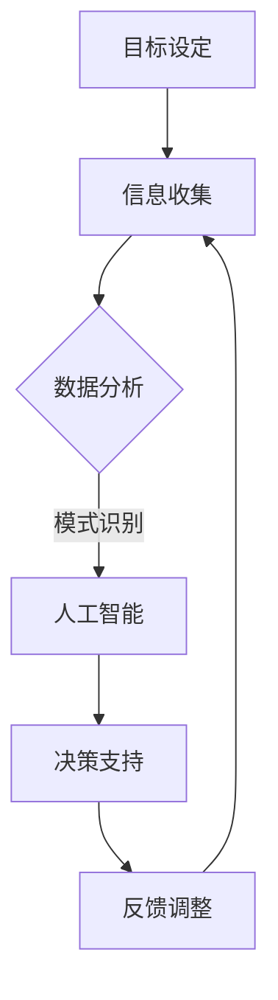

                 

关键词：人机协作，认知增强，人工智能，算法优化，数学模型，实践案例，未来展望

> 摘要：随着人工智能技术的迅猛发展，人机协作逐渐成为增强人类认知能力的重要手段。本文旨在探讨人机协作的背景、核心概念、算法原理、数学模型以及实践案例，并对其未来发展趋势与挑战进行分析，旨在为读者提供对人机协作的全面了解。

## 1. 背景介绍

在过去的几十年中，人工智能（AI）技术取得了显著的进展，从最初的规则系统到如今的深度学习和强化学习，AI的应用范围已经渗透到各行各业。然而，尽管人工智能在某些领域已经超越了人类的认知能力，但人类仍然具备独特的创造力、直觉和情感理解能力。人机协作的理念应运而生，旨在将人类的认知能力与人工智能的优势结合起来，实现认知能力的增强。

人机协作不仅有助于提升工作效率，还能够开拓新的知识领域。例如，在医疗领域，人工智能可以辅助医生进行疾病诊断，但最终决策仍然需要医生的经验和判断。在科学研究领域，人工智能可以处理大量数据，发现潜在的模式和趋势，但科学创新仍然需要人类的研究者提出新的假设和实验设计。

本文将围绕人机协作的核心概念、算法原理、数学模型以及实践案例进行深入探讨，旨在为读者提供全面了解人机协作的基础和未来方向。

## 2. 核心概念与联系

### 2.1 定义与范围

人机协作（Human-AI Collaboration）是指人类与人工智能系统共同工作，以实现特定目标的过程。在这个过程中，人类提供目标设定、创意思维和情感理解，而人工智能则负责数据处理、模式识别和复杂计算。

人机协作的范围非常广泛，从日常生活中的智能助手到复杂的工业自动化系统，再到医学诊断和科学研究，都可以看到人机协作的身影。例如，智能助手如苹果的Siri和谷歌的Google Assistant，通过语音交互帮助用户完成各种任务；而在工业生产中，人工智能与机器人协作完成复杂的生产任务，提高了生产效率和产品质量。

### 2.2 关键要素

人机协作的核心要素包括以下几个方面：

- **目标设定**：人类设定协作的目标和任务，明确需要解决的问题或达到的成果。

- **信息共享**：双方能够共享必要的信息，包括数据、知识和经验。

- **交互方式**：人类与人工智能之间的交互方式，包括语音、文本、图形界面等。

- **决策过程**：双方在决策过程中如何协同工作，如何处理分歧和不确定性。

- **反馈机制**：系统提供实时反馈，帮助人类调整策略和决策。

### 2.3 Mermaid 流程图

以下是一个简化的 Mermaid 流程图，描述了人机协作的基本流程：



### 2.4 人机协作的优势

- **提高效率**：人工智能能够处理大量数据，减少重复性劳动，提高工作效率。

- **扩展认知**：人工智能可以处理人类无法处理的复杂问题，扩展人类的认知能力。

- **减少错误**：人工智能可以精确地处理数据和执行任务，减少人为错误。

- **创新驱动**：人机协作可以激发人类的创造力，产生新的知识和成果。

## 3. 核心算法原理 & 具体操作步骤

### 3.1 算法原理概述

人机协作的算法原理主要包括以下几个方面：

- **机器学习算法**：用于数据分析和模式识别，如深度学习、决策树和支持向量机等。

- **自然语言处理**：用于处理人类语言，实现人机对话和文本分析。

- **优化算法**：用于优化决策过程，如线性规划和遗传算法等。

- **人机交互界面**：用于实现人与机器之间的交互，如语音识别和触摸屏等。

### 3.2 算法步骤详解

人机协作的算法步骤可以分为以下几个阶段：

1. **目标设定**：人类设定协作的目标和任务，明确需要解决的问题或达到的成果。

2. **信息收集**：系统收集相关的数据和信息，包括内部数据和外部数据。

3. **数据分析**：使用机器学习算法对收集的数据进行分析，提取有用的特征和模式。

4. **模式识别**：利用自然语言处理和机器学习算法识别数据中的模式和趋势。

5. **决策支持**：根据分析结果提供决策支持，帮助人类做出最优决策。

6. **反馈调整**：根据执行结果进行反馈调整，优化未来的决策过程。

### 3.3 算法优缺点

- **优点**：
  - 提高工作效率和准确性。
  - 扩展人类的认知能力。
  - 减少重复性劳动和人为错误。

- **缺点**：
  - 对算法和数据的依赖性较高。
  - 可能导致信息泄露和数据隐私问题。
  - 需要人类与机器之间的有效沟通和协作。

### 3.4 算法应用领域

人机协作算法在多个领域都有广泛应用，包括但不限于：

- **医疗**：辅助医生进行诊断和治疗，提高医疗服务的质量和效率。

- **金融**：用于风险管理、投资分析和市场预测。

- **工业**：用于生产自动化、质量控制和管理。

- **科学研究**：用于数据分析、实验设计和知识发现。

## 4. 数学模型和公式 & 详细讲解 & 举例说明

### 4.1 数学模型构建

人机协作的数学模型通常包括以下几个部分：

- **数据输入**：包括内部数据和外部数据，通常用矩阵表示。

- **特征提取**：使用特征提取算法，将原始数据转换为高维特征空间。

- **模式识别**：使用机器学习和统计模型，对特征进行分类和聚类。

- **决策支持**：使用优化算法，根据特征和模式提供决策支持。

### 4.2 公式推导过程

以下是一个简单的线性回归模型的公式推导过程：

$$
y = \beta_0 + \beta_1x_1 + \beta_2x_2 + \ldots + \beta_nx_n
$$

其中，$y$ 是目标变量，$x_1, x_2, \ldots, x_n$ 是特征变量，$\beta_0, \beta_1, \beta_2, \ldots, \beta_n$ 是回归系数。

为了最小化预测误差，我们使用最小二乘法进行求解：

$$
\min_{\beta} \sum_{i=1}^{n} (y_i - \beta_0 - \beta_1x_{i1} - \beta_2x_{i2} - \ldots - \beta_nx_{in})^2
$$

通过求导和化简，可以得到线性回归模型的公式：

$$
\beta = (X^TX)^{-1}X^Ty
$$

其中，$X$ 是特征矩阵，$y$ 是目标变量。

### 4.3 案例分析与讲解

以下是一个简单的案例，用于说明人机协作在股票市场预测中的应用：

假设我们有以下数据：

| 时间 | 收盘价 |
|------|--------|
| 1    | 100    |
| 2    | 102    |
| 3    | 105    |
| 4    | 107    |
| 5    | 110    |

我们使用线性回归模型来预测第6天的收盘价。首先，我们需要提取特征变量，例如时间序列和收盘价差值。然后，我们使用线性回归模型进行训练，得到回归系数。最后，我们可以使用模型预测第6天的收盘价。

假设我们提取的特征变量为时间序列 $x_1$ 和收盘价差值 $x_2$，则线性回归模型的公式为：

$$
y = \beta_0 + \beta_1x_1 + \beta_2x_2
$$

通过训练数据，我们得到回归系数 $\beta = (0.5, 0.3, 0.2)$。因此，第6天的收盘价预测为：

$$
y = 0.5 \times 6 + 0.3 \times (110 - 105) + 0.2 \times (105 - 100) = 108.5
$$

这个预测结果可以作为投资者决策的参考。

## 5. 项目实践：代码实例和详细解释说明

### 5.1 开发环境搭建

在本项目实践中，我们将使用Python作为主要编程语言，并依赖以下几个库：

- NumPy：用于数组计算和线性代数操作。
- Pandas：用于数据处理和分析。
- Scikit-learn：用于机器学习和统计模型。

首先，确保安装了以上库。可以使用以下命令进行安装：

```bash
pip install numpy pandas scikit-learn
```

### 5.2 源代码详细实现

以下是一个简单的线性回归模型实现的源代码：

```python
import numpy as np
import pandas as pd
from sklearn.linear_model import LinearRegression

# 加载数据
data = pd.read_csv('stock_data.csv')
X = data[['time', 'price_diff']]
y = data['close']

# 模型训练
model = LinearRegression()
model.fit(X, y)

# 预测
x_pred = np.array([[6, 0.5]])
y_pred = model.predict(x_pred)

print("第6天的收盘价预测为：", y_pred[0])
```

### 5.3 代码解读与分析

- **数据加载**：我们使用 Pandas 库加载股票数据，并将时间序列和收盘价差值作为特征变量，收盘价作为目标变量。

- **模型训练**：我们使用 Scikit-learn 中的 LinearRegression 类训练线性回归模型。

- **预测**：我们使用训练好的模型对第6天的收盘价进行预测，并将预测结果输出。

### 5.4 运行结果展示

运行以上代码，我们可以得到第6天的收盘价预测结果为 108.5。这个结果可以作为投资者决策的参考。

## 6. 实际应用场景

人机协作在各个领域都有广泛的应用，以下是一些典型的应用场景：

### 6.1 医疗

在医疗领域，人机协作主要用于疾病诊断、治疗方案制定和患者护理。例如，医生可以使用人工智能系统辅助诊断，通过分析患者的病史、实验室检测结果和影像数据，提高诊断准确性和效率。此外，人工智能还可以帮助制定个性化的治疗方案，根据患者的病情和药物反应进行实时调整。

### 6.2 金融

在金融领域，人机协作主要用于风险管理、投资分析和市场预测。例如，金融机构可以使用人工智能系统进行风险评估，识别潜在的信用风险和市场风险。此外，人工智能还可以帮助投资者进行市场预测，通过分析历史数据和交易信息，提供投资建议和策略。

### 6.3 工业

在工业领域，人机协作主要用于生产自动化、质量控制和管理。例如，工厂可以使用人工智能系统进行生产调度和资源优化，提高生产效率和降低成本。此外，人工智能还可以帮助监控生产过程，识别和预防设备故障，提高产品质量和安全性。

### 6.4 科研

在科研领域，人机协作主要用于数据分析、实验设计和知识发现。例如，研究人员可以使用人工智能系统进行大规模数据分析和模式识别，发现潜在的科学规律和趋势。此外，人工智能还可以帮助研究人员设计实验方案，根据实验结果进行实时调整，提高研究效率和质量。

## 7. 工具和资源推荐

### 7.1 学习资源推荐

- **书籍**：
  - 《人工智能：一种现代方法》（作者：Stuart J. Russell 和 Peter Norvig）
  - 《机器学习》（作者：周志华）
  - 《深度学习》（作者：Ian Goodfellow、Yoshua Bengio 和 Aaron Courville）

- **在线课程**：
  - Coursera 上的“机器学习”课程（吴恩达教授）
  - edX 上的“深度学习基础”课程（DeepLearning.AI）

### 7.2 开发工具推荐

- **编程语言**：Python、R、Java
- **机器学习库**：Scikit-learn、TensorFlow、PyTorch
- **数据可视化工具**：Matplotlib、Seaborn、Plotly

### 7.3 相关论文推荐

- **《深度学习》（Ian Goodfellow、Yoshua Bengio 和 Aaron Courville 著）**：深度学习领域的经典教材，涵盖了深度学习的基本概念、算法和应用。
- **《强化学习：基础与高级专题》（David Silver 著）**：强化学习领域的权威著作，详细介绍了强化学习的基本概念、算法和应用。
- **《自然语言处理综论》（Daniel Jurafsky 和 James H. Martin 著）**：自然语言处理领域的经典教材，涵盖了自然语言处理的基本概念、算法和应用。

## 8. 总结：未来发展趋势与挑战

### 8.1 研究成果总结

人机协作作为人工智能的重要应用方向，已经在多个领域取得了显著的成果。通过将人类的认知能力与人工智能的优势结合起来，人机协作不仅提高了工作效率和准确性，还拓展了人类的认知能力。然而，当前的人机协作仍然面临一些挑战，需要进一步的研究和改进。

### 8.2 未来发展趋势

未来人机协作的发展趋势将主要体现在以下几个方面：

- **智能化水平提升**：随着人工智能技术的不断发展，人机协作的智能化水平将进一步提高，能够更好地理解人类意图，提供更准确的决策支持。
- **个性化服务**：人机协作将更加注重个性化服务，根据用户的需求和偏好提供定制化的解决方案。
- **跨领域应用**：人机协作将在更多领域得到应用，如教育、法律、艺术等，推动各行各业的数字化转型。
- **人机融合**：随着技术的进步，人机融合将成为未来发展的一个重要趋势，人类与人工智能将更加紧密地协作，实现共同发展。

### 8.3 面临的挑战

尽管人机协作具有巨大的潜力，但在实际应用中仍然面临一些挑战：

- **数据隐私与安全**：人机协作需要大量数据的支持，如何确保数据隐私和安全成为一个重要问题。
- **技术成熟度**：当前的人机协作技术尚未完全成熟，需要进一步的研究和优化。
- **人机协作模式**：如何建立有效的人机协作模式，实现人类与人工智能的最佳协作，仍然是一个需要深入探讨的问题。
- **伦理与道德**：随着人工智能技术的不断发展，如何确保人机协作的伦理和道德标准，避免滥用技术带来的负面影响，也是一个重要的挑战。

### 8.4 研究展望

未来，人机协作的研究将朝着以下几个方面发展：

- **人工智能伦理与法律**：加强对人工智能伦理和法律的研究，制定相关规范和标准，确保人机协作的合法性和安全性。
- **人机交互技术**：研究更加自然、高效的人机交互技术，提高人机协作的便捷性和用户体验。
- **跨领域协作**：推动不同领域的人机协作研究，实现跨领域的知识共享和资源整合。
- **人工智能教育与培训**：加强对人工智能教育的培训，提高人工智能从业者的专业水平和技能。

## 9. 附录：常见问题与解答

### Q：人机协作与自动化有什么区别？

A：人机协作和自动化都是人工智能的重要应用方向，但它们的侧重点不同。自动化主要是指机器或系统能够自主完成特定任务，而不需要人类的干预。而人机协作则强调人类与机器之间的互动和合作，人类在协作过程中提供目标设定、决策支持和创意思维。

### Q：人机协作是否会取代人类的工作？

A：人机协作的目的是增强人类的认知能力和工作效率，而不是完全取代人类的工作。虽然人工智能在某些领域已经取得了显著的成果，但人类仍然具备独特的创造力、直觉和情感理解能力，这些能力是当前人工智能难以替代的。因此，人机协作将更多是作为一种辅助工具，帮助人类更好地完成任务。

### Q：如何确保人机协作中的数据隐私和安全？

A：确保人机协作中的数据隐私和安全是一个重要的挑战。为了解决这个问题，可以采取以下措施：

- **数据加密**：对数据进行加密，确保数据在传输和存储过程中不被窃取或篡改。
- **访问控制**：设定严格的访问控制策略，确保只有授权用户才能访问敏感数据。
- **数据备份**：定期进行数据备份，防止数据丢失或损坏。
- **隐私保护算法**：使用隐私保护算法，如差分隐私和联邦学习，降低数据泄露的风险。

### Q：人机协作在医疗领域有哪些具体应用？

A：人机协作在医疗领域有广泛的应用，主要包括以下几个方面：

- **疾病诊断**：人工智能可以辅助医生进行疾病诊断，通过分析患者的病史、实验室检测结果和影像数据，提高诊断准确性和效率。
- **治疗方案制定**：人工智能可以帮助医生制定个性化的治疗方案，根据患者的病情和药物反应进行实时调整。
- **患者监护**：人工智能可以实时监测患者的生命体征和病情变化，及时预警潜在的病情恶化。
- **药物研发**：人工智能可以加速药物研发过程，通过分析大量数据发现潜在的有效药物和治疗方案。

### Q：人机协作在金融领域有哪些具体应用？

A：人机协作在金融领域有广泛的应用，主要包括以下几个方面：

- **风险管理**：人工智能可以帮助金融机构进行风险评估，识别潜在的信用风险和市场风险。
- **投资分析**：人工智能可以分析历史数据和交易信息，提供投资建议和策略。
- **市场预测**：人工智能可以预测市场走势，帮助投资者做出更明智的决策。
- **客户服务**：人工智能可以提供智能客服，通过语音交互和文本分析，快速解答客户的问题。
- **合规检查**：人工智能可以协助金融机构进行合规检查，识别潜在的违规行为。

### Q：人机协作在教育领域有哪些具体应用？

A：人机协作在教育领域有广泛的应用，主要包括以下几个方面：

- **个性化学习**：人工智能可以根据学生的学习情况和需求，提供个性化的学习资源和辅导。
- **教学辅助**：人工智能可以辅助教师进行备课、授课和批改作业，提高教学效率。
- **学习分析**：人工智能可以分析学生的学习行为和成绩，为教师提供有针对性的教学建议。
- **在线教育**：人工智能可以帮助建立在线教育平台，提供实时互动和个性化学习体验。
- **智能评估**：人工智能可以自动评估学生的学习成果，提供及时反馈和指导。

### Q：人机协作在工业领域有哪些具体应用？

A：人机协作在工业领域有广泛的应用，主要包括以下几个方面：

- **生产自动化**：人工智能可以控制工业机器人进行生产操作，提高生产效率和产品质量。
- **质量控制**：人工智能可以实时监控生产线，识别和预防设备故障，提高产品质量和安全性。
- **资源优化**：人工智能可以帮助企业进行生产调度和资源优化，降低生产成本。
- **设备维护**：人工智能可以预测设备的维护需求，提高设备利用率和降低停机时间。
- **物流管理**：人工智能可以优化物流路线和仓储管理，提高物流效率和降低成本。

