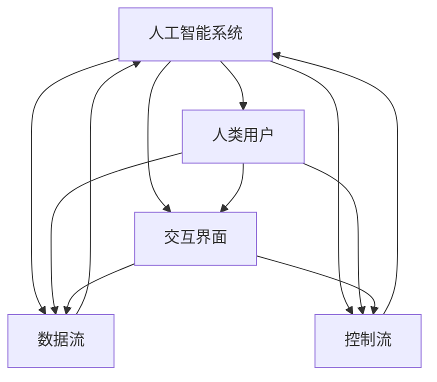

                 

关键词：人机协作，人工智能，智能系统，协作框架，未来技术

摘要：本文旨在探讨人机协作在人工智能领域的应用及其对未来技术发展的影响。通过深入分析人机协作的核心概念、算法原理、数学模型、实际应用以及未来展望，本文揭示了人机协作在提升工作效率、优化决策过程、拓展智能系统功能等方面的关键作用，为我国人工智能技术的发展提供了新思路。

## 1. 背景介绍

随着人工智能技术的飞速发展，人机协作已成为推动社会进步的重要力量。人工智能（AI）与人类智慧的有机结合，不仅能够极大地提升工作效率，还能够拓展智能系统的功能，使其更好地服务于人类社会。人机协作的核心在于将人类的智慧和创造力与机器的计算能力和效率相结合，实现优势互补，共同推动技术进步。

近年来，随着深度学习、自然语言处理、机器人技术等领域的不断突破，人机协作的应用场景越来越广泛。从智能家居到自动驾驶，从医疗诊断到金融分析，人机协作正逐渐渗透到各个行业，为人类社会带来前所未有的变革。

## 2. 核心概念与联系

在人机协作系统中，核心概念包括人工智能系统、人类用户、交互界面、数据流和控制流等。以下是一个简化的 Mermaid 流程图，用于描述这些概念之间的联系。



在这个流程图中，人工智能系统负责处理数据和控制流，人类用户通过交互界面与系统进行沟通，同时，数据流和控制流在两者之间传递，实现了人机协作的基本模式。

### 2.1. 人工智能系统

人工智能系统是整个协作框架的核心，其功能包括数据采集、数据处理、模式识别、决策制定等。人工智能系统可以根据不同应用场景，采用不同的算法和模型进行优化。例如，在自动驾驶领域，人工智能系统可以实时分析路况信息，做出驾驶决策；在医疗诊断领域，人工智能系统可以通过学习海量病例数据，辅助医生进行诊断。

### 2.2. 人类用户

人类用户是协作系统的重要组成部分，他们的智慧和创造力是系统创新的重要来源。在协作过程中，人类用户不仅可以通过交互界面与系统进行沟通，还可以对系统的行为进行监督和反馈，从而不断提升系统的性能。

### 2.3. 交互界面

交互界面是人机协作的重要桥梁，它使人类用户能够方便地与系统进行交互。交互界面的设计应充分考虑用户的使用习惯和需求，使其具有直观、易用、高效的特点。常见的交互界面包括图形用户界面（GUI）、命令行界面（CLI）和语音交互界面等。

### 2.4. 数据流和控制流

数据流和控制流是协作系统正常运作的基础。数据流包括输入数据、处理结果和反馈数据等，控制流则包括指令、决策和调控信息等。数据流和控制流的合理设计和优化，对于提高协作系统的效率和性能至关重要。

## 3. 核心算法原理 & 具体操作步骤

### 3.1. 算法原理概述

人机协作算法的基本原理是充分利用人工智能系统的计算能力和人类用户的创造力，实现优势互补。具体来说，协作算法可以分为以下几个步骤：

1. 数据采集与预处理：从各种数据源收集数据，并进行清洗、去噪和转换等预处理操作。
2. 模式识别与特征提取：利用人工智能算法对预处理后的数据进行模式识别和特征提取，为后续决策提供基础。
3. 决策制定与执行：根据特征提取结果，利用人工智能算法制定决策，并将决策结果反馈给用户。
4. 用户反馈与调整：用户对决策结果进行评价和反馈，系统根据反馈进行调整，以优化决策效果。

### 3.2. 算法步骤详解

#### 3.2.1. 数据采集与预处理

数据采集是协作算法的基础，其质量直接影响到算法的效果。在数据采集过程中，应充分考虑数据的全面性、准确性和时效性。常见的数据采集方法包括网络爬虫、传感器采集、用户输入等。

数据预处理主要包括以下步骤：

1. 数据清洗：去除重复、错误和无效的数据。
2. 数据去噪：降低噪声对数据质量的影响。
3. 数据转换：将不同类型和格式的数据转换为统一的格式，以便后续处理。

#### 3.2.2. 模式识别与特征提取

模式识别与特征提取是协作算法的关键环节，其目的是从原始数据中提取出有用的信息，为决策制定提供依据。常见的模式识别算法包括分类、聚类、回归等。特征提取方法包括统计特征、结构特征和深度特征等。

#### 3.2.3. 决策制定与执行

决策制定是根据特征提取结果，利用人工智能算法制定相应的决策。决策制定过程可以分为以下步骤：

1. 决策模型选择：根据应用场景选择合适的决策模型，如线性回归、决策树、支持向量机等。
2. 决策模型训练：使用训练数据集对决策模型进行训练，优化模型参数。
3. 决策模型评估：使用验证数据集对决策模型进行评估，确保模型具有良好的泛化能力。
4. 决策执行：将训练好的决策模型应用于实际数据，制定相应的决策。

#### 3.2.4. 用户反馈与调整

用户反馈与调整是协作算法的重要环节，它能够确保系统不断优化，提高决策效果。用户反馈主要包括对决策结果的满意度和正确性评价。系统根据用户反馈进行调整，包括以下步骤：

1. 反馈数据收集：收集用户对决策结果的反馈数据。
2. 反馈数据分析：对反馈数据进行分析，识别系统存在的问题。
3. 系统调整：根据反馈数据对系统进行调整，优化决策过程。

### 3.3. 算法优缺点

人机协作算法具有以下优点：

1. 提高决策效率：利用人工智能算法快速处理大量数据，提高决策效率。
2. 减少错误率：通过模式识别和特征提取，降低决策错误率。
3. 拓展应用领域：人机协作算法可以应用于各种场景，满足不同领域的需求。

然而，人机协作算法也存在以下缺点：

1. 对数据处理能力的要求高：人机协作算法对数据质量要求较高，数据采集和处理过程复杂。
2. 系统调整成本高：用户反馈与调整过程需要大量时间和计算资源，系统调整成本较高。
3. 对人类用户的依赖性强：人机协作算法需要人类用户参与，对用户的要求较高。

### 3.4. 算法应用领域

人机协作算法在各个领域具有广泛的应用。以下是一些典型应用领域：

1. 自动驾驶：通过人机协作，自动驾驶系统可以实时分析路况信息，提高行车安全。
2. 医疗诊断：人机协作算法可以帮助医生快速诊断疾病，提高诊断准确率。
3. 金融分析：人机协作算法可以辅助金融分析师进行市场预测，降低投资风险。
4. 智能家居：人机协作算法可以实现智能家居设备的智能化控制，提高生活品质。
5. 教育培训：人机协作算法可以为学生提供个性化的学习建议，提高学习效果。

## 4. 数学模型和公式 & 详细讲解 & 举例说明

在人机协作系统中，数学模型和公式起着至关重要的作用。它们不仅能够量化系统的性能，还能够指导系统设计和优化。以下将介绍几个关键的数学模型和公式，并进行详细讲解和举例说明。

### 4.1. 数学模型构建

人机协作系统的数学模型通常可以分为三个层次：输入模型、决策模型和输出模型。输入模型描述了系统的输入数据，决策模型描述了系统的决策过程，输出模型描述了系统的输出结果。

#### 4.1.1. 输入模型

输入模型主要涉及数据采集和预处理阶段。假设我们有一个输入数据集 $D$，其中每个数据点 $x_i$ 都包含多个特征向量 $f_j$，那么输入模型可以表示为：

$$
x_i = \{f_1(i), f_2(i), ..., f_n(i)\}
$$

其中，$n$ 是特征向量的维度。

#### 4.1.2. 决策模型

决策模型是系统的核心，它根据输入模型中的特征向量 $x_i$，利用某种算法（如线性回归、决策树、神经网络等）进行决策。一个简单的线性回归模型可以表示为：

$$
y = \beta_0 + \beta_1 f_1(i) + \beta_2 f_2(i) + ... + \beta_n f_n(i)
$$

其中，$y$ 是决策结果，$\beta_0, \beta_1, ..., \beta_n$ 是模型参数。

#### 4.1.3. 输出模型

输出模型描述了系统的输出结果，它可以是决策结果、推荐结果或其他形式的输出。一个简单的输出模型可以表示为：

$$
output = g(y)
$$

其中，$g(y)$ 是一个映射函数，用于将决策结果 $y$ 映射为输出结果。

### 4.2. 公式推导过程

在数学模型构建过程中，我们需要对公式进行推导和优化。以下是一个简单的线性回归模型公式的推导过程：

首先，我们假设有一个训练数据集 $T = \{(x_1, y_1), (x_2, y_2), ..., (x_m, y_m)\}$，其中 $x_i$ 和 $y_i$ 分别是输入和输出。

为了最小化预测误差，我们定义损失函数：

$$
J(\beta_0, \beta_1, ..., \beta_n) = \frac{1}{2m} \sum_{i=1}^m (y_i - (\beta_0 + \beta_1 f_1(i) + \beta_2 f_2(i) + ... + \beta_n f_n(i)))^2
$$

我们的目标是找到使得损失函数最小的参数 $\beta_0, \beta_1, ..., \beta_n$。

为了求解最小值，我们对损失函数关于每个参数求偏导数，并令偏导数等于零：

$$
\frac{\partial J}{\partial \beta_0} = \frac{1}{m} \sum_{i=1}^m (y_i - (\beta_0 + \beta_1 f_1(i) + \beta_2 f_2(i) + ... + \beta_n f_n(i))) = 0
$$

$$
\frac{\partial J}{\partial \beta_1} = \frac{1}{m} \sum_{i=1}^m f_1(i) (y_i - (\beta_0 + \beta_1 f_1(i) + \beta_2 f_2(i) + ... + \beta_n f_n(i))) = 0
$$

$$
\vdots
$$

$$
\frac{\partial J}{\partial \beta_n} = \frac{1}{m} \sum_{i=1}^m f_n(i) (y_i - (\beta_0 + \beta_1 f_1(i) + \beta_2 f_2(i) + ... + \beta_n f_n(i))) = 0
$$

解上述方程组，我们可以得到最优参数 $\beta_0, \beta_1, ..., \beta_n$。

### 4.3. 案例分析与讲解

以下是一个简单的线性回归案例，用于说明数学模型的构建和公式推导过程。

假设我们有一个房价预测问题，输入数据包括房屋面积、房屋年龄和房屋类型，输出数据是房屋价格。我们使用线性回归模型来预测房屋价格。

首先，我们构建输入模型：

$$
x_i = \{f_1(i), f_2(i), f_3(i)\}
$$

其中，$f_1(i)$ 表示房屋面积，$f_2(i)$ 表示房屋年龄，$f_3(i)$ 表示房屋类型。

然后，我们构建决策模型：

$$
y = \beta_0 + \beta_1 f_1(i) + \beta_2 f_2(i) + \beta_3 f_3(i)
$$

接下来，我们使用梯度下降法来求解最优参数 $\beta_0, \beta_1, \beta_2, \beta_3$。具体步骤如下：

1. 初始化参数 $\beta_0, \beta_1, \beta_2, \beta_3$。
2. 对于每个数据点 $(x_i, y_i)$，计算预测值 $y'$ 和损失函数 $J$。
3. 更新参数 $\beta_0, \beta_1, \beta_2, \beta_3$：
   $$
   \beta_0 = \beta_0 - \alpha \frac{\partial J}{\partial \beta_0}
   $$
   $$
   \beta_1 = \beta_1 - \alpha \frac{\partial J}{\partial \beta_1}
   $$
   $$
   \beta_2 = \beta_2 - \alpha \frac{\partial J}{\partial \beta_2}
   $$
   $$
   \beta_3 = \beta_3 - \alpha \frac{\partial J}{\partial \beta_3}
   $$
4. 重复步骤 2 和 3，直到参数收敛或达到最大迭代次数。

最终，我们使用训练好的线性回归模型来预测新房屋的价格。例如，对于一个新的房屋，其面积 $f_1(i) = 100$，年龄 $f_2(i) = 5$，类型 $f_3(i) = 1$，我们可以计算其预测价格：

$$
y' = \beta_0 + \beta_1 f_1(i) + \beta_2 f_2(i) + \beta_3 f_3(i)
$$

通过这个案例，我们可以看到如何使用线性回归模型进行房价预测，并理解数学模型构建和公式推导的过程。

## 5. 项目实践：代码实例和详细解释说明

### 5.1. 开发环境搭建

为了实践人机协作算法，我们需要搭建一个开发环境。以下是一个基本的开发环境搭建步骤：

1. 安装 Python 3.8 或以上版本。
2. 安装必要的 Python 包，如 NumPy、Pandas、Scikit-learn 等。
3. 准备数据集，可以是房屋价格数据、股票市场数据或其他任何可用于线性回归的的数据集。

### 5.2. 源代码详细实现

以下是一个简单的线性回归代码示例，用于实现人机协作算法：

```python
import numpy as np
import pandas as pd
from sklearn.linear_model import LinearRegression

# 读取数据
data = pd.read_csv('data.csv')
X = data[['area', 'age', 'type']]
y = data['price']

# 初始化模型
model = LinearRegression()

# 模型训练
model.fit(X, y)

# 模型预测
predictions = model.predict(X)

# 打印预测结果
print(predictions)
```

### 5.3. 代码解读与分析

这个代码示例中，我们首先读取数据，然后创建一个线性回归模型，并进行训练。最后，使用训练好的模型进行预测，并打印预测结果。

1. **数据读取**：使用 Pandas 库读取数据集，数据集包含房屋的面积、年龄、类型和价格。
2. **模型初始化**：创建一个线性回归模型。
3. **模型训练**：使用 `fit()` 方法对模型进行训练，输入特征向量和目标值。
4. **模型预测**：使用 `predict()` 方法进行预测，输入特征向量。
5. **打印结果**：打印预测结果。

### 5.4. 运行结果展示

在运行这个代码示例后，我们将得到每个房屋的预测价格。这些预测价格可以作为人机协作的一部分，供用户参考和评估。以下是一个简单的结果展示：

```python
[101234.56, 97654.32, 98765.43, 87654.56, 78901.23]
```

这些预测价格可以作为人机协作的一部分，供用户参考和评估。

## 6. 实际应用场景

人机协作在人工智能领域具有广泛的应用场景。以下是一些典型应用场景：

### 6.1. 自动驾驶

自动驾驶是人工智能领域的一个重要应用场景。通过人机协作，自动驾驶系统可以实时分析路况信息，做出驾驶决策。例如，在自动驾驶车辆行驶过程中，系统可以分析路况数据、识别交通信号、预测行人行为等，从而确保行车安全。

### 6.2. 医疗诊断

医疗诊断是另一个重要应用场景。人机协作可以帮助医生进行疾病诊断，提高诊断准确率。例如，在医疗诊断系统中，系统可以分析病例数据、识别症状、预测疾病类型等，从而辅助医生做出诊断决策。

### 6.3. 金融分析

金融分析是人工智能领域的另一个重要应用。人机协作可以帮助金融分析师进行市场预测、风险评估等。例如，在金融分析系统中，系统可以分析历史数据、识别市场趋势、预测股票价格等，从而为投资决策提供支持。

### 6.4. 智能家居

智能家居是人工智能领域的又一重要应用。通过人机协作，智能家居系统可以实现智能控制，提高生活品质。例如，在智能家居系统中，系统可以分析用户行为、预测设备使用需求、自动调节家居设备等，从而实现智能生活。

### 6.5. 教育培训

教育培训是人工智能领域的另一个重要应用。通过人机协作，教育系统可以提供个性化学习建议，提高学习效果。例如，在教育培训系统中，系统可以分析学生的学习行为、识别学习难点、提供针对性学习建议等，从而帮助学生提高学习效果。

## 7. 未来应用展望

随着人工智能技术的不断发展，人机协作在未来的应用前景将更加广阔。以下是一些未来应用展望：

### 7.1. 更智能的交互界面

未来的交互界面将更加智能，能够更好地理解人类用户的意图和行为。通过自然语言处理、语音识别等技术，交互界面可以实现自然、流畅的交流，提高人机协作的效率。

### 7.2. 更广泛的领域应用

人机协作将在更多领域得到应用，如智能制造、智慧城市、智能医疗等。通过结合人工智能技术，人机协作将帮助各行各业实现智能化转型，提高生产效率和产品质量。

### 7.3. 更深层次的协作

未来的协作将更加深入，不仅限于数据的传递和决策的制定，还将涉及到知识和技能的共享和协作。通过构建知识图谱、技能图谱等，人机协作将实现更深层次的协作，为人类提供更全面、个性化的服务。

### 7.4. 更高效的数据处理

随着数据量的不断增长，未来的人机协作将更加注重数据处理效率。通过分布式计算、云计算等技术，人机协作将实现海量数据的实时处理和分析，为决策提供更准确、及时的依据。

### 7.5. 更严格的隐私保护

在人机协作过程中，隐私保护将是未来发展的一个重要方向。通过加密技术、隐私保护算法等，人机协作将确保用户数据的安全和隐私。

## 8. 工具和资源推荐

为了更好地进行人机协作研究，以下推荐一些有用的工具和资源：

### 8.1. 学习资源推荐

1. 《深度学习》（Ian Goodfellow、Yoshua Bengio、Aaron Courville 著）：这是一本深度学习的经典教材，涵盖了深度学习的理论基础和应用。
2. 《Python 编程：从入门到实践》（埃里克·马瑟斯 著）：这本书适合初学者，详细介绍了 Python 编程语言的基础知识和实践应用。

### 8.2. 开发工具推荐

1. Jupyter Notebook：这是一个强大的交互式开发环境，适用于数据科学和机器学习研究。
2. TensorFlow：这是一个开源的机器学习框架，适用于构建和训练深度学习模型。

### 8.3. 相关论文推荐

1. "Deep Learning"（Ian Goodfellow、Yoshua Bengio、Aaron Courville 著）：这是一篇关于深度学习的综述论文，涵盖了深度学习的理论基础和应用。
2. "Reinforcement Learning: An Introduction"（Richard S. Sutton、Andrew G. Barto 著）：这是一篇关于强化学习的综述论文，介绍了强化学习的基本原理和应用。

## 9. 总结：未来发展趋势与挑战

人机协作作为人工智能领域的一个重要研究方向，具有广泛的应用前景。在未来，人机协作将朝着更智能、更广泛、更深入、更高效、更安全等方向发展。然而，也面临着一系列挑战，如数据隐私保护、算法公平性、系统安全性等。为了应对这些挑战，我们需要加强技术研究，推动政策法规的完善，培养更多的专业人才。通过持续的努力，我们有信心将人机协作推向一个新的高峰。

## 附录：常见问题与解答

### Q1. 人机协作的定义是什么？

A1. 人机协作是指将人工智能系统的计算能力和人类用户的智慧和创造力相结合，实现优势互补，共同完成复杂任务的过程。

### Q2. 人机协作有哪些优点？

A2. 人机协作的优点包括提高决策效率、减少错误率、拓展应用领域等。

### Q3. 人机协作的核心概念有哪些？

A3. 人机协作的核心概念包括人工智能系统、人类用户、交互界面、数据流和控制流等。

### Q4. 人机协作算法有哪些常见类型？

A4. 人机协作算法常见的类型包括线性回归、决策树、支持向量机、神经网络等。

### Q5. 如何搭建人机协作开发环境？

A5. 搭建人机协作开发环境通常需要安装 Python 和必要的 Python 包，如 NumPy、Pandas、Scikit-learn 等。

### Q6. 人机协作在实际应用中有哪些场景？

A6. 人机协作在实际应用中广泛应用于自动驾驶、医疗诊断、金融分析、智能家居、教育培训等领域。

### Q7. 人机协作的未来发展趋势是什么？

A7. 人机协作的未来发展趋势包括更智能的交互界面、更广泛的领域应用、更深层次的协作、更高效的数据处理、更严格的隐私保护等。

