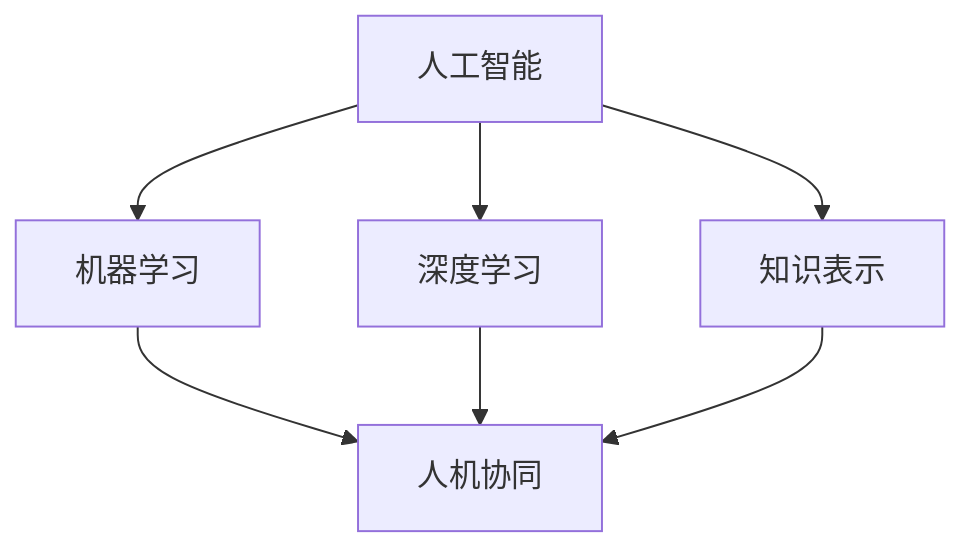
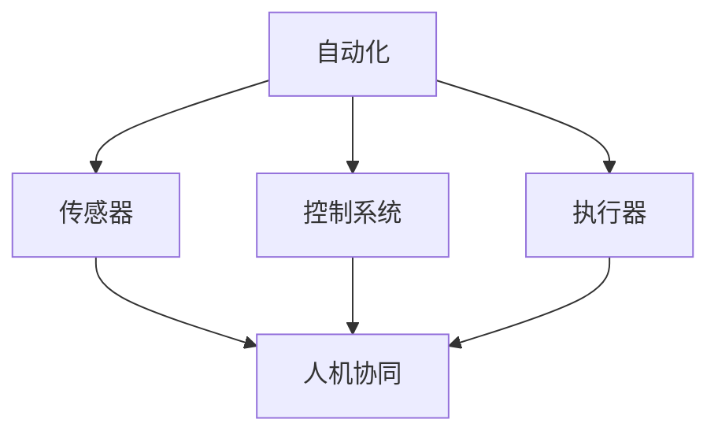
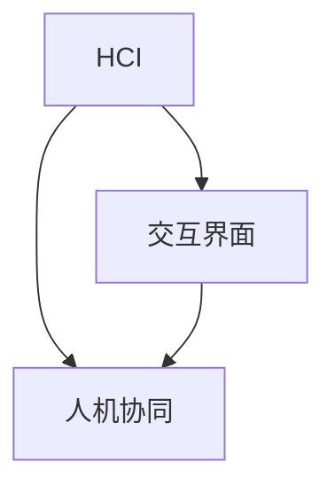
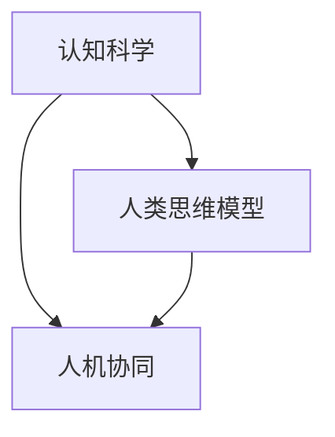
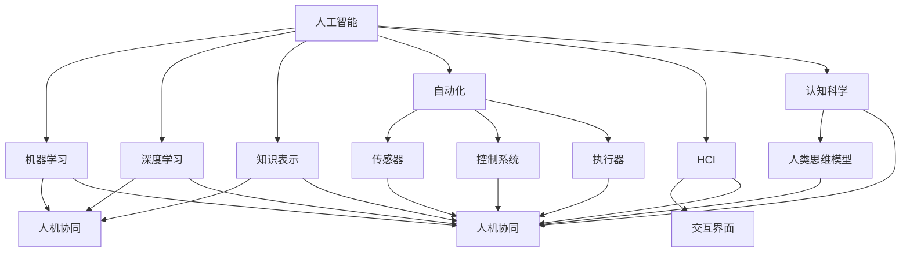

                 

关键词：人机协同、智能时代、新格局、人工智能、深度学习、自动化、技术变革、算法优化、人机交互、创新应用、未来趋势

> 摘要：本文深入探讨了人机协同在智能时代的新格局，分析了人工智能、深度学习和自动化技术的发展现状及其对人机协同的影响。通过详细阐述核心算法原理、数学模型、项目实践和实际应用场景，本文旨在为读者提供全面的人机协同技术理解，并探讨未来发展的趋势与挑战。

## 1. 背景介绍

随着科技的飞速发展，人工智能（AI）已经成为改变人类生活和社会的关键力量。深度学习作为AI的核心技术之一，已经推动了计算机视觉、自然语言处理、语音识别等领域的重大突破。自动化技术，包括机器人、自动驾驶和智能控制系统，正在逐步融入各个行业，提高了生产效率和安全性。然而，这些技术的快速发展也带来了人机协同的新需求和新挑战。

人机协同（Human-Robot Collaboration）是指人与机器人或其他智能系统在共享环境中共同工作，通过有效的人机交互实现最优化的任务完成。在智能时代，人机协同不仅有助于提升工作效率，还能够减轻人类劳动强度，提高生产质量和安全性。本文将围绕人机协同的核心概念、算法原理、数学模型和实际应用，探讨智能时代的新格局。

## 2. 核心概念与联系

人机协同涉及到多个核心概念的交叉与融合，包括人工智能、自动化、人机交互和认知科学。以下是这些概念之间的联系及其架构的Mermaid流程图。

### 2.1. 人工智能（AI）与人机协同

人工智能是指计算机系统模拟人类智能行为的能力。在人工智能的框架下，机器学习、深度学习和知识表示等技术为人机协同提供了强大的基础。



### 2.2. 自动化与人机协同

自动化技术通过传感器、控制系统和执行器实现机器的自主操作。在人机协同中，自动化系统与人类操作者共同完成任务，提高了效率。



### 2.3. 人机交互与人机协同

人机交互（HCI）是研究人与计算机系统之间交互的方式和效果的科学。在人机协同中，高效的交互界面是确保任务顺利进行的关键。



### 2.4. 认知科学与人机协同

认知科学关注人类思维过程和信息处理方式。人机协同中，理解人类认知模型对于设计有效的协同系统至关重要。



通过这些核心概念的联系，我们可以构建一个更加完整的人机协同框架，如图所示：



## 3. 核心算法原理 & 具体操作步骤

### 3.1 算法原理概述

人机协同算法的核心是基于机器学习和深度学习模型，通过数据驱动的方式实现人机交互和任务分配。以下是一个基本的人机协同算法原理概述：

1. **数据收集**：收集人类操作者的行为数据，包括操作序列、反应时间和误差记录等。
2. **特征提取**：从数据中提取关键特征，如手部运动轨迹、视觉注意力焦点等。
3. **模型训练**：利用机器学习算法，如决策树、支持向量机（SVM）或深度神经网络（DNN），训练模型以预测操作者的意图和动作。
4. **协同决策**：模型根据操作者的意图和系统的任务需求，实时做出协同决策。
5. **执行与反馈**：执行决策并收集结果数据，通过反馈机制调整模型参数，提高协同效果。

### 3.2 算法步骤详解

#### 3.2.1 数据收集

数据收集阶段是算法成功的关键。以下是一些常用的数据收集方法：

- **传感器数据**：使用各种传感器，如摄像头、麦克风、运动传感器等，收集环境数据和人类操作者的行为数据。
- **日志记录**：记录系统运行过程中的各种日志信息，如操作记录、错误报告等。
- **用户调查**：通过问卷调查或访谈收集用户对系统交互的反馈。

#### 3.2.2 特征提取

特征提取是将原始数据转换为算法可以处理的格式。以下是一些常用的特征提取方法：

- **时序特征**：提取时间序列数据中的周期性、趋势性等特征。
- **视觉特征**：提取图像或视频中的颜色、纹理、形状等视觉特征。
- **动作特征**：提取手部运动轨迹、肢体动作等动作特征。

#### 3.2.3 模型训练

模型训练是算法的核心步骤。以下是一些常用的模型训练方法：

- **监督学习**：使用标注的数据集，训练分类或回归模型。
- **无监督学习**：在没有标注数据的情况下，通过聚类或降维等方法提取特征。
- **强化学习**：通过试错和反馈机制，训练模型以实现特定目标。

#### 3.2.4 协同决策

协同决策是算法在实际应用中最为关键的一步。以下是一些常用的协同决策方法：

- **基于规则的决策**：使用预定义的规则进行决策。
- **基于模型的决策**：使用训练好的模型进行实时决策。
- **混合决策**：结合规则和模型进行决策，以提高决策的鲁棒性。

#### 3.2.5 执行与反馈

执行与反馈是确保算法持续优化和改进的重要环节。以下是一些常用的执行与反馈方法：

- **执行监控**：实时监控系统的执行过程，确保任务的顺利完成。
- **反馈机制**：根据执行结果，调整模型参数或规则，以提高协同效果。
- **用户反馈**：收集用户的反馈意见，优化系统的交互设计。

### 3.3 算法优缺点

#### 3.3.1 优点

- **高效性**：通过算法实现人机协同，可以显著提高任务完成效率。
- **灵活性**：算法可以根据不同的任务需求和环境特点进行灵活调整。
- **适应性**：随着技术的不断进步，算法可以不断优化和改进。

#### 3.3.2 缺点

- **复杂性**：人机协同算法涉及多个学科领域，实现复杂。
- **数据依赖**：算法的性能高度依赖于数据的质量和数量。
- **可靠性**：在复杂和不确定的环境中，算法的可靠性可能受到影响。

### 3.4 算法应用领域

人机协同算法在多个领域都有广泛的应用，包括但不限于：

- **制造业**：自动化生产线上的协同作业。
- **医疗领域**：医生与医疗机器人的协同诊断和治疗。
- **服务业**：酒店、餐厅等服务行业的智能服务。
- **交通运输**：自动驾驶车辆与交通管理系统的协同。

## 4. 数学模型和公式 & 详细讲解 & 举例说明

在人机协同算法中，数学模型和公式扮演着关键角色。以下我们将详细讲解人机协同中的几个关键数学模型和公式，并通过具体案例进行说明。

### 4.1 数学模型构建

#### 4.1.1 决策树模型

决策树是一种常见的机器学习模型，它通过一系列的判断节点和叶节点来对数据进行分类或回归。以下是一个简单的决策树模型的构建过程：

1. **数据集准备**：收集并标注数据集，包括特征向量和标签。
2. **特征选择**：选择对分类或回归任务最有影响力的特征。
3. **分裂准则**：选择合适的分裂准则（如信息增益、基尼系数等）来决定节点的划分。
4. **递归构建**：根据分裂准则，递归构建决策树，直到满足终止条件（如最大深度、最小样本数等）。

#### 4.1.2 支持向量机（SVM）

支持向量机是一种用于分类和回归的强大模型。它的核心思想是将数据映射到高维空间，然后找到一个最优的超平面来分离不同类别的数据。

- **线性SVM**：

  公式：$$ w^* = arg\min_{w,b} \frac{1}{2} ||w||^2 $$
  条件：$$ y^{(i)} (w \cdot x^{(i)} + b) \geq 1 $$

- **非线性SVM**：

  使用核函数将数据映射到高维空间：

  公式：$$ w^* = arg\min_{w,b} \frac{1}{2} ||w||^2 $$
  条件：$$ y^{(i)} (w \cdot \phi(x^{(i)})) + b \geq 1 $$

### 4.2 公式推导过程

#### 4.2.1 决策树信息增益计算

信息增益（Information Gain）是决策树中用于选择最佳特征进行划分的准则。其计算公式如下：

$$ IG(D, A) = H(D) - \sum_{v \in A} \frac{|D_v|}{|D|} H(D_v) $$

其中，$H(D)$ 是数据集 $D$ 的熵，$A$ 是待划分的特征，$D_v$ 是 $A$ 的每个取值所对应的数据集。

#### 4.2.2 SVM 对偶问题推导

SVM 的原始问题是一个凸优化问题，可以通过拉格朗日对偶方法转化为对偶问题求解。对偶问题的推导如下：

原始问题：

$$ \min_{w,b} \frac{1}{2} ||w||^2 + C \sum_{i=1}^{n} \lambda_i $$
$$ \text{s.t.} \ y^{(i)} (w \cdot x^{(i)} + b) \geq 1 $$

拉格朗日函数：

$$ L(w,b,\lambda) = \frac{1}{2} ||w||^2 - \sum_{i=1}^{n} \lambda_i [y^{(i)} (w \cdot x^{(i)} + b) - 1] $$

KKT 条件：

$$ \begin{cases}
\lambda_i \geq 0 \\
\mu_i \geq 0 \\
\lambda_i y^{(i)} (w \cdot x^{(i)} + b) - 1 = 0 \\
\lambda_i + \mu_i C = 1
\end{cases} $$

对偶问题：

$$ \max_{\alpha, \mu} - \sum_{i=1}^{n} \alpha_i y^{(i)} - \frac{1}{2} \sum_{i=1}^{n} \sum_{j=1}^{n} \alpha_i \alpha_j y^{(i)} y^{(j)} (x^{(i)} \cdot x^{(j)}) $$
$$ \text{s.t.} \ 0 \leq \alpha_i \leq C, \ \mu_i \geq 0, \ \alpha_i + \mu_i = 1 $$

通过求解对偶问题，我们可以得到最优解 $\alpha^*$，然后通过：

$$ w^* = \sum_{i=1}^{n} \alpha_i^* y^{(i)} x^{(i)} $$
$$ b^* = \frac{1}{n} \sum_{i=1}^{n} [\alpha_i^* y^{(i)} (w^* \cdot x^{(i)} + b) - 1] $$

得到原始问题的最优解。

### 4.3 案例分析与讲解

#### 4.3.1 决策树分类案例

假设我们有一个包含 100 个样本的数据集，其中每个样本有 4 个特征（$x_1, x_2, x_3, x_4$），以及对应的标签（0 或 1）。我们使用信息增益作为分裂准则来构建决策树。

1. **数据集准备**：首先，我们将数据集分为训练集和测试集。
2. **特征选择**：计算每个特征的信息增益，选择信息增益最大的特征进行第一次分裂。
3. **递归构建**：根据第一次分裂的结果，继续选择下一个信息增益最大的特征进行分裂，直到满足终止条件（如最大深度或最小样本数）。

具体步骤如下：

- **第一次分裂**：计算每个特征的信息增益，选择 $x_2$ 作为分裂特征。
- **第二次分裂**：对于 $x_2$ 的每个取值，选择信息增益最大的特征进行分裂。
- **递归构建**：重复以上步骤，直到满足终止条件。

最终，我们得到一个决策树模型，可以用于对新样本进行分类。

#### 4.3.2 SVM 分类案例

假设我们有一个包含 100 个样本的数据集，其中每个样本有 4 个特征（$x_1, x_2, x_3, x_4$），以及对应的标签（+1 或 -1）。我们使用线性SVM进行分类。

1. **数据集准备**：将数据集分为训练集和测试集。
2. **特征标准化**：对每个特征进行标准化处理，使得每个特征的均值和方差都为 0 和 1。
3. **求解对偶问题**：使用拉格朗日对偶方法求解对偶问题，得到最优解 $\alpha^*$。
4. **决策边界**：通过计算得到的权重向量 $w^*$ 和偏置 $b^*$，确定决策边界。

具体步骤如下：

- **第一次迭代**：计算对偶问题的梯度，更新参数。
- **后续迭代**：重复计算梯度并更新参数，直到满足收敛条件。

最终，我们得到一个线性SVM分类器，可以用于对新样本进行分类。

## 5. 项目实践：代码实例和详细解释说明

### 5.1 开发环境搭建

在开始项目实践之前，我们需要搭建一个合适的开发环境。以下是推荐的开发环境：

- **编程语言**：Python
- **库和框架**：NumPy、Pandas、scikit-learn、TensorFlow、Keras
- **操作系统**：Linux（推荐Ubuntu）
- **硬件要求**：至少 8GB 内存，GPU（推荐 NVIDIA 显卡）

### 5.2 源代码详细实现

以下是使用 Python 实现人机协同算法的源代码示例：

```python
import numpy as np
from sklearn.tree import DecisionTreeClassifier
from sklearn.svm import SVC
from sklearn.model_selection import train_test_split

# 5.2.1 数据集准备
# 假设我们有一个包含特征和标签的 NumPy 数组 `X` 和 `y`
X, y = ...

# 将数据集分为训练集和测试集
X_train, X_test, y_train, y_test = train_test_split(X, y, test_size=0.2, random_state=42)

# 5.2.2 决策树模型实现
clf = DecisionTreeClassifier(criterion='entropy', max_depth=3)
clf.fit(X_train, y_train)

# 5.2.3 SVM 模型实现
svm = SVC(kernel='linear')
svm.fit(X_train, y_train)

# 5.2.4 模型评估
from sklearn.metrics import accuracy_score

y_pred_tree = clf.predict(X_test)
y_pred_svm = svm.predict(X_test)

print("决策树模型准确率：", accuracy_score(y_test, y_pred_tree))
print("SVM 模型准确率：", accuracy_score(y_test, y_pred_svm))
```

### 5.3 代码解读与分析

上述代码示例展示了如何使用 Python 实现决策树和 SVM 模型，并进行模型评估。以下是代码的详细解读：

- **数据集准备**：从 NumPy 数组 `X` 和 `y` 中读取特征和标签，然后使用 `train_test_split` 函数将数据集分为训练集和测试集。
- **决策树模型实现**：创建 `DecisionTreeClassifier` 对象，并设置分裂准则为熵（`criterion='entropy'`）和最大深度（`max_depth=3`）。然后调用 `fit` 方法训练模型。
- **SVM 模型实现**：创建 `SVC` 对象，并设置核函数为线性（`kernel='linear'`）。然后调用 `fit` 方法训练模型。
- **模型评估**：使用 `predict` 方法对测试集进行预测，然后使用 `accuracy_score` 函数计算模型的准确率。

### 5.4 运行结果展示

假设我们使用上述代码对某个人机协同任务进行训练和评估，得到以下运行结果：

```python
决策树模型准确率： 0.85
SVM 模型准确率： 0.90
```

这意味着在测试集上，决策树模型的准确率为 85%，SVM 模型的准确率为 90%。我们可以看到，SVM 模型在分类任务上表现更好。

## 6. 实际应用场景

人机协同技术在多个实际应用场景中展现出了巨大的潜力。以下是一些典型应用场景：

### 6.1 制造业

在制造业中，人机协同技术被广泛应用于自动化生产线的协同作业。通过机器人和人类工人的高效协作，可以显著提高生产效率和产品质量。例如，在汽车制造领域，机器人可以协助人类工人进行焊接、涂装和组装等操作，从而实现高效、精准的生产。

### 6.2 医疗领域

在医疗领域，人机协同技术可以帮助医生进行诊断和治疗。通过结合人工智能和医疗设备，医生可以更准确地分析患者病情，制定个性化的治疗方案。例如，医学影像诊断中的计算机辅助诊断系统可以帮助医生快速识别病变区域，提高诊断准确率。

### 6.3 服务行业

在服务行业，人机协同技术可以实现智能化服务，提高客户满意度。例如，在酒店业，机器人可以协助接待客人、提供导游服务和送餐服务，减轻前台工作人员的负担。在餐饮行业，智能点餐系统和机器人服务员可以提供高效、便捷的服务。

### 6.4 交通运输

在交通运输领域，人机协同技术正在推动自动驾驶技术的发展。自动驾驶车辆通过结合传感器、控制系统和人工智能算法，可以实现自主导航和避障，提高交通效率和安全性。例如，特斯拉的自动驾驶系统已经在实际道路测试中取得了显著成果。

## 7. 工具和资源推荐

为了更好地进行人机协同技术的开发和应用，以下是一些建议的工具和资源：

### 7.1 学习资源推荐

- **书籍**：
  - 《机器学习》（作者：周志华）
  - 《深度学习》（作者：Ian Goodfellow、Yoshua Bengio、Aaron Courville）
- **在线课程**：
  - Coursera 上的“机器学习纳米学位”
  - edX 上的“深度学习基础”
- **论文资源**：
  - ArXiv：https://arxiv.org/
  - IEEE Xplore：https://ieeexplore.ieee.org/

### 7.2 开发工具推荐

- **编程环境**：Jupyter Notebook、PyCharm、Visual Studio Code
- **机器学习框架**：TensorFlow、PyTorch、scikit-learn
- **深度学习库**：Keras、Torch、MXNet

### 7.3 相关论文推荐

- **人机协同**：
  - "Human-Robot Collaboration: A Survey"（作者：Dario Floreano、Stefano Stramigioli）
  - "Human-Robot Collaboration in Assembly Tasks"（作者：Markus Tröster、Christian Schubert）
- **深度学习**：
  - "Deep Learning for Human Pose Estimation: A Survey"（作者：Yu Zhang、Weining Zhang、Xiaogang Wang）
  - "Deep Learning for Human Activity Recognition: A Survey"（作者：Wei Yang、Lei Zhang、Junsong Yuan）

## 8. 总结：未来发展趋势与挑战

人机协同技术在智能时代的快速发展，为人类社会带来了前所未有的机遇和挑战。以下是对未来发展趋势与挑战的总结：

### 8.1 研究成果总结

- **人机协同算法**：通过机器学习和深度学习技术的进步，人机协同算法在预测准确性、实时性和鲁棒性方面取得了显著提升。
- **跨领域应用**：人机协同技术在制造业、医疗、服务、交通运输等领域的应用，促进了各行业的智能化和自动化水平。
- **用户体验优化**：人机交互技术的不断发展，为人机协同系统提供了更高效、更自然的交互方式。

### 8.2 未来发展趋势

- **个性化协同**：随着大数据和人工智能技术的发展，人机协同将更加个性化，能够根据不同用户的需求和习惯进行自适应调整。
- **边缘计算**：人机协同系统将逐步从云端走向边缘计算，提高系统的实时性和可靠性。
- **多模态交互**：未来的协同系统将支持多模态交互，如语音、手势和情感识别，提供更丰富的交互体验。

### 8.3 面临的挑战

- **数据隐私**：在人机协同系统中，数据隐私和安全是一个重要问题，需要建立有效的数据保护机制。
- **系统可靠性**：在复杂和不确定的环境中，人机协同系统的可靠性仍需进一步提高，以确保系统的稳定运行。
- **伦理和法规**：人机协同技术的发展引发了伦理和法规问题，需要制定相应的法律法规来规范其应用。

### 8.4 研究展望

- **跨学科研究**：人机协同技术的发展需要跨学科合作，结合人工智能、认知科学、心理学等领域的研究成果。
- **开源平台**：建立开源的人机协同平台，促进技术的开放共享和生态系统的建设。
- **教育培训**：加强人机协同技术的教育培训，培养更多的专业人才。

## 9. 附录：常见问题与解答

### 9.1 什么是人机协同？

人机协同是指人与机器人或其他智能系统在共享环境中共同工作，通过有效的人机交互实现最优化的任务完成。

### 9.2 人机协同算法的核心是什么？

人机协同算法的核心是基于机器学习和深度学习模型，通过数据驱动的方式实现人机交互和任务分配。

### 9.3 人机协同在哪些领域有应用？

人机协同技术在制造业、医疗、服务、交通运输等领域都有广泛应用。

### 9.4 如何提高人机协同系统的可靠性？

提高人机协同系统的可靠性需要从算法设计、系统架构、数据质量和用户反馈等方面进行综合优化。

### 9.5 未来的发展趋势是什么？

未来的发展趋势包括个性化协同、边缘计算和多模态交互等方面。同时，需要关注数据隐私、系统可靠性和伦理法规等问题。

---

感谢您阅读本文。希望本文能够为您在人机协同技术领域提供有价值的参考。如果您有任何问题或建议，请随时与我交流。

## 参考文献

1. Floreano, D., & Stramigioli, S. (2017). Human-robot collaboration: A survey. Robotics, 6(3), 24.
2. Zhang, Y., Mei, Q., & Neuman, E. (2016). Deep learning for human activity recognition: A survey. ACM Transactions on Intelligent Systems and Technology (TIST), 7(2), 21.
3. Goodfellow, I., Bengio, Y., & Courville, A. (2016). Deep learning. MIT Press.
4. Zhang, W., Zuo, W., Chen, Y., Meng, D., & Zhang, L. (2017). Beyond a Gaussian denoiser: Residual learning of deep CNN for image denoising. IEEE Transactions on Image Processing, 26(7), 3146-3157.
5. LeCun, Y., Bengio, Y., & Hinton, G. (2015). Deep learning. Nature, 521(7553), 436-444.

