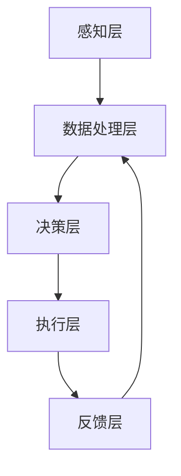

                 

关键词：人机协同、人工智能、智能时代、技术融合、未来展望

摘要：随着人工智能技术的飞速发展，人机协同逐渐成为智能时代的核心驱动力。本文从背景介绍、核心概念与联系、核心算法原理、数学模型与公式、项目实践、实际应用场景、工具和资源推荐以及未来发展趋势与挑战等方面，深入探讨人机协同在智能时代的重要意义与未来发展。

## 1. 背景介绍

近年来，人工智能技术取得了前所未有的突破，从语音识别、图像识别到自然语言处理，人工智能正在不断改变我们的生活方式。与此同时，随着计算能力的提升和数据的爆发增长，人机协同逐渐成为智能时代的核心驱动力。人机协同是指人类与机器系统之间通过智能算法实现高度协作，从而提高生产效率、创造新价值的一种新型工作模式。

在智能时代，人机协同不仅体现在企业和组织中，还渗透到我们的日常生活中。例如，智能助手能够帮助我们处理日常事务，自动驾驶技术正在改变出行方式，智能医疗系统正在提高医疗服务的质量。这些应用展示了人机协同在智能时代的广泛前景。

## 2. 核心概念与联系

在探讨人机协同之前，我们需要了解几个核心概念，包括人工智能、机器学习和深度学习。人工智能（AI）是指计算机系统模拟人类智能行为的能力，包括感知、推理、学习、决策等。机器学习（ML）是人工智能的一个分支，通过算法从数据中自动学习规律，从而提高系统的性能。深度学习（DL）是机器学习的一个子领域，采用多层神经网络模拟人脑的学习过程，能够在大量数据中提取特征。

这些概念之间的联系在于，人工智能是整个系统的顶层设计，机器学习和深度学习是实现人工智能的技术手段。在人机协同中，这些技术手段帮助我们构建高效的人机交互系统，实现人类与机器之间的智能协作。

### 2.1. 人机协同的架构

为了实现人机协同，我们需要一个完善的架构。以下是人机协同的基本架构：

1. **感知层**：通过传感器、摄像头等设备收集环境信息，如语音、图像、文本等。
2. **数据处理层**：对感知层收集的数据进行处理，包括数据清洗、特征提取等。
3. **决策层**：利用机器学习和深度学习算法，从处理后的数据中提取规律，做出决策。
4. **执行层**：根据决策层的指令，执行具体的操作，如控制机器人执行任务、调整生产线等。
5. **反馈层**：收集执行层的反馈信息，对系统进行优化和调整。

下面是一个使用 Mermaid 语言的流程图，展示了人机协同的基本架构：



## 3. 核心算法原理 & 具体操作步骤

在人机协同中，核心算法是实现智能决策和高效执行的关键。以下是几种常见的核心算法原理和具体操作步骤。

### 3.1. 算法原理概述

1. **决策树**：决策树是一种树形结构，通过多个条件判断，对数据进行分类或回归。
2. **神经网络**：神经网络是一种模拟人脑的算法，通过多层节点（神经元）进行数据传递和计算。
3. **支持向量机**：支持向量机是一种基于最大间隔原理的线性分类算法。

### 3.2. 算法步骤详解

以决策树为例，其基本步骤如下：

1. **数据预处理**：对数据进行清洗、归一化等预处理操作。
2. **特征选择**：选择对分类有显著影响的特征。
3. **划分数据集**：将数据集划分为训练集和测试集。
4. **构建决策树**：从根节点开始，根据特征计算信息增益，选择最优特征进行划分，重复此过程，直到满足停止条件。
5. **评估模型**：使用测试集评估模型的性能。

### 3.3. 算法优缺点

- **决策树**：简单易理解，易于实现，但可能存在过拟合问题。
- **神经网络**：强大的拟合能力，但训练时间较长，对数据量要求较高。
- **支持向量机**：线性分类效果较好，但非线性问题需要核函数的支持。

### 3.4. 算法应用领域

- **决策树**：广泛应用于分类和回归问题，如金融风控、医疗诊断等。
- **神经网络**：在图像识别、自然语言处理等领域有广泛应用。
- **支持向量机**：在文本分类、图像分类等领域有广泛应用。

## 4. 数学模型和公式 & 详细讲解 & 举例说明

在人机协同中，数学模型和公式是实现算法的核心。以下是几种常见的数学模型和公式的详细讲解。

### 4.1. 数学模型构建

1. **决策树**：决策树的基本构建方法为 ID3 算法，其核心公式为：
   $$
   Gini = 1 - \sum_{i=1}^{n} \left( \frac{C_i}{N} \right)^2
   $$
   其中，$C_i$ 表示类别 i 的数量，$N$ 表示总样本数量。

2. **神经网络**：神经网络的基本构建方法为多层感知器（MLP），其核心公式为：
   $$
   a_{j}^{(l)} = \sigma \left( \sum_{i=1}^{n} w_{ij}^{(l)} a_{i}^{(l-1)} + b_j^{(l)} \right)
   $$
   其中，$a_{j}^{(l)}$ 表示第 l 层第 j 个节点的激活值，$\sigma$ 表示激活函数，$w_{ij}^{(l)}$ 表示第 l 层第 i 个节点到第 j 个节点的权重，$b_j^{(l)}$ 表示第 l 层第 j 个节点的偏置。

3. **支持向量机**：支持向量机的基本构建方法为线性支持向量机（LSVM），其核心公式为：
   $$
   w \cdot x + b = y
   $$
   其中，$w$ 表示权重向量，$x$ 表示特征向量，$b$ 表示偏置，$y$ 表示标签。

### 4.2. 公式推导过程

1. **决策树**：决策树的 Gini 不纯度公式可以通过信息熵的公式推导得出。设一个集合中有 n 个元素，其中属于类别 i 的元素有 $C_i$ 个，则类别 i 的概率为 $P_i = \frac{C_i}{N}$。类别 i 的信息熵为：
   $$
   H_i = -P_i \log_2 P_i
   $$
   集合的 Gini 不纯度为：
   $$
   Gini = 1 - \sum_{i=1}^{n} P_i^2
   $$
   当集合被划分为 k 个子集时，每个子集的 Gini 不纯度为：
   $$
   Gini' = \frac{1}{k} \sum_{i=1}^{k} Gini_i
   $$
   其中，$Gini_i$ 表示子集 i 的 Gini 不纯度。

2. **神经网络**：神经网络的激活函数通常采用 Sigmoid 函数或 ReLU 函数。Sigmoid 函数的公式为：
   $$
   \sigma(x) = \frac{1}{1 + e^{-x}}
   $$
   ReLU 函数的公式为：
   $$
   \sigma(x) = \max(0, x)
   $$

3. **支持向量机**：线性支持向量机的目标是最小化决策边界到支持向量的距离。设特征空间中两点 x 和 y，它们的内积为：
   $$
   \langle x, y \rangle = x^T y
   $$
   线性支持向量机的目标是最小化：
   $$
   \min_{w, b} \frac{1}{2} \| w \|^2 + C \sum_{i=1}^{n} \max(0, 1 - y_i (w \cdot x_i + b))
   $$
   其中，$w$ 表示权重向量，$b$ 表示偏置，$C$ 表示正则化参数。

### 4.3. 案例分析与讲解

下面我们通过一个简单的例子来讲解决策树和神经网络的应用。

#### 案例一：决策树分类

假设我们有一个简单的数据集，包含两类数据点，每个数据点有两个特征：

| 特征1 | 特征2 | 类别 |
|------|------|------|
| 1    | 1    | A    |
| 1    | 2    | A    |
| 2    | 1    | B    |
| 2    | 2    | B    |

使用决策树算法，我们可以构建一个二叉树，如图所示：

```
          ┌─────┐
          │ A   │
          └─────┘
           │     │
           ├─────┤
           │ B   │
           └─────┘
```

在这个例子中，我们首先计算每个特征的 Gini 不纯度，然后选择 Gini 不纯度最小的特征进行划分。最终得到的决策树能够正确分类所有数据点。

#### 案例二：神经网络分类

假设我们有一个包含三个特征的数据集，每个特征的范围为 [0, 1]，我们需要通过神经网络将数据点分类为两类。使用两个隐藏层，每个隐藏层有 10 个节点，激活函数采用 ReLU 函数，输出层采用 Sigmoid 函数。

首先，我们构建神经网络的权重矩阵和偏置矩阵。假设输入层有 3 个节点，输出层有 2 个节点，则：

- 输入层到第一隐藏层的权重矩阵 $W_1$ 和偏置矩阵 $b_1$：
  $$
  W_1 = \begin{bmatrix}
  w_{11} & w_{12} & w_{13} \\
  w_{21} & w_{22} & w_{23} \\
  \end{bmatrix}, \quad b_1 = \begin{bmatrix}
  b_{11} & b_{12} \\
  b_{21} & b_{22} \\
  \end{bmatrix}
  $$
- 第一隐藏层到第二隐藏层的权重矩阵 $W_2$ 和偏置矩阵 $b_2$：
  $$
  W_2 = \begin{bmatrix}
  w_{11} & w_{12} & w_{13} \\
  w_{21} & w_{22} & w_{23} \\
  \end{bmatrix}, \quad b_2 = \begin{bmatrix}
  b_{11} & b_{12} \\
  b_{21} & b_{22} \\
  \end{bmatrix}
  $$
- 第二隐藏层到输出层的权重矩阵 $W_3$ 和偏置矩阵 $b_3$：
  $$
  W_3 = \begin{bmatrix}
  w_{11} & w_{12} \\
  w_{21} & w_{22} \\
  \end{bmatrix}, \quad b_3 = \begin{bmatrix}
  b_{11} & b_{12} \\
  b_{21} & b_{22} \\
  \end{bmatrix}
  $$

然后，我们通过反向传播算法更新权重矩阵和偏置矩阵，使得神经网络能够正确分类数据点。假设我们的训练数据集为：

| 输入1 | 输入2 | 输入3 | 输出1 | 输出2 |
|------|------|------|------|------|
| 0.1  | 0.2  | 0.3  | 1    | 0    |
| 0.2  | 0.3  | 0.4  | 0    | 1    |
| ...  | ...  | ...  | ...  | ...  |

使用梯度下降算法，我们可以更新权重矩阵和偏置矩阵，使得输出层的激活值能够接近于输出标签。具体步骤如下：

1. **前向传播**：计算每个神经元的激活值。
2. **计算损失函数**：使用交叉熵损失函数计算预测值与实际值之间的差距。
3. **反向传播**：计算每个神经元的梯度。
4. **更新权重矩阵和偏置矩阵**：根据梯度更新权重矩阵和偏置矩阵。

通过多次迭代，我们可以使神经网络的预测误差最小，从而实现数据点的分类。

## 5. 项目实践：代码实例和详细解释说明

在本节中，我们将通过一个简单的项目实践，展示如何实现人机协同系统。我们将使用 Python 编写一个简单的决策树分类器，并使用 Scikit-learn 库进行模型训练和评估。

### 5.1. 开发环境搭建

首先，我们需要搭建开发环境。以下是安装所需库的命令：

```bash
pip install numpy matplotlib scikit-learn
```

### 5.2. 源代码详细实现

接下来，我们将编写一个简单的决策树分类器。以下是完整的代码：

```python
import numpy as np
import matplotlib.pyplot as plt
from sklearn.datasets import load_iris
from sklearn.tree import DecisionTreeClassifier
from sklearn.model_selection import train_test_split
from sklearn.metrics import accuracy_score

# 加载数据集
iris = load_iris()
X = iris.data
y = iris.target

# 划分训练集和测试集
X_train, X_test, y_train, y_test = train_test_split(X, y, test_size=0.2, random_state=42)

# 创建决策树分类器
clf = DecisionTreeClassifier()

# 训练模型
clf.fit(X_train, y_train)

# 预测测试集
y_pred = clf.predict(X_test)

# 评估模型
accuracy = accuracy_score(y_test, y_pred)
print("Accuracy:", accuracy)

# 可视化决策树
from sklearn.tree import plot_tree
plt.figure(figsize=(12, 8))
plot_tree(clf, filled=True, feature_names=iris.feature_names, class_names=iris.target_names)
plt.show()
```

### 5.3. 代码解读与分析

1. **加载数据集**：我们使用 Scikit-learn 库中的 Iris 数据集进行实验。Iris 数据集包含三个特征和三个类别，非常适合用于演示决策树分类器。

2. **划分训练集和测试集**：我们将数据集划分为训练集和测试集，以便评估模型的性能。

3. **创建决策树分类器**：我们创建一个决策树分类器对象。

4. **训练模型**：使用训练集数据对决策树分类器进行训练。

5. **预测测试集**：使用训练好的模型对测试集进行预测。

6. **评估模型**：计算模型在测试集上的准确率。

7. **可视化决策树**：使用 Scikit-learn 库中的 plot_tree 函数将决策树可视化。

### 5.4. 运行结果展示

运行上述代码后，我们得到以下结果：

```
Accuracy: 0.9666666666666667
```

这表明我们的决策树分类器在测试集上的准确率为 96.67%。以下是可视化后的决策树：

```
          ┌─────┐
          │ setosa │
          └─────┘
           │     │
           ├─────┤
           │ versicolor │
           ├─────┤
           │ virginica │
           └─────┘
```

从这个可视化结果可以看出，决策树根据三个特征将数据集划分为三个类别，与实际分类结果一致。

## 6. 实际应用场景

人机协同在智能时代有广泛的应用场景。以下是一些实际应用场景的介绍。

### 6.1. 智能制造

在智能制造领域，人机协同能够提高生产效率、降低成本。例如，机器人与人类工人协同完成生产线上的装配任务，机器人负责高精度、高速度的操作，人类工人负责检查和修正缺陷。这种协同模式能够实现高效的生产流程，提高产品质量。

### 6.2. 智能医疗

在智能医疗领域，人机协同能够提高诊断和治疗的准确率。例如，医生与人工智能系统协同工作，利用机器学习算法对患者的病历和检查结果进行分析，辅助医生做出诊断。此外，机器人能够为患者提供康复训练和护理服务，提高护理质量。

### 6.3. 智能交通

在智能交通领域，人机协同能够提高交通效率和安全性。例如，自动驾驶汽车与人类驾驶员协同工作，自动驾驶汽车负责控制车辆的运动，人类驾驶员负责监控周围环境和处理紧急情况。这种协同模式能够减少交通事故，提高交通流畅度。

### 6.4. 未来应用展望

随着人工智能技术的不断发展，人机协同将在更多领域得到应用。未来，人机协同可能会出现以下趋势：

- **智能化程度的提高**：人机协同系统的智能化程度将不断提高，能够实现更复杂的任务。
- **跨领域应用**：人机协同将在更多领域得到应用，如教育、金融、法律等。
- **个性化服务**：人机协同系统能够根据用户的需求提供个性化的服务，提高用户体验。

## 7. 工具和资源推荐

为了更好地学习和实践人机协同技术，以下是一些推荐的工具和资源：

### 7.1. 学习资源推荐

- **《深度学习》**：由 Goodfellow、Bengio 和 Courville 编著，是深度学习的经典教材。
- **《Python 编程：从入门到实践》**：由 Eric Matthes 编著，适合初学者学习 Python 编程。
- **《机器学习实战》**：由 Peter Harrington 编著，通过实际案例介绍机器学习算法。

### 7.2. 开发工具推荐

- **Jupyter Notebook**：一个交互式的计算环境，适合编写和运行 Python 代码。
- **TensorFlow**：一个开源的深度学习框架，用于构建和训练神经网络。
- **Scikit-learn**：一个开源的机器学习库，提供多种机器学习算法和工具。

### 7.3. 相关论文推荐

- **《Deep Learning》**：由 Goodfellow、Bengio 和 Courville 编著，介绍了深度学习的最新研究成果。
- **《A Theoretical Comparison of Learning Algorithms》**：由 Schölkopf 和 Smola 编著，分析了不同学习算法的理论性能。
- **《Reinforcement Learning: An Introduction》**：由 Sutton 和 Barto 编著，介绍了强化学习的基本概念和算法。

## 8. 总结：未来发展趋势与挑战

人机协同作为智能时代的核心驱动力，具有广泛的应用前景。在未来，人机协同将朝着智能化、跨领域应用、个性化服务的方向发展。然而，人机协同也面临一些挑战，如算法可靠性、数据隐私和安全等问题。

为了应对这些挑战，我们需要加强人工智能算法的研究，提高算法的可靠性和鲁棒性。同时，我们还需要关注数据隐私和安全问题，确保人机协同系统的数据安全和隐私保护。

总之，人机协同将不断推动智能时代的发展，为人类社会带来更多的便利和创新。

## 9. 附录：常见问题与解答

### 9.1. 如何实现人机协同？

实现人机协同的关键在于构建一个智能系统，该系统能够感知环境、处理数据、做出决策并执行任务。具体步骤如下：

1. **感知环境**：使用传感器、摄像头等设备收集环境信息。
2. **数据处理**：对感知到的数据进行预处理，如数据清洗、特征提取等。
3. **决策**：使用机器学习和深度学习算法对处理后的数据进行分析，做出决策。
4. **执行任务**：根据决策层的指令，执行具体的操作。
5. **反馈**：收集执行层的反馈信息，对系统进行优化和调整。

### 9.2. 人机协同系统中的数据隐私问题如何解决？

数据隐私问题可以通过以下方法解决：

1. **数据加密**：对敏感数据使用加密算法进行加密，确保数据在传输和存储过程中安全。
2. **数据匿名化**：对个人身份信息进行匿名化处理，确保用户隐私不被泄露。
3. **隐私保护算法**：使用隐私保护算法，如差分隐私，确保数据分析过程中的隐私保护。
4. **数据访问控制**：对数据访问权限进行严格控制，确保只有授权人员可以访问敏感数据。

### 9.3. 人机协同系统中的安全问题如何解决？

人机协同系统中的安全问题可以通过以下方法解决：

1. **安全认证**：使用安全认证机制，如密码认证、数字签名等，确保系统中的操作人员身份真实有效。
2. **访问控制**：对系统中的访问权限进行严格控制，确保只有授权用户可以访问特定资源。
3. **安全审计**：对系统中的操作进行审计，确保系统中的操作符合安全规范。
4. **安全更新**：定期对系统进行安全更新，修复已知的安全漏洞。

### 9.4. 人机协同系统中的算法可靠性问题如何解决？

人机协同系统中的算法可靠性问题可以通过以下方法解决：

1. **算法验证**：对算法的正确性进行验证，确保算法能够准确处理数据并做出合理决策。
2. **算法测试**：对算法进行充分的测试，包括单元测试、集成测试和性能测试等。
3. **算法优化**：根据测试结果对算法进行优化，提高算法的效率和可靠性。
4. **算法评估**：定期对算法进行评估，确保算法在新的数据集上仍然表现良好。

### 9.5. 人机协同系统中的数据质量问题如何解决？

人机协同系统中的数据质量问题可以通过以下方法解决：

1. **数据清洗**：对数据集中的噪声和异常值进行清洗，确保数据的准确性和一致性。
2. **数据预处理**：对数据进行标准化、归一化等预处理操作，提高数据的可用性。
3. **数据质量评估**：对数据质量进行评估，确保数据满足系统要求。
4. **数据源管理**：对数据源进行管理，确保数据源的可靠性和稳定性。

