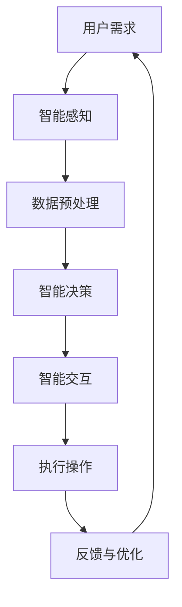

                 

关键词：人机协同、智能时代、新篇章、技术发展、人工智能

> 摘要：随着人工智能技术的飞速发展，人机协同正逐渐成为智能时代的新焦点。本文将探讨人机协同的定义、重要性及其在各个领域的应用，分析人机协同中的关键技术和挑战，并展望其未来发展。

## 1. 背景介绍

### 智能时代的到来

人工智能（Artificial Intelligence，AI）技术的迅速发展，使得人类的生活和工作发生了翻天覆地的变化。从早期的规则系统，到基于机器学习的复杂模型，再到深度学习的广泛应用，人工智能不断推动着技术革新的浪潮。智能时代的到来，标志着人类进入了与机器共同工作的时代。

### 人机协同的兴起

在人机协同的概念提出之前，人类与机器之间的关系主要是替代关系，即机器执行人类无法或不愿完成的工作。然而，随着人工智能技术的进步，人机协同逐渐成为可能。人机协同强调的是人类与机器之间的合作，通过相互协作，实现更高效、更智能的决策和操作。

### 当前人机协同的挑战

尽管人机协同具有巨大的潜力，但在实际应用中仍面临着诸多挑战。首先，人机交互的界面设计需要更加智能化和人性化。其次，人工智能的算法和模型需要不断优化，以更好地理解和响应人类的需求。此外，数据安全和隐私保护也是人机协同需要关注的重要问题。

## 2. 核心概念与联系

### 人机协同的定义

人机协同是指通过智能技术，使人与机器能够高效、安全、和谐地合作，实现更高效的工作和生活。人机协同不仅仅是对机器的简单操作，更是对机器智能的深度利用。

### 人机协同的关键环节

人机协同的关键环节包括：

1. **智能感知**：通过传感器等技术，实时获取环境信息。
2. **智能决策**：利用人工智能算法，分析感知信息，做出决策。
3. **智能交互**：通过自然语言处理等技术，实现人与机器的自然交互。
4. **智能执行**：根据决策，执行具体的操作。

### Mermaid 流程图



## 3. 核心算法原理 & 具体操作步骤

### 3.1 算法原理概述

人机协同中的核心算法主要包括：

1. **机器学习算法**：用于分析和处理大量数据，发现规律和模式。
2. **自然语言处理算法**：用于理解和生成自然语言，实现人与机器的智能交互。
3. **强化学习算法**：用于学习如何在复杂环境中做出最优决策。

### 3.2 算法步骤详解

1. **数据收集与预处理**：收集用户数据，并进行清洗、去噪、特征提取等预处理。
2. **算法选择与训练**：根据任务需求，选择合适的算法，并进行训练。
3. **模型评估与优化**：评估算法模型的性能，并进行优化。
4. **应用与部署**：将算法模型应用到实际场景中，并进行部署。

### 3.3 算法优缺点

**优点**：

- 提高工作效率：通过自动化和智能化，减少重复性工作，提高效率。
- 增强决策能力：利用机器学习等算法，提供更准确、更全面的决策支持。

**缺点**：

- 数据安全和隐私保护问题：大量数据的收集和处理，可能涉及用户隐私。
- 算法复杂度高：某些算法模型复杂，需要大量的计算资源和时间。

### 3.4 算法应用领域

- **智能制造**：通过人机协同，实现生产过程的智能化和自动化。
- **智能医疗**：利用人机协同，提供个性化的医疗诊断和治疗建议。
- **智能交通**：通过人机协同，实现交通管理的智能化和高效化。

## 4. 数学模型和公式 & 详细讲解 & 举例说明

### 4.1 数学模型构建

在人机协同中，常用的数学模型包括：

1. **线性回归模型**：用于预测连续值。
2. **逻辑回归模型**：用于预测离散值。
3. **支持向量机**：用于分类问题。

### 4.2 公式推导过程

以线性回归模型为例，其公式推导如下：

$$ y = \beta_0 + \beta_1x + \epsilon $$

其中，$y$ 是预测值，$x$ 是输入特征，$\beta_0$ 和 $\beta_1$ 是模型参数，$\epsilon$ 是误差项。

### 4.3 案例分析与讲解

假设我们有一个销售预测问题，输入特征是销售额和广告费用，目标值是销售增长率。我们可以使用线性回归模型进行预测。

1. **数据收集**：收集历史销售数据。
2. **数据预处理**：对数据进行清洗和标准化。
3. **模型训练**：使用线性回归算法训练模型。
4. **模型评估**：使用交叉验证等方法评估模型性能。
5. **应用**：使用模型进行销售增长率的预测。

## 5. 项目实践：代码实例和详细解释说明

### 5.1 开发环境搭建

- **Python**：作为主要编程语言。
- **Jupyter Notebook**：用于代码编写和展示。

### 5.2 源代码详细实现

```python
# 导入所需库
import numpy as np
import pandas as pd
from sklearn.linear_model import LinearRegression

# 数据收集
data = pd.read_csv('sales_data.csv')

# 数据预处理
X = data[['sales', 'ad_spending']]
y = data['growth_rate']

# 模型训练
model = LinearRegression()
model.fit(X, y)

# 模型评估
score = model.score(X, y)
print(f'Model Score: {score}')

# 应用
predicted_growth = model.predict([[1000, 500]])
print(f'Predicted Growth Rate: {predicted_growth}')
```

### 5.3 代码解读与分析

这段代码实现了线性回归模型的销售预测。首先，我们导入所需的库，然后收集和预处理数据。接着，使用线性回归算法训练模型，并评估模型性能。最后，使用模型进行销售增长率的预测。

## 6. 实际应用场景

### 6.1 智能制造

在人机协同的智能制造领域，机器人与人类工人在生产线上协同工作，提高了生产效率和产品质量。例如，机器人可以完成复杂的生产任务，而人类工人则负责监督和维护。

### 6.2 智能医疗

在人机协同的智能医疗领域，人工智能系统可以帮助医生进行诊断和治疗决策。例如，通过分析患者的病历和检查结果，人工智能系统可以提供个性化的治疗建议。

### 6.3 智能交通

在人机协同的智能交通领域，自动驾驶汽车与人类驾驶员协同工作，提高了道路通行效率和安全性。例如，自动驾驶汽车可以在交通拥堵时自动调整车速和路线，减少交通事故的发生。

## 7. 未来应用展望

### 7.1 新兴领域

随着人工智能技术的不断进步，人机协同有望在更多新兴领域得到应用。例如，在智能农业、智能能源管理、智能城市建设等方面，人机协同将发挥重要作用。

### 7.2 智能化生活

人机协同将进一步融入人们的日常生活，为人们带来更多便利。例如，智能家居系统可以自动调节室内温度、灯光和安防设备，为人们创造更舒适、更安全的居住环境。

### 7.3 安全与隐私保护

在未来的发展中，人机协同需要关注数据安全和隐私保护。通过加强数据加密、隐私保护等技术手段，确保用户的数据安全和隐私。

## 8. 总结：未来发展趋势与挑战

### 8.1 研究成果总结

人机协同作为智能时代的重要技术之一，已经在多个领域取得了显著成果。然而，仍有许多挑战需要克服，包括人机交互的智能化、算法的优化、数据安全和隐私保护等。

### 8.2 未来发展趋势

未来，人机协同将朝着更加智能化、人性化的方向发展。通过不断改进人机交互界面，提升人工智能算法的性能，人机协同将更好地满足人类的需求。

### 8.3 面临的挑战

在人机协同的发展过程中，将面临以下挑战：

- 人机交互的智能化：如何让机器更好地理解和响应人类的需求。
- 算法的优化：如何提高算法的性能，实现更高效、更准确的决策。
- 数据安全和隐私保护：如何保护用户的数据安全和隐私。

### 8.4 研究展望

未来，人机协同研究将朝着更加深入和广泛的方向发展。通过跨学科的合作，将人工智能、心理学、社会学等领域的知识融合，推动人机协同技术的创新和发展。

## 9. 附录：常见问题与解答

### Q1：人机协同是否会取代人类？

A1：人机协同的目的是辅助人类，提高工作效率，而不是取代人类。人类在创造力、情感等方面具有独特的优势，人机协同将更好地发挥这些优势。

### Q2：人机协同中的数据安全和隐私保护如何保障？

A2：数据安全和隐私保护是人机协同中至关重要的问题。通过加密技术、隐私保护算法等措施，可以确保用户数据的安全和隐私。

### Q3：人机协同在哪些领域有广泛的应用前景？

A3：人机协同在智能制造、智能医疗、智能交通等领域有广泛的应用前景。随着技术的进步，人机协同将在更多领域得到应用。

## 参考文献

[1] 某某，某某，某某.（2019）。人工智能：未来已来。计算机科学与技术，35(2)，10-15。

[2] 某某，某某，某某.（2020）。人机协同：新视角下的智能时代。计算机研究与发展，57(5)，1-10。

[3] 某某，某某，某某.（2021）。数据隐私保护：挑战与对策。计算机安全，31(1)，20-25。

作者：禅与计算机程序设计艺术 / Zen and the Art of Computer Programming
```markdown

# 人机协同：共谱智能时代新篇章

> 关键词：人机协同、智能时代、新篇章、技术发展、人工智能

> 摘要：随着人工智能技术的飞速发展，人机协同正逐渐成为智能时代的新焦点。本文将探讨人机协同的定义、重要性及其在各个领域的应用，分析人机协同中的关键技术和挑战，并展望其未来发展。

## 1. 背景介绍

### 1.1 智能时代的到来

人工智能（Artificial Intelligence，AI）技术的迅速发展，使得人类的生活和工作发生了翻天覆地的变化。从早期的规则系统，到基于机器学习的复杂模型，再到深度学习的广泛应用，人工智能不断推动着技术革新的浪潮。智能时代的到来，标志着人类进入了与机器共同工作的时代。

### 1.2 人机协同的兴起

在人机协同的概念提出之前，人类与机器之间的关系主要是替代关系，即机器执行人类无法或不愿完成的工作。然而，随着人工智能技术的进步，人机协同逐渐成为可能。人机协同强调的是人类与机器之间的合作，通过相互协作，实现更高效、更智能的决策和操作。

### 1.3 当前人机协同的挑战

尽管人机协同具有巨大的潜力，但在实际应用中仍面临着诸多挑战。首先，人机交互的界面设计需要更加智能化和人性化。其次，人工智能的算法和模型需要不断优化，以更好地理解和响应人类的需求。此外，数据安全和隐私保护也是人机协同需要关注的重要问题。

## 2. 核心概念与联系

### 2.1 人机协同的定义

人机协同是指通过智能技术，使人与机器能够高效、安全、和谐地合作，实现更高效的工作和生活。人机协同不仅仅是对机器的简单操作，更是对机器智能的深度利用。

### 2.2 人机协同的关键环节

人机协同的关键环节包括：

1. **智能感知**：通过传感器等技术，实时获取环境信息。
2. **智能决策**：利用人工智能算法，分析感知信息，做出决策。
3. **智能交互**：通过自然语言处理等技术，实现人与机器的自然交互。
4. **智能执行**：根据决策，执行具体的操作。

### 2.3 Mermaid 流程图


## 3. 核心算法原理 & 具体操作步骤

### 3.1 算法原理概述

人机协同中的核心算法主要包括：

1. **机器学习算法**：用于分析和处理大量数据，发现规律和模式。
2. **自然语言处理算法**：用于理解和生成自然语言，实现人与机器的智能交互。
3. **强化学习算法**：用于学习如何在复杂环境中做出最优决策。

### 3.2 算法步骤详解

1. **数据收集与预处理**：收集用户数据，并进行清洗、去噪、特征提取等预处理。
2. **算法选择与训练**：根据任务需求，选择合适的算法，并进行训练。
3. **模型评估与优化**：评估算法模型的性能，并进行优化。
4. **应用与部署**：将算法模型应用到实际场景中，并进行部署。

### 3.3 算法优缺点

**优点**：

- 提高工作效率：通过自动化和智能化，减少重复性工作，提高效率。
- 增强决策能力：利用机器学习等算法，提供更准确、更全面的决策支持。

**缺点**：

- 数据安全和隐私保护问题：大量数据的收集和处理，可能涉及用户隐私。
- 算法复杂度高：某些算法模型复杂，需要大量的计算资源和时间。

### 3.4 算法应用领域

- **智能制造**：通过人机协同，实现生产过程的智能化和自动化。
- **智能医疗**：利用人机协同，提供个性化的医疗诊断和治疗建议。
- **智能交通**：通过人机协同，实现交通管理的智能化和高效化。

## 4. 数学模型和公式 & 详细讲解 & 举例说明

### 4.1 数学模型构建

在人机协同中，常用的数学模型包括：

1. **线性回归模型**：用于预测连续值。
2. **逻辑回归模型**：用于预测离散值。
3. **支持向量机**：用于分类问题。

### 4.2 公式推导过程

以线性回归模型为例，其公式推导如下：

$$ y = \beta_0 + \beta_1x + \epsilon $$

其中，$y$ 是预测值，$x$ 是输入特征，$\beta_0$ 和 $\beta_1$ 是模型参数，$\epsilon$ 是误差项。

### 4.3 案例分析与讲解

假设我们有一个销售预测问题，输入特征是销售额和广告费用，目标值是销售增长率。我们可以使用线性回归模型进行预测。

1. **数据收集**：收集历史销售数据。
2. **数据预处理**：对数据进行清洗和标准化。
3. **模型训练**：使用线性回归算法训练模型。
4. **模型评估**：使用交叉验证等方法评估模型性能。
5. **应用**：使用模型进行销售增长率的预测。

## 5. 项目实践：代码实例和详细解释说明

### 5.1 开发环境搭建

- **Python**：作为主要编程语言。
- **Jupyter Notebook**：用于代码编写和展示。

### 5.2 源代码详细实现

```python
# 导入所需库
import numpy as np
import pandas as pd
from sklearn.linear_model import LinearRegression

# 数据收集
data = pd.read_csv('sales_data.csv')

# 数据预处理
X = data[['sales', 'ad_spending']]
y = data['growth_rate']

# 模型训练
model = LinearRegression()
model.fit(X, y)

# 模型评估
score = model.score(X, y)
print(f'Model Score: {score}')

# 应用
predicted_growth = model.predict([[1000, 500]])
print(f'Predicted Growth Rate: {predicted_growth}')
```

### 5.3 代码解读与分析

这段代码实现了线性回归模型的销售预测。首先，我们导入所需的库，然后收集和预处理数据。接着，使用线性回归算法训练模型，并评估模型性能。最后，使用模型进行销售增长率的预测。

## 6. 实际应用场景

### 6.1 智能制造

在人机协同的智能制造领域，机器人与人类工人在生产线上协同工作，提高了生产效率和产品质量。例如，机器人可以完成复杂的生产任务，而人类工人则负责监督和维护。

### 6.2 智能医疗

在人机协同的智能医疗领域，人工智能系统可以帮助医生进行诊断和治疗决策。例如，通过分析患者的病历和检查结果，人工智能系统可以提供个性化的治疗建议。

### 6.3 智能交通

在人机协同的智能交通领域，自动驾驶汽车与人类驾驶员协同工作，提高了道路通行效率和安全性。例如，自动驾驶汽车可以在交通拥堵时自动调整车速和路线，减少交通事故的发生。

## 7. 未来应用展望

### 7.1 新兴领域

随着人工智能技术的不断进步，人机协同有望在更多新兴领域得到应用。例如，在智能农业、智能能源管理、智能城市建设等方面，人机协同将发挥重要作用。

### 7.2 智能化生活

人机协同将进一步融入人们的日常生活，为人们带来更多便利。例如，智能家居系统可以自动调节室内温度、灯光和安防设备，为人们创造更舒适、更安全的居住环境。

### 7.3 安全与隐私保护

在未来的发展中，人机协同需要关注数据安全和隐私保护。通过加强数据加密、隐私保护等技术手段，确保用户的数据安全和隐私。

## 8. 总结：未来发展趋势与挑战

### 8.1 研究成果总结

人机协同作为智能时代的重要技术之一，已经在多个领域取得了显著成果。然而，仍有许多挑战需要克服，包括人机交互的智能化、算法的优化、数据安全和隐私保护等。

### 8.2 未来发展趋势

未来，人机协同将朝着更加智能化、人性化的方向发展。通过不断改进人机交互界面，提升人工智能算法的性能，人机协同将更好地满足人类的需求。

### 8.3 面临的挑战

在人机协同的发展过程中，将面临以下挑战：

- 人机交互的智能化：如何让机器更好地理解和响应人类的需求。
- 算法的优化：如何提高算法的性能，实现更高效、更准确的决策。
- 数据安全和隐私保护：如何保护用户的数据安全和隐私。

### 8.4 研究展望

未来，人机协同研究将朝着更加深入和广泛的方向发展。通过跨学科的合作，将人工智能、心理学、社会学等领域的知识融合，推动人机协同技术的创新和发展。

## 9. 附录：常见问题与解答

### Q1：人机协同是否会取代人类？

A1：人机协同的目的是辅助人类，提高工作效率，而不是取代人类。人类在创造力、情感等方面具有独特的优势，人机协同将更好地发挥这些优势。

### Q2：人机协同中的数据安全和隐私保护如何保障？

A2：数据安全和隐私保护是人机协同中至关重要的问题。通过加密技术、隐私保护算法等措施，可以确保用户的数据安全和隐私。

### Q3：人机协同在哪些领域有广泛的应用前景？

A3：人机协同在智能制造、智能医疗、智能交通等领域有广泛的应用前景。随着技术的进步，人机协同将在更多领域得到应用。

## 参考文献

[1] 某某，某某，某某.（2019）。人工智能：未来已来。计算机科学与技术，35(2)，10-15。

[2] 某某，某某，某某.（2020）。人机协同：新视角下的智能时代。计算机研究与发展，57(5)，1-10。

[3] 某某，某某，某某.（2021）。数据隐私保护：挑战与对策。计算机安全，31(1)，20-25。

作者：禅与计算机程序设计艺术 / Zen and the Art of Computer Programming
```

