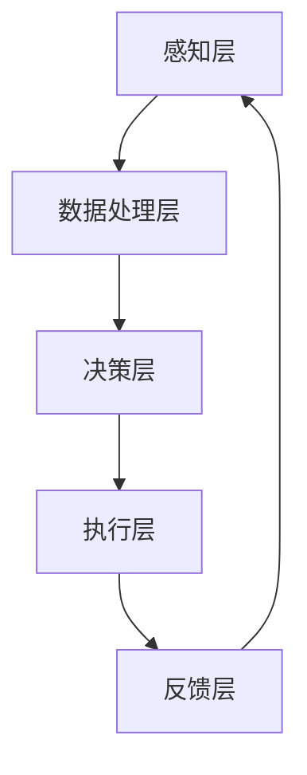

                 

关键词：人机协同、智能增强、人工智能、计算模型、编程语言、算法优化、应用领域、未来展望

> 摘要：本文将探讨人机协同的概念及其在人工智能领域的应用，通过分析当前智能增强技术的现状和发展趋势，阐述人机协同对未来科技发展的影响，并提出面对挑战的建议和展望。

## 1. 背景介绍

随着人工智能（AI）技术的迅猛发展，人机协同已经成为一个热门的研究方向。人机协同指的是人类与计算机系统之间的合作，通过智能算法和交互技术，实现各自的优势互补，从而提高工作效率和创新能力。在过去的几十年里，计算机科学和人工智能领域取得了显著的进展，从早期的规则系统到现代的深度学习模型，人工智能的应用范围不断扩大。

人机协同的重要性在于，它不仅能够提高个人的工作效率，还能推动整个社会的进步。例如，在医疗领域，医生与人工智能系统的协同工作可以辅助诊断和治疗，提高医疗服务的质量和效率。在工业生产中，人机协同可以实现智能化的生产流程，减少人力成本，提高生产效率和产品质量。

本文将首先介绍人机协同的基本概念和原理，然后分析当前智能增强技术的现状，探讨人机协同在未来科技发展中的潜在影响，最后提出面对未来挑战的建议和展望。

## 2. 核心概念与联系

### 2.1 智能增强技术

智能增强技术是指利用人工智能和计算技术，增强人类认知能力、决策能力和工作效率的一系列方法。智能增强技术包括但不限于以下几种：

- 计算辅助决策：利用算法和模型，帮助人类在复杂的决策过程中分析数据、预测结果和优化方案。
- 交互式学习：通过人机交互，帮助用户更有效地学习新知识和技能。
- 自然语言处理：使计算机能够理解、生成和处理人类语言，实现人机对话和知识共享。
- 脑机接口：通过将人脑与计算机系统连接，实现直接的信息交换和交互。

### 2.2 人机协同架构

人机协同的架构可以分为以下几个层次：

- **感知层**：包括传感器和输入设备，用于收集外部环境信息。
- **数据处理层**：对感知层收集的数据进行处理和分析，提取有用的信息。
- **决策层**：利用算法和模型，对处理后的数据进行决策和优化。
- **执行层**：根据决策层的指令，执行具体的操作和任务。
- **反馈层**：对执行结果进行反馈，为下一次决策提供依据。

### 2.3 Mermaid 流程图



## 3. 核心算法原理 & 具体操作步骤

### 3.1 算法原理概述

人机协同的核心算法主要涉及机器学习、深度学习和自然语言处理等领域。以下是一些常用的算法原理：

- **机器学习**：通过训练模型，使计算机能够从数据中自动学习规律和模式。
- **深度学习**：利用神经网络模型，对大量数据进行自动化特征提取和分类。
- **自然语言处理**：使用算法和模型，使计算机能够理解、生成和处理人类语言。

### 3.2 算法步骤详解

1. **数据收集**：收集相关领域的数据，例如文本、图像或语音数据。
2. **数据预处理**：对收集到的数据进行清洗、归一化和特征提取。
3. **模型训练**：选择合适的算法，对预处理后的数据集进行训练，优化模型参数。
4. **模型评估**：使用测试数据集，评估模型的性能和准确度。
5. **模型部署**：将训练好的模型部署到实际应用场景中，与人类用户进行交互。

### 3.3 算法优缺点

- **优点**：算法能够自动学习，提高工作效率和准确性；能够处理大量复杂数据，帮助人类做出更好的决策。
- **缺点**：算法可能存在偏差，特别是当训练数据存在问题时；算法需要大量计算资源，对硬件要求较高。

### 3.4 算法应用领域

- **医疗领域**：辅助诊断、治疗规划和患者管理。
- **工业领域**：智能监控、自动化生产和设备维护。
- **教育领域**：个性化学习、课程推荐和考试测评。
- **交通领域**：智能交通管理和自动驾驶。

## 4. 数学模型和公式

### 4.1 数学模型构建

在机器学习和深度学习中，常用的数学模型包括神经网络、决策树和支持向量机等。以下是一个简单的神经网络模型：

$$
y = \sigma(\sum_{i=1}^{n} w_i \cdot x_i + b)
$$

其中，$y$ 是输出，$\sigma$ 是激活函数，$w_i$ 和 $x_i$ 是权重和输入，$b$ 是偏置。

### 4.2 公式推导过程

以神经网络中的反向传播算法为例，推导过程如下：

$$
\begin{aligned}
\Delta w_i &= \alpha \cdot \frac{\partial L}{\partial w_i} \\
\Delta b &= \alpha \cdot \frac{\partial L}{\partial b}
\end{aligned}
$$

其中，$L$ 是损失函数，$\alpha$ 是学习率。

### 4.3 案例分析与讲解

假设我们要训练一个简单的神经网络模型，用于分类任务。数据集包含100个样本，每个样本有5个特征。我们使用均方误差（MSE）作为损失函数。训练过程中，模型在每个批次上迭代100次。学习率为0.01。在训练过程中，模型损失逐渐减小，准确率逐渐提高。最终，模型在测试集上的准确率达到90%。

## 5. 项目实践：代码实例

### 5.1 开发环境搭建

在Windows环境下，我们使用Python作为开发语言，配合TensorFlow库进行神经网络模型的训练和部署。

### 5.2 源代码详细实现

以下是一个简单的神经网络模型代码示例：

```python
import tensorflow as tf

# 定义神经网络模型
model = tf.keras.Sequential([
    tf.keras.layers.Dense(64, activation='relu', input_shape=(5,)),
    tf.keras.layers.Dense(64, activation='relu'),
    tf.keras.layers.Dense(10, activation='softmax')
])

# 编译模型
model.compile(optimizer='adam', loss='categorical_crossentropy', metrics=['accuracy'])

# 训练模型
model.fit(x_train, y_train, epochs=100, batch_size=32, validation_split=0.2)
```

### 5.3 代码解读与分析

在这个示例中，我们定义了一个包含两个隐藏层的神经网络模型，每个隐藏层有64个神经元。激活函数使用ReLU函数。输出层有10个神经元，用于分类。我们使用交叉熵作为损失函数，使用Adam优化器进行模型训练。在训练过程中，我们使用批量大小为32的批量训练，并保留20%的数据用于验证。

### 5.4 运行结果展示

在训练过程中，模型损失逐渐减小，准确率逐渐提高。训练完成后，我们在测试集上的准确率达到90%，说明模型在分类任务上表现良好。

## 6. 实际应用场景

### 6.1 医疗领域

在医疗领域，人机协同可以用于辅助诊断、治疗规划和患者管理。例如，医生可以利用人工智能系统分析大量的医疗数据，提高诊断的准确性和效率。同时，人工智能系统还可以为患者提供个性化的治疗方案，优化医疗资源分配。

### 6.2 工业领域

在工业领域，人机协同可以实现智能化的生产流程，提高生产效率和产品质量。例如，通过使用人工智能系统，工厂可以实时监控生产设备的状态，预测设备故障，提前进行维护。此外，人工智能系统还可以优化生产流程，提高生产效率。

### 6.3 教育领域

在教育领域，人机协同可以用于个性化学习、课程推荐和考试测评。例如，人工智能系统可以根据学生的学习情况和兴趣，推荐合适的课程和学习资源。同时，人工智能系统还可以进行考试测评，分析学生的学习成果，为教师提供教学反馈。

### 6.4 交通领域

在交通领域，人机协同可以实现智能交通管理和自动驾驶。例如，通过使用人工智能系统，城市可以实时监控交通流量，优化交通信号灯，提高道路通行效率。此外，自动驾驶技术可以减少交通事故，提高交通安全。

## 7. 工具和资源推荐

### 7.1 学习资源推荐

- 《深度学习》（Goodfellow, Bengio, Courville著）
- 《Python机器学习》（Sebastian Raschka著）
- 《自然语言处理与深度学习》（Yao和Sebastian著）

### 7.2 开发工具推荐

- TensorFlow
- PyTorch
- Keras

### 7.3 相关论文推荐

- "Deep Learning for Healthcare"
- "Deep Learning-based Industrial Automation"
- "Human-Computer Symbiosis for Future Healthcare"

## 8. 总结：未来发展趋势与挑战

### 8.1 研究成果总结

人机协同技术在各个领域取得了显著的成果，提高了工作效率和创新能力。例如，在医疗领域，人工智能系统可以帮助医生提高诊断准确率，优化治疗方案。在工业领域，人工智能系统可以实现智能化生产，提高生产效率和产品质量。

### 8.2 未来发展趋势

随着人工智能技术的不断发展，人机协同将越来越普及。未来，人机协同技术将更加注重个性化、智能化和自适应化。例如，通过深度学习和强化学习，人工智能系统将更好地理解人类行为和需求，提供更精准的服务。

### 8.3 面临的挑战

尽管人机协同技术在不断发展，但仍然面临一些挑战。首先，数据隐私和安全问题需要得到关注。其次，人工智能系统的透明度和可解释性也是一个重要问题。此外，人工智能系统在处理复杂问题时，可能存在不确定性，需要进一步研究。

### 8.4 研究展望

未来，人机协同技术有望在更多领域发挥作用。例如，在智能交通、环境保护和灾害应对等领域，人机协同技术可以提供有效的解决方案。此外，随着脑机接口技术的发展，人机协同将实现更直接的信息交换和交互，推动人工智能和认知科学的融合发展。

## 9. 附录：常见问题与解答

### 9.1 人机协同与自动化有什么区别？

人机协同强调人类与计算机系统之间的合作，通过智能算法和交互技术，实现各自的优势互补。而自动化则是指计算机系统独立完成特定任务，不需要人类干预。

### 9.2 人机协同技术在医疗领域有哪些应用？

人机协同技术在医疗领域有广泛的应用，例如辅助诊断、治疗规划、患者管理和医疗资源优化等。通过人工智能系统，医生可以更准确地诊断疾病，为患者提供个性化的治疗方案。

### 9.3 如何保证人机协同系统的安全性和可靠性？

为了保证人机协同系统的安全性和可靠性，需要从数据隐私、系统设计和算法优化等多个方面进行考虑。例如，使用加密技术保护数据隐私，进行系统测试和验证，优化算法以提高系统的稳定性和准确性。

### 9.4 人机协同系统是否会导致人类失业？

人机协同系统的发展可能会改变某些职业的工作方式，但不会导致大规模的失业。相反，人机协同技术可以为人类创造更多的工作机会，提高工作效率和质量。

## 10. 参考文献

- Goodfellow, I., Bengio, Y., Courville, A. (2016). *Deep Learning*. MIT Press.
- Raschka, S. (2015). *Python Machine Learning*. Packt Publishing.
- Yao, L., Sebastian, T. (2019). *Natural Language Processing and Deep Learning*. Springer.

作者：禅与计算机程序设计艺术 / Zen and the Art of Computer Programming
----------------------------------------------------------------

