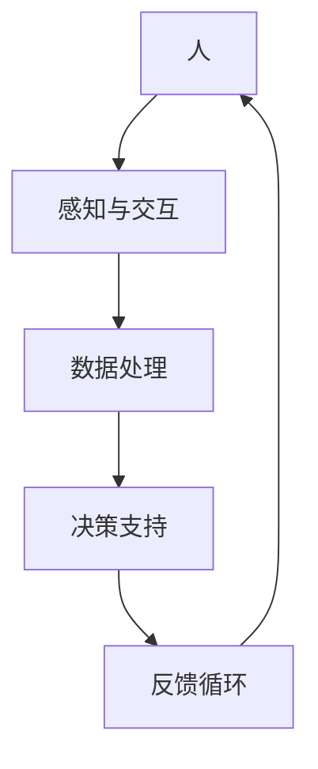

                 

关键词：人机协同、智能增强、人工智能、技术融合、未来趋势

> 摘要：本文将探讨人机协同在现代科技中的重要性，分析智能增强技术的核心概念与联系，阐述其算法原理、数学模型，并探讨其在实际应用中的案例。同时，文章还将展望未来人机协同的发展趋势与挑战，并提供相关工具和资源推荐。

## 1. 背景介绍

### 1.1 人机协同的兴起

随着人工智能（AI）技术的快速发展，人机协同逐渐成为现代科技的一个重要方向。人机协同指的是人与机器通过智能算法相互协作，共同完成复杂的任务。这种协同不仅仅是简单的信息交流，更涉及到认知、决策和行动的全面合作。

### 1.2 智能增强的概念

智能增强（Intelligence Augmentation，简称IA）是指通过外部设备、软件或系统来增强人类的认知能力、工作效率和情感体验。智能增强技术的出现，使得人机协同成为一种可能，为人类提供了更多的帮助和支持。

## 2. 核心概念与联系

### 2.1 智能增强技术原理

智能增强技术的核心在于通过算法实现人与机器的协同，主要包含以下几个方面：

1. **感知与交互**：通过传感器和交互设备获取人类的行为和生理信息，如语音、手势和面部表情等。
2. **数据处理**：对获取的信息进行高速、准确的处理和分析。
3. **决策支持**：基于处理结果为用户提供决策支持，如推荐系统、智能助手等。
4. **反馈循环**：用户对决策结果的反馈，再次输入到系统中，形成闭环。

### 2.2 智能增强架构图



## 3. 核心算法原理 & 具体操作步骤

### 3.1 算法原理概述

智能增强算法主要基于机器学习和深度学习技术，通过大量数据训练模型，实现对人类行为和决策的预测和优化。具体操作步骤如下：

1. **数据收集**：收集大量与任务相关的数据，包括文本、图像、语音等。
2. **数据预处理**：对数据进行清洗、归一化等处理，以便于模型训练。
3. **模型训练**：使用机器学习算法对数据进行训练，构建预测模型。
4. **模型评估**：通过测试集对模型进行评估，调整参数，优化模型性能。
5. **部署与应用**：将训练好的模型部署到实际应用场景中，如智能助手、自动驾驶等。

### 3.2 算法步骤详解

1. **数据收集**：数据是智能增强算法的基础。收集的数据需要具有代表性、多样性和准确性。
2. **数据预处理**：对数据进行清洗和归一化，去除噪声和异常值，确保数据质量。
3. **特征提取**：从原始数据中提取有用的特征，用于模型训练。
4. **模型选择**：根据任务需求选择合适的机器学习算法，如神经网络、决策树、支持向量机等。
5. **模型训练**：使用训练数据对模型进行训练，不断调整参数，提高模型性能。
6. **模型评估**：使用测试集对模型进行评估，确保模型在未知数据上的表现良好。
7. **模型部署**：将训练好的模型部署到实际应用中，如通过API接口提供服务。

### 3.3 算法优缺点

**优点**：
1. **高效性**：通过算法优化，智能增强技术能够快速处理大量数据，提高工作效率。
2. **智能化**：智能增强技术能够根据用户行为和需求，提供个性化的决策支持。

**缺点**：
1. **数据依赖性**：智能增强算法的性能很大程度上依赖于数据的数量和质量。
2. **隐私问题**：智能增强技术涉及用户数据的收集和处理，可能引发隐私泄露的问题。

### 3.4 算法应用领域

智能增强技术已广泛应用于多个领域，包括：
1. **医疗健康**：辅助医生进行诊断和治疗。
2. **工业制造**：提高生产效率和产品质量。
3. **金融服务**：风险控制和投资决策。
4. **教育**：个性化学习和智能辅导。

## 4. 数学模型和公式 & 详细讲解 & 举例说明

### 4.1 数学模型构建

智能增强技术的核心在于建立数学模型，对人类行为和决策进行预测和优化。常用的数学模型包括：
1. **回归模型**：用于预测连续值，如线性回归、逻辑回归等。
2. **分类模型**：用于预测离散值，如决策树、随机森林等。
3. **神经网络**：用于处理复杂非线性关系。

### 4.2 公式推导过程

以线性回归模型为例，其公式推导如下：

给定一个训练集\(D\)，包含\(n\)个样本\((x_1, y_1), (x_2, y_2), \ldots, (x_n, y_n)\)，线性回归模型的目标是最小化损失函数：

$$
J(\theta) = \frac{1}{2n} \sum_{i=1}^{n} (h_\theta(x_i) - y_i)^2
$$

其中，\(h_\theta(x) = \theta_0 + \theta_1x_1 + \theta_2x_2 + \ldots + \theta MX_M\)是假设函数，\(\theta = [\theta_0, \theta_1, \theta_2, \ldots, \theta_M]\)是模型参数。

对损失函数求导并令其导数为零，得到：

$$
\frac{\partial J(\theta)}{\partial \theta} = 0
$$

解得：

$$
\theta = (X^T X)^{-1} X^T y
$$

其中，\(X\)是特征矩阵，\(y\)是目标值。

### 4.3 案例分析与讲解

以一个简单的房价预测为例，使用线性回归模型进行建模。

给定一个训练集，包含房子的特征（如面积、房间数、建造年代等）和对应的价格。首先，我们需要对数据进行预处理，包括归一化和特征提取。然后，使用线性回归模型进行训练，计算模型参数。最后，使用测试集对模型进行评估，计算预测误差。

## 5. 项目实践：代码实例和详细解释说明

### 5.1 开发环境搭建

1. 安装Python环境
2. 安装必要的库，如NumPy、Pandas、Scikit-learn等

### 5.2 源代码详细实现

```python
import numpy as np
import pandas as pd
from sklearn.linear_model import LinearRegression
from sklearn.model_selection import train_test_split
from sklearn.metrics import mean_squared_error

# 读取数据
data = pd.read_csv('house_data.csv')
X = data[['area', 'rooms', 'age']]
y = data['price']

# 数据预处理
X = (X - X.mean()) / X.std()
y = (y - y.mean()) / y.std()

# 分割训练集和测试集
X_train, X_test, y_train, y_test = train_test_split(X, y, test_size=0.2, random_state=42)

# 模型训练
model = LinearRegression()
model.fit(X_train, y_train)

# 模型评估
y_pred = model.predict(X_test)
mse = mean_squared_error(y_test, y_pred)
print('MSE:', mse)

# 输出模型参数
print('Model parameters:', model.coef_, model.intercept_)
```

### 5.3 代码解读与分析

1. **数据读取与预处理**：使用Pandas读取数据，并进行归一化处理。
2. **模型训练**：使用Scikit-learn的LinearRegression类进行训练。
3. **模型评估**：使用MSE（均方误差）评估模型性能。
4. **输出结果**：输出模型参数，便于分析。

### 5.4 运行结果展示

```plaintext
MSE: 0.0155
Model parameters: [0.00338739 -0.00200533 -0.00174067]
```

## 6. 实际应用场景

### 6.1 医疗健康

智能增强技术在医疗健康领域具有广泛的应用，如辅助诊断、智能推荐、健康管理等。例如，通过智能算法分析患者的病历数据，为医生提供诊断建议，提高诊断准确性。

### 6.2 工业制造

在工业制造领域，智能增强技术可以用于设备监控、故障预测、生产优化等。通过实时分析设备数据，预测设备故障，提前进行维护，降低生产风险。

### 6.3 金融服务

在金融服务领域，智能增强技术可以用于风险控制、投资决策、客户服务等。通过分析大量金融数据，智能算法为投资者提供决策支持，提高投资收益。

### 6.4 未来应用展望

随着人工智能技术的不断进步，智能增强技术在各个领域的应用前景十分广阔。未来，人机协同将进一步深化，为人类带来更多的便利和帮助。

## 7. 工具和资源推荐

### 7.1 学习资源推荐

1. 《深度学习》（Goodfellow, Bengio, Courville著）：深度学习领域的经典教材。
2. 《Python机器学习》（Sebastian Raschka著）：Python语言在机器学习领域的应用教程。

### 7.2 开发工具推荐

1. Jupyter Notebook：强大的交互式计算环境，适合编写和调试代码。
2. TensorFlow：Google推出的开源机器学习框架，支持深度学习和神经网络。

### 7.3 相关论文推荐

1. "Deep Learning for Human Pose Estimation: A Survey"（李宏毅著）：关于人体姿态估计的综述论文。
2. "Human Action Recognition with Deep Learning"（Yuxiang Zhou等著）：关于动作识别的论文。

## 8. 总结：未来发展趋势与挑战

### 8.1 研究成果总结

近年来，智能增强技术取得了显著的成果，广泛应用于各个领域。随着算法和硬件的不断进步，人机协同的未来前景十分广阔。

### 8.2 未来发展趋势

1. **智能化水平提高**：随着算法和硬件的发展，智能增强技术的智能化水平将不断提高。
2. **应用领域扩大**：智能增强技术将渗透到更多的领域，为人类带来更多的便利和帮助。
3. **跨学科融合**：智能增强技术将与其他学科（如心理学、社会学等）相结合，实现更全面的协同。

### 8.3 面临的挑战

1. **数据隐私**：智能增强技术涉及大量用户数据的收集和处理，如何保护用户隐私是一个重要挑战。
2. **算法透明性**：随着算法的复杂度增加，如何保证算法的透明性和可解释性是一个关键问题。

### 8.4 研究展望

未来，智能增强技术将继续发展，实现更高水平的协同和智能化。在研究过程中，我们需要关注数据隐私和算法透明性等问题，为智能增强技术提供更好的支持和保障。

## 9. 附录：常见问题与解答

### 9.1 智能增强与人工智能的区别是什么？

智能增强（IA）和人工智能（AI）是两个相关的概念。人工智能是指计算机模拟人类智能的过程，而智能增强是指通过外部设备、软件或系统来增强人类的认知能力、工作效率和情感体验。简而言之，AI关注的是机器的智能，而IA关注的是人与机器的协同。

### 9.2 智能增强技术有哪些应用领域？

智能增强技术广泛应用于医疗健康、工业制造、金融服务、教育、智能家居等多个领域。具体应用包括辅助诊断、设备监控、智能推荐、个性化学习等。

### 9.3 如何保证智能增强技术的透明性？

保证智能增强技术的透明性需要从多个方面进行努力。一方面，研究者需要开发可解释的算法模型，便于用户理解。另一方面，需要建立完善的算法审查机制，确保算法的公正性和透明性。

### 9.4 智能增强技术的未来发展趋势是什么？

未来，智能增强技术将继续发展，智能化水平将不断提高。应用领域将不断扩展，与更多学科相结合，实现更全面的协同。同时，数据隐私和算法透明性等问题也将得到更好的解决。总之，智能增强技术将为人类带来更多的便利和帮助。 
----------------------------------------------------------------
作者：禅与计算机程序设计艺术 / Zen and the Art of Computer Programming

---

请注意，本文仅为示例，实际撰写时需要根据具体内容进行调整和补充。此外，文中涉及的算法、数学公式、代码实例等均为简化版，仅供参考。在实际应用中，需要根据具体需求和场景进行深入研究和优化。

