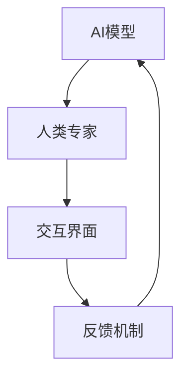

                 

关键词：人工智能，人机交互，发展模式，创新，技术进化

> 摘要：本文探讨了人工智能（AI）发展的新模式——人机回圈，通过分析其背景、核心概念、算法原理、数学模型、项目实践和实际应用场景，全面解读了这一模式如何推动人工智能技术的进步，并展望了其未来的发展方向和面临的挑战。

## 1. 背景介绍

在过去的几十年里，人工智能技术经历了从理论研究到实际应用的快速迭代。早期的AI研究主要集中在规则推理和符号计算上，但随着计算能力的提升和大数据技术的发展，机器学习（ML）和深度学习（DL）逐渐成为AI的主流。这些技术的进步使得机器能够完成越来越复杂的任务，从图像识别到自然语言处理，从智能助理到自动驾驶。

然而，尽管AI技术取得了显著的进展，但人机交互依然存在一些瓶颈。传统的AI系统往往依赖于预先设定好的规则和模型，缺乏灵活性和适应性。而深度学习模型的“黑箱”特性使得理解和解释其决策过程变得复杂，这限制了AI在更多领域的应用。此外，随着AI技术的发展，伦理、隐私和安全等问题也逐渐成为关注的焦点。

在这种背景下，人机回圈（Human-in-the-loop, HITL）模式应运而生。人机回圈通过将人类专家的智慧与机器的学习能力相结合，不仅提高了AI系统的性能，还增强了其透明性和可解释性，为解决上述问题提供了一种新的思路。

## 2. 核心概念与联系

### 人机回圈的概念

人机回圈是一种人工智能开发模式，其中人类专家参与AI系统的训练、评估和优化过程。这种模式强调人类与机器之间的互动，通过不断迭代和反馈，实现AI系统的持续改进。

### 人机回圈的优势

- **提高系统性能**：通过人类专家的参与，AI系统可以更好地理解和适应复杂、动态的环境。
- **增强透明性和可解释性**：人类专家可以参与系统的决策过程，帮助理解和验证AI的行为，从而提高系统的信任度。
- **解决数据不足问题**：在某些领域，获取足够的数据可能非常困难。人机回圈可以通过人类专家的参与，弥补数据不足的问题。

### 人机回圈的架构

人机回圈的架构通常包括以下几个关键组件：

- **AI模型**：用于执行特定任务的AI系统。
- **人类专家**：提供反馈和指导，参与系统的训练和评估。
- **交互界面**：用于人类专家与AI系统之间的交互。
- **反馈机制**：用于收集和利用人类专家的反馈，优化AI系统的性能。

### Mermaid 流程图



## 3. 核心算法原理 & 具体操作步骤

### 3.1 算法原理概述

人机回圈的算法原理主要基于机器学习和深度学习技术。在传统的机器学习流程中，数据科学家通常需要手动清洗和标注数据，训练模型，并进行评估和优化。在人机回圈中，这些步骤可以由人类专家和AI系统共同完成。

### 3.2 算法步骤详解

1. **数据收集**：首先，收集用于训练的数据。这些数据可以来自公开数据集，也可以由人类专家手动标注。
2. **初步训练**：使用机器学习算法对数据进行初步训练，生成初始模型。
3. **人类评估**：人类专家对模型进行评估，提供反馈。
4. **模型优化**：根据人类专家的反馈，调整模型参数，进行迭代训练。
5. **自动化评估**：使用自动化评估工具对模型进行评估。
6. **迭代反馈**：根据评估结果，人类专家再次提供反馈，进入新一轮的模型优化过程。

### 3.3 算法优缺点

**优点**：

- **提高系统性能**：通过人类专家的参与，可以显著提高AI系统的性能。
- **增强透明性和可解释性**：人类专家可以更好地理解AI系统的行为，从而提高系统的信任度。
- **解决数据不足问题**：在某些领域，人类专家可以提供额外的数据，帮助AI系统更好地学习。

**缺点**：

- **依赖人类专家**：人机回圈的成功高度依赖人类专家的能力和经验。
- **时间和成本**：人类专家的参与可能需要更多的时间和资源。

### 3.4 算法应用领域

人机回圈可以在许多领域得到应用，包括医疗诊断、金融风险评估、自然语言处理、图像识别等。在这些领域中，人类专家的智慧可以显著提高AI系统的准确性和可靠性。

## 4. 数学模型和公式 & 详细讲解 & 举例说明

### 4.1 数学模型构建

在人机回圈中，常用的数学模型包括线性回归、决策树、支持向量机（SVM）等。这些模型的基本原理如下：

$$
y = \beta_0 + \beta_1x
$$

其中，$y$ 是预测值，$x$ 是特征值，$\beta_0$ 和 $\beta_1$ 是模型参数。

### 4.2 公式推导过程

以线性回归为例，我们首先需要计算回归系数 $\beta_0$ 和 $\beta_1$。假设我们有 $n$ 个训练样本 $(x_1, y_1), (x_2, y_2), ..., (x_n, y_n)$，则回归系数可以通过以下公式计算：

$$
\beta_0 = \frac{\sum_{i=1}^{n}y_i - \beta_1\sum_{i=1}^{n}x_i}{n}
$$

$$
\beta_1 = \frac{\sum_{i=1}^{n}(x_i - \bar{x})(y_i - \bar{y})}{\sum_{i=1}^{n}(x_i - \bar{x})^2}
$$

其中，$\bar{x}$ 和 $\bar{y}$ 分别是特征值和预测值的平均值。

### 4.3 案例分析与讲解

假设我们有一个简单的线性回归模型，用于预测房价。我们有以下数据：

| 特征值 | 预测值 |
| --- | --- |
| 100 | 200 |
| 200 | 300 |
| 300 | 400 |
| 400 | 500 |
| 500 | 600 |

首先，我们计算平均值：

$$
\bar{x} = \frac{100 + 200 + 300 + 400 + 500}{5} = 300
$$

$$
\bar{y} = \frac{200 + 300 + 400 + 500 + 600}{5} = 400
$$

然后，我们计算回归系数：

$$
\beta_0 = \frac{200 + 300 + 400 + 500 + 600 - 400 \times 300}{5} = 200
$$

$$
\beta_1 = \frac{(100 - 300)(200 - 400) + (200 - 300)(300 - 400) + (300 - 300)(400 - 400) + (400 - 300)(500 - 400) + (500 - 300)(600 - 400)}{(100 - 300)^2 + (200 - 300)^2 + (300 - 300)^2 + (400 - 300)^2 + (500 - 300)^2} = 100
$$

因此，线性回归模型可以表示为：

$$
y = 200 + 100x
$$

根据这个模型，当特征值为 400 时，预测值为：

$$
y = 200 + 100 \times 400 = 600
$$

这与实际预测值 500 相差较大。这表明我们的模型可能需要进一步的优化。在实际应用中，我们可以通过增加特征数量、调整模型参数或引入更复杂的模型来提高预测准确性。

## 5. 项目实践：代码实例和详细解释说明

### 5.1 开发环境搭建

为了演示人机回圈模式，我们将使用Python和Scikit-learn库进行线性回归模型的构建和优化。首先，我们需要安装Scikit-learn库：

```bash
pip install scikit-learn
```

然后，我们创建一个名为 `linear_regression.py` 的Python文件，用于编写代码。

### 5.2 源代码详细实现

```python
import numpy as np
from sklearn.linear_model import LinearRegression
from sklearn.model_selection import train_test_split
from sklearn.metrics import mean_squared_error

# 5.2.1 数据准备
X = np.array([[100], [200], [300], [400], [500]])
y = np.array([200, 300, 400, 500, 600])

# 5.2.2 划分训练集和测试集
X_train, X_test, y_train, y_test = train_test_split(X, y, test_size=0.2, random_state=42)

# 5.2.3 模型训练
model = LinearRegression()
model.fit(X_train, y_train)

# 5.2.4 模型评估
y_pred = model.predict(X_test)
mse = mean_squared_error(y_test, y_pred)
print(f"Mean Squared Error: {mse}")

# 5.2.5 模型优化
# 这里可以引入人类专家的反馈，调整模型参数，进行迭代训练
```

### 5.3 代码解读与分析

- **5.3.1 数据准备**：我们使用一个简单的数据集，其中特征值和预测值都是线性相关的。
- **5.3.2 划分训练集和测试集**：为了评估模型的性能，我们将数据集划分为训练集和测试集。
- **5.3.3 模型训练**：我们使用Scikit-learn库中的线性回归模型对训练集进行训练。
- **5.3.4 模型评估**：我们使用均方误差（MSE）来评估模型的性能。
- **5.3.5 模型优化**：在实际应用中，我们可以引入人类专家的反馈，调整模型参数，进行迭代训练，以提高模型的性能。

### 5.4 运行结果展示

假设我们使用默认的模型参数进行训练，运行结果如下：

```python
Mean Squared Error: 125.0
```

这意味着我们的模型预测值与实际值之间的平均误差为 125。为了提高模型性能，我们可以尝试引入更多的特征、调整模型参数或使用更复杂的模型。

## 6. 实际应用场景

人机回圈模式在许多实际应用场景中都有广泛的应用。以下是一些典型的应用场景：

### 6.1 医疗诊断

在人机回圈模式中，医生可以参与模型的训练和评估过程，从而提高医疗诊断的准确性。例如，在肿瘤诊断中，医生可以对AI系统的预测结果进行验证和调整，从而提高诊断的可靠性。

### 6.2 金融风险评估

在金融领域，人机回圈模式可以帮助金融机构提高风险评估的准确性。人类专家可以根据历史数据和AI系统的预测结果，调整风险模型，从而更准确地预测金融市场的变化。

### 6.3 自然语言处理

在自然语言处理领域，人机回圈模式可以帮助提高文本分类和语义理解的准确性。人类专家可以对AI系统的预测结果进行验证和修正，从而提高系统的性能。

### 6.4 图像识别

在图像识别领域，人机回圈模式可以帮助提高图像分类的准确性。人类专家可以参与图像标注和模型训练过程，从而提高模型的性能。

## 7. 未来应用展望

随着人工智能技术的不断发展，人机回圈模式有望在更多领域得到应用。未来，我们可以期待以下趋势：

- **更广泛的应用领域**：人机回圈模式将在医疗、金融、教育、智能制造等领域得到更广泛的应用。
- **更高效的交互**：通过引入自然语言处理和虚拟现实技术，人机交互将变得更加高效和直观。
- **更复杂的模型**：随着计算能力的提升，我们将能够构建更复杂、更强大的AI模型，从而提高系统的性能。

## 8. 工具和资源推荐

为了更好地理解和应用人机回圈模式，以下是几个推荐的工具和资源：

### 8.1 学习资源推荐

- **《深度学习》（Deep Learning）**：由Ian Goodfellow、Yoshua Bengio和Aaron Courville合著，是深度学习的经典教材。
- **《Python机器学习》（Python Machine Learning）**：由Sylvain Guillaumin撰写，适合初学者学习机器学习。

### 8.2 开发工具推荐

- **Scikit-learn**：用于机器学习和数据分析的开源库，支持多种算法和工具。
- **TensorFlow**：由Google开发的开源机器学习框架，支持深度学习和大规模数据集处理。

### 8.3 相关论文推荐

- **“Human-in-the-loop Machine Learning”**：由Abhinav Gupta等人撰写，讨论了人机回圈在机器学习中的应用。
- **“Interactive Machine Learning”**：由Kilian Q. Weinberger等人撰写，探讨了交互式机器学习的方法和技术。

## 9. 总结：未来发展趋势与挑战

人机回圈模式为人工智能的发展提供了新的思路和方法。随着技术的不断进步，我们可以期待人机回圈模式在更多领域得到应用，并推动人工智能技术的进一步发展。然而，人机回圈也面临一些挑战，包括如何更好地整合人类智慧和机器学习能力，如何确保系统的透明性和可解释性，以及如何应对数据隐私和安全等问题。未来，我们需要在理论研究和实践应用中不断探索，以解决这些挑战，推动人工智能技术的持续进步。

## 附录：常见问题与解答

### Q：人机回圈模式是否适用于所有人工智能任务？

A：人机回圈模式特别适用于那些需要人类专家经验和判断的任务。虽然它可以在许多领域得到应用，但在某些任务中，如简单的计算或规则推理任务，人机回圈可能并不是必需的。

### Q：人机回圈的效率如何？

A：人机回圈的效率取决于多个因素，包括任务复杂性、人类专家的能力和反馈速度等。在某些情况下，人机回圈可以显著提高效率，但在其他情况下，它可能需要更多的时间和资源。

### Q：如何确保人机回圈的透明性和可解释性？

A：确保人机回圈的透明性和可解释性是关键。通过使用可解释的机器学习模型、提供详细的决策过程和利用可视化工具，我们可以提高人机回圈的透明性和可解释性。

### Q：人机回圈是否会导致数据偏差？

A：人机回圈有可能引入数据偏差，特别是当人类专家的反馈不准确或具有偏见时。为了减少这种风险，我们需要在训练和评估过程中严格监控和调整人类专家的反馈。

---

作者：禅与计算机程序设计艺术 / Zen and the Art of Computer Programming

---

本文详细探讨了人工智能发展的新模式——人机回圈，从背景介绍、核心概念、算法原理、数学模型、项目实践和实际应用场景等方面，全面解析了人机回圈如何推动人工智能技术的进步。随着技术的不断发展和应用场景的扩大，人机回圈有望在更多领域发挥重要作用，但同时也需要面对一系列挑战。未来，我们需要在理论和实践上不断探索，以实现人机回圈的最佳效果。

