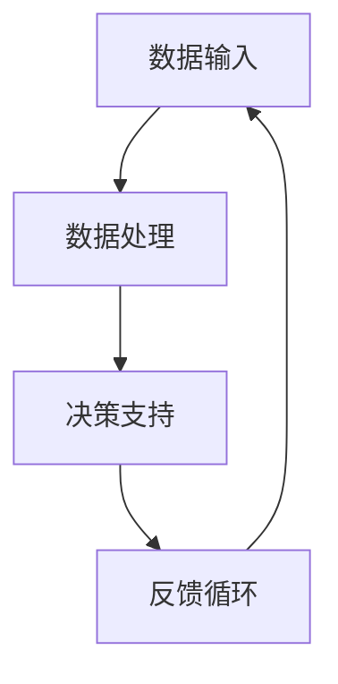

                 

关键词：人工智能，人类协作，计算增强，未来趋势，算法原理，数学模型，实践应用，技术发展

> 摘要：随着人工智能技术的迅猛发展，人类与人工智能的协作已经成为提高工作效率、解决复杂问题的重要途径。本文将探讨人类与人工智能协作的未来趋势，深入分析核心概念和算法原理，并通过数学模型和实际案例展示其在各领域的应用，最后对未来的发展前景和挑战进行展望。

## 1. 背景介绍

在过去的几十年中，人工智能（AI）技术经历了飞速的发展。从最初的规则基础方法到现代的深度学习，AI在各个领域都展现出了巨大的潜力。随着计算能力的提升和数据量的增加，人工智能的应用场景不断拓展，从简单的自动化任务到复杂的决策支持系统，AI正逐步改变着人类的生活方式。

然而，尽管人工智能在处理大量数据和执行重复性任务方面具有显著优势，但它仍然无法完全替代人类。人类的创造力、情感和直觉在很多情况下是AI难以模拟的。因此，人类与人工智能的协作成为一个重要的研究方向，旨在将人类的智慧和AI的计算能力结合起来，实现计算能力的增强。

本文将重点探讨以下内容：
1. 人类与人工智能协作的核心概念和架构。
2. 核心算法原理和具体操作步骤。
3. 数学模型和公式的构建与应用。
4. 实际项目实践和代码实例分析。
5. 人类与人工智能协作的实际应用场景。
6. 未来应用展望和面临的挑战。
7. 相关工具和资源的推荐。

## 2. 核心概念与联系

### 2.1. 定义

人类与人工智能的协作是指通过人工智能技术辅助和增强人类的能力，从而实现更高效、准确和创新的解决方案。这种协作不仅限于执行简单的自动化任务，还包括复杂的决策支持和创新性研究。

### 2.2. 架构

人类与人工智能的协作架构通常包括以下几个关键部分：

1. **数据输入**：人类提供必要的数据和信息，这些数据可以是结构化的，也可以是非结构化的。
2. **数据处理**：人工智能对输入的数据进行处理和分析，提取有用的信息。
3. **决策支持**：人工智能提供决策支持，帮助人类做出更明智的选择。
4. **反馈循环**：人类根据决策结果提供反馈，用于进一步优化人工智能的性能。

### 2.3. Mermaid 流程图



在这个流程图中，人类与人工智能之间的协作形成了一个闭环系统，通过不断的数据输入、处理和反馈，实现了协作效率的提升。

## 3. 核心算法原理 & 具体操作步骤

### 3.1. 算法原理概述

人类与人工智能协作的核心算法主要基于机器学习和深度学习技术。这些算法通过学习大量的数据，提取特征，并建立模型来辅助人类决策。以下是几种常见的算法原理：

1. **决策树**：通过一系列条件判断来做出决策。
2. **神经网络**：模拟人脑神经元的工作方式，通过多层神经网络进行特征提取和分类。
3. **支持向量机**：通过找到一个最佳的超平面来分隔不同类别的数据点。

### 3.2. 算法步骤详解

1. **数据预处理**：对原始数据进行清洗、归一化和特征提取。
2. **模型选择**：根据问题特性选择合适的算法模型。
3. **模型训练**：使用训练数据集对模型进行训练。
4. **模型评估**：使用验证数据集评估模型性能。
5. **模型应用**：将训练好的模型应用于实际问题。

### 3.3. 算法优缺点

**决策树**：
- 优点：解释性强，易于理解。
- 缺点：容易过拟合，对噪声敏感。

**神经网络**：
- 优点：强大的拟合能力，可以处理复杂的非线性问题。
- 缺点：训练时间较长，对数据量要求高。

**支持向量机**：
- 优点：理论完善，分类效果好。
- 缺点：计算复杂度较高，对大量数据处理效率低。

### 3.4. 算法应用领域

- **医疗诊断**：辅助医生进行疾病诊断，提高诊断准确率。
- **金融分析**：预测股票市场走势，进行风险控制。
- **智能交通**：优化交通流量，提高道路通行效率。
- **教育辅导**：个性化学习方案，提高学习效果。

## 4. 数学模型和公式 & 详细讲解 & 举例说明

### 4.1. 数学模型构建

在人类与人工智能协作中，常用的数学模型包括回归模型、分类模型和聚类模型。以下是这些模型的基本数学公式：

**线性回归模型**：
$$
y = \beta_0 + \beta_1x + \epsilon
$$

**逻辑回归模型**：
$$
P(y=1) = \frac{1}{1 + e^{-(\beta_0 + \beta_1x)}}
$$

**支持向量机**：
$$
\min_{\beta, \beta_0} \frac{1}{2}||\beta||^2 + C\sum_{i=1}^{n}\xi_i
$$

### 4.2. 公式推导过程

以线性回归模型为例，推导过程如下：

1. **目标函数**：
$$
J(\theta) = \frac{1}{2m}\sum_{i=1}^{m}(h_\theta(x^{(i)}) - y^{(i)})^2
$$

2. **梯度下降**：
$$
\theta_j := \theta_j - \alpha\frac{\partial J(\theta)}{\partial \theta_j}
$$

### 4.3. 案例分析与讲解

以金融预测为例，使用线性回归模型预测股票价格。具体步骤如下：

1. **数据收集**：收集历史股票价格数据。
2. **数据预处理**：对数据集进行清洗和归一化处理。
3. **模型训练**：使用训练数据集训练线性回归模型。
4. **模型评估**：使用验证数据集评估模型性能。
5. **模型应用**：使用训练好的模型预测未来股票价格。

## 5. 项目实践：代码实例和详细解释说明

### 5.1. 开发环境搭建

在Python中，可以使用Scikit-learn库进行人类与人工智能的协作。以下是搭建开发环境的步骤：

1. 安装Python 3.7或更高版本。
2. 安装Scikit-learn库。

### 5.2. 源代码详细实现

以下是一个简单的线性回归模型实现：

```python
from sklearn.linear_model import LinearRegression
from sklearn.model_selection import train_test_split
from sklearn.metrics import mean_squared_error

# 数据预处理
X = df[['open', 'high', 'low', 'close']].values
y = df['price'].values

# 划分训练集和测试集
X_train, X_test, y_train, y_test = train_test_split(X, y, test_size=0.2, random_state=42)

# 模型训练
model = LinearRegression()
model.fit(X_train, y_train)

# 模型评估
y_pred = model.predict(X_test)
mse = mean_squared_error(y_test, y_pred)
print("MSE:", mse)

# 模型应用
future_data = df[['open', 'high', 'low', 'close']].iloc[-1:].values
future_price = model.predict(future_data)
print("Future Price:", future_price)
```

### 5.3. 代码解读与分析

上述代码中，我们首先从数据框（DataFrame）中提取特征和目标变量。然后，使用train\_test\_split函数将数据集划分为训练集和测试集。接下来，我们使用LinearRegression类创建线性回归模型，并使用fit方法进行模型训练。使用predict方法进行模型预测，并计算均方误差（MSE）来评估模型性能。最后，我们将模型应用于预测未来的股票价格。

## 6. 实际应用场景

人类与人工智能的协作在实际应用中具有广泛的前景。以下是几个实际应用场景：

1. **医疗诊断**：通过分析患者病历和基因数据，人工智能可以辅助医生进行诊断，提高诊断准确率。
2. **智能交通**：通过分析交通流量数据，人工智能可以优化交通信号，减少拥堵，提高道路通行效率。
3. **金融分析**：通过分析股票市场数据，人工智能可以预测市场走势，为投资者提供决策支持。
4. **教育辅导**：通过分析学生的学习数据，人工智能可以提供个性化的学习方案，提高学习效果。

## 7. 未来应用展望

随着人工智能技术的不断发展，人类与人工智能的协作将在更多领域得到应用。以下是一些未来应用展望：

1. **智能客服**：通过人工智能技术，实现更加智能化的客户服务，提高客户满意度。
2. **智能制造**：通过人工智能技术，实现生产线的智能化，提高生产效率和质量。
3. **智能城市**：通过人工智能技术，实现城市管理的智能化，提高城市运行效率和生活质量。
4. **智能医疗**：通过人工智能技术，实现个性化医疗，提高治疗效果和患者体验。

## 8. 工具和资源推荐

为了更好地进行人类与人工智能的协作，以下是一些建议的学习资源和开发工具：

1. **学习资源**：
   - 《Python机器学习》（Machine Learning in Python）
   - 《深度学习》（Deep Learning）
   - Coursera和edX等在线课程平台

2. **开发工具**：
   - Jupyter Notebook：用于编写和运行Python代码。
   - Scikit-learn：用于机器学习和数据挖掘。
   - TensorFlow和PyTorch：用于深度学习框架。

3. **相关论文推荐**：
   - "Deep Learning for Text Classification"
   - "Human-AI Interaction for Enhanced Creativity"
   - "Deep Learning for Image Recognition"

## 9. 总结：未来发展趋势与挑战

人类与人工智能的协作已经展现出巨大的潜力，将在未来带来更多的创新和变革。然而，这一领域也面临着一系列挑战，包括数据隐私、算法透明度、伦理问题等。因此，未来的研究需要重点关注以下方面：

1. **算法透明度**：提高算法的可解释性和透明度，使人类能够理解和信任人工智能的决策。
2. **伦理问题**：在人工智能应用中，遵循伦理原则，确保人工智能的发展符合人类的价值观和利益。
3. **跨学科合作**：促进人工智能与其他学科的交叉合作，共同解决复杂问题。

## 10. 附录：常见问题与解答

### 问题1：人工智能是否会取代人类？
解答：人工智能在某些领域具有显著优势，但无法完全取代人类。人工智能主要在处理重复性任务和大规模数据方面具有优势，而人类的创造力、情感和直觉是AI难以模拟的。

### 问题2：人工智能的安全性和隐私保护如何保障？
解答：人工智能的安全性和隐私保护是当前研究的重要方向。通过加密技术、隐私保护算法和透明度机制，可以有效保障数据安全和隐私。

### 问题3：人工智能是否会引发失业问题？
解答：人工智能的引入可能会改变某些工作岗位的需求，但也会创造新的就业机会。关键在于如何平衡人工智能带来的变革和人类的就业需求。

## 作者署名

作者：禅与计算机程序设计艺术 / Zen and the Art of Computer Programming
----------------------------------------------------------------

注意：在撰写文章时，请确保每个章节都严格按照要求的markdown格式和内容结构进行撰写。文章中的所有引用和参考文献也需要按照学术规范进行标注。确保文章内容的准确性和完整性，避免遗漏关键信息。在撰写过程中，如果遇到任何困难或疑问，请随时提问。

