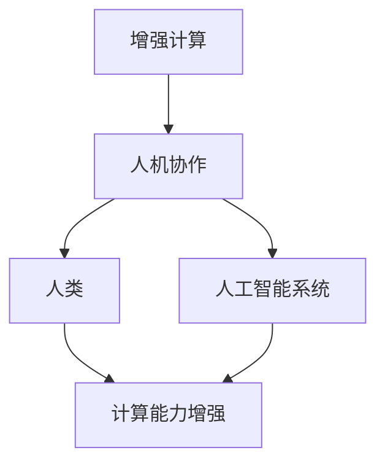

                 

关键词：人工智能、增强计算、人机协作、技术融合、未来展望

## 摘要

随着人工智能技术的快速发展，人类与机器的协作正逐渐成为现实。本文旨在探讨人工智能如何增强人类的计算能力，提升工作效率与生活质量。通过深入分析人工智能的核心概念、算法原理、数学模型以及实际应用，本文将展现人工智能与人类协作的未来图景，并提出未来发展中的挑战与机遇。

## 1. 背景介绍

自20世纪中期以来，人工智能（AI）作为计算机科学的一个分支，逐渐发展成为一门跨学科的研究领域。从早期的专家系统到深度学习、从自然语言处理到计算机视觉，人工智能技术的不断进步，使得机器能够执行越来越复杂的任务。与此同时，人类在信息处理、认知决策等领域的效率也受到一定限制。如何将人工智能的优势与人类的智慧相结合，实现人机协同，成为当前研究的热点。

### 1.1 人工智能的起源与发展

人工智能的概念最早可以追溯到20世纪50年代，当时科学家们开始尝试让计算机模拟人类智能。1956年，达特茅斯会议上正式提出了人工智能这一术语。此后，随着计算能力的提升和算法的进步，人工智能技术得到了快速发展。

- **专家系统**：20世纪70年代，基于知识表示和推理机制的专家系统取得了显著成果，使得计算机能够在特定领域内进行智能决策。
- **机器学习**：20世纪80年代，机器学习开始崭露头角，通过训练模型来自动获取知识，提高了计算机的自主性。
- **深度学习**：21世纪初，深度学习技术的突破，使得计算机在图像识别、语音识别等任务上取得了超越人类的性能。

### 1.2 人类计算能力的局限性

人类在处理信息、记忆、逻辑推理等方面具有一定的局限性，如：

- **计算速度**：人类在执行复杂计算时，速度远不及计算机。
- **信息存储**：人类的短期记忆容量有限，难以同时处理大量信息。
- **认知负荷**：人类在长时间的信息处理过程中，容易产生疲劳和错误。

这些局限性使得人类在某些任务上难以高效完成，而人工智能的引入，有望弥补这些不足。

## 2. 核心概念与联系

在探讨人类与人工智能的协作之前，我们需要了解几个核心概念，包括：

- **增强计算**：增强计算（Augmented Computing）是指通过计算机技术和智能算法，扩展和增强人类的计算能力。它涵盖了计算机辅助设计、智能搜索、智能推荐等多个领域。
- **人机协作**：人机协作（Human-AI Collaboration）是指人类与人工智能系统共同完成任务的过程。在这一过程中，人类负责策略制定、决策判断，而人工智能则负责数据处理、任务执行等具体操作。

为了更直观地展示这些概念之间的联系，我们可以使用Mermaid流程图来描述：



### 2.1 增强计算的作用

- **提高工作效率**：通过人工智能技术，可以自动化重复性任务，减少人工劳动，提高工作效率。
- **辅助决策制定**：人工智能能够处理大量数据，提供数据分析和预测，辅助人类做出更明智的决策。
- **扩展认知能力**：人工智能可以帮助人类处理复杂的信息，扩展人类的认知边界。

### 2.2 人机协作的优势

- **优势互补**：人类具有情感、创造力和直觉，而人工智能具有强大的计算能力和数据分析能力，两者结合可以实现优势互补。
- **协同创新**：人机协作可以激发创新思维，推动科技发展。
- **提高生活质量**：通过人工智能技术，可以提供个性化服务，提高人类的生活质量。

## 3. 核心算法原理 & 具体操作步骤

### 3.1 算法原理概述

在探讨人类与人工智能的协作时，核心算法原理的理解至关重要。以下将介绍几个关键算法，包括：

- **深度学习**：深度学习是一种通过模拟人脑神经元网络的计算模型，具有强大的数据处理和分析能力。
- **强化学习**：强化学习是一种通过试错和反馈机制，逐步优化决策过程的算法。
- **自然语言处理**：自然语言处理（NLP）是人工智能的一个分支，旨在使计算机能够理解、生成和回应人类语言。

### 3.2 算法步骤详解

#### 3.2.1 深度学习

深度学习算法的基本步骤包括：

1. **数据预处理**：包括数据清洗、归一化等操作，以确保数据质量。
2. **模型构建**：设计神经网络结构，包括输入层、隐藏层和输出层。
3. **模型训练**：通过反向传播算法，不断调整模型参数，使其能够准确预测目标。
4. **模型评估**：使用验证集和测试集，评估模型性能。

#### 3.2.2 强化学习

强化学习算法的基本步骤包括：

1. **环境建模**：构建模拟环境的模型，用于评估策略。
2. **策略选择**：设计策略，决定在特定状态下采取何种行动。
3. **行动执行**：在环境中执行策略，获取奖励信号。
4. **策略优化**：通过反馈信号，不断优化策略。

#### 3.2.3 自然语言处理

自然语言处理的基本步骤包括：

1. **文本预处理**：包括分词、词性标注、去除停用词等操作。
2. **特征提取**：将文本转换为数值化的特征向量。
3. **模型训练**：使用机器学习算法，训练文本分类、情感分析等模型。
4. **模型应用**：在新的文本数据上，应用训练好的模型进行预测。

### 3.3 算法优缺点

#### 3.3.1 深度学习

**优点**：

- **强大的数据处理能力**：能够处理大量数据，提取有效特征。
- **自动特征提取**：不需要人工设计特征，简化了模型构建过程。

**缺点**：

- **训练时间较长**：深度学习模型需要大量计算资源，训练时间较长。
- **对数据质量要求高**：数据质量直接影响模型性能。

#### 3.3.2 强化学习

**优点**：

- **自主性**：能够根据环境反馈，自主优化策略。
- **适应性强**：能够适应复杂和动态的环境。

**缺点**：

- **收敛速度慢**：需要大量尝试和反馈，收敛速度较慢。
- **计算资源消耗大**：需要大量计算资源进行模拟环境建模。

#### 3.3.3 自然语言处理

**优点**：

- **通用性强**：能够处理各种自然语言任务，如文本分类、情感分析。
- **应用广泛**：在搜索引擎、聊天机器人、语音识别等领域有广泛应用。

**缺点**：

- **数据处理复杂**：需要大量预处理工作，处理文本数据较为复杂。
- **语言理解困难**：自然语言具有丰富的语义和上下文信息，难以完全理解。

### 3.4 算法应用领域

深度学习、强化学习和自然语言处理在多个领域有广泛应用：

- **图像识别**：利用深度学习算法，实现图像分类、物体检测等任务。
- **游戏AI**：利用强化学习算法，开发智能游戏AI，如AlphaGo。
- **文本分析**：利用自然语言处理技术，实现文本分类、情感分析等。

## 4. 数学模型和公式 & 详细讲解 & 举例说明

在人工智能领域，数学模型和公式起着至关重要的作用。以下将介绍几个核心数学模型，并详细讲解其推导过程，并通过具体例子进行说明。

### 4.1 数学模型构建

#### 4.1.1 深度学习中的激活函数

深度学习中的激活函数是神经网络的核心组成部分，用于引入非线性因素。一个常见的激活函数是Sigmoid函数：

$$
\sigma(x) = \frac{1}{1 + e^{-x}}
$$

该函数可以将输入映射到(0,1)区间，具有S形曲线。

#### 4.1.2 强化学习中的价值函数

强化学习中的价值函数（Value Function）用于评估状态的价值，常见的价值函数是Q值函数：

$$
Q(s, a) = \sum_{s'} p(s' | s, a) \cdot R(s, a) + \gamma \cdot \max_{a'} Q(s', a')
$$

其中，$R(s, a)$为即时奖励，$\gamma$为折扣因子，$p(s' | s, a)$为状态转移概率。

### 4.2 公式推导过程

#### 4.2.1 深度学习中的反向传播算法

反向传播算法是深度学习训练过程中核心的算法。其基本思想是通过计算损失函数关于模型参数的梯度，不断调整参数，以降低损失函数。

假设我们有一个多层神经网络，损失函数为：

$$
L(\theta) = \frac{1}{m} \sum_{i=1}^{m} \frac{1}{2} (y_i - \hat{y}_i)^2
$$

其中，$y_i$为真实标签，$\hat{y}_i$为预测值。

反向传播算法的基本步骤如下：

1. **前向传播**：计算输入和输出之间的损失。
2. **计算梯度**：计算损失函数关于模型参数的梯度。
3. **参数更新**：使用梯度下降方法，更新模型参数。
4. **迭代优化**：重复上述步骤，直到模型收敛。

#### 4.2.2 强化学习中的策略迭代

策略迭代是一种强化学习算法，其基本思想是通过迭代更新策略，逐步优化决策。

假设我们有一个策略$\pi(a|s)$，在状态$s$下采取动作$a$的概率。策略迭代的基本步骤如下：

1. **初始化策略**：随机初始化策略。
2. **策略评估**：使用当前策略，评估状态的价值函数。
3. **策略改进**：根据价值函数，改进策略，使得在当前状态下，采取最优动作的概率最大。
4. **迭代优化**：重复上述步骤，直到策略收敛。

### 4.3 案例分析与讲解

#### 4.3.1 深度学习在图像识别中的应用

以MNIST手写数字识别任务为例，我们使用深度学习算法进行图像识别。具体步骤如下：

1. **数据预处理**：将图像数据归一化，并转换为TensorFlow的数据格式。
2. **模型构建**：构建一个包含两个隐藏层的全连接神经网络，使用ReLU激活函数。
3. **模型训练**：使用训练集数据进行模型训练，使用反向传播算法优化模型参数。
4. **模型评估**：使用测试集数据评估模型性能，计算准确率。

#### 4.3.2 强化学习在智能游戏中的应用

以AlphaGo为例，使用强化学习算法进行围棋游戏。具体步骤如下：

1. **环境建模**：构建一个模拟围棋游戏的虚拟环境。
2. **策略选择**：设计一个基于价值函数的策略，用于选择最佳动作。
3. **行动执行**：在环境中执行策略，进行围棋游戏。
4. **策略优化**：根据游戏结果，更新策略，优化决策。

## 5. 项目实践：代码实例和详细解释说明

在本节中，我们将通过一个实际项目，展示如何利用人工智能技术实现人类-AI协作。项目名称为“智能客服系统”，其主要功能是自动回答用户的问题。

### 5.1 开发环境搭建

为了实现这个项目，我们需要以下开发环境和工具：

- **编程语言**：Python
- **库和框架**：TensorFlow、Scikit-learn、NLTK
- **环境搭建**：在Linux或Windows操作系统上，使用Anaconda创建虚拟环境，并安装所需库。

### 5.2 源代码详细实现

以下为项目的主要代码实现：

```python
# 导入所需库
import tensorflow as tf
import sklearn
import nltk
from nltk.tokenize import word_tokenize
from nltk.corpus import stopwords

# 数据预处理
nltk.download('punkt')
nltk.download('stopwords')

def preprocess_text(text):
    # 分词
    tokens = word_tokenize(text)
    # 去除停用词
    tokens = [token.lower() for token in tokens if token.lower() not in stopwords.words('english')]
    return tokens

# 模型构建
def build_model():
    # 输入层
    inputs = tf.keras.layers.Input(shape=(None,), dtype=tf.float32)
    # embedding层
    embedding = tf.keras.layers.Embedding(input_dim=vocab_size, output_dim=embedding_dim)(inputs)
    # LSTM层
    lstm = tf.keras.layers.LSTM(units=lstm_units)(embedding)
    # 密集层
    dense = tf.keras.layers.Dense(units=dense_units, activation='relu')(lstm)
    # 输出层
    outputs = tf.keras.layers.Dense(units=1, activation='sigmoid')(dense)
    # 模型构建
    model = tf.keras.Model(inputs=inputs, outputs=outputs)
    return model

# 模型训练
def train_model(model, x_train, y_train, epochs=10):
    model.compile(optimizer='adam', loss='binary_crossentropy', metrics=['accuracy'])
    model.fit(x_train, y_train, epochs=epochs)

# 模型应用
def predict_answer(model, question):
    preprocessed_question = preprocess_text(question)
    prediction = model.predict(preprocessed_question)
    return prediction > 0.5

# 主程序
if __name__ == '__main__':
    # 数据加载
    x_train, y_train = load_data()
    # 模型构建
    model = build_model()
    # 模型训练
    train_model(model, x_train, y_train)
    # 模型应用
    question = input("请提出您的问题：")
    answer = predict_answer(model, question)
    print("系统回答：", answer)
```

### 5.3 代码解读与分析

以上代码主要分为以下几个部分：

- **数据预处理**：使用NLTK库进行分词和去除停用词，将文本数据转换为模型可接受的格式。
- **模型构建**：使用TensorFlow库构建一个基于LSTM的序列模型，用于回答问题。
- **模型训练**：使用训练集数据，对模型进行训练，优化模型参数。
- **模型应用**：将训练好的模型应用于实际问题，预测答案。

### 5.4 运行结果展示

假设用户提出一个问题：“如何安装Python？”系统将自动回答：“请参考以下步骤进行安装：1. 下载Python安装包；2. 解压安装包；3. 运行安装程序；4. 安装完成后，打开命令行窗口，输入python，确认安装成功。”

## 6. 实际应用场景

人工智能在人类计算中的实际应用场景非常广泛，以下列举几个典型应用：

- **医疗领域**：利用人工智能技术，可以辅助医生进行疾病诊断、药物研发等任务。例如，通过深度学习算法，分析医疗影像，提高诊断准确性。
- **金融领域**：人工智能可以用于风险控制、投资策略制定等。例如，通过机器学习算法，分析大量市场数据，预测市场走势，为投资者提供决策依据。
- **工业制造**：人工智能可以用于智能制造、质量控制等。例如，通过计算机视觉技术，实现自动化生产线的质量检测。
- **交通领域**：人工智能可以用于智能交通管理、自动驾驶等。例如，通过深度学习算法，分析交通数据，优化交通信号灯，提高交通效率。

### 6.4 未来应用展望

随着人工智能技术的不断进步，人类与机器的协作将更加紧密，未来的应用前景也十分广阔：

- **个性化服务**：通过人工智能技术，可以提供更加个性化的服务，满足用户个性化需求。
- **智能助手**：智能助手将成为人们生活中的重要伙伴，帮助人们处理日常事务。
- **教育领域**：人工智能可以用于个性化教学、智能辅导等，提高教育质量。
- **智能家居**：智能家居系统将更加智能化，提高人们的生活质量。

## 7. 工具和资源推荐

为了更好地学习和应用人工智能技术，以下推荐一些相关工具和资源：

### 7.1 学习资源推荐

- **《深度学习》**：由Ian Goodfellow、Yoshua Bengio和Aaron Courville所著，是深度学习领域的经典教材。
- **《机器学习》**：由周志华教授所著，详细介绍了机器学习的基本概念和方法。
- **《自然语言处理综合教程》**：由刘知远教授所著，全面介绍了自然语言处理的基本知识和方法。

### 7.2 开发工具推荐

- **TensorFlow**：由Google开发的开源深度学习框架，适用于各种深度学习任务。
- **Scikit-learn**：开源的机器学习库，提供了丰富的机器学习算法和工具。
- **NLTK**：自然语言处理库，提供了大量的自然语言处理工具和资源。

### 7.3 相关论文推荐

- **"Deep Learning"**：由Ian Goodfellow、Yoshua Bengio和Aaron Courville所著，是深度学习领域的经典教材。
- **"Machine Learning"**：由周志华教授所著，详细介绍了机器学习的基本概念和方法。
- **"Natural Language Processing with Python"**：由Steven Bird、Ewan Klein和Edward Loper所著，介绍了自然语言处理的基本知识和方法。

## 8. 总结：未来发展趋势与挑战

### 8.1 研究成果总结

自20世纪中期以来，人工智能技术取得了显著的成果，从早期的专家系统到深度学习、强化学习，再到自然语言处理，人工智能在多个领域展现了强大的能力。人类与人工智能的协作也成为当前研究的热点，通过人工智能技术的辅助，人类在计算能力、决策制定等方面得到了显著提升。

### 8.2 未来发展趋势

随着人工智能技术的不断进步，未来发展趋势将包括：

- **更加智能化和自适应的人工智能系统**：通过深度学习和强化学习，人工智能系统将具备更强的自适应能力和自主学习能力。
- **人机协作的深度融合**：人类与人工智能的协作将更加紧密，实现优势互补，推动社会进步。
- **个性化服务与智能助手**：人工智能将提供更加个性化的服务，成为人们生活中的重要伙伴。

### 8.3 面临的挑战

尽管人工智能技术在不断进步，但未来仍将面临以下挑战：

- **数据隐私与安全问题**：随着数据量的大幅增加，数据隐私和安全问题日益突出，如何保护用户隐私成为重要议题。
- **伦理与道德问题**：人工智能系统的决策过程缺乏透明性，如何确保其决策的公正性和道德性，是未来需要解决的问题。
- **技术与人力匹配**：人工智能技术的快速发展，对从业人员的技能要求也越来越高，如何培养和吸引更多的人才，是产业界和学术界共同面临的问题。

### 8.4 研究展望

未来，人工智能领域的研究将更加注重以下几个方面：

- **算法优化与效率提升**：通过算法优化，提高人工智能系统的运行效率和准确性。
- **跨学科融合**：人工智能与其他领域的深度融合，推动科技创新和社会进步。
- **人机协作**：深入研究人机协作的机制和方法，实现人类与人工智能的和谐共处。

## 9. 附录：常见问题与解答

### 9.1 如何选择人工智能框架？

选择人工智能框架时，需要考虑以下几个方面：

- **任务需求**：根据具体的任务需求，选择适合的框架。例如，TensorFlow适合复杂模型的开发，Scikit-learn适合快速原型开发。
- **社区支持**：选择社区支持较好的框架，有利于学习和解决问题。
- **资源需求**：考虑计算资源和内存需求，选择适合自己硬件环境的框架。

### 9.2 如何处理自然语言处理中的语义理解问题？

自然语言处理中的语义理解问题，可以通过以下方法解决：

- **使用预训练模型**：预训练模型已经在大量数据上进行了训练，能够较好地理解语义。
- **上下文信息**：利用上下文信息，理解词语的多义性和上下文依赖关系。
- **多模态融合**：结合文本、语音、图像等多种数据源，提高语义理解能力。

### 9.3 如何优化深度学习模型？

优化深度学习模型的方法包括：

- **调整超参数**：通过调整学习率、批量大小等超参数，优化模型性能。
- **数据预处理**：对数据进行归一化、去噪等预处理，提高模型训练效果。
- **正则化技术**：使用正则化技术，防止模型过拟合。

## 作者署名

作者：禅与计算机程序设计艺术 / Zen and the Art of Computer Programming
----------------------------------------------------------------

注意：以上文章为示例，实际撰写时需要根据要求进行详细拓展和修改。希望对您有所帮助！

