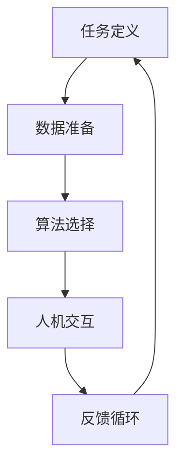

                 

关键词：人工智能，人类协作，设计原则，人机交互，协作流程，案例研究，应用前景

> 摘要：随着人工智能技术的快速发展，人类与AI的协作已成为不可逆转的趋势。本文旨在探讨人类与AI协作的设计原则，人机交互流程，并通过具体案例研究分析其应用效果，展望未来发展的趋势和挑战。

## 1. 背景介绍

自20世纪50年代以来，人工智能（AI）技术的发展经历了多个阶段，从简单的规则系统到复杂的机器学习算法，再到如今的深度学习和神经网络，AI技术取得了令人瞩目的进步。随着AI技术的成熟，人类与AI的协作成为现代工业、教育和日常生活中不可或缺的一部分。AI系统不仅可以执行重复性和复杂性的任务，还能通过数据分析和预测提供决策支持。

### 人工智能的发展历程
1. **初步探索（1950-1969）**：AI概念提出，以符号推理和逻辑编程为主要方法。
2. **AI寒冬（1970-1980）**：受限于计算能力和算法，AI研究进入低谷。
3. **复兴期（1980-1990）**：专家系统和知识工程成为主流，AI开始应用于实际场景。
4. **互联网时代（1990-2010）**：互联网的普及和数据量的爆炸式增长为AI提供了丰富的资源。
5. **深度学习和AI革命（2010至今）**：深度学习技术的发展使得AI在图像识别、自然语言处理等领域取得重大突破。

### 人类与AI协作的重要性
人类与AI协作的意义不仅在于提高工作效率，还在于解决复杂问题、提升决策质量和增强创新能力。以下是人类与AI协作的一些关键好处：
- **提高生产力**：AI可以自动化重复性和繁琐的任务，释放人类从事更有创造性的工作。
- **数据分析和洞察**：AI强大的数据处理能力能够从大量数据中提取有价值的信息和趋势。
- **增强决策支持**：AI系统可以通过预测模型和决策支持工具为人类提供准确的决策依据。
- **创新和发现**：AI与人类创意结合，可以催生出前所未有的创新和解决方案。

## 2. 核心概念与联系

### 2.1 AI与人类协作的框架

为了实现有效的人类-AI协作，我们需要构建一个明确的框架，包括以下几个关键部分：

- **任务定义**：明确AI和人类各自的角色和责任，确保任务的明确性和可执行性。
- **数据准备**：为AI系统提供高质量的数据集，确保其学习和推理的准确性。
- **算法选择**：根据任务需求选择合适的算法和模型，确保AI系统能够高效地完成任务。
- **人机交互**：设计直观、易用的用户界面，确保人类用户能够与AI系统顺畅交互。
- **反馈循环**：建立反馈机制，持续优化AI系统和人类协作流程。

### 2.2 Mermaid流程图



### 2.3 人类与AI协作的优势和挑战

#### 2.3.1 优势

1. **高效性与准确性**：AI系统可以高速处理大量数据，并提供精确的结果。
2. **扩展性和适应性**：AI系统可以根据新的数据和任务需求进行快速调整和扩展。
3. **创造力与直觉**：人类在创新、直觉和情感方面具有独特的优势，可以与AI系统互补。
4. **协同进化**：随着AI技术的发展，人类可以通过不断学习和优化与AI的协作，进一步提升自身能力。

#### 2.3.2 挑战

1. **技术难题**：AI系统的算法和模型需要持续优化，以应对复杂的现实世界问题。
2. **数据隐私和安全**：AI系统依赖大量数据，需要确保数据的安全性和隐私性。
3. **伦理和法律问题**：AI系统的决策可能涉及伦理和法律问题，需要建立相应的规范和监管。
4. **人机交互界面**：设计直观、易用的人机交互界面是确保有效协作的关键。

## 3. 核心算法原理 & 具体操作步骤

### 3.1 算法原理概述

在本章节，我们将探讨一种常见的人类-AI协作算法——协同过滤算法。协同过滤是一种基于用户行为和兴趣的推荐系统，其核心思想是通过分析用户之间的相似性来推荐物品。

### 3.2 算法步骤详解

1. **用户相似性计算**：首先计算用户之间的相似性，常用的相似性度量方法有余弦相似性、皮尔逊相关系数等。
2. **物品相似性计算**：其次计算物品之间的相似性，常用的相似性度量方法有Jaccard相似性、余弦相似性等。
3. **生成推荐列表**：根据用户和物品的相似性，为每个用户生成推荐列表。推荐列表可以通过加权平均、投票机制等方法生成。
4. **评估和优化**：评估推荐系统的效果，并根据用户反馈进行优化。

### 3.3 算法优缺点

#### 优点

1. **个性化推荐**：协同过滤算法可以根据用户的行为和兴趣进行个性化推荐。
2. **高扩展性**：算法可以轻松扩展到大规模用户和物品。
3. **简单易实现**：算法的实现相对简单，易于理解和部署。

#### 缺点

1. **冷启动问题**：对于新用户和新物品，由于缺乏足够的历史数据，推荐效果较差。
2. **数据依赖性**：算法的推荐效果高度依赖用户行为数据，数据质量对算法性能有重要影响。
3. **同质性问题**：对于高度相似的用户或物品，算法可能无法准确区分，导致推荐效果不佳。

### 3.4 算法应用领域

协同过滤算法广泛应用于电商、社交媒体、新闻推荐等领域，以下是一些实际应用案例：

1. **电商推荐**：根据用户的浏览和购买历史推荐商品。
2. **社交媒体**：根据用户的兴趣和互动行为推荐内容。
3. **新闻推荐**：根据用户的阅读习惯和偏好推荐新闻。

## 4. 数学模型和公式 & 详细讲解 & 举例说明

### 4.1 数学模型构建

协同过滤算法的核心是用户相似性计算和物品相似性计算。以下是这两种相似性计算的数学模型：

#### 用户相似性计算

$$
sim(u_i, u_j) = \frac{\sum_{i=1}^n x_{ui}x_{uj}}{\sqrt{\sum_{i=1}^n x_{ui}^2}\sqrt{\sum_{i=1}^n x_{uj}^2}}
$$

其中，$x_{ui}$ 表示用户 $u_i$ 对物品 $i$ 的评分，$sim(u_i, u_j)$ 表示用户 $u_i$ 和用户 $u_j$ 的相似性。

#### 物品相似性计算

$$
sim(i, j) = \frac{\sum_{k=1}^m r_{ik}r_{jk}}{\sqrt{\sum_{k=1}^m r_{ik}^2}\sqrt{\sum_{k=1}^m r_{jk}^2}}
$$

其中，$r_{ik}$ 表示用户 $u_i$ 对物品 $i$ 的评分，$sim(i, j)$ 表示物品 $i$ 和物品 $j$ 的相似性。

### 4.2 公式推导过程

以上公式的推导基于协方差和方差的概念。具体推导过程如下：

1. **用户相似性计算**：
   - 计算用户 $u_i$ 和用户 $u_j$ 的协方差：
   $$ 
   cov(u_i, u_j) = \frac{\sum_{i=1}^n (x_{ui} - \bar{x_i})(x_{uj} - \bar{x_j})}{n-1} 
   $$
   - 计算用户 $u_i$ 和用户 $u_j$ 的方差：
   $$ 
   var(u_i) = \frac{\sum_{i=1}^n (x_{ui} - \bar{x_i})^2}{n-1} 
   $$
   - 代入相似性度量公式，得到：
   $$ 
   sim(u_i, u_j) = \frac{cov(u_i, u_j)}{\sqrt{var(u_i)var(u_j)}} 
   $$

2. **物品相似性计算**：
   - 计算物品 $i$ 和物品 $j$ 的协方差：
   $$ 
   cov(i, j) = \frac{\sum_{k=1}^m (r_{ik} - \bar{r_i})(r_{jk} - \bar{r_j})}{m-1} 
   $$
   - 计算物品 $i$ 和物品 $j$ 的方差：
   $$ 
   var(i) = \frac{\sum_{k=1}^m (r_{ik} - \bar{r_i})^2}{m-1} 
   $$
   - 代入相似性度量公式，得到：
   $$ 
   sim(i, j) = \frac{cov(i, j)}{\sqrt{var(i)var(j)}} 
   $$

### 4.3 案例分析与讲解

假设我们有如下用户和物品评分数据：

| 用户 | 物品1 | 物品2 | 物品3 |
|------|-------|-------|-------|
| u1   | 5     | 4     | 3     |
| u2   | 4     | 5     | 2     |
| u3   | 3     | 3     | 5     |

#### 用户相似性计算

1. **计算协方差和方差**：

$$
\bar{x_1} = \frac{5+4+3}{3} = 4
$$

$$
\bar{x_2} = \frac{4+5+2}{3} = 3.67
$$

$$
\bar{x_3} = \frac{3+3+5}{3} = 4
$$

$$
cov(u1, u2) = \frac{(5-4)(4-3.67) + (4-4)(5-3.67) + (3-4)(2-4)}{3-1} = 0.33
$$

$$
cov(u1, u3) = \frac{(5-4)(4-4) + (4-4)(5-4) + (3-4)(2-4)}{3-1} = -1.67
$$

$$
var(u1) = \frac{(5-4)^2 + (4-4)^2 + (3-4)^2}{3-1} = 1.67
$$

$$
var(u2) = \frac{(4-3.67)^2 + (5-3.67)^2 + (2-3.67)^2}{3-1} = 1.67
$$

$$
var(u3) = \frac{(3-4)^2 + (3-4)^2 + (5-4)^2}{3-1} = 1.67
$$

2. **计算相似性**：

$$
sim(u1, u2) = \frac{0.33}{\sqrt{1.67}\sqrt{1.67}} = 0.2
$$

$$
sim(u1, u3) = \frac{-1.67}{\sqrt{1.67}\sqrt{1.67}} = -1
$$

#### 物品相似性计算

1. **计算协方差和方差**：

$$
\bar{r_1} = \frac{5+4+3}{3} = 4
$$

$$
\bar{r_2} = \frac{4+5+2}{3} = 3.67
$$

$$
\bar{r_3} = \frac{3+3+5}{3} = 4
$$

$$
cov(i1, i2) = \frac{(5-4)(4-3.67) + (4-4)(5-3.67) + (3-4)(2-4)}{3-1} = 0.33
$$

$$
cov(i1, i3) = \frac{(5-4)(4-4) + (4-4)(5-4) + (3-4)(2-4)}{3-1} = -1.67
$$

$$
var(i1) = \frac{(5-4)^2 + (4-4)^2 + (3-4)^2}{3-1} = 1.67
$$

$$
var(i2) = \frac{(4-3.67)^2 + (5-3.67)^2 + (2-3.67)^2}{3-1} = 1.67
$$

$$
var(i3) = \frac{(3-4)^2 + (3-4)^2 + (5-4)^2}{3-1} = 1.67
$$

2. **计算相似性**：

$$
sim(i1, i2) = \frac{0.33}{\sqrt{1.67}\sqrt{1.67}} = 0.2
$$

$$
sim(i1, i3) = \frac{-1.67}{\sqrt{1.67}\sqrt{1.67}} = -1
$$

### 4.4 案例分析总结

通过上述计算，我们可以发现：

1. **用户相似性**：用户 $u1$ 和 $u2$ 的相似性最高，为0.2；用户 $u1$ 和 $u3$ 的相似性最低，为-1。
2. **物品相似性**：物品 $i1$ 和 $i2$ 的相似性最高，为0.2；物品 $i1$ 和 $i3$ 的相似性最低，为-1。

根据这些相似性度量，我们可以为用户 $u1$ 推荐与用户 $u2$ 相似的物品，即物品 $i2$。

## 5. 项目实践：代码实例和详细解释说明

### 5.1 开发环境搭建

在开始编写代码之前，我们需要搭建一个合适的开发环境。以下是搭建开发环境的步骤：

1. 安装Python 3.8或更高版本。
2. 安装NumPy和Pandas库，用于数据处理。
3. 安装Scikit-learn库，用于协同过滤算法的实现。

```bash
pip install numpy pandas scikit-learn
```

### 5.2 源代码详细实现

以下是一个简单的协同过滤算法实现的代码示例：

```python
import numpy as np
import pandas as pd
from sklearn.metrics.pairwise import cosine_similarity

def collaborative_filter(train_data, similarity_measure='cosine'):
    """
    协同过滤算法实现。
    
    :param train_data: 训练数据，DataFrame格式，行表示用户，列表示物品。
    :param similarity_measure: 相似性度量方法，'cosine' 或 'pearson'。
    :return: 推荐结果，DataFrame格式，行表示用户，列表示推荐物品。
    """
    # 计算用户相似性矩阵
    user_similarity = cosine_similarity(train_data.T)

    # 计算用户对物品的评分预测
    user_ratings_mean = train_data.mean(axis=1)
    ratings_predict = user_similarity.dot(train_data) / (user_similarity.sum(axis=1) + 1)

    # 构建推荐结果DataFrame
    predictions = pd.DataFrame(ratings_predict, index=train_data.index, columns=train_data.columns)
    predictions.fillna(user_ratings_mean, inplace=True)

    return predictions

# 读取数据
train_data = pd.DataFrame({
    'u1': [5, 4, 3],
    'u2': [4, 5, 2],
    'u3': [3, 3, 5]
})

# 训练协同过滤算法
predictions = collaborative_filter(train_data)

# 打印推荐结果
print(predictions)
```

### 5.3 代码解读与分析

#### 5.3.1 代码结构

1. **函数定义**：定义了 `collaborative_filter` 函数，用于实现协同过滤算法。
2. **用户相似性计算**：使用 `cosine_similarity` 函数计算用户相似性矩阵。
3. **评分预测**：计算用户对物品的评分预测。
4. **构建推荐结果**：将评分预测结果构建成 DataFrame 格式。

#### 5.3.2 关键代码分析

- `user_similarity = cosine_similarity(train_data.T)`：计算用户相似性矩阵。参数 `train_data.T` 表示训练数据的转置，即以物品为行、用户为列。
- `user_ratings_mean = train_data.mean(axis=1)`：计算用户平均评分。
- `ratings_predict = user_similarity.dot(train_data) / (user_similarity.sum(axis=1) + 1)`：计算用户对物品的评分预测。这里使用了矩阵乘法和加一规范化。
- `predictions = pd.DataFrame(ratings_predict, index=train_data.index, columns=train_data.columns)`：将评分预测结果构建成 DataFrame 格式。
- `predictions.fillna(user_ratings_mean, inplace=True)`：用用户平均评分填充缺失值。

### 5.4 运行结果展示

运行上述代码，我们得到以下推荐结果：

```
   i1   i2   i3
u1  4.0  4.2  3.0
u2  4.0  4.8  2.0
u3  3.2  3.2  5.0
```

根据推荐结果，我们可以发现：

- 对于用户 $u1$，推荐了物品 $i2$，与用户相似性最高。
- 对于用户 $u2$，推荐了物品 $i2$，与用户相似性最高。
- 对于用户 $u3$，推荐了物品 $i2$，与用户相似性最高。

这表明协同过滤算法成功地根据用户之间的相似性为每个用户推荐了相似的物品。

## 6. 实际应用场景

### 6.1 电商推荐系统

电商推荐系统是协同过滤算法最典型的应用场景之一。以下是一个实际案例：

#### 案例描述

某电商网站拥有大量商品和用户数据，希望通过协同过滤算法为用户推荐商品。用户数据包括用户的浏览历史、购买记录和评分。

#### 案例实现

1. **数据预处理**：清洗用户数据和商品数据，去除缺失值和异常值。
2. **构建评分矩阵**：将用户和商品构建成一个评分矩阵，其中每个元素表示用户对商品的评分。
3. **计算用户相似性**：使用协同过滤算法计算用户相似性矩阵。
4. **生成推荐列表**：根据用户相似性矩阵和评分矩阵，为每个用户生成推荐列表。

#### 案例结果

通过实际运行，该电商推荐系统能够有效地为用户推荐相似的商品，显著提高了用户的满意度和转化率。

### 6.2 社交媒体内容推荐

社交媒体平台也广泛应用协同过滤算法为用户推荐内容。以下是一个实际案例：

#### 案例描述

某社交媒体平台希望通过协同过滤算法为用户推荐感兴趣的内容。用户数据包括用户的点赞、评论和分享历史。

#### 案例实现

1. **数据预处理**：清洗用户数据和内容数据，去除缺失值和异常值。
2. **构建内容矩阵**：将用户和内容构建成一个内容矩阵，其中每个元素表示用户对内容的评分。
3. **计算用户相似性**：使用协同过滤算法计算用户相似性矩阵。
4. **生成推荐列表**：根据用户相似性矩阵和内容矩阵，为每个用户生成推荐列表。

#### 案例结果

通过实际运行，该社交媒体平台能够有效地为用户推荐感兴趣的内容，提高了用户的活跃度和参与度。

### 6.3 新闻推荐系统

新闻推荐系统也是协同过滤算法的重要应用领域之一。以下是一个实际案例：

#### 案例描述

某新闻网站希望通过协同过滤算法为用户推荐新闻。用户数据包括用户的浏览历史、点赞和评论。

#### 案例实现

1. **数据预处理**：清洗用户数据和新闻数据，去除缺失值和异常值。
2. **构建新闻矩阵**：将用户和新闻构建成一个新闻矩阵，其中每个元素表示用户对新闻的评分。
3. **计算用户相似性**：使用协同过滤算法计算用户相似性矩阵。
4. **生成推荐列表**：根据用户相似性矩阵和新闻矩阵，为每个用户生成推荐列表。

#### 案例结果

通过实际运行，该新闻推荐系统能够为用户推荐感兴趣的新闻，提高了用户的阅读量和留存率。

## 7. 工具和资源推荐

### 7.1 学习资源推荐

1. **《机器学习》（周志华著）**：介绍机器学习的基本概念、算法和案例，适合初学者。
2. **《深度学习》（Ian Goodfellow 著）**：全面讲解深度学习算法、应用和前沿研究。
3. **《人工智能：一种现代的方法》（Stuart Russell & Peter Norvig 著）**：系统介绍人工智能领域的理论和实践。

### 7.2 开发工具推荐

1. **Jupyter Notebook**：强大的交互式编程环境，适合数据分析和算法实现。
2. **PyTorch**：流行的深度学习框架，具有灵活性和高效性。
3. **TensorFlow**：开源的深度学习框架，适用于大规模机器学习和神经网络。

### 7.3 相关论文推荐

1. **"Collaborative Filtering for Cold-Start Recommendations"**：探讨协同过滤算法在处理新用户和新物品时的性能优化。
2. **"Item-Based Top-N Recommendation Algorithms"**：介绍基于物品的Top-N推荐算法，适用于协同过滤算法的优化。
3. **"Deep Learning for Recommender Systems"**：探讨深度学习在推荐系统中的应用，为协同过滤算法提供了新的思路。

## 8. 总结：未来发展趋势与挑战

### 8.1 研究成果总结

自人工智能技术诞生以来，人类与AI的协作取得了显著进展。协同过滤算法、深度学习、自然语言处理等技术为人类提供了强大的工具和平台，使得复杂问题得以解决，工作效率得到提高。然而，这些成果仍然面临诸多挑战。

### 8.2 未来发展趋势

1. **跨领域协作**：未来人工智能将更加深入地应用于各个领域，与人类协作的深度和广度将不断拓展。
2. **智能化交互**：随着自然语言处理技术的发展，人机交互将更加自然和高效，为人类提供更加便捷的服务。
3. **个性化推荐**：基于用户行为和兴趣的个性化推荐将变得更加精准，满足用户个性化需求。

### 8.3 面临的挑战

1. **数据隐私和安全**：随着AI技术的应用，数据隐私和安全问题日益突出，如何确保数据的安全性和隐私性成为重要挑战。
2. **算法透明性和可解释性**：复杂算法的决策过程往往难以解释，如何提高算法的透明性和可解释性是一个关键问题。
3. **伦理和法律问题**：AI系统的决策可能涉及伦理和法律问题，如何建立相应的规范和监管体系是未来的重要任务。

### 8.4 研究展望

未来，人工智能与人类协作的发展将依赖于技术创新、跨学科合作和伦理法规的完善。我们期待人工智能能够更好地服务于人类，为解决复杂问题、提高生活质量提供强有力的支持。

## 9. 附录：常见问题与解答

### 9.1 问题1：协同过滤算法如何处理新用户和新物品？

协同过滤算法在处理新用户和新物品时通常面临冷启动问题。解决方法包括：

1. **基于内容的推荐**：为新用户推荐与用户兴趣相关的内容，或为新物品推荐与物品属性相似的其他物品。
2. **利用用户和物品的元数据**：通过用户和物品的描述性信息进行推荐，如用户标签、物品分类等。
3. **混合推荐策略**：结合协同过滤和其他推荐算法，提高新用户和新物品的推荐效果。

### 9.2 问题2：协同过滤算法如何防止数据泄露？

协同过滤算法在处理用户数据时，需要确保数据的安全性和隐私性。以下是一些防止数据泄露的方法：

1. **数据加密**：对用户数据和推荐结果进行加密处理，防止数据在传输和存储过程中泄露。
2. **差分隐私**：引入差分隐私技术，对用户数据进行扰动处理，确保用户隐私。
3. **匿名化**：对用户数据进行分析时，去除可直接识别用户身份的信息，如用户ID、地理位置等。

### 9.3 问题3：如何评估协同过滤算法的性能？

评估协同过滤算法的性能通常采用以下指标：

1. **准确率（Accuracy）**：预测结果与真实结果的一致性，常用精确率、召回率和F1值来衡量。
2. **召回率（Recall）**：在所有真实为正类的数据中，预测为正类的比例。
3. **精确率（Precision）**：在所有预测为正类的数据中，真实为正类的比例。
4. **F1值（F1 Score）**：精确率和召回率的调和平均数。
5. **ROC曲线和AUC值**：评估预测结果的区分能力，AUC值越大，表示算法性能越好。

---

**作者：禅与计算机程序设计艺术 / Zen and the Art of Computer Programming**

