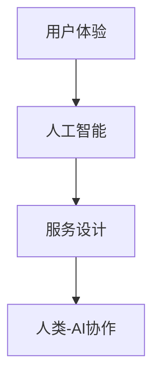

                 

关键词：人类-AI协作、服务设计、智能交互、用户体验、技术架构

> 摘要：本文将探讨人类与人工智能协作的设计原则与实践，通过深入剖析人工智能的核心算法、数学模型、项目实践和实际应用场景，探讨如何在为人类服务的设计中实现高效的AI与人类的协同工作。

## 1. 背景介绍

在当今科技飞速发展的时代，人工智能（AI）已经成为改变人类生活方式的重要力量。从智能家居、自动驾驶到医疗诊断、金融服务，AI正在不断渗透到我们生活的各个领域。然而，AI技术并非孤立存在，而是需要与人类用户紧密协作，以实现最优的服务效果。因此，如何设计一个能够让人类与AI高效协作的系统，成为了一个值得深入研究的问题。

本文旨在探讨人类与人工智能协作的设计原则与实践，通过分析人工智能的核心算法、数学模型、项目实践和实际应用场景，揭示AI服务设计的本质，为未来的智能交互提供有价值的参考。

## 2. 核心概念与联系

为了更好地理解人类与AI协作的设计原则，我们需要首先了解一些核心概念，并探讨它们之间的联系。

### 2.1 人工智能（AI）的概念

人工智能是指通过计算机程序实现智能行为的科学。它主要包括机器学习、深度学习、自然语言处理、计算机视觉等领域。

### 2.2 用户体验（UX）的概念

用户体验是指用户在使用产品或服务过程中所感受到的整体体验。它包括易用性、可访问性、情感体验等方面。

### 2.3 服务设计（SD）的概念

服务设计是指通过系统化和人性化的方法，将用户需求与服务功能相结合，以提供优质的服务体验。

### 2.4 核心概念之间的联系

人类与AI协作的设计原则需要综合考虑用户体验、人工智能和服务设计三个核心概念。用户体验决定了AI系统的易用性和用户满意度；人工智能提供了智能化的技术支持；服务设计则将用户体验和人工智能有机结合，形成一个完整的服务系统。以下是一个简化的Mermaid流程图，展示了这些概念之间的联系：



## 3. 核心算法原理 & 具体操作步骤

### 3.1 算法原理概述

人类与AI协作的核心算法主要包括机器学习和深度学习。这些算法通过分析大量数据，自动发现数据中的模式，并根据这些模式进行预测和决策。

### 3.2 算法步骤详解

- 数据收集：收集用户数据，包括用户行为、偏好、反馈等。
- 数据预处理：清洗数据，去除噪声和异常值，进行数据归一化等。
- 特征提取：从原始数据中提取有用信息，作为模型训练的输入。
- 模型训练：使用训练数据，训练机器学习或深度学习模型。
- 模型评估：使用测试数据，评估模型的性能，调整模型参数。
- 部署应用：将训练好的模型部署到实际应用场景，实现人类与AI的协作。

### 3.3 算法优缺点

- 优点：算法能够自动处理大量数据，提高工作效率；具有较好的泛化能力，能够适应不同的应用场景。
- 缺点：对数据质量和数量要求较高；模型的解释性较差，难以理解模型的决策过程。

### 3.4 算法应用领域

人类与AI协作算法可以应用于多个领域，包括但不限于：

- 智能客服：通过自然语言处理技术，实现人与机器之间的智能对话。
- 健康管理：通过计算机视觉和深度学习技术，实现对健康数据的实时监测和分析。
- 金融服务：通过机器学习算法，实现风险控制和投资决策。

## 4. 数学模型和公式 & 详细讲解 & 举例说明

### 4.1 数学模型构建

人类与AI协作的数学模型主要包括线性回归、逻辑回归、支持向量机等。以下是一个简单的线性回归模型构建过程：

$$
y = \beta_0 + \beta_1x_1 + \beta_2x_2 + ... + \beta_nx_n
$$

其中，$y$ 表示输出变量，$x_1, x_2, ..., x_n$ 表示输入变量，$\beta_0, \beta_1, ..., \beta_n$ 表示模型参数。

### 4.2 公式推导过程

线性回归模型的公式推导过程如下：

1. 假设数据集为 $D = \{(x_1, y_1), (x_2, y_2), ..., (x_n, y_n)\}$。
2. 定义损失函数为 $J(\theta) = \frac{1}{2m}\sum_{i=1}^{m}(h_\theta(x^{(i)}) - y^{(i)})^2$，其中 $h_\theta(x) = \theta_0 + \theta_1x_1 + \theta_2x_2 + ... + \theta_nx_n$。
3. 对损失函数求导，得到 $\frac{\partial J(\theta)}{\partial \theta_j} = \sum_{i=1}^{m}(h_\theta(x^{(i)}) - y^{(i)})x_j^{(i)}$。
4. 设置学习率为 $\alpha$，迭代更新参数 $\theta_j$：$\theta_j := \theta_j - \alpha\frac{\partial J(\theta)}{\partial \theta_j}$。

### 4.3 案例分析与讲解

假设我们想要预测一个人的年龄，输入变量包括身高、体重、性别等。以下是一个简单的线性回归模型：

$$
\hat{y} = \beta_0 + \beta_1x_1 + \beta_2x_2 + \beta_3x_3
$$

其中，$x_1$ 表示身高，$x_2$ 表示体重，$x_3$ 表示性别（0表示女性，1表示男性）。

通过训练数据集，我们可以得到模型参数 $\beta_0, \beta_1, \beta_2, \beta_3$。然后，我们可以使用这个模型预测新样本的年龄。例如，对于一个身高为 170cm、体重为 60kg、性别为男的人，其预测年龄为：

$$
\hat{y} = \beta_0 + \beta_1 \cdot 170 + \beta_2 \cdot 60 + \beta_3 \cdot 1
$$

## 5. 项目实践：代码实例和详细解释说明

### 5.1 开发环境搭建

在开始项目实践之前，我们需要搭建一个合适的开发环境。本文以Python为例，介绍开发环境搭建步骤：

1. 安装Python：在Python官方网站下载并安装Python 3.x版本。
2. 安装依赖库：使用pip命令安装必要的库，如NumPy、Pandas、scikit-learn等。

### 5.2 源代码详细实现

以下是一个简单的线性回归项目实现，用于预测一个人的年龄。

```python
import numpy as np
import pandas as pd
from sklearn.linear_model import LinearRegression

# 数据集加载
data = pd.read_csv('data.csv')
X = data[['身高', '体重', '性别']]
y = data['年龄']

# 模型训练
model = LinearRegression()
model.fit(X, y)

# 模型评估
score = model.score(X, y)
print('模型评分：', score)

# 预测新样本
new_data = pd.DataFrame([[170, 60, 1]], columns=['身高', '体重', '性别'])
predicted_age = model.predict(new_data)
print('预测年龄：', predicted_age)
```

### 5.3 代码解读与分析

1. 导入必要的库：首先，我们导入Python的NumPy、Pandas和scikit-learn库，用于数据处理和模型训练。
2. 数据集加载：使用Pandas库读取CSV文件，获取数据集。数据集包括身高、体重、性别和年龄四个特征。
3. 模型训练：使用scikit-learn库的LinearRegression类，创建线性回归模型，并使用fit方法进行训练。
4. 模型评估：使用score方法评估模型的准确率。
5. 预测新样本：使用predict方法预测新样本的年龄。

## 6. 实际应用场景

人类与AI协作在实际应用场景中具有广泛的应用。以下是一些典型的应用场景：

- 智能家居：通过智能传感器和AI算法，实现家电的智能控制，提高生活质量。
- 医疗诊断：通过计算机视觉和深度学习算法，辅助医生进行疾病诊断，提高诊断准确率。
- 金融服务：通过机器学习算法，实现风险控制和投资决策，提高金融服务的效率。

## 7. 工具和资源推荐

为了更好地进行人类与AI协作的设计，以下是一些推荐的学习资源和开发工具：

- 学习资源：
  - 《深度学习》（Goodfellow, Bengio, Courville）：介绍深度学习的理论和技术。
  - 《Python机器学习》（Sebastian Raschka）：介绍Python在机器学习领域的应用。
- 开发工具：
  - Jupyter Notebook：用于编写和运行Python代码。
  - TensorFlow：用于构建和训练深度学习模型。
  - scikit-learn：用于实现传统的机器学习算法。

## 8. 总结：未来发展趋势与挑战

随着人工智能技术的不断发展，人类与AI协作的设计将成为一个重要的研究方向。未来，我们有望看到以下发展趋势：

1. 智能化水平的不断提高：AI将更好地理解人类需求，提供个性化的服务。
2. 人机交互的进一步优化：通过自然语言处理和计算机视觉等技术，实现更加直观和便捷的交互方式。
3. 应用场景的广泛扩展：AI将在更多领域发挥重要作用，如教育、娱乐、交通等。

然而，人类与AI协作的设计也面临着一些挑战：

1. 数据隐私和安全问题：如何确保用户数据的安全和隐私，是一个亟待解决的问题。
2. AI伦理问题：如何确保AI系统的公平性、透明性和可解释性，是一个重要的伦理问题。
3. 技术人才短缺：随着AI技术的发展，对相关人才的需求也越来越大，如何培养和引进高素质的技术人才是一个挑战。

总之，人类与AI协作的设计是一个充满机遇和挑战的领域，我们需要不断探索和改进，以实现更加高效的AI与人类的协同工作。

## 9. 附录：常见问题与解答

### 问题1：如何处理用户隐私问题？

解答：在人类与AI协作的设计中，保护用户隐私是非常重要的。为了确保用户隐私，我们可以采取以下措施：

1. 数据匿名化：对用户数据进行匿名化处理，去除可直接识别用户身份的信息。
2. 数据加密：对传输和存储的数据进行加密，防止数据泄露。
3. 用户授权：确保用户在使用服务时，明确了解自己的数据将被如何使用，并得到用户的授权。

### 问题2：如何确保AI系统的公平性和透明性？

解答：确保AI系统的公平性和透明性是AI伦理问题的重要组成部分。以下是一些措施：

1. 模型训练数据：确保模型训练数据具有多样性和代表性，避免数据偏差。
2. 模型可解释性：开发可解释的AI模型，使得用户可以理解模型的决策过程。
3. 持续监督：对AI系统进行持续监督和评估，及时发现和纠正不公平的行为。

### 问题3：如何培养AI技术人才？

解答：为了培养AI技术人才，可以采取以下措施：

1. 教育培训：在高校和职业培训机构开设AI相关课程，培养专业人才。
2. 在职培训：为在职员工提供AI相关培训，提升其技能水平。
3. 国际合作：与国际知名机构合作，引进优秀的教学资源和师资力量。

作者：禅与计算机程序设计艺术 / Zen and the Art of Computer Programming

[END]

