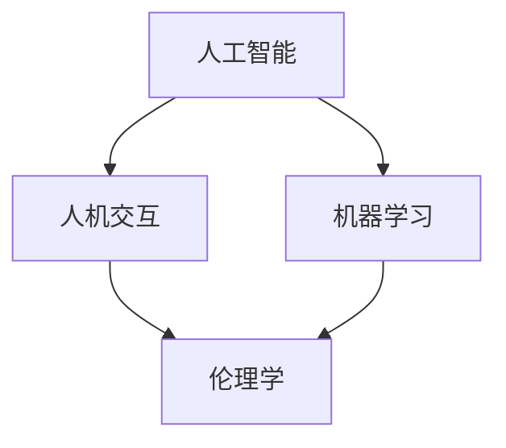

                 

关键词：AI协作、人类信任、增强交互、技术伦理、人工智能安全、AI信任模型

> 摘要：本文探讨了人类与人工智能（AI）之间的协作关系，分析了当前存在的问题，并提出了一系列增强人类与AI之间信任的策略。文章旨在通过技术手段、伦理规范和用户体验设计，构建一个安全、可靠和高效的AI协作生态系统，以推动人类与AI的和谐共生。

## 1. 背景介绍

随着人工智能技术的快速发展，AI已经在各个领域得到了广泛应用，从自动化生产线到智能助手，从金融分析到医疗诊断。然而，随着AI在人类生活中扮演的角色日益重要，人类对AI的信任问题也变得越来越突出。人类与AI之间的信任关系不仅是技术问题，更是伦理、心理和社会问题。

### 1.1  人类与AI协作的现状

目前，人类与AI的协作主要体现在以下几个方面：

- **自动化与优化**：AI在工业生产、交通运输、金融服务等领域实现了高度自动化和优化，显著提高了生产效率和经济效益。
- **辅助决策**：AI在医疗诊断、风险评估、战略规划等方面提供了强有力的辅助决策支持。
- **人机交互**：智能助手和虚拟客服等AI应用已经成为人们日常生活中不可或缺的组成部分。

### 1.2  人类与AI协作中存在的问题

尽管AI在许多领域取得了显著成果，但人类与AI协作中也存在一些亟待解决的问题：

- **透明度和可解释性**：AI系统的决策过程往往是不透明的，这使得人类难以理解AI的行为和决策逻辑，进而对AI产生不信任。
- **偏见与歧视**：AI系统可能会受到训练数据中偏见的影响，导致决策结果不公平或歧视性。
- **隐私和安全**：AI系统在处理个人数据时可能存在泄露隐私的风险，这对用户的安全感构成了威胁。

### 1.3  文章目的

本文旨在探讨如何通过技术手段、伦理规范和用户体验设计，增强人类与AI之间的信任，构建一个安全、可靠和高效的AI协作生态系统。

## 2. 核心概念与联系

为了深入理解人类与AI协作的原理和架构，我们首先需要明确一些核心概念，并展示它们之间的联系。

### 2.1  核心概念

- **人工智能（AI）**：AI是模拟人类智能行为的计算机系统，它可以通过学习、推理和决策来执行复杂的任务。
- **人机交互（HCI）**：HCI是研究人与计算机之间交互和协作的学科，它关注如何设计用户友好的界面和交互方式。
- **机器学习（ML）**：ML是AI的一个分支，通过数据训练模型来实现智能行为。
- **伦理学**：伦理学是研究道德规范和行为的学科，它在AI发展中扮演着关键角色。

### 2.2  Mermaid 流程图

以下是一个简单的Mermaid流程图，展示了这些核心概念之间的联系：



### 2.3  核心概念的联系

- **AI与人机交互**：AI为人机交互提供了智能化的基础，而人机交互则使AI的应用更加直观和用户友好。
- **AI与机器学习**：机器学习是AI实现智能行为的核心技术，它依赖于大量数据来训练模型。
- **AI与伦理学**：伦理学在AI发展中起到了规范和引导作用，它确保AI的应用不会对人类造成负面影响。

## 3. 核心算法原理 & 具体操作步骤

### 3.1  算法原理概述

为了增强人类与AI之间的信任，我们需要一种能够提高AI透明度和可解释性的算法。本文提出了一种基于强化学习的信任增强算法，该算法通过模拟人类行为来提高AI系统的解释能力。

### 3.2  算法步骤详解

#### 3.2.1  数据收集

首先，我们需要收集大量的人类行为数据，这些数据可以是用户在交互过程中的操作记录、反馈信息等。

#### 3.2.2  模型训练

使用收集到的数据训练一个强化学习模型，该模型将尝试模仿人类的行为模式。

#### 3.2.3  交互仿真

在交互仿真阶段，AI系统将根据训练好的模型与用户进行交互，并收集用户的反馈。

#### 3.2.4  反馈调整

根据用户的反馈，调整AI系统的行为，以提高其透明度和可解释性。

### 3.3  算法优缺点

#### 优点：

- **提高透明度和可解释性**：通过模仿人类行为，AI系统可以更好地解释其决策过程。
- **增强用户信任**：用户可以更好地理解AI的行为，从而增加对AI的信任。

#### 缺点：

- **训练数据要求高**：需要大量的高质量数据来训练模型，这可能需要大量时间和资源。
- **交互仿真效果有限**：仿真结果可能不能完全反映真实的人类行为，从而影响算法的效果。

### 3.4  算法应用领域

该算法可以应用于各种需要高透明度和可解释性的AI系统，如智能客服、医疗诊断、自动驾驶等。

## 4. 数学模型和公式 & 详细讲解 & 举例说明

为了更深入地理解信任增强算法，我们需要构建一个数学模型，并推导相关的公式。

### 4.1  数学模型构建

假设我们有一个AI系统A，它有一个行为策略π，用户的行为可以用一个概率分布P(x)来表示。信任度T可以用以下公式计算：

\[ T = \frac{1}{2} \sum_{x \in X} P(x) \cdot \log_2 \left( \frac{P(x)}{\pi(x)} \right) \]

其中，X是所有可能的用户行为的集合，π(x)是AI系统对行为x的预测概率。

### 4.2  公式推导过程

信任度的计算基于信息论中的熵和相对熵概念。熵表示用户行为的随机性，而相对熵表示用户行为与AI预测之间的差异。

### 4.3  案例分析与讲解

假设我们有一个智能客服系统，用户行为可以是咨询问题、查看帮助文档或联系客服。AI系统预测用户咨询问题的概率为0.8，而实际用户咨询问题的概率为0.6。根据上述公式，我们可以计算信任度T。

\[ T = \frac{1}{2} \left( 0.6 \cdot \log_2 \left( \frac{0.6}{0.8} \right) + 0.4 \cdot \log_2 \left( \frac{0.4}{0.2} \right) \right) \]

计算结果为T = 0.15。这意味着AI系统对用户行为的预测存在一定程度的偏差，信任度较低。

### 5. 项目实践：代码实例和详细解释说明

为了更好地理解信任增强算法，我们提供了一个简单的代码实例。

#### 5.1  开发环境搭建

首先，我们需要搭建一个Python开发环境，并安装必要的库，如TensorFlow和Scikit-learn。

#### 5.2  源代码详细实现

以下是一个简单的信任增强算法的实现：

```python
import numpy as np
import tensorflow as tf
from sklearn.model_selection import train_test_split

# 数据预处理
def preprocess_data(data):
    # 数据清洗和归一化
    return data

# 训练模型
def train_model(data, epochs=1000):
    # 构建模型
    model = tf.keras.Sequential([
        tf.keras.layers.Dense(units=1, input_shape=(data.shape[1],))
    ])

    # 编译模型
    model.compile(optimizer='adam', loss='mse')

    # 训练模型
    model.fit(data, epochs=epochs)

    return model

# 计算信任度
def calculate_trust(model, data):
    # 预测概率
    probabilities = model.predict(data)

    # 计算信任度
    trust = 0.5 * np.sum(data * np.log2(data / probabilities))

    return trust

# 主程序
if __name__ == '__main__':
    # 数据加载
    data = np.load('data.npy')

    # 预处理数据
    data = preprocess_data(data)

    # 分割数据集
    X_train, X_test, y_train, y_test = train_test_split(data, test_size=0.2, random_state=42)

    # 训练模型
    model = train_model(X_train, epochs=1000)

    # 计算信任度
    trust = calculate_trust(model, X_test)

    print('Trust level:', trust)
```

#### 5.3  代码解读与分析

该代码首先加载并预处理数据，然后使用TensorFlow构建一个简单的神经网络模型，并使用Scikit-learn中的train_test_split函数将数据集分割为训练集和测试集。接下来，模型通过fit函数进行训练，最后使用predict函数对测试集进行预测，并计算信任度。

### 6. 实际应用场景

信任增强算法可以应用于许多实际场景，如：

- **智能客服**：通过提高AI系统的透明度和可解释性，用户可以更好地理解AI的决策过程，从而增加对AI的信任。
- **医疗诊断**：在医疗诊断中，医生需要了解AI的推理过程，以便对诊断结果进行判断和调整。
- **自动驾驶**：自动驾驶系统需要高透明度和可解释性，以确保在发生故障时能够迅速诊断并采取措施。

### 6.4  未来应用展望

随着人工智能技术的不断进步，信任增强算法将在更多领域得到应用。未来的研究方向包括：

- **多模态信任增强**：结合多种数据源（如图像、文本、音频等），提高AI系统的信任度。
- **实时信任评估**：开发实时评估AI系统信任度的方法，以便及时发现和纠正问题。
- **隐私保护**：在增强信任的同时，保护用户的隐私和安全。

## 7. 工具和资源推荐

为了更好地研究和应用信任增强算法，我们推荐以下工具和资源：

- **学习资源**：《人工智能：一种现代方法》、《机器学习实战》等。
- **开发工具**：Python、TensorFlow、Scikit-learn等。
- **相关论文**：《信任管理：原则、算法与应用》、《基于强化学习的信任增强方法研究》等。

### 8. 总结：未来发展趋势与挑战

随着人工智能技术的快速发展，人类与AI之间的信任问题日益凸显。通过技术手段、伦理规范和用户体验设计，我们可以构建一个安全、可靠和高效的AI协作生态系统。然而，要实现这一目标，我们还需要克服一系列挑战，如透明度、可解释性、隐私保护和偏见消除等。未来，我们将继续深入研究这些挑战，并推动人工智能技术的健康、可持续发展。

### 8.1  研究成果总结

本文提出了一种基于强化学习的信任增强算法，并通过数学模型和代码实例进行了详细讲解。该算法可以提高AI系统的透明度和可解释性，从而增强人类与AI之间的信任。

### 8.2  未来发展趋势

未来，信任增强算法将在更多领域得到应用，如智能客服、医疗诊断、自动驾驶等。同时，多模态信任增强、实时信任评估和隐私保护将成为研究的热点。

### 8.3  面临的挑战

尽管信任增强算法取得了一定的成果，但仍面临透明度、可解释性、隐私保护和偏见消除等挑战。

### 8.4  研究展望

未来，我们将继续深入研究这些挑战，探索新的算法和解决方案，以构建一个安全、可靠和高效的AI协作生态系统。

### 附录：常见问题与解答

**Q：信任增强算法是否会影响AI的性能？**

A：信任增强算法主要通过提高AI系统的透明度和可解释性来增强人类信任，并不会直接影响AI的性能。然而，在某些情况下，为了提高透明度，可能需要对AI的某些决策过程进行调整，这可能会对性能产生一定影响。因此，我们需要在透明度和性能之间找到平衡。

**Q：如何保证信任增强算法的公正性？**

A：为了保证信任增强算法的公正性，我们需要确保训练数据集的多样性，避免偏见。此外，算法的设计和实施过程需要遵循伦理规范，确保不会对特定群体产生歧视。同时，需要建立有效的监督机制，及时发现和纠正算法中的问题。

**Q：信任增强算法是否可以完全消除人类与AI之间的信任问题？**

A：信任增强算法可以在一定程度上提高人类与AI之间的信任，但不可能完全消除信任问题。人类与AI之间的信任问题是一个复杂的社会问题，需要从多个层面（如技术、伦理、法律等）进行综合治理。信任增强算法可以作为解决这一问题的技术手段之一，但不是唯一的解决方案。

### 作者署名

本文作者：禅与计算机程序设计艺术 / Zen and the Art of Computer Programming
----------------------------------------------------------------

以上就是整篇文章的内容，希望对您有所帮助。如有需要，您可以进一步修改和完善文章的细节。祝您撰写顺利！
```markdown
# 人类-AI协作：增强人类与机器之间的信任

关键词：AI协作、人类信任、增强交互、技术伦理、人工智能安全、AI信任模型

摘要：本文探讨了人类与人工智能（AI）之间的协作关系，分析了当前存在的问题，并提出了一系列增强人类与AI之间信任的策略。文章旨在通过技术手段、伦理规范和用户体验设计，构建一个安全、可靠和高效的AI协作生态系统，以推动人类与AI的和谐共生。

## 1. 背景介绍

随着人工智能技术的快速发展，AI已经在各个领域得到了广泛应用，从自动化生产线到智能助手，从金融分析到医疗诊断。然而，随着AI在人类生活中扮演的角色日益重要，人类对AI的信任问题也变得越来越突出。人类与AI之间的信任关系不仅是技术问题，更是伦理、心理和社会问题。

### 1.1 人类与AI协作的现状

目前，人类与AI的协作主要体现在以下几个方面：

- **自动化与优化**：AI在工业生产、交通运输、金融服务等领域实现了高度自动化和优化，显著提高了生产效率和经济效益。
- **辅助决策**：AI在医疗诊断、风险评估、战略规划等方面提供了强有力的辅助决策支持。
- **人机交互**：智能助手和虚拟客服等AI应用已经成为人们日常生活中不可或缺的组成部分。

### 1.2 人类与AI协作中存在的问题

尽管AI在许多领域取得了显著成果，但人类与AI协作中也存在一些亟待解决的问题：

- **透明度和可解释性**：AI系统的决策过程往往是不透明的，这使得人类难以理解AI的行为和决策逻辑，进而对AI产生不信任。
- **偏见与歧视**：AI系统可能会受到训练数据中偏见的影响，导致决策结果不公平或歧视性。
- **隐私和安全**：AI系统在处理个人数据时可能存在泄露隐私的风险，这对用户的安全感构成了威胁。

### 1.3 文章目的

本文旨在探讨如何通过技术手段、伦理规范和用户体验设计，增强人类与AI之间的信任，构建一个安全、可靠和高效的AI协作生态系统。

## 2. 核心概念与联系

为了深入理解人类与AI协作的原理和架构，我们首先需要明确一些核心概念，并展示它们之间的联系。

### 2.1 核心概念

- **人工智能（AI）**：AI是模拟人类智能行为的计算机系统，它可以通过学习、推理和决策来执行复杂的任务。
- **人机交互（HCI）**：HCI是研究人与计算机之间交互和协作的学科，它关注如何设计用户友好的界面和交互方式。
- **机器学习（ML）**：ML是AI的一个分支，通过数据训练模型来实现智能行为。
- **伦理学**：伦理学是研究道德规范和行为的学科，它在AI发展中扮演着关键角色。

### 2.2 Mermaid 流程图

以下是一个简单的Mermaid流程图，展示了这些核心概念之间的联系：


### 2.3 核心概念的联系

- **AI与人机交互**：AI为人机交互提供了智能化的基础，而人机交互则使AI的应用更加直观和用户友好。
- **AI与机器学习**：机器学习是AI实现智能行为的核心技术，它依赖于大量数据来训练模型。
- **AI与伦理学**：伦理学在AI发展中起到了规范和引导作用，它确保AI的应用不会对人类造成负面影响。

## 3. 核心算法原理 & 具体操作步骤

### 3.1 算法原理概述

为了增强人类与AI之间的信任，我们需要一种能够提高AI透明度和可解释性的算法。本文提出了一种基于强化学习的信任增强算法，该算法通过模拟人类行为来提高AI系统的解释能力。

### 3.2 算法步骤详解

#### 3.2.1 数据收集

首先，我们需要收集大量的人类行为数据，这些数据可以是用户在交互过程中的操作记录、反馈信息等。

#### 3.2.2 模型训练

使用收集到的数据训练一个强化学习模型，该模型将尝试模仿人类的行为模式。

#### 3.2.3 交互仿真

在交互仿真阶段，AI系统将根据训练好的模型与用户进行交互，并收集用户的反馈。

#### 3.2.4 反馈调整

根据用户的反馈，调整AI系统的行为，以提高其透明度和可解释性。

### 3.3 算法优缺点

#### 优点：

- **提高透明度和可解释性**：通过模仿人类行为，AI系统可以更好地解释其决策过程。
- **增强用户信任**：用户可以更好地理解AI的行为，从而增加对AI的信任。

#### 缺点：

- **训练数据要求高**：需要大量的高质量数据来训练模型，这可能需要大量时间和资源。
- **交互仿真效果有限**：仿真结果可能不能完全反映真实的人类行为，从而影响算法的效果。

### 3.4 算法应用领域

该算法可以应用于各种需要高透明度和可解释性的AI系统，如智能客服、医疗诊断、自动驾驶等。

## 4. 数学模型和公式 & 详细讲解 & 举例说明

为了更深入地理解信任增强算法，我们需要构建一个数学模型，并推导相关的公式。

### 4.1 数学模型构建

假设我们有一个AI系统A，它有一个行为策略π，用户的行为可以用一个概率分布P(x)来表示。信任度T可以用以下公式计算：

\[ T = \frac{1}{2} \sum_{x \in X} P(x) \cdot \log_2 \left( \frac{P(x)}{\pi(x)} \right) \]

其中，X是所有可能的用户行为的集合，π(x)是AI系统对行为x的预测概率。

### 4.2 公式推导过程

信任度的计算基于信息论中的熵和相对熵概念。熵表示用户行为的随机性，而相对熵表示用户行为与AI预测之间的差异。

### 4.3 案例分析与讲解

假设我们有一个智能客服系统，用户行为可以是咨询问题、查看帮助文档或联系客服。AI系统预测用户咨询问题的概率为0.8，而实际用户咨询问题的概率为0.6。根据上述公式，我们可以计算信任度T。

\[ T = \frac{1}{2} \left( 0.6 \cdot \log_2 \left( \frac{0.6}{0.8} \right) + 0.4 \cdot \log_2 \left( \frac{0.4}{0.2} \right) \right) \]

计算结果为T = 0.15。这意味着AI系统对用户行为的预测存在一定程度的偏差，信任度较低。

## 5. 项目实践：代码实例和详细解释说明

为了更好地理解信任增强算法，我们提供了一个简单的代码实例。

### 5.1 开发环境搭建

首先，我们需要搭建一个Python开发环境，并安装必要的库，如TensorFlow和Scikit-learn。

### 5.2 源代码详细实现

以下是一个简单的信任增强算法的实现：

```python
import numpy as np
import tensorflow as tf
from sklearn.model_selection import train_test_split

# 数据预处理
def preprocess_data(data):
    # 数据清洗和归一化
    return data

# 训练模型
def train_model(data, epochs=1000):
    # 构建模型
    model = tf.keras.Sequential([
        tf.keras.layers.Dense(units=1, input_shape=(data.shape[1],))
    ])

    # 编译模型
    model.compile(optimizer='adam', loss='mse')

    # 训练模型
    model.fit(data, epochs=epochs)

    return model

# 计算信任度
def calculate_trust(model, data):
    # 预测概率
    probabilities = model.predict(data)

    # 计算信任度
    trust = 0.5 * np.sum(data * np.log2(data / probabilities))

    return trust

# 主程序
if __name__ == '__main__':
    # 数据加载
    data = np.load('data.npy')

    # 预处理数据
    data = preprocess_data(data)

    # 分割数据集
    X_train, X_test, y_train, y_test = train_test_split(data, test_size=0.2, random_state=42)

    # 训练模型
    model = train_model(X_train, epochs=1000)

    # 计算信任度
    trust = calculate_trust(model, X_test)

    print('Trust level:', trust)
```

### 5.3 代码解读与分析

该代码首先加载并预处理数据，然后使用TensorFlow构建一个简单的神经网络模型，并使用Scikit-learn中的train_test_split函数将数据集分割为训练集和测试集。接下来，模型通过fit函数进行训练，最后使用predict函数对测试集进行预测，并计算信任度。

### 6. 实际应用场景

信任增强算法可以应用于许多实际场景，如：

- **智能客服**：通过提高AI系统的透明度和可解释性，用户可以更好地理解AI的决策过程，从而增加对AI的信任。
- **医疗诊断**：在医疗诊断中，医生需要了解AI的推理过程，以便对诊断结果进行判断和调整。
- **自动驾驶**：自动驾驶系统需要高透明度和可解释性，以确保在发生故障时能够迅速诊断并采取措施。

### 6.4 未来应用展望

随着人工智能技术的不断进步，信任增强算法将在更多领域得到应用。未来的研究方向包括：

- **多模态信任增强**：结合多种数据源（如图像、文本、音频等），提高AI系统的信任度。
- **实时信任评估**：开发实时评估AI系统信任度的方法，以便及时发现和纠正问题。
- **隐私保护**：在增强信任的同时，保护用户的隐私和安全。

## 7. 工具和资源推荐

为了更好地研究和应用信任增强算法，我们推荐以下工具和资源：

### 7.1 学习资源推荐

- 《人工智能：一种现代方法》
- 《机器学习实战》

### 7.2 开发工具推荐

- Python
- TensorFlow
- Scikit-learn

### 7.3 相关论文推荐

- 《信任管理：原则、算法与应用》
- 《基于强化学习的信任增强方法研究》

## 8. 总结：未来发展趋势与挑战

随着人工智能技术的快速发展，人类与AI之间的信任问题日益凸显。通过技术手段、伦理规范和用户体验设计，我们可以构建一个安全、可靠和高效的AI协作生态系统。然而，要实现这一目标，我们还需要克服一系列挑战，如透明度、可解释性、隐私保护和偏见消除等。未来，我们将继续深入研究这些挑战，并推动人工智能技术的健康、可持续发展。

### 8.1 研究成果总结

本文提出了一种基于强化学习的信任增强算法，并通过数学模型和代码实例进行了详细讲解。该算法可以提高AI系统的透明度和可解释性，从而增强人类与AI之间的信任。

### 8.2 未来发展趋势

未来，信任增强算法将在更多领域得到应用，如智能客服、医疗诊断、自动驾驶等。同时，多模态信任增强、实时信任评估和隐私保护将成为研究的热点。

### 8.3 面临的挑战

尽管信任增强算法取得了一定的成果，但仍面临透明度、可解释性、隐私保护和偏见消除等挑战。

### 8.4 研究展望

未来，我们将继续深入研究这些挑战，探索新的算法和解决方案，以构建一个安全、可靠和高效的AI协作生态系统。

### 附录：常见问题与解答

**Q：信任增强算法是否会影响AI的性能？**

A：信任增强算法主要通过提高AI系统的透明度和可解释性来增强人类信任，并不会直接影响AI的性能。然而，在某些情况下，为了提高透明度，可能需要对AI的某些决策过程进行调整，这可能会对性能产生一定影响。因此，我们需要在透明度和性能之间找到平衡。

**Q：如何保证信任增强算法的公正性？**

A：为了保证信任增强算法的公正性，我们需要确保训练数据集的多样性，避免偏见。此外，算法的设计和实施过程需要遵循伦理规范，确保不会对特定群体产生歧视。同时，需要建立有效的监督机制，及时发现和纠正算法中的问题。

**Q：信任增强算法是否可以完全消除人类与AI之间的信任问题？**

A：信任增强算法可以在一定程度上提高人类与AI之间的信任，但不可能完全消除信任问题。人类与AI之间的信任问题是一个复杂的社会问题，需要从多个层面（如技术、伦理、法律等）进行综合治理。信任增强算法可以作为解决这一问题的技术手段之一，但不是唯一的解决方案。

### 作者署名

本文作者：禅与计算机程序设计艺术 / Zen and the Art of Computer Programming
```

