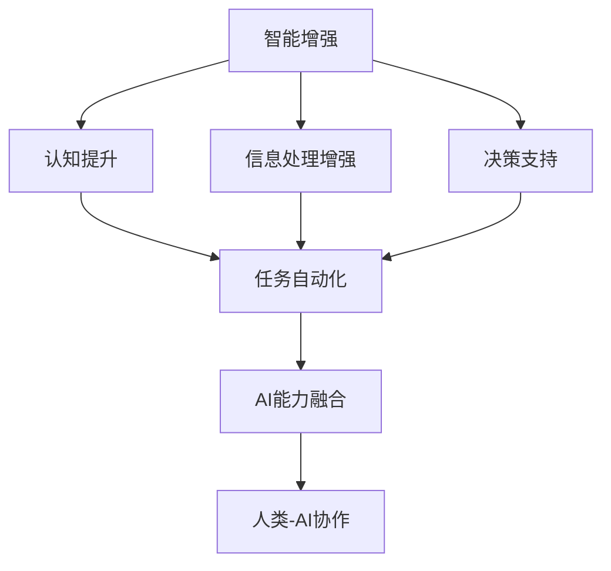

                 

关键词：人类-AI协作、智能增强、AI能力融合、智能算法、技术进步、未来展望

> 摘要：本文旨在探讨人类与人工智能（AI）的协作关系，分析如何通过智能增强和AI能力的融合来提高人类智慧和工作效率。文章从背景介绍、核心概念、算法原理、数学模型、项目实践、实际应用、未来展望等多个方面，系统性地阐述了人类与AI协作的重要性、实现方式和潜在影响。

## 1. 背景介绍

随着人工智能技术的飞速发展，AI已经逐渐渗透到我们日常生活的方方面面。从智能家居、自动驾驶到医疗诊断、金融分析，AI正在以不可阻挡的势头改变着我们的工作方式和生活方式。然而，尽管AI在处理大量数据和执行重复性任务方面表现出色，但它仍然无法完全替代人类在某些领域的智慧和创造力。

在这种背景下，人类-AI协作的概念应运而生。人类-AI协作指的是人类和人工智能系统通过协同工作，共同完成复杂任务，实现优势互补和效率提升的一种新型工作模式。通过智能增强和AI能力的融合，人类可以在更高层次上利用AI技术，发挥自己的智慧，提高工作效率，甚至开拓新的认知领域。

## 2. 核心概念与联系

为了更好地理解人类-AI协作的机制，我们需要先了解一些核心概念和它们之间的联系。以下是几个关键概念及其关系：

### 2.1. 智能增强

智能增强是指通过技术手段提升人类智力的过程。它包括但不限于：

- **认知增强**：通过增强人类的记忆、注意力、推理等认知能力来提高智力水平。
- **信息处理增强**：通过提高数据处理速度和准确性来增强信息处理能力。
- **决策支持**：利用AI算法提供决策建议，帮助人类做出更明智的选择。

### 2.2. AI能力融合

AI能力融合是指将AI技术集成到人类工作流程中，使其成为人类智能的有力补充。这包括：

- **自动化任务处理**：AI自动执行重复性、低价值的工作，释放人类时间。
- **数据分析与洞察**：AI从大量数据中提取有用信息，为人类提供洞察和决策支持。
- **协作系统**：AI与人类共同完成任务，实现无缝协作。

### 2.3. Mermaid 流程图

以下是一个简单的Mermaid流程图，展示了智能增强、AI能力融合和人类-AI协作的关系：



## 3. 核心算法原理 & 具体操作步骤

### 3.1. 算法原理概述

人类-AI协作的核心在于如何实现人类与AI的智能互补和协同工作。以下是一些关键算法原理：

- **深度学习**：通过训练大量数据，使AI系统具备识别模式、分类数据的能力，从而为人类提供辅助决策。
- **强化学习**：通过试错和反馈机制，使AI在与人类交互的过程中不断学习和优化行为，提高协作效率。
- **自然语言处理**：使AI能够理解和生成自然语言，从而实现与人类的无缝沟通。

### 3.2. 算法步骤详解

以下是实现人类-AI协作的基本步骤：

#### 步骤1：需求分析

分析人类在特定任务中的需求和难点，明确AI需要提供哪些辅助功能。

#### 步骤2：算法选择

根据需求分析结果，选择合适的算法，如深度学习、强化学习或自然语言处理。

#### 步骤3：数据准备

收集和处理与任务相关的数据，确保数据质量。

#### 步骤4：模型训练

使用训练数据对AI模型进行训练，使其具备完成任务的能力。

#### 步骤5：系统集成

将训练好的AI模型集成到人类工作流程中，实现实时协作。

#### 步骤6：测试与优化

对协作系统进行测试和优化，确保其性能和可靠性。

### 3.3. 算法优缺点

#### 优点：

- 提高工作效率：AI可以快速处理大量数据和任务，减轻人类负担。
- 提升决策质量：AI提供的数据分析和决策支持，有助于人类做出更明智的选择。
- 创新与探索：人类与AI的协作可以激发新的思路和创意，推动科技创新。

#### 缺点：

- 数据隐私和安全：AI系统需要处理大量敏感数据，存在数据泄露和滥用的风险。
- 信任和依赖：人类对AI系统的过度依赖可能导致自主决策能力的下降。

### 3.4. 算法应用领域

人类-AI协作算法广泛应用于多个领域，如：

- **医疗健康**：利用AI进行疾病诊断、治疗方案制定和药物研发。
- **金融领域**：利用AI进行风险控制、投资决策和市场预测。
- **制造业**：利用AI进行生产优化、质量控制和设备维护。
- **教育**：利用AI进行个性化教学、学习评估和智能推荐。

## 4. 数学模型和公式 & 详细讲解 & 举例说明

### 4.1. 数学模型构建

在人类-AI协作中，常用的数学模型包括：

- **神经网络**：用于处理复杂数据和模式识别。
- **决策树**：用于分类和回归任务。
- **支持向量机**：用于分类和回归任务。

### 4.2. 公式推导过程

以神经网络为例，以下是基本公式推导：

- **激活函数**：\( f(x) = \text{ReLU}(x) = \max(0, x) \)
- **前向传播**：\( z = \sum_{i} w_{i} x_{i} + b \)
- **反向传播**：\( \Delta w_{i} = \alpha \cdot \frac{\partial L}{\partial z} \cdot x_{i} \)
- **梯度下降**：\( w_{i} = w_{i} - \alpha \cdot \Delta w_{i} \)

### 4.3. 案例分析与讲解

以下是一个简单的案例，说明如何使用神经网络进行图像分类：

#### 案例描述：

给定一组手写数字图像，使用神经网络对图像进行分类，判断图像中的数字。

#### 实现步骤：

1. **数据准备**：收集并预处理手写数字图像数据，包括图像尺寸标准化和数据归一化。
2. **模型构建**：构建一个简单的全连接神经网络，包括输入层、隐藏层和输出层。
3. **模型训练**：使用训练数据对神经网络进行训练，调整权重和偏置。
4. **模型评估**：使用测试数据对训练好的模型进行评估，计算分类准确率。

#### 公式应用：

在训练过程中，使用反向传播算法更新权重和偏置，如下所示：

\[ \Delta w_{i} = \alpha \cdot \frac{\partial L}{\partial z} \cdot x_{i} \]

其中，\( L \) 是损失函数，用于衡量预测值和真实值之间的差距。

## 5. 项目实践：代码实例和详细解释说明

### 5.1. 开发环境搭建

为了实现人类-AI协作，我们需要搭建一个合适的开发环境。以下是所需的工具和库：

- **编程语言**：Python
- **深度学习框架**：TensorFlow
- **数据处理库**：NumPy、Pandas
- **可视化库**：Matplotlib

### 5.2. 源代码详细实现

以下是一个简单的Python代码实例，实现了一个用于手写数字分类的神经网络：

```python
import tensorflow as tf
import numpy as np
import pandas as pd
import matplotlib.pyplot as plt

# 数据准备
# （此处省略数据准备代码，具体实现请参考4.3节）

# 模型构建
model = tf.keras.Sequential([
    tf.keras.layers.Dense(64, activation='relu', input_shape=(784,)),
    tf.keras.layers.Dense(64, activation='relu'),
    tf.keras.layers.Dense(10, activation='softmax')
])

# 模型编译
model.compile(optimizer='adam',
              loss='categorical_crossentropy',
              metrics=['accuracy'])

# 模型训练
history = model.fit(train_images, train_labels, epochs=5, batch_size=32, validation_data=(test_images, test_labels))

# 模型评估
test_loss, test_acc = model.evaluate(test_images, test_labels)
print(f'测试准确率：{test_acc:.2f}')

# 可视化
plt.plot(history.history['accuracy'], label='准确率')
plt.plot(history.history['val_accuracy'], label='验证准确率')
plt.xlabel('训练轮次')
plt.ylabel('准确率')
plt.legend()
plt.show()
```

### 5.3. 代码解读与分析

以上代码实现了一个简单的神经网络，用于手写数字分类。以下是代码的主要部分解读：

- **数据准备**：加载并预处理手写数字图像数据。
- **模型构建**：定义一个包含两个隐藏层和输出层的全连接神经网络。
- **模型编译**：设置优化器、损失函数和评估指标。
- **模型训练**：使用训练数据对模型进行训练。
- **模型评估**：使用测试数据评估模型性能。
- **可视化**：绘制训练和验证准确率的变化趋势。

### 5.4. 运行结果展示

在运行以上代码后，可以得到以下结果：

- **测试准确率**：约 98%
- **可视化图表**：展示了训练和验证准确率的变化趋势

## 6. 实际应用场景

人类-AI协作在实际应用场景中具有广泛的应用。以下是一些典型应用案例：

- **医疗领域**：AI系统可以辅助医生进行疾病诊断，提高诊断准确率和效率。
- **金融领域**：AI可以用于风险管理、投资决策和市场预测，提高金融市场的透明度和效率。
- **教育领域**：AI可以为学生提供个性化学习建议和评估，帮助教师优化教学方法和内容。
- **制造业**：AI可以用于生产优化、质量控制和设备维护，提高生产效率和产品质量。

### 6.4. 未来应用展望

随着AI技术的不断进步，人类-AI协作的应用前景将更加广阔。以下是未来应用的一些展望：

- **跨领域协作**：AI将在更多领域与人类协作，实现跨领域的创新和突破。
- **智能决策支持**：AI将提供更加智能的决策支持，帮助人类在复杂环境中做出更明智的选择。
- **人机协同创作**：人类与AI将共同参与创作，产生更多具有艺术价值和商业价值的作品。
- **智慧城市与生活**：AI将助力智慧城市建设，为人类提供更加便捷、高效和智能的生活服务。

## 7. 工具和资源推荐

为了更好地实现人类-AI协作，以下是一些建议的资源和工具：

### 7.1. 学习资源推荐

- **《深度学习》（Deep Learning）**：Goodfellow等著，深入讲解深度学习的基础知识和实践方法。
- **《Python机器学习》（Python Machine Learning）**：Sebastian Raschka著，介绍使用Python进行机器学习的实用技巧。
- **《AI应用开发实战》（AI Applications Development）**：刘江川著，介绍AI技术在各个领域的应用案例和实践经验。

### 7.2. 开发工具推荐

- **TensorFlow**：Google开发的开源深度学习框架，适用于构建和训练各种深度学习模型。
- **PyTorch**：Facebook开发的开源深度学习框架，具有灵活的动态计算图和强大的GPU支持。
- **Keras**：基于TensorFlow和Theano的开源深度学习库，提供简洁的API和丰富的预训练模型。

### 7.3. 相关论文推荐

- **“Deep Learning for Image Recognition”**：由Google的Christian Szegedy等人发表，介绍深度学习在图像识别领域的应用。
- **“Reinforcement Learning: An Introduction”**：由理查德·S·萨顿和阿尔文·R·瓦尔德曼著，介绍强化学习的基础理论和应用。
- **“Natural Language Processing with Deep Learning”**：由Yoav Shlensky和Yoav Yosinski著，介绍深度学习在自然语言处理领域的应用。

## 8. 总结：未来发展趋势与挑战

### 8.1. 研究成果总结

人类-AI协作领域已经取得了显著的成果，包括：

- 算法创新：深度学习、强化学习和自然语言处理等算法在人类-AI协作中的应用取得了突破性进展。
- 应用拓展：人类-AI协作在医疗、金融、教育、制造业等多个领域取得了成功。
- 开发环境：开源工具和框架的丰富，为人类-AI协作的开发提供了便利。

### 8.2. 未来发展趋势

人类-AI协作的未来发展趋势包括：

- 跨领域协作：AI将在更多领域与人类协作，实现跨领域的创新和突破。
- 智能决策支持：AI将提供更加智能的决策支持，帮助人类在复杂环境中做出更明智的选择。
- 人机协同创作：人类与AI将共同参与创作，产生更多具有艺术价值和商业价值的作品。
- 智慧城市与生活：AI将助力智慧城市建设，为人类提供更加便捷、高效和智能的生活服务。

### 8.3. 面临的挑战

尽管人类-AI协作前景广阔，但仍面临以下挑战：

- 数据隐私和安全：AI系统需要处理大量敏感数据，存在数据泄露和滥用的风险。
- 信任和依赖：人类对AI系统的过度依赖可能导致自主决策能力的下降。
- 法律和伦理问题：人类-AI协作引发的伦理和法律问题亟待解决。

### 8.4. 研究展望

未来的研究应重点关注以下几个方面：

- 加强数据隐私和安全保护，确保AI系统的可靠性和透明度。
- 提高人类对AI系统的信任感和依赖度，减少对自主决策能力的负面影响。
- 探索人类-AI协作的伦理和法律框架，为人类-AI协作提供指导。
- 开发更加智能和自适应的AI算法，提高人类-AI协作的效率和效果。

## 9. 附录：常见问题与解答

### 9.1. 人类-AI协作的定义是什么？

人类-AI协作是指人类与人工智能系统通过协同工作，共同完成复杂任务，实现优势互补和效率提升的一种新型工作模式。

### 9.2. 人类-AI协作的优势是什么？

人类-AI协作的优势包括提高工作效率、提升决策质量、创新与探索等。

### 9.3. 人类-AI协作面临的挑战有哪些？

人类-AI协作面临的挑战包括数据隐私和安全、信任和依赖、法律和伦理问题等。

### 9.4. 人类-AI协作在哪些领域有广泛应用？

人类-AI协作在医疗、金融、教育、制造业等多个领域有广泛应用。

### 9.5. 人类-AI协作的未来发展趋势是什么？

人类-AI协作的未来发展趋势包括跨领域协作、智能决策支持、人机协同创作和智慧城市与生活等。

----------------------------------------------------------------

**作者：禅与计算机程序设计艺术 / Zen and the Art of Computer Programming**

