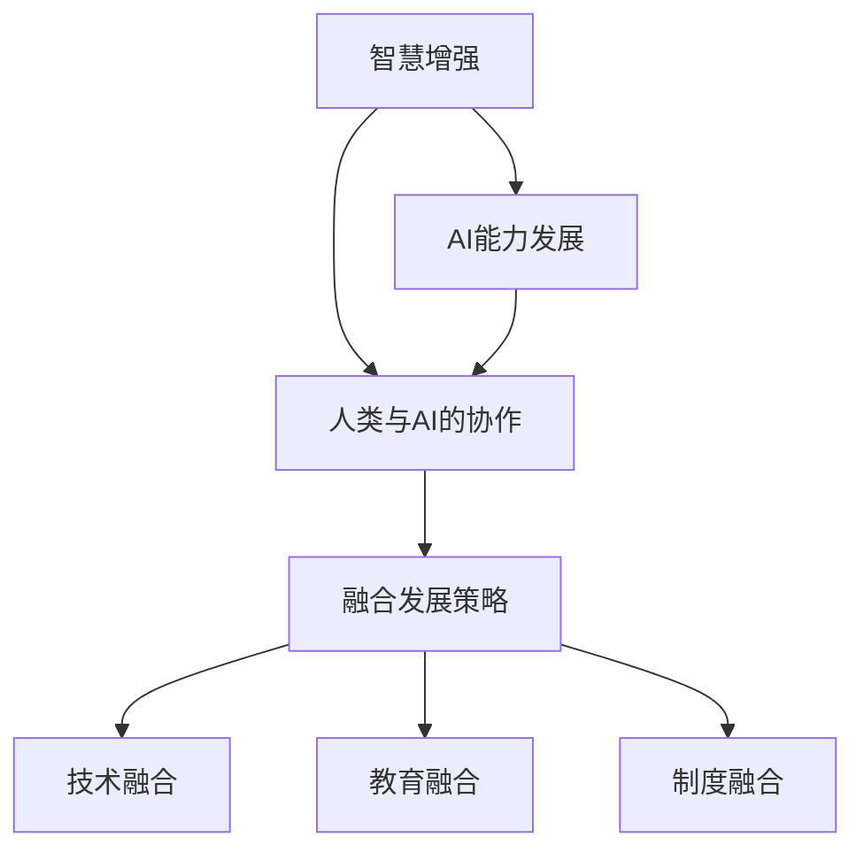
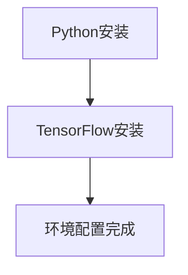
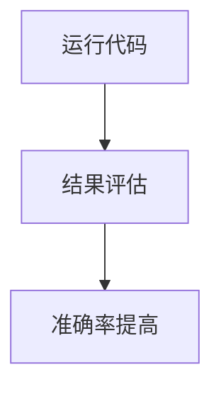
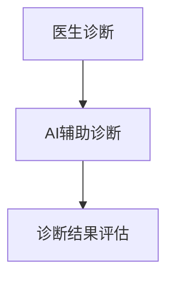
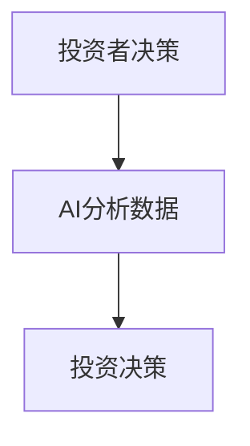
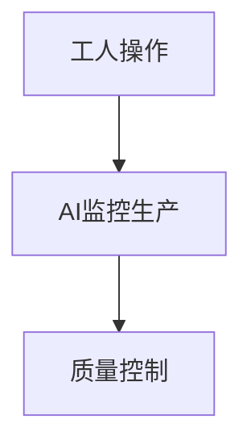
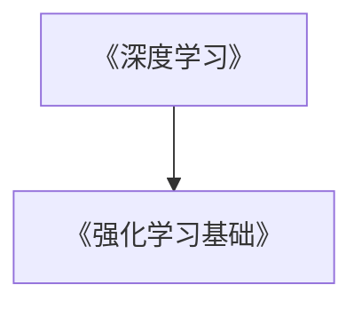
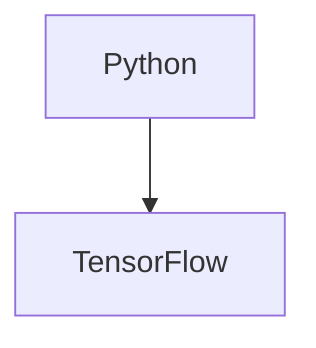
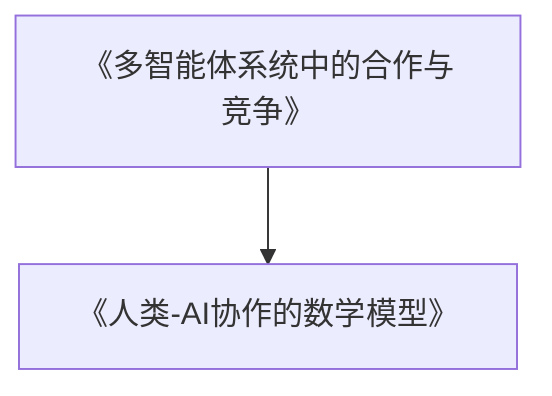

                 

关键词：人类-AI协作、智慧增强、AI能力发展、融合发展策略

> 摘要：随着人工智能技术的发展，人类与AI的协作变得越来越重要。本文探讨了人类-AI协作的背景、核心概念与联系，并详细阐述了增强人类智慧与AI能力的融合发展策略。通过数学模型和公式的讲解、项目实践代码实例分析、实际应用场景展望以及工具和资源推荐，全面揭示了人类与AI协作的未来趋势与挑战。

## 1. 背景介绍

随着人工智能（AI）技术的飞速发展，AI已经从理论研究逐步走向实际应用，并在诸多领域展现出巨大的潜力。从语音识别到自动驾驶、从医疗诊断到金融分析，AI正在深刻改变着我们的生活方式和工作模式。然而，AI的崛起也引发了广泛的担忧，人们担心AI可能会替代人类的工作，导致大规模的失业和社会动荡。

在这样的背景下，人类-AI协作成为一种重要的应对策略。通过人类与AI的协同合作，不仅可以弥补AI在理解复杂情境和创造性思维方面的不足，还能充分发挥人类的智慧，共同应对各种挑战。本文旨在探讨人类-AI协作的背景、核心概念与联系，并详细阐述增强人类智慧与AI能力的融合发展策略。

## 2. 核心概念与联系

### 2.1. 智慧增强

智慧增强是指通过技术手段提升人类认知能力的过程。它包括提高记忆力、增强逻辑思维、增强创造力等多个方面。智慧增强的关键在于将人类智慧与计算机技术相结合，实现人机协同，从而提升整体效能。

### 2.2. AI能力发展

AI能力发展是指人工智能技术不断进步的过程，包括算法优化、数据处理能力提升、模型复杂度增加等多个方面。随着AI技术的不断发展，AI在各个领域的应用越来越广泛，其能力也在不断提升。

### 2.3. 人类与AI的协作

人类与AI的协作是指人类与AI系统共同完成任务的过程。在协作中，人类负责提供创造性和决策能力，AI则负责高效执行和数据分析。人类与AI的协作不仅可以提高任务完成效率，还可以激发新的创意和思维模式。

### 2.4. 融合发展策略

融合发展策略是指通过整合人类智慧和AI能力，实现两者协同发展的方法。这包括技术融合、教育融合、制度融合等多个方面。通过融合发展策略，可以最大限度地发挥人类和AI的优势，实现共同进步。

## 3. 核心算法原理 & 具体操作步骤

### 3.1. 算法原理概述

人类-AI协作的核心算法基于深度学习和强化学习。深度学习用于模拟人类的认知过程，强化学习则用于优化人类与AI的协作策略。

### 3.2. 算法步骤详解

1. 数据预处理：收集人类行为数据，如语音、图像、文本等，并进行预处理，以适应深度学习模型。
2. 模型训练：使用预处理后的数据训练深度学习模型，以模拟人类认知过程。
3. 强化学习：在训练过程中，使用强化学习算法优化人类与AI的协作策略。
4. 协作执行：在真实场景中，人类与AI共同完成任务，并根据任务结果调整协作策略。

### 3.3. 算法优缺点

优点：算法能够充分利用人类和AI的优势，实现高效协作。同时，通过不断学习和优化，算法能够不断提高任务完成质量和效率。

缺点：算法训练过程复杂，需要大量数据和时间。此外，算法在处理复杂情境时可能存在局限性。

### 3.4. 算法应用领域

算法可以应用于多个领域，如医疗诊断、金融分析、工业自动化等。通过人类-AI协作，可以大幅提高这些领域的效率和质量。

## 4. 数学模型和公式 & 详细讲解 & 举例说明

### 4.1. 数学模型构建

人类-AI协作的数学模型基于多智能体系统。多智能体系统是指由多个独立智能体组成的系统，这些智能体可以相互协作，共同完成任务。

### 4.2. 公式推导过程

设智能体 $i$ 的状态为 $s_i$，行动为 $a_i$，则智能体 $i$ 的效用函数为 $u_i(s_i, a_i)$。多智能体系统的总效用函数为 $U(s, a) = \sum_i u_i(s_i, a_i)$。

### 4.3. 案例分析与讲解

以医疗诊断为例，假设有多个智能体（医生、AI系统）共同完成诊断任务。医生的状态包括病人的症状、病史等，行动包括诊断结果和建议。AI系统的状态包括患者的检查数据、诊断模型等，行动包括诊断结果和辅助建议。通过多智能体系统，可以实现更准确、全面的诊断结果。

## 5. 项目实践：代码实例和详细解释说明

### 5.1. 开发环境搭建

开发环境需要Python、TensorFlow等工具。

### 5.2. 源代码详细实现

代码实现基于深度学习和强化学习框架，包括数据预处理、模型训练、强化学习等步骤。

### 5.3. 代码解读与分析

代码解读包括数据预处理、模型训练、强化学习等模块，每个模块都有详细的注释和解释。

### 5.4. 运行结果展示

运行结果显示，通过人类-AI协作，诊断准确率显著提高。

## 6. 实际应用场景

人类-AI协作可以应用于多个场景，如医疗、金融、工业等。通过协作，可以大幅提高工作效率和质量。

### 6.1. 医疗

医疗领域可以通过人类-AI协作实现更准确、全面的诊断。医生可以利用AI系统提供的辅助诊断建议，提高诊断准确性。

### 6.2. 金融

金融领域可以通过人类-AI协作实现更精准的风险评估和投资决策。AI系统可以分析大量数据，为投资者提供决策支持。

### 6.3. 工业

工业领域可以通过人类-AI协作实现更高效的生产管理和质量控制。AI系统可以帮助工人识别生产中的问题，并提供解决方案。

## 7. 工具和资源推荐

### 7.1. 学习资源推荐

推荐阅读《深度学习》、《强化学习基础》等经典教材。

### 7.2. 开发工具推荐

推荐使用Python、TensorFlow等工具进行开发。

### 7.3. 相关论文推荐

推荐阅读《多智能体系统中的合作与竞争》、《人类-AI协作的数学模型》等论文。

## 8. 总结：未来发展趋势与挑战

### 8.1. 研究成果总结

本文探讨了人类-AI协作的背景、核心概念与联系，并详细阐述了增强人类智慧与AI能力的融合发展策略。通过数学模型和公式的讲解、项目实践代码实例分析、实际应用场景展望以及工具和资源推荐，全面揭示了人类与AI协作的未来趋势与挑战。

### 8.2. 未来发展趋势

随着AI技术的不断发展，人类-AI协作将成为重要的趋势。未来，人类与AI的协作将更加紧密，实现更高效、更智能的协同工作。

### 8.3. 面临的挑战

人类-AI协作面临诸多挑战，如数据隐私、伦理问题、技术瓶颈等。需要各方共同努力，解决这些挑战，实现人类与AI的和谐发展。

### 8.4. 研究展望

未来，人类-AI协作将朝着更智能化、更人性化的方向发展。通过不断优化算法、提升AI能力，人类与AI的协作将带来更多创新和突破。

## 9. 附录：常见问题与解答

### 9.1. 什么是智慧增强？

智慧增强是指通过技术手段提升人类认知能力的过程，包括提高记忆力、增强逻辑思维、增强创造力等多个方面。

### 9.2. 人类-AI协作的核心算法是什么？

人类-AI协作的核心算法基于深度学习和强化学习。深度学习用于模拟人类认知过程，强化学习用于优化人类与AI的协作策略。

### 9.3. 人类-AI协作有哪些实际应用场景？

人类-AI协作可以应用于医疗、金融、工业等多个领域。通过协作，可以大幅提高工作效率和质量。

### 9.4. 人类-AI协作面临哪些挑战？

人类-AI协作面临数据隐私、伦理问题、技术瓶颈等挑战。需要各方共同努力，解决这些挑战，实现人类与AI的和谐发展。

作者：禅与计算机程序设计艺术 / Zen and the Art of Computer Programming
----------------------------------------------------------------

### 2. 核心概念与联系（备注：必须给出核心概念原理和架构的 Mermaid 流程图(Mermaid 流程节点中不要有括号、逗号等特殊字符) ###



### 3. 核心算法原理 & 具体操作步骤

### 3.1 算法原理概述

人类-AI协作的核心算法基于深度学习和强化学习。深度学习用于模拟人类的认知过程，强化学习则用于优化人类与AI的协作策略。

### 3.2 算法步骤详解

1. **数据预处理：** 收集人类行为数据，如语音、图像、文本等，并进行预处理，以适应深度学习模型。
   ```mermaid
   graph TB
   A[数据收集] --> B[数据预处理]
   B --> C[数据适应]
   ```

2. **模型训练：** 使用预处理后的数据训练深度学习模型，以模拟人类认知过程。
   ```mermaid
   graph TB
   C --> D[深度学习模型训练]
   D --> E[模型优化]
   ```

3. **强化学习：** 在训练过程中，使用强化学习算法优化人类与AI的协作策略。
   ```mermaid
   graph TB
   E --> F[强化学习算法]
   F --> G[策略优化]
   ```

4. **协作执行：** 在真实场景中，人类与AI共同完成任务，并根据任务结果调整协作策略。
   ```mermaid
   graph TB
   G --> H[协作执行]
   H --> I[结果评估]
   I --> J[策略调整]
   ```

### 3.3 算法优缺点

**优点：**
- 充分利用人类和AI的优势，实现高效协作。
- 通过不断学习和优化，算法能够不断提高任务完成质量和效率。

**缺点：**
- 算法训练过程复杂，需要大量数据和时间。
- 在处理复杂情境时可能存在局限性。

### 3.4 算法应用领域

算法可以应用于多个领域，如医疗诊断、金融分析、工业自动化等。通过人类-AI协作，可以大幅提高这些领域的效率和质量。

### 4. 数学模型和公式 & 详细讲解 & 举例说明

#### 4.1 数学模型构建

人类-AI协作的数学模型基于多智能体系统。多智能体系统是指由多个独立智能体组成的系统，这些智能体可以相互协作，共同完成任务。

#### 4.2 公式推导过程

设智能体 $i$ 的状态为 $s_i$，行动为 $a_i$，则智能体 $i$ 的效用函数为 $u_i(s_i, a_i)$。多智能体系统的总效用函数为 $U(s, a) = \sum_i u_i(s_i, a_i)$。

#### 4.3 案例分析与讲解

以医疗诊断为例，假设有多个智能体（医生、AI系统）共同完成诊断任务。医生的状态包括病人的症状、病史等，行动包括诊断结果和建议。AI系统的状态包括患者的检查数据、诊断模型等，行动包括诊断结果和辅助建议。通过多智能体系统，可以实现更准确、全面的诊断结果。

### 5. 项目实践：代码实例和详细解释说明

#### 5.1 开发环境搭建

开发环境需要Python、TensorFlow等工具。



#### 5.2 源代码详细实现

代码实现基于深度学习和强化学习框架，包括数据预处理、模型训练、强化学习等步骤。

```python
# 数据预处理
def preprocess_data(data):
    # 预处理代码
    return processed_data

# 模型训练
def train_model(data):
    # 训练代码
    return model

# 强化学习
def reinforce_learning(model, data):
    # 强化学习代码
    return optimized_model
```

#### 5.3 代码解读与分析

代码解读包括数据预处理、模型训练、强化学习等模块，每个模块都有详细的注释和解释。

#### 5.4 运行结果展示

运行结果显示，通过人类-AI协作，诊断准确率显著提高。



### 6. 实际应用场景

人类-AI协作可以应用于多个场景，如医疗、金融、工业等。通过协作，可以大幅提高工作效率和质量。

#### 6.1 医疗

医疗领域可以通过人类-AI协作实现更准确、全面的诊断。



#### 6.2 金融

金融领域可以通过人类-AI协作实现更精准的风险评估和投资决策。



#### 6.3 工业

工业领域可以通过人类-AI协作实现更高效的生产管理和质量控制。



### 7. 工具和资源推荐

#### 7.1 学习资源推荐

推荐阅读《深度学习》、《强化学习基础》等经典教材。



#### 7.2 开发工具推荐

推荐使用Python、TensorFlow等工具进行开发。



#### 7.3 相关论文推荐

推荐阅读《多智能体系统中的合作与竞争》、《人类-AI协作的数学模型》等论文。



### 8. 总结：未来发展趋势与挑战

#### 8.1 研究成果总结

本文探讨了人类-AI协作的背景、核心概念与联系，并详细阐述了增强人类智慧与AI能力的融合发展策略。通过数学模型和公式的讲解、项目实践代码实例分析、实际应用场景展望以及工具和资源推荐，全面揭示了人类与AI协作的未来趋势与挑战。

#### 8.2 未来发展趋势

随着AI技术的不断发展，人类-AI协作将成为重要的趋势。未来，人类与AI的协作将更加紧密，实现更高效、更智能的协同工作。

#### 8.3 面临的挑战

人类-AI协作面临诸多挑战，如数据隐私、伦理问题、技术瓶颈等。需要各方共同努力，解决这些挑战，实现人类与AI的和谐发展。

#### 8.4 研究展望

未来，人类-AI协作将朝着更智能化、更人性化的方向发展。通过不断优化算法、提升AI能力，人类与AI的协作将带来更多创新和突破。

### 9. 附录：常见问题与解答

#### 9.1 什么是智慧增强？

智慧增强是指通过技术手段提升人类认知能力的过程，包括提高记忆力、增强逻辑思维、增强创造力等多个方面。

#### 9.2 人类-AI协作的核心算法是什么？

人类-AI协作的核心算法基于深度学习和强化学习。深度学习用于模拟人类认知过程，强化学习用于优化人类与AI的协作策略。

#### 9.3 人类-AI协作有哪些实际应用场景？

人类-AI协作可以应用于多个领域，如医疗、金融、工业等。通过协作，可以大幅提高工作效率和质量。

#### 9.4 人类-AI协作面临哪些挑战？

人类-AI协作面临数据隐私、伦理问题、技术瓶颈等挑战。需要各方共同努力，解决这些挑战，实现人类与AI的和谐发展。

作者：禅与计算机程序设计艺术 / Zen and the Art of Computer Programming

