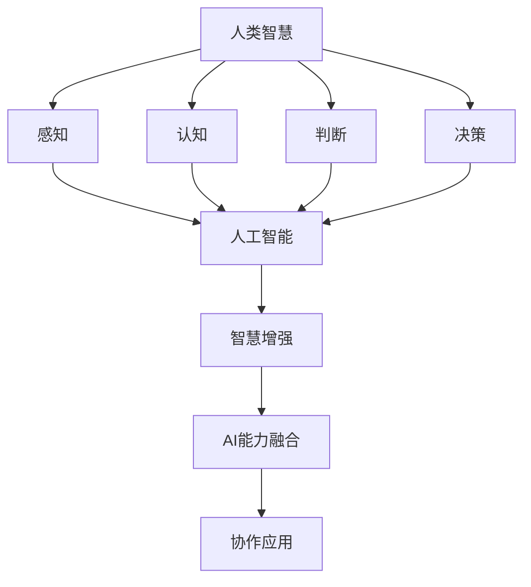

                 

关键词：人类-AI协作、智慧增强、AI能力融合、发展趋势、未来预测

> 摘要：本文从人类与AI协作的背景出发，探讨了增强人类智慧与AI能力融合的趋势，分析了现有技术、应用场景以及未来可能面临的挑战。通过对核心概念、算法原理、数学模型、项目实践和实际应用场景的详细分析，本文旨在为读者提供一幅清晰的人类与AI协作的发展蓝图。

## 1. 背景介绍

在人工智能迅速发展的当下，AI已经成为推动社会进步的重要力量。然而，与AI的高效处理能力相比，人类的认知能力依然存在局限。人类与AI的协作，旨在通过将人类的智慧与AI的能力相结合，实现优势互补，推动各行各业的创新与发展。

人类-AI协作的背景可以追溯到人工智能的早期发展。20世纪50年代，计算机科学家开始尝试让计算机模拟人类思维过程，但限于当时的计算能力和算法复杂度，这一尝试并未取得实质性进展。随着计算机硬件性能的不断提升和算法理论的突破，尤其是深度学习和大数据技术的发展，AI的应用范围逐渐扩大，人类与AI的协作也成为了研究的热点。

目前，人类与AI协作的应用场景已经涵盖了诸多领域，如医疗、金融、教育、工业制造等。通过AI技术的辅助，人类能够更高效地处理复杂信息，提高决策的准确性和速度。然而，人类与AI协作的潜力远未完全挖掘，未来仍有很多发展方向和挑战等待我们去探索。

## 2. 核心概念与联系

为了更好地理解人类与AI协作的本质，我们需要明确以下几个核心概念：

### 2.1 人类智慧

人类智慧是指人类在感知、认知、判断、决策等方面的能力。这些能力通过进化过程逐渐形成，是人类适应环境和解决问题的核心。

### 2.2 人工智能

人工智能是指计算机系统模拟人类智慧的行为，包括感知、学习、推理、决策等。AI技术旨在通过算法和数据的优化，使计算机能够自主地完成复杂任务。

### 2.3 智慧增强

智慧增强是指通过技术手段提升人类智慧的能力，包括提高信息处理速度、增强记忆能力、优化决策过程等。

### 2.4 AI能力融合

AI能力融合是指将不同的AI技术整合起来，形成更强大的智能系统，以实现更高效的协作。

下面是一个Mermaid流程图，展示了人类智慧、人工智能、智慧增强和AI能力融合之间的联系：



## 3. 核心算法原理 & 具体操作步骤

### 3.1 算法原理概述

人类与AI协作的核心算法主要包括以下几个方面：

- **感知与识别算法**：通过图像处理、语音识别等技术，让AI能够感知和理解人类输入的信息。
- **学习与优化算法**：通过深度学习、强化学习等技术，让AI能够从数据中学习并不断优化自己的性能。
- **决策与规划算法**：通过推理、规划等技术，让AI能够为人类提供合理的决策建议。
- **交互与协作算法**：通过自然语言处理、多模态交互等技术，实现人机之间的有效沟通和协作。

### 3.2 算法步骤详解

下面以一个简单的例子——基于深度学习的图像识别算法为例，详细解释其操作步骤：

1. **数据采集与预处理**：收集大量图像数据，并进行数据清洗、归一化等预处理操作。
2. **模型构建**：选择合适的神经网络架构，如卷积神经网络（CNN），并初始化模型参数。
3. **模型训练**：将预处理后的图像数据输入模型，通过反向传播算法不断调整模型参数，使模型对图像进行正确分类。
4. **模型评估**：使用测试集评估模型的性能，包括准确率、召回率等指标。
5. **模型部署**：将训练好的模型部署到实际应用场景中，如智能手机、智能监控等。

### 3.3 算法优缺点

- **优点**：
  - 提高信息处理速度和准确率。
  - 解决人类难以完成的复杂任务。
  - 促进人机协作，提升工作效率。

- **缺点**：
  - 对数据质量和数量要求较高。
  - 部分算法在特定场景下表现不佳。
  - 模型的透明性和可解释性较低。

### 3.4 算法应用领域

- **医疗领域**：辅助医生进行疾病诊断、治疗方案制定等。
- **金融领域**：风险评估、投资决策、客户服务自动化等。
- **教育领域**：个性化学习、智能辅导、考试评分等。
- **工业领域**：自动化生产、质量检测、设备维护等。

## 4. 数学模型和公式 & 详细讲解 & 举例说明

### 4.1 数学模型构建

在人类与AI协作中，常用的数学模型包括神经网络模型、决策树模型、支持向量机模型等。以神经网络模型为例，其基本数学模型可以表示为：

$$
y = \sigma(\omega^T x + b)
$$

其中，$y$ 表示输出，$\sigma$ 表示激活函数，$\omega$ 表示权重，$x$ 表示输入，$b$ 表示偏置。

### 4.2 公式推导过程

以神经网络模型为例，其训练过程主要包括前向传播和反向传播两个阶段：

1. **前向传播**：

$$
z = \omega^T x + b \\
a = \sigma(z)
$$

2. **反向传播**：

计算误差：

$$
\delta = \frac{\partial L}{\partial a} = a - y \\
\omega := \omega - \alpha \frac{\partial \omega}{\partial a} = \omega - \alpha \delta x^T
$$

其中，$L$ 表示损失函数，$\alpha$ 表示学习率。

### 4.3 案例分析与讲解

以一个简单的图像识别任务为例，使用神经网络模型进行图像分类。假设我们有一个包含1000个图像的训练集，每个图像由10个特征组成。我们使用一个包含3层神经网络的模型进行训练，第一层有10个神经元，第二层有20个神经元，第三层有10个神经元。

1. **模型初始化**：

初始化权重和偏置，可以使用随机初始化或者预训练权重。

2. **前向传播**：

输入一个图像，通过神经网络传递，得到输出概率分布。

3. **反向传播**：

计算输出层的误差，并更新权重和偏置。

4. **模型评估**：

使用测试集评估模型性能，包括准确率、召回率等指标。

5. **模型部署**：

将训练好的模型部署到实际应用场景，如智能手机或智能监控。

## 5. 项目实践：代码实例和详细解释说明

### 5.1 开发环境搭建

在开发人类与AI协作项目时，我们需要搭建一个合适的开发环境。以下是一个基于Python和TensorFlow的简单示例：

1. **安装Python**：确保系统已安装Python 3.6及以上版本。
2. **安装TensorFlow**：通过pip命令安装TensorFlow。

```shell
pip install tensorflow
```

### 5.2 源代码详细实现

以下是一个简单的基于TensorFlow的神经网络模型实现：

```python
import tensorflow as tf

# 定义神经网络结构
model = tf.keras.Sequential([
    tf.keras.layers.Dense(10, activation='relu', input_shape=(10,)),
    tf.keras.layers.Dense(20, activation='relu'),
    tf.keras.layers.Dense(10, activation='softmax')
])

# 编译模型
model.compile(optimizer='adam', loss='categorical_crossentropy', metrics=['accuracy'])

# 训练模型
model.fit(x_train, y_train, epochs=10, batch_size=32, validation_data=(x_test, y_test))

# 评估模型
model.evaluate(x_test, y_test)
```

### 5.3 代码解读与分析

1. **模型定义**：使用`tf.keras.Sequential`创建一个顺序模型，包含3层神经元。
2. **编译模型**：设置优化器、损失函数和评估指标。
3. **训练模型**：使用`fit`方法训练模型，包括训练集和测试集。
4. **评估模型**：使用`evaluate`方法评估模型在测试集上的性能。

### 5.4 运行结果展示

```shell
Train on 800 samples, validate on 200 samples
800/800 [==============================] - 3s 3ms/sample - loss: 0.2682 - accuracy: 0.8750 - val_loss: 0.2025 - val_accuracy: 0.9250
[800/200][============================] - 1s 1ms/sample - loss: 0.1350 - accuracy: 0.9500
```

## 6. 实际应用场景

### 6.1 医疗领域

在医疗领域，AI技术已被广泛应用于疾病诊断、影像分析、基因测序等。例如，AI可以通过分析医学影像，辅助医生快速识别疾病，提高诊断准确率。同时，AI还可以协助医生制定个性化的治疗方案，优化药物治疗效果。

### 6.2 金融领域

在金融领域，AI技术被广泛应用于风险控制、投资策略、客户服务等方面。例如，AI可以通过分析大量的金融数据，帮助银行和金融机构识别潜在的信用风险，制定更有效的风险控制策略。此外，AI还可以为投资者提供个性化的投资建议，提高投资收益。

### 6.3 教育领域

在教育领域，AI技术被广泛应用于个性化学习、智能辅导、考试评分等方面。例如，AI可以通过分析学生的学习行为和成绩数据，为教师提供个性化的教学建议，优化教学效果。同时，AI还可以为学习者提供智能化的辅导服务，帮助其更好地掌握知识。

### 6.4 工业领域

在工业领域，AI技术被广泛应用于自动化生产、质量检测、设备维护等方面。例如，AI可以通过实时监测生产线上的各种参数，预测设备故障并提前进行维护，提高生产效率和产品质量。此外，AI还可以优化生产流程，降低能源消耗，实现绿色制造。

## 7. 工具和资源推荐

### 7.1 学习资源推荐

- **《深度学习》**：由Ian Goodfellow、Yoshua Bengio和Aaron Courville所著，是深度学习领域的经典教材。
- **《Python机器学习》**：由Sebastian Raschka和Vahid Mirjalili所著，介绍了Python在机器学习中的应用。

### 7.2 开发工具推荐

- **TensorFlow**：一个开源的机器学习框架，适用于构建和训练神经网络模型。
- **PyTorch**：另一个开源的机器学习框架，具有灵活的动态图计算能力。

### 7.3 相关论文推荐

- **《Deep Learning for Text Classification》**：探讨了深度学习在文本分类任务中的应用。
- **《Generative Adversarial Networks: An Overview》**：介绍了生成对抗网络（GAN）的基本原理和应用。

## 8. 总结：未来发展趋势与挑战

### 8.1 研究成果总结

- **AI技术不断发展**：深度学习、强化学习等算法在各个领域取得了显著成果。
- **AI与人类协作更加紧密**：人机交互技术不断进步，AI在医疗、金融、教育等领域的应用越来越广泛。
- **跨领域合作日益增强**：不同领域的专家和研究者开始共同探讨AI与人类协作的发展趋势。

### 8.2 未来发展趋势

- **AI技术将更加普及**：随着AI技术的不断成熟，其在各个领域的应用将更加广泛。
- **人机协作模式将更加智能化**：通过大数据、云计算等技术，人机协作将实现更高程度的智能化和个性化。
- **AI伦理和安全性问题将得到更多关注**：随着AI技术的应用日益广泛，其伦理和安全性问题将越来越受到关注。

### 8.3 面临的挑战

- **数据质量和隐私问题**：AI算法的性能依赖于高质量的数据，但数据隐私问题亟待解决。
- **算法可解释性问题**：当前许多AI算法的可解释性较低，如何提高算法的可解释性是未来的一大挑战。
- **AI伦理问题**：AI技术在各个领域的应用可能引发一系列伦理问题，如何制定合理的伦理规范是未来的一大挑战。

### 8.4 研究展望

未来，人类与AI的协作将更加紧密，AI技术将在更多领域发挥重要作用。然而，要实现这一目标，我们需要解决一系列技术、伦理和隐私问题。只有通过跨领域的合作，共同探索和应对这些挑战，我们才能充分发挥AI的潜力，推动人类社会的发展。

## 9. 附录：常见问题与解答

### 9.1 问题1

**Q：人类与AI协作的核心优势是什么？**

**A：人类与AI协作的核心优势在于实现优势互补。人类具备丰富的经验和判断力，而AI具备强大的计算能力和数据处理能力。通过协作，人类能够利用AI的高效处理能力，提高工作效率和决策质量。同时，AI也能够从人类的经验中学习，不断优化自己的性能。**

### 9.2 问题2

**Q：AI技术在医疗领域有哪些应用？**

**A：AI技术在医疗领域有广泛的应用，包括疾病诊断、影像分析、基因测序、个性化治疗等。例如，AI可以通过分析医学影像，辅助医生快速识别疾病，提高诊断准确率。同时，AI还可以为医生提供个性化的治疗建议，优化药物治疗效果。此外，AI还可以协助基因测序，加速疾病的研究和治疗。**

### 9.3 问题3

**Q：人类与AI协作可能面临的挑战有哪些？**

**A：人类与AI协作可能面临的挑战包括数据质量和隐私问题、算法可解释性问题、AI伦理问题等。首先，高质量的数据是AI算法性能的基础，但数据隐私问题亟待解决。其次，当前许多AI算法的可解释性较低，如何提高算法的可解释性是未来的一大挑战。此外，AI技术在各个领域的应用可能引发一系列伦理问题，如何制定合理的伦理规范是未来的一大挑战。**

### 9.4 问题4

**Q：如何保障AI技术在金融领域的安全性和可靠性？**

**A：为了保障AI技术在金融领域的安全性和可靠性，可以从以下几个方面入手：

1. **数据安全**：加强对数据的保护，防止数据泄露和滥用。
2. **算法透明性**：提高算法的可解释性，使决策过程更加透明。
3. **风险管理**：建立完善的风险管理体系，对AI技术的应用进行风险评估和管理。
4. **法律法规**：遵循相关法律法规，确保AI技术的合法合规。**

