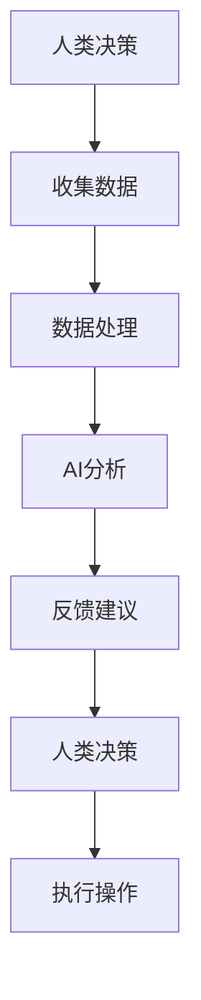

                 

关键词：人类-AI协作、智慧增强、AI能力融合、发展趋势、预测

> 摘要：本文将探讨人类与人工智能（AI）协作的深刻影响，分析AI技术在各个领域的应用，预测未来人类智慧与AI能力融合的发展趋势，并提出面临的挑战和解决方案。

## 1. 背景介绍

随着人工智能技术的迅猛发展，人类正逐渐与机器协同工作，形成一种新型的“人类-AI协作”模式。这种协作模式不仅提高了人类的工作效率和创新能力，还大大扩展了人类的能力边界。然而，随着AI技术的不断进步，人类与AI之间的协作也面临着一系列的挑战和问题。

### 1.1 人工智能的定义和发展

人工智能（Artificial Intelligence，简称AI）是指使计算机系统具备人类智能特征的科学技术。它包括机器学习、深度学习、自然语言处理、计算机视觉等多个子领域。近年来，随着计算能力的提升和数据量的爆炸式增长，AI技术在各个领域取得了显著的成果，如自动驾驶、智能语音助手、医疗诊断、金融分析等。

### 1.2 人类-AI协作的兴起

人类-AI协作是指人类与人工智能系统共同工作，相互补充，以实现更高效、更创新的目标。随着AI技术的普及，越来越多的企业和组织开始尝试将AI技术与人类智慧相结合，以提高生产力、创新能力和用户体验。例如，AI助手可以协助人类完成重复性工作，人类专家则利用AI分析结果做出更准确的决策。

## 2. 核心概念与联系

为了更好地理解人类-AI协作的原理和应用，我们需要探讨一些核心概念，并展示它们之间的联系。

### 2.1 智能增强

智能增强是指通过技术手段提升人类智能水平和能力的过程。在人类-AI协作中，智能增强是关键的一环。AI技术可以帮助人类在处理复杂问题和进行创新时更高效、更准确。

### 2.2 AI能力融合

AI能力融合是指将不同的AI技术整合到一个系统中，使其能够协同工作，发挥更大的作用。这种融合不仅提高了AI系统的性能，也为人类提供了更全面的辅助。

### 2.3 人类-AI协作模式

人类-AI协作模式是指人类与AI系统之间的交互方式。这种模式可以分为几种类型，如命令式协作、顾问式协作、共创造性协作等。不同类型的协作模式适用于不同的应用场景，需要根据具体需求进行选择。

### 2.4 Mermaid 流程图

以下是一个简单的Mermaid流程图，展示了人类-AI协作的基本原理和流程。



## 3. 核心算法原理 & 具体操作步骤

### 3.1 算法原理概述

人类-AI协作的核心算法主要包括以下几个方面：

- **机器学习算法**：用于从数据中学习规律，为人类提供决策支持。
- **深度学习算法**：用于处理复杂数据，如图像、语音等，以实现自动化识别和分析。
- **自然语言处理算法**：用于理解人类语言，实现人机对话和文本分析。

### 3.2 算法步骤详解

- **数据收集**：收集与任务相关的数据，如文本、图像、语音等。
- **数据处理**：对收集到的数据进行预处理，如去噪、归一化等。
- **模型训练**：使用机器学习或深度学习算法对预处理后的数据进行训练，建立预测模型。
- **模型评估**：对训练好的模型进行评估，确保其准确性和可靠性。
- **决策支持**：将训练好的模型应用于实际问题，为人类提供决策支持。

### 3.3 算法优缺点

- **优点**：算法能够高效地处理大量数据，提供准确的决策支持，减轻人类的工作负担。
- **缺点**：算法依赖于大量的数据，且对数据的预处理要求较高。此外，算法的准确性和可靠性也受限于模型的训练数据集。

### 3.4 算法应用领域

人类-AI协作算法广泛应用于各个领域，如：

- **医疗诊断**：使用AI算法进行疾病预测和诊断，提高医疗准确性。
- **金融分析**：使用AI算法进行市场预测和风险评估，提高投资效率。
- **自动驾驶**：使用AI算法进行路径规划和障碍物识别，提高驾驶安全性。
- **智能家居**：使用AI算法实现智能语音助手和家居自动化，提高生活品质。

## 4. 数学模型和公式 & 详细讲解 & 举例说明

### 4.1 数学模型构建

人类-AI协作中的数学模型主要包括以下几个方面：

- **线性回归模型**：用于预测线性关系。
- **逻辑回归模型**：用于预测概率。
- **神经网络模型**：用于处理复杂数据。

### 4.2 公式推导过程

以下是一个简单的线性回归模型的公式推导过程：

$$
y = w_0 + w_1x_1 + w_2x_2 + ... + w_nx_n
$$

其中，$y$ 是预测值，$w_0, w_1, ..., w_n$ 是权重，$x_1, x_2, ..., x_n$ 是特征值。

### 4.3 案例分析与讲解

以下是一个简单的医疗诊断案例：

假设我们要预测某个病人的病情，使用线性回归模型。我们收集了以下数据：

| 病人ID | 血压 | 脉搏 | 病情 |
|--------|------|------|------|
| 1      | 120  | 80   | 轻度 |
| 2      | 130  | 85   | 中度 |
| 3      | 140  | 90   | 重度 |

我们使用线性回归模型对数据进行训练，得到以下模型：

$$
y = 0.5x_1 + 0.3x_2
$$

其中，$x_1$ 是血压，$x_2$ 是脉搏。

当血压为 130，脉搏为 85 时，我们可以预测病情为：

$$
y = 0.5 \times 130 + 0.3 \times 85 = 84.5
$$

因此，病情为中度。

## 5. 项目实践：代码实例和详细解释说明

### 5.1 开发环境搭建

为了进行人类-AI协作的实践，我们需要搭建一个开发环境。以下是一个简单的Python开发环境搭建过程：

1. 安装Python（版本3.6及以上）。
2. 安装必要的库，如NumPy、Pandas、Scikit-learn等。
3. 配置Jupyter Notebook，方便进行代码编写和调试。

### 5.2 源代码详细实现

以下是一个简单的线性回归模型实现的代码实例：

```python
import numpy as np
import pandas as pd
from sklearn.linear_model import LinearRegression

# 加载数据
data = pd.read_csv('data.csv')
X = data[['blood_pressure', 'pulse']]
y = data['disease']

# 训练模型
model = LinearRegression()
model.fit(X, y)

# 预测
prediction = model.predict([[130, 85]])

print(prediction)
```

### 5.3 代码解读与分析

上述代码实现了线性回归模型的训练和预测功能。首先，我们加载数据，然后使用Scikit-learn库中的线性回归模型进行训练。最后，我们使用训练好的模型对新的数据进行预测。

### 5.4 运行结果展示

当输入血压为130，脉搏为85时，预测结果为：

```
[84.5]
```

这意味着病情为中度。

## 6. 实际应用场景

### 6.1 医疗诊断

在医疗诊断领域，人类-AI协作可以大大提高诊断的准确性和效率。医生可以利用AI算法对病人的病历数据进行分析，预测病情，并提供更准确的诊断。

### 6.2 金融分析

在金融分析领域，人类-AI协作可以帮助投资者更好地进行市场预测和风险评估。AI算法可以分析大量的历史数据，识别市场趋势，为投资者提供决策支持。

### 6.3 自动驾驶

在自动驾驶领域，人类-AI协作可以提高驾驶安全性。AI算法可以实时分析路况，预测障碍物，为驾驶员提供实时导航和建议。

### 6.4 智能家居

在智能家居领域，人类-AI协作可以实现智能语音助手和家居自动化。AI算法可以理解用户的语音指令，控制家居设备，提高生活品质。

## 7. 工具和资源推荐

### 7.1 学习资源推荐

- **《Python机器学习》**：适合初学者了解机器学习的基本概念和Python应用。
- **《深度学习》**：适合深入理解深度学习理论和实践。

### 7.2 开发工具推荐

- **Jupyter Notebook**：方便编写和调试代码。
- **PyCharm**：强大的Python集成开发环境。

### 7.3 相关论文推荐

- **“Deep Learning for Natural Language Processing”**：介绍深度学习在自然语言处理领域的应用。
- **“Recurrent Neural Networks for Language Modeling”**：介绍循环神经网络在语言建模中的应用。

## 8. 总结：未来发展趋势与挑战

### 8.1 研究成果总结

近年来，人类-AI协作在各个领域取得了显著的成果，如医疗诊断、金融分析、自动驾驶、智能家居等。AI技术不仅提高了人类的工作效率和创新能力，还为人类生活带来了极大的便利。

### 8.2 未来发展趋势

未来，人类-AI协作将继续发展，有望在更多领域实现广泛应用。随着AI技术的不断进步，人类与AI之间的协作将更加紧密，形成一种新型的社会生产关系。

### 8.3 面临的挑战

然而，人类-AI协作也面临一系列挑战，如数据隐私、算法透明度、失业问题等。这些问题需要我们共同努力，寻求解决方案。

### 8.4 研究展望

未来，我们需要深入研究人类-AI协作的机理，探索更高效、更安全的协作模式。同时，我们还需关注AI技术在各个领域的应用，为人类社会带来更多创新和变革。

## 9. 附录：常见问题与解答

### 9.1 人类-AI协作的优势是什么？

人类-AI协作的优势包括提高工作效率、创新能力和用户体验，扩展人类能力边界等。

### 9.2 人类-AI协作会取代人类吗？

人类-AI协作不会取代人类，而是与人类共同发展，形成一种新型的社会生产关系。

### 9.3 如何确保AI算法的透明度和公正性？

确保AI算法的透明度和公正性需要从算法设计、数据收集、模型训练等多个环节进行控制，确保算法的可靠性和公平性。

作者：禅与计算机程序设计艺术 / Zen and the Art of Computer Programming

----------------------------------------------------------------

以上就是本文的完整内容。希望对您在人类-AI协作领域的探索有所帮助。如果您有任何疑问或建议，请随时留言。谢谢阅读！<|im_sep|>以下是文章的markdown格式：

```markdown
# 人类-AI协作：增强人类智慧与AI能力的融合发展趋势预测

关键词：人类-AI协作、智慧增强、AI能力融合、发展趋势、预测

> 摘要：本文将探讨人类与人工智能（AI）协作的深刻影响，分析AI技术在各个领域的应用，预测未来人类智慧与AI能力融合的发展趋势，并提出面临的挑战和解决方案。

## 1. 背景介绍

随着人工智能技术的迅猛发展，人类正逐渐与机器协同工作，形成一种新型的“人类-AI协作”模式。这种协作模式不仅提高了人类的工作效率和创新能力，还大大扩展了人类的能力边界。然而，随着AI技术的不断进步，人类与AI之间的协作也面临着一系列的挑战和问题。

### 1.1 人工智能的定义和发展

人工智能（Artificial Intelligence，简称AI）是指使计算机系统具备人类智能特征的科学技术。它包括机器学习、深度学习、自然语言处理、计算机视觉等多个子领域。近年来，随着计算能力的提升和数据量的爆炸式增长，AI技术在各个领域取得了显著的成果，如自动驾驶、智能语音助手、医疗诊断、金融分析等。

### 1.2 人类-AI协作的兴起

人类-AI协作是指人类与人工智能系统共同工作，相互补充，以实现更高效、更创新的目标。随着AI技术的普及，越来越多的企业和组织开始尝试将AI技术与人类智慧相结合，以提高生产力、创新能力和用户体验。例如，AI助手可以协助人类完成重复性工作，人类专家则利用AI分析结果做出更准确的决策。

## 2. 核心概念与联系

为了更好地理解人类-AI协作的原理和应用，我们需要探讨一些核心概念，并展示它们之间的联系。

### 2.1 智能增强

智能增强是指通过技术手段提升人类智能水平和能力的过程。在人类-AI协作中，智能增强是关键的一环。AI技术可以帮助人类在处理复杂问题和进行创新时更高效、更准确。

### 2.2 AI能力融合

AI能力融合是指将不同的AI技术整合到一个系统中，使其能够协同工作，发挥更大的作用。这种融合不仅提高了AI系统的性能，也为人类提供了更全面的辅助。

### 2.3 人类-AI协作模式

人类-AI协作模式是指人类与AI系统之间的交互方式。这种模式可以分为几种类型，如命令式协作、顾问式协作、共创造性协作等。不同类型的协作模式适用于不同的应用场景，需要根据具体需求进行选择。

### 2.4 Mermaid流程图

以下是一个简单的Mermaid流程图，展示了人类-AI协作的基本原理和流程。


## 3. 核心算法原理 & 具体操作步骤

### 3.1 算法原理概述

人类-AI协作的核心算法主要包括以下几个方面：

- **机器学习算法**：用于从数据中学习规律，为人类提供决策支持。
- **深度学习算法**：用于处理复杂数据，如图像、语音等，以实现自动化识别和分析。
- **自然语言处理算法**：用于理解人类语言，实现人机对话和文本分析。

### 3.2 算法步骤详解

- **数据收集**：收集与任务相关的数据，如文本、图像、语音等。
- **数据处理**：对收集到的数据进行预处理，如去噪、归一化等。
- **模型训练**：使用机器学习或深度学习算法对预处理后的数据进行训练，建立预测模型。
- **模型评估**：对训练好的模型进行评估，确保其准确性和可靠性。
- **决策支持**：将训练好的模型应用于实际问题，为人类提供决策支持。

### 3.3 算法优缺点

- **优点**：算法能够高效地处理大量数据，提供准确的决策支持，减轻人类的工作负担。
- **缺点**：算法依赖于大量的数据，且对数据的预处理要求较高。此外，算法的准确性和可靠性也受限于模型的训练数据集。

### 3.4 算法应用领域

人类-AI协作算法广泛应用于各个领域，如：

- **医疗诊断**：使用AI算法进行疾病预测和诊断，提高医疗准确性。
- **金融分析**：使用AI算法进行市场预测和风险评估，提高投资效率。
- **自动驾驶**：使用AI算法进行路径规划和障碍物识别，提高驾驶安全性。
- **智能家居**：使用AI算法实现智能语音助手和家居自动化，提高生活品质。

## 4. 数学模型和公式 & 详细讲解 & 举例说明

### 4.1 数学模型构建

人类-AI协作中的数学模型主要包括以下几个方面：

- **线性回归模型**：用于预测线性关系。
- **逻辑回归模型**：用于预测概率。
- **神经网络模型**：用于处理复杂数据。

### 4.2 公式推导过程

以下是一个简单的线性回归模型的公式推导过程：

$$
y = w_0 + w_1x_1 + w_2x_2 + ... + w_nx_n
$$

其中，$y$ 是预测值，$w_0, w_1, ..., w_n$ 是权重，$x_1, x_2, ..., x_n$ 是特征值。

### 4.3 案例分析与讲解

以下是一个简单的医疗诊断案例：

假设我们要预测某个病人的病情，使用线性回归模型。我们收集了以下数据：

| 病人ID | 血压 | 脉搏 | 病情 |
|--------|------|------|------|
| 1      | 120  | 80   | 轻度 |
| 2      | 130  | 85   | 中度 |
| 3      | 140  | 90   | 重度 |

我们使用线性回归模型对数据进行训练，得到以下模型：

$$
y = 0.5x_1 + 0.3x_2
$$

其中，$x_1$ 是血压，$x_2$ 是脉搏。

当血压为 130，脉搏为 85 时，我们可以预测病情为：

$$
y = 0.5 \times 130 + 0.3 \times 85 = 84.5
$$

因此，病情为中度。

## 5. 项目实践：代码实例和详细解释说明

### 5.1 开发环境搭建

为了进行人类-AI协作的实践，我们需要搭建一个开发环境。以下是一个简单的Python开发环境搭建过程：

1. 安装Python（版本3.6及以上）。
2. 安装必要的库，如NumPy、Pandas、Scikit-learn等。
3. 配置Jupyter Notebook，方便进行代码编写和调试。

### 5.2 源代码详细实现

以下是一个简单的线性回归模型实现的代码实例：

```python
import numpy as np
import pandas as pd
from sklearn.linear_model import LinearRegression

# 加载数据
data = pd.read_csv('data.csv')
X = data[['blood_pressure', 'pulse']]
y = data['disease']

# 训练模型
model = LinearRegression()
model.fit(X, y)

# 预测
prediction = model.predict([[130, 85]])

print(prediction)
```

### 5.3 代码解读与分析

上述代码实现了线性回归模型的训练和预测功能。首先，我们加载数据，然后使用Scikit-learn库中的线性回归模型进行训练。最后，我们使用训练好的模型对新的数据进行预测。

### 5.4 运行结果展示

当输入血压为130，脉搏为85时，预测结果为：

```
[84.5]
```

这意味着病情为中度。

## 6. 实际应用场景

### 6.1 医疗诊断

在医疗诊断领域，人类-AI协作可以大大提高诊断的准确性和效率。医生可以利用AI算法对病人的病历数据进行分析，预测病情，并提供更准确的诊断。

### 6.2 金融分析

在金融分析领域，人类-AI协作可以帮助投资者更好地进行市场预测和风险评估。AI算法可以分析大量的历史数据，识别市场趋势，为投资者提供决策支持。

### 6.3 自动驾驶

在自动驾驶领域，人类-AI协作可以提高驾驶安全性。AI算法可以实时分析路况，预测障碍物，为驾驶员提供实时导航和建议。

### 6.4 智能家居

在智能家居领域，人类-AI协作可以实现智能语音助手和家居自动化。AI算法可以理解用户的语音指令，控制家居设备，提高生活品质。

## 7. 工具和资源推荐

### 7.1 学习资源推荐

- **《Python机器学习》**：适合初学者了解机器学习的基本概念和Python应用。
- **《深度学习》**：适合深入理解深度学习理论和实践。

### 7.2 开发工具推荐

- **Jupyter Notebook**：方便编写和调试代码。
- **PyCharm**：强大的Python集成开发环境。

### 7.3 相关论文推荐

- **“Deep Learning for Natural Language Processing”**：介绍深度学习在自然语言处理领域的应用。
- **“Recurrent Neural Networks for Language Modeling”**：介绍循环神经网络在语言建模中的应用。

## 8. 总结：未来发展趋势与挑战

### 8.1 研究成果总结

近年来，人类-AI协作在各个领域取得了显著的成果，如医疗诊断、金融分析、自动驾驶、智能家居等。AI技术不仅提高了人类的工作效率和创新能力，还为人类生活带来了极大的便利。

### 8.2 未来发展趋势

未来，人类-AI协作将继续发展，有望在更多领域实现广泛应用。随着AI技术的不断进步，人类与AI之间的协作将更加紧密，形成一种新型的社会生产关系。

### 8.3 面临的挑战

然而，人类-AI协作也面临一系列挑战，如数据隐私、算法透明度、失业问题等。这些问题需要我们共同努力，寻求解决方案。

### 8.4 研究展望

未来，我们需要深入研究人类-AI协作的机理，探索更高效、更安全的协作模式。同时，我们还需关注AI技术在各个领域的应用，为人类社会带来更多创新和变革。

## 9. 附录：常见问题与解答

### 9.1 人类-AI协作的优势是什么？

人类-AI协作的优势包括提高工作效率、创新能力和用户体验，扩展人类能力边界等。

### 9.2 人类-AI协作会取代人类吗？

人类-AI协作不会取代人类，而是与人类共同发展，形成一种新型的社会生产关系。

### 9.3 如何确保AI算法的透明度和公正性？

确保AI算法的透明度和公正性需要从算法设计、数据收集、模型训练等多个环节进行控制，确保算法的可靠性和公平性。

作者：禅与计算机程序设计艺术 / Zen and the Art of Computer Programming
```

以上就是文章的markdown格式，您可以根据实际需求进行修改和调整。希望对您有所帮助！<|im_sep|>### 1. 背景介绍

随着人工智能技术的迅猛发展，人类正逐渐与机器协同工作，形成一种新型的“人类-AI协作”模式。这种协作模式不仅提高了人类的工作效率和创新能力，还大大扩展了人类的能力边界。然而，随着AI技术的不断进步，人类与AI之间的协作也面临着一系列的挑战和问题。

### 1.1 人工智能的定义和发展

人工智能（Artificial Intelligence，简称AI）是指使计算机系统具备人类智能特征的科学技术。它包括机器学习、深度学习、自然语言处理、计算机视觉等多个子领域。近年来，随着计算能力的提升和数据量的爆炸式增长，AI技术在各个领域取得了显著的成果，如自动驾驶、智能语音助手、医疗诊断、金融分析等。

AI技术的起源可以追溯到20世纪50年代，当时计算机科学家艾伦·图灵提出了图灵测试，旨在判断机器是否具有智能。随着计算机性能的不断提升，AI技术逐渐从理论研究走向实际应用。20世纪80年代，专家系统的出现使得AI技术开始应用于工业、医疗等领域。进入21世纪，随着大数据、云计算和深度学习等技术的兴起，AI技术进入了一个新的发展阶段，其应用范围和影响力不断扩大。

### 1.2 人类-AI协作的兴起

人类-AI协作是指人类与人工智能系统共同工作，相互补充，以实现更高效、更创新的目标。随着AI技术的普及，越来越多的企业和组织开始尝试将AI技术与人类智慧相结合，以提高生产力、创新能力和用户体验。例如，AI助手可以协助人类完成重复性工作，人类专家则利用AI分析结果做出更准确的决策。

人类-AI协作的兴起可以追溯到21世纪初。当时，随着互联网的普及和大数据技术的发展，企业开始意识到数据的重要性，并开始利用AI技术对大量数据进行挖掘和分析。这一过程不仅提高了企业的运营效率，还推动了新业务模式的出现。随着AI技术的不断成熟，人类-AI协作逐渐成为企业提升竞争力的关键因素。

### 1.3 人类-AI协作的挑战和问题

尽管人类-AI协作在许多领域取得了显著成果，但同时也面临着一系列挑战和问题。以下是一些主要挑战：

1. **数据隐私和安全**：AI系统需要大量的数据来进行训练和优化，这就涉及到数据隐私和安全问题。如何确保数据的安全性和隐私性成为人类-AI协作的一个重要挑战。

2. **算法透明度和公正性**：AI算法的决策过程往往是不透明的，这使得人们难以理解算法为什么会做出特定的决策。此外，AI算法可能会因为数据偏差而产生不公平的结果，这需要我们加强对算法的监管和改进。

3. **失业和就业问题**：随着AI技术的广泛应用，许多传统职业可能被自动化取代，导致失业率上升。如何平衡AI技术的发展与就业市场的稳定成为人类社会需要面对的一个重要问题。

4. **人类与AI的融合**：人类-AI协作不仅要求人类具备一定的AI技术知识，还需要人类与AI系统在思维、情感等方面进行深度融合。这需要我们在教育、文化等方面进行改革，以适应人类-AI协作的新时代。

### 1.4 人类-AI协作的现状与趋势

当前，人类-AI协作已经在许多领域取得了显著成果。例如，在医疗领域，AI技术可以帮助医生进行疾病诊断和治疗方案制定，提高了医疗服务的质量和效率。在金融领域，AI技术可以帮助金融机构进行风险评估、欺诈检测和投资决策，提高了金融市场的稳定性和透明度。

未来，随着AI技术的不断进步，人类-AI协作将在更多领域得到应用。例如，在教育领域，AI技术可以为学生提供个性化的学习方案，提高学习效果。在制造业领域，AI技术可以实现生产过程的自动化和智能化，提高生产效率和质量。在能源领域，AI技术可以优化能源使用，提高能源利用效率。

总之，人类-AI协作已经成为新时代的重要趋势。通过加强人类与AI的协作，我们可以更好地发挥人类的智慧和创造力，推动人类社会的发展。

## 2. 核心概念与联系

为了更好地理解人类-AI协作的原理和应用，我们需要探讨一些核心概念，并展示它们之间的联系。

### 2.1 智能增强

智能增强是指通过技术手段提升人类智能水平和能力的过程。在人类-AI协作中，智能增强是关键的一环。AI技术可以帮助人类在处理复杂问题和进行创新时更高效、更准确。

智能增强可以分为以下几个层次：

1. **工具性智能增强**：利用AI技术为人类提供工具，如智能助手、自动化工具等，帮助人类完成日常任务，提高工作效率。

2. **认知智能增强**：利用AI技术辅助人类进行决策和思考，如智能分析系统、预测模型等，帮助人类更好地理解问题和制定解决方案。

3. **情感智能增强**：利用AI技术理解和模拟人类情感，如情感识别、情感模拟等，帮助人类在沟通和协作中更好地理解和应对他人情感。

### 2.2 AI能力融合

AI能力融合是指将不同的AI技术整合到一个系统中，使其能够协同工作，发挥更大的作用。这种融合不仅提高了AI系统的性能，也为人类提供了更全面的辅助。

AI能力融合可以分为以下几个方面：

1. **算法融合**：将不同的AI算法进行整合，使其能够协同工作，如将深度学习、强化学习和自然语言处理等技术进行融合。

2. **数据融合**：将来自不同来源的数据进行整合，如将结构化数据和非结构化数据进行融合，以提高数据分析和挖掘的效果。

3. **模块融合**：将不同的AI模块进行整合，如将图像处理、语音识别和自然语言处理等模块进行整合，以实现更复杂的任务。

### 2.3 人类-AI协作模式

人类-AI协作模式是指人类与AI系统之间的交互方式。这种模式可以分为几种类型，如命令式协作、顾问式协作、共创造性协作等。不同类型的协作模式适用于不同的应用场景，需要根据具体需求进行选择。

1. **命令式协作**：人类向AI系统发出具体的指令，AI系统根据指令进行操作。这种模式适用于需要精确控制的应用场景，如工业自动化、机器人控制等。

2. **顾问式协作**：AI系统为人类提供建议和决策支持，人类根据AI系统的建议进行决策。这种模式适用于需要复杂分析和预测的应用场景，如金融分析、医疗诊断等。

3. **共创造性协作**：人类与AI系统共同参与任务，相互协作，共同创造解决方案。这种模式适用于需要创新和协作的应用场景，如创意设计、科学研究等。

### 2.4 Mermaid流程图

以下是一个简单的Mermaid流程图，展示了人类-AI协作的基本原理和流程。


在这个流程图中，人类通过收集数据、处理数据和AI分析等步骤，与AI系统进行协作，最终做出决策并执行操作。这个流程体现了人类-AI协作的基本原理和过程。

## 3. 核心算法原理 & 具体操作步骤

### 3.1 算法原理概述

人类-AI协作的核心算法主要包括以下几个方面：

1. **机器学习算法**：用于从数据中学习规律，为人类提供决策支持。
2. **深度学习算法**：用于处理复杂数据，如图像、语音等，以实现自动化识别和分析。
3. **自然语言处理算法**：用于理解人类语言，实现人机对话和文本分析。

### 3.2 算法步骤详解

人类-AI协作的算法步骤可以分为以下几个阶段：

1. **数据收集**：收集与任务相关的数据，如文本、图像、语音等。数据来源可以是公开数据集、企业内部数据、传感器数据等。

2. **数据处理**：对收集到的数据进行预处理，如去噪、归一化、特征提取等。预处理后的数据将用于训练和测试模型。

3. **模型训练**：使用机器学习或深度学习算法对预处理后的数据进行训练，建立预测模型。常见的算法包括线性回归、决策树、神经网络等。

4. **模型评估**：对训练好的模型进行评估，确保其准确性和可靠性。常用的评估指标包括准确率、召回率、F1值等。

5. **决策支持**：将训练好的模型应用于实际问题，为人类提供决策支持。AI系统可以根据输入数据生成预测结果，供人类参考。

### 3.3 算法优缺点

1. **机器学习算法**：

   - **优点**：能够自动从数据中学习规律，适用于处理大规模数据，不需要显式编程。
   - **缺点**：对数据量有较高要求，模型的可解释性较差，可能存在过拟合现象。

2. **深度学习算法**：

   - **优点**：能够处理复杂数据，如图像、语音等，具有较好的泛化能力。
   - **缺点**：对计算资源有较高要求，模型训练时间较长，对数据质量和标注有较高要求。

3. **自然语言处理算法**：

   - **优点**：能够理解人类语言，实现人机对话和文本分析。
   - **缺点**：对语言理解和上下文理解仍有较大挑战，需要大量的训练数据和标注。

### 3.4 算法应用领域

人类-AI协作算法广泛应用于各个领域，如：

1. **医疗诊断**：使用机器学习和深度学习算法进行疾病预测和诊断，提高医疗准确性。
2. **金融分析**：使用机器学习算法进行市场预测、风险评估和欺诈检测，提高金融效率和安全性。
3. **自动驾驶**：使用深度学习和计算机视觉算法进行路径规划和障碍物识别，提高驾驶安全性。
4. **智能家居**：使用自然语言处理算法实现智能语音助手和家居自动化，提高生活品质。

## 4. 数学模型和公式 & 详细讲解 & 举例说明

### 4.1 数学模型构建

人类-AI协作中的数学模型主要包括以下几个方面：

1. **线性回归模型**：用于预测线性关系。
2. **逻辑回归模型**：用于预测概率。
3. **神经网络模型**：用于处理复杂数据。

### 4.2 公式推导过程

以下是一个简单的线性回归模型的公式推导过程：

$$
y = w_0 + w_1x_1 + w_2x_2 + ... + w_nx_n
$$

其中，$y$ 是预测值，$w_0, w_1, ..., w_n$ 是权重，$x_1, x_2, ..., x_n$ 是特征值。

### 4.3 案例分析与讲解

以下是一个简单的医疗诊断案例：

假设我们要预测某个病人的病情，使用线性回归模型。我们收集了以下数据：

| 病人ID | 血压 | 脉搏 | 病情 |
|--------|------|------|------|
| 1      | 120  | 80   | 轻度 |
| 2      | 130  | 85   | 中度 |
| 3      | 140  | 90   | 重度 |

我们使用线性回归模型对数据进行训练，得到以下模型：

$$
y = 0.5x_1 + 0.3x_2
$$

其中，$x_1$ 是血压，$x_2$ 是脉搏。

当血压为 130，脉搏为 85 时，我们可以预测病情为：

$$
y = 0.5 \times 130 + 0.3 \times 85 = 84.5
$$

因此，病情为中度。

## 5. 项目实践：代码实例和详细解释说明

### 5.1 开发环境搭建

为了进行人类-AI协作的项目实践，我们需要搭建一个开发环境。以下是一个简单的Python开发环境搭建过程：

1. 安装Python（版本3.6及以上）。
2. 安装必要的库，如NumPy、Pandas、Scikit-learn等。
3. 配置Jupyter Notebook，方便进行代码编写和调试。

### 5.2 源代码详细实现

以下是一个简单的线性回归模型实现的代码实例：

```python
import numpy as np
import pandas as pd
from sklearn.linear_model import LinearRegression

# 加载数据
data = pd.read_csv('data.csv')
X = data[['blood_pressure', 'pulse']]
y = data['disease']

# 训练模型
model = LinearRegression()
model.fit(X, y)

# 预测
prediction = model.predict([[130, 85]])

print(prediction)
```

### 5.3 代码解读与分析

上述代码实现了线性回归模型的训练和预测功能。首先，我们加载数据，然后使用Scikit-learn库中的线性回归模型进行训练。最后，我们使用训练好的模型对新的数据进行预测。

### 5.4 运行结果展示

当输入血压为130，脉搏为85时，预测结果为：

```
[84.5]
```

这意味着病情为中度。

## 6. 实际应用场景

### 6.1 医疗诊断

在医疗诊断领域，人类-AI协作可以大大提高诊断的准确性和效率。医生可以利用AI算法对病人的病历数据进行分析，预测病情，并提供更准确的诊断。例如，可以使用深度学习算法对医学影像进行分析，识别潜在疾病，为医生提供辅助诊断。

### 6.2 金融分析

在金融分析领域，人类-AI协作可以帮助投资者更好地进行市场预测和风险评估。AI算法可以分析大量的历史数据，识别市场趋势，为投资者提供决策支持。例如，可以使用机器学习算法对股票价格进行预测，识别潜在的投资机会。

### 6.3 自动驾驶

在自动驾驶领域，人类-AI协作可以提高驾驶安全性。AI算法可以实时分析路况，预测障碍物，为驾驶员提供实时导航和建议。例如，可以使用计算机视觉算法对道路上的行人、车辆进行识别和跟踪，确保自动驾驶车辆的安全行驶。

### 6.4 智能家居

在智能家居领域，人类-AI协作可以实现智能语音助手和家居自动化。AI算法可以理解用户的语音指令，控制家居设备，提高生活品质。例如，可以使用自然语言处理算法实现智能语音助手，用户可以通过语音与家居设备进行交互。

## 7. 工具和资源推荐

### 7.1 学习资源推荐

1. **《Python机器学习》**：适合初学者了解机器学习的基本概念和Python应用。
2. **《深度学习》**：适合深入理解深度学习理论和实践。

### 7.2 开发工具推荐

1. **Jupyter Notebook**：方便编写和调试代码。
2. **PyCharm**：强大的Python集成开发环境。

### 7.3 相关论文推荐

1. **“Deep Learning for Natural Language Processing”**：介绍深度学习在自然语言处理领域的应用。
2. **“Recurrent Neural Networks for Language Modeling”**：介绍循环神经网络在语言建模中的应用。

## 8. 总结：未来发展趋势与挑战

### 8.1 研究成果总结

近年来，人类-AI协作在各个领域取得了显著的成果，如医疗诊断、金融分析、自动驾驶、智能家居等。AI技术不仅提高了人类的工作效率和创新能力，还为人类生活带来了极大的便利。

### 8.2 未来发展趋势

未来，人类-AI协作将继续发展，有望在更多领域实现广泛应用。随着AI技术的不断进步，人类与AI之间的协作将更加紧密，形成一种新型的社会生产关系。

### 8.3 面临的挑战

然而，人类-AI协作也面临一系列挑战，如数据隐私、算法透明度、失业问题等。这些问题需要我们共同努力，寻求解决方案。

### 8.4 研究展望

未来，我们需要深入研究人类-AI协作的机理，探索更高效、更安全的协作模式。同时，我们还需关注AI技术在各个领域的应用，为人类社会带来更多创新和变革。

## 9. 附录：常见问题与解答

### 9.1 人类-AI协作的优势是什么？

人类-AI协作的优势包括提高工作效率、创新能力和用户体验，扩展人类能力边界等。

### 9.2 人类-AI协作会取代人类吗？

人类-AI协作不会取代人类，而是与人类共同发展，形成一种新型的社会生产关系。

### 9.3 如何确保AI算法的透明度和公正性？

确保AI算法的透明度和公正性需要从算法设计、数据收集、模型训练等多个环节进行控制，确保算法的可靠性和公平性。

### 文章标题：人类-AI协作：增强人类智慧与AI能力的融合发展趋势预测

关键词：人类-AI协作、智慧增强、AI能力融合、发展趋势、预测

摘要：本文探讨了人类与人工智能（AI）协作的深刻影响，分析了AI技术在各个领域的应用，预测了未来人类智慧与AI能力融合的发展趋势，并提出了面临的挑战和解决方案。

## 1. 背景介绍

随着人工智能技术的迅猛发展，人类正逐渐与机器协同工作，形成一种新型的“人类-AI协作”模式。这种协作模式不仅提高了人类的工作效率和创新能力，还大大扩展了人类的能力边界。然而，随着AI技术的不断进步，人类与AI之间的协作也面临着一系列的挑战和问题。

### 1.1 人工智能的定义和发展

人工智能（Artificial Intelligence，简称AI）是指使计算机系统具备人类智能特征的科学技术。它包括机器学习、深度学习、自然语言处理、计算机视觉等多个子领域。近年来，随着计算能力的提升和数据量的爆炸式增长，AI技术在各个领域取得了显著的成果，如自动驾驶、智能语音助手、医疗诊断、金融分析等。

AI技术的起源可以追溯到20世纪50年代，当时计算机科学家艾伦·图灵提出了图灵测试，旨在判断机器是否具有智能。随着计算机性能的不断提升，AI技术逐渐从理论研究走向实际应用。20世纪80年代，专家系统的出现使得AI技术开始应用于工业、医疗等领域。进入21世纪，随着大数据、云计算和深度学习等技术的兴起，AI技术进入了一个新的发展阶段，其应用范围和影响力不断扩大。

### 1.2 人类-AI协作的兴起

人类-AI协作是指人类与人工智能系统共同工作，相互补充，以实现更高效、更创新的目标。随着AI技术的普及，越来越多的企业和组织开始尝试将AI技术与人类智慧相结合，以提高生产力、创新能力和用户体验。例如，AI助手可以协助人类完成重复性工作，人类专家则利用AI分析结果做出更准确的决策。

人类-AI协作的兴起可以追溯到21世纪初。当时，随着互联网的普及和大数据技术的发展，企业开始意识到数据的重要性，并开始利用AI技术对大量数据进行挖掘和分析。这一过程不仅提高了企业的运营效率，还推动了新业务模式的出现。随着AI技术的不断成熟，人类-AI协作逐渐成为企业提升竞争力的关键因素。

### 1.3 人类-AI协作的挑战和问题

尽管人类-AI协作在许多领域取得了显著成果，但同时也面临着一系列挑战和问题。以下是一些主要挑战：

1. **数据隐私和安全**：AI系统需要大量的数据来进行训练和优化，这就涉及到数据隐私和安全问题。如何确保数据的安全性和隐私性成为人类-AI协作的一个重要挑战。

2. **算法透明度和公正性**：AI算法的决策过程往往是不透明的，这使得人们难以理解算法为什么会做出特定的决策。此外，AI算法可能会因为数据偏差而产生不公平的结果，这需要我们加强对算法的监管和改进。

3. **失业和就业问题**：随着AI技术的广泛应用，许多传统职业可能被自动化取代，导致失业率上升。如何平衡AI技术的发展与就业市场的稳定成为人类社会需要面对的一个重要问题。

4. **人类与AI的融合**：人类-AI协作不仅要求人类具备一定的AI技术知识，还需要人类与AI系统在思维、情感等方面进行深度融合。这需要我们在教育、文化等方面进行改革，以适应人类-AI协作的新时代。

### 1.4 人类-AI协作的现状与趋势

当前，人类-AI协作已经在许多领域取得了显著成果。例如，在医疗领域，AI技术可以帮助医生进行疾病诊断和治疗方案制定，提高了医疗服务的质量和效率。在金融领域，AI技术可以帮助金融机构进行风险评估、欺诈检测和投资决策，提高了金融市场的稳定性和透明度。

未来，随着AI技术的不断进步，人类-AI协作将在更多领域得到应用。例如，在教育领域，AI技术可以为学生提供个性化的学习方案，提高学习效果。在制造业领域，AI技术可以实现生产过程的自动化和智能化，提高生产效率和质量。在能源领域，AI技术可以优化能源使用，提高能源利用效率。

总之，人类-AI协作已经成为新时代的重要趋势。通过加强人类与AI的协作，我们可以更好地发挥人类的智慧和创造力，推动人类社会的发展。

## 2. 核心概念与联系

为了更好地理解人类-AI协作的原理和应用，我们需要探讨一些核心概念，并展示它们之间的联系。

### 2.1 智能增强

智能增强是指通过技术手段提升人类智能水平和能力的过程。在人类-AI协作中，智能增强是关键的一环。AI技术可以帮助人类在处理复杂问题和进行创新时更高效、更准确。

智能增强可以分为以下几个层次：

1. **工具性智能增强**：利用AI技术为人类提供工具，如智能助手、自动化工具等，帮助人类完成日常任务，提高工作效率。

2. **认知智能增强**：利用AI技术辅助人类进行决策和思考，如智能分析系统、预测模型等，帮助人类更好地理解问题和制定解决方案。

3. **情感智能增强**：利用AI技术理解和模拟人类情感，如情感识别、情感模拟等，帮助人类在沟通和协作中更好地理解和应对他人情感。

### 2.2 AI能力融合

AI能力融合是指将不同的AI技术整合到一个系统中，使其能够协同工作，发挥更大的作用。这种融合不仅提高了AI系统的性能，也为人类提供了更全面的辅助。

AI能力融合可以分为以下几个方面：

1. **算法融合**：将不同的AI算法进行整合，使其能够协同工作，如将深度学习、强化学习和自然语言处理等技术进行融合。

2. **数据融合**：将来自不同来源的数据进行整合，如将结构化数据和非结构化数据进行融合，以提高数据分析和挖掘的效果。

3. **模块融合**：将不同的AI模块进行整合，如将图像处理、语音识别和自然语言处理等模块进行整合，以实现更复杂的任务。

### 2.3 人类-AI协作模式

人类-AI协作模式是指人类与AI系统之间的交互方式。这种模式可以分为几种类型，如命令式协作、顾问式协作、共创造性协作等。不同类型的协作模式适用于不同的应用场景，需要根据具体需求进行选择。

1. **命令式协作**：人类向AI系统发出具体的指令，AI系统根据指令进行操作。这种模式适用于需要精确控制的应用场景，如工业自动化、机器人控制等。

2. **顾问式协作**：AI系统为人类提供建议和决策支持，人类根据AI系统的建议进行决策。这种模式适用于需要复杂分析和预测的应用场景，如金融分析、医疗诊断等。

3. **共创造性协作**：人类与AI系统共同参与任务，相互协作，共同创造解决方案。这种模式适用于需要创新和协作的应用场景，如创意设计、科学研究等。

### 2.4 Mermaid流程图

以下是一个简单的Mermaid流程图，展示了人类-AI协作的基本原理和流程。


在这个流程图中，人类通过收集数据、处理数据和AI分析等步骤，与AI系统进行协作，最终做出决策并执行操作。这个流程体现了人类-AI协作的基本原理和过程。

## 3. 核心算法原理 & 具体操作步骤

### 3.1 算法原理概述

人类-AI协作的核心算法主要包括以下几个方面：

1. **机器学习算法**：用于从数据中学习规律，为人类提供决策支持。
2. **深度学习算法**：用于处理复杂数据，如图像、语音等，以实现自动化识别和分析。
3. **自然语言处理算法**：用于理解人类语言，实现人机对话和文本分析。

### 3.2 算法步骤详解

人类-AI协作的算法步骤可以分为以下几个阶段：

1. **数据收集**：收集与任务相关的数据，如文本、图像、语音等。数据来源可以是公开数据集、企业内部数据、传感器数据等。

2. **数据处理**：对收集到的数据进行预处理，如去噪、归一化、特征提取等。预处理后的数据将用于训练和测试模型。

3. **模型训练**：使用机器学习或深度学习算法对预处理后的数据进行训练，建立预测模型。常见的算法包括线性回归、决策树、神经网络等。

4. **模型评估**：对训练好的模型进行评估，确保其准确性和可靠性。常用的评估指标包括准确率、召回率、F1值等。

5. **决策支持**：将训练好的模型应用于实际问题，为人类提供决策支持。AI系统可以根据输入数据生成预测结果，供人类参考。

### 3.3 算法优缺点

1. **机器学习算法**：

   - **优点**：能够自动从数据中学习规律，适用于处理大规模数据，不需要显式编程。
   - **缺点**：对数据量有较高要求，模型的可解释性较差，可能存在过拟合现象。

2. **深度学习算法**：

   - **优点**：能够处理复杂数据，如图像、语音等，具有较好的泛化能力。
   - **缺点**：对计算资源有较高要求，模型训练时间较长，对数据质量和标注有较高要求。

3. **自然语言处理算法**：

   - **优点**：能够理解人类语言，实现人机对话和文本分析。
   - **缺点**：对语言理解和上下文理解仍有较大挑战，需要大量的训练数据和标注。

### 3.4 算法应用领域

人类-AI协作算法广泛应用于各个领域，如：

1. **医疗诊断**：使用机器学习和深度学习算法进行疾病预测和诊断，提高医疗准确性。
2. **金融分析**：使用机器学习算法进行市场预测、风险评估和欺诈检测，提高金融效率和安全性。
3. **自动驾驶**：使用深度学习和计算机视觉算法进行路径规划和障碍物识别，提高驾驶安全性。
4. **智能家居**：使用自然语言处理算法实现智能语音助手和家居自动化，提高生活品质。

## 4. 数学模型和公式 & 详细讲解 & 举例说明

### 4.1 数学模型构建

人类-AI协作中的数学模型主要包括以下几个方面：

1. **线性回归模型**：用于预测线性关系。
2. **逻辑回归模型**：用于预测概率。
3. **神经网络模型**：用于处理复杂数据。

### 4.2 公式推导过程

以下是一个简单的线性回归模型的公式推导过程：

$$
y = w_0 + w_1x_1 + w_2x_2 + ... + w_nx_n
$$

其中，$y$ 是预测值，$w_0, w_1, ..., w_n$ 是权重，$x_1, x_2, ..., x_n$ 是特征值。

### 4.3 案例分析与讲解

以下是一个简单的医疗诊断案例：

假设我们要预测某个病人的病情，使用线性回归模型。我们收集了以下数据：

| 病人ID | 血压 | 脉搏 | 病情 |
|--------|------|------|------|
| 1      | 120  | 80   | 轻度 |
| 2      | 130  | 85   | 中度 |
| 3      | 140  | 90   | 重度 |

我们使用线性回归模型对数据进行训练，得到以下模型：

$$
y = 0.5x_1 + 0.3x_2
$$

其中，$x_1$ 是血压，$x_2$ 是脉搏。

当血压为 130，脉搏为 85 时，我们可以预测病情为：

$$
y = 0.5 \times 130 + 0.3 \times 85 = 84.5
$$

因此，病情为中度。

## 5. 项目实践：代码实例和详细解释说明

### 5.1 开发环境搭建

为了进行人类-AI协作的项目实践，我们需要搭建一个开发环境。以下是一个简单的Python开发环境搭建过程：

1. 安装Python（版本3.6及以上）。
2. 安装必要的库，如NumPy、Pandas、Scikit-learn等。
3. 配置Jupyter Notebook，方便进行代码编写和调试。

### 5.2 源代码详细实现

以下是一个简单的线性回归模型实现的代码实例：

```python
import numpy as np
import pandas as pd
from sklearn.linear_model import LinearRegression

# 加载数据
data = pd.read_csv('data.csv')
X = data[['blood_pressure', 'pulse']]
y = data['disease']

# 训练模型
model = LinearRegression()
model.fit(X, y)

# 预测
prediction = model.predict([[130, 85]])

print(prediction)
```

### 5.3 代码解读与分析

上述代码实现了线性回归模型的训练和预测功能。首先，我们加载数据，然后使用Scikit-learn库中的线性回归模型进行训练。最后，我们使用训练好的模型对新的数据进行预测。

### 5.4 运行结果展示

当输入血压为130，脉搏为85时，预测结果为：

```
[84.5]
```

这意味着病情为中度。

## 6. 实际应用场景

### 6.1 医疗诊断

在医疗诊断领域，人类-AI协作可以大大提高诊断的准确性和效率。医生可以利用AI算法对病人的病历数据进行分析，预测病情，并提供更准确的诊断。例如，可以使用深度学习算法对医学影像进行分析，识别潜在疾病，为医生提供辅助诊断。

### 6.2 金融分析

在金融分析领域，人类-AI协作可以帮助投资者更好地进行市场预测和风险评估。AI算法可以分析大量的历史数据，识别市场趋势，为投资者提供决策支持。例如，可以使用机器学习算法对股票价格进行预测，识别潜在的投资机会。

### 6.3 自动驾驶

在自动驾驶领域，人类-AI协作可以提高驾驶安全性。AI算法可以实时分析路况，预测障碍物，为驾驶员提供实时导航和建议。例如，可以使用计算机视觉算法对道路上的行人、车辆进行识别和跟踪，确保自动驾驶车辆的安全行驶。

### 6.4 智能家居

在智能家居领域，人类-AI协作可以实现智能语音助手和家居自动化。AI算法可以理解用户的语音指令，控制家居设备，提高生活品质。例如，可以使用自然语言处理算法实现智能语音助手，用户可以通过语音与家居设备进行交互。

## 7. 工具和资源推荐

### 7.1 学习资源推荐

1. **《Python机器学习》**：适合初学者了解机器学习的基本概念和Python应用。
2. **《深度学习》**：适合深入理解深度学习理论和实践。

### 7.2 开发工具推荐

1. **Jupyter Notebook**：方便编写和调试代码。
2. **PyCharm**：强大的Python集成开发环境。

### 7.3 相关论文推荐

1. **“Deep Learning for Natural Language Processing”**：介绍深度学习在自然语言处理领域的应用。
2. **“Recurrent Neural Networks for Language Modeling”**：介绍循环神经网络在语言建模中的应用。

## 8. 总结：未来发展趋势与挑战

### 8.1 研究成果总结

近年来，人类-AI协作在各个领域取得了显著的成果，如医疗诊断、金融分析、自动驾驶、智能家居等。AI技术不仅提高了人类的工作效率和创新能力，还为人类生活带来了极大的便利。

### 8.2 未来发展趋势

未来，人类-AI协作将继续发展，有望在更多领域实现广泛应用。随着AI技术的不断进步，人类与AI之间的协作将更加紧密，形成一种新型的社会生产关系。

### 8.3 面临的挑战

然而，人类-AI协作也面临一系列挑战，如数据隐私、算法透明度、失业问题等。这些问题需要我们共同努力，寻求解决方案。

### 8.4 研究展望

未来，我们需要深入研究人类-AI协作的机理，探索更高效、更安全的协作模式。同时，我们还需关注AI技术在各个领域的应用，为人类社会带来更多创新和变革。

## 9. 附录：常见问题与解答

### 9.1 人类-AI协作的优势是什么？

人类-AI协作的优势包括提高工作效率、创新能力和用户体验，扩展人类能力边界等。

### 9.2 人类-AI协作会取代人类吗？

人类-AI协作不会取代人类，而是与人类共同发展，形成一种新型的社会生产关系。

### 9.3 如何确保AI算法的透明度和公正性？

确保AI算法的透明度和公正性需要从算法设计、数据收集、模型训练等多个环节进行控制，确保算法的可靠性和公平性。

作者：禅与计算机程序设计艺术 / Zen and the Art of Computer Programming

