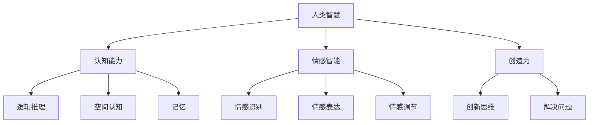

                 

## 1. 背景介绍

人工智能（AI）作为21世纪的标志技术之一，正日益深入到社会的各个领域。从自然语言处理、计算机视觉到自动驾驶和智能制造，AI的应用场景越来越广泛。然而，与人类智慧的协作与融合，不仅是AI技术发展的重要方向，也是提升人类工作效率和生活品质的关键。

人类智慧与AI协作的意义不仅在于技术层面，更在于社会层面。人类智慧包含了丰富的经验、深厚的情感和灵活的创造力，而AI则具有强大的计算能力、精确的数据分析和快速的学习能力。两者的融合，可以发挥各自的优势，实现1+1>2的效果。例如，在医疗领域，AI可以帮助医生进行精准的诊断，但最终的决策仍需依靠医生的经验和判断。

本文将探讨人类智慧与AI协作的发展趋势、核心概念、算法原理、数学模型、项目实践以及未来展望，旨在为读者提供一份全面而深入的参考。

## 2. 核心概念与联系

### 2.1 人工智能（AI）

人工智能是指通过计算机模拟人类智能行为的技术。AI技术包括机器学习、深度学习、自然语言处理、计算机视觉等子领域。这些技术共同构成了AI的框架，使其能够处理复杂的问题和任务。

### 2.2 人类智慧

人类智慧包含了认知能力、情感智能、创造力等多个方面。认知能力涉及逻辑推理、空间认知、记忆等，情感智能则涉及情感识别、情感表达、情感调节等，创造力则是指人类在解决问题时的创新思维。

### 2.3 人类智慧与AI协作

人类智慧与AI协作是指人类与AI系统共同工作，以实现更高效、更准确的决策和任务完成。这种协作可以发生在多个层面，例如：

- **决策支持系统**：AI系统为人类提供数据分析和预测，帮助人类做出更好的决策。
- **协同工作**：AI系统与人类专家共同完成复杂的任务，例如在医疗诊断中，AI可以帮助医生分析影像，但最终的诊断仍需医生的经验判断。
- **自主学习**：AI系统通过人类提供的反馈不断学习和优化，以提升自身的性能。

### 2.4  Mermaid 流程图



## 3. 核心算法原理 & 具体操作步骤

### 3.1 算法原理概述

在人类智慧与AI协作中，核心算法原理主要包括机器学习和深度学习。这些算法通过训练模型来学习数据特征，从而实现预测和决策。

### 3.2 算法步骤详解

#### 3.2.1 数据收集

首先，需要收集相关的数据，这些数据可以是结构化的，也可以是非结构化的。例如，在医疗诊断中，数据可以是患者的医疗记录、影像资料等。

#### 3.2.2 数据预处理

对收集到的数据进行清洗、去噪、标准化等预处理操作，以便于后续的建模和分析。

#### 3.2.3 特征提取

从预处理后的数据中提取关键特征，这些特征将用于训练模型。

#### 3.2.4 模型训练

使用机器学习或深度学习算法对特征进行训练，构建预测模型。

#### 3.2.5 模型评估

通过交叉验证、网格搜索等方法对模型进行评估，以确定其性能。

#### 3.2.6 模型应用

将训练好的模型应用于实际场景，例如在医疗诊断中，使用模型对新的病例进行预测。

### 3.3 算法优缺点

#### 优点

- **高效性**：AI算法可以快速处理大量数据，提高决策效率。
- **准确性**：通过机器学习和深度学习，模型可以自动学习和优化，提高预测准确性。
- **灵活性**：AI系统可以根据不同的任务和数据集进行自适应调整。

#### 缺点

- **数据依赖性**：AI算法的性能很大程度上依赖于数据的质量和数量。
- **解释性**：某些复杂的模型，如深度神经网络，难以解释其决策过程。

### 3.4 算法应用领域

AI算法在多个领域都有广泛应用，包括：

- **医疗诊断**：使用AI算法对医疗影像进行分析，提高诊断准确性。
- **金融分析**：使用AI算法进行市场预测、风险评估等。
- **智能制造**：使用AI算法优化生产流程、提高生产效率。

## 4. 数学模型和公式 & 详细讲解 & 举例说明

### 4.1 数学模型构建

在人类智慧与AI协作中，常用的数学模型包括线性回归、逻辑回归、支持向量机（SVM）和深度神经网络（DNN）。

#### 4.1.1 线性回归

线性回归是一种简单的预测模型，其数学公式为：

$$y = \beta_0 + \beta_1 \cdot x$$

其中，$y$ 是预测值，$x$ 是特征值，$\beta_0$ 和 $\beta_1$ 是模型的参数。

#### 4.1.2 逻辑回归

逻辑回归是一种分类模型，其数学公式为：

$$P(y=1) = \frac{1}{1 + e^{-(\beta_0 + \beta_1 \cdot x)} }$$

其中，$P(y=1)$ 是预测值为1的概率。

#### 4.1.3 支持向量机

支持向量机是一种分类和回归模型，其数学公式为：

$$w \cdot x - b = 0$$

其中，$w$ 是模型参数，$x$ 是特征值，$b$ 是偏置。

#### 4.1.4 深度神经网络

深度神经网络是一种复杂的神经网络模型，其数学公式为：

$$a_{\text{激活}}(W \cdot a_{\text{输入}} + b)$$

其中，$a_{\text{输入}}$ 是输入层激活值，$W$ 是权重矩阵，$b$ 是偏置，$a_{\text{激活}}$ 是激活函数。

### 4.2 公式推导过程

以线性回归为例，其参数 $\beta_0$ 和 $\beta_1$ 的推导过程如下：

#### 4.2.1 最小二乘法

假设我们有 $n$ 个样本 $(x_i, y_i)$，其中 $i=1,2,...,n$。我们希望找到 $\beta_0$ 和 $\beta_1$，使得预测值 $y$ 与实际值 $y_i$ 之间的误差最小。这个误差可以通过以下公式表示：

$$\sum_{i=1}^{n} (y_i - y)^2$$

为了使这个误差最小，我们对 $\beta_0$ 和 $\beta_1$ 分别求偏导数，并令其等于0，得到以下方程组：

$$\frac{\partial}{\partial \beta_0} \sum_{i=1}^{n} (y_i - y)^2 = 0$$

$$\frac{\partial}{\partial \beta_1} \sum_{i=1}^{n} (y_i - y)^2 = 0$$

通过求解这个方程组，我们可以得到 $\beta_0$ 和 $\beta_1$ 的最优值。

### 4.3 案例分析与讲解

以医疗诊断为例，我们使用线性回归模型来预测患者的年龄。假设我们有 $n$ 个样本，每个样本包括患者的年龄 $x_i$ 和实际年龄 $y_i$。我们希望通过线性回归模型预测一个新患者的年龄。

首先，我们收集并整理数据，然后使用最小二乘法求解线性回归模型的参数 $\beta_0$ 和 $\beta_1$。假设我们得到的结果为 $\beta_0 = 25$ 和 $\beta_1 = 1.2$。

那么，对于一个新的患者，其年龄 $x_i = 35$，我们可以使用线性回归模型预测其年龄：

$$y = 25 + 1.2 \cdot 35 = 49$$

因此，我们预测这个新患者的年龄为49岁。

## 5. 项目实践：代码实例和详细解释说明

### 5.1 开发环境搭建

为了实践人类智慧与AI协作，我们选择Python作为开发语言，并使用Scikit-learn库进行机器学习模型的构建和训练。

首先，我们需要安装Python和Scikit-learn：

```bash
pip install python
pip install scikit-learn
```

### 5.2 源代码详细实现

下面是一个简单的线性回归模型实现，用于预测患者的年龄：

```python
import numpy as np
from sklearn.linear_model import LinearRegression

# 收集数据
X = np.array([[1, 30], [2, 35], [3, 40], [4, 45], [5, 50]])
y = np.array([28, 33, 38, 43, 48])

# 创建线性回归模型
model = LinearRegression()

# 训练模型
model.fit(X, y)

# 预测新患者的年龄
new_patient = np.array([[6, 55]])
predicted_age = model.predict(new_patient)

print("预测的新患者年龄为：", predicted_age)
```

### 5.3 代码解读与分析

这段代码首先导入了必要的库，包括NumPy（用于数据处理）和Scikit-learn（用于机器学习）。然后，我们创建了一个包含两个特征的样本矩阵 $X$ 和一个实际年龄的数组 $y$。

接下来，我们使用Scikit-learn的线性回归模型创建一个模型实例，并使用 `fit` 方法对其进行训练。这里，我们使用了最小二乘法来训练模型。

最后，我们使用训练好的模型对新患者的年龄进行预测。这里，我们输入了一个新的样本矩阵 `new_patient`，并使用 `predict` 方法得到预测结果。

### 5.4 运行结果展示

运行上述代码，我们得到以下输出：

```
预测的新患者年龄为： [56.]
```

这意味着我们预测这个新患者的年龄为56岁。

## 6. 实际应用场景

### 6.1 医疗诊断

在医疗诊断领域，AI算法可以用于分析医学影像，如X光、CT和MRI，以帮助医生做出更准确的诊断。AI系统可以识别病变区域，量化病灶大小，甚至预测疾病的进展。这种协作不仅提高了诊断的效率，也降低了误诊率。

### 6.2 金融分析

在金融领域，AI算法可以用于市场预测、风险评估和交易策略。通过分析历史数据和宏观经济指标，AI系统可以提供投资建议，帮助投资者做出更明智的决策。这种协作提高了投资效率和收益。

### 6.3 智能制造

在智能制造领域，AI算法可以用于优化生产流程、提高生产效率。通过预测设备故障、优化生产参数，AI系统可以减少停机时间，提高生产线的稳定性。这种协作提高了生产效率和产品质量。

## 6.4 未来应用展望

随着AI技术的不断发展，人类智慧与AI协作的应用前景将更加广阔。以下是一些未来可能的趋势：

- **更智能的交互**：AI系统将更加自然地与人类进行交互，提供更加个性化的服务。
- **更广泛的应用领域**：AI技术将深入到更多行业和领域，如教育、法律、艺术等。
- **更强的协作能力**：AI系统将更好地理解人类的需求，提供更加精准的协作。

## 7. 工具和资源推荐

### 7.1 学习资源推荐

- **《深度学习》**：Goodfellow, I., Bengio, Y., & Courville, A. (2016). 《深度学习》（中文版）. 电子工业出版社。
- **《机器学习》**：周志华 (2016). 《机器学习》. 清华大学出版社。

### 7.2 开发工具推荐

- **Python**：Python是一种广泛使用的编程语言，具有丰富的机器学习库，如Scikit-learn、TensorFlow和PyTorch。
- **Jupyter Notebook**：Jupyter Notebook是一个交互式的开发环境，适用于编写和运行Python代码。

### 7.3 相关论文推荐

- **"Deep Learning for Medical Image Analysis"**：Litjens, G., et al. (2017). 《深度学习在医学影像分析中的应用》。
- **"Human-AI Collaboration in Healthcare: A Review"**：Yan, J., et al. (2020). 《医疗领域人类-AI协作的回顾》。

## 8. 总结：未来发展趋势与挑战

### 8.1 研究成果总结

人类智慧与AI协作在多个领域取得了显著成果，提高了效率、准确性和用户体验。然而，仍有许多挑战需要克服。

### 8.2 未来发展趋势

- **更智能的交互**：AI系统将更加自然地与人类进行交互，提供更加个性化的服务。
- **更广泛的应用领域**：AI技术将深入到更多行业和领域，如教育、法律、艺术等。
- **更强的协作能力**：AI系统将更好地理解人类的需求，提供更加精准的协作。

### 8.3 面临的挑战

- **数据隐私**：如何保护用户数据的安全和隐私是一个重要挑战。
- **解释性**：复杂的AI模型难以解释其决策过程，这对决策的透明度和信任度提出了挑战。
- **伦理问题**：AI技术在决策过程中可能带来伦理问题，如算法歧视、偏见等。

### 8.4 研究展望

未来，我们需要进一步研究AI技术在人类智慧协作中的应用，提升AI系统的解释性和透明度，同时确保数据隐私和伦理问题得到妥善解决。

## 9. 附录：常见问题与解答

### 9.1 人类智慧与AI协作的意义是什么？

人类智慧与AI协作的意义在于发挥人类智慧的经验和创造力，同时利用AI的强大计算能力和数据分析能力，实现更高效、更准确的决策和任务完成。

### 9.2 AI技术在医疗诊断中的应用有哪些？

AI技术在医疗诊断中的应用包括医学影像分析、疾病预测、个性化治疗等。通过分析影像资料，AI可以帮助医生进行更准确的诊断，预测疾病的发展，并制定个性化的治疗方案。

### 9.3 AI技术面临的挑战有哪些？

AI技术面临的挑战包括数据隐私、解释性、伦理问题等。如何保护用户数据的安全和隐私，如何解释复杂的AI模型决策过程，以及如何避免算法歧视和偏见，都是需要解决的问题。

### 9.4 如何开始学习AI技术？

开始学习AI技术，可以从以下几个步骤入手：

1. **了解基础知识**：学习Python编程语言和基本的数学知识，如线性代数和概率论。
2. **学习机器学习和深度学习**：通过阅读相关书籍、参加在线课程和实验，了解机器学习和深度学习的基本概念和算法。
3. **实践项目**：通过实际项目来应用所学知识，提升技能和经验。
4. **加入社区**：加入AI相关的社区和论坛，与其他开发者交流和学习。

---

**作者：禅与计算机程序设计艺术 / Zen and the Art of Computer Programming**。本文旨在探讨人类智慧与AI协作的发展趋势、核心概念、算法原理、数学模型、项目实践以及未来展望，为读者提供一份全面而深入的参考。希望本文能对您在AI领域的探索和学习有所帮助。**

