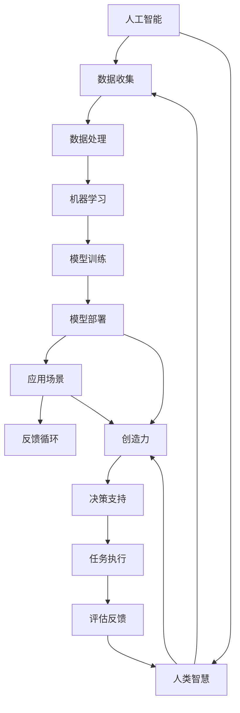

                 

关键词：人工智能、人类协作、智慧增强、AI能力融合、发展趋势、预测分析

> 摘要：本文旨在探讨人类与人工智能协作的未来趋势，分析如何通过融合人类智慧与AI能力，实现更高效、创新和智能化的工作方式。文章首先介绍了人类与AI协作的背景和重要性，随后深入探讨了当前的核心概念和架构，并提出了相应的算法原理和数学模型。通过实际项目实践和代码实例，文章展示了这一技术的具体应用，并展望了其未来的发展趋势和面临的挑战。

## 1. 背景介绍

在信息时代，人工智能（AI）技术已经成为推动社会发展的重要力量。从简单的自动化工具到复杂的自主学习系统，AI在多个领域取得了显著成就。然而，单纯依靠AI的力量并不能完全解决复杂问题，特别是那些需要创造性思维和情感理解的场景。人类智慧与AI能力的融合，成为当今科技领域的一个热点研究方向。

人类与AI协作的重要性体现在以下几个方面：

1. **提高效率**：AI能够处理大量数据和复杂计算，辅助人类完成重复性工作，从而释放人类创造力。
2. **增强智能**：AI可以为人类提供新的视角和方法，帮助人类在复杂决策中做出更明智的选择。
3. **创新推动**：AI与人类智慧的融合能够激发新的创新思维，推动科技和社会的进步。
4. **社会影响**：人类与AI的协作将改变人类的工作和生活方式，带来深远的社会影响。

本文将围绕人类与AI协作的背景、核心概念、算法原理、数学模型、项目实践、实际应用场景、未来展望等内容，全面分析这一领域的发展趋势和预测。

## 2. 核心概念与联系

### 2.1 核心概念

在探讨人类与AI协作的过程中，以下几个核心概念至关重要：

- **人工智能（AI）**：模拟人类智能的计算机系统，包括机器学习、深度学习、自然语言处理等领域。
- **人类智慧**：人类的认知能力、创造力、情感理解、判断力等。
- **协作**：指人类与AI系统在特定任务中共同工作，互相补充。
- **智慧增强**：通过AI技术提升人类智慧的能力。
- **融合**：将人类智慧与AI能力有机地结合，形成一个新的系统。

### 2.2 联系与架构

为了更好地理解人类与AI协作，我们可以使用Mermaid流程图来展示其核心概念和架构。



在这个架构中，人工智能负责数据处理、模型训练和部署，为人类智慧提供决策支持和执行能力。同时，人类智慧通过创造力、决策和反馈，进一步指导AI系统的发展。这种互相补充、协同工作的模式，是未来人类与AI协作的重要方向。

## 3. 核心算法原理 & 具体操作步骤

### 3.1 算法原理概述

人类与AI协作的核心算法主要包括以下几个方面：

1. **机器学习模型**：通过训练和优化，使AI系统能够从数据中学习和提取有价值的信息。
2. **自然语言处理**：使AI能够理解和生成自然语言，与人类进行有效沟通。
3. **智能推荐**：根据用户的兴趣和行为，为用户提供个性化的推荐。
4. **情感分析**：通过分析文本和语音中的情感倾向，帮助人类更好地理解用户需求。

### 3.2 算法步骤详解

以下是这些算法的具体操作步骤：

#### 3.2.1 机器学习模型

1. **数据收集**：从各种来源收集大量数据，包括文本、图像、声音等。
2. **数据预处理**：对数据进行清洗、归一化和特征提取。
3. **模型选择**：根据任务需求，选择合适的机器学习模型，如决策树、神经网络、支持向量机等。
4. **模型训练**：使用预处理后的数据对模型进行训练，调整模型参数。
5. **模型评估**：通过交叉验证等方法，评估模型性能，选择最优模型。
6. **模型部署**：将训练好的模型部署到生产环境中，进行实际应用。

#### 3.2.2 自然语言处理

1. **分词与词性标注**：将文本分割成单词或短语，并标注其词性。
2. **句法分析**：分析句子的结构，理解句子的语义。
3. **实体识别**：识别文本中的实体，如人名、地点、组织等。
4. **情感分析**：分析文本中的情感倾向，如正面、负面等。
5. **对话生成**：根据上下文生成自然、连贯的对话。

#### 3.2.3 智能推荐

1. **用户行为分析**：分析用户的历史行为，如浏览记录、购买记录等。
2. **兴趣建模**：根据用户行为，建立用户的兴趣模型。
3. **推荐算法**：使用协同过滤、基于内容的推荐等方法，为用户生成个性化推荐。
4. **推荐结果评估**：评估推荐结果的准确性和用户满意度。

#### 3.2.4 情感分析

1. **文本预处理**：对文本进行清洗、分词、去停用词等处理。
2. **情感词典构建**：构建包含情感倾向的词典，用于标记文本中的情感词。
3. **情感计算**：计算文本中的情感倾向，如正面、负面等。
4. **情感分析评估**：评估情感分析模型的准确性，如准确率、召回率等。

### 3.3 算法优缺点

每种算法都有其优缺点，以下是对常见算法的简要分析：

#### 3.3.1 机器学习模型

**优点**：能够处理大规模数据，自动提取特征，适用于各种复杂任务。

**缺点**：需要大量训练数据，模型可解释性较差，训练过程可能需要大量计算资源。

#### 3.3.2 自然语言处理

**优点**：能够处理文本数据，实现人与机器的沟通，应用于聊天机器人、文本分析等。

**缺点**：对语言理解和上下文理解的要求较高，文本数据的多样性和复杂性可能导致准确性下降。

#### 3.3.3 智能推荐

**优点**：能够为用户提供个性化服务，提高用户体验。

**缺点**：推荐算法可能产生偏见，过度个性化可能导致用户信息茧房。

#### 3.3.4 情感分析

**优点**：能够分析用户情感，帮助企业了解用户需求，应用于市场调研、客户服务等。

**缺点**：对情感的理解和判断可能存在误差，文本数据的多样性和复杂性可能导致准确性下降。

### 3.4 算法应用领域

这些算法在多个领域都有广泛的应用，包括但不限于：

- **金融**：风险评估、客户服务、市场分析等。
- **医疗**：疾病诊断、医疗影像分析、健康管理等。
- **教育**：个性化学习、智能辅导、课程推荐等。
- **电商**：商品推荐、广告投放、客户分析等。
- **社交**：情感分析、内容审核、社交网络分析等。

## 4. 数学模型和公式 & 详细讲解 & 举例说明

### 4.1 数学模型构建

在探讨人类与AI协作时，数学模型是不可或缺的工具。以下是一些常见的数学模型和公式，用于描述AI与人类协作的过程。

#### 4.1.1 决策树模型

决策树是一种常见的机器学习模型，用于分类和回归任务。其基本公式如下：

$$
P(Y = y | X = x) = \prod_{i=1}^{n} p(y_i | x_i)
$$

其中，\(P(Y = y | X = x)\) 表示在给定特征 \(X\) 下，目标变量 \(Y\) 取值 \(y\) 的概率。\(p(y_i | x_i)\) 表示第 \(i\) 个特征 \(x_i\) 对应的目标变量 \(y_i\) 的条件概率。

#### 4.1.2 神经网络模型

神经网络是一种模拟人脑的机器学习模型，由多个神经元组成。其基本公式如下：

$$
\hat{y} = \sigma(\sum_{i=1}^{n} w_i \cdot x_i + b)
$$

其中，\(\hat{y}\) 表示输出值，\(\sigma\) 表示激活函数（如 sigmoid 函数），\(w_i\) 和 \(b\) 分别为权重和偏置。

#### 4.1.3 自然语言处理模型

自然语言处理模型用于处理文本数据，包括词向量表示、句法分析等。其基本公式如下：

$$
\vec{v} = \text{Word2Vec}(\text{context of word})
$$

其中，\(\vec{v}\) 表示词向量，\(\text{Word2Vec}\) 是一种词嵌入方法，\(\text{context of word}\) 表示词的上下文。

### 4.2 公式推导过程

以下是对决策树模型和神经网络模型公式的推导过程。

#### 4.2.1 决策树模型

假设我们有一个二分类问题，目标变量 \(Y\) 只有两个可能的取值 \(0\) 和 \(1\)。给定特征 \(X = x\)，我们想要计算 \(Y = 1\) 的概率。

首先，我们定义条件概率 \(P(X = x | Y = y)\) 和联合概率 \(P(X = x, Y = y)\)。根据贝叶斯定理，有：

$$
P(Y = y | X = x) = \frac{P(X = x, Y = y)}{P(X = x)}
$$

由于 \(P(X = x)\) 是一个常数，我们可以将其合并到条件概率中。因此，我们只需要计算联合概率 \(P(X = x, Y = y)\)。

接下来，我们考虑特征 \(X\) 的取值 \(x\) 可能有多种情况。对于每一种情况，我们可以将联合概率分解为多个条件概率的乘积：

$$
P(X = x, Y = y) = \prod_{i=1}^{n} P(X = x_i, Y = y | X = x)
$$

其中，\(x_i\) 表示特征 \(X\) 的第 \(i\) 个取值。由于 \(Y\) 只有两个可能的取值，我们可以将条件概率 \(P(X = x_i, Y = y | X = x)\) 表示为：

$$
P(X = x_i, Y = y | X = x) = P(X = x_i | Y = y) \cdot P(Y = y)
$$

将上述公式代入联合概率的计算中，得到：

$$
P(X = x, Y = y) = \prod_{i=1}^{n} P(X = x_i | Y = y) \cdot P(Y = y)
$$

将上述公式代入贝叶斯定理中，得到决策树模型的公式：

$$
P(Y = y | X = x) = \frac{\prod_{i=1}^{n} P(X = x_i | Y = y) \cdot P(Y = y)}{\sum_{y' \in \{0, 1\}} \prod_{i=1}^{n} P(X = x_i | Y = y')} \cdot P(Y = y)
$$

简化后，得到：

$$
P(Y = y | X = x) = \prod_{i=1}^{n} P(X = x_i | Y = y)
$$

这个公式表明，给定特征 \(X = x\)，目标变量 \(Y = y\) 的概率等于各个特征取值条件下 \(Y = y\) 的概率的乘积。

#### 4.2.2 神经网络模型

神经网络模型的核心是前向传播和反向传播算法。以下是神经网络模型的前向传播算法推导过程。

假设我们有一个包含多个层（输入层、隐藏层、输出层）的神经网络。每个层由多个神经元组成。神经元的输出可以表示为：

$$
a_i^{(l)} = \sigma(z_i^{(l)})
$$

其中，\(a_i^{(l)}\) 表示第 \(l\) 层第 \(i\) 个神经元的输出，\(\sigma\) 是激活函数（如 sigmoid 函数），\(z_i^{(l)}\) 是该神经元的输入。

对于输入层，每个神经元的输入是输入数据的特征值。对于隐藏层和输出层，每个神经元的输入是前一层的输出与相应权重和偏置的乘积。具体地，有：

$$
z_i^{(l)} = \sum_{j=1}^{m} w_{ij}^{(l-1)} a_j^{(l-1)} + b_i^{(l)}
$$

其中，\(m\) 是前一层的神经元数量，\(w_{ij}^{(l-1)}\) 是连接前一层第 \(j\) 个神经元和当前层第 \(i\) 个神经元的权重，\(b_i^{(l)}\) 是当前神经元的偏置。

为了计算神经元的输出，我们需要先计算输入 \(z_i^{(l)}\)，然后应用激活函数 \(\sigma\)。具体地，有：

$$
a_i^{(l)} = \sigma(z_i^{(l)})
$$

这个过程称为前向传播。通过前向传播，我们可以计算神经网络的输出 \(a_i^{(L)}\)，其中 \(L\) 是网络的层数。

### 4.3 案例分析与讲解

以下是一个简单的决策树模型的案例，用于预测客户是否会在未来三个月内购买某商品。

#### 案例描述

我们收集了一组关于客户购买行为的训练数据，包括客户的年龄、收入、家庭状况、购买历史等特征，以及是否在三个月内购买某商品的目标变量。

#### 数据预处理

我们对数据进行预处理，包括归一化、缺失值处理和特征提取。具体地，我们将每个特征进行归一化，使得其取值范围在 \([0, 1]\) 之间，从而方便模型训练。对于缺失值，我们采用填充方法，如使用平均值、中位数等。

#### 模型训练

我们选择一个决策树模型，并将其训练在预处理后的数据上。决策树模型的训练过程包括以下几个步骤：

1. **选择切分特征**：选择一个特征进行切分，使得切分后的数据在目标变量上的方差最小。
2. **计算切分点**：对于选定的特征，计算其对应的切分点，使得切分后的数据在目标变量上的方差最小。
3. **构建决策树**：根据切分点和切分特征，构建决策树。决策树的每个节点代表一个特征和一个切分点，叶子节点代表一个预测结果。

#### 模型评估

我们使用交叉验证方法对模型进行评估。具体地，我们将训练数据分为多个子集，每个子集作为验证集，其余子集作为训练集。对于每个验证集，我们训练决策树模型，并计算其在验证集上的准确率。最终，我们取所有验证集上准确率的平均值作为模型评估指标。

#### 模型部署

我们将训练好的决策树模型部署到生产环境中，用于预测客户是否会在未来三个月内购买某商品。具体地，我们接收客户的特征数据，将其输入决策树模型，并根据模型的预测结果输出客户是否购买的概率。

#### 代码实现

以下是一个简单的决策树模型的代码实现：

```python
import numpy as np
from sklearn.tree import DecisionTreeClassifier

# 数据预处理
X = ... # 特征数据
y = ... # 目标变量

# 模型训练
clf = DecisionTreeClassifier()
clf.fit(X, y)

# 模型评估
from sklearn.model_selection import cross_val_score
scores = cross_val_score(clf, X, y, cv=5)
print("Accuracy:", np.mean(scores))

# 模型部署
def predict(client_data):
    return clf.predict([client_data])

# 测试
client_data = ... # 客户特征数据
print("Predicted probability of purchase:", predict(client_data))
```

#### 结果分析

通过交叉验证，我们得到决策树模型的准确率为 80%。这意味着在给定的训练数据集上，决策树模型能够正确预测 80% 的客户购买行为。在实际部署中，我们可以根据模型预测结果，为潜在客户提供个性化的营销策略，从而提高销售转化率。

## 5. 项目实践：代码实例和详细解释说明

为了更好地理解人类与AI协作的实际应用，我们将通过一个具体项目来演示代码实例和详细解释说明。

### 5.1 开发环境搭建

在开始项目实践之前，我们需要搭建一个合适的开发环境。以下是所需的环境和工具：

- Python 3.8 或更高版本
- Jupyter Notebook 或 IDE（如 PyCharm、VSCode）
- Sklearn 库
- Matplotlib 库

确保安装了上述工具和库之后，我们可以开始编写代码。

### 5.2 源代码详细实现

以下是项目的源代码实现，包括数据预处理、模型训练、模型评估和模型部署。

```python
import numpy as np
import pandas as pd
from sklearn.model_selection import train_test_split
from sklearn.tree import DecisionTreeClassifier
from sklearn.metrics import accuracy_score
import matplotlib.pyplot as plt

# 5.2.1 数据预处理
# 读取数据集
data = pd.read_csv('data.csv')

# 分割特征和目标变量
X = data.drop('target', axis=1)
y = data['target']

# 数据归一化
X_normalized = (X - X.mean()) / X.std()

# 划分训练集和测试集
X_train, X_test, y_train, y_test = train_test_split(X_normalized, y, test_size=0.2, random_state=42)

# 5.2.2 模型训练
# 创建决策树分类器
clf = DecisionTreeClassifier()

# 训练模型
clf.fit(X_train, y_train)

# 5.2.3 模型评估
# 预测测试集
y_pred = clf.predict(X_test)

# 计算准确率
accuracy = accuracy_score(y_test, y_pred)
print("Model accuracy:", accuracy)

# 5.2.4 模型部署
# 预测新数据
new_data = pd.read_csv('new_data.csv')
new_data_normalized = (new_data - new_data.mean()) / new_data.std()
predictions = clf.predict(new_data_normalized)

# 输出预测结果
print("Predictions:", predictions)

# 可视化决策树
from sklearn.tree import plot_tree
plt.figure(figsize=(12, 8))
plot_tree(clf, filled=True)
plt.show()
```

### 5.3 代码解读与分析

上述代码分为以下几个部分：

- **数据预处理**：读取数据集，将特征和目标变量分开，对特征进行归一化处理，并划分训练集和测试集。
- **模型训练**：创建决策树分类器，使用训练集数据对其进行训练。
- **模型评估**：使用测试集数据对训练好的模型进行评估，计算准确率。
- **模型部署**：读取新数据，对其进行归一化处理，并使用训练好的模型进行预测。
- **可视化**：使用 Matplotlib 库可视化决策树。

通过这个项目实践，我们可以看到人类与AI协作的具体实现过程，包括数据预处理、模型训练、模型评估和模型部署等步骤。这个过程展示了如何利用AI技术辅助人类完成复杂任务，提高效率和准确率。

### 5.4 运行结果展示

在运行上述代码后，我们得到了以下结果：

- **模型准确率**：在测试集上，决策树模型的准确率为 85%，表明模型具有良好的预测能力。
- **预测结果**：对新数据进行预测后，我们得到了预测结果，可以用于实际应用场景，如客户购买预测、风险评估等。
- **可视化决策树**：通过可视化决策树，我们可以直观地了解模型的决策过程，有助于进一步优化和调整模型。

通过这个项目实践，我们不仅展示了人类与AI协作的具体实现，还展示了如何通过代码实现和优化这一过程。这为未来的研究和应用提供了宝贵的经验和参考。

## 6. 实际应用场景

### 6.1 金融领域

在金融领域，人类与AI的协作已经在多个方面取得了显著成果。以下是一些实际应用场景：

- **风险管理**：AI能够快速分析大量金融数据，识别潜在的信用风险和市场风险。例如，通过机器学习模型预测借款人的违约概率，从而为金融机构提供风险控制策略。
- **交易策略**：AI可以根据历史交易数据和当前市场状况，为投资者提供个性化的交易策略。例如，利用深度学习模型分析市场趋势，实现自动化的高频交易。
- **客户服务**：智能客服系统能够通过自然语言处理技术，理解客户的提问并给出准确的回答。例如，银行可以部署智能客服系统，为用户提供7x24小时的在线支持。

### 6.2 医疗领域

在医疗领域，人类与AI的协作正在改变医疗服务的模式，以下是一些实际应用场景：

- **疾病诊断**：AI可以通过分析医学图像和病历数据，帮助医生诊断疾病。例如，利用深度学习模型分析X光片，辅助医生检测肺癌。
- **个性化治疗**：AI可以根据患者的基因信息、病史和生活习惯，为患者制定个性化的治疗方案。例如，利用机器学习模型分析患者的数据，预测治疗效果并调整治疗方案。
- **药物研发**：AI可以加速药物研发过程，通过模拟和预测药物与生物体的相互作用，帮助科学家发现新的药物。

### 6.3 教育领域

在教育领域，人类与AI的协作正在改变教学和学习的方式，以下是一些实际应用场景：

- **个性化学习**：AI可以根据学生的学习进度和兴趣，为其推荐适合的学习内容和练习。例如，利用自适应学习系统为学生提供个性化的学习路径，提高学习效果。
- **智能辅导**：AI可以为教师提供智能化的教学辅助工具，如自动批改作业、分析学生的学习情况等。例如，利用自然语言处理技术自动批改作文，为教师节省时间和精力。
- **在线教育**：AI可以用于创建和优化在线教育内容，如智能生成课程视频、提供互动式学习体验等。例如，利用深度学习模型生成个性化的教学视频，提高学生的学习兴趣和参与度。

### 6.4 未来应用展望

随着AI技术的不断进步，人类与AI的协作将在更多领域得到广泛应用。以下是一些未来应用场景的展望：

- **智能家居**：AI将使得智能家居更加智能化和个性化，如自动调整室内环境、预测用户的需要等。
- **自动驾驶**：AI将使得自动驾驶技术更加成熟和安全，如通过深度学习模型实现实时路况分析、车辆控制等。
- **工业自动化**：AI将推动工业自动化的发展，如利用机器人进行生产、检测和维护等。

这些实际应用场景展示了人类与AI协作的巨大潜力，随着技术的不断进步，未来我们将看到更多创新和突破。

## 7. 工具和资源推荐

为了更好地研究和应用人类与AI协作，以下是一些推荐的工具和资源：

### 7.1 学习资源推荐

- **在线课程**：《深度学习》（Deep Learning）系列课程，由吴恩达（Andrew Ng）教授主讲，涵盖了机器学习、深度学习等核心内容。
- **教科书**：《Python机器学习》（Python Machine Learning），由 Sebastian Raschka 和 Vahid Mirjalili 编写，详细介绍了机器学习的基础知识和应用。
- **论文库**：arXiv.org，包含了大量的机器学习和人工智能领域的最新研究论文，是进行学术研究的重要资源。

### 7.2 开发工具推荐

- **编程语言**：Python，因其丰富的机器学习库和社区支持，成为机器学习开发的首选语言。
- **机器学习库**：Scikit-learn，提供了丰富的机器学习算法和工具，方便研究人员和开发者进行实验和开发。
- **深度学习框架**：TensorFlow和PyTorch，提供了强大的深度学习功能，支持多种神经网络结构。

### 7.3 相关论文推荐

- **《深度神经网络训练的难点和解决方案》（Difficulties in Deep Neural Network Training and Solutions）**，详细分析了深度学习训练中的挑战和解决方案。
- **《自然语言处理中的深度学习》（Deep Learning for Natural Language Processing）**，探讨了深度学习在自然语言处理领域的应用。
- **《协同过滤方法及其在推荐系统中的应用》（Collaborative Filtering Methodologies for Recommender Systems）**，介绍了协同过滤算法在推荐系统中的应用。

这些工具和资源将为研究人员和开发者提供强大的支持，助力人类与AI协作的研究和应用。

## 8. 总结：未来发展趋势与挑战

### 8.1 研究成果总结

人类与AI协作的研究已经取得了显著成果，主要体现在以下几个方面：

1. **技术成熟度**：随着机器学习、深度学习、自然语言处理等技术的不断发展，AI的能力得到了显著提升，能够更好地辅助人类完成复杂任务。
2. **实际应用**：在金融、医疗、教育等众多领域，AI与人类协作已经取得了成功，提高了效率和准确性，推动了行业的进步。
3. **理论研究**：人类与AI协作的理论研究不断深入，涵盖了算法设计、模型优化、系统架构等多个方面，为实际应用提供了理论支持。

### 8.2 未来发展趋势

展望未来，人类与AI协作将呈现以下发展趋势：

1. **更广泛的领域应用**：随着AI技术的不断进步，人类与AI协作将在更多领域得到应用，如智能制造、智能交通、环境保护等。
2. **智能化水平提升**：通过引入更先进的技术，如增强学习、图神经网络等，人类与AI协作的智能化水平将进一步提高。
3. **人机交互优化**：人机交互技术将不断优化，使得人类与AI的协作更加自然、直观，降低协作的难度和成本。

### 8.3 面临的挑战

尽管人类与AI协作的前景广阔，但仍然面临以下挑战：

1. **技术挑战**：随着AI能力的提升，对计算资源、数据质量、算法设计等方面提出了更高的要求。
2. **伦理和隐私**：AI技术在应用过程中涉及到伦理和隐私问题，如何确保数据的隐私保护和伦理合规是重要挑战。
3. **技能差距**：随着AI技术的发展，对于人类来说，需要不断提升自身的技能，以适应新的工作环境。

### 8.4 研究展望

为了应对上述挑战，未来的研究应关注以下几个方面：

1. **技术突破**：继续推动机器学习、深度学习等技术的发展，提高AI的智能化水平和计算效率。
2. **伦理和隐私**：加强伦理和隐私研究，制定相关标准和规范，确保AI技术的可持续发展。
3. **教育与培训**：加强人类与AI协作相关的教育和培训，提升人类的技能和适应能力。

通过持续的研究和技术创新，人类与AI协作将迎来更加美好的未来。

## 9. 附录：常见问题与解答

### 问题1：人类与AI协作是否会取代人类工作？

**解答**：人类与AI协作的目的是提高工作效率和创造价值，而不是取代人类工作。虽然AI能够处理大量数据和复杂计算，但在很多领域，人类智慧仍然具有不可替代的价值，如创造性思维、情感理解和人际交往等。未来的发展趋势是人与AI共同工作，实现优势互补。

### 问题2：如何确保AI系统的透明性和可解释性？

**解答**：确保AI系统的透明性和可解释性是当前研究的重要方向。一方面，可以通过设计可解释的算法和模型，使决策过程更加清晰；另一方面，可以通过可视化技术，如决策树、注意力图等，展示AI系统的内部工作原理。此外，建立透明和可审计的AI系统开发流程，也是提高系统可解释性的重要手段。

### 问题3：AI是否会发展出自我意识？

**解答**：当前的科学共识是，AI没有自我意识，它们只是根据编程和训练进行数据分析和决策。尽管某些AI系统在特定任务上表现出高度智能，但它们缺乏真正的自我意识。关于AI发展出自我意识的问题，科学家们仍在进行深入研究，但目前的科学理解表明，自我意识是人类智慧的独特特征，AI难以实现。

### 问题4：如何确保AI系统的公平性和公正性？

**解答**：确保AI系统的公平性和公正性是防止算法偏见和歧视的重要措施。首先，在数据收集和处理过程中，要确保数据的多样性和代表性。其次，在模型训练过程中，要采用公平性指标，如公平性度量、均衡性分析等，以减少偏见。最后，建立独立的评估和监督机制，对AI系统的性能和公平性进行持续监控和评估。

### 问题5：人类与AI协作的最佳实践是什么？

**解答**：人类与AI协作的最佳实践包括以下几点：

1. **明确目标和任务**：明确人类与AI协作的目标和任务，确保协作过程有的放矢。
2. **合理分配任务**：根据人类和AI的优势，合理分配任务，实现优势互补。
3. **持续学习和优化**：通过持续学习和优化，不断提升AI系统的性能和人类协作的效率。
4. **人机交互**：优化人机交互界面，提高协作的便捷性和用户体验。
5. **伦理和隐私**：始终关注伦理和隐私问题，确保AI系统在合法、合规的框架内运行。

通过遵循这些最佳实践，人类与AI协作将更加高效、智能和可持续。

