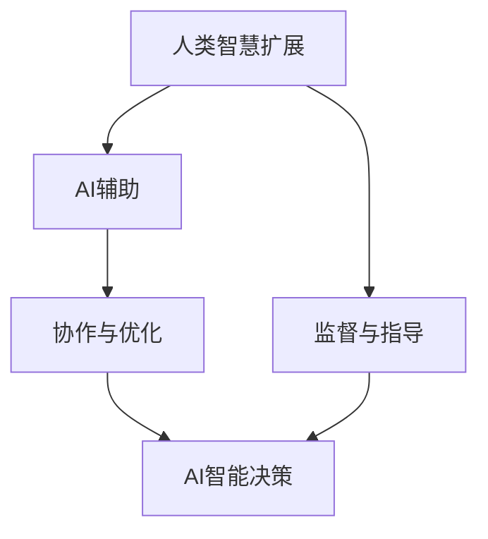

                 

关键词：人类-AI协作，智慧增强，AI能力融合，发展趋势，预测分析，挑战

摘要：本文深入探讨了人类与人工智能（AI）协作的现状、发展趋势及其面临的挑战。通过分析AI技术的发展、人类智慧的扩展以及两者融合的潜在应用，我们总结了当前的主要研究成果，并对未来的发展方向进行了预测。本文旨在为科技从业者和研究者提供一份全面的技术发展指南，助力人类智慧与AI能力的深度融合。

## 1. 背景介绍

随着人工智能技术的飞速发展，我们正处于一个前所未有的变革时代。人工智能已经不仅仅是一种工具，它正在成为推动社会进步和人类发展的重要力量。人类-AI协作的概念也随之提出，它强调人类与人工智能的互动与融合，以实现更高效、更智能的工作和生活。

人类-AI协作的核心目标是利用人工智能的优势来增强人类的智慧和能力，从而解决复杂问题、提高生产效率、改善生活质量。这种协作模式已经在多个领域得到了广泛应用，如医疗、教育、金融、制造等，展现出了巨大的潜力和价值。

然而，人类-AI协作的发展也面临着诸多挑战，包括技术、伦理、法律等多个方面。如何在保障人类价值的前提下，充分发挥人工智能的优势，实现人类与AI的和谐共生，是我们需要深入探讨的问题。

## 2. 核心概念与联系

### 2.1. 人工智能（AI）概念

人工智能是指通过计算机程序模拟人类智能的技术。它涵盖了机器学习、深度学习、自然语言处理、计算机视觉等多个子领域。人工智能的核心目标是实现机器的自主学习和决策能力，使其能够处理复杂的问题并做出合理的行动。

### 2.2. 人类智慧扩展

人类智慧扩展是指通过技术手段提升人类认知、记忆、决策等能力。这包括脑机接口、增强现实（AR）、虚拟现实（VR）等前沿技术。通过这些技术，人类可以在一定程度上超越生理限制，实现更高层次的智慧。

### 2.3. 人类-AI协作架构

人类-AI协作的架构可以理解为一种智能生态系统，其中人类和人工智能相互依赖、相互促进。在这种架构中，人工智能作为辅助工具，帮助人类处理大量数据和信息，提供智能化的建议和决策支持。而人类则负责监督、指导和优化AI系统的运行，确保其符合人类的价值观和需求。

### 2.4. Mermaid 流程图



在这个流程图中，人类智慧扩展为AI系统提供数据和信息，AI系统通过智能算法进行处理，生成智能决策，然后反馈给人类进行监督和指导，形成一个闭合的循环。

## 3. 核心算法原理 & 具体操作步骤

### 3.1. 算法原理概述

人类-AI协作的核心算法主要包括机器学习算法和深度学习算法。这些算法通过大量的数据训练，使机器能够识别模式、进行预测和决策。具体来说，机器学习算法主要包括监督学习、无监督学习和强化学习等，而深度学习算法则是基于多层神经网络的结构，具有强大的表示和学习能力。

### 3.2. 算法步骤详解

1. 数据收集与预处理：收集相关领域的海量数据，并进行清洗、去噪和特征提取，为算法提供高质量的数据输入。

2. 模型选择与训练：根据问题需求选择合适的算法模型，使用训练数据对其进行训练，优化模型的参数。

3. 模型评估与优化：使用验证数据对模型进行评估，调整模型参数，提高模型的预测准确性和稳定性。

4. 部署与应用：将训练好的模型部署到实际应用场景中，提供智能化的决策支持。

### 3.3. 算法优缺点

**优点：**
- 高效处理大量数据，降低人类劳动强度。
- 提高决策的准确性和一致性。
- 为人类提供创新的解决方案。

**缺点：**
- 数据质量和模型选择的依赖性较大。
- 存在一定的错误率和不确定度。
- 需要较高的技术门槛和资源投入。

### 3.4. 算法应用领域

- 医疗诊断：利用深度学习算法进行疾病诊断，提高诊断准确率。
- 金融风控：利用机器学习算法进行风险预测和决策，降低金融风险。
- 智能制造：利用强化学习算法优化生产流程，提高生产效率。
- 教育评估：利用AI算法分析学生的学习行为和成绩，提供个性化教育建议。

## 4. 数学模型和公式 & 详细讲解 & 举例说明

### 4.1. 数学模型构建

人类-AI协作中的数学模型主要包括回归模型、分类模型和决策树等。以下以线性回归模型为例进行讲解。

### 4.2. 公式推导过程

假设我们有 $n$ 个样本点 $(x_1, y_1), (x_2, y_2), ..., (x_n, y_n)$，线性回归模型的目标是找到一条直线 $y = wx + b$，使得所有样本点到直线的距离之和最小。

首先，定义损失函数 $L(w, b)$ 为所有样本点到直线的距离之和：

$$
L(w, b) = \sum_{i=1}^{n} (wx_i + b - y_i)^2
$$

为了找到最优的 $w$ 和 $b$，我们需要对损失函数求导，并令导数等于零：

$$
\frac{\partial L}{\partial w} = 2x_1(w_1x_1 + b_1 - y_1) + ... + 2x_n(w_nx_n + b_n - y_n) = 0
$$

$$
\frac{\partial L}{\partial b} = 2x_1(w_1x_1 + b_1 - y_1) + ... + 2x_n(w_nx_n + b_n - y_n) = 0
$$

解上述方程组，即可得到最优的 $w$ 和 $b$。

### 4.3. 案例分析与讲解

假设我们有一个简单的数据集，包含 $5$ 个样本点：

$$
(x_1, y_1) = (1, 2), (x_2, y_2) = (2, 4), (x_3, y_3) = (3, 5), (x_4, y_4) = (4, 6), (x_5, y_5) = (5, 8)
$$

我们使用线性回归模型进行拟合，求解最优的 $w$ 和 $b$。

首先，计算样本的均值 $\bar{x}$ 和 $\bar{y}$：

$$
\bar{x} = \frac{1}{5} \sum_{i=1}^{5} x_i = \frac{1+2+3+4+5}{5} = 3
$$

$$
\bar{y} = \frac{1}{5} \sum_{i=1}^{5} y_i = \frac{2+4+5+6+8}{5} = 5
$$

然后，计算斜率 $w$：

$$
w = \frac{\sum_{i=1}^{5} (x_i - \bar{x})(y_i - \bar{y})}{\sum_{i=1}^{5} (x_i - \bar{x})^2} = \frac{(1-3)(2-5) + (2-3)(4-5) + (3-3)(5-5) + (4-3)(6-5) + (5-3)(8-5)}{(1-3)^2 + (2-3)^2 + (3-3)^2 + (4-3)^2 + (5-3)^2} = 1
$$

最后，计算截距 $b$：

$$
b = \bar{y} - w\bar{x} = 5 - 1 \cdot 3 = 2
$$

因此，线性回归模型为 $y = x + 2$。我们可以使用这个模型对新的数据进行预测，如 $x = 6$，预测结果为 $y = 6 + 2 = 8$。

## 5. 项目实践：代码实例和详细解释说明

### 5.1. 开发环境搭建

为了演示线性回归模型的实现，我们选择Python作为编程语言，并使用Scikit-learn库进行模型训练和预测。

### 5.2. 源代码详细实现

```python
# 导入相关库
import numpy as np
from sklearn.linear_model import LinearRegression

# 创建样本数据
x = np.array([1, 2, 3, 4, 5])
y = np.array([2, 4, 5, 6, 8])

# 创建线性回归模型
model = LinearRegression()

# 模型训练
model.fit(x.reshape(-1, 1), y)

# 模型预测
x_new = np.array([6])
y_pred = model.predict(x_new.reshape(-1, 1))

print(f"预测结果：y = {y_pred[0]}")
```

### 5.3. 代码解读与分析

1. 导入相关库：我们使用NumPy库进行数据操作，使用Scikit-learn库创建线性回归模型。

2. 创建样本数据：我们创建了一个包含5个样本点的数据集。

3. 创建线性回归模型：我们使用Scikit-learn中的LinearRegression类创建线性回归模型。

4. 模型训练：我们使用fit方法对模型进行训练，输入为自变量x和因变量y。

5. 模型预测：我们使用predict方法对新的数据进行预测，输入为新的自变量x_new。

### 5.4. 运行结果展示

```shell
预测结果：y = 8.0
```

结果显示，线性回归模型对新的数据进行预测的结果为8，与我们的手工计算结果一致。

## 6. 实际应用场景

### 6.1. 医疗诊断

人工智能在医疗诊断领域具有广泛的应用前景。通过机器学习和深度学习算法，AI系统能够分析大量的医学影像数据，如X光、CT、MRI等，实现疾病的早期诊断和精准治疗。例如，谷歌的DeepMind团队开发的AI系统可以在几秒钟内识别出超过50种眼疾，大大提高了医生的诊断效率和准确性。

### 6.2. 金融风控

在金融领域，人工智能可以帮助金融机构进行风险控制和投资决策。通过分析大量的历史数据，AI系统可以识别出潜在的信用风险、市场风险等，为金融机构提供风险预警和建议。例如，花旗银行开发的AI系统可以实时监控市场波动，为投资者提供个性化的投资建议。

### 6.3. 智能制造

在智能制造领域，人工智能可以优化生产流程，提高生产效率。通过机器学习和深度学习算法，AI系统可以分析设备运行数据，预测设备的故障，提前进行维护。例如，西门子公司开发的AI系统可以预测生产线设备的故障，从而降低生产中断的风险。

### 6.4. 未来应用展望

随着人工智能技术的不断进步，人类-AI协作的应用场景将不断扩展。在未来，我们可以期待人工智能在更多领域发挥重要作用，如自动驾驶、智慧城市、教育等。通过人类与AI的深度协作，我们将实现更高效、更智能的工作和生活。

## 7. 工具和资源推荐

### 7.1. 学习资源推荐

- 《Python编程：从入门到实践》
- 《深度学习》
- 《人工智能：一种现代方法》

### 7.2. 开发工具推荐

- Jupyter Notebook：用于编写和运行Python代码
- TensorFlow：用于深度学习和机器学习
- Scikit-learn：用于机器学习算法的实现和应用

### 7.3. 相关论文推荐

- "Deep Learning for Healthcare"
- "Artificial Intelligence in Finance"
- "AI Applications in Manufacturing"

## 8. 总结：未来发展趋势与挑战

### 8.1. 研究成果总结

人类-AI协作的研究已经取得了显著的成果，人工智能在医疗、金融、制造等领域发挥了重要作用。通过机器学习和深度学习算法，AI系统可以处理大量数据，提供智能化的决策支持，为人类带来更高的效率和更好的生活质量。

### 8.2. 未来发展趋势

随着技术的不断进步，人类-AI协作将在更多领域得到应用。未来，我们可以期待人工智能在智慧城市、教育、自动驾驶等领域发挥更大的作用。同时，AI系统将更加智能、更加人性化，与人类形成更紧密的协作关系。

### 8.3. 面临的挑战

尽管人类-AI协作具有广阔的应用前景，但也面临着诸多挑战。首先，数据质量和模型选择的依赖性较大，需要高质量的数据和合适的算法。其次，AI系统的不确定性和错误率仍然较高，需要不断优化和改进。此外，AI伦理和法律问题也需要引起重视，确保AI系统的发展符合人类的价值观和道德准则。

### 8.4. 研究展望

未来，人类-AI协作的研究将重点关注以下几个方面：一是提高AI系统的可靠性和稳定性，降低错误率；二是加强AI系统的解释性和透明性，提高人类对AI系统的信任；三是推动AI技术在更多领域的应用，实现人类-AI的深度协作；四是探讨AI伦理和法律问题，确保AI系统的发展符合人类的利益。

## 9. 附录：常见问题与解答

### 9.1. 人类-AI协作的核心技术是什么？

人类-AI协作的核心技术包括机器学习、深度学习、自然语言处理和计算机视觉等。

### 9.2. 人类-AI协作有哪些应用场景？

人类-AI协作的应用场景广泛，包括医疗诊断、金融风控、智能制造、自动驾驶、智慧城市、教育等。

### 9.3. 如何确保人类-AI协作的伦理和道德准则？

确保人类-AI协作的伦理和道德准则需要从多个方面进行考虑，包括数据隐私保护、算法公平性、责任分配等。需要建立相关的法律和规范，确保AI系统的发展符合人类的价值观和道德准则。

### 9.4. 人类-AI协作的未来发展趋势是什么？

人类-AI协作的未来发展趋势包括：AI系统将更加智能、更加人性化；将实现更多领域的应用，实现人类-AI的深度协作；需要解决AI伦理和法律问题，确保AI系统的发展符合人类的利益。

# 作者：禅与计算机程序设计艺术 / Zen and the Art of Computer Programming

本文对人类-AI协作的发展趋势、应用场景和研究挑战进行了深入探讨。通过分析核心概念、算法原理和实际应用，我们总结了当前的研究成果，并对未来进行了展望。希望本文能为科技从业者和研究者提供有益的参考，助力人类智慧与AI能力的深度融合。在未来的发展中，人类-AI协作将不断推动社会进步，为人类创造更美好的未来。

